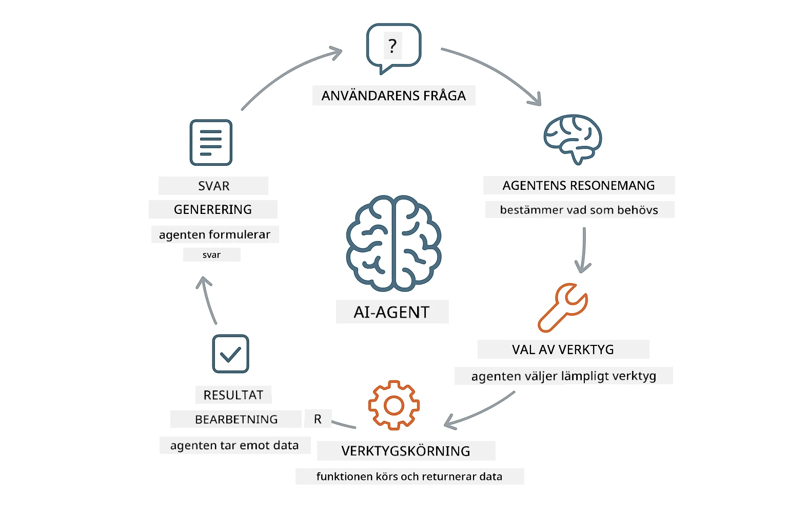
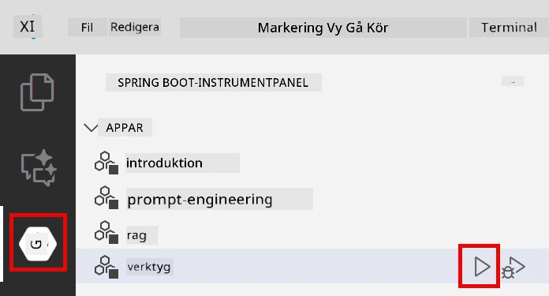

# Modul 04: AI-agenter med verktyg

## Innehållsförteckning

- [Vad du kommer att lära dig](../../../04-tools)
- [Förkunskaper](../../../04-tools)
- [Förstå AI-agenter med verktyg](../../../04-tools)
- [Hur verktygsanrop fungerar](../../../04-tools)
  - [Verktygsdefinitioner](../../../04-tools)
  - [Beslutsfattande](../../../04-tools)
  - [Utförande](../../../04-tools)
  - [Generering av svar](../../../04-tools)
- [Verktygskedjning](../../../04-tools)
- [Kör applikationen](../../../04-tools)
- [Använd applikationen](../../../04-tools)
  - [Testa enkel verktygsanvändning](../../../04-tools)
  - [Testa verktygskedjning](../../../04-tools)
  - [Se samtalsflödet](../../../04-tools)
  - [Experimentera med olika förfrågningar](../../../04-tools)
- [Nyckelkoncept](../../../04-tools)
  - [ReAct-mönstret (resonemang och agerande)](../../../04-tools)
  - [Verktygsbeskrivningar är viktiga](../../../04-tools)
  - [Sessionshantering](../../../04-tools)
  - [Felhantering](../../../04-tools)
- [Tillgängliga verktyg](../../../04-tools)
- [När man ska använda verktygsbaserade agenter](../../../04-tools)
- [Nästa steg](../../../04-tools)

## What You'll Learn

Hittills har du lärt dig att ha konversationer med AI, att strukturera prompts effektivt och att förankra svar i dina dokument. Men det finns fortfarande en grundläggande begränsning: språkmodeller kan bara generera text. De kan inte kolla vädret, utföra beräkningar, fråga databaser eller interagera med externa system.

Verktyg ändrar detta. Genom att ge modellen tillgång till funktioner den kan anropa, förvandlar du den från en textgenerator till en agent som kan agera. Modellen bestämmer när den behöver ett verktyg, vilket verktyg den ska använda och vilka parametrar som ska skickas. Din kod utför funktionen och skickar tillbaka resultatet. Modellen införlivar sedan detta resultat i sitt svar.

## Förkunskaper

- Genomgången modul 01 (Azure OpenAI-resurser utplacerade)
- `.env`-fil i rotkatalogen med Azure-autentisering (skapas av `azd up` i modul 01)

> **Obs:** Om du inte har slutfört modul 01, följ först distributionsinstruktionerna där.

## Förstå AI-agenter med verktyg

> **📝 Obs:** Termen "agenter" i denna modul syftar på AI-assistenter förbättrade med verktygsanropsmöjligheter. Detta skiljer sig från **Agentic AI**-mönstren (autonoma agenter med planering, minne och flerstegsresonemang) som vi kommer att behandla i [Modul 05: MCP](../05-mcp/README.md).

En AI-agent med verktyg följer ett resonemangs- och agerandemönster (ReAct):

1. Användaren ställer en fråga
2. Agenten resonerar kring vad den behöver veta
3. Agenten avgör om den behöver ett verktyg för att svara
4. Om ja, anropar agenten lämpligt verktyg med rätt parametrar
5. Verktyget utför och returnerar data
6. Agenten införlivar resultatet och ger det slutgiltiga svaret



*ReAct-mönstret – hur AI-agenter växlar mellan resonemang och agerande för att lösa problem*

Detta sker automatiskt. Du definierar verktygen och deras beskrivningar. Modellen hanterar beslutsfattandet om när och hur de ska användas.

## Hur verktygsanrop fungerar

### Verktygsdefinitioner

[WeatherTool.java](../../../04-tools/src/main/java/com/example/langchain4j/agents/tools/WeatherTool.java) | [TemperatureTool.java](../../../04-tools/src/main/java/com/example/langchain4j/agents/tools/TemperatureTool.java)

Du definierar funktioner med tydliga beskrivningar och parameter-specifikationer. Modellen ser dessa beskrivningar i sitt systemprompt och förstår vad varje verktyg gör.

```java
@Component
public class WeatherTool {
    
    @Tool("Get the current weather for a location")
    public String getCurrentWeather(@P("Location name") String location) {
        // Din väderuppslagslogik
        return "Weather in " + location + ": 22°C, cloudy";
    }
}

@AiService
public interface Assistant {
    String chat(@MemoryId String sessionId, @UserMessage String message);
}

// Assistenten är automatiskt kopplad av Spring Boot med:
// - ChatModel bean
// - Alla @Tool-metoder från @Component-klasser
// - ChatMemoryProvider för sessionshantering
```

> **🤖 Prova med [GitHub Copilot](https://github.com/features/copilot) Chat:** Öppna [`WeatherTool.java`](../../../04-tools/src/main/java/com/example/langchain4j/agents/tools/WeatherTool.java) och fråga:
> - "Hur skulle jag integrera en riktig väder-API som OpenWeatherMap istället för simulerade data?"
> - "Vad kännetecknar en bra verktygsbeskrivning som hjälper AI att använda verktyget korrekt?"
> - "Hur hanterar jag API-fel och begränsningar i verktygsimplementationer?"

### Beslutsfattande

När en användare frågar "Hur är vädret i Seattle?" känner modellen igen att den behöver väderverktyget. Den genererar ett funktionsanrop med platsparametern satt till "Seattle".

### Utförande

[AgentService.java](../../../04-tools/src/main/java/com/example/langchain4j/agents/service/AgentService.java)

Spring Boot autowirar det deklarativa `@AiService`-gränssnittet med alla registrerade verktyg, och LangChain4j utför verktygsanrop automatiskt.

> **🤖 Prova med [GitHub Copilot](https://github.com/features/copilot) Chat:** Öppna [`AgentService.java`](../../../04-tools/src/main/java/com/example/langchain4j/agents/service/AgentService.java) och fråga:
> - "Hur fungerar ReAct-mönstret och varför är det effektivt för AI-agenter?"
> - "Hur beslutar agenten vilket verktyg som ska användas och i vilken ordning?"
> - "Vad händer om ett verktygsutförande misslyckas – hur bör jag hantera fel på ett robust sätt?"

### Generering av svar

Modellen får väderdata och formaterar det till ett naturligt språk-svar för användaren.

### Varför använda deklarativa AI-tjänster?

Denna modul använder LangChain4js Spring Boot-integration med deklarativa `@AiService`-gränssnitt:

- **Spring Boot autowiring** – ChatModel och verktyg injiceras automatiskt
- **@MemoryId-mönster** – Automatisk sessionbaserad minneshantering
- **En instans** – Assistent skapas en gång och återanvänds för bättre prestanda
- **Typsäkert utförande** – Java-metoder anropas direkt med typkonvertering
- **Multi-turn orkestrering** – Hanterar verktygskedjning automatiskt
- **Ingen boilerplate** – Inga manuella AiServices.builder()-anrop eller HashMap för minne

Alternativa tillvägagångssätt (manuella `AiServices.builder()`) kräver mer kod och saknar Spring Boot-integrationsfördelar.

## Verktygskedjning

**Verktygskedjning** – AI kan anropa flera verktyg i följd. Fråga "Hur är vädret i Seattle och ska jag ta med ett paraply?" och se hur det kedjar ihop `getCurrentWeather` med resonemang om regnkläder.

<a href="images/tool-chaining.png"></a>

*Sekventiella verktygsanrop – en verktygs output matas in i nästa beslut*

**Smidiga fel** – Fråga om vädret i en stad som inte finns i simuleringsdata. Verktyget returnerar ett felmeddelande och AI förklarar att det inte kan hjälpa. Verktyg misslyckas säkert.

Detta sker i ett enda samtalsturn. Agenten orkestrerar flera verktygsanrop autonomt.

## Kör applikationen

**Verifiera distribution:**

Se till att `.env`-filen finns i rotkatalogen med Azure-autentisering (skapad under modul 01):
```bash
cat ../.env  # Bör visa AZURE_OPENAI_ENDPOINT, API_KEY, DEPLOYMENT
```

**Starta applikationen:**

> **Obs:** Om du redan startat alla applikationer med `./start-all.sh` från modul 01, kör denna modul redan på port 8084. Du kan hoppa över startkommandona nedan och gå direkt till http://localhost:8084.

**Alternativ 1: Använd Spring Boot Dashboard (rekommenderas för VS Code-användare)**

Utvecklingscontainern inkluderar Spring Boot Dashboard-tillägget som ger ett visuellt gränssnitt för att hantera alla Spring Boot-appar. Du hittar det i aktivitetsfältet till vänster i VS Code (titta efter Spring Boot-ikonen).

Från Spring Boot Dashboard kan du:
- Se alla tillgängliga Spring Boot-appar i arbetsytan
- Starta/stoppa appar med ett klick
- Visa applikationsloggar i realtid
- Övervaka applikationsstatus

Klicka bara på play-knappen bredvid "tools" för att starta denna modul, eller starta alla moduler samtidigt.



**Alternativ 2: Använd shell-skript**

Starta alla webbapplikationer (moduler 01-04):

**Bash:**
```bash
cd ..  # Från rotkatalogen
./start-all.sh
```

**PowerShell:**
```powershell
cd ..  # Från rotmappen
.\start-all.ps1
```

Eller starta endast denna modul:

**Bash:**
```bash
cd 04-tools
./start.sh
```

**PowerShell:**
```powershell
cd 04-tools
.\start.ps1
```

Båda skripten laddar automatiskt miljövariabler från rotens `.env`-fil och bygger JAR-filerna om de inte finns.

> **Obs:** Om du föredrar att bygga alla moduler manuellt innan start:
>
> **Bash:**
> ```bash
> cd ..  # Go to root directory
> mvn clean package -DskipTests
> ```
>
> **PowerShell:**
> ```powershell
> cd ..  # Go to root directory
> mvn clean package -DskipTests
> ```

Öppna http://localhost:8084 i din webbläsare.

**För att stoppa:**

**Bash:**
```bash
./stop.sh  # Endast denna modul
# Eller
cd .. && ./stop-all.sh  # Alla moduler
```

**PowerShell:**
```powershell
.\stop.ps1  # Endast denna modul
# Eller
cd ..; .\stop-all.ps1  # Alla moduler
```

## Använd applikationen

Applikationen erbjuder ett webbgränssnitt där du kan interagera med en AI-agent som har tillgång till verktyg för väder och temperaturkonvertering.

<a href="images/tools-homepage.png"></a>

*AI Agent Tools-gränssnittet – snabba exempel och chattgränssnitt för att interagera med verktyg*

### Testa enkel verktygsanvändning

Börja med en enkel förfrågan: "Konvertera 100 grader Fahrenheit till Celsius". Agenten känner igen att den behöver temperaturkonverteringsverktyget, anropar det med rätt parametrar och returnerar resultatet. Lägg märke till hur naturligt detta känns – du specificerade inte vilket verktyg som skulle användas eller hur det skulle anropas.

### Testa verktygskedjning

Testa nu något mer komplext: "Hur är vädret i Seattle och konvertera det till Fahrenheit?" Se hur agenten arbetar steg för steg. Den hämtar först vädret (som returnerar Celsius), förstår att det behöver konverteras till Fahrenheit, anropar konverteringsverktyget och kombinerar båda resultaten i ett svar.

### Se samtalsflödet

Chattgränssnittet sparar samtalshistorik så att du kan ha flerstegsinteraktioner. Du kan se alla tidigare frågor och svar, vilket gör det enkelt att följa konversationen och förstå hur agenten bygger kontext över flera utbyten.

<a href="images/tools-conversation-demo.png"></a>

*Flerstegsamtal som visar enkla konverteringar, väderuppslag och verktygskedjning*

### Experimentera med olika förfrågningar

Testa olika kombinationer:
- Väderuppslag: "Hur är vädret i Tokyo?"
- Temperaturkonverteringar: "Vad är 25°C i Kelvin?"
- Kombinerade frågor: "Kolla vädret i Paris och berätta om det är över 20°C"

Lägg märke till hur agenten tolkar naturligt språk och mappar det till lämpliga verktygsanrop.

## Nyckelkoncept

### ReAct-mönstret (resonemang och agerande)

Agenten växlar mellan resonemang (avgöra vad som ska göras) och agerande (använda verktyg). Detta mönster möjliggör autonom problemlösning snarare än bara att svara på instruktioner.

### Verktygsbeskrivningar är viktiga

Kvaliteten på dina verktygsbeskrivningar påverkar direkt hur väl agenten använder dem. Tydliga, specifika beskrivningar hjälper modellen att förstå när och hur varje verktyg ska anropas.

### Sessionshantering

`@MemoryId`-annoteringen aktiverar automatisk sessionbaserad minneshantering. Varje session-ID får en egen `ChatMemory`-instans hanterad av `ChatMemoryProvider` bean, vilket eliminerar behovet av manuell minnesuppföljning.

### Felhantering

Verktyg kan misslyckas – API:er kan timeouta, parametrar kan vara ogiltiga, externa tjänster kan gå ner. Produktionsagenter behöver felhantering så att modellen kan förklara problem eller försöka alternativ.

## Tillgängliga verktyg

**Väderverktyg** (simulerade data för demonstration):
- Hämta aktuellt väder för en plats
- Få flerdygnsprognos

**Verktyg för temperaturkonvertering**:
- Celsius till Fahrenheit
- Fahrenheit till Celsius
- Celsius till Kelvin
- Kelvin till Celsius
- Fahrenheit till Kelvin
- Kelvin till Fahrenheit

Dessa är enkla exempel, men mönstret kan utvidgas till vilken funktion som helst: databasfrågor, API-anrop, beräkningar, filoperationer eller systemkommandon.

## När man ska använda verktygsbaserade agenter

**Använd verktyg när:**
- Svar kräver realtidsdata (väder, aktiekurser, lager)
- Du behöver göra beräkningar utöver enkel matematik
- Åtkomst till databaser eller API:er
- Utföra åtgärder (skicka e-post, skapa ärenden, uppdatera poster)
- Kombinera flera datakällor

**Använd inte verktyg när:**
- Frågor kan besvaras från allmän kunskap
- Svar är rent konversationella
- Verktygslatens gör upplevelsen för långsam

## Nästa steg

**Nästa modul:** [05-mcp - Model Context Protocol (MCP)](../05-mcp/README.md)

---

**Navigering:** [← Föregående: Modul 03 - RAG](../03-rag/README.md) | [Tillbaka till start](../README.md) | [Nästa: Modul 05 - MCP →](../05-mcp/README.md)

---

<!-- CO-OP TRANSLATOR DISCLAIMER START -->
**Ansvarsfriskrivning**:
Detta dokument har översatts med hjälp av AI-översättningstjänsten [Co-op Translator](https://github.com/Azure/co-op-translator). Även om vi strävar efter noggrannhet, bör du vara medveten om att automatiska översättningar kan innehålla fel eller brister. Det ursprungliga dokumentet på dess ursprungliga språk bör anses vara den auktoritativa källan. För kritisk information rekommenderas professionell mänsklig översättning. Vi ansvarar inte för eventuella missförstånd eller feltolkningar som uppstår från användningen av denna översättning.
<!-- CO-OP TRANSLATOR DISCLAIMER END -->