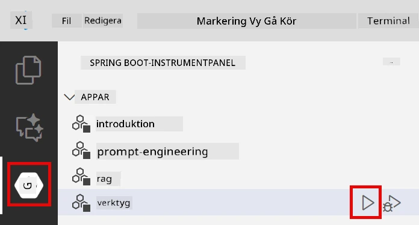
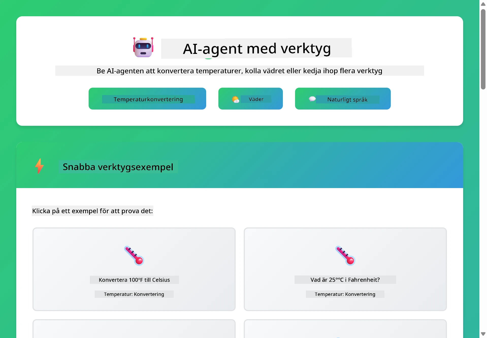
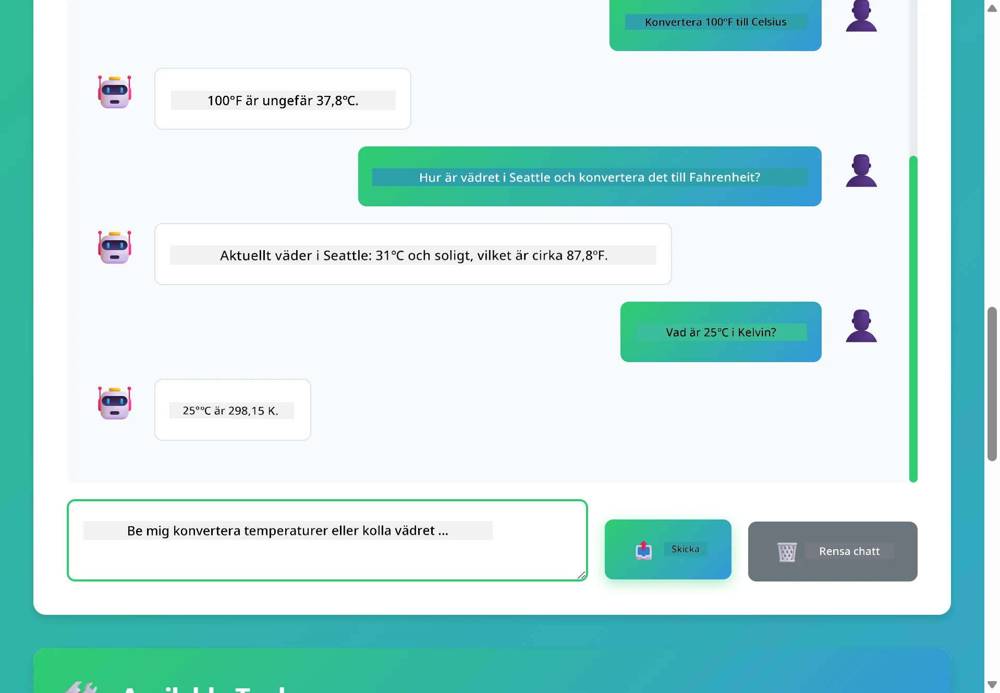

# Modul 04: AI-agenter med verktyg

## Innehållsförteckning

- [Videogenomgång](#videogenomgång)
- [Vad du kommer lära dig](#vad-du-kommer-lära-dig)
- [Förkunskaper](#förkunskaper)
- [Att förstå AI-agenter med verktyg](#att-förstå-ai-agenter-med-verktyg)
- [Hur verktygsanrop fungerar](#hur-verktygsanrop-fungerar)
  - [Verktygsdefinitioner](#verktygsdefinitioner)
  - [Beslutsfattande](#beslutsfattande)
  - [Utförande](#utförande)
  - [Generering av svar](#generering-av-svar)
  - [Arkitektur: Spring Boot Auto-Wiring](#arkitektur-spring-boot-auto-wiring)
- [Verktygskedjning](#verktygskedjning)
- [Kör applikationen](#kör-applikationen)
- [Använda applikationen](#använda-applikationen)
  - [Testa enkel verktygsanvändning](#prova-enkel-verktygsanvändning)
  - [Testa verktygskedjning](#testa-verktygskedjning)
  - [Se samtalets flöde](#se-konversationsflödet)
  - [Experimentera med olika förfrågningar](#experimentera-med-olika-förfrågningar)
- [Nyckelkoncept](#viktiga-begrepp)
  - [ReAct-mönstret (Resonerande och Agirande)](#react-mönstret-resonemang-och-handling)
  - [Verktygsbeskrivningar är viktiga](#verktygsbeskrivningar-är-viktiga)
  - [Sessionshantering](#sessionshantering)
  - [Felfångst](#felhantering)
- [Tillgängliga verktyg](#tillgängliga-verktyg)
- [När man ska använda verktygsbaserade agenter](#när-man-ska-använda-verktygsbaserade-agenter)
- [Verktyg vs RAG](#verktyg-vs-rag)
- [Nästa steg](#nästa-steg)

## Videogenomgång

Titta på denna livesession som förklarar hur du kommer igång med denna modul:

<a href="https://www.youtube.com/watch?v=O_J30kZc0rw"></a>

## Vad du kommer lära dig

Hittills har du lärt dig hur man för samtal med AI, strukturerar promptar effektivt och förankrar svar i dina dokument. Men det finns fortfarande en grundläggande begränsning: språkmodeller kan bara generera text. De kan inte kolla vädret, göra beräkningar, fråga databaser eller interagera med externa system.

Verktyg förändrar detta. Genom att ge modellen åtkomst till funktioner den kan anropa förvandlar du den från en textgenerator till en agent som kan utföra handlingar. Modellen bestämmer när den behöver ett verktyg, vilket verktyg den ska använda och vilka parametrar som ska skickas med. Din kod utför funktionen och returnerar resultatet. Modellen inkorporerar sedan detta resultat i sitt svar.

## Förkunskaper

- Genomförd [Modul 01 - Introduktion](../01-introduction/README.md) (Azure OpenAI-resurser deployerade)
- Tidigare moduler rekommenderas (denna modul refererar till [RAG-koncept från Modul 03](../03-rag/README.md) i jämförelsen mellan Verktyg och RAG)
- `.env`-fil i rotmappen med Azure-referenser (skapad av `azd up` i Modul 01)

> **Notera:** Om du inte har genomfört Modul 01, följ först deploymentsinstruktionerna där.

## Att förstå AI-agenter med verktyg

> **📝 Notera:** Termen "agenter" i denna modul syftar på AI-assistenter med förmåga att anropa verktyg. Detta skiljer sig från **Agentic AI**-mönstren (autonoma agenter med planering, minne och flerstegsresonemang) som vi behandlar i [Modul 05: MCP](../05-mcp/README.md).

Utan verktyg kan en språkmodell bara generera text baserat på sin träningsdata. Fråga den om vädret idag och den måste gissa. Ge den verktyg, och den kan anropa ett väder-API, göra beräkningar eller fråga en databas — och sedan väva in dessa verkliga resultat i sitt svar.


*Utan verktyg kan modellen bara gissa — med verktyg kan den anropa API:er, göra beräkningar och returnera realtidsdata.*

En AI-agent med verktyg följer ett **Reasoning and Acting (ReAct)**-mönster. Modellen svarar inte bara — den tänker på vad den behöver, agerar genom att anropa ett verktyg, observerar resultatet och beslutar sedan om den ska agera igen eller ge slutgiltigt svar:

1. **Resonera** — Agenten analyserar användarens fråga och avgör vilken information den behöver
2. **Agera** — Agenten väljer rätt verktyg, genererar korrekta parametrar och anropar det
3. **Observera** — Agenten tar emot verktygets output och utvärderar resultatet
4. **Upprepa eller svara** — Om mer data behövs loopar agenten tillbaka; annars formulerar den ett naturligt svar


*ReAct-cykeln — agenten resonerar om vad som ska göras, agerar genom att anropa ett verktyg, observerar resultatet och loopar tills slutgiltigt svar kan levereras.*

Detta sker automatiskt. Du definierar verktygen och deras beskrivningar. Modellen hanterar beslutsfattandet om när och hur de ska användas.

## Hur verktygsanrop fungerar

### Verktygsdefinitioner

[WeatherTool.java](../../../04-tools/src/main/java/com/example/langchain4j/agents/tools/WeatherTool.java) | [TemperatureTool.java](../../../04-tools/src/main/java/com/example/langchain4j/agents/tools/TemperatureTool.java)

Du definierar funktioner med tydliga beskrivningar och parameter-specifikationer. Modellen ser dessa beskrivningar i sitt systemprompt och förstår vad varje verktyg gör.

```java
@Component
public class WeatherTool {
    
    @Tool("Get the current weather for a location")
    public String getCurrentWeather(@P("Location name") String location) {
        // Din logik för väderuppslagning
        return "Weather in " + location + ": 22°C, cloudy";
    }
}

@AiService
public interface Assistant {
    String chat(@MemoryId String sessionId, @UserMessage String message);
}

// Assistenten är automatiskt kopplad av Spring Boot med:
// - ChatModel bean
// - Alla @Tool-metoder från @Component-klasser
// - ChatMemoryProvider för sessionshantering
```

Diagrammet nedan bryter ner varje annotation och visar hur varje del hjälper AI:n att förstå när verktyget ska anropas och vilka argument som ska skickas:


*Anatomi för en verktygsdefinition — @Tool talar om för AI:n när det ska användas, @P beskriver varje parameter och @AiService kopplar ihop allt vid start.*

> **🤖 Testa med [GitHub Copilot](https://github.com/features/copilot) Chat:** Öppna [`WeatherTool.java`](../../../04-tools/src/main/java/com/example/langchain4j/agents/tools/WeatherTool.java) och fråga:
> - "Hur skulle jag integrera ett riktigt väder-API som OpenWeatherMap istället för mockdata?"
> - "Vad gör en bra verktygsbeskrivning som hjälper AI:n att använda det korrekt?"
> - "Hur hanterar jag API-fel och rate limits i verktygsimplementeringar?"

### Beslutsfattande

När en användare frågar "Hur är vädret i Seattle?" väljer inte modellen verktyg slumpmässigt. Den jämför användarens avsikt mot varje verktygsbeskrivning den har tillgång till, ger varje en poäng för relevans och väljer sedan den bästa matchen. Därefter genererar den ett strukturerat funktionsanrop med rätt parametrar — i detta fall sätter den `location` till `"Seattle"`.

Om inget verktyg matchar användarens förfrågan faller modellen tillbaka på att svara från sin egen kunskap. Om flera verktyg matchar väljer den det mest specifika.


*Modellen utvärderar varje tillgängligt verktyg mot användarens avsikt och väljer bästa match — därför är det viktigt att skriva tydliga, specifika verktygsbeskrivningar.*

### Utförande

[AgentService.java](../../../04-tools/src/main/java/com/example/langchain4j/agents/service/AgentService.java)

Spring Boot auto-wirar det deklarativa `@AiService`-gränssnittet med alla registrerade verktyg, och LangChain4j kör verktygsanrop automatiskt. Bakom kulisserna flödar ett fullständigt verktygsanrop genom sex steg — från användarens naturliga språkfråga ända tillbaka till ett naturligt språk-svar:


*Slut-till-slut-flöde — användaren ställer en fråga, modellen väljer ett verktyg, LangChain4j utför det, och modellen väver in resultatet i ett naturligt svar.*

Bakom kulisserna kör `AiServices` samma verktygsanrops-loop för vilket verktyg som helst — här illustrerat med en enkel `Calculator`. Sekvensdiagrammet nedan visar exakt vad som händer under huven:


*Verktygsanrops-loopen — `AiServices` skickar ditt meddelande och verktygsscheman till LLM:n, LLM:n svarar med ett funktionsanrop som `add(42, 58)`, LangChain4j kör `Calculator`-metoden lokalt och skickar tillbaka resultatet för slutgiltigt svar.*

> **🤖 Testa med [GitHub Copilot](https://github.com/features/copilot) Chat:** Öppna [`AgentService.java`](../../../04-tools/src/main/java/com/example/langchain4j/agents/service/AgentService.java) och fråga:
> - "Hur fungerar ReAct-mönstret och varför är det effektivt för AI-agenter?"
> - "Hur avgör agenten vilket verktyg som ska användas och i vilken ordning?"
> - "Vad händer om ett verktygsutförande misslyckas — hur hanterar jag fel robust?"

### Generering av svar

Modellen tar emot väderdata och formaterar det till ett naturligt språk-svar till användaren.

### Arkitektur: Spring Boot Auto-Wiring

Denna modul använder LangChain4j:s Spring Boot-integration med deklarativa `@AiService`-gränssnitt. Vid start upptäcker Spring Boot varje `@Component` som innehåller `@Tool`-metoder, din `ChatModel`-bean och `ChatMemoryProvider` — och kopplar sedan ihop dem till ett enda `Assistant`-gränssnitt utan boilerplate.


*@AiService-gränssnittet knyter ihop ChatModel, verktygskomponenter och minnesprovider — Spring Boot hanterar all koppling automatiskt.*

Här är hela förfrågningslivscykeln som sekvensdiagram — från HTTP-förfrågan via controller, service och auto-wired proxy, hela vägen till verktygsutförandet och tillbaka:


*Den kompletta Spring Boot-förfrågningslivscykeln — HTTP-förfrågan flödar genom controller och service till den auto-wirade Assistant-proxyn, som orkestrerar LLM och verktygsanrop automatiskt.*

Viktiga fördelar med denna metod:

- **Spring Boot auto-wiring** — ChatModel och verktyg injiceras automatiskt
- **@MemoryId-mönstret** — Automatisk sessionsbaserad minneshantering
- **Enkel instans** — Assistant skapas en gång och återanvänds för bättre prestanda
- **Typ-säker exekvering** — Java-metoder anropas direkt med typkonvertering
- **Multi-turn orkestrering** — Hanterar verktygskedjning automatiskt
- **Inga boilerplate** — Inga manuella `AiServices.builder()`-anrop eller minnes-HashMap

Alternativa angreppssätt (manuell `AiServices.builder()`) kräver mer kod och saknar Spring Boot-integrationsfördelarna.

## Verktygskedjning

**Verktygskedjning** — Den verkliga kraften i verktygsbaserade agenter visar sig när en enda fråga kräver flera verktyg. Fråga "Hur är vädret i Seattle i Fahrenheit?" och agenten kedjar automatiskt ihop två verktyg: först anropas `getCurrentWeather` för att få temperaturen i Celsius, sedan skickas det värdet till `celsiusToFahrenheit` för omvandling — allt i ett enda samtalsvarv.


*Verktygskedjning i praktiken — agenten anropar först getCurrentWeather, skickar sedan Celsius-resultatet vidare till celsiusToFahrenheit och levererar ett sammansatt svar.*

**Felfall hanteras smidigt** — Fråga om vädret i en stad som inte finns i mockdata. Verktyget returnerar ett felmeddelande och AI förklarar att det inte kan hjälpa till i stället för att krascha. Verktyg misslyckas säkert. Diagrammet nedan visar kontrasten mellan metoderna — med korrekt felhantering fångar agenten undantaget och svarar hjälpsamt, medan utan hantering kraschar hela applikationen:


*När ett verktyg misslyckas fångar agenten felet och svarar med en hjälpsam förklaring istället för att krascha.*

Detta sker i ett enda samtalsvarv. Agenten orkestrerar flera verktygsanrop autonomt.

## Kör applikationen

**Verifiera deployment:**

Säkerställ att `.env`-filen finns i rotmappen med Azure-referenser (skapad under Modul 01). Kör detta från modulkatalogen (`04-tools/`):

**Bash:**
```bash
cat ../.env  # Bör visa AZURE_OPENAI_ENDPOINT, API_KEY, DEPLOYMENT
```

**PowerShell:**
```powershell
Get-Content ..\.env  # Bör visa AZURE_OPENAI_ENDPOINT, API_KEY, DEPLOYMENT
```

**Starta applikationen:**

> **Notera:** Om du redan startat alla applikationer med `./start-all.sh` från rotmappen (som beskrivs i Modul 01) kör denna modul redan på port 8084. Du kan hoppa över startkommandona nedan och gå direkt till http://localhost:8084.

**Alternativ 1: Använd Spring Boot Dashboard (Rekommenderas för VS Code-användare)**

Dev-containern inkluderar Spring Boot Dashboard-tillägget, som ger ett visuellt gränssnitt för att hantera alla Spring Boot-applikationer. Du hittar det i aktivitetsfältet till vänster i VS Code (leta efter Spring Boot-ikonen).

Från Spring Boot Dashboard kan du:
- Se alla tillgängliga Spring Boot-applikationer i arbetsytan
- Starta/stoppa applikationer med ett klick
- Visa applikationsloggar i realtid
- Övervaka applikationsstatus

Klicka helt enkelt på play-knappen bredvid "tools" för att starta denna modul, eller starta alla moduler samtidigt.

Så här ser Spring Boot Dashboard ut i VS Code:


*Spring Boot-instrumentpanelen i VS Code — starta, stoppa och övervaka alla moduler från en och samma plats*

**Alternativ 2: Använda shell-skript**

Starta alla webbapplikationer (moduler 01-04):

**Bash:**
```bash
cd ..  # Från rotkatalogen
./start-all.sh
```

**PowerShell:**
```powershell
cd ..  # Från rotkatalogen
.\start-all.ps1
```

Eller starta bara denna modul:

**Bash:**
```bash
cd 04-tools
./start.sh
```

**PowerShell:**
```powershell
cd 04-tools
.\start.ps1
```

Båda skripten laddar automatiskt miljövariabler från rotens `.env`-fil och bygger JAR-filerna om de inte finns.

> **Obs:** Om du föredrar att bygga alla moduler manuellt innan start:
>
> **Bash:**
> ```bash
> cd ..  # Go to root directory
> mvn clean package -DskipTests
> ```
>
> **PowerShell:**
> ```powershell
> cd ..  # Go to root directory
> mvn clean package -DskipTests
> ```

Öppna http://localhost:8084 i din webbläsare.

**För att stoppa:**

**Bash:**
```bash
./stop.sh  # Endast denna modul
# Eller
cd .. && ./stop-all.sh  # Alla moduler
```

**PowerShell:**
```powershell
.\stop.ps1  # Endast denna modul
# Eller
cd ..; .\stop-all.ps1  # Alla moduler
```

## Använda Applikationen

Applikationen erbjuder ett webbgränssnitt där du kan interagera med en AI-agent som har tillgång till väder- och temperaturkonverteringsverktyg. Så här ser gränssnittet ut — det inkluderar snabbstarts-exempel och en chattpanel för att skicka förfrågningar:

<a href="images/tools-homepage.png"></a>

*AI Agent Tools-gränssnittet – snabbe exempel och chattgränssnitt för interaktion med verktyg*

### Prova Enkel Verktygsanvändning

Börja med en enkel fråga: "Konvertera 100 grader Fahrenheit till Celsius". Agenten förstår att den behöver temperaturkonverteringsverktyget, anropar det med rätt parametrar och returnerar resultatet. Lägg märke till hur naturligt detta känns – du specificerade inte vilket verktyg som skulle användas eller hur det skulle anropas.

### Testa Verktygskedjning

Prova nu något mer komplext: "Hur är vädret i Seattle och konvertera det till Fahrenheit?" Se hur agenten arbetar steg för steg. Den hämtar först vädret (som returnerar i Celsius), förstår att det behöver konverteras till Fahrenheit, anropar konverteringsverktyget och kombinerar båda resultaten till ett svar.

### Se Konversationsflödet

Chattgränssnittet sparar konversationshistorik, vilket låter dig ha interaktioner över flera turer. Du kan se alla tidigare frågor och svar, vilket gör det lätt att följa konversationen och förstå hur agenten bygger kontext över flera utbyten.

<a href="images/tools-conversation-demo.png"></a>

*Flerstegs-konversation som visar enkla konverteringar, väderuppslag och verktygskedjning*

### Experimentera med Olika Förfrågningar

Testa olika kombinationer:
- Väderuppslag: "Hur är vädret i Tokyo?"
- Temperaturkonverteringar: "Vad är 25°C i Kelvin?"
- Kombinerade frågor: "Kolla vädret i Paris och säg om det är över 20°C"

Lägg märke till hur agenten tolkar naturligt språk och kopplar det till lämpliga verktygsanrop.

## Viktiga Begrepp

### ReAct-mönstret (Resonemang och Handling)

Agenten växlar mellan att resonera (besluta vad som ska göras) och att agera (använda verktyg). Detta mönster möjliggör autonom problemlösning snarare än att bara svara på instruktioner.

### Verktygsbeskrivningar Är Viktiga

Kvaliteten på dina verktygsbeskrivningar påverkar hur väl agenten använder dem. Klara, specifika beskrivningar hjälper modellen att förstå när och hur varje verktyg ska anropas.

### Sessionshantering

`@MemoryId`-annoteringen möjliggör automatisk sessionsbaserad minneshantering. Varje session-ID får en egen `ChatMemory`-instans hanterad av `ChatMemoryProvider`-bean, så att flera användare kan interagera med agenten samtidigt utan att konversationerna blandas ihop. Följande diagram visar hur flera användare dirigeras till isolerade minneslagringar baserat på deras session-ID:n:


*Varje session-ID kopplas till en isolerad konversationshistorik — användare ser aldrig varandras meddelanden.*

### Felhantering

Verktyg kan misslyckas — API:er kan timea ut, parametrar kan vara ogiltiga, externa tjänster kan sluta fungera. Produktionsagenter behöver felhantering så att modellen kan förklara problem eller försöka alternativ istället för att krascha hela applikationen. När ett verktyg kastar ett undantag fångar LangChain4j det och skickar felmeddelandet tillbaka till modellen, som sedan kan förklara problemet på naturligt språk.

## Tillgängliga Verktyg

Diagrammet nedan visar den breda ekosystemet av verktyg du kan bygga. Denna modul demonstrerar väder- och temperaturverktyg, men samma `@Tool`-mönster fungerar för vilken Java-metod som helst — från databasfrågor till betalningshantering.


*Vilken Java-metod som helst som annoterats med @Tool blir tillgänglig för AI:n – mönstret sträcker sig till databaser, API:er, e-post, filoperationer och mer.*

## När Man Ska Använda Verktygsbaserade Agenter

Inte varje förfrågan kräver verktyg. Beslutet handlar om AI:n behöver interagera med externa system eller kan svara från sin egen kunskap. Följande guide summerar när verktyg är värdefulla och när de är onödiga:


*En snabb beslutsguide — verktyg är för realtidsdata, beräkningar och åtgärder; generell kunskap och kreativa uppgifter behöver dem inte.*

## Verktyg vs RAG

Modulerna 03 och 04 utökar båda vad AI:n kan göra, men på fundamentalt olika sätt. RAG ger modellen tillgång till **kunskap** genom att hämta dokument. Verktyg ger modellen förmågan att utföra **åtgärder** genom att anropa funktioner. Diagrammet nedan jämför dessa två tillvägagångssätt sida vid sida — från hur varje arbetsflöde fungerar till avvägningarna mellan dem:


*RAG hämtar information från statiska dokument — Verktyg utför åtgärder och hämtar dynamisk, realtidsdata. Många produktsystem kombinerar båda.*

I praktiken kombinerar många produktsystem båda tillvägagångssätten: RAG för att förankra svar i din dokumentation, och Verktyg för att hämta levande data eller utföra operationer.

## Nästa Steg

**Nästa Modul:** [05-mcp - Model Context Protocol (MCP)](../05-mcp/README.md)

---

**Navigering:** [← Föregående: Modul 03 - RAG](../03-rag/README.md) | [Tillbaka till Start](../README.md) | [Nästa: Modul 05 - MCP →](../05-mcp/README.md)

---

<!-- CO-OP TRANSLATOR DISCLAIMER START -->
**Ansvarsfriskrivning**:
Detta dokument har översatts med hjälp av AI-översättningstjänsten [Co-op Translator](https://github.com/Azure/co-op-translator). Även om vi strävar efter noggrannhet, var vänlig notera att automatiska översättningar kan innehålla fel eller brister. Det ursprungliga dokumentet på dess modersmål bör betraktas som den auktoritativa källan. För kritisk information rekommenderas professionell mänsklig översättning. Vi ansvarar inte för några missförstånd eller feltolkningar som uppstår till följd av användningen av denna översättning.
<!-- CO-OP TRANSLATOR DISCLAIMER END -->