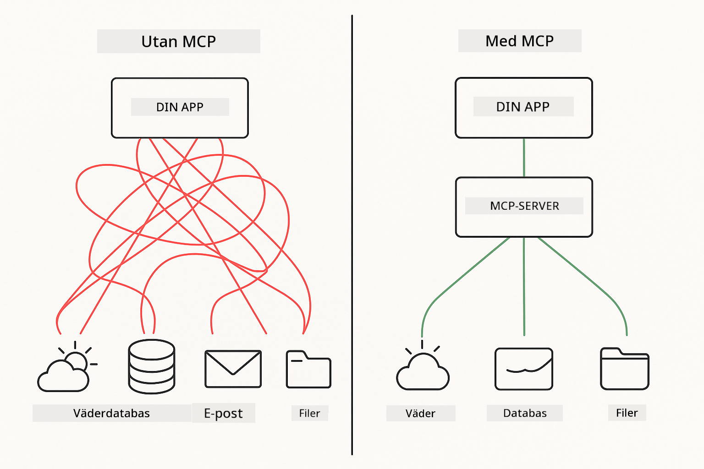

<!--
CO_OP_TRANSLATOR_METADATA:
{
  "original_hash": "c25ec1f10ef156c53e190cdf8b0711ab",
  "translation_date": "2025-12-13T17:54:37+00:00",
  "source_file": "05-mcp/README.md",
  "language_code": "sv"
}
-->
# Modul 05: Model Context Protocol (MCP)

## Innehållsförteckning

- [Vad du kommer att lära dig](../../../05-mcp)
- [Förstå MCP](../../../05-mcp)
- [Hur MCP fungerar](../../../05-mcp)
  - [Server-klientarkitektur](../../../05-mcp)
  - [Verktygsupptäckt](../../../05-mcp)
  - [Transportmekanismer](../../../05-mcp)
- [Förutsättningar](../../../05-mcp)
- [Vad denna modul täcker](../../../05-mcp)
- [Snabbstart](../../../05-mcp)
  - [Exempel 1: Fjärrkalkylator (Streamable HTTP)](../../../05-mcp)
  - [Exempel 2: Filoperationer (Stdio)](../../../05-mcp)
  - [Exempel 3: Git-analys (Docker)](../../../05-mcp)
- [Nyckelkoncept](../../../05-mcp)
  - [Transportval](../../../05-mcp)
  - [Verktygsupptäckt](../../../05-mcp)
  - [Sessionshantering](../../../05-mcp)
  - [Plattformsoberoende överväganden](../../../05-mcp)
- [När man ska använda MCP](../../../05-mcp)
- [MCP-ekosystemet](../../../05-mcp)
- [Grattis!](../../../05-mcp)
  - [Vad händer härnäst?](../../../05-mcp)
- [Felsökning](../../../05-mcp)

## Vad du kommer att lära dig

Du har byggt konversations-AI, bemästrat prompts, grundat svar i dokument och skapat agenter med verktyg. Men alla dessa verktyg var specialbyggda för din specifika applikation. Tänk om du kunde ge din AI tillgång till ett standardiserat ekosystem av verktyg som vem som helst kan skapa och dela?

Model Context Protocol (MCP) erbjuder precis det – ett standardiserat sätt för AI-applikationer att upptäcka och använda externa verktyg. Istället för att skriva anpassade integrationer för varje datakälla eller tjänst, ansluter du till MCP-servrar som exponerar sina funktioner i ett konsekvent format. Din AI-agent kan sedan automatiskt upptäcka och använda dessa verktyg.



*Före MCP: Komplexa punkt-till-punkt-integrationer. Efter MCP: Ett protokoll, oändliga möjligheter.*

## Förstå MCP

MCP löser ett grundläggande problem inom AI-utveckling: varje integration är specialanpassad. Vill du komma åt GitHub? Anpassad kod. Vill du läsa filer? Anpassad kod. Vill du fråga en databas? Anpassad kod. Och ingen av dessa integrationer fungerar med andra AI-applikationer.

MCP standardiserar detta. En MCP-server exponerar verktyg med tydliga beskrivningar och scheman. Varje MCP-klient kan ansluta, upptäcka tillgängliga verktyg och använda dem. Bygg en gång, använd överallt.


*Model Context Protocol-arkitektur – standardiserad verktygsupptäckt och exekvering*

## Hur MCP fungerar

**Server-klientarkitektur**

MCP använder en klient-server-modell. Servrar tillhandahåller verktyg – läsa filer, fråga databaser, anropa API:er. Klienter (din AI-applikation) ansluter till servrar och använder deras verktyg.

**Verktygsupptäckt**

När din klient ansluter till en MCP-server frågar den "Vilka verktyg har du?" Servern svarar med en lista över tillgängliga verktyg, var och en med beskrivningar och parameterscheman. Din AI-agent kan sedan avgöra vilka verktyg som ska användas baserat på användarens förfrågningar.

**Transportmekanismer**

MCP definierar två transportmekanismer: HTTP för fjärrservrar, Stdio för lokala processer (inklusive Docker-containrar):


*MCP-transportmekanismer: HTTP för fjärrservrar, Stdio för lokala processer (inklusive Docker-containrar)*

**Streamable HTTP** - [StreamableHttpDemo.java](../../../05-mcp/src/main/java/com/example/langchain4j/mcp/StreamableHttpDemo.java)

För fjärrservrar. Din applikation gör HTTP-förfrågningar till en server som körs någonstans i nätverket. Använder Server-Sent Events för realtidskommunikation.

```java
McpTransport httpTransport = new StreamableHttpMcpTransport.Builder()
    .url("http://localhost:3001/mcp")
    .timeout(Duration.ofSeconds(60))
    .logRequests(true)
    .logResponses(true)
    .build();
```

> **🤖 Prova med [GitHub Copilot](https://github.com/features/copilot) Chat:** Öppna [`StreamableHttpDemo.java`](../../../05-mcp/src/main/java/com/example/langchain4j/mcp/StreamableHttpDemo.java) och fråga:
> - "Hur skiljer sig MCP från direkt verktygsintegration som i Modul 04?"
> - "Vilka är fördelarna med att använda MCP för verktygsdelning mellan applikationer?"
> - "Hur hanterar jag anslutningsfel eller timeout till MCP-servrar?"

**Stdio** - [StdioTransportDemo.java](../../../05-mcp/src/main/java/com/example/langchain4j/mcp/StdioTransportDemo.java)

För lokala processer. Din applikation startar en server som en underprocess och kommunicerar via standard in/ut. Användbart för filsystemåtkomst eller kommandoradsverktyg.

```java
McpTransport stdioTransport = new StdioMcpTransport.Builder()
    .command(List.of(
        npmCmd, "exec",
        "@modelcontextprotocol/server-filesystem@0.6.2",
        resourcesDir
    ))
    .logEvents(false)
    .build();
```

> **🤖 Prova med [GitHub Copilot](https://github.com/features/copilot) Chat:** Öppna [`StdioTransportDemo.java`](../../../05-mcp/src/main/java/com/example/langchain4j/mcp/StdioTransportDemo.java) och fråga:
> - "Hur fungerar Stdio-transport och när ska jag använda den istället för HTTP?"
> - "Hur hanterar LangChain4j livscykeln för startade MCP-serverprocesser?"
> - "Vilka säkerhetsaspekter finns det med att ge AI åtkomst till filsystemet?"

**Docker (använder Stdio)** - [GitRepositoryAnalyzer.java](../../../05-mcp/src/main/java/com/example/langchain4j/mcp/GitRepositoryAnalyzer.java)

För containeriserade tjänster. Använder stdio-transport för att kommunicera med en Docker-container via `docker run`. Bra för komplexa beroenden eller isolerade miljöer.

```java
McpTransport dockerTransport = new StdioMcpTransport.Builder()
    .command(List.of(
        "docker", "run",
        "-e", "GITHUB_PERSONAL_ACCESS_TOKEN=" + System.getenv("GITHUB_TOKEN"),
        "-v", volumeMapping,
        "-i", "mcp/git"
    ))
    .logEvents(true)
    .build();
```

> **🤖 Prova med [GitHub Copilot](https://github.com/features/copilot) Chat:** Öppna [`GitRepositoryAnalyzer.java`](../../../05-mcp/src/main/java/com/example/langchain4j/mcp/GitRepositoryAnalyzer.java) och fråga:
> - "Hur isolerar Docker-transport MCP-servrar och vilka är fördelarna?"
> - "Hur konfigurerar jag volymmonteringar för att dela data mellan värd och MCP-containrar?"
> - "Vilka är bästa praxis för att hantera Docker-baserade MCP-serverlivscykler i produktion?"

## Köra exemplen

### Förutsättningar

- Java 21+, Maven 3.9+
- Node.js 16+ och npm (för MCP-servrar)
- **Docker Desktop** – måste vara **KÖRANDE** för Exempel 3 (inte bara installerat)
- GitHub Personal Access Token konfigurerad i `.env`-filen (från Modul 00)

> **Notera:** Om du inte har ställt in din GitHub-token än, se [Modul 00 - Snabbstart](../00-quick-start/README.md) för instruktioner.

> **⚠️ Docker-användare:** Innan du kör Exempel 3, verifiera att Docker Desktop körs med `docker ps`. Om du ser anslutningsfel, starta Docker Desktop och vänta ~30 sekunder för initiering.

## Snabbstart

**Med VS Code:** Högerklicka på valfri demo-fil i Utforskaren och välj **"Run Java"**, eller använd startkonfigurationerna från panelen Kör och Debugga (se till att du först lagt till din token i `.env`-filen).

**Med Maven:** Alternativt kan du köra från kommandoraden med exemplen nedan.

**⚠️ Viktigt:** Vissa exempel har förutsättningar (som att starta en MCP-server eller bygga Docker-bilder). Kontrollera varje exempel innan körning.

### Exempel 1: Fjärrkalkylator (Streamable HTTP)

Detta demonstrerar nätverksbaserad verktygsintegration.

**⚠️ Förutsättning:** Du måste starta MCP-servern först (se Terminal 1 nedan).

**Terminal 1 - Starta MCP-servern:**

**Bash:**
```bash
git clone https://github.com/modelcontextprotocol/servers.git
cd servers/src/everything
npm install
node dist/streamableHttp.js
```

**PowerShell:**
```powershell
git clone https://github.com/modelcontextprotocol/servers.git
cd servers/src/everything
npm install
node dist/streamableHttp.js
```

**Terminal 2 - Kör exemplet:**

**Med VS Code:** Högerklicka på `StreamableHttpDemo.java` och välj **"Run Java"**.

**Med Maven:**

**Bash:**
```bash
export GITHUB_TOKEN=your_token_here
cd 05-mcp
mvn compile exec:java -Dexec.mainClass=com.example.langchain4j.mcp.StreamableHttpDemo
```

**PowerShell:**
```powershell
$env:GITHUB_TOKEN=your_token_here
cd 05-mcp
mvn --% compile exec:java -Dexec.mainClass=com.example.langchain4j.mcp.StreamableHttpDemo
```

Se hur agenten upptäcker tillgängliga verktyg och sedan använder kalkylatorn för att utföra addition.

### Exempel 2: Filoperationer (Stdio)

Detta demonstrerar lokala underprocessbaserade verktyg.

**✅ Inga förutsättningar behövs** – MCP-servern startas automatiskt.

**Med VS Code:** Högerklicka på `StdioTransportDemo.java` och välj **"Run Java"**.

**Med Maven:**

**Bash:**
```bash
export GITHUB_TOKEN=your_token_here
cd 05-mcp
mvn compile exec:java -Dexec.mainClass=com.example.langchain4j.mcp.StdioTransportDemo
```

**PowerShell:**
```powershell
$env:GITHUB_TOKEN=your_token_here
cd 05-mcp
mvn --% compile exec:java -Dexec.mainClass=com.example.langchain4j.mcp.StdioTransportDemo
```

Applikationen startar automatiskt en MCP-server för filsystemet och läser en lokal fil. Lägg märke till hur underprocesshanteringen sköts åt dig.

**Förväntad utdata:**
```
Assistant response: The content of the file is "Kaboom!".
```

### Exempel 3: Git-analys (Docker)

Detta demonstrerar containeriserade verktygsservrar.

**⚠️ Förutsättningar:** 
1. **Docker Desktop måste vara KÖRANDE** (inte bara installerat)
2. **Windows-användare:** WSL 2-läge rekommenderas (Docker Desktop Inställningar → Allmänt → "Use the WSL 2 based engine"). Hyper-V-läge kräver manuell fil-delningskonfiguration.
3. Du måste bygga Docker-bilden först (se Terminal 1 nedan)

**Verifiera att Docker körs:**

**Bash:**
```bash
docker ps  # Bör visa containerlista, inte ett fel
```

**PowerShell:**
```powershell
docker ps  # Bör visa containerlista, inte ett fel
```

Om du ser ett fel som "Cannot connect to Docker daemon" eller "The system cannot find the file specified", starta Docker Desktop och vänta på att det initieras (~30 sekunder).

**Felsökning:**
- Om AI rapporterar ett tomt repository eller inga filer, fungerar inte volymmonteringen (`-v`).
- **Windows Hyper-V-användare:** Lägg till projektkatalogen i Docker Desktop Inställningar → Resurser → Fil-delning, och starta om Docker Desktop.
- **Rekommenderad lösning:** Byt till WSL 2-läge för automatisk fil-delning (Inställningar → Allmänt → aktivera "Use the WSL 2 based engine").

**Terminal 1 - Bygg Docker-bilden:**

**Bash:**
```bash
cd servers/src/git
docker build -t mcp/git .
```

**PowerShell:**
```powershell
cd servers/src/git
docker build -t mcp/git .
```

**Terminal 2 - Kör analysatorn:**

**Med VS Code:** Högerklicka på `GitRepositoryAnalyzer.java` och välj **"Run Java"**.

**Med Maven:**

**Bash:**
```bash
export GITHUB_TOKEN=your_token_here
cd 05-mcp
mvn compile exec:java -Dexec.mainClass=com.example.langchain4j.mcp.GitRepositoryAnalyzer
```

**PowerShell:**
```powershell
$env:GITHUB_TOKEN=your_token_here
cd 05-mcp
mvn --% compile exec:java -Dexec.mainClass=com.example.langchain4j.mcp.GitRepositoryAnalyzer
```

Applikationen startar en Docker-container, monterar ditt repository och analyserar repository-struktur och innehåll via AI-agenten.

## Nyckelkoncept

**Transportval**

Välj baserat på var dina verktyg finns:
- Fjärrtjänster → Streamable HTTP
- Lokalt filsystem → Stdio
- Komplexa beroenden → Docker

**Verktygsupptäckt**

MCP-klienter upptäcker automatiskt tillgängliga verktyg vid anslutning. Din AI-agent ser verktygsbeskrivningar och avgör vilka som ska användas baserat på användarens förfrågan.

**Sessionshantering**

Streamable HTTP-transport upprätthåller sessioner, vilket möjliggör tillståndsbaserade interaktioner med fjärrservrar. Stdio- och Docker-transporter är vanligtvis tillståndslösa.

**Plattformsoberoende överväganden**

Exemplen hanterar plattformsdifferenser automatiskt (Windows vs Unix-kommandon, sökvägskonverteringar för Docker). Detta är viktigt för produktionsdistributioner över olika miljöer.

## När man ska använda MCP

**Använd MCP när:**
- Du vill utnyttja befintliga verktygsekosystem
- Bygger verktyg som flera applikationer ska använda
- Integrerar tredjepartstjänster med standardprotokoll
- Du behöver byta verktygsimplementationer utan kodändringar

**Använd anpassade verktyg (Modul 04) när:**
- Du bygger applikationsspecifik funktionalitet
- Prestanda är kritiskt (MCP lägger till overhead)
- Dina verktyg är enkla och inte ska återanvändas
- Du behöver full kontroll över exekveringen


## MCP-ekosystemet

Model Context Protocol är en öppen standard med ett växande ekosystem:

- Officiella MCP-servrar för vanliga uppgifter (filsystem, Git, databaser)
- Community-bidragna servrar för olika tjänster
- Standardiserade verktygsbeskrivningar och scheman
- Plattformskompatibilitet (fungerar med vilken MCP-klient som helst)

Denna standardisering innebär att verktyg byggda för en AI-applikation fungerar med andra, vilket skapar ett delat ekosystem av funktioner.

## Grattis!

Du har slutfört LangChain4j för nybörjare-kursen. Du har lärt dig:

- Hur man bygger konversations-AI med minne (Modul 01)
- Prompt engineering-mönster för olika uppgifter (Modul 02)
- Grunda svar i dina dokument med RAG (Modul 03)
- Skapa AI-agenter med anpassade verktyg (Modul 04)
- Integrera standardiserade verktyg via MCP (Modul 05)

Du har nu grunden för att bygga produktions-AI-applikationer. Koncepten du lärt dig gäller oavsett specifika ramverk eller modeller – de är grundläggande mönster inom AI-teknik.

### Vad händer härnäst?

Efter att ha slutfört modulerna, utforska [Testningsguiden](../docs/TESTING.md) för att se LangChain4j testkoncept i praktiken.

**Officiella resurser:**
- [LangChain4j Dokumentation](https://docs.langchain4j.dev/) – Omfattande guider och API-referens
- [LangChain4j GitHub](https://github.com/langchain4j/langchain4j) – Källkod och exempel
- [LangChain4j Tutorials](https://docs.langchain4j.dev/tutorials/) – Steg-för-steg-tutorials för olika användningsfall

Tack för att du genomförde denna kurs!

---

**Navigering:** [← Föregående: Modul 04 - Verktyg](../04-tools/README.md) | [Tillbaka till huvudmenyn](../README.md)

---

## Felsökning

### PowerShell Maven-kommandosyntax
**Problem**: Maven-kommandon misslyckas med felmeddelandet `Unknown lifecycle phase ".mainClass=..."`

**Orsak**: PowerShell tolkar `=` som en variabeltilldelningsoperator, vilket bryter Maven-egenskapsyntaxen

**Lösning**: Använd stopparsing-operatorn `--%` före Maven-kommandot:

**PowerShell:**
```powershell
mvn --% compile exec:java -Dexec.mainClass=com.example.langchain4j.mcp.StreamableHttpDemo
```

**Bash:**
```bash
mvn compile exec:java -Dexec.mainClass=com.example.langchain4j.mcp.StreamableHttpDemo
```

Operatorn `--%` talar om för PowerShell att skicka alla återstående argument bokstavligt till Maven utan tolkning.

### Docker-anslutningsproblem

**Problem**: Docker-kommandon misslyckas med "Cannot connect to Docker daemon" eller "The system cannot find the file specified"

**Orsak**: Docker Desktop körs inte eller är inte helt initierat

**Lösning**: 
1. Starta Docker Desktop
2. Vänta ~30 sekunder för fullständig initiering
3. Verifiera med `docker ps` (bör visa containerlista, inte ett fel)
4. Kör sedan ditt exempel

### Windows Docker Volymmontering

**Problem**: Git-repositorieanalysatorn rapporterar tomt repository eller inga filer

**Orsak**: Volymmontering (`-v`) fungerar inte på grund av fil-delningskonfiguration

**Lösning**:
- **Rekommenderat:** Byt till WSL 2-läge (Docker Desktop Settings → General → "Use the WSL 2 based engine")
- **Alternativ (Hyper-V):** Lägg till projektkatalogen i Docker Desktop Settings → Resources → File sharing, starta sedan om Docker Desktop

---

<!-- CO-OP TRANSLATOR DISCLAIMER START -->
**Ansvarsfriskrivning**:
Detta dokument har översatts med hjälp av AI-översättningstjänsten [Co-op Translator](https://github.com/Azure/co-op-translator). Även om vi strävar efter noggrannhet, vänligen var medveten om att automatiska översättningar kan innehålla fel eller brister. Det ursprungliga dokumentet på dess modersmål bör betraktas som den auktoritativa källan. För kritisk information rekommenderas professionell mänsklig översättning. Vi ansvarar inte för några missförstånd eller feltolkningar som uppstår till följd av användningen av denna översättning.
<!-- CO-OP TRANSLATOR DISCLAIMER END -->