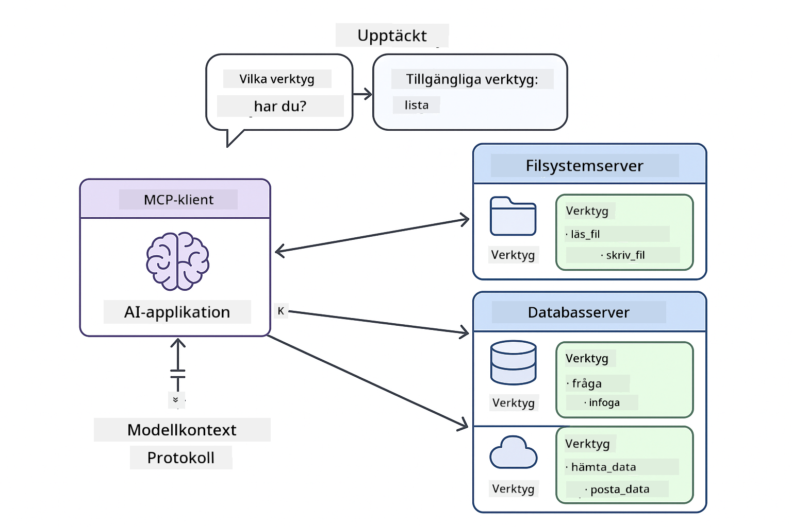

<!--
CO_OP_TRANSLATOR_METADATA:
{
  "original_hash": "f89f4c106d110e4943c055dd1a2f1dff",
  "translation_date": "2025-12-31T01:15:21+00:00",
  "source_file": "05-mcp/README.md",
  "language_code": "sv"
}
-->
# Modul 05: Model Context Protocol (MCP)

## Innehållsförteckning

- [Vad du kommer lära dig](../../../05-mcp)
- [Vad är MCP?](../../../05-mcp)
- [Hur MCP fungerar](../../../05-mcp)
- [Agentmodulen](../../../05-mcp)
- [Köra exemplen](../../../05-mcp)
  - [Förutsättningar](../../../05-mcp)
- [Snabbstart](../../../05-mcp)
  - [Filoperationer (Stdio)](../../../05-mcp)
  - [Supervisor-agent](../../../05-mcp)
    - [Förstå utdata](../../../05-mcp)
    - [Förklaring av Agentmodulens funktioner](../../../05-mcp)
- [Viktiga koncept](../../../05-mcp)
- [Grattis!](../../../05-mcp)
  - [Vad händer härnäst?](../../../05-mcp)

## Vad du kommer lära dig

Du har byggt konversations-AI, bemästrat prompts, förankrat svar i dokument och skapat agenter med verktyg. Men alla dessa verktyg var skräddarsydda för din specifika applikation. Tänk om du kunde ge din AI åtkomst till ett standardiserat ekosystem av verktyg som vem som helst kan skapa och dela? I den här modulen lär du dig precis det med Model Context Protocol (MCP) och LangChain4j:s agentmodul. Vi visar först en enkel MCP-fil-läsare och visar sedan hur den enkelt integreras i avancerade agentflöden med mönstret Supervisor Agent.

## Vad är MCP?

Model Context Protocol (MCP) erbjuder just det — ett standardiserat sätt för AI-applikationer att upptäcka och använda externa verktyg. Istället för att skriva anpassade integrationer för varje datakälla eller tjänst, ansluter du till MCP-servrar som exponerar sina möjligheter i ett konsekvent format. Din AI-agent kan sedan upptäcka och använda dessa verktyg automatiskt.


*Före MCP: Komplexa punkt-till-punkt-integrationer. Efter MCP: Ett protokoll, oändliga möjligheter.*

MCP löser ett grundläggande problem i AI-utveckling: varje integration är anpassad. Vill du komma åt GitHub? Anpassad kod. Vill du läsa filer? Anpassad kod. Vill du fråga en databas? Anpassad kod. Och ingen av dessa integrationer fungerar med andra AI-applikationer.

MCP standardiserar detta. En MCP-server exponerar verktyg med tydliga beskrivningar och scheman. Varje MCP-klient kan ansluta, upptäcka tillgängliga verktyg och använda dem. Bygg en gång, använd överallt.



*Model Context Protocol-arkitektur - standardiserad upptäckt och exekvering av verktyg*

## Hur MCP fungerar

**Server-klient-arkitektur**

MCP använder en klient-server-modell. Servrar tillhandahåller verktyg - läsa filer, fråga databaser, anropa API:er. Klienter (din AI-applikation) ansluter till servrar och använder deras verktyg.

För att använda MCP med LangChain4j, lägg till detta Maven-beroende:

```xml
<dependency>
    <groupId>dev.langchain4j</groupId>
    <artifactId>langchain4j-mcp</artifactId>
    <version>${langchain4j.version}</version>
</dependency>
```

**Verktygsupptäckt**

När din klient ansluter till en MCP-server frågar den "Vilka verktyg har du?" Servern svarar med en lista över tillgängliga verktyg, varje med beskrivningar och parameterscheman. Din AI-agent kan sedan avgöra vilka verktyg som ska användas baserat på användarens förfrågan.

**Transportmekanismer**

MCP stödjer olika transportmekanismer. Denna modul demonstrerar Stdio-transporten för lokala processer:


*MCP transportmekanismer: HTTP för fjärrservrar, Stdio för lokala processer*

**Stdio** - [StdioTransportDemo.java](../../../05-mcp/src/main/java/com/example/langchain4j/mcp/StdioTransportDemo.java)

För lokala processer. Din applikation startar en server som en underprocess och kommunicerar via standard input/output. Användbart för åtkomst till filsystem eller kommandoradsverktyg.

```java
McpTransport stdioTransport = new StdioMcpTransport.Builder()
    .command(List.of(
        npmCmd, "exec",
        "@modelcontextprotocol/server-filesystem@2025.12.18",
        resourcesDir
    ))
    .logEvents(false)
    .build();
```

> **🤖 Prova med [GitHub Copilot](https://github.com/features/copilot) Chat:** Öppna [`StdioTransportDemo.java`](../../../05-mcp/src/main/java/com/example/langchain4j/mcp/StdioTransportDemo.java) och fråga:
> - "Hur fungerar Stdio-transporten och när bör jag använda den istället för HTTP?"
> - "Hur hanterar LangChain4j livscykeln för startade MCP-serverprocesser?"
> - "Vilka säkerhetskonsekvenser finns det med att ge AI åtkomst till filsystemet?"

## Agentmodulen

Medan MCP erbjuder standardiserade verktyg, ger LangChain4j:s **agentmodul** ett deklarativt sätt att bygga agenter som orkestrerar dessa verktyg. `@Agent`-annoteringen och `AgenticServices` låter dig definiera agentbeteende genom gränssnitt istället för imperativ kod.

I den här modulen utforskar du mönstret **Supervisor Agent** — ett avancerat agentiskt AI-tillvägagångssätt där en "supervisor"-agent dynamiskt avgör vilka subagenter som ska anropas baserat på användarens begäran. Vi kombinerar båda koncepten genom att ge en av våra subagenter MCP-drivna filåtkomstmöjligheter.

För att använda agentmodulen, lägg till detta Maven-beroende:

```xml
<dependency>
    <groupId>dev.langchain4j</groupId>
    <artifactId>langchain4j-agentic</artifactId>
    <version>${langchain4j.mcp.version}</version>
</dependency>
```

> **⚠️ Experimentellt:** `langchain4j-agentic`-modulen är **experimentell** och kan komma att förändras. Det stabila sättet att bygga AI-assistenter förblir `langchain4j-core` med anpassade verktyg (Modul 04).

## Köra exemplen

### Förutsättningar

- Java 21+, Maven 3.9+
- Node.js 16+ och npm (för MCP-servrar)
- Miljövariabler konfigurerade i `.env`-filen (från rotkatalogen):
  - **För StdioTransportDemo:** `GITHUB_TOKEN` (GitHub Personal Access Token)
  - **För SupervisorAgentDemo:** `AZURE_OPENAI_ENDPOINT`, `AZURE_OPENAI_API_KEY`, `AZURE_OPENAI_DEPLOYMENT` (samma som Modulerna 01-04)

> **Notera:** Om du inte har ställt in dina miljövariabler än, se [Module 00 - Quick Start](../00-quick-start/README.md) för instruktioner, eller kopiera `.env.example` till `.env` i rotkatalogen och fyll i dina värden.

## Snabbstart

**Använda VS Code:** Högerklicka helt enkelt på vilken demo-fil som helst i Utforskaren och välj **"Run Java"**, eller använd launch-konfigurationerna från Run and Debug-panelen (se till att du först lagt till din token i `.env`-filen).

**Använda Maven:** Alternativt kan du köra från kommandoraden med exemplen nedan.

### Filoperationer (Stdio)

Detta demonstrerar lokala subprocess-baserade verktyg.

**✅ Inga förutsättningar behövs** - MCP-servern startas automatiskt.

**Använda VS Code:** Högerklicka på `StdioTransportDemo.java` och välj **"Run Java"**.

**Använda Maven:**

**Bash:**
```bash
export GITHUB_TOKEN=your_token_here
cd 05-mcp
mvn compile exec:java -Dexec.mainClass=com.example.langchain4j.mcp.StdioTransportDemo
```

**PowerShell:**
```powershell
$env:GITHUB_TOKEN=your_token_here
cd 05-mcp
mvn --% compile exec:java -Dexec.mainClass=com.example.langchain4j.mcp.StdioTransportDemo
```

Applikationen startar automatiskt en filsystem-MCP-server och läser en lokal fil. Lägg märke till hur hanteringen av underprocesser sköts åt dig.

**Förväntad utdata:**
```
Assistant response: The file provides an overview of LangChain4j, an open-source Java library
for integrating Large Language Models (LLMs) into Java applications...
```

### Supervisor-agent


Mönstret **Supervisor Agent** är en **flexibel** form av agentisk AI. Till skillnad från deterministiska arbetsflöden (sekventiella, loop, parallella) använder en Supervisor en LLM för att autonomt avgöra vilka agenter som ska anropas baserat på användarens begäran.

**Kombinera Supervisor med MCP:** I det här exemplet ger vi `FileAgent` åtkomst till MCP:s filsystemverktyg via `toolProvider(mcpToolProvider)`. När en användare ber om att "läsa och analysera en fil" analyserar Supervisorn förfrågan och genererar en exekveringsplan. Den dirigerar sedan förfrågan till `FileAgent`, som använder MCP:s `read_file`-verktyg för att hämta innehållet. Supervisorn skickar sedan det innehållet till `AnalysisAgent` för tolkning, och anropar valfritt `SummaryAgent` för att kondensera resultaten.

Detta visar hur MCP-verktyg integreras sömlöst i agentiska arbetsflöden — Supervisorn behöver inte veta *hur* filer läses, bara att `FileAgent` kan göra det. Supervisorn anpassar sig dynamiskt till olika typer av förfrågningar och returnerar antingen den sista agentens svar eller en sammanfattning av alla operationer.

**Rekommenderat: Använd startskripten**

Startskripten laddar automatiskt miljövariabler från rotens `.env`-fil:

**Bash:**
```bash
cd 05-mcp
chmod +x start.sh
./start.sh
```

**PowerShell:**
```powershell
cd 05-mcp
.\start.ps1
```

**Använda VS Code:** Högerklicka på `SupervisorAgentDemo.java` och välj **"Run Java"** (se till att din `.env`-fil är konfigurerad).

**Hur Supervisorn fungerar:**

```java
// Definiera flera agenter med specifika förmågor
FileAgent fileAgent = AgenticServices.agentBuilder(FileAgent.class)
        .chatModel(model)
        .toolProvider(mcpToolProvider)  // Har MCP-verktyg för filoperationer
        .build();

AnalysisAgent analysisAgent = AgenticServices.agentBuilder(AnalysisAgent.class)
        .chatModel(model)
        .build();

SummaryAgent summaryAgent = AgenticServices.agentBuilder(SummaryAgent.class)
        .chatModel(model)
        .build();

// Skapa en Supervisor som samordnar dessa agenter
SupervisorAgent supervisor = AgenticServices.supervisorBuilder()
        .chatModel(model)  // Modellen "planner"
        .subAgents(fileAgent, analysisAgent, summaryAgent)
        .responseStrategy(SupervisorResponseStrategy.SUMMARY)
        .build();

// Supervisorn bestämmer autonomt vilka agenter som ska anropas
// Skicka bara en begäran på naturligt språk - LLM planerar utförandet
String response = supervisor.invoke("Read the file at /path/file.txt and analyze it");
```

Se [SupervisorAgentDemo.java](../../../05-mcp/src/main/java/com/example/langchain4j/mcp/SupervisorAgentDemo.java) för fullständig implementation.

> **🤖 Prova med [GitHub Copilot](https://github.com/features/copilot) Chat:** Öppna [`SupervisorAgentDemo.java`](../../../05-mcp/src/main/java/com/example/langchain4j/mcp/SupervisorAgentDemo.java) och fråga:
> - "Hur avgör Supervisorn vilka agenter som ska anropas?"
> - "Vad är skillnaden mellan Supervisor- och Sekventiellt arbetsflöde?"
> - "Hur kan jag anpassa Supervisorns planeringsbeteende?"

#### Förstå utdata

När du kör demot kommer du att se en strukturerad genomgång av hur Supervisorn orkestrerar flera agenter. Här är vad varje sektion betyder:

```
======================================================================
  SUPERVISOR AGENT DEMO
======================================================================

This demo shows how a Supervisor Agent orchestrates multiple specialized agents.
The Supervisor uses an LLM to decide which agent to call based on the task.
```

**Rubriken** introducerar demot och förklarar kärnkonceptet: Supervisorn använder en LLM (inte hårdkodade regler) för att avgöra vilka agenter som ska anropas.

```
--- AVAILABLE AGENTS -------------------------------------------------
  [FILE]     FileAgent     - Reads files using MCP filesystem tools
  [ANALYZE]  AnalysisAgent - Analyzes content for structure, tone, and themes
  [SUMMARY]  SummaryAgent  - Creates concise summaries of content
```

**Tillgängliga agenter** visar de tre specialiserade agenterna som Supervisorn kan välja mellan. Varje agent har en specifik förmåga:
- **FileAgent** kan läsa filer med MCP-verktyg (extern kapacitet)
- **AnalysisAgent** analyserar innehåll (ren LLM-kapacitet)
- **SummaryAgent** skapar sammanfattningar (ren LLM-kapacitet)

```
--- USER REQUEST -----------------------------------------------------
  "Read the file at .../file.txt and analyze what it's about"
```

**Användarförfrågan** visar vad som efterfrågades. Supervisorn måste tolka detta och avgöra vilka agenter som ska anropas.

```
--- SUPERVISOR ORCHESTRATION -----------------------------------------
  The Supervisor will now decide which agents to invoke and in what order...

  +-- STEP 1: Supervisor chose -> FileAgent (reading file via MCP)
  |
  |   Input: .../file.txt
  |
  |   Result: LangChain4j is an open-source Java library designed to simplify...
  +-- [OK] FileAgent (reading file via MCP) completed

  +-- STEP 2: Supervisor chose -> AnalysisAgent (analyzing content)
  |
  |   Input: LangChain4j is an open-source Java library...
  |
  |   Result: Structure: The content is organized into clear paragraphs that int...
  +-- [OK] AnalysisAgent (analyzing content) completed
```

**Supervisorns orkestrering** är där magin händer. Se hur:
1. Supervisorn **valde FileAgent först** eftersom förfrågan nämnde "läs filen"
2. FileAgent använde MCP:s `read_file`-verktyg för att hämta filinnehållet
3. Supervisorn sedan **valde AnalysisAgent** och skickade filinnehållet till den
4. AnalysisAgent analyserade struktur, ton och teman

Lägg märke till att Supervisorn gjorde dessa beslut **autonomt** baserat på användarens förfrågan — inga hårdkodade arbetsflöden!

**Slutligt svar** är Supervisorns syntetiserade svar, vilket kombinerar utdata från alla agenter den anropade. Exemplet visar den agentiska scope:n som innehåller sammanfattnings- och analysresultaten som lagrats av varje agent.

```
--- FINAL RESPONSE ---------------------------------------------------
I read the contents of the file and analyzed its structure, tone, and key themes.
The file introduces LangChain4j as an open-source Java library for integrating
large language models...

--- AGENTIC SCOPE (Shared Memory) ------------------------------------
  Agents store their results in a shared scope for other agents to use:
  * summary: LangChain4j is an open-source Java library...
  * analysis: Structure: The content is organized into clear paragraphs that in...
```

### Förklaring av Agentmodulens funktioner

Exemplet demonstrerar flera avancerade funktioner i agentmodulen. Låt oss titta närmare på Agentic Scope och Agent Listeners.

**Agentic Scope** visar det delade minnet där agenter lagrade sina resultat med `@Agent(outputKey="...")`. Detta möjliggör:
- Att senare agenter kan få åtkomst till tidigare agenters utdata
- Att Supervisorn kan syntetisera ett slutligt svar
- Att du kan inspektera vad varje agent producerade

```java
ResultWithAgenticScope<String> result = supervisor.invokeWithAgenticScope(request);
AgenticScope scope = result.agenticScope();
String story = scope.readState("story");
List<AgentInvocation> history = scope.agentInvocations("analysisAgent");
```

**Agent Listeners** möjliggör övervakning och felsökning av agentexekvering. Steg-för-steg-utdata som du ser i demot kommer från en AgentListener som kopplar in sig i varje agentanrop:
- **beforeAgentInvocation** - Anropas när Supervisorn väljer en agent, så att du kan se vilken agent som valdes och varför
- **afterAgentInvocation** - Anropas när en agent slutförs, visar dess resultat
- **inheritedBySubagents** - När sann, övervakar lyssnaren alla agenter i hierarkin

```java
AgentListener monitor = new AgentListener() {
    private int step = 0;
    
    @Override
    public void beforeAgentInvocation(AgentRequest request) {
        step++;
        System.out.println("  +-- STEP " + step + ": " + request.agentName());
    }
    
    @Override
    public void afterAgentInvocation(AgentResponse response) {
        System.out.println("  +-- [OK] " + response.agentName() + " completed");
    }
    
    @Override
    public boolean inheritedBySubagents() {
        return true; // Propagera till alla underagenter
    }
};
```

Utöver Supervisorn-mönstret erbjuder `langchain4j-agentic`-modulen flera kraftfulla arbetsflödesmönster och funktioner:

| Mönster | Beskrivning | Användningsfall |
|---------|-------------|-----------------|
| **Sequential** | Kör agenter i ordning, utdata flödar till nästa | Pipelines: research → analyze → report |
| **Parallel** | Kör agenter samtidigt | Oberoende uppgifter: väder + nyheter + aktier |
| **Loop** | Iterera tills ett villkor är uppfyllt | Kvalitetspoängsättning: förfina tills poängen ≥ 0.8 |
| **Conditional** | Dirigera baserat på villkor | Klassificera → dirigera till specialistagent |
| **Human-in-the-Loop** | Lägg till mänskliga kontrollpunkter | Godkännandearbetsflöden, innehållsgranskning |

## Viktiga koncept

**MCP** är idealiskt när du vill utnyttja befintliga verktygsekosystem, bygga verktyg som flera applikationer kan dela, integrera tredjepartstjänster med standardprotokoll, eller byta verktygsimplementationer utan att ändra kod.

**Agentmodulen** fungerar bäst när du vill ha deklarativa agentdefinitioner med `@Agent`-annoteringar, behöver orkestrering av arbetsflöden (sekventiell, loop, parallell), föredrar gränssnittsbaserad agentdesign framför imperativ kod, eller kombinerar flera agenter som delar utdata via `outputKey`.

**Supervisor-agentmönstret** är utmärkt när arbetsflödet inte går att förutsäga på förhand och du vill att LLM ska besluta, när du har flera specialiserade agenter som behöver dynamisk orkestrering, när du bygger konversationssystem som dirigerar till olika kapaciteter, eller när du vill ha det mest flexibla, adaptiva agentbeteendet.

## Grattis!

Du har slutfört LangChain4j for Beginners-kursen. Du har lärt dig:

- Hur man bygger konversations-AI med minne (Modul 01)
- Prompt-engineeringmönster för olika uppgifter (Modul 02)
- Förankra svar i dina dokument med RAG (Modul 03)
- Skapa grundläggande AI-agenter (assistenter) med anpassade verktyg (Modul 04)
- Integrera standardiserade verktyg med LangChain4j MCP- och Agentic-modulerna (Modul 05)

### Vad händer härnäst?

Efter att du har slutfört modulerna, utforska [Testguiden](../docs/TESTING.md) för att se LangChain4j:s testkoncept i praktiken.

**Officiella resurser:**
- [LangChain4j Documentation](https://docs.langchain4j.dev/) - Omfattande guider och API-referens
- [LangChain4j GitHub](https://github.com/langchain4j/langchain4j) - Källkod och exempel
- [LangChain4j Tutorials](https://docs.langchain4j.dev/tutorials/) - Steg-för-steg-handledningar för olika användningsfall

Tack för att du har genomfört den här kursen!

---

**Navigation:** [← Föregående: Modul 04 - Verktyg](../04-tools/README.md) | [Tillbaka till huvudsidan](../README.md)

---

<!-- CO-OP TRANSLATOR DISCLAIMER START -->
**Ansvarsfriskrivning**:
Detta dokument har översatts med hjälp av AI-översättningstjänsten [Co-op Translator](https://github.com/Azure/co-op-translator). Även om vi strävar efter noggrannhet bör du vara medveten om att automatiska översättningar kan innehålla fel eller brister. Det ursprungliga dokumentet i sitt ursprungliga språk bör betraktas som den auktoritativa källan. För kritisk information rekommenderas professionell mänsklig översättning. Vi ansvarar inte för några missförstånd eller feltolkningar som uppstår till följd av användningen av denna översättning.
<!-- CO-OP TRANSLATOR DISCLAIMER END -->