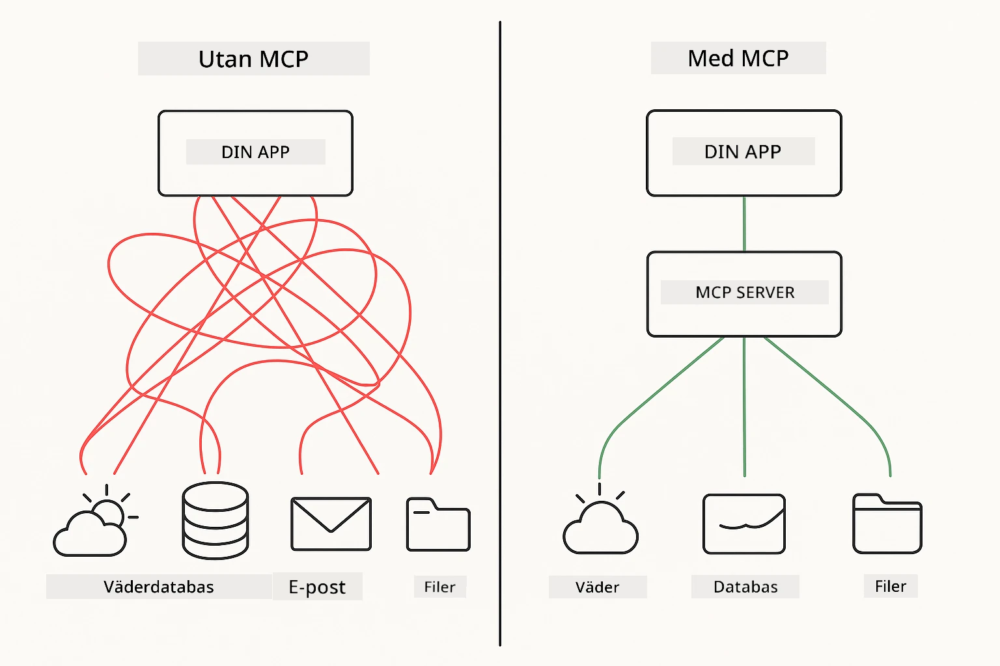
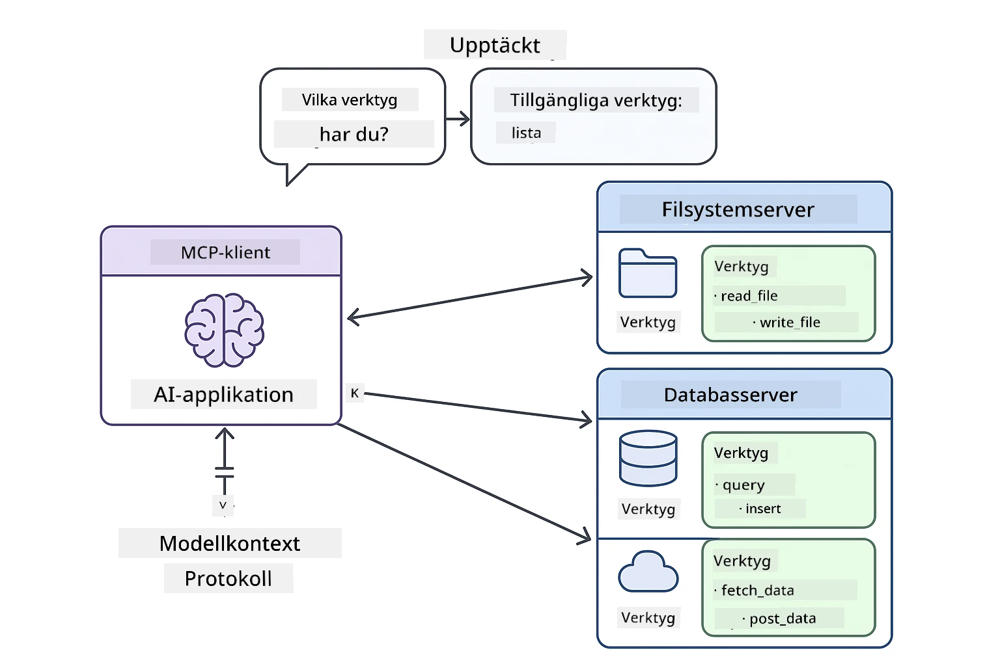
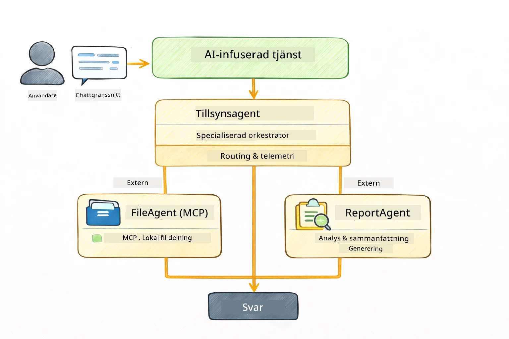

<!--
CO_OP_TRANSLATOR_METADATA:
{
  "original_hash": "6c816d130a1fa47570c11907e72d84ae",
  "translation_date": "2026-01-05T23:40:00+00:00",
  "source_file": "05-mcp/README.md",
  "language_code": "sv"
}
-->
# Modul 05: Model Context Protocol (MCP)

## Innehållsförteckning

- [Vad du kommer att lära dig](../../../05-mcp)
- [Vad är MCP?](../../../05-mcp)
- [Hur MCP fungerar](../../../05-mcp)
- [Agentmodulen](../../../05-mcp)
- [Köra exemplen](../../../05-mcp)
  - [Förutsättningar](../../../05-mcp)
- [Snabbstart](../../../05-mcp)
  - [Filoperationer (Stdio)](../../../05-mcp)
  - [Supervisor Agent](../../../05-mcp)
    - [Förstå utdata](../../../05-mcp)
    - [Svarstrategier](../../../05-mcp)
    - [Förklaring av Agentmodulens funktioner](../../../05-mcp)
- [Nyckelkoncept](../../../05-mcp)
- [Grattis!](../../../05-mcp)
  - [Vad händer härnäst?](../../../05-mcp)

## Vad du kommer att lära dig

Du har byggt konversations-AI, bemästrat promptar, grundat svar i dokument och skapat agenter med verktyg. Men alla dessa verktyg har varit specialbyggda för din specifika applikation. Tänk om du kunde ge din AI tillgång till ett standardiserat ekosystem av verktyg som vem som helst kan skapa och dela? I denna modul kommer du att lära dig precis det med Model Context Protocol (MCP) och LangChain4js agentmodul. Vi visar först en enkel MCP-fil läsare och sedan hur den enkelt integreras i avancerade agentflöden med Supervisor Agent-mönstret.

## Vad är MCP?

Model Context Protocol (MCP) erbjuder just det - ett standardiserat sätt för AI-applikationer att upptäcka och använda externa verktyg. Istället för att skriva anpassade integrationer för varje datakälla eller tjänst kopplar du upp dig mot MCP-servrar som exponerar sina funktioner i ett konsekvent format. Din AI-agent kan sedan automatiskt hitta och använda dessa verktyg.



*Före MCP: Komplexa punkt-till-punkt-integrationer. Efter MCP: Ett protokoll, oändliga möjligheter.*

MCP löser ett grundläggande problem i AI-utveckling: varje integration är specialanpassad. Vill du få åtkomst till GitHub? Anpassad kod. Vill du läsa filer? Anpassad kod. Vill du fråga en databas? Anpassad kod. Och ingen av dessa integrationer fungerar med andra AI-applikationer.

MCP standardiserar detta. En MCP-server exponerar verktyg med tydliga beskrivningar och scheman. Varje MCP-klient kan koppla upp sig, upptäcka tillgängliga verktyg och använda dem. Bygg en gång, använd överallt.



*Model Context Protocol-arkitektur - standardiserad verktygsupptäckt och exekvering*

## Hur MCP fungerar

**Server-klient arkitektur**

MCP använder en klient-server-modell. Servrar tillhandahåller verktyg - filinläsning, databasfrågor, API-anrop. Klienter (din AI-applikation) kopplar upp sig mot servrar och använder deras verktyg.

För att använda MCP med LangChain4j, lägg till detta Maven beroende:

```xml
<dependency>
    <groupId>dev.langchain4j</groupId>
    <artifactId>langchain4j-mcp</artifactId>
    <version>${langchain4j.version}</version>
</dependency>
```

**Verktygsupptäckt**

När din klient kopplar upp sig mot en MCP-server frågar den "Vilka verktyg har du?" Servern svarar med en lista över tillgängliga verktyg, varje med beskrivningar och parametern scheman. Din AI-agent kan sedan avgöra vilka verktyg den ska använda baserat på användarens förfrågan.

**Transportmekanismer**

MCP stöder olika transportmekanismer. Denna modul demonstrerar Stdio-transporten för lokala processer:


*MCP transportmekanismer: HTTP för fjärrservrar, Stdio för lokala processer*

**Stdio** - [StdioTransportDemo.java](../../../05-mcp/src/main/java/com/example/langchain4j/mcp/StdioTransportDemo.java)

För lokala processer. Din applikation startar en server som en subprocess och kommunicerar via standard input/output. Användbart för filsystemstillgång eller kommandoradsverktyg.

```java
McpTransport stdioTransport = new StdioMcpTransport.Builder()
    .command(List.of(
        npmCmd, "exec",
        "@modelcontextprotocol/server-filesystem@2025.12.18",
        resourcesDir
    ))
    .logEvents(false)
    .build();
```

> **🤖 Prova med [GitHub Copilot](https://github.com/features/copilot) Chat:** Öppna [`StdioTransportDemo.java`](../../../05-mcp/src/main/java/com/example/langchain4j/mcp/StdioTransportDemo.java) och fråga:
> - "Hur fungerar Stdio-transporten och när bör jag använda den istället för HTTP?"
> - "Hur hanterar LangChain4j livscykeln för startade MCP-serverprocesser?"
> - "Vilka säkerhetsimplikationer finns det med att ge AI tillgång till filsystemet?"

## Agentmodulen

Medan MCP tillhandahåller standardiserade verktyg ger LangChain4js **agentmodul** ett deklarativt sätt att bygga agenter som orkestrerar dessa verktyg. `@Agent`-annoteringen och `AgenticServices` låter dig definiera agentbeteenden genom gränssnitt istället för imperativ kod.

I denna modul kommer du att utforska **Supervisor Agent**-mönstret — en avancerad agentbaserad AI-ansats där en "supervisor" agent dynamiskt avgör vilka sub-agenter som ska anropas baserat på användarförfrågningar. Vi kombinerar båda koncepten genom att ge en av våra sub-agenter MCP-drivna filåtkomstmöjligheter.

För att använda agentmodulen, lägg till detta Maven beroende:

```xml
<dependency>
    <groupId>dev.langchain4j</groupId>
    <artifactId>langchain4j-agentic</artifactId>
    <version>${langchain4j.mcp.version}</version>
</dependency>
```

> **⚠️ Experimentell:** `langchain4j-agentic`-modulen är **experimentell** och kan komma att ändras. Det stabila sättet att bygga AI-assistenter är fortfarande `langchain4j-core` med anpassade verktyg (Modul 04).

## Köra exemplen

### Förutsättningar

- Java 21+, Maven 3.9+
- Node.js 16+ och npm (för MCP-servrar)
- Miljövariabler konfigurerade i `.env`-fil (från rotkatalogen):
  - `AZURE_OPENAI_ENDPOINT`, `AZURE_OPENAI_API_KEY`, `AZURE_OPENAI_DEPLOYMENT` (samma som Moduler 01-04)

> **Notera:** Om du inte har konfigurerat dina miljövariabler ännu, se [Modul 00 - Quick Start](../00-quick-start/README.md) för instruktioner, eller kopiera `.env.example` till `.env` i rotkatalogen och fyll i dina värden.

## Snabbstart

**Använda VS Code:** Högerklicka på valfri demo-fil i Utforskaren och välj **"Run Java"**, eller använd launch-konfigurationerna från panelen Run and Debug (se till att du lagt in token i `.env`-filen först).

**Använda Maven:** Alternativt kan du köra från kommandoraden med exemplen nedan.

### Filoperationer (Stdio)

Detta demonstrerar lokala subprocess-baserade verktyg.

**✅ Inga förutsättningar behövs** - MCP-servern startas automatiskt.

**Använd startskripten (Rekommenderas):**

Startskripten laddar automatiskt miljövariabler från rotens `.env`-fil:

**Bash:**
```bash
cd 05-mcp
chmod +x start-stdio.sh
./start-stdio.sh
```

**PowerShell:**
```powershell
cd 05-mcp
.\start-stdio.ps1
```

**Använda VS Code:** Högerklicka på `StdioTransportDemo.java` och välj **"Run Java"** (säkerställ att din `.env`-fil är konfigurerad).

Applikationen startar automatiskt en MCP-server för filsystem och läser en lokal fil. Lägg märke till hur subprocesshanteringen sköts åt dig.

**Förväntat utdata:**
```
Assistant response: The file provides an overview of LangChain4j, an open-source Java library
for integrating Large Language Models (LLMs) into Java applications...
```

### Supervisor Agent

**Supervisor Agent-mönstret** är en **flexibel** form av agentbaserad AI. En Supervisor använder en LLM för att autonomt avgöra vilka agenter som ska anropas baserat på användarens förfrågan. I nästa exempel kombinerar vi MCP-drivna filåtkomster med en LLM-agent för att skapa ett övervakat arbetsflöde: läs fil → generera rapport.

I demon läser `FileAgent` en fil med MCP-filsystemverktyg, och `ReportAgent` genererar en strukturerad rapport med en sammanfattande inledning (1 mening), 3 nyckelpunkter och rekommendationer. Supervisorn orkestrerar denna process automatiskt:



```
┌─────────────┐      ┌──────────────┐
│  FileAgent  │ ───▶ │ ReportAgent  │
│ (MCP tools) │      │  (pure LLM)  │
└─────────────┘      └──────────────┘
   outputKey:           outputKey:
  'fileContent'         'report'
```

Varje agent lagrar sitt resultat i **Agentic Scope** (delat minne), vilket låter efterföljande agenter använda tidigare utdata. Detta visar hur MCP-verktyg sömlöst integreras i agentflöden — Supervisorn behöver inte veta *hur* filer läses, bara att `FileAgent` kan göra det.

#### Köra demon

Startskripten laddar automatiskt miljövariabler från rotens `.env`-fil:

**Bash:**
```bash
cd 05-mcp
chmod +x start-supervisor.sh
./start-supervisor.sh
```

**PowerShell:**
```powershell
cd 05-mcp
.\start-supervisor.ps1
```

**Använda VS Code:** Högerklicka på `SupervisorAgentDemo.java` och välj **"Run Java"** (se till att din `.env`-fil är konfigurerad).

#### Hur Supervisorn fungerar

```java
// Steg 1: FileAgent läser filer med MCP-verktyg
FileAgent fileAgent = AgenticServices.agentBuilder(FileAgent.class)
        .chatModel(model)
        .toolProvider(mcpToolProvider)  // Har MCP-verktyg för filoperationer
        .build();

// Steg 2: ReportAgent genererar strukturerade rapporter
ReportAgent reportAgent = AgenticServices.agentBuilder(ReportAgent.class)
        .chatModel(model)
        .build();

// Supervisor orkestrerar arbetsflödet fil → rapport
SupervisorAgent supervisor = AgenticServices.supervisorBuilder()
        .chatModel(model)
        .subAgents(fileAgent, reportAgent)
        .responseStrategy(SupervisorResponseStrategy.LAST)  // Returnera den slutgiltiga rapporten
        .build();

// Supervisorn avgör vilka agenter som ska anropas baserat på förfrågan
String response = supervisor.invoke("Read the file at /path/file.txt and generate a report");
```

#### Svarstrategier

När du konfigurerar en `SupervisorAgent` anger du hur den ska formulera sitt slutgiltiga svar till användaren efter att sub-agenterna slutfört sina uppgifter. De tillgängliga strategierna är:

| Strategi | Beskrivning |
|----------|-------------|
| **LAST** | Supervisorn returnerar resultatet från den sista sub-agenten eller verktyget som anropats. Detta är användbart när den sista agenten i arbetsflödet är särskilt designad för att producera det kompletta, slutgiltiga svaret (t.ex. en "Sammanfattningsagent" i en forskningspipelilne). |
| **SUMMARY** | Supervisorn använder sitt interna språkmodell (LLM) för att syntetisera en sammanfattning av hela interaktionen och alla sub-agenters utdata, och returnerar sedan denna sammanfattning som slutgiltigt svar. Detta ger ett rent, aggregerat svar till användaren. |
| **SCORED** | Systemet använder ett internt LLM för att poängsätta både LAST-svaret och hela SUMMARY av interaktionen mot den ursprungliga användarförfrågan, och returnerar det svar som får högst poäng. |

Se [SupervisorAgentDemo.java](../../../05-mcp/src/main/java/com/example/langchain4j/mcp/SupervisorAgentDemo.java) för fullständig implementation.

> **🤖 Prova med [GitHub Copilot](https://github.com/features/copilot) Chat:** Öppna [`SupervisorAgentDemo.java`](../../../05-mcp/src/main/java/com/example/langchain4j/mcp/SupervisorAgentDemo.java) och fråga:
> - "Hur avgör Supervisorn vilka agenter som ska anropas?"
> - "Vad är skillnaden mellan Supervisor och Sekventiella arbetsflödesmönster?"
> - "Hur kan jag anpassa Supervisorns planeringsbeteende?"

#### Förstå utdata

När du kör demon ser du en strukturerad genomgång av hur Supervisorn orkestrerar flera agenter. Här är vad varje sektion betyder:

```
======================================================================
  FILE → REPORT WORKFLOW DEMO
======================================================================

This demo shows a clear 2-step workflow: read a file, then generate a report.
The Supervisor orchestrates the agents automatically based on the request.
```

**Rubriken** introducerar arbetsflödeskonceptet: en fokuserad pipeline från filinläsning till rapportframställning.

```
--- WORKFLOW ---------------------------------------------------------
  ┌─────────────┐      ┌──────────────┐
  │  FileAgent  │ ───▶ │ ReportAgent  │
  │ (MCP tools) │      │  (pure LLM)  │
  └─────────────┘      └──────────────┘
   outputKey:           outputKey:
   'fileContent'        'report'

--- AVAILABLE AGENTS -------------------------------------------------
  [FILE]   FileAgent   - Reads files via MCP → stores in 'fileContent'
  [REPORT] ReportAgent - Generates structured report → stores in 'report'
```

**Arbetsflödesdiagram** visar dataflödet mellan agenter. Varje agent har en specifik roll:
- **FileAgent** läser filer med MCP-verktyg och lagrar rå innehåll i `fileContent`
- **ReportAgent** använder det innehållet och producerar en strukturerad rapport i `report`

```
--- USER REQUEST -----------------------------------------------------
  "Read the file at .../file.txt and generate a report on its contents"
```

**Användarförfrågan** visar uppgiften. Supervisorn tolkar detta och beslutar att anropa FileAgent → ReportAgent.

```
--- SUPERVISOR ORCHESTRATION -----------------------------------------
  The Supervisor decides which agents to invoke and passes data between them...

  +-- STEP 1: Supervisor chose -> FileAgent (reading file via MCP)
  |
  |   Input: .../file.txt
  |
  |   Result: LangChain4j is an open-source, provider-agnostic Java framework for building LLM...
  +-- [OK] FileAgent (reading file via MCP) completed

  +-- STEP 2: Supervisor chose -> ReportAgent (generating structured report)
  |
  |   Input: LangChain4j is an open-source, provider-agnostic Java framew...
  |
  |   Result: Executive Summary...
  +-- [OK] ReportAgent (generating structured report) completed
```

**Supervisor orkestrering** visar det tvåstegsflödet i praktik:
1. **FileAgent** läser filen via MCP och lagrar innehållet
2. **ReportAgent** mottar innehållet och genererar en strukturerad rapport

Supervisorn fattade dessa beslut **autonomt** baserat på användarens förfrågan.

```
--- FINAL RESPONSE ---------------------------------------------------
Executive Summary
...

Key Points
...

Recommendations
...

--- AGENTIC SCOPE (Data Flow) ----------------------------------------
  Each agent stores its output for downstream agents to consume:
  * fileContent: LangChain4j is an open-source, provider-agnostic Java framework...
  * report: Executive Summary...
```

#### Förklaring av Agentmodulens funktioner

Exemplet demonstrerar flera avancerade funktioner i agentmodulen. Låt oss titta närmare på Agentic Scope och Agentlyssnare.

**Agentic Scope** visar det delade minnet där agenter lagrar sina resultat med `@Agent(outputKey="...")`. Detta möjliggör:
- Att senare agenter kan nå tidigare agenters utdata
- Att Supervisorn kan syntetisera ett slutgiltigt svar
- Att du kan granska vad varje agent producerade

```java
ResultWithAgenticScope<String> result = supervisor.invokeWithAgenticScope(request);
AgenticScope scope = result.agenticScope();
String fileContent = scope.readState("fileContent");  // Rå fil-data från FileAgent
String report = scope.readState("report");            // Strukturerad rapport från ReportAgent
```

**Agentlyssnare** möjliggör övervakning och felsökning av agentexekvering. Det steg-för-steg-utdata du ser i demon kommer från en AgentListener som kopplas in vid varje agentanrop:
- **beforeAgentInvocation** - Anropas när Supervisorn väljer en agent, så att du kan se vilken agent som valdes och varför
- **afterAgentInvocation** - Anropas när en agent slutförs, och visar dess resultat
- **inheritedBySubagents** - När true övervakar lyssnaren alla agenter i hierarkin

```java
AgentListener monitor = new AgentListener() {
    private int step = 0;
    
    @Override
    public void beforeAgentInvocation(AgentRequest request) {
        step++;
        System.out.println("  +-- STEP " + step + ": " + request.agentName());
    }
    
    @Override
    public void afterAgentInvocation(AgentResponse response) {
        System.out.println("  +-- [OK] " + response.agentName() + " completed");
    }
    
    @Override
    public boolean inheritedBySubagents() {
        return true; // Sprid till alla underagenter
    }
};
```

Utöver Supervisor-mönstret tillhandahåller `langchain4j-agentic` flera kraftfulla arbetsflödesmönster och funktioner:

| Mönster | Beskrivning | Användningsfall |
|---------|-------------|-----------------|
| **Sekventiell** | Kör agenter i ordning, utdata flyter till nästa | Pipelines: forskning → analysera → rapportera |
| **Parallell** | Kör agenter samtidigt | Oberoende uppgifter: väder + nyheter + aktier |
| **Loop** | Iterera tills villkor uppfylls | Kvalitetsbedömning: förfina tills poäng ≥ 0.8 |
| **Villkorad** | Rutta baserat på villkor | Klassificera → rutta till specialistagent |
| **Människa-i-Loopen** | Lägg till mänskliga kontrollpunkter | Godkännandeprocesser, innehållsgranskning |

## Nyckelkoncept

Nu när du har utforskat MCP och agentmodulen i praktiken, låt oss sammanfatta när du ska använda respektive tillvägagångssätt.

**MCP** är idealiskt när du vill utnyttja befintliga verktygsekosystem, bygga verktyg som flera applikationer kan dela, integrera tredjepartstjänster med standardprotokoll, eller byta verktygsimplementationer utan att ändra kod.

**Agentmodulen** passar bäst när du vill ha deklarativa agentdefinitioner med `@Agent`-annoteringar, behöver orkestrering av arbetsflöden (sekventiell, loop, parallell), föredrar agentdesign baserad på gränssnitt framför imperativ kod, eller kombinerar flera agenter som delar utdata via `outputKey`.

**Supervisor Agent-mönstret** utmärker sig när arbetsflödet inte är förutsägbart i förväg och du vill att LLM ska fatta beslut, när du har flera specialiserade agenter som behöver dynamisk orkestrering, när du bygger konversationssystem som rutter till olika kapabiliteter, eller när du vill ha det mest flexibla, adaptiva agentbeteendet.
## Grattis!

Du har genomfört LangChain4j för nybörjare-kursen. Du har lärt dig:

- Hur man bygger konversations-AI med minne (Modul 01)
- Prompt engineering-mönster för olika uppgifter (Modul 02)
- Att förankra svar i dina dokument med RAG (Modul 03)
- Skapa grundläggande AI-agenter (assistenter) med anpassade verktyg (Modul 04)
- Integrera standardiserade verktyg med LangChain4j MCP och Agentic-modulerna (Modul 05)

### Vad händer härnäst?

Efter att ha slutfört modulerna, utforska [Testing Guide](../docs/TESTING.md) för att se LangChain4j testkoncept i praktiken.

**Officiella resurser:**
- [LangChain4j Documentation](https://docs.langchain4j.dev/) - Omfattande guider och API-referens
- [LangChain4j GitHub](https://github.com/langchain4j/langchain4j) - Källkod och exempel
- [LangChain4j Tutorials](https://docs.langchain4j.dev/tutorials/) - Steg-för-steg handledningar för olika användningsfall

Tack för att du genomförde denna kurs!

---

**Navigation:** [← Föregående: Modul 04 - Verktyg](../04-tools/README.md) | [Tillbaka till huvudmenyn](../README.md)

---

<!-- CO-OP TRANSLATOR DISCLAIMER START -->
**Ansvarsfriskrivning**:
Detta dokument har översatts med hjälp av AI-översättningstjänsten [Co-op Translator](https://github.com/Azure/co-op-translator). Även om vi strävar efter noggrannhet, vänligen observera att automatiska översättningar kan innehålla fel eller brister. Originaldokumentet på dess ursprungliga språk bör betraktas som den auktoritativa källan. För viktig information rekommenderas professionell mänsklig översättning. Vi ansvarar inte för eventuella missförstånd eller feltolkningar som uppstår till följd av användningen av denna översättning.
<!-- CO-OP TRANSLATOR DISCLAIMER END -->