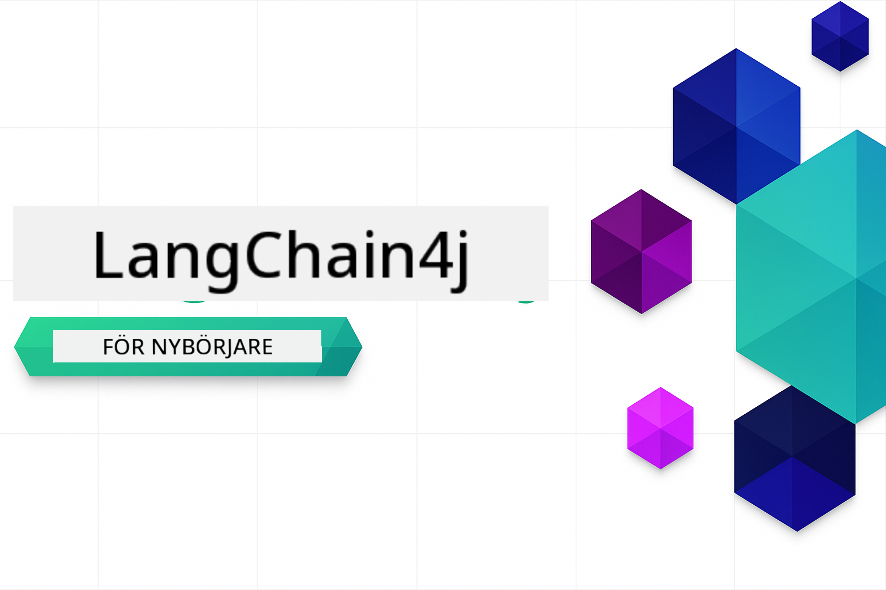

<!--
CO_OP_TRANSLATOR_METADATA:
{
  "original_hash": "6a3bd54fc243ce3dc79d18848d2b5413",
  "translation_date": "2026-01-05T23:37:17+00:00",
  "source_file": "README.md",
  "language_code": "sv"
}
-->


### 🌐 Stöd för flera språk

#### Stöds via GitHub Action (Automatiserat & Alltid Uppdaterat)

<!-- CO-OP TRANSLATOR LANGUAGES TABLE START -->
[Arabiska](../ar/README.md) | [Bengali](../bn/README.md) | [Bulgariska](../bg/README.md) | [Burmese (Myanmar)](../my/README.md) | [Kinesiska (Förenklad)](../zh/README.md) | [Kinesiska (Traditionell, Hongkong)](../hk/README.md) | [Kinesiska (Traditionell, Macao)](../mo/README.md) | [Kinesiska (Traditionell, Taiwan)](../tw/README.md) | [Kroatiska](../hr/README.md) | [Tjeckiska](../cs/README.md) | [Danska](../da/README.md) | [Holländska](../nl/README.md) | [Estniska](../et/README.md) | [Finska](../fi/README.md) | [Franska](../fr/README.md) | [Tyska](../de/README.md) | [Grekiska](../el/README.md) | [Hebreiska](../he/README.md) | [Hindi](../hi/README.md) | [Ungerska](../hu/README.md) | [Indonesiska](../id/README.md) | [Italienska](../it/README.md) | [Japanska](../ja/README.md) | [Kannada](../kn/README.md) | [Koreanska](../ko/README.md) | [Litauiska](../lt/README.md) | [Malayiska](../ms/README.md) | [Malayalam](../ml/README.md) | [Marathi](../mr/README.md) | [Nepalesiska](../ne/README.md) | [Nigeriansk pidgin](../pcm/README.md) | [Norska](../no/README.md) | [Persiska (Farsi)](../fa/README.md) | [Polska](../pl/README.md) | [Portugisiska (Brasilien)](../br/README.md) | [Portugisiska (Portugal)](../pt/README.md) | [Punjabi (Gurmukhi)](../pa/README.md) | [Rumänska](../ro/README.md) | [Ryska](../ru/README.md) | [Serbiska (Kyrilliska)](../sr/README.md) | [Slovakiska](../sk/README.md) | [Slovenska](../sl/README.md) | [Spanska](../es/README.md) | [Swahili](../sw/README.md) | [Svenska](./README.md) | [Tagalog (Filippinska)](../tl/README.md) | [Tamil](../ta/README.md) | [Telugu](../te/README.md) | [Thailändska](../th/README.md) | [Turkiska](../tr/README.md) | [Ukrainska](../uk/README.md) | [Urdu](../ur/README.md) | [Vietnamesiska](../vi/README.md)

> **Föredrar du att klona lokalt?**

> Detta arkiv innehåller över 50 språköversättningar vilket avsevärt ökar nedladdningsstorleken. För att klona utan översättningar, använd sparse checkout:
> ```bash
> git clone --filter=blob:none --sparse https://github.com/microsoft/LangChain4j-for-Beginners.git
> cd LangChain4j-for-Beginners
> git sparse-checkout set --no-cone '/*' '!translations' '!translated_images'
> ```
> Detta ger dig allt du behöver för att slutföra kursen med en mycket snabbare nedladdning.
<!-- CO-OP TRANSLATOR LANGUAGES TABLE END -->

# LangChain4j för nybörjare

En kurs för att bygga AI-applikationer med LangChain4j och Azure OpenAI GPT-5, från grundläggande chatt till AI-agenter.

**Ny till LangChain4j?** Kolla in [Ordlista](docs/GLOSSARY.md) för definitioner av nyckeltermer och koncept.

## Innehållsförteckning

1. [Snabbstart](00-quick-start/README.md) - Kom igång med LangChain4j
2. [Introduktion](01-introduction/README.md) - Lär dig grunderna i LangChain4j
3. [Prompt Engineering](02-prompt-engineering/README.md) - Bemästra effektiv promptdesign
4. [RAG (Retrieval-Augmented Generation)](03-rag/README.md) - Bygg intelligenta kunskapsbaserade system
5. [Verktyg](04-tools/README.md) - Integrera externa verktyg och enkla assistenter
6. [MCP (Model Context Protocol)](05-mcp/README.md) - Arbeta med Model Context Protocol (MCP) och Agentmoduler
---

## Läroplan

> **Snabbstart**

1. Forka detta arkiv till ditt GitHub-konto
2. Klicka **Code** → **Codespaces** fliken → **...** → **New with options...**
3. Använd standardinställningarna – detta väljer utvecklingscontainern som skapats för denna kurs
4. Klicka **Create codespace**
5. Vänta 5-10 minuter tills miljön är redo
6. Hoppa direkt till [Snabbstart](./00-quick-start/README.md) för att komma igång!

> **Föredrar du att klona lokalt?**
>
> Detta arkiv innehåller över 50 språköversättningar vilket avsevärt ökar nedladdningsstorleken. För att klona utan översättningar, använd sparse checkout:
> ```bash
> git clone --filter=blob:none --sparse https://github.com/microsoft/LangChain4j-for-Beginners.git
> cd LangChain4j-for-Beginners
> git sparse-checkout set --no-cone '/*' '!translations' '!translated_images'
> ```
> Detta ger dig allt du behöver för att slutföra kursen med en mycket snabbare nedladdning.

Efter att ha slutfört modulerna, utforska [Testningsguiden](docs/TESTING.md) för att se LangChain4j testningskoncept i praktiken.

> **Obs:** Denna utbildning använder både GitHub Models och Azure OpenAI. [Snabbstart](00-quick-start/README.md) modulen använder GitHub Models (ingen Azure-prenumeration behövs), medan modulerna 1-5 använder Azure OpenAI.


## Lära med GitHub Copilot

För att snabbt börja koda, öppna detta projekt i en GitHub Codespace eller din lokala IDE med den medföljande devcontainern. Devcontainern som används i denna kurs är förkonfigurerad med GitHub Copilot för AI-parprogrammering.

Varje kodexempel innehåller föreslagna frågor som du kan ställa till GitHub Copilot för att fördjupa din förståelse. Leta efter 💡/🤖 prompts i:

- **Java-filsrubriker** - Frågor specifika för varje exempel
- **Modulers README-filer** - Utforskningsuppmaningar efter kodexempel

**Hur man använder:** Öppna vilken kodfil som helst och ställ Copilot de föreslagna frågorna. Den har full kontext av kodbasen och kan förklara, utöka och föreslå alternativ.

Vill du lära dig mer? Kolla in [Copilot för AI-parprogrammering](https://aka.ms/GitHubCopilotAI).


## Ytterligare resurser

<!-- CO-OP TRANSLATOR OTHER COURSES START -->
### LangChain
[](https://aka.ms/langchain4j-for-beginners)
[](https://aka.ms/langchainjs-for-beginners?WT.mc_id=m365-94501-dwahlin)

---

### Azure / Edge / MCP / Agenter
[](https://github.com/microsoft/AZD-for-beginners?WT.mc_id=academic-105485-koreyst)
[](https://github.com/microsoft/edgeai-for-beginners?WT.mc_id=academic-105485-koreyst)
[](https://github.com/microsoft/mcp-for-beginners?WT.mc_id=academic-105485-koreyst)
[](https://github.com/microsoft/ai-agents-for-beginners?WT.mc_id=academic-105485-koreyst)

---
 
### Generativ AI-serie
[](https://github.com/microsoft/generative-ai-for-beginners?WT.mc_id=academic-105485-koreyst)
[-9333EA?style=for-the-badge&labelColor=E5E7EB&color=9333EA)](https://github.com/microsoft/Generative-AI-for-beginners-dotnet?WT.mc_id=academic-105485-koreyst)
[-C084FC?style=for-the-badge&labelColor=E5E7EB&color=C084FC)](https://github.com/microsoft/generative-ai-for-beginners-java?WT.mc_id=academic-105485-koreyst)
[-E879F9?style=for-the-badge&labelColor=E5E7EB&color=E879F9)](https://github.com/microsoft/generative-ai-with-javascript?WT.mc_id=academic-105485-koreyst)

---
 
### Kärnlärande
[](https://aka.ms/ml-beginners?WT.mc_id=academic-105485-koreyst)
[](https://aka.ms/datascience-beginners?WT.mc_id=academic-105485-koreyst)
[](https://aka.ms/ai-beginners?WT.mc_id=academic-105485-koreyst)
[](https://github.com/microsoft/Security-101?WT.mc_id=academic-96948-sayoung)
[](https://aka.ms/webdev-beginners?WT.mc_id=academic-105485-koreyst)
[](https://aka.ms/iot-beginners?WT.mc_id=academic-105485-koreyst)
[](https://github.com/microsoft/xr-development-for-beginners?WT.mc_id=academic-105485-koreyst)

---
 
### Copilot-serien
[](https://aka.ms/GitHubCopilotAI?WT.mc_id=academic-105485-koreyst)
[](https://github.com/microsoft/mastering-github-copilot-for-dotnet-csharp-developers?WT.mc_id=academic-105485-koreyst)
[](https://github.com/microsoft/CopilotAdventures?WT.mc_id=academic-105485-koreyst)
<!-- CO-OP TRANSLATOR OTHER COURSES END -->

## Skaffa hjälp

Om du sitter fast eller har några frågor om att bygga AI-appar, gå med i:

[](https://aka.ms/foundry/discord)

Om du har produktfeedback eller fel under byggandet, besök:

[](https://aka.ms/foundry/forum)

## Licens

MIT-licens - Se [LICENSE](../../LICENSE) filen för detaljer.

---

<!-- CO-OP TRANSLATOR DISCLAIMER START -->
**Ansvarsfriskrivning**:
Detta dokument har översatts med hjälp av AI-översättningstjänsten [Co-op Translator](https://github.com/Azure/co-op-translator). Även om vi strävar efter noggrannhet bör du vara medveten om att automatiska översättningar kan innehålla fel eller brister. Det ursprungliga dokumentet på dess modersmål ska betraktas som den auktoritativa källan. För kritisk information rekommenderas professionell mänsklig översättning. Vi ansvarar inte för eventuella missförstånd eller feltolkningar som uppstår från användningen av denna översättning.
<!-- CO-OP TRANSLATOR DISCLAIMER END -->