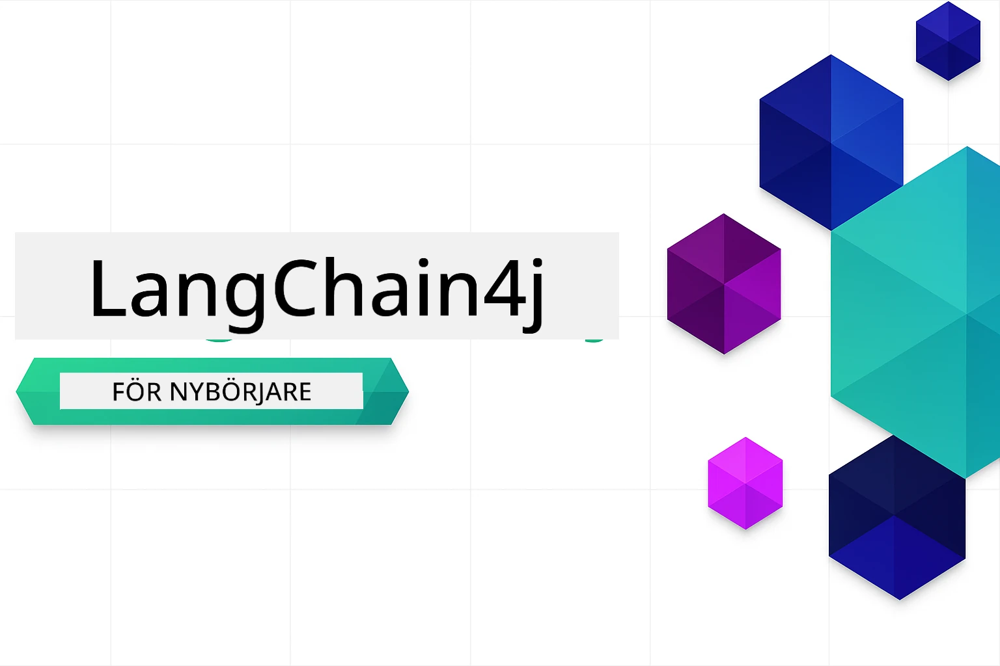

# LangChain4j för nybörjare

En kurs för att bygga AI-applikationer med LangChain4j och Azure OpenAI GPT-5.2, från grundläggande chatt till AI-agenter.

### 🌐 Flera språks stöd

#### Stöds via GitHub Action (Automatiserat & Alltid uppdaterat)

<!-- CO-OP TRANSLATOR LANGUAGES TABLE START -->
[Arabic](../ar/README.md) | [Bengali](../bn/README.md) | [Bulgarian](../bg/README.md) | [Burmese (Myanmar)](../my/README.md) | [Chinese (Simplified)](../zh-CN/README.md) | [Chinese (Traditional, Hong Kong)](../zh-HK/README.md) | [Chinese (Traditional, Macau)](../zh-MO/README.md) | [Chinese (Traditional, Taiwan)](../zh-TW/README.md) | [Croatian](../hr/README.md) | [Czech](../cs/README.md) | [Danish](../da/README.md) | [Dutch](../nl/README.md) | [Estonian](../et/README.md) | [Finnish](../fi/README.md) | [French](../fr/README.md) | [German](../de/README.md) | [Greek](../el/README.md) | [Hebrew](../he/README.md) | [Hindi](../hi/README.md) | [Hungarian](../hu/README.md) | [Indonesian](../id/README.md) | [Italian](../it/README.md) | [Japanese](../ja/README.md) | [Kannada](../kn/README.md) | [Khmer](../km/README.md) | [Korean](../ko/README.md) | [Lithuanian](../lt/README.md) | [Malay](../ms/README.md) | [Malayalam](../ml/README.md) | [Marathi](../mr/README.md) | [Nepali](../ne/README.md) | [Nigerian Pidgin](../pcm/README.md) | [Norwegian](../no/README.md) | [Persian (Farsi)](../fa/README.md) | [Polish](../pl/README.md) | [Portuguese (Brazil)](../pt-BR/README.md) | [Portuguese (Portugal)](../pt-PT/README.md) | [Punjabi (Gurmukhi)](../pa/README.md) | [Romanian](../ro/README.md) | [Russian](../ru/README.md) | [Serbian (Cyrillic)](../sr/README.md) | [Slovak](../sk/README.md) | [Slovenian](../sl/README.md) | [Spanish](../es/README.md) | [Swahili](../sw/README.md) | [Swedish](./README.md) | [Tagalog (Filipino)](../tl/README.md) | [Tamil](../ta/README.md) | [Telugu](../te/README.md) | [Thai](../th/README.md) | [Turkish](../tr/README.md) | [Ukrainian](../uk/README.md) | [Urdu](../ur/README.md) | [Vietnamese](../vi/README.md)

> **Föredrar du att klona lokalt?**
>
> Detta arkiv inkluderar över 50 språköversättningar vilket avsevärt ökar nedladdningsstorleken. För att klona utan översättningar, använd sparse checkout:
>
> **Bash / macOS / Linux:**
> ```bash
> git clone --filter=blob:none --sparse https://github.com/microsoft/LangChain4j-for-Beginners.git
> cd LangChain4j-for-Beginners
> git sparse-checkout set --no-cone '/*' '!translations' '!translated_images'
> ```
>
> **CMD (Windows):**
> ```cmd
> git clone --filter=blob:none --sparse https://github.com/microsoft/LangChain4j-for-Beginners.git
> cd LangChain4j-for-Beginners
> git sparse-checkout set --no-cone "/*" "!translations" "!translated_images"
> ```
>
> Detta ger dig allt du behöver för att slutföra kursen med en mycket snabbare nedladdning.
<!-- CO-OP TRANSLATOR LANGUAGES TABLE END -->

## Innehållsförteckning

1. [Introduktion](01-introduction/README.md) - Lär dig grunderna i LangChain4j
2. [Prompt Engineering](02-prompt-engineering/README.md) - Bemästra effektiv promptdesign
3. [RAG (Retrieval-Augmented Generation)](03-rag/README.md) - Bygg intelligenta kunskapsbaserade system
4. [Verktyg](04-tools/README.md) - Integrera externa verktyg och enkla assistenter
5. [MCP (Model Context Protocol)](05-mcp/README.md) - Arbeta med Model Context Protocol (MCP) och Agentic-moduler

### Videogenomgångar

Varje modul har en följesession där vi steg för steg går igenom koncept och kod.

| Modul | Video |
|--------|-------|
| 01 - Introduktion | [Komma igång med LangChain4j](https://www.youtube.com/live/nl_troDm8rQ) |
| 02 - Prompt Engineering | [Prompt Engineering med LangChain4j](https://www.youtube.com/live/PJ6aBaE6bog) |
| 03 - RAG | [RAG med LangChain4j](https://www.youtube.com/watch?v=_olq75ZH_eY) |
| 04 - Verktyg & 05 - MCP | [AI-agenter med Verktyg och MCP](https://www.youtube.com/watch?v=O_J30kZc0rw) |

---

## Läroplan

**Ny på LangChain4j?** Kolla in [Ordlista](docs/GLOSSARY.md) för definitioner av viktiga termer och begrepp.

> **Snabbstart**

1. Forka detta arkiv till ditt GitHub-konto
2. Klicka på **Code** → fliken **Codespaces** → **...** → **New with options...**
3. Använd standardinställningarna – detta väljer Utvecklingscontainern som skapats för denna kurs
4. Klicka på **Create codespace**
5. Vänta 5-10 minuter tills miljön är klar
6. Hoppa direkt till [Introduktion](./01-introduction/README.md) för att komma igång!

Efter att ha slutfört modulerna, utforska [Testningsguiden](docs/TESTING.md) för att se LangChain4js testkoncept i praktiken.

> **Obs:** Denna träning använder Azure OpenAI. Kom igång med ett [GRATIS Azure-konto](https://aka.ms/azure-free-account) om du inte har ett.


## Lära med GitHub Copilot

För att snabbt börja koda, öppna detta projekt i en GitHub Codespace eller din lokala IDE med den medföljande devcontainern. Devcontainern som används i denna kurs är förkonfigurerad med GitHub Copilot för AI-parprogrammering.

Varje kodexempel innehåller föreslagna frågor som du kan ställa till GitHub Copilot för att fördjupa din förståelse. Leta efter 💡/🤖-prompterna i:

- **Java-filhuvuden** - Frågor specifika för varje exempel
- **Modulernas README-filer** - Utforskningsfrågor efter kodexempel

**Hur man använder:** Öppna vilken kodfil som helst och ställ Copilot de föreslagna frågorna. Den har full kontext av kodbasen och kan förklara, utöka och föreslå alternativ.

Vill du lära dig mer? Kolla in [Copilot för AI-parprogrammering](https://aka.ms/GitHubCopilotAI).


## Ytterligare resurser

<!-- CO-OP TRANSLATOR OTHER COURSES START -->
### LangChain
[](https://aka.ms/langchain4j-for-beginners)
[](https://aka.ms/langchainjs-for-beginners?WT.mc_id=m365-94501-dwahlin)
[](https://github.com/microsoft/langchain-for-beginners?WT.mc_id=m365-94501-dwahlin)
---

### Azure / Edge / MCP / Agenter
[](https://github.com/microsoft/AZD-for-beginners?WT.mc_id=academic-105485-koreyst)
[](https://github.com/microsoft/edgeai-for-beginners?WT.mc_id=academic-105485-koreyst)
[](https://github.com/microsoft/mcp-for-beginners?WT.mc_id=academic-105485-koreyst)
[](https://github.com/microsoft/ai-agents-for-beginners?WT.mc_id=academic-105485-koreyst)

---
 
### Generativ AI-serie
[](https://github.com/microsoft/generative-ai-for-beginners?WT.mc_id=academic-105485-koreyst)
[-9333EA?style=for-the-badge&labelColor=E5E7EB&color=9333EA)](https://github.com/microsoft/Generative-AI-for-beginners-dotnet?WT.mc_id=academic-105485-koreyst)
[-C084FC?style=for-the-badge&labelColor=E5E7EB&color=C084FC)](https://github.com/microsoft/generative-ai-for-beginners-java?WT.mc_id=academic-105485-koreyst)
[-E879F9?style=for-the-badge&labelColor=E5E7EB&color=E879F9)](https://github.com/microsoft/generative-ai-with-javascript?WT.mc_id=academic-105485-koreyst)

---
 
### Kärnlära
[](https://aka.ms/ml-beginners?WT.mc_id=academic-105485-koreyst)
[](https://aka.ms/datascience-beginners?WT.mc_id=academic-105485-koreyst)
[](https://aka.ms/ai-beginners?WT.mc_id=academic-105485-koreyst)
[](https://github.com/microsoft/Security-101?WT.mc_id=academic-96948-sayoung)

[](https://aka.ms/webdev-beginners?WT.mc_id=academic-105485-koreyst)
[](https://aka.ms/iot-beginners?WT.mc_id=academic-105485-koreyst)
[](https://github.com/microsoft/xr-development-for-beginners?WT.mc_id=academic-105485-koreyst)

---
 
### Copilot-serien
[](https://aka.ms/GitHubCopilotAI?WT.mc_id=academic-105485-koreyst)
[](https://github.com/microsoft/mastering-github-copilot-for-dotnet-csharp-developers?WT.mc_id=academic-105485-koreyst)
[](https://github.com/microsoft/CopilotAdventures?WT.mc_id=academic-105485-koreyst)
<!-- CO-OP TRANSLATOR OTHER COURSES END -->

## Få hjälp

Om du fastnar eller har några frågor om att bygga AI-appar, gå med i:

[](https://aka.ms/foundry/discord)

Om du har produktfeedback eller stöter på fel när du bygger, besök:

[](https://aka.ms/foundry/forum)

## Licens

MIT-licens - Se [LICENSE](../../LICENSE) filen för detaljer.

---

<!-- CO-OP TRANSLATOR DISCLAIMER START -->
**Ansvarsfriskrivning**:
Detta dokument har översatts med hjälp av AI-översättningstjänsten [Co-op Translator](https://github.com/Azure/co-op-translator). Även om vi strävar efter noggrannhet, var vänlig notera att automatiska översättningar kan innehålla fel eller brister. Det ursprungliga dokumentet på dess modersmål bör betraktas som den auktoritativa källan. För kritisk information rekommenderas professionell mänsklig översättning. Vi ansvarar inte för några missförstånd eller feltolkningar som uppstår till följd av användningen av denna översättning.
<!-- CO-OP TRANSLATOR DISCLAIMER END -->