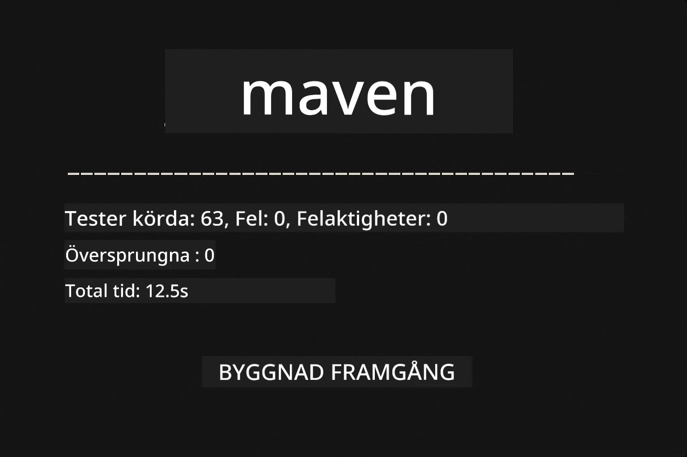
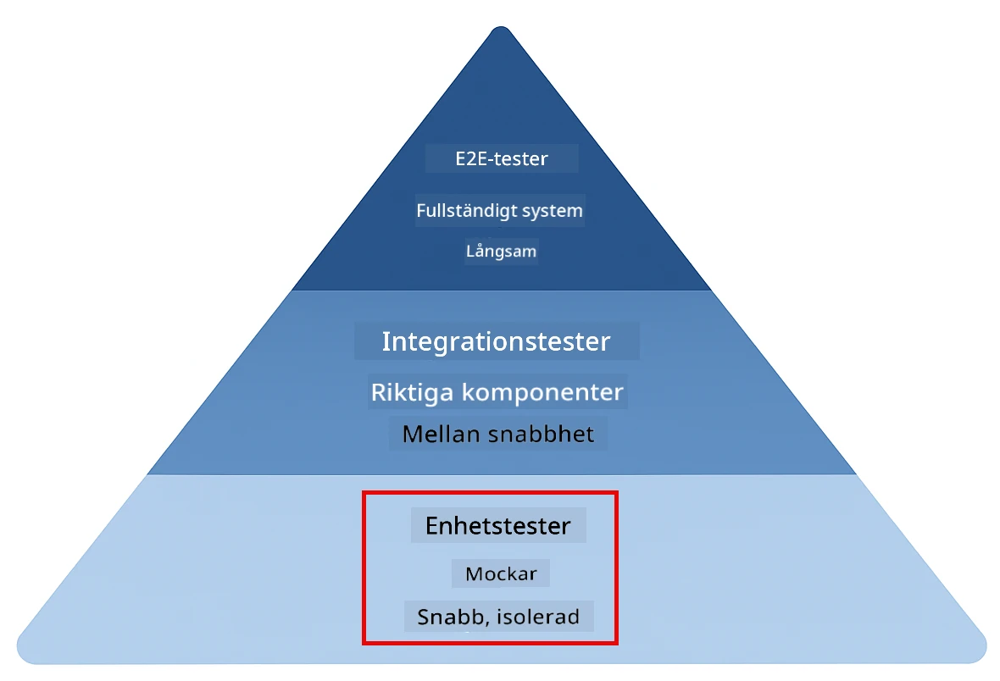
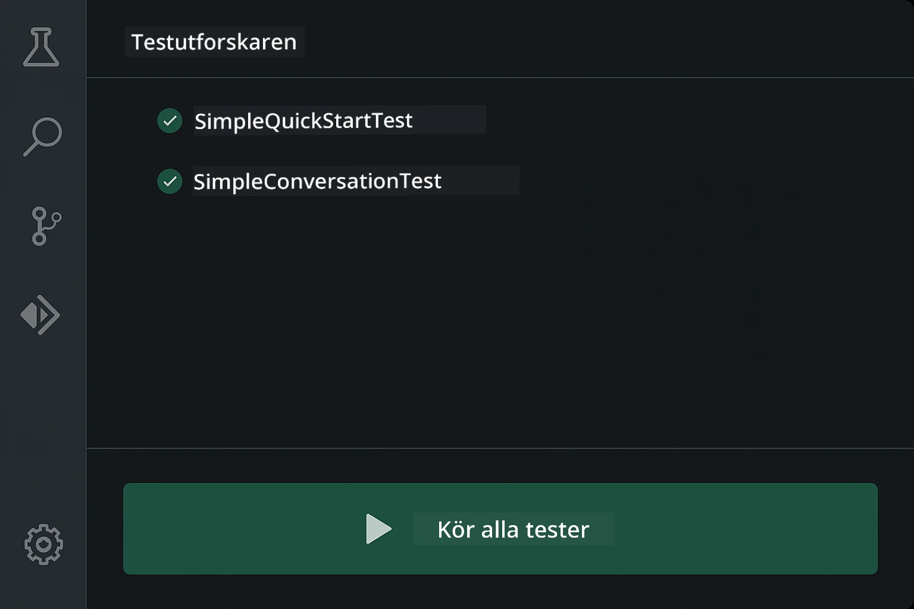
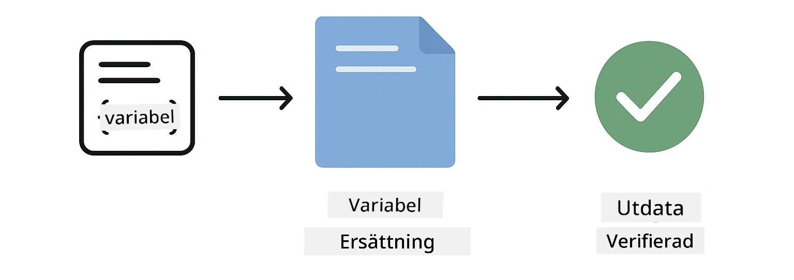
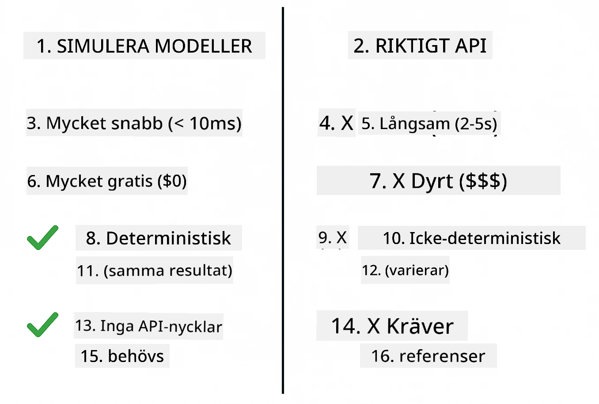
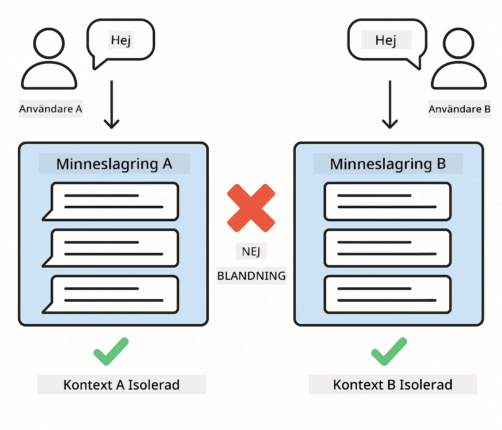
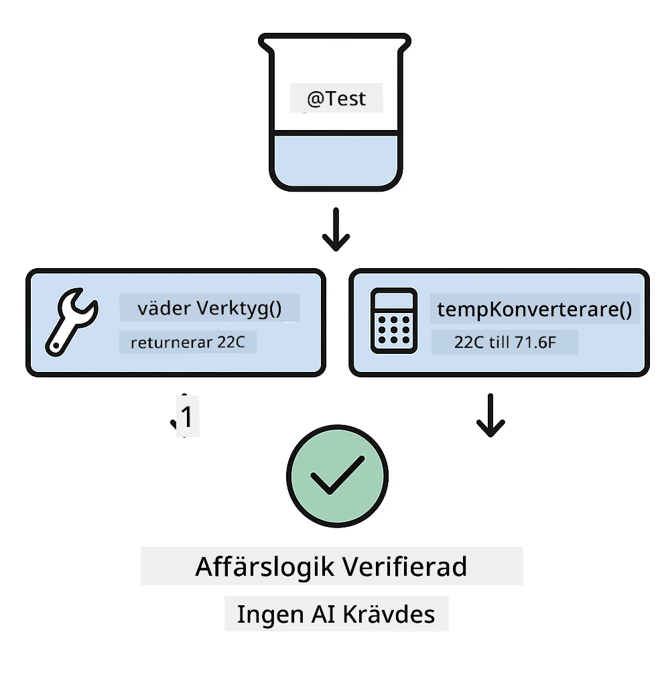
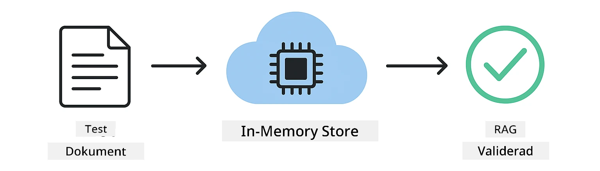

# Testa LangChain4j-applikationer

## Innehållsförteckning

- [Snabbstart](#snabbstart)
- [Vad testen täcker](#vad-testen-täcker)
- [Köra testen](#köra-testen)
- [Köra tester i VS Code](#köra-tester-i-vs-code)
- [Testmönster](#testmönster)
- [Testfilosofi](#testfilosofi)
- [Nästa steg](#nästa-steg)

Denna guide går igenom testen som visar hur man testar AI-applikationer utan att kräva API-nycklar eller externa tjänster.

## Snabbstart

Kör alla tester med ett enda kommando:

**Bash:**
```bash
mvn test
```

**PowerShell:**
```powershell
mvn --% test
```

När alla tester passerar bör du se output som i skärmdumpen nedan — tester körs utan några fel.



*Framgångsrikt testkörning som visar att alla tester passerar utan fel*

## Vad testen täcker

Denna kurs fokuserar på **enhetstester** som körs lokalt. Varje test demonstrerar ett specifikt LangChain4j-koncept isolerat. Testpyramiden nedan visar var enhetstester passar in — de utgör den snabba, tillförlitliga grund som resten av din teststrategi bygger på.



*Testpyramid som visar balansen mellan enhetstester (snabba, isolerade), integrationstester (riktiga komponenter) och end-to-end-tester. Denna utbildning täcker enhetstester.*

| Modul | Tester | Fokus | Nyckelfiler |
|--------|-------|-------|-----------|
| **01 - Introduktion** | 8 | Konversationsminne och tillståndsbaserad chatt | `SimpleConversationTest.java` |
| **02 - Prompt Engineering** | 12 | GPT-5.2-mönster, ivernivåer, strukturerad output | `SimpleGpt5PromptTest.java` |
| **03 - RAG** | 10 | Dokumentingestion, embeddingar, likhetssökning | `DocumentServiceTest.java` |
| **04 - Verktyg** | 12 | Funktionsanrop och verktygskedjor | `SimpleToolsTest.java` |
| **05 - MCP** | 8 | Model Context Protocol med Stdio-transport | `SimpleMcpTest.java` |

## Köra testen

**Kör alla tester från root:**

**Bash:**
```bash
mvn test
```

**PowerShell:**
```powershell
mvn --% test
```

**Kör tester för en specifik modul:**

**Bash:**
```bash
cd 01-introduction && mvn test
# Eller från rot
mvn test -pl 01-introduction
```

**PowerShell:**
```powershell
cd 01-introduction; mvn --% test
# Eller från root
mvn --% test -pl 01-introduction
```

**Kör en enskild testklass:**

**Bash:**
```bash
mvn test -Dtest=SimpleConversationTest
```

**PowerShell:**
```powershell
mvn --% test -Dtest=SimpleConversationTest
```

**Kör en specifik testmetod:**

**Bash:**
```bash
mvn test -Dtest=SimpleConversationTest#börBehållaKonversationshistorik
```

**PowerShell:**
```powershell
mvn --% test -Dtest=SimpleConversationTest#börBehållaSamtalshistorik
```

## Köra tester i VS Code

Om du använder Visual Studio Code ger Test Explorer ett grafiskt gränssnitt för att köra och felsöka tester.



*VS Code Test Explorer som visar testträdet med alla Java testklasser och individuella testmetoder*

**För att köra tester i VS Code:**

1. Öppna Test Explorer genom att klicka på provröret i aktivitetsfältet
2. Expandera testträdet för att se alla moduler och testklasser
3. Klicka på spelknappen bredvid ett test för att köra det individuellt
4. Klicka på "Run All Tests" för att köra hela testuppsättningen
5. Högerklicka på ett test och välj "Debug Test" för att sätta brytpunkter och stega igenom koden

Test Explorer visar gröna bockar för passerade tester och ger detaljerade felmeddelanden när tester misslyckas.

## Testmönster

### Mönster 1: Testa Prompt-mallar

Det enklaste mönstret testar promptmallar utan att anropa något AI-modell. Du verifierar att variabelersättning fungerar korrekt och att promptarna är korrekt formaterade.



*Test av promptmallar som visar flödet för variabelersättning: mall med platshållare → värden applicerade → formaterad output verifierad*

```java
@Test
@DisplayName("Should format prompt template with variables")
void testPromptTemplateFormatting() {
    PromptTemplate template = PromptTemplate.from(
        "Best time to visit {{destination}} for {{activity}}?"
    );
    
    Prompt prompt = template.apply(Map.of(
        "destination", "Paris",
        "activity", "sightseeing"
    ));
    
    assertThat(prompt.text()).isEqualTo("Best time to visit Paris for sightseeing?");
}
```

Detta mönster verifierar att variabelersättning fungerar korrekt och att promptar formateras som förväntat — ingen API-nyckel eller modell-anrop krävs.

### Mönster 2: Mocka språkmodeller

När du testar konversationslogik, använd Mockito för att skapa falska modeller som returnerar förutbestämda svar. Detta gör testerna snabba, kostnadsfria och deterministiska.



*Jämförelse som visar varför mocks föredras för testning: de är snabba, gratis, deterministiska och kräver inga API-nycklar*

```java
@ExtendWith(MockitoExtension.class)
class SimpleConversationTest {
    
    private ConversationService conversationService;
    
    @Mock
    private OpenAiOfficialChatModel mockChatModel;
    
    @BeforeEach
    void setUp() {
        ChatResponse mockResponse = ChatResponse.builder()
            .aiMessage(AiMessage.from("This is a test response"))
            .build();
        when(mockChatModel.chat(anyList())).thenReturn(mockResponse);
        
        conversationService = new ConversationService(mockChatModel);
    }
    
    @Test
    void shouldMaintainConversationHistory() {
        String conversationId = conversationService.startConversation();
        
        ChatResponse mockResponse1 = ChatResponse.builder()
            .aiMessage(AiMessage.from("Response 1"))
            .build();
        ChatResponse mockResponse2 = ChatResponse.builder()
            .aiMessage(AiMessage.from("Response 2"))
            .build();
        ChatResponse mockResponse3 = ChatResponse.builder()
            .aiMessage(AiMessage.from("Response 3"))
            .build();
        
        when(mockChatModel.chat(anyList()))
            .thenReturn(mockResponse1)
            .thenReturn(mockResponse2)
            .thenReturn(mockResponse3);

        conversationService.chat(conversationId, "First message");
        conversationService.chat(conversationId, "Second message");
        conversationService.chat(conversationId, "Third message");

        List<ChatMessage> history = conversationService.getHistory(conversationId);
        assertThat(history).hasSize(6); // 3 användarmeddelanden + 3 AI-meddelanden
    }
}
```

Detta mönster finns i `01-introduction/src/test/java/com/example/langchain4j/service/SimpleConversationTest.java`. Mocken säkerställer konsekvent beteende så att du kan verifiera att minneshantering fungerar korrekt.

### Mönster 3: Testa konversationsisolering

Konversationsminnet måste hålla flera användare separerade. Detta test verifierar att konversationer inte blandar samman kontexter.



*Test av konversationsisolering som visar separata minneslager för olika användare för att förhindra kontextblandning*

```java
@Test
void shouldIsolateConversationsByid() {
    String conv1 = conversationService.startConversation();
    String conv2 = conversationService.startConversation();
    
    ChatResponse mockResponse = ChatResponse.builder()
        .aiMessage(AiMessage.from("Response"))
        .build();
    when(mockChatModel.chat(anyList())).thenReturn(mockResponse);

    conversationService.chat(conv1, "Message for conversation 1");
    conversationService.chat(conv2, "Message for conversation 2");

    List<ChatMessage> history1 = conversationService.getHistory(conv1);
    List<ChatMessage> history2 = conversationService.getHistory(conv2);
    
    assertThat(history1).hasSize(2);
    assertThat(history2).hasSize(2);
}
```

Varje konversation behåller sin egen oberoende historik. I produktionssystem är denna isolering kritisk för applikationer med flera användare.

### Mönster 4: Testa verktyg oberoende

Verktyg är funktioner som AI kan anropa. Testa dem direkt för att säkerställa att de fungerar korrekt oberoende av AI-beslut.



*Test av verktyg oberoende som visar mock-körning av verktyg utan AI-anrop för att verifiera affärslogiken*

```java
@Test
void shouldConvertCelsiusToFahrenheit() {
    TemperatureTool tempTool = new TemperatureTool();
    String result = tempTool.celsiusToFahrenheit(25.0);
    assertThat(result).containsPattern("77[.,]0°F");
}

@Test
void shouldDemonstrateToolChaining() {
    WeatherTool weatherTool = new WeatherTool();
    TemperatureTool tempTool = new TemperatureTool();

    String weatherResult = weatherTool.getCurrentWeather("Seattle");
    assertThat(weatherResult).containsPattern("\\d+°C");

    String conversionResult = tempTool.celsiusToFahrenheit(22.0);
    assertThat(conversionResult).containsPattern("71[.,]6°F");
}
```

Dessa tester från `04-tools/src/test/java/com/example/langchain4j/agents/tools/SimpleToolsTest.java` validerar verktygslogik utan AI-inblandning. Exemplet med kedjning visar hur output från ett verktyg matas som input till ett annat.

### Mönster 5: In-memory RAG-testning

RAG-system kräver traditionellt vektordatabaser och embeddingtjänster. In-memory-mönstret låter dig testa hela pipelinen utan externa beroenden.



*In-memory RAG-testflöde som visar dokumentparsing, embedding lagring och likhetssökning utan krav på databas*

```java
@Test
void testProcessTextDocument() {
    String content = "This is a test document.\nIt has multiple lines.";
    InputStream inputStream = new ByteArrayInputStream(content.getBytes(StandardCharsets.UTF_8));
    
    DocumentService.ProcessedDocument result = 
        documentService.processDocument(inputStream, "test.txt");

    assertNotNull(result);
    assertTrue(result.segments().size() > 0);
    assertEquals("test.txt", result.segments().get(0).metadata().getString("filename"));
}
```

Detta test från `03-rag/src/test/java/com/example/langchain4j/rag/service/DocumentServiceTest.java` skapar ett dokument i minnet och verifierar chunkning och metadatahantering.

### Mönster 6: MCP-integrationstestning

MCP-modulen testar integrationen av Model Context Protocol med stdio-transport. Dessa tester verifierar att din applikation kan starta och kommunicera med MCP-servrar som underprocesser.

Tester i `05-mcp/src/test/java/com/example/langchain4j/mcp/SimpleMcpTest.java` validerar MCP-klientbeteende.

**Kör dem:**

**Bash:**
```bash
cd 05-mcp && mvn test
```

**PowerShell:**
```powershell
cd 05-mcp; mvn --% test
```

## Testfilosofi

Testa din kod, inte AI:n. Dina tester bör validera koden du skriver genom att kontrollera hur prompts konstrueras, hur minne hanteras, och hur verktyg körs. AI-svar varierar och bör inte vara en del av testpåståenden. Fråga dig om din promptmall korrekt ersätter variabler, inte om AI:n ger rätt svar.

Använd mocks för språkmodeller. De är externa beroenden som är långsamma, dyra och icke-deterministiska. Mocking gör tester snabba med millisekunder istället för sekunder, gratis utan API-kostnader och deterministiska med samma resultat varje gång.

Håll tester oberoende. Varje test bör sätta upp sina egna data, inte förlita sig på andra tester och städa upp efter sig. Tester ska passera oavsett körordning.

Testa kantfall utöver den lyckade vägen. Prova tomma indata, väldigt stora indata, specialtecken, ogiltiga parametrar och gränsvärden. Dessa avslöjar ofta buggar som vanlig användning inte gör.

Använd beskrivande namn. Jämför `shouldMaintainConversationHistoryAcrossMultipleMessages()` med `test1()`. Det första talar om exakt vad som testas, vilket gör felsökning av fel mycket enklare.

## Nästa steg

Nu när du förstår testmönstren, fördjupa dig i varje modul:

- **[01 - Introduktion](../01-introduction/README.md)** - Lär dig hantera konversationsminne
- **[02 - Prompt Engineering](../02/prompt-engineering/README.md)** - Bemästra GPT-5.2 promptmönster
- **[03 - RAG](../03-rag/README.md)** - Bygg retrieval-augmented generation-system
- **[04 - Verktyg](../04-tools/README.md)** - Implementera funktionsanrop och verktygskedjor
- **[05 - MCP](../05-mcp/README.md)** - Integrera Model Context Protocol

Varje moduls README ger detaljerade förklaringar av de koncept som testas här.

---

**Navigering:** [← Tillbaka till huvudmenyn](../README.md)

---

<!-- CO-OP TRANSLATOR DISCLAIMER START -->
**Ansvarsfriskrivning**:
Detta dokument har översatts med hjälp av AI-översättningstjänsten [Co-op Translator](https://github.com/Azure/co-op-translator). Även om vi strävar efter noggrannhet, var vänlig notera att automatiska översättningar kan innehålla fel eller brister. Det ursprungliga dokumentet på dess modersmål bör betraktas som den auktoritativa källan. För kritisk information rekommenderas professionell mänsklig översättning. Vi ansvarar inte för några missförstånd eller feltolkningar som uppstår till följd av användningen av denna översättning.
<!-- CO-OP TRANSLATOR DISCLAIMER END -->