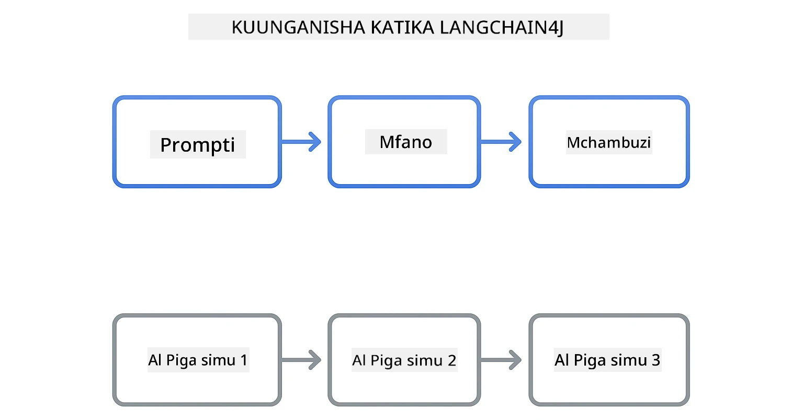
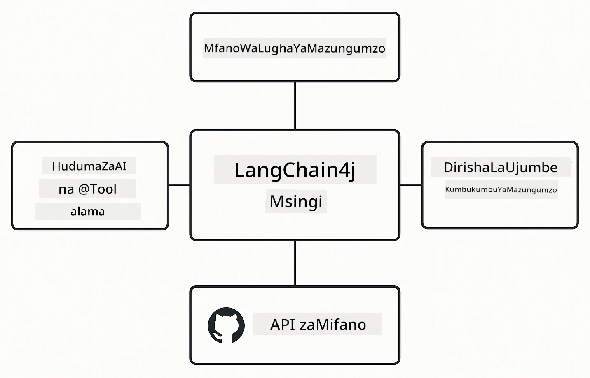

# Moduli 00: Anza Haraka

## Orodha ya Maudhui

- [Utangulizi](../../../00-quick-start)
- [LangChain4j ni Nini?](../../../00-quick-start)
- [Mategemeo ya LangChain4j](../../../00-quick-start)
- [Mahitaji ya Awali](../../../00-quick-start)
- [Usanidi](../../../00-quick-start)
  - [1. Pata Tokeni Yako ya GitHub](../../../00-quick-start)
  - [2. Weka Tokeni Yako](../../../00-quick-start)
- [Endesha Mifano](../../../00-quick-start)
  - [1. Mazungumzo Msingi](../../../00-quick-start)
  - [2. Mifumo ya Prompt](../../../00-quick-start)
  - [3. Kupiga Simu za Kazi](../../../00-quick-start)
  - [4. Maswali na Majibu ya Hati (RAG)](../../../00-quick-start)
  - [5. AI Inayowajibika](../../../00-quick-start)
- [Kila Mfano unaonyesha nini](../../../00-quick-start)
- [Hatua Zifuatazo](../../../00-quick-start)
- [Utatuzi wa Matatizo](../../../00-quick-start)

## Utangulizi

Anza haraka hii imekusudiwa kukuwezesha kuanza na LangChain4j haraka iwezekanavyo. Inafunika msingi kabisa wa kujenga programu za AI kwa kutumia LangChain4j na Mifano ya GitHub. Katika moduli zinazofuata utatumia Azure OpenAI na LangChain4j kujenga programu tata zaidi.

## LangChain4j ni Nini?

LangChain4j ni maktaba ya Java inayorahisisha ujenzi wa programu zinazotumia AI. Badala ya kushughulikia wateja wa HTTP na uchambuzi wa JSON, unafanya kazi na API za Java safi.

“Nje ya mlolongo” (chain) katika LangChain inahusu kuunganisha sehemu kadhaa pamoja - unaweza kuunganisha prompt na modeli kisha na parser, au kuunganisha simu nyingi za AI ambapo matokeo ya moja huingiza kwenye ingizo la nyingine. Anza haraka hii inalenga misingi kabla ya kuchunguza mlolongo tata zaidi.



*Kushikamana kwa vipengele katika LangChain4j - sehemu za msingi zinazoungana kuunda michakato yenye nguvu ya AI*

Tutatumia vipengele vitatu vya msingi:

**ChatLanguageModel** – Kiolesura cha mawasiliano na modeli za AI. Piga `model.chat("prompt")` na upate jibu kama stringi. Tunatumia `OpenAiOfficialChatModel` inayofanya kazi na vituo vinavyolingana na OpenAI kama Mifano ya GitHub.

**AiServices** – Huunda interfaces za huduma za AI zisizo na hatari za aina. Eleza mbinu, ziweke alama na `@Tool`, na LangChain4j hushughulikia uratibu. AI huita mbinu zako za Java moja kwa moja inapohitajika.

**MessageWindowChatMemory** – Huhifadhi historia ya mazungumzo. Bila hii, kila ombi ni huru. Ukiwa na hii, AI hukumbuka ujumbe uliotangulia na huendelea na muktadha kwa mizunguko mingi.



*Usanifu wa LangChain4j - vipengele muhimu vinavyofanya kazi pamoja kuendesha programu zako za AI*

## Mategemeo ya LangChain4j

Anza haraka hii inatumia mategemeo mawili ya Maven ndani ya [`pom.xml`](../../../00-quick-start/pom.xml):

```xml
<!-- Core LangChain4j library -->
<dependency>
    <groupId>dev.langchain4j</groupId>
    <artifactId>langchain4j</artifactId> <!-- Inherited from BOM in root pom.xml -->
</dependency>

<!-- OpenAI integration (works with GitHub Models) -->
<dependency>
    <groupId>dev.langchain4j</groupId>
    <artifactId>langchain4j-open-ai-official</artifactId> <!-- Inherited from BOM in root pom.xml -->
</dependency>
```

Moduli ya `langchain4j-open-ai-official` inatoa darasa la `OpenAiOfficialChatModel` linalounganisha APIs zinazolingana na OpenAI. Mifano ya GitHub inatumia muundo huo huo wa API, hivyo hakuna adaptor maalum unayohitaji - tuelekeze URL ya msingi kwa `https://models.github.ai/inference`.

## Mahitaji ya Awali

**Unatumia Dev Container?** Java na Maven tayari vimesakinishwa. Unahitaji tokeni yako binafsi ya Ufikiaji wa GitHub tu.

**Maendeleo ya Kijijini:**
- Java 21+, Maven 3.9+
- Tokeni binafsi ya Ufikiaji wa GitHub (maelekezo chini)

> **Kumbuka:** Moduli hii inatumia `gpt-4.1-nano` kutoka Mifano ya GitHub. Usibadilishe jina la modeli katika nambari - limesanidiwa kufanya kazi na mifano inayopatikana ya GitHub.

## Usanidi

### 1. Pata Tokeni Yako ya GitHub

1. Nenda [Mipangilio ya GitHub → Tokeni za Ufikiaji Binafsi](https://github.com/settings/personal-access-tokens)
2. Bonyeza "Generate new token"
3. Weka jina linaloelezea (mfano, "LangChain4j Demo")
4. Weka muda wa kuisha tokeni (siku 7 zinapendekezwa)
5. Chini ya "Account permissions", tafuta "Models" na seti kwa "Read-only"
6. Bonyeza "Generate token"
7. Nakili na hifadhi tokeni yako - hautaiona tena

### 2. Weka Tokeni Yako

**Chaguo 1: Kutumia VS Code (Inapendekezwa)**

Ikiwa unatumia VS Code, ongeza tokeni yako kwenye faili `.env` katika mizizi ya mradi:

Kama faili `.env` haipo, nakili `.env.example` kwenda `.env` au tengeneza faili mpya `.env` katika mizizi ya mradi.

**Mfano wa faili `.env`:**
```bash
# Katika /workspaces/LangChain4j-for-Beginners/.env
GITHUB_TOKEN=your_token_here
```

Kisha unaweza kubonyeza haki kwenye faili yoyote ya maonyesho (mfano, `BasicChatDemo.java`) katika Explorer na kuchagua **"Run Java"** au tumia mipangilio ya kuanzisha kutoka kwenye paneli ya Run and Debug.

**Chaguo 2: Kutumia Terminal**

Weka tokeni kama mazingira ya mazingira (environment variable):

**Bash:**
```bash
export GITHUB_TOKEN=your_token_here
```

**PowerShell:**
```powershell
$env:GITHUB_TOKEN=your_token_here
```

## Endesha Mifano

**Kutumia VS Code:** Bonyeza haki kwenye faili yoyote ya maonyesho katika Explorer na uchague **"Run Java"**, au tumia mipangilio ya kuanzisha kutoka kwenye paneli ya Run and Debug (hakikisha umeongeza tokeni yako kwenye faili `.env` kwanza).

**Kutumia Maven:** Mbali na hayo, unaweza kuendesha kutoka mstari wa amri:

### 1. Mazungumzo Msingi

**Bash:**
```bash
mvn compile exec:java -Dexec.mainClass=com.example.langchain4j.quickstart.BasicChatDemo
```

**PowerShell:**
```powershell
mvn --% compile exec:java -Dexec.mainClass=com.example.langchain4j.quickstart.BasicChatDemo
```

### 2. Mifumo ya Prompt

**Bash:**
```bash
mvn compile exec:java -Dexec.mainClass=com.example.langchain4j.quickstart.PromptEngineeringDemo
```

**PowerShell:**
```powershell
mvn --% compile exec:java -Dexec.mainClass=com.example.langchain4j.quickstart.PromptEngineeringDemo
```

Inaonyesha zero-shot, few-shot, mtiririko wa mawazo (chain-of-thought), na maelekezo ya jukumu.

### 3. Kupiga Simu za Kazi

**Bash:**
```bash
mvn compile exec:java -Dexec.mainClass=com.example.langchain4j.quickstart.ToolIntegrationDemo
```

**PowerShell:**
```powershell
mvn --% compile exec:java -Dexec.mainClass=com.example.langchain4j.quickstart.ToolIntegrationDemo
```

AI hupiga simu za mbinu zako za Java moja kwa moja inapohitajika.

### 4. Maswali na Majibu ya Hati (RAG)

**Bash:**
```bash
mvn compile exec:java -Dexec.mainClass=com.example.langchain4j.quickstart.SimpleReaderDemo
```

**PowerShell:**
```powershell
mvn --% compile exec:java -Dexec.mainClass=com.example.langchain4j.quickstart.SimpleReaderDemo
```

Uliza maswali kuhusu yaliyomo katika `document.txt`.

### 5. AI Inayowajibika

**Bash:**
```bash
mvn compile exec:java -Dexec.mainClass=com.example.langchain4j.quickstart.ResponsibleAIDemo
```

**PowerShell:**
```powershell
mvn --% compile exec:java -Dexec.mainClass=com.example.langchain4j.quickstart.ResponsibleAIDemo
```

Tazama jinsi vichujio vya usalama vya AI vinavyozuia maudhui hatari.

## Kila Mfano unaonyesha nini

**Mazungumzo Msingi** - [BasicChatDemo.java](../../../00-quick-start/src/main/java/com/example/langchain4j/quickstart/BasicChatDemo.java)

Anza hapa kuona LangChain4j kwa njia yake rahisi kabisa. Utaunda `OpenAiOfficialChatModel`, utume prompt kwa `.chat()`, na upate jibu. Hii inaonyesha msingi: jinsi ya kuanzisha mifano na vituo maalum na funguo za API. Ukifaulu kuelewa mfano huu, mengine yote hujengwa juu yake.

```java
ChatLanguageModel model = OpenAiOfficialChatModel.builder()
    .baseUrl("https://models.github.ai/inference")
    .apiKey(System.getenv("GITHUB_TOKEN"))
    .modelName("gpt-4.1-nano")
    .build();

String response = model.chat("What is LangChain4j?");
System.out.println(response);
```

> **🤖 Jaribu na [GitHub Copilot](https://github.com/features/copilot) Chat:** Fungua [`BasicChatDemo.java`](../../../00-quick-start/src/main/java/com/example/langchain4j/quickstart/BasicChatDemo.java) na uliza:
> - "Nitabadilisha vipi kutoka Mifano ya GitHub hadi Azure OpenAI katika nambari hii?"
> - "Ni vigezo gani vingine ninavyoweza kusanidi katika OpenAiOfficialChatModel.builder()?"
> - "Ninawezaje kuongeza majibu ya moja kwa moja (streaming) badala ya kusubiri jibu kamili?"

**Uhandisi wa Prompt** - [PromptEngineeringDemo.java](../../../00-quick-start/src/main/java/com/example/langchain4j/quickstart/PromptEngineeringDemo.java)

Sasa unajua jinsi ya kuzungumza na modeli, hebu tuchunguze unachomwambia. Msimulizi huyu hutumia usanidi sawa wa modeli lakini unaonyesha mifumo minne tofauti ya maelekezo. Jaribu maelekezo ya zero-shot kwa maelekezo ya moja kwa moja, few-shot yanayojifunza kutoka mifano, chain-of-thought hutangaza hatua za mantiki, na maelekezo ya jukumu yanayoweka muktadha. Utaona jinsi modeli moja inavyotoa matokeo tofauti kabisa kulingana na jinsi unavyowasilisha ombi lako.

```java
PromptTemplate template = PromptTemplate.from(
    "What's the best time to visit {{destination}} for {{activity}}?"
);

Prompt prompt = template.apply(Map.of(
    "destination", "Paris",
    "activity", "sightseeing"
));

String response = model.chat(prompt.text());
```

> **🤖 Jaribu na [GitHub Copilot](https://github.com/features/copilot) Chat:** Fungua [`PromptEngineeringDemo.java`](../../../00-quick-start/src/main/java/com/example/langchain4j/quickstart/PromptEngineeringDemo.java) na uliza:
> - "Tofauti kati ya zero-shot na few-shot ni nini, na ni lini napaswa kutumia kila moja?"
> - "Joto la (temperature) linaathirije majibu ya modeli?"
> - "Nini mbinu za kuzuia mashambulizi ya sindano ya prompt katika uzalishaji?"
> - "Ninawezaje kuunda vitu vya PromptTemplate vinavyoweza kutumika tena kwa mifumo ya kawaida?"

**Mwangiliano wa Zana** - [ToolIntegrationDemo.java](../../../00-quick-start/src/main/java/com/example/langchain4j/quickstart/ToolIntegrationDemo.java)

Hapa ndipo LangChain4j inakuwa na nguvu. Utatumia `AiServices` kuunda msaidizi wa AI ambaye anaweza kuitisha mbinu zako za Java. Weka tu alama mbinu na `@Tool("maelezo")` na LangChain4j hufanya mambo yote mengine - AI huamua moja kwa moja lini itumie kila zana kulingana na anachouliza mtumiaji. Hii inaonyesha kupiga simu za kazi, mbinu muhimu ya kujenga AI inayoweza kuchukua hatua, si kujibu maswali tu.

```java
@Tool("Performs addition of two numeric values")
public double add(double a, double b) {
    return a + b;
}

MathAssistant assistant = AiServices.create(MathAssistant.class, model);
String response = assistant.chat("What is 25 plus 17?");
```

> **🤖 Jaribu na [GitHub Copilot](https://github.com/features/copilot) Chat:** Fungua [`ToolIntegrationDemo.java`](../../../00-quick-start/src/main/java/com/example/langchain4j/quickstart/ToolIntegrationDemo.java) na uliza:
> - "Je, alama ya @Tool hufanya kazi vipi na LangChain4j hufanya nini nyuma ya pazia?"
> - "Je, AI inawezaje kupiga simu za zana nyingi mfululizo kutatua matatizo magumu?"
> - "Nini kinatokea ikiwa zana itatoa hitilafu - nahitaji kushughulikia makosa vipi?"
> - "Ningejumuisha API halisi badala ya mfano huu wa kalkuleta vipi?"

**Maswali na Majibu ya Hati (RAG)** - [SimpleReaderDemo.java](../../../00-quick-start/src/main/java/com/example/langchain4j/quickstart/SimpleReaderDemo.java)

Hapa utaona msingi wa RAG (uzalishaji ulioboreshwa na utafutaji). Badala ya kutegemea data ya mafunzo ya modeli, unapakia maudhui kutoka [`document.txt`](../../../00-quick-start/document.txt) na kuingiza katika prompt. AI hutoa majibu kulingana na hati yako, si maarifa yake kwa ujumla. Hii ni hatua ya kwanza kuelekea kujenga mifumo inayofanya kazi na data yako mwenyewe.

```java
Document document = FileSystemDocumentLoader.loadDocument("document.txt");
String content = document.text();

String prompt = "Based on this document: " + content + 
                "\nQuestion: What is the main topic?";
String response = model.chat(prompt);
```

> **Kumbuka:** Njia hii rahisi inapakia hati yote katika prompt. Kwa faili kubwa (>10KB), utapita vizingiti vya muktadha. Moduli 03 inahusu kugawanya vipande na utafutaji wa vector kwa mifumo ya uzalishaji RAG.

> **🤖 Jaribu na [GitHub Copilot](https://github.com/features/copilot) Chat:** Fungua [`SimpleReaderDemo.java`](../../../00-quick-start/src/main/java/com/example/langchain4j/quickstart/SimpleReaderDemo.java) na uliza:
> - "RAG huzuia vipi mtanganyika wa AI ukilinganisha na kutumia data ya mafunzo ya modeli?"
> - "Tofauti kati ya njia hii rahisi na matumizi ya embeddings za vector kwa utafutaji ni zipi?"
> - "Ningesambazaje hii kwa kushughulikia hati nyingi au msingi mkubwa wa maarifa?"
> - "Mafunzo bora ya kuandaa prompt kuhakikisha AI inatumia muktadha uliopewa tu ni yapi?"

**AI Inayowajibika** - [ResponsibleAIDemo.java](../../../00-quick-start/src/main/java/com/example/langchain4j/quickstart/ResponsibleAIDemo.java)

Jenga usalama wa AI kwa kinga ya kina. Demo hii inaonyesha ngazi mbili za ulinzi zinazofanya kazi pamoja:

**Sehemu 1: LangChain4j Input Guardrails** – Zuia maelekezo hatarishi kabla hayajafika kwa LLM. Unda guardrails maalum zinazohakikisha maneno au mifumo isiyoruhusiwa. Hizi zinaendeshwa kwa nambari yako, hivyo ni haraka na haziagii gharama.

```java
class DangerousContentGuardrail implements InputGuardrail {
    @Override
    public InputGuardrailResult validate(UserMessage userMessage) {
        String text = userMessage.singleText().toLowerCase();
        if (text.contains("explosives")) {
            return fatal("Blocked: contains prohibited keyword");
        }
        return success();
    }
}
```

**Sehemu 2: Vichujio vya Usalama vya Mtoa Huduma** – Mifano ya GitHub ina vichujio vilivyojengwa ambavyo vinakamata kile guardrails zako huenda zikakosa. Utaona vizuizi vigumu (makosa ya HTTP 400) kwa makosa makubwa na kukataa kwa heshima ambapo AI hukataa kwa adabu.

> **🤖 Jaribu na [GitHub Copilot](https://github.com/features/copilot) Chat:** Fungua [`ResponsibleAIDemo.java`](../../../00-quick-start/src/main/java/com/example/langchain4j/quickstart/ResponsibleAIDemo.java) na uliza:
> - "Ni nini InputGuardrail na naweza kutengeneza zangu binafsi vipi?"
> - "Tofauti kati ya vizuizi vikubwa na kukataa kwa heshima ni nini?"
> - "Kwa nini tunatumia sehemu za ulinzi na vichujio vya mtoa huduma pamoja?"

## Hatua Zifuatazo

**Moduli Ifuatayo:** [01-introduction - Kuanzia na LangChain4j na gpt-5 kwenye Azure](../01-introduction/README.md)

---

**Uelekezaji:** [← Rudi Kwenye Kuu](../README.md) | [Ifuatayo: Moduli 01 - Utangulizi →](../01-introduction/README.md)

---

## Utatuzi wa Matatizo

### Kutengeneza Mara ya Kwanza na Maven

**Tatizo:** `mvn clean compile` au `mvn package` ya awali huchukua muda mrefu (dakika 10-15)

**Sababu:** Maven inahitaji kupakua mategemeo yote ya mradi (Spring Boot, maktaba za LangChain4j, Azure SDKs, n.k.) katika ujenzi wa kwanza.

**Suluhisho:** Hii ni tabia ya kawaida. Ujenzi unaofuata utakuwa wa haraka zaidi kwani mategemeo yatahifadhiwa ndani ya kompyuta yako. Muda wa kupakua unategemea kasi ya mtandao wako.

### Muundo wa Amri za Maven kwenye PowerShell

**Tatizo:** Amri za Maven zinashindwa na kosa `Unknown lifecycle phase ".mainClass=..."`

**Sababu:** PowerShell huchukulia `=` kama opereta wa kutengeza mabadiliko ya mazingira (variable assignment), hali inayovuruga muundo wa mali za Maven
**Solution**: Tumia operator wa kuacha-kusanya `--%` kabla ya amri ya Maven:

**PowerShell:**
```powershell
mvn --% compile exec:java -Dexec.mainClass=com.example.langchain4j.quickstart.BasicChatDemo
```

**Bash:**
```bash
mvn compile exec:java -Dexec.mainClass=com.example.langchain4j.quickstart.BasicChatDemo
```

Operator `--%` inamwambia PowerShell kupitisha hoja zote zilizobaki kama zilivyo kwa Maven bila tafsiri.

### Onyesha Emoji katika Windows PowerShell

**Tatizo**: Majibu ya AI yanaonyesha herufi zisizoeleweka (mfano, `????` au `â??`) badala ya emojis katika PowerShell

**Sababu**: Uandishi wa PowerShell wa kawaida hauungi mkono emojis za UTF-8

**Suluhisho**: Endesha amri hii kabla ya kuendesha programu za Java:
```cmd
chcp 65001
```

Hii inalazimisha uandishi wa UTF-8 kwenye terminali. Mbali na hilo, tumia Windows Terminal ambayo ina msaada bora wa Unicode.

### Kurekebisha Simu za API

**Tatizo**: Makosa ya uthibitishaji, mipaka ya viwango, au majibu yasiyotarajiwa kutoka kwa mfano wa AI

**Suluhisho**: Mifano ni pamoja na `.logRequests(true)` na `.logResponses(true)` kuonyesha simu za API kwenye koni. Hii husaidia kutatua makosa ya uthibitishaji, mipaka ya viwango, au majibu yasiyotarajiwa. Ondoa vigezo hivi kwenye utengenezaji ili kupunguza kelele ya kumbukumbu.

---

<!-- CO-OP TRANSLATOR DISCLAIMER START -->
**Kiasi cha Kukataa**:
Hati hii imetafsiriwa kwa kutumia huduma ya tafsiri ya AI [Co-op Translator](https://github.com/Azure/co-op-translator). Wakati tunajitahidi kwa usahihi, tafadhali fahamu kuwa tafsiri za kiotomatiki zinaweza kuwa na makosa au ukosefu wa usahihi. Hati asili katika lugha yake ya asili inapaswa kuzingatiwa kama chanzo chenye mamlaka. Kwa taarifa muhimu, tafsiri ya mtaalamu binadamu inashauriwa. Hatutawajibika kwa kutoelewana au tafsiri potofu zinazotokana na matumizi ya tafsiri hii.
<!-- CO-OP TRANSLATOR DISCLAIMER END -->