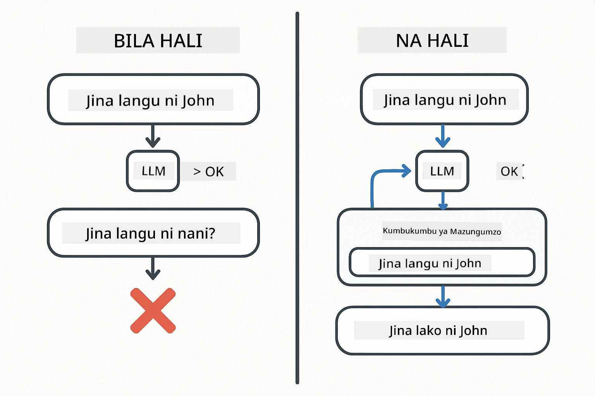
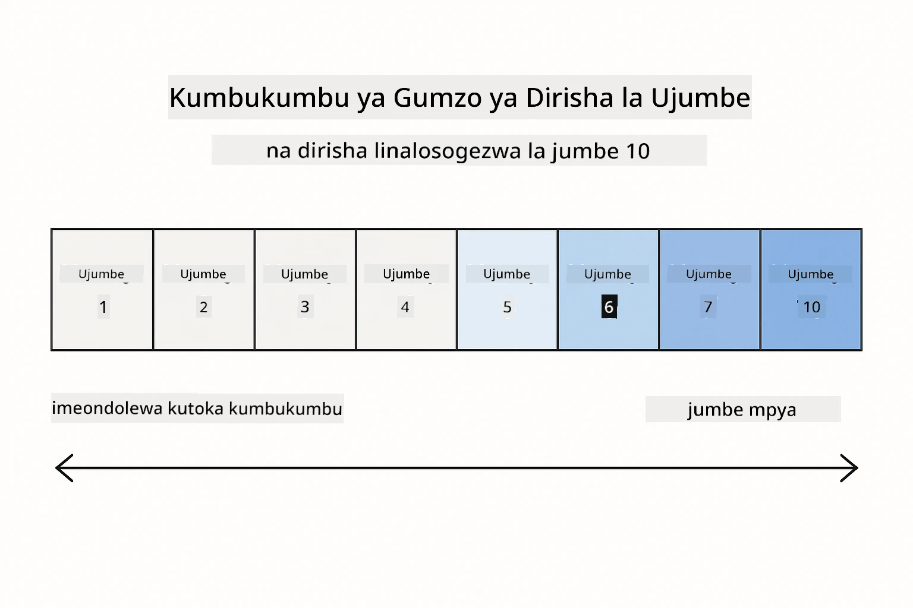
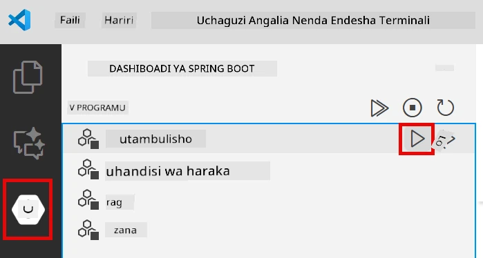
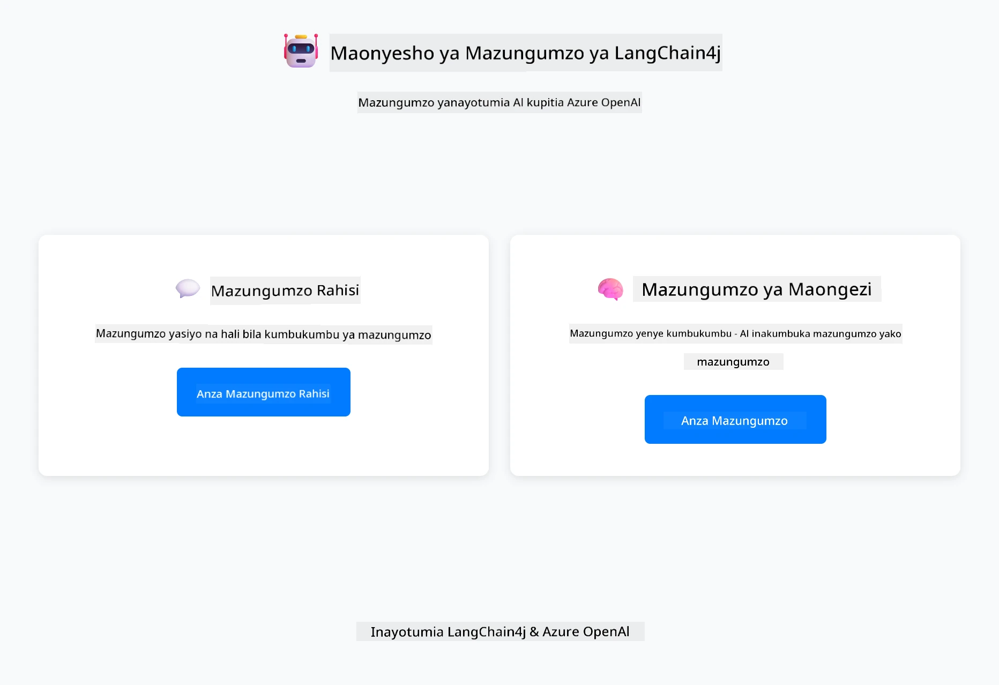
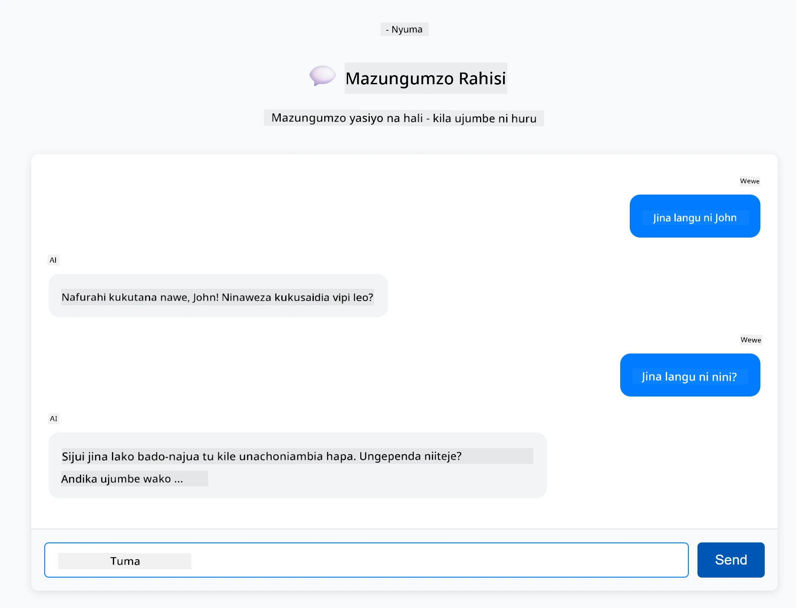
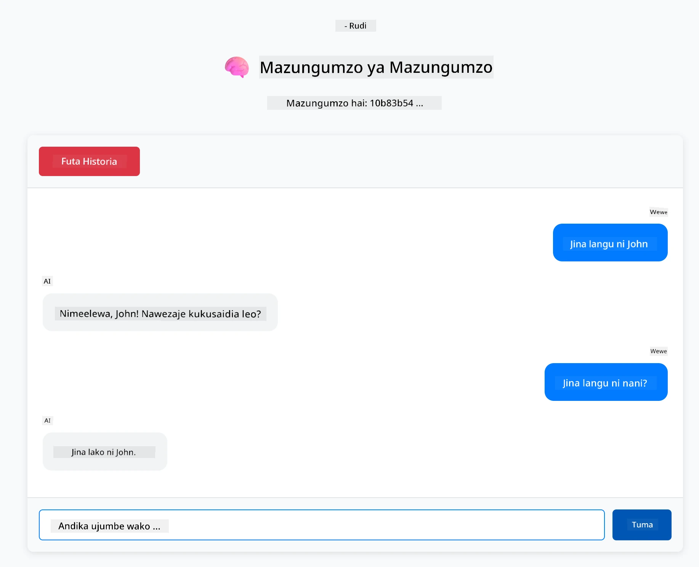

<!--
CO_OP_TRANSLATOR_METADATA:
{
  "original_hash": "c3e07ca58d0b8a3f47d3bf5728541e0a",
  "translation_date": "2025-12-13T13:55:06+00:00",
  "source_file": "01-introduction/README.md",
  "language_code": "sw"
}
-->
# Moduli 01: Kuanzisha na LangChain4j

## Jedwali la Yaliyomo

- [Utajifunza Nini](../../../01-introduction)
- [Mahitaji ya Awali](../../../01-introduction)
- [Kuelewa Tatizo Kuu](../../../01-introduction)
- [Kuelewa Tokeni](../../../01-introduction)
- [Jinsi Kumbukumbu Inavyofanya Kazi](../../../01-introduction)
- [Jinsi Hii Inavyotumia LangChain4j](../../../01-introduction)
- [Kuweka Miundombinu ya Azure OpenAI](../../../01-introduction)
- [Kendesha Programu Kwenye Kompyuta Yako](../../../01-introduction)
- [Kutumia Programu](../../../01-introduction)
  - [Mazungumzo Yasiyo na Hali (Paneli ya Kushoto)](../../../01-introduction)
  - [Mazungumzo Yenye Hali (Paneli ya Kulia)](../../../01-introduction)
- [Hatua Zifuatazo](../../../01-introduction)

## Utajifunza Nini

Ikiwa umemaliza kuanza kwa haraka, uliweza kuona jinsi ya kutuma maelekezo na kupata majibu. Hiyo ni msingi, lakini programu halisi zinahitaji zaidi. Moduli hii inakufundisha jinsi ya kujenga AI ya mazungumzo inayokumbuka muktadha na kudumisha hali - tofauti kati ya maonyesho ya mara moja na programu inayotumika kwa uzalishaji.

Tutatumia GPT-5 ya Azure OpenAI katika mwongozo huu wote kwa sababu uwezo wake wa hali ya juu wa kufikiri hufanya tabia za mifumo tofauti kuwa wazi zaidi. Unapoongeza kumbukumbu, utaona tofauti hiyo wazi. Hii inafanya iwe rahisi kuelewa kile kila kipengele kinachokuongezea programu yako.

Utatengeneza programu moja inayothibitisha mifumo yote miwili:

**Mazungumzo Yasiyo na Hali** - Kila ombi ni huru. Mfano huna kumbukumbu ya ujumbe wa awali. Huu ndio mfumo uliotumia katika kuanza kwa haraka.

**Mazungumzo Yenye Hali** - Kila ombi linajumuisha historia ya mazungumzo. Mfano hudumisha muktadha katika mizunguko mingi. Hii ndiyo inahitajika kwa programu za uzalishaji.

## Mahitaji ya Awali

- Usajili wa Azure wenye ufikiaji wa Azure OpenAI
- Java 21, Maven 3.9+
- Azure CLI (https://learn.microsoft.com/en-us/cli/azure/install-azure-cli)
- Azure Developer CLI (azd) (https://learn.microsoft.com/en-us/azure/developer/azure-developer-cli/install-azd)

> **Kumbuka:** Java, Maven, Azure CLI na Azure Developer CLI (azd) vimeshatangazwa katika devcontainer iliyotolewa.

> **Kumbuka:** Moduli hii inatumia GPT-5 kwenye Azure OpenAI. Uwekaji umewekwa moja kwa moja kupitia `azd up` - usibadilishe jina la mfano katika msimbo.

## Kuelewa Tatizo Kuu

Mifano ya lugha haina hali. Kila simu ya API ni huru. Ikiwa utatuma "Jina langu ni John" kisha ukauliza "Jina langu ni nani?", mfano huna wazo kwamba umejitambulisha tu. Hutendea kila ombi kana kwamba ni mazungumzo yako ya kwanza kabisa.

Hii ni sawa kwa maswali na majibu rahisi lakini haifai kwa programu halisi. Bots za huduma kwa wateja zinahitaji kukumbuka uliyowaambia. Msaidizi wa kibinafsi anahitaji muktadha. Mazungumzo yoyote yenye mizunguko mingi yanahitaji kumbukumbu.



*Tofauti kati ya mazungumzo yasiyo na hali (simu huru) na yenye hali (yanayojua muktadha)*

## Kuelewa Tokeni

Kabla ya kuingia kwenye mazungumzo, ni muhimu kuelewa tokeni - vitengo vya msingi vya maandishi ambavyo mifano ya lugha huchakata:


*Mfano wa jinsi maandishi yanavyogawanywa kuwa tokeni - "Ninapenda AI!" inakuwa vitengo 4 tofauti vya usindikaji*

Tokeni ndizo njia ambazo mifano ya AI hupima na kusindika maandishi. Maneno, alama za uandishi, na hata nafasi zinaweza kuwa tokeni. Mfano wako una kikomo cha tokeni ngapi kinaweza kusindika mara moja (400,000 kwa GPT-5, ikiwa ni hadi tokeni 272,000 za ingizo na 128,000 za matokeo). Kuelewa tokeni kunakusaidia kudhibiti urefu wa mazungumzo na gharama.

## Jinsi Kumbukumbu Inavyofanya Kazi

Kumbukumbu ya mazungumzo inatatua tatizo la kutokuwa na hali kwa kudumisha historia ya mazungumzo. Kabla ya kutuma ombi lako kwa mfano, mfumo huongeza ujumbe wa awali unaohusiana. Unapouliza "Jina langu ni nani?", mfumo kwa kweli hutuma historia yote ya mazungumzo, kuruhusu mfano kuona kwamba ulisema "Jina langu ni John" hapo awali.

LangChain4j hutoa utekelezaji wa kumbukumbu unaoshughulikia hili moja kwa moja. Unachagua ni ujumbe wangapi kuhifadhi na mfumo hudhibiti dirisha la muktadha.



*MessageWindowChatMemory hudumisha dirisha linalosogea la ujumbe wa hivi karibuni, likiacha zile za zamani moja kwa moja*

## Jinsi Hii Inavyotumia LangChain4j

Moduli hii inaongeza kuanza kwa haraka kwa kuunganisha Spring Boot na kuongeza kumbukumbu ya mazungumzo. Hivi ndivyo vipande vinavyoungana:

**Mategemeo** - Ongeza maktaba mbili za LangChain4j:

```xml
<dependency>
    <groupId>dev.langchain4j</groupId>
    <artifactId>langchain4j</artifactId> <!-- Inherited from BOM in root pom.xml -->
</dependency>
<dependency>
    <groupId>dev.langchain4j</groupId>
    <artifactId>langchain4j-open-ai-official</artifactId> <!-- Inherited from BOM in root pom.xml -->
</dependency>
```

**Mfano wa Mazungumzo** - Sanidi Azure OpenAI kama bean ya Spring ([LangChainConfig.java](../../../01-introduction/src/main/java/com/example/langchain4j/config/LangChainConfig.java)):

```java
@Bean
public OpenAiOfficialChatModel openAiOfficialChatModel() {
    return OpenAiOfficialChatModel.builder()
            .baseUrl(azureEndpoint)
            .apiKey(azureApiKey)
            .modelName(deploymentName)
            .timeout(Duration.ofMinutes(5))
            .maxRetries(3)
            .build();
}
```

Mjenzi husoma sifa kutoka kwa mabadiliko ya mazingira yaliyowekwa na `azd up`. Kuweka `baseUrl` kwa mwisho wako wa Azure hufanya mteja wa OpenAI kufanya kazi na Azure OpenAI.

**Kumbukumbu ya Mazungumzo** - Fuata historia ya mazungumzo na MessageWindowChatMemory ([ConversationService.java](../../../01-introduction/src/main/java/com/example/langchain4j/service/ConversationService.java)):

```java
ChatMemory memory = MessageWindowChatMemory.withMaxMessages(10);

memory.add(UserMessage.from("My name is John"));
memory.add(AiMessage.from("Nice to meet you, John!"));

memory.add(UserMessage.from("What's my name?"));
AiMessage aiMessage = chatModel.chat(memory.messages()).aiMessage();
memory.add(aiMessage);
```

Tengeneza kumbukumbu na `withMaxMessages(10)` kuhifadhi ujumbe 10 wa mwisho. Ongeza ujumbe wa mtumiaji na AI kwa vifunguo vilivyoandikwa: `UserMessage.from(text)` na `AiMessage.from(text)`. Pata historia kwa `memory.messages()` na uitume kwa mfano. Huduma huhifadhi kumbukumbu tofauti kwa kila kitambulisho cha mazungumzo, kuruhusu watumiaji wengi kuzungumza kwa wakati mmoja.

> **🤖 Jaribu na [GitHub Copilot](https://github.com/features/copilot) Chat:** Fungua [`ConversationService.java`](../../../01-introduction/src/main/java/com/example/langchain4j/service/ConversationService.java) na uliza:
> - "MessageWindowChatMemory huchagua vipi ujumbe gani kuondoa wakati dirisha limejaa?"
> - "Naweza kutekeleza kuhifadhi kumbukumbu maalum kwa kutumia hifadhidata badala ya kumbukumbu ya ndani?"
> - "Ningeeongezaje muhtasari kubana historia ya mazungumzo ya zamani?"

Kipengele cha mazungumzo yasiyo na hali hakitumii kumbukumbu kabisa - ni `chatModel.chat(prompt)` kama kuanza kwa haraka. Kipengele cha mazungumzo yenye hali kinaongeza ujumbe kwenye kumbukumbu, hupata historia, na hujumuisha muktadha huo kwa kila ombi. Sanidi mfano ule ule, mifumo tofauti.

## Kuweka Miundombinu ya Azure OpenAI

**Bash:**
```bash
cd 01-introduction
azd up  # Chagua usajili na eneo (eastus2 inapendekezwa)
```

**PowerShell:**
```powershell
cd 01-introduction
azd up  # Chagua usajili na eneo (eastus2 inapendekezwa)
```

> **Kumbuka:** Ikiwa unakutana na kosa la muda (`RequestConflict: Cannot modify resource ... provisioning state is not terminal`), endelea tu na `azd up` tena. Rasilimali za Azure zinaweza bado kuanzishwa nyuma, na kujaribu tena huruhusu uwekaji kukamilika mara rasilimali zifikie hali ya mwisho.

Hii itafanya:
1. Kuweka rasilimali ya Azure OpenAI na mifano ya GPT-5 na text-embedding-3-small
2. Kuunda faili `.env` moja kwa moja kwenye mzizi wa mradi na sifa
3. Kuweka mabadiliko yote ya mazingira yanayohitajika

**Kuna matatizo ya uwekaji?** Angalia [Infrastructure README](infra/README.md) kwa maelezo ya utatuzi ikiwa ni pamoja na migongano ya majina ya subdomain, hatua za kuweka kwa mkono Azure Portal, na mwongozo wa usanidi wa mfano.

**Thibitisha uwekaji umefanikiwa:**

**Bash:**
```bash
cat ../.env  # Inapaswa kuonyesha AZURE_OPENAI_ENDPOINT, API_KEY, n.k.
```

**PowerShell:**
```powershell
Get-Content ..\.env  # Inapaswa kuonyesha AZURE_OPENAI_ENDPOINT, API_KEY, n.k.
```

> **Kumbuka:** Amri `azd up` huunda faili `.env` moja kwa moja. Ikiwa unahitaji kuiboresha baadaye, unaweza kuhariri faili `.env` kwa mkono au kuunda upya kwa kuendesha:
>
> **Bash:**
> ```bash
> cd ..
> bash .azd-env.sh
> ```
>
> **PowerShell:**
> ```powershell
> cd ..
> .\.azd-env.ps1
> ```

## Kendesha Programu Kwenye Kompyuta Yako

**Thibitisha uwekaji:**

Hakikisha faili `.env` ipo kwenye saraka kuu na sifa za Azure:

**Bash:**
```bash
cat ../.env  # Inapaswa kuonyesha AZURE_OPENAI_ENDPOINT, API_KEY, DEPLOYMENT
```

**PowerShell:**
```powershell
Get-Content ..\.env  # Inapaswa kuonyesha AZURE_OPENAI_ENDPOINT, API_KEY, DEPLOYMENT
```

**Anzisha programu:**

**Chaguo 1: Kutumia Spring Boot Dashboard (Inapendekezwa kwa watumiaji wa VS Code)**

Dev container inaongeza ugani wa Spring Boot Dashboard, unaotoa kiolesura cha kuona kusimamia programu zote za Spring Boot. Unaweza kuipata kwenye Bar ya Shughuli upande wa kushoto wa VS Code (tazama ikoni ya Spring Boot).

Kutoka Spring Boot Dashboard, unaweza:
- Kuona programu zote za Spring Boot zilizopo kwenye eneo la kazi
- Anzisha/zimia programu kwa bonyeza mara moja
- Tazama kumbukumbu za programu kwa wakati halisi
- Fuata hali ya programu

Bonyeza kitufe cha kucheza kando ya "introduction" kuanzisha moduli hii, au anzisha moduli zote kwa pamoja.



**Chaguo 2: Kutumia skripti za shell**

Anzisha programu zote za wavuti (moduli 01-04):

**Bash:**
```bash
cd ..  # Kutoka kwenye saraka ya mzizi
./start-all.sh
```

**PowerShell:**
```powershell
cd ..  # Kutoka kwenye saraka ya mzizi
.\start-all.ps1
```

Au anzisha moduli hii pekee:

**Bash:**
```bash
cd 01-introduction
./start.sh
```

**PowerShell:**
```powershell
cd 01-introduction
.\start.ps1
```

Skripti zote huchukua mabadiliko ya mazingira kutoka kwa faili `.env` ya mzizi na zitajenga JARs ikiwa hazipo.

> **Kumbuka:** Ikiwa unapendelea kujenga moduli zote kwa mkono kabla ya kuanzisha:
>
> **Bash:**
> ```bash
> cd ..  # Go to root directory
> mvn clean package -DskipTests
> ```
>
> **PowerShell:**
> ```powershell
> cd ..  # Go to root directory
> mvn clean package -DskipTests
> ```

Fungua http://localhost:8080 kwenye kivinjari chako.

**Kusitisha:**

**Bash:**
```bash
./stop.sh  # Hii moduli tu
# Au
cd .. && ./stop-all.sh  # Moduli zote
```

**PowerShell:**
```powershell
.\stop.ps1  # Hii moduli tu
# Au
cd ..; .\stop-all.ps1  # Moduli zote
```

## Kutumia Programu

Programu hutoa kiolesura cha wavuti chenye utekelezaji wa mazungumzo mawili pembeni kwa pembeni.



*Dashibodi inaonyesha chaguzi za Mazungumzo Rahisi (yasiyo na hali) na Mazungumzo ya Mazungumzo (yenye hali)*

### Mazungumzo Yasiyo na Hali (Paneli ya Kushoto)

Jaribu hii kwanza. Uliza "Jina langu ni John" kisha mara moja uliza "Jina langu ni nani?" Mfano hautakumbuka kwa sababu kila ujumbe ni huru. Hii inaonyesha tatizo kuu la ushirikiano wa mfano wa lugha wa msingi - hakuna muktadha wa mazungumzo.



*AI haikumbuki jina lako kutoka ujumbe uliopita*

### Mazungumzo Yenye Hali (Paneli ya Kulia)

Sasa jaribu mfuatano huo hapa. Uliza "Jina langu ni John" kisha "Jina langu ni nani?" Mara hii inakumbuka. Tofauti ni MessageWindowChatMemory - hudumisha historia ya mazungumzo na hujumuisha muktadha huo kwa kila ombi. Hivi ndivyo AI ya mazungumzo ya uzalishaji inavyofanya kazi.



*AI inakumbuka jina lako kutoka mwanzo wa mazungumzo*

Paneli zote mbili zinatumia mfano ule ule wa GPT-5. Tofauti pekee ni kumbukumbu. Hii inafanya iwe wazi kile kumbukumbu inachokuongezea programu yako na kwa nini ni muhimu kwa matumizi halisi.

## Hatua Zifuatazo

**Moduli Ifuatayo:** [02-prompt-engineering - Uhandisi wa Maelekezo na GPT-5](../02-prompt-engineering/README.md)

---

**Uelekezaji:** [← Iliyopita: Moduli 00 - Kuanzisha Haraka](../00-quick-start/README.md) | [Rudi Kwenye Kuu](../README.md) | [Ifuatayo: Moduli 02 - Uhandisi wa Maelekezo →](../02-prompt-engineering/README.md)

---

<!-- CO-OP TRANSLATOR DISCLAIMER START -->
**Kiarifa cha Kukataa**:
Hati hii imetafsiriwa kwa kutumia huduma ya tafsiri ya AI [Co-op Translator](https://github.com/Azure/co-op-translator). Ingawa tunajitahidi kwa usahihi, tafadhali fahamu kwamba tafsiri za kiotomatiki zinaweza kuwa na makosa au upungufu wa usahihi. Hati ya asili katika lugha yake ya asili inapaswa kuchukuliwa kama chanzo cha mamlaka. Kwa taarifa muhimu, tafsiri ya kitaalamu ya binadamu inapendekezwa. Hatuna dhamana kwa kutoelewana au tafsiri potofu zinazotokana na matumizi ya tafsiri hii.
<!-- CO-OP TRANSLATOR DISCLAIMER END -->