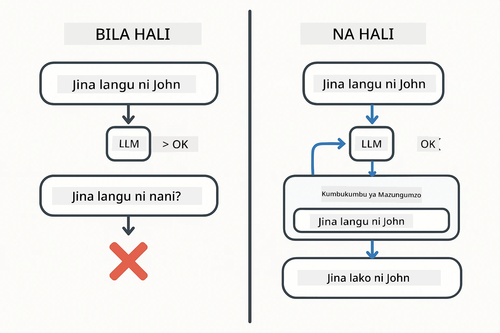
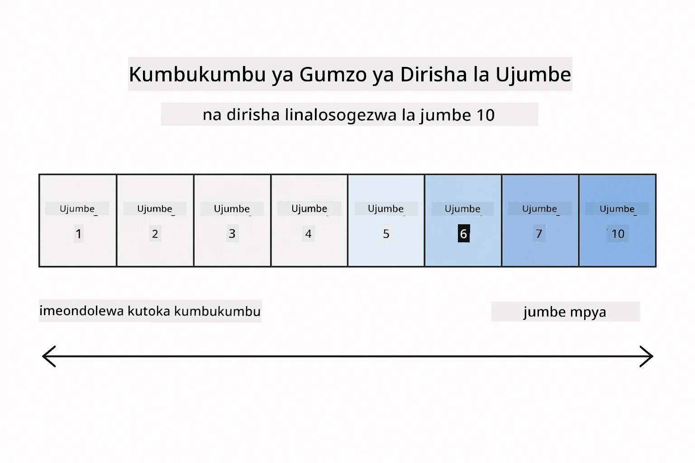
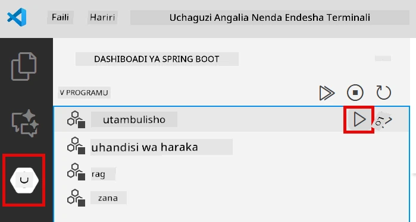
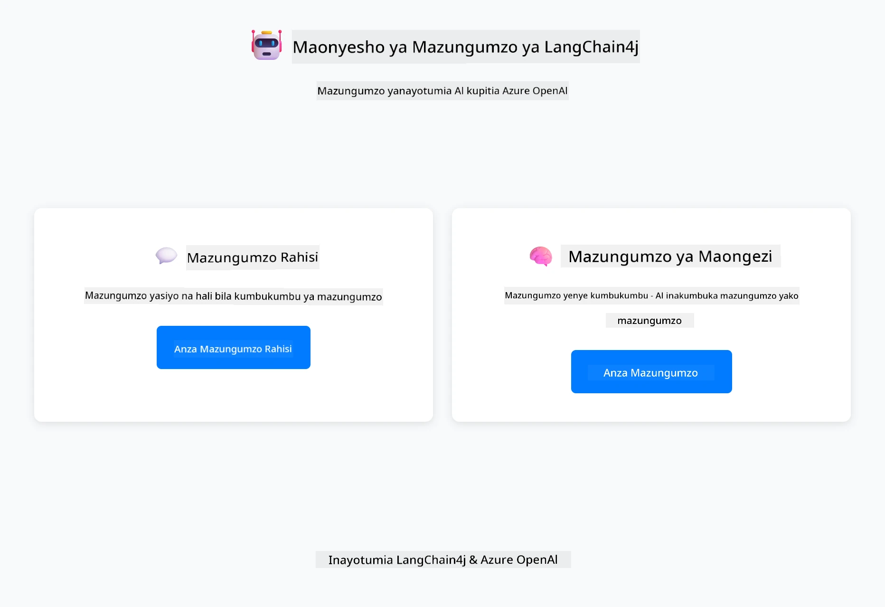
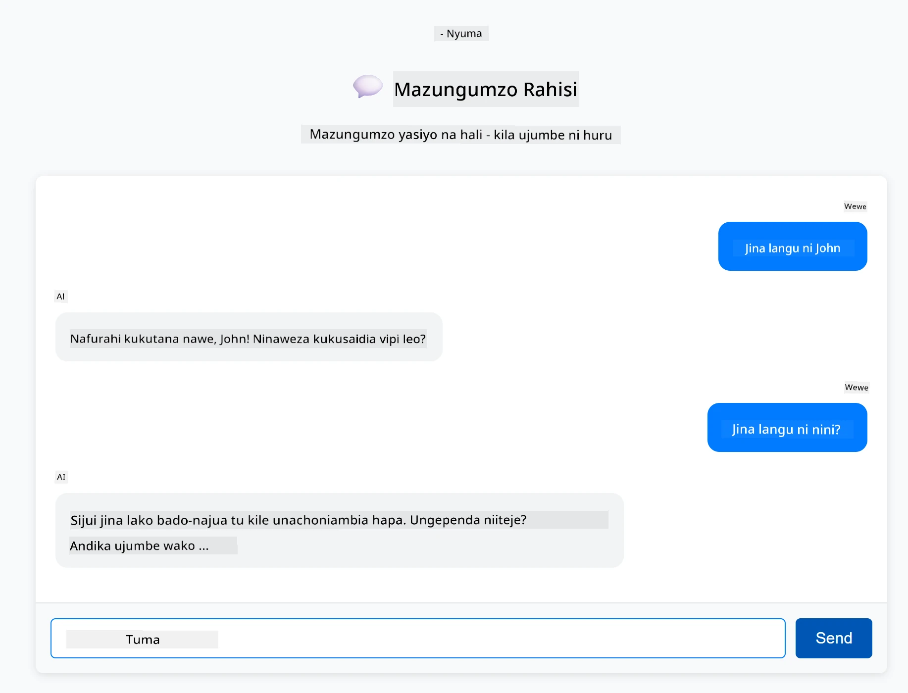
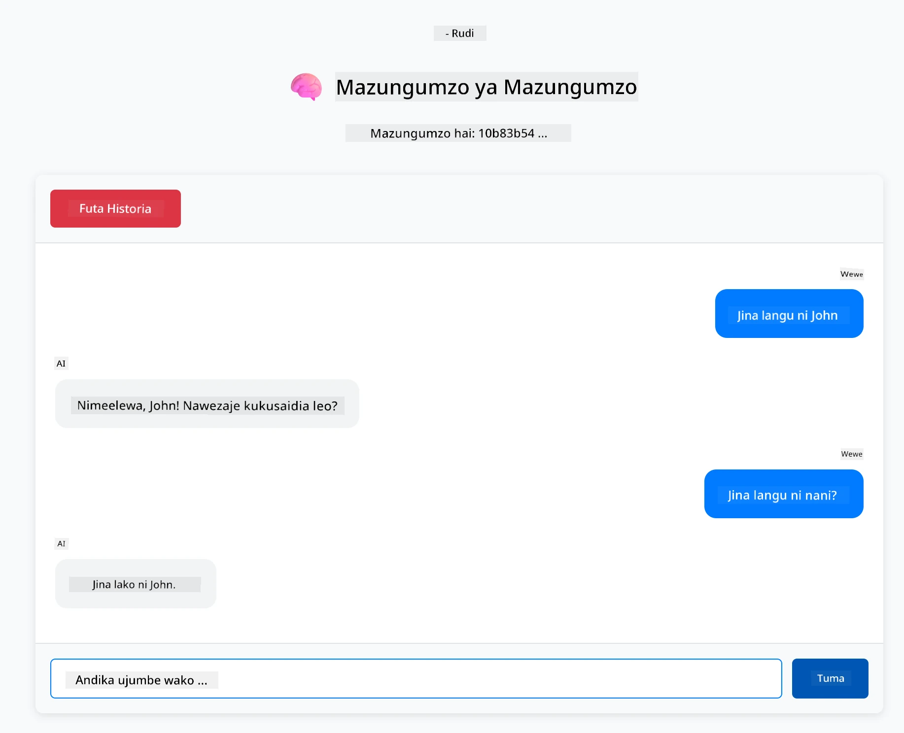

# Moduli 01: Kuanzia na LangChain4j

## Jedwali la Maudhui

- [Video ya Mwongozo](#video-ya-mwongozo)
- [Utajifunza Nini](#utajifunza-nini)
- [Mahitaji ya Awali](#mahitaji-ya-awali)
- [Kuelewa Shida Kuu](#kuelewa-shida-kuu)
- [Kuelewa Vitambulisho (Tokens)](#kuelewa-vitambulisho-tokens)
- [Jinsi Kumbukumbu Inavyofanya Kazi](#jinsi-kumbukumbu-inavyofanya-kazi)
- [Jinsi Hii Inavyotumia LangChain4j](#jinsi-hii-inavyotumia-langchain4j)
- [Weka Miundombinu ya Azure OpenAI](#weka-miundombinu-ya-azure-openai)
- [Endesha Programu Kwanza Mitaa](#endesha-programu-kwanza-mitaa)
- [Kutumia Programu](#kutumia-programu)
  - [Mazungumzo Yasiyohifadhi Hali (Paneli ya Kushoto)](#mazungumzo-yasiyohifadhi-hali-paneli-ya-kushoto)
  - [Mazungumzo Yanayohifadhi Hali (Paneli ya Kulia)](#mazungumzo-yanayohifadhi-hali-paneli-ya-kulia)
- [Hatua Zifuatazo](#hatua-zifuatazo)

## Video ya Mwongozo

Tazama kikao hiki cha moja kwa moja kinachoelezea jinsi ya kuanza na moduli hii:

<a href="https://www.youtube.com/live/nl_troDm8rQ?si=6b85S8xGjWnT2fX9"></a>

## Utajifunza Nini

Hii ni mwanzo wako na LangChain4j na Azure OpenAI. Tunaanza na misingi na kuanza kujenga programu za aina ya uzalishaji. Moduli hii inalenga AI ya mazungumzo inayokumbuka muktadha na kudumisha hali — dhana za msingi ambazo kila moduli inayofuata hujengwa juu yake.

Tutatumia GPT-5.2 ya Azure OpenAI katika mwongozo huu wote kwa sababu uwezo wake wa hali ya juu wa fikra huonyesha kwa uwazi tabia za mifumo tofauti. Unapoongeza kumbukumbu, utaona tofauti kwa wazi. Hii hufanya kuwa rahisi kuelewa kile kila kipengele kinachoongeza kwenye programu yako.

Utajenga programu moja inayoonyesha mifumo yote miwili:

**Mazungumzo Yasiyohifadhi Hali** - Kila ombi ni huru. Mfano huna kumbukumbu ya ujumbe wa awali. Huu ni msingi rahisi wa kuanzia.

**Mazungumzo Yanayohifadhi Hali** - Kila ombi linajumuisha historia ya mazungumzo. Mfano hudumisha muktadha kati ya mizunguko mingi. Hii ndiyo inahitajika katika programu za uzalishaji.

## Mahitaji ya Awali

- Usajili wa Azure wenye ufikiaji wa Azure OpenAI
- Java 21, Maven 3.9+
- Azure CLI (https://learn.microsoft.com/en-us/cli/azure/install-azure-cli)
- Azure Developer CLI (azd) (https://learn.microsoft.com/en-us/azure/developer/azure-developer-cli/install-azd)

> **Kumbuka:** Java, Maven, Azure CLI na Azure Developer CLI (azd) vimeshatanguliwa kusanidiwa kwenye devcontainer uliotolewa.

> **Kumbuka:** Moduli hii inatumia GPT-5.2 kwenye Azure OpenAI. Usanidi umewekwa moja kwa moja kupitia `azd up` - usibadilishe jina la mfano katika msimbo.

## Kuelewa Shida Kuu

Mifano ya lugha haina hali. Kila simu ya API ni huru. Ikiwa umetuma "Jina langu ni John" kisha ukauliza "Jina langu ni nani?", mfano haujui kuwa umejijulisha tu. Hutumia kila ombi kama vile ni mazungumzo yako ya kwanza kabisa.

Hii ni sawa kwa maswali na majibu rahisi lakini haifai kwa programu halisi. Viboreshaji huduma kwa wateja vinahitaji kukumbuka ulicho walisema. Msaidizi wa binafsi unahitaji muktadha. Mazungumzo yenye mizunguko mingi yanahitaji kumbukumbu.

Mchoro ufuatao unaonyesha tofauti za mbinu mbili — kushoto, simu isiyo na hali inayosahau jina lako; kulia, simu yenye hali iliyojengwa na ChatMemory inayolikumbuka.



*Tofauti kati ya mazungumzo yasiyo na hali (simu huru) na mazungumzo yanayohifadhi hali (yanaifahamu muktadha)*

## Kuelewa Vitambulisho (Tokens)

Kabla ya kuingia katika mazungumzo, ni muhimu kuelewa vitambulisho - vitengo msingi vya maandishi ambavyo mifano ya lugha hufanya kazi navyo:


*Mfano wa jinsi maandishi yanavyogawanywa katika vitambulisho - "Napenda AI!" zinazidi kuwa vitengo 4 tofauti vinavyotumika*

Vitambulisho ni jinsi mifano ya AI inavyopima na kushughulikia maandishi. Maneno, alama za uandishi, na hata nafasi zinaweza kuwa vitambulisho. Mfano wako una kikomo cha idadi ya vitambulisho kinachoweza kushughulikiwa mara moja (400,000 kwa GPT-5.2, ambapo hadi vitambulisho 272,000 ni vya ingizo na 128,000 ni vya matokeo). Kuelewa vitambulisho kunasaidia kudhibiti urefu wa mazungumzo na gharama.

## Jinsi Kumbukumbu Inavyofanya Kazi

Kumbukumbu ya mazungumzo hutatua shida ya kutokuwa na hali kwa kudumisha historia ya mazungumzo. Kabla ya kutuma ombi lako kwa mfano, mfumo huongeza ujumbe wa awali unaofaa. Ukimuuliza "Jina langu ni nani?", mfumo kwa kweli hutuma historia yote ya mazungumzo, kuruhusu mfano kuona ulisema awali "Jina langu ni John."

LangChain4j hutoa utekelezaji wa kumbukumbu unaoshughulikia hili moja kwa moja. Unachagua ni ujumbe wangapi kuhifadhi na mfumo hushughulikia dirisha la muktadha. Mchoro hapo chini unaonesha jinsi MessageWindowChatMemory hudumisha dirisha la ujazo wa ujumbe wa hivi karibuni.



*MessageWindowChatMemory hudumisha dirisha la kumpiga la ujumbe wa hivi karibuni, kwa moja kwa moja hutupa ujumbe wa zamani*

## Jinsi Hii Inavyotumia LangChain4j

Moduli hii inaunganisha Spring Boot na kuongeza kumbukumbu ya mazungumzo. Hapa ni jinsi vipande vinavyounganika pamoja:

**Mategemeo** - Ongeza maktaba mbili za LangChain4j:

```xml
<dependency>
    <groupId>dev.langchain4j</groupId>
    <artifactId>langchain4j</artifactId> <!-- Inherited from BOM in root pom.xml -->
</dependency>
<dependency>
    <groupId>dev.langchain4j</groupId>
    <artifactId>langchain4j-open-ai-official</artifactId> <!-- Inherited from BOM in root pom.xml -->
</dependency>
```

**Mfano wa Mazungumzo** - Sanidi Azure OpenAI kama bean ya Spring ([LangChainConfig.java](../../../01-introduction/src/main/java/com/example/langchain4j/config/LangChainConfig.java)):

```java
@Bean
public OpenAiOfficialChatModel openAiOfficialChatModel() {
    return OpenAiOfficialChatModel.builder()
            .baseUrl(azureEndpoint)
            .apiKey(azureApiKey)
            .modelName(deploymentName)
            .timeout(Duration.ofMinutes(5))
            .maxRetries(3)
            .build();
}
```

Muundaji husoma vyeti kutoka kwa mabadiliko ya mazingira yaliyowekwa na `azd up`. Kuweka `baseUrl` kwenye endpoint yako ya Azure hufanya mteja wa OpenAI afanye kazi na Azure OpenAI.

**Kumbukumbu ya Mazungumzo** - Fuata historia ya mazungumzo na MessageWindowChatMemory ([ConversationService.java](../../../01-introduction/src/main/java/com/example/langchain4j/service/ConversationService.java)):

```java
ChatMemory memory = MessageWindowChatMemory.withMaxMessages(10);

memory.add(UserMessage.from("My name is John"));
memory.add(AiMessage.from("Nice to meet you, John!"));

memory.add(UserMessage.from("What's my name?"));
AiMessage aiMessage = chatModel.chat(memory.messages()).aiMessage();
memory.add(aiMessage);
```

Tengeneza kumbukumbu na `withMaxMessages(10)` kuhifadhi ujumbe 10 za mwisho. Ongeza jumbe za mtumiaji na AI kwa vifunguo vilivyotambulika: `UserMessage.from(text)` na `AiMessage.from(text)`. Pata historia kwa `memory.messages()` na uitumie kwa mfano. Huduma huhifadhi kumbukumbu tofauti kwa kila kitambulisho cha mazungumzo, kuruhusu watumiaji wengi kuongea kwa wakati mmoja.

> **🤖 Jaribu na [GitHub Copilot](https://github.com/features/copilot) Chat:** Fungua [`ConversationService.java`](../../../01-introduction/src/main/java/com/example/langchain4j/service/ConversationService.java) na uliza:
> - "MessageWindowChatMemory inaamua vipi ni ujumbe gani wachukue wakati dirisha limejaa?"
> - "Je, naweza kutekeleza kuhifadhi kumbukumbu maalum kutumia hifadhidata badala ya kumbukumbu ya ndani?"
> - "Nitafanya vipi kuongeza muhtasari kwa kushinikiza historia ya mazungumzo ya zamani?"

Kipindi cha mazungumzo yasiyo na hali hakitumi kumbukumbu kabisa - ni `chatModel.chat(prompt)` kama ilivyo kwenye kuanza haraka. Kipindi cha hali pia kinaongeza jumbe kwenye kumbukumbu, kinapata historia, na kinajumuisha muktadha huu kwenye kila ombi. Sanidi mfano ule ule, mifumo tofauti.

## Weka Miundombinu ya Azure OpenAI

**Bash:**
```bash
cd 01-introduction
azd up  # Chagua usajili na eneo (eastus2 inapendekezwa)
```

**PowerShell:**
```powershell
cd 01-introduction
azd up  # Chagua usajili na eneo (eastus2 inapendekezwa)
```

> **Kumbuka:** Ikiwa unakutana na kosa la muda (`RequestConflict: Cannot modify resource ... provisioning state is not terminal`), endesha tena tu `azd up`. Rasilimali za Azure bado zinaweza kuwa zinaandaliwa nyuma, na jaribu tena huruhusu utekesaji kukamilika mara rasilimali zifikie hali ya mwisho.

Hii itafanya:
1. Kuweka rasilimali ya Azure OpenAI na mifano ya GPT-5.2 na text-embedding-3-small
2. Kuunda faili la `.env` moja kwa moja kwenye mizizi ya mradi lenye vyeti
3. Kuweka mabadiliko yote ya mazingira yanayohitajika

**Kuna matatizo ya utekesaji?** Angalia [Infrastructure README](infra/README.md) kwa maelezo ya kutatua matatizo ikiwa ni pamoja na migongano ya majina ya subdomain, hatua za kuweka kwa mkono Azure Portal, na mwongozo wa usanidi wa mfano.

**Thibitisha utekesaji umefanikiwa:**

**Bash:**
```bash
cat ../.env  # Inapaswa kuonyesha AZURE_OPENAI_ENDPOINT, API_KEY, n.k.
```

**PowerShell:**
```powershell
Get-Content ..\.env  # Inapaswa kuonyesha AZURE_OPENAI_ENDPOINT, API_KEY, n.k.
```

> **Kumbuka:** Amri ya `azd up` hutoa faili la `.env` moja kwa moja. Ikiwa unahitaji kuiboresha baadaye, unaweza kuhariri faili la `.env` mwenyewe au kuunda tena kwa kuendesha:
>
> **Bash:**
> ```bash
> cd ..
> bash .azd-env.sh
> ```
>
> **PowerShell:**
> ```powershell
> cd ..
> .\.azd-env.ps1
> ```

## Endesha Programu Kwanza Mitaa

**Thibitisha utekesaji:**

Hakiki kuwa faili la `.env` lipo kwenye saraka ya mizizi na vyeti vya Azure. Endesha hili kutoka saraka ya moduli (`01-introduction/`):

**Bash:**
```bash
cat ../.env  # Inapaswa kuonyesha AZURE_OPENAI_ENDPOINT, API_KEY, DEPLOYMENT
```

**PowerShell:**
```powershell
Get-Content ..\.env  # Inapaswa kuonyesha AZURE_OPENAI_ENDPOINT, API_KEY, DEPLOYMENT
```

**Anzisha programu:**

**Chaguo 1: Kutumia Spring Boot Dashboard (Inapendekezwa kwa watumiaji wa VS Code)**

Dev container inaongezewa ugani wa Spring Boot Dashboard, unaotoa interface ya kuona kusimamia programu zote za Spring Boot. Unaweza kuipata kwenye Bar ya Shughuli upande wa kushoto wa VS Code (tazama sakata la Spring Boot).

Kutoka Spring Boot Dashboard, unaweza:
- Kuona programu zote za Spring Boot zilizopo kwenye mazingira ya kazi
- Anzisha/zuia programu kwa bonyeza moja
- Tazama kumbukumbu za programu kwa wakati halisi
- Angalia hali ya programu

Bonyeza kitufe cha kuanza upande wa "introduction" kuanzisha moduli hii, au anzisha moduli zote kwa pamoja.



*Dashibodi ya Spring Boot katika VS Code — anzisha, zuia, na fuatilia moduli zote kutoka sehemu moja*

**Chaguo 2: Kutumia skiripti za shell**

Anzisha programu za wavuti zote (moduli 01-04):

**Bash:**
```bash
cd ..  # Kutoka kwenye saraka kuu
./start-all.sh
```

**PowerShell:**
```powershell
cd ..  # Kutoka kwa saraka ya mzizi
.\start-all.ps1
```

Au anzisha moduli hii tu:

**Bash:**
```bash
cd 01-introduction
./start.sh
```

**PowerShell:**
```powershell
cd 01-introduction
.\start.ps1
```

Zote skiripti huchukua mabadiliko ya mazingira kutoka kwenye faili la `.env` la mizizi na husanidi JARs kama hazipo.

> **Kumbuka:** Ikiwa ungependa kujenga moduli zote mwenyewe kabla ya kuanza:
>
> **Bash:**
> ```bash
> cd ..  # Go to root directory
> mvn clean package -DskipTests
> ```
>
> **PowerShell:**
> ```powershell
> cd ..  # Go to root directory
> mvn clean package -DskipTests
> ```

Fungua http://localhost:8080 kwenye kivinjari chako.

**Kusitisha:**

**Bash:**
```bash
./stop.sh  # Moduli hii tu
# Au
cd .. && ./stop-all.sh  # Moduli zote
```

**PowerShell:**
```powershell
.\stop.ps1  # Hii moduli tu
# Au
cd ..; .\stop-all.ps1  # Moduli zote
```

## Kutumia Programu

Programu hutoa interface ya wavuti wenye utekelezaji wa mazungumzo mawili upande kwa upande.



*Dashibodi inaonyesha chaguzi za Mazungumzo Rahisi (yasiyo na hali) na Mazungumzo ya Mazungumzo (yanayohifadhi hali)*

### Mazungumzo Yasiyohifadhi Hali (Paneli ya Kushoto)

Jaribu haya kwanza. Uliza "Jina langu ni John" kisha mara moja uliza "Jina langu ni nani?" Mfano hautakumbuka kwa sababu kila ujumbe ni huru. Hii inaonyesha shida kuu ya ushirikiano wa mifano ya lugha ya msingi - hakuna muktadha wa mazungumzo.



*AI haikumbuki jina lako kutoka ujumbe wa awali*

### Mazungumzo Yanayohifadhi Hali (Paneli ya Kulia)

Sasa jaribu mfuatano huo hapa. Uliza "Jina langu ni John" kisha "Jina langu ni nani?" Wakati huu inakumbuka. Tofauti ni MessageWindowChatMemory - hudumisha historia ya mazungumzo na kuijumuisha na kila ombi. Hii ndiyo AI ya mazungumzo ya uzalishaji inavyofanya kazi.



*AI inakumbuka jina lako kutoka mazungumzo ya awali*

Pande zote mbili zinatumia mfano ule ule wa GPT-5.2. Tofauti pekee ni kumbukumbu. Hii inaonyesha wazi kile kumbukumbu inachoongeza kwenye programu yako na kwa nini ni muhimu kwa matumizi halisi.

## Hatua Zifuatazo

**Moduli Ifuatayo:** [02-prompt-engineering - Uhandisi wa Prompt na GPT-5.2](../02-prompt-engineering/README.md)

---

**Uelekeo:** [← Rudi Kwenye Kuu](../README.md) | [Ifuatayo: Moduli 02 - Uhandisi wa Prompt →](../02-prompt-engineering/README.md)

---

<!-- CO-OP TRANSLATOR DISCLAIMER START -->
**Kionyozo**:
Hati hii imetafsiriwa kwa kutumia huduma ya tafsiri ya AI [Co-op Translator](https://github.com/Azure/co-op-translator). Ingawa tunajitahidi kupata usahihi, tafadhali fahamu kwamba tafsiri za kiotomatiki zinaweza kuwa na makosa au upungufu wa usahihi. Hati ya asili katika lugha yake halisi inapaswa kuchukuliwa kama chanzo cha mamlaka. Kwa taarifa muhimu, tafsiri ya kitaalamu inayofanywa na binadamu inapendekezwa. Hatutojibu kwa kuelewa vibaya au tafsiri potofu zinazotokea kutokana na matumizi ya tafsiri hii.
<!-- CO-OP TRANSLATOR DISCLAIMER END -->