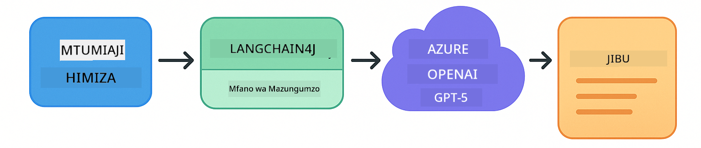
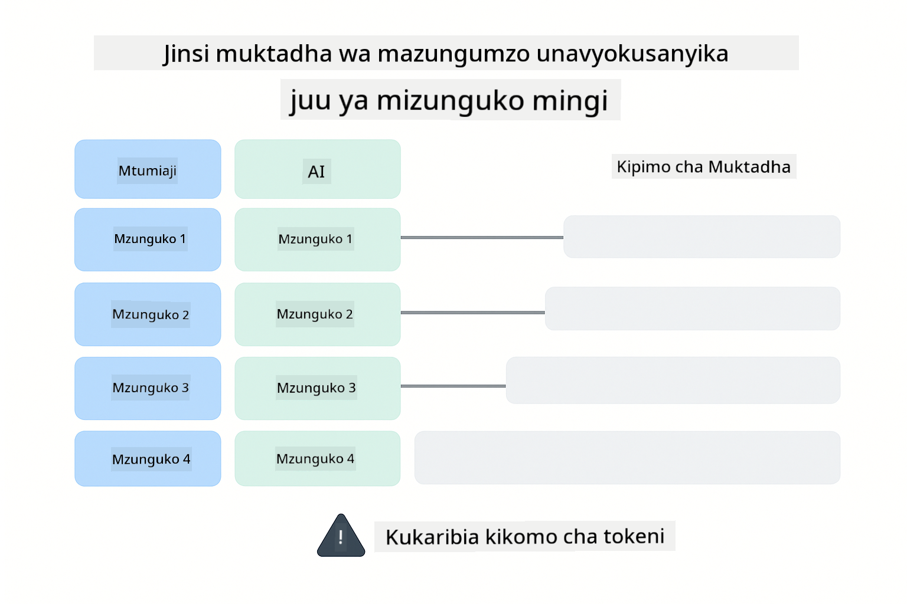
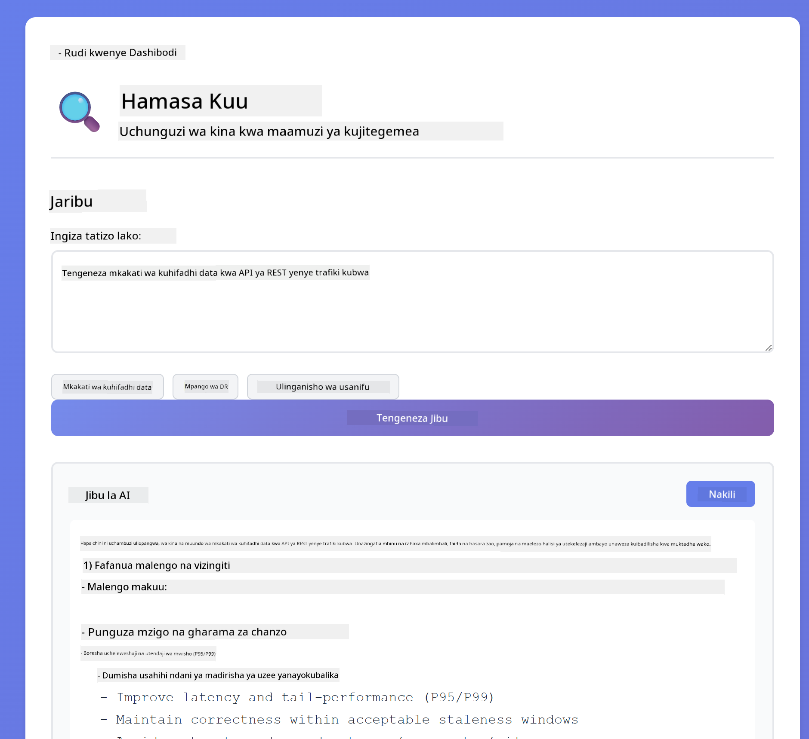
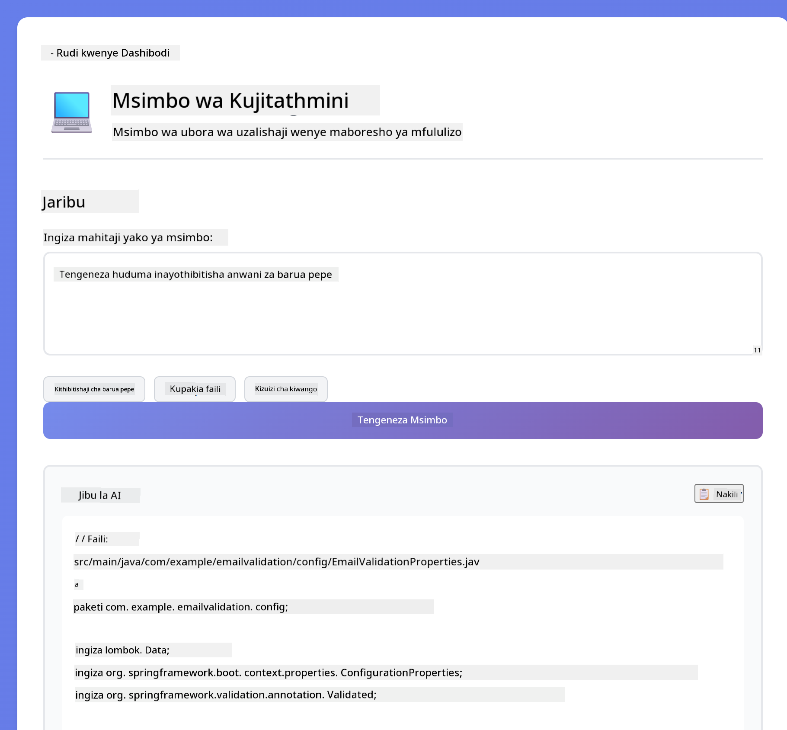
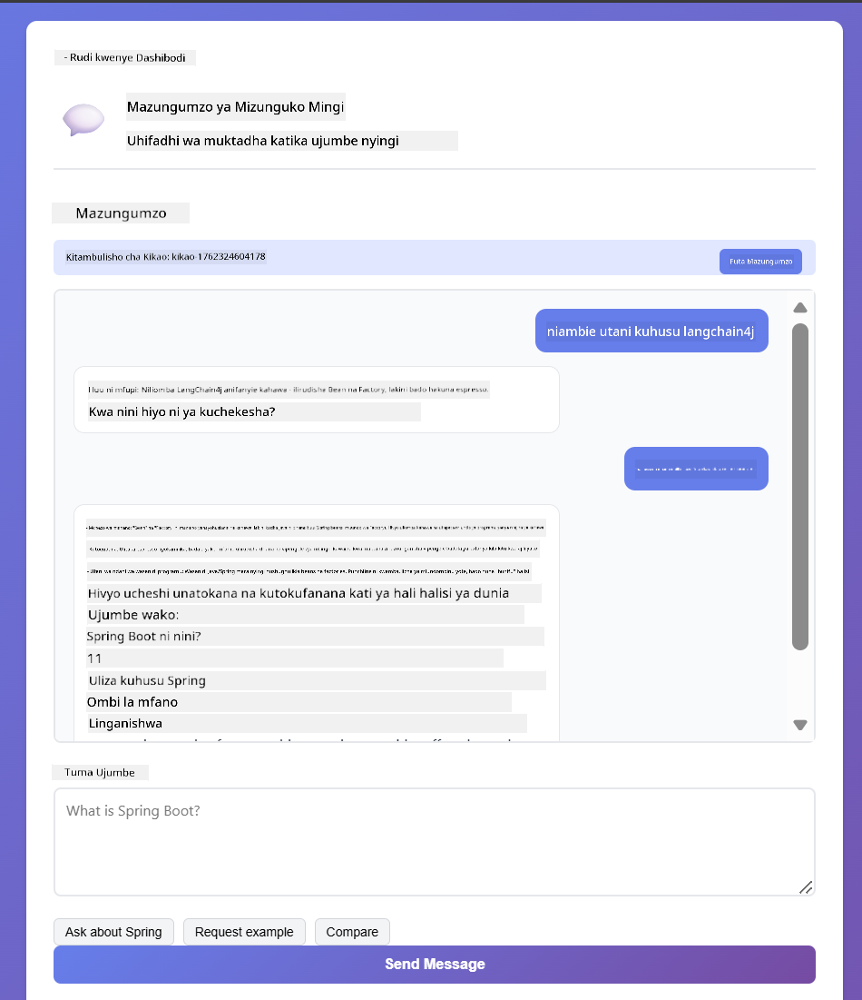

<!--
CO_OP_TRANSLATOR_METADATA:
{
  "original_hash": "8d787826cad7e92bf5cdbd116b1e6116",
  "translation_date": "2025-12-13T16:21:02+00:00",
  "source_file": "02-prompt-engineering/README.md",
  "language_code": "sw"
}
-->
# Moduli 02: Uhandisi wa Prompt na GPT-5

## Jedwali la Maudhui

- [Utajifunza Nini](../../../02-prompt-engineering)
- [Mahitaji ya Awali](../../../02-prompt-engineering)
- [Kuelewa Uhandisi wa Prompt](../../../02-prompt-engineering)
- [Jinsi Hii Inavyotumia LangChain4j](../../../02-prompt-engineering)
- [Mifumo Msingi](../../../02-prompt-engineering)
- [Kutumia Rasilimali za Azure Zilizopo](../../../02-prompt-engineering)
- [Picha za Skrini za Programu](../../../02-prompt-engineering)
- [Kuchunguza Mifumo](../../../02-prompt-engineering)
  - [Hamasa Ndogo vs Hamasa Kubwa](../../../02-prompt-engineering)
  - [Utekelezaji wa Kazi (Utangulizi wa Zana)](../../../02-prompt-engineering)
  - [Msimbo wa Kujitathmini](../../../02-prompt-engineering)
  - [Uchambuzi wa Muundo](../../../02-prompt-engineering)
  - [Mazungumzo ya Mizunguko Mingi](../../../02-prompt-engineering)
  - [Ufafanuzi Hatua kwa Hatua](../../../02-prompt-engineering)
  - [Matokeo Yaliyodhibitiwa](../../../02-prompt-engineering)
- [Unachojifunza Kweli](../../../02-prompt-engineering)
- [Hatua Zifuatazo](../../../02-prompt-engineering)

## Utajifunza Nini

Katika moduli iliyopita, ulichunguza jinsi kumbukumbu inavyowezesha AI ya mazungumzo na kutumia Modeli za GitHub kwa mwingiliano wa msingi. Sasa tutazingatia jinsi unavyouliza maswali - prompt yenyewe - kwa kutumia GPT-5 ya Azure OpenAI. Jinsi unavyopanga prompt zako huathiri sana ubora wa majibu unayopata.

Tutatumia GPT-5 kwa sababu inaleta udhibiti wa hoja - unaweza kusema kwa mfano kiasi gani cha kufikiri kinapaswa kufanyika kabla ya kujibu. Hii inafanya mikakati tofauti ya prompt ionekane wazi na inakusaidia kuelewa lini kutumia kila mbinu. Pia tutafaidika na mipaka michache ya kiwango cha matumizi ya GPT-5 ikilinganishwa na Modeli za GitHub.

## Mahitaji ya Awali

- Kumaliza Moduli 01 (rasilimali za Azure OpenAI zimetumika)
- Faili `.env` katika saraka kuu yenye vyeti vya Azure (vilivyotengenezwa na `azd up` katika Moduli 01)

> **Kumbuka:** Ikiwa hujakamilisha Moduli 01, fuata maelekezo ya utekelezaji hapo kwanza.

## Kuelewa Uhandisi wa Prompt

Uhandisi wa prompt ni kuhusu kubuni maandishi ya kuingiza ambayo yanakupa matokeo unayohitaji kwa uthabiti. Siyo tu kuuliza maswali - ni kuhusu kupanga maombi ili mfano uelewe hasa unachotaka na jinsi ya kukitoa.

Fikiria kama unamwambia mwenzako maelekezo. "Rekebisha hitilafu" ni ya jumla. "Rekebisha hitilafu ya null pointer katika UserService.java mstari wa 45 kwa kuongeza ukaguzi wa null" ni maalum. Modeli za lugha hufanya kazi kwa njia ile ile - umakini na muundo ni muhimu.

## Jinsi Hii Inavyotumia LangChain4j

Moduli hii inaonyesha mifumo ya hali ya juu ya prompt kwa kutumia msingi ule ule wa LangChain4j kutoka moduli zilizopita, ikizingatia muundo wa prompt na udhibiti wa hoja.



*Jinsi LangChain4j inavyounganisha prompt zako na Azure OpenAI GPT-5*

**Mategemeo** - Moduli 02 inatumia mategemeo yafuatayo ya langchain4j yaliyoainishwa katika `pom.xml`:
```xml
<dependency>
    <groupId>dev.langchain4j</groupId>
    <artifactId>langchain4j</artifactId> <!-- Inherited from BOM in root pom.xml -->
</dependency>
<dependency>
    <groupId>dev.langchain4j</groupId>
    <artifactId>langchain4j-open-ai-official</artifactId> <!-- Inherited from BOM in root pom.xml -->
</dependency>
```

**Usanidi wa OpenAiOfficialChatModel** - [LangChainConfig.java](../../../02-prompt-engineering/src/main/java/com/example/langchain4j/prompts/config/LangChainConfig.java)

Mfano wa mazungumzo umewekwa kwa mkono kama bean ya Spring kwa kutumia mteja rasmi wa OpenAI, unaounga mkono vituo vya Azure OpenAI. Tofauti kuu na Moduli 01 ni jinsi tunavyopanga prompt zinazotumwa kwa `chatModel.chat()`, si usanidi wa mfano yenyewe.

**Ujumbe wa Mfumo na Mtumiaji** - [Gpt5PromptService.java](../../../02-prompt-engineering/src/main/java/com/example/langchain4j/prompts/service/Gpt5PromptService.java)

LangChain4j hutenganisha aina za ujumbe kwa uwazi. `SystemMessage` huweka tabia na muktadha wa AI (kama "Wewe ni mkaguzi wa msimbo"), wakati `UserMessage` ina ombi halisi. Utengano huu unakuwezesha kudumisha tabia thabiti ya AI kwa maswali tofauti ya watumiaji.

```java
SystemMessage systemMsg = SystemMessage.from(
    "You are a helpful Java programming expert."
);

UserMessage userMsg = UserMessage.from(
    "Explain what a List is in Java"
);

String response = chatModel.chat(systemMsg, userMsg);
```


*SystemMessage hutoa muktadha wa kudumu wakati UserMessages zina maombi binafsi*

**MessageWindowChatMemory kwa Mazungumzo ya Mizunguko Mingi** - Kwa mfano wa mazungumzo ya mizunguko mingi, tunatumia tena `MessageWindowChatMemory` kutoka Moduli 01. Kila kikao kinapata kumbukumbu yake iliyohifadhiwa katika `Map<String, ChatMemory>`, kuruhusu mazungumzo mengi yanayofanyika kwa wakati mmoja bila kuchanganya muktadha.

**Templates za Prompt** - Lengo halisi hapa ni uhandisi wa prompt, si API mpya za LangChain4j. Kila mfumo (hamasa ndogo, hamasa kubwa, utekelezaji wa kazi, n.k.) hutumia njia ile ile ya `chatModel.chat(prompt)` lakini kwa mistari ya prompt iliyopangwa kwa uangalifu. Lebo za XML, maelekezo, na muundo ni sehemu ya maandishi ya prompt, si vipengele vya LangChain4j.

**Udhibiti wa Hoja** - Juhudi za hoja za GPT-5 zinadhibitiwa kupitia maelekezo ya prompt kama "hatua 2 za hoja kwa kiwango cha juu" au "chunguza kwa kina". Hizi ni mbinu za uhandisi wa prompt, si usanidi wa LangChain4j. Maktaba hutoa tu prompt zako kwa mfano.

Jambo kuu: LangChain4j hutoa miundombinu (unganisho wa mfano kupitia [LangChainConfig.java](../../../02-prompt-engineering/src/main/java/com/example/langchain4j/prompts/config/LangChainConfig.java), kumbukumbu, usimamizi wa ujumbe kupitia [Gpt5PromptService.java](../../../02-prompt-engineering/src/main/java/com/example/langchain4j/prompts/service/Gpt5PromptService.java)), wakati moduli hii inakufundisha jinsi ya kutengeneza prompt bora ndani ya miundombinu hiyo.

## Mifumo Msingi

Sio matatizo yote yanahitaji mbinu ile ile. Maswali mengine yanahitaji majibu ya haraka, mengine yanahitaji kufikiri kwa kina. Baadhi yanahitaji hoja inayoonekana, mengine yanahitaji matokeo tu. Moduli hii inashughulikia mifumo nane ya prompt - kila moja imeboreshwa kwa hali tofauti. Utajaribu zote ili ujifunze lini kila mbinu inafaa.


*Muhtasari wa mifumo nane ya uhandisi wa prompt na matumizi yake*


*Hamasa ndogo (haraka, moja kwa moja) vs Hamasa kubwa (kina, kinachochunguza) mbinu za hoja*

**Hamasa Ndogo (Haraka & Iliyolengwa)** - Kwa maswali rahisi ambapo unataka majibu ya haraka na ya moja kwa moja. Mfano hufanya hoja kidogo - hatua 2 kwa kiwango cha juu. Tumia hii kwa mahesabu, utafutaji, au maswali rahisi.

```java
String prompt = """
    <reasoning_effort>low</reasoning_effort>
    <instruction>maximum 2 reasoning steps</instruction>
    
    What is 15% of 200?
    """;

String response = chatModel.chat(prompt);
```

> 💡 **Chunguza na GitHub Copilot:** Fungua [`Gpt5PromptService.java`](../../../02-prompt-engineering/src/main/java/com/example/langchain4j/prompts/service/Gpt5PromptService.java) na uliza:
> - "Tofauti gani kati ya mifumo ya prompt ya hamasa ndogo na hamasa kubwa?"
> - "Je, lebo za XML katika prompt zinawezaje kusaidia kupanga jibu la AI?"
> - "Lini ninapaswa kutumia mifumo ya kujitathmini dhidi ya maelekezo ya moja kwa moja?"

**Hamasa Kubwa (Kina & Kinachochunguza)** - Kwa matatizo magumu ambapo unataka uchambuzi wa kina. Mfano huchunguza kwa kina na kuonyesha hoja za kina. Tumia hii kwa muundo wa mfumo, maamuzi ya usanifu, au utafiti mgumu.

```java
String prompt = """
    <reasoning_effort>high</reasoning_effort>
    <instruction>explore thoroughly, show detailed reasoning</instruction>
    
    Design a caching strategy for a high-traffic REST API.
    """;

String response = chatModel.chat(prompt);
```

**Utekelezaji wa Kazi (Maendeleo Hatua kwa Hatua)** - Kwa michakato yenye hatua nyingi. Mfano hutoa mpango wa awali, huambia kila hatua anapofanya kazi, kisha hutoa muhtasari. Tumia hii kwa uhamishaji, utekelezaji, au mchakato wowote wa hatua nyingi.

```java
String prompt = """
    <task>Create a REST endpoint for user registration</task>
    <preamble>Provide an upfront plan</preamble>
    <narration>Narrate each step as you work</narration>
    <summary>Summarize what was accomplished</summary>
    """;

String response = chatModel.chat(prompt);
```

Prompt ya Mnyororo wa Fikra huomba mfano kuonyesha mchakato wake wa hoja, kuboresha usahihi kwa kazi ngumu. Ufafanuzi wa hatua kwa hatua husaidia wanadamu na AI kuelewa mantiki.

> **🤖 Jaribu na [GitHub Copilot](https://github.com/features/copilot) Chat:** Uliza kuhusu mfumo huu:
> - "Ningebadilishaje mfumo wa utekelezaji wa kazi kwa shughuli za muda mrefu?"
> - "Nini mbinu bora za kupanga utangulizi wa zana katika programu za uzalishaji?"
> - "Ninawezaje kunasa na kuonyesha taarifa za maendeleo ya kati katika UI?"


*Mpango → Tekeleza → Fupisha mchakato wa kazi za hatua nyingi*

**Msimbo wa Kujitathmini** - Kwa kuzalisha msimbo wa ubora wa uzalishaji. Mfano huzalisha msimbo, kuukagua dhidi ya vigezo vya ubora, na kuuboresha kwa mzunguko. Tumia hii wakati wa kujenga vipengele au huduma mpya.

```java
String prompt = """
    <task>Create an email validation service</task>
    <quality_criteria>
    - Correct logic and error handling
    - Best practices (clean code, proper naming)
    - Performance optimization
    - Security considerations
    </quality_criteria>
    <instruction>Generate code, evaluate against criteria, improve iteratively</instruction>
    """;

String response = chatModel.chat(prompt);
```


*Mzunguko wa kuboresha kwa mfululizo - tengeneza, tathmini, tambua matatizo, boresha, rudia*

**Uchambuzi wa Muundo** - Kwa tathmini thabiti. Mfano hupitia msimbo kwa kutumia mfumo uliowekwa (usahihi, mbinu, utendaji, usalama). Tumia hii kwa ukaguzi wa msimbo au tathmini za ubora.

```java
String prompt = """
    <code>
    public List getUsers() {
        return database.query("SELECT * FROM users");
    }
    </code>
    
    <framework>
    Evaluate using these categories:
    1. Correctness - Logic and functionality
    2. Best Practices - Code quality
    3. Performance - Efficiency concerns
    4. Security - Vulnerabilities
    </framework>
    """;

String response = chatModel.chat(prompt);
```

> **🤖 Jaribu na [GitHub Copilot](https://github.com/features/copilot) Chat:** Uliza kuhusu uchambuzi wa muundo:
> - "Ninawezaje kubinafsisha mfumo wa uchambuzi kwa aina tofauti za ukaguzi wa msimbo?"
> - "Njia bora ya kuchambua na kutenda kwa matokeo ya muundo ni ipi?"
> - "Ninawezaje kuhakikisha viwango vya ukali vinaendana katika vikao tofauti vya ukaguzi?"


*Mfumo wa makundi manne kwa ukaguzi thabiti wa msimbo na viwango vya ukali*

**Mazungumzo ya Mizunguko Mingi** - Kwa mazungumzo yanayohitaji muktadha. Mfano unakumbuka ujumbe wa awali na kujenga juu yake. Tumia hii kwa vikao vya msaada wa mwingiliano au maswali na majibu magumu.

```java
ChatMemory memory = MessageWindowChatMemory.withMaxMessages(10);

memory.add(UserMessage.from("What is Spring Boot?"));
AiMessage aiMessage1 = chatModel.chat(memory.messages()).aiMessage();
memory.add(aiMessage1);

memory.add(UserMessage.from("Show me an example"));
AiMessage aiMessage2 = chatModel.chat(memory.messages()).aiMessage();
memory.add(aiMessage2);
```



*Jinsi muktadha wa mazungumzo unavyokusanywa kwa mizunguko mingi hadi kufikia kikomo cha tokeni*

**Ufafanuzi Hatua kwa Hatua** - Kwa matatizo yanayohitaji mantiki inayoonekana. Mfano huonyesha hoja wazi kwa kila hatua. Tumia hii kwa matatizo ya hisabati, fumbo la mantiki, au unapotaka kuelewa mchakato wa kufikiri.

```java
String prompt = """
    <instruction>Show your reasoning step-by-step</instruction>
    
    If a train travels 120 km in 2 hours, then stops for 30 minutes,
    then travels another 90 km in 1.5 hours, what is the average speed
    for the entire journey including the stop?
    """;

String response = chatModel.chat(prompt);
```


*Kuvunja matatizo kuwa hatua za mantiki wazi*

**Matokeo Yaliyodhibitiwa** - Kwa majibu yenye mahitaji maalum ya muundo. Mfano hufuata kwa ukali kanuni za muundo na urefu. Tumia hii kwa muhtasari au unapotaka muundo wa matokeo sahihi.

```java
String prompt = """
    <constraints>
    - Exactly 100 words
    - Bullet point format
    - Technical terms only
    </constraints>
    
    Summarize the key concepts of machine learning.
    """;

String response = chatModel.chat(prompt);
```


*Kutekeleza mahitaji maalum ya muundo, urefu, na muundo*

## Kutumia Rasilimali za Azure Zilizopo

**Thibitisha utekelezaji:**

Hakikisha faili `.env` ipo katika saraka kuu yenye vyeti vya Azure (vilivyotengenezwa wakati wa Moduli 01):
```bash
cat ../.env  # Inapaswa kuonyesha AZURE_OPENAI_ENDPOINT, API_KEY, DEPLOYMENT
```

**Anzisha programu:**

> **Kumbuka:** Ikiwa tayari umeanzisha programu zote kwa kutumia `./start-all.sh` kutoka Moduli 01, moduli hii tayari inaendeshwa kwenye bandari 8083. Unaweza kuruka amri za kuanzisha hapa chini na kwenda moja kwa moja http://localhost:8083.

**Chaguo 1: Kutumia Spring Boot Dashboard (Inapendekezwa kwa watumiaji wa VS Code)**

Kontena la maendeleo lina ugani wa Spring Boot Dashboard, unaotoa kiolesura cha kuona na kusimamia programu zote za Spring Boot. Unaweza kuipata kwenye Bar ya Shughuli upande wa kushoto wa VS Code (tazama ikoni ya Spring Boot).

Kutoka Spring Boot Dashboard, unaweza:
- Kuona programu zote za Spring Boot zilizopo katika eneo la kazi
- Anzisha/zimia programu kwa kubofya mara moja
- Tazama kumbukumbu za programu kwa wakati halisi
- Fuata hali ya programu

Bofya kitufe cha kucheza kando ya "prompt-engineering" kuanzisha moduli hii, au anzisha moduli zote kwa pamoja.


**Chaguo 2: Kutumia skripti za shell**

Anzisha programu zote za wavuti (moduli 01-04):

**Bash:**
```bash
cd ..  # Kutoka kwenye saraka ya mzizi
./start-all.sh
```

**PowerShell:**
```powershell
cd ..  # Kutoka kwenye saraka ya mzizi
.\start-all.ps1
```

Au anzisha moduli hii pekee:

**Bash:**
```bash
cd 02-prompt-engineering
./start.sh
```

**PowerShell:**
```powershell
cd 02-prompt-engineering
.\start.ps1
```

Skripti zote zinapakia moja kwa moja mabadiliko ya mazingira kutoka faili `.env` ya saraka kuu na zitajenga JARs ikiwa hazipo.

> **Kumbuka:** Ikiwa unapendelea kujenga moduli zote kwa mkono kabla ya kuanzisha:
>
> **Bash:**
> ```bash
> cd ..  # Go to root directory
> mvn clean package -DskipTests
> ```
>
> **PowerShell:**
> ```powershell
> cd ..  # Go to root directory
> mvn clean package -DskipTests
> ```

Fungua http://localhost:8083 katika kivinjari chako.

**Kusitisha:**

**Bash:**
```bash
./stop.sh  # Hii moduli tu
# Au
cd .. && ./stop-all.sh  # Moduli zote
```

**PowerShell:**
```powershell
.\stop.ps1  # Hii moduli tu
# Au
cd ..; .\stop-all.ps1  # Moduli zote
```

## Picha za Skrini za Programu


*Dashibodi kuu inaonyesha mifumo yote 8 ya uhandisi wa prompt na sifa na matumizi yao*

## Kuchunguza Mifumo

Kiolesura cha wavuti kinakuruhusu kujaribu mikakati tofauti ya prompt. Kila mfumo unatatua matatizo tofauti - jaribu kuona lini kila mbinu inafanya kazi vizuri.

### Hamasa Ndogo vs Hamasa Kubwa

Uliza swali rahisi kama "Ni asilimia ngapi ya 15% ya 200?" kwa kutumia Hamasa Ndogo. Utapokea jibu la haraka na la moja kwa moja. Sasa uliza kitu kigumu kama "Tengeneza mkakati wa kuhifadhi cache kwa API yenye trafiki kubwa" kwa kutumia Hamasa Kubwa. Tazama jinsi mfano unavyopunguza kasi na kutoa hoja za kina. Mfano ule ule, muundo ule ule wa swali - lakini prompt inasema kiasi gani cha kufikiri kinapaswa kufanyika.


*Hesabu ya haraka kwa sababu kidogo*



*Mkakati kamili wa kuhifadhi (2.8MB)*

### Utekelezaji wa Kazi (Utangulizi wa Zana)

Mifumo yenye hatua nyingi inafaidika na upangaji wa awali na uelezaji wa maendeleo. Mfano unaeleza atakachofanya, unaeleza kila hatua, kisha unatoa muhtasari wa matokeo.


*Kutengeneza kiunganishi cha REST kwa uelezaji wa hatua kwa hatua (3.9MB)*

### Msimbo Unaojitathmini

Jaribu "Tengeneza huduma ya uthibitishaji wa barua pepe". Badala ya kuzalisha msimbo tu na kusimama, mfano huzalisha, kutathmini dhidi ya vigezo vya ubora, kubaini udhaifu, na kuboresha. Utaona ukirudia hadi msimbo ukidhi viwango vya uzalishaji.



*Huduma kamili ya uthibitishaji wa barua pepe (5.2MB)*

### Uchambuzi Ulioandaliwa

Mapitio ya msimbo yanahitaji mifumo thabiti ya tathmini. Mfano huchambua msimbo kwa kutumia makundi yaliyowekwa (usahihi, mbinu, utendaji, usalama) kwa viwango vya ukali.


*Mapitio ya msimbo yanayotegemea mfumo*

### Mazungumzo ya Mizunguko Mingi

Uliza "Spring Boot ni nini?" kisha mara moja fuata na "Nionyeshe mfano". Mfano unakumbuka swali lako la kwanza na anakupa mfano wa Spring Boot mahsusi. Bila kumbukumbu, swali la pili lingekuwa la jumla sana.



*Uhifadhi wa muktadha kati ya maswali*

### Uelewa wa Hatua kwa Hatua

Chagua tatizo la hisabati na ujaribu kwa Uelewa wa Hatua kwa Hatua na Hamu Ndogo. Hamu ndogo inakupa jibu tu - haraka lakini haueleweki. Hatua kwa hatua inaonyesha kila hesabu na uamuzi.


*Tatizo la hisabati lenye hatua wazi*

### Matokeo Yaliyodhibitiwa

Unapohitaji muundo maalum au idadi ya maneno, muundo huu unahakikisha kufuata kwa ukali. Jaribu kuzalisha muhtasari wenye maneno 100 hasa kwa muundo wa vidokezo.


*Muhtasari wa kujifunza mashine wenye udhibiti wa muundo*

## Unachojifunza Kweli

**Juhudi za Uelewa Hubadilisha Kila Kitu**

GPT-5 inakuwezesha kudhibiti juhudi za kompyuta kupitia maelekezo yako. Juhudi ndogo inamaanisha majibu ya haraka na uchunguzi mdogo. Juhudi kubwa inamaanisha mfano huchukua muda kufikiria kwa kina. Unajifunza kulinganisha juhudi na ugumu wa kazi - usipoteze muda kwa maswali rahisi, lakini usikimbilie maamuzi magumu pia.

**Muundo Huelekeza Tabia**

Tambua lebo za XML katika maelekezo? Sio mapambo. Mifano hufuata maagizo yaliyoandaliwa kwa kuaminika zaidi kuliko maandishi ya huru. Unapohitaji michakato yenye hatua nyingi au mantiki ngumu, muundo husaidia mfano kufuatilia alipo na kinachofuata.


*Muundo wa maelekezo yaliyoandaliwa vyema yenye sehemu wazi na mpangilio wa mtindo wa XML*

**Ubora Kupitia Kujitathmini**

Mifumo ya kujitathmini huenda kwa kufanya vigezo vya ubora kuwa wazi. Badala ya kutegemea mfano "ufanye vizuri", unamwambia hasa maana ya "sahihi": mantiki sahihi, kushughulikia makosa, utendaji, usalama. Mfano unaweza kisha kutathmini matokeo yake na kuboresha. Hii hubadilisha uzalishaji wa msimbo kutoka bahati nasibu kuwa mchakato.

**Muktadha Ni Mdogo**

Mazungumzo ya mizunguko mingi hufanya kazi kwa kujumuisha historia ya ujumbe na kila ombi. Lakini kuna kikomo - kila mfano una idadi ya juu ya tokeni. Kadri mazungumzo yanavyoongezeka, utahitaji mikakati ya kuhifadhi muktadha muhimu bila kufikia kikomo hicho. Moduli hii inaonyesha jinsi kumbukumbu inavyofanya kazi; baadaye utajifunza lini kufupisha, lini kusahau, na lini kupata tena.

## Hatua Zifuatazo

**Moduli Ifuatayo:** [03-rag - RAG (Retrieval-Augmented Generation)](../03-rag/README.md)

---

**Uelekezaji:** [← Awali: Moduli 01 - Utangulizi](../01-introduction/README.md) | [Rudi Kwenye Kuu](../README.md) | [Ifuatayo: Moduli 03 - RAG →](../03-rag/README.md)

---

<!-- CO-OP TRANSLATOR DISCLAIMER START -->
**Kiarifu cha Kukataa**:
Hati hii imetafsiriwa kwa kutumia huduma ya tafsiri ya AI [Co-op Translator](https://github.com/Azure/co-op-translator). Ingawa tunajitahidi kwa usahihi, tafadhali fahamu kuwa tafsiri za kiotomatiki zinaweza kuwa na makosa au upungufu wa usahihi. Hati ya asili katika lugha yake ya asili inapaswa kuchukuliwa kama chanzo cha mamlaka. Kwa taarifa muhimu, tafsiri ya kitaalamu ya binadamu inapendekezwa. Hatuna dhamana kwa kutoelewana au tafsiri potofu zinazotokana na matumizi ya tafsiri hii.
<!-- CO-OP TRANSLATOR DISCLAIMER END -->