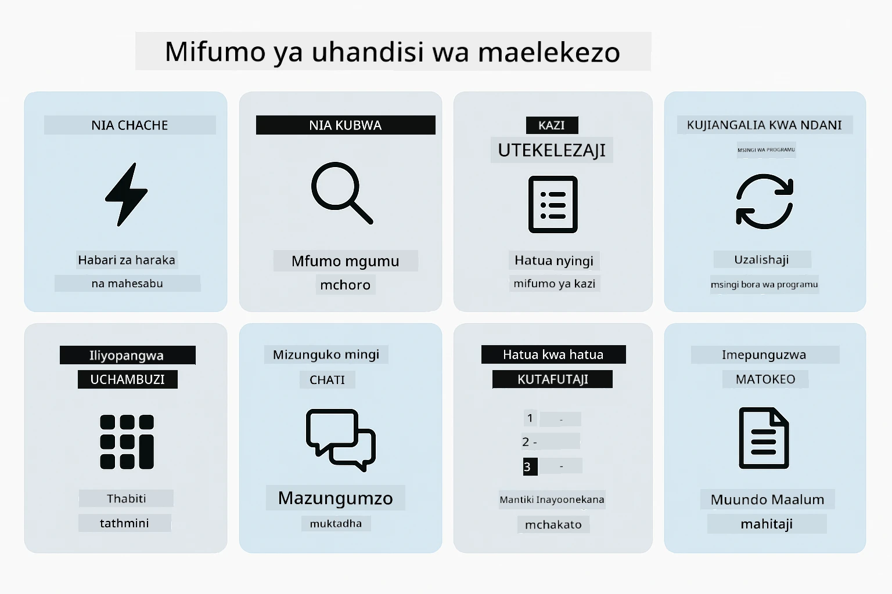
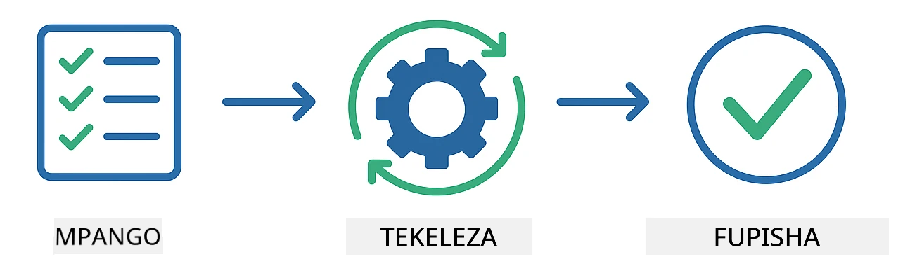
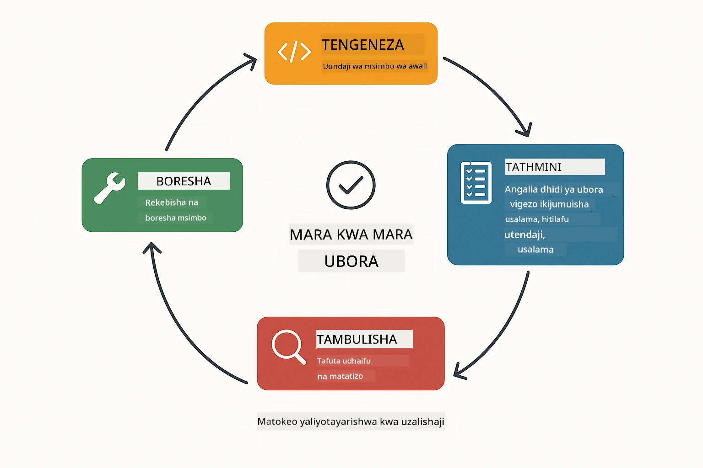
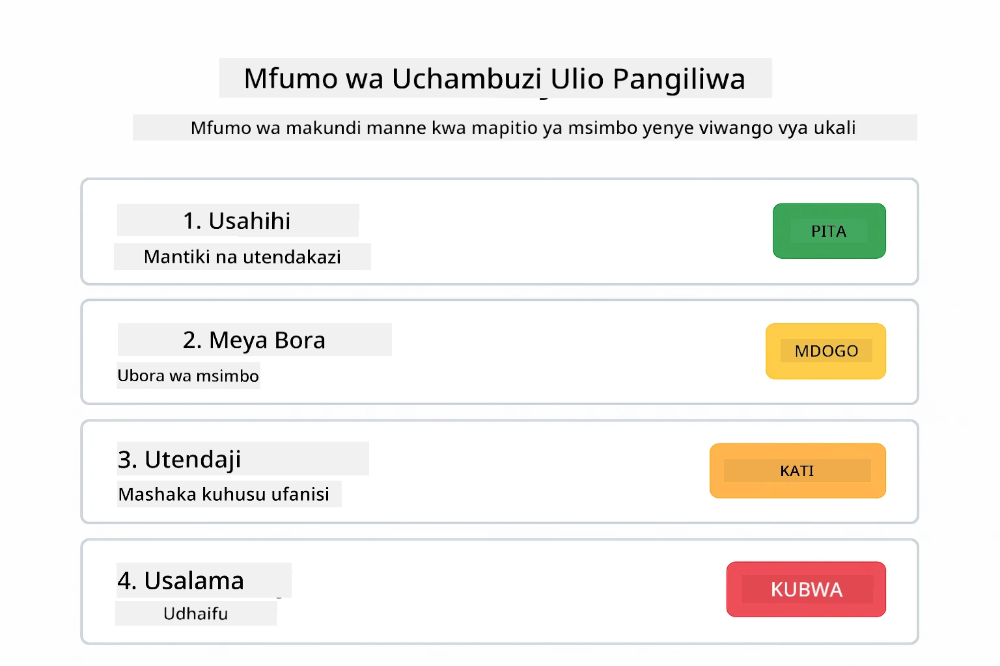
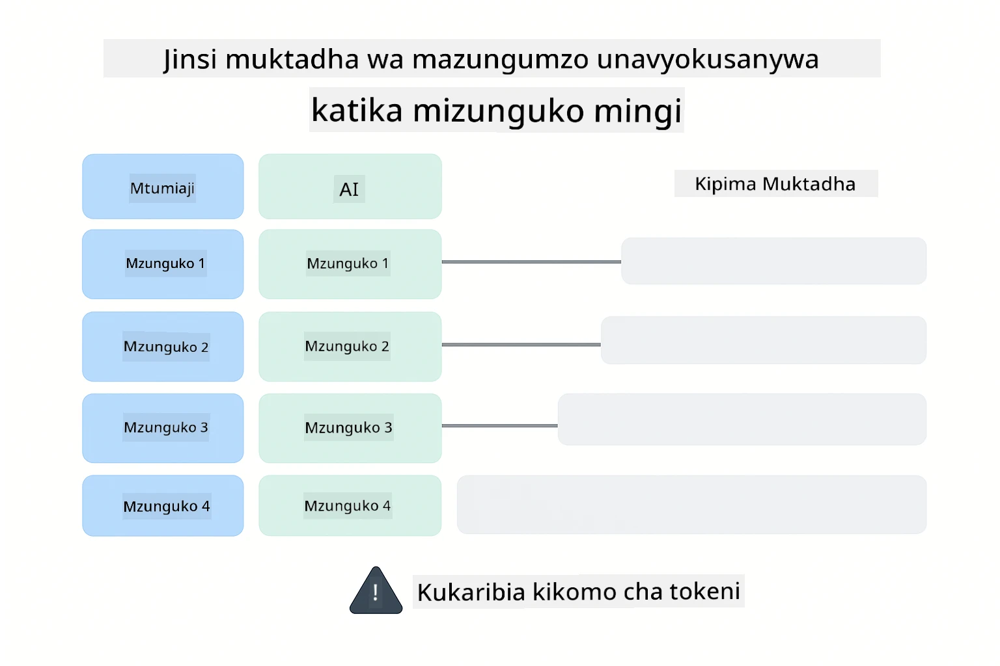
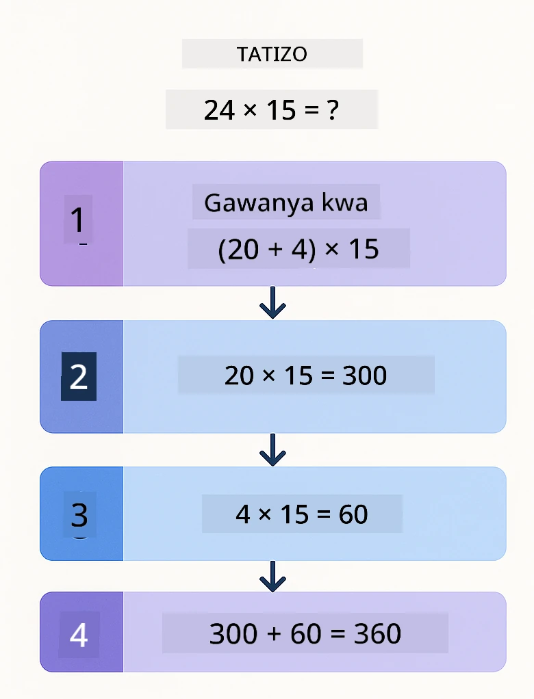
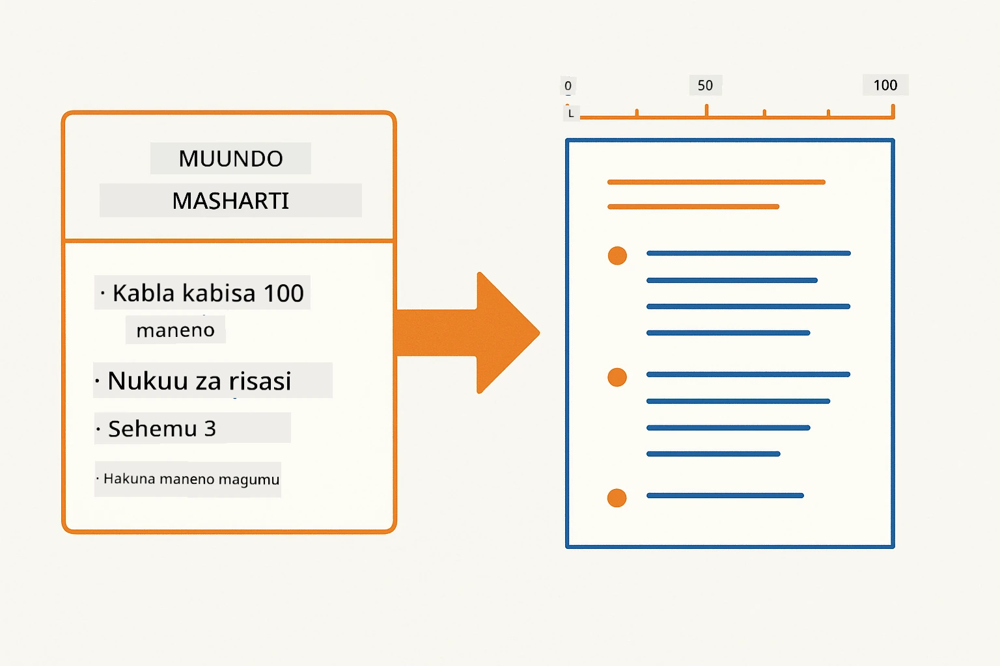
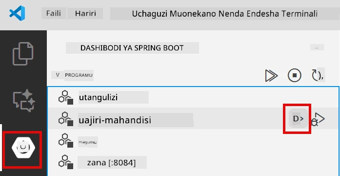
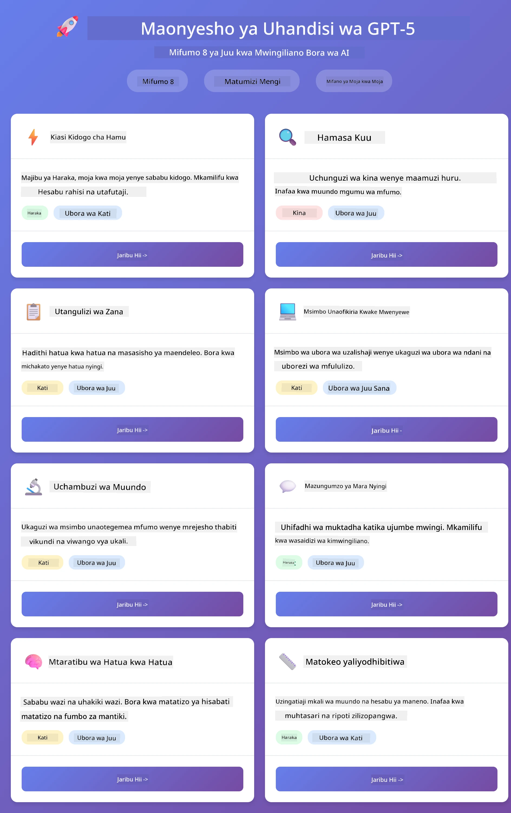
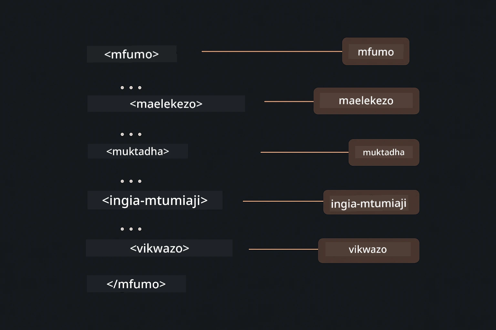

# Moduli 02: Uhandisi wa Maelekezo kwa GPT-5.2

## Jedwali la Maudhui

- [Maonyesho ya Video](#maonyesho-ya-video)
- [Utajifunza Nini](#utajifunza-nini)
- [Mahitaji ya Awali](#mahitaji-ya-awali)
- [Kuelewa Uhandisi wa Maelekezo](#kuelewa-uhandisi-wa-maelekezo)
- [Misingi ya Uhandisi wa Maelekezo](#misingi-ya-uhandisi-wa-maelekezo)
  - [Maelekezo Bila Mfano (Zero-Shot Prompting)](#maelekezo-bila-mfano-zero-shot-prompting)
  - [Maelekezo Chache za Mfano (Few-Shot Prompting)](#maelekezo-chache-za-mfano-few-shot-prompting)
  - [Mnyororo wa Fikra (Chain of Thought)](#mnyororo-wa-fikra-chain-of-thought)
  - [Maelekezo kwa Kuingia Kazi (Role-Based Prompting)](#maelekezo-kwa-kuingia-kazi-role-based-prompting)
  - [Templeti za Maelekezo (Prompt Templates)](#templeti-za-maelekezo-prompt-templates)
- [Mifumo ya Juu Zaidi](#mifumo-ya-juu-zaidi)
- [Endesha Programu](#endesha-programu)
- [Picha za Skrini za Programu](#picha-za-programu)
- [Kuchunguza Mifumo](#kuchunguza-mifumo)
  - [Shauku Ndogo vs Shauku Kubwa](#kutaka-kidogo-dhidi-ya-kutaka-kurefu)
  - [Utekelezaji wa Kazi (Maelezo ya Zana)](#utekesaji-wa-kazi-mwongozo-wa-zana)
  - [Kanuni Zinazojiangalia](#msimbo-unaojitathmini)
  - [Uchambuzi wa Muundo](#uchambuzi-ulio-jengwa)
  - [Mazungumzo ya Mzunguko wa Nyingi](#mazungumzo-ya-mara-nyingi)
  - [Ufahamu Hatua kwa Hatua](#fikra-hatua-kwa-hatua)
  - [Matokeo Yaliyodhibitiwa](#matokeo-yaliyopigwa-mipaka)
- [Unajifunza Kawaida Nini](#unachojifunza-kweli)
- [Hatua Zinazofuata](#hatua-zifuatazo)

## Maonyesho ya Video

Tazama kikao hiki cha moja kwa moja kinachoelezea jinsi ya kuanza na moduli hii:

<a href="https://www.youtube.com/live/PJ6aBaE6bog?si=LDshyBrTRodP-wke"></a>

## Utajifunza Nini

Mchoro ufuatao unatoa muhtasari wa mada muhimu na ujuzi utakaoutengeneza katika moduli hii — kuanzia mbinu za kusafisha maelekezo hadi mtiririko wa hatua kwa hatua utakaoifuata.


Katika moduli iliyopita, uliyona jinsi kumbukumbu inavyowawezesha AI ya mazungumzo kwa Azure OpenAI. Sasa tutazingatia jinsi unavyouliza maswali — maelekezo yenyewe — ukitumia GPT-5.2 ya Azure OpenAI. Jinsi unavyopanga maelekezo yako huathiri sana ubora wa majibu unayopata. Tunaanza na muhtasari wa mbinu za msingi za kutoa maelekezo, kisha tunaingia katika mifumo nane ya juu zaidi inayochukua faida kamili ya uwezo wa GPT-5.2.

Tutatumia GPT-5.2 kwa sababu inatambulisha udhibiti wa fikra - unaweza kusema kwa mfano kiasi cha kufikiri anachotakiwa kabla ya kutoa jibu. Hii inafanya mbinu tofauti za kutoa maelekezo kuwa wazi zaidi na kukusaidia kuelewa lini utumie kila mbinu.

## Mahitaji ya Awali

- Kumaliza Moduli 01 (Rasilimali za Azure OpenAI zimetangazwa)
- Faili `.env` kwenye saraka kuu ikiwa na sifa za Azure (imeundwa na `azd up` katika Moduli 01)

> **Kumbuka:** Ikiwa hukumalizia Moduli 01, tafadhali fuata maelekezo ya utekelezaji hapo kwanza.

## Kuelewa Uhandisi wa Maelekezo

Kwa msingi wake, uhandisi wa maelekezo ni tofauti kati ya maelekezo yasiyoeleweka na maelekezo sahihi, kama inavyoonyeshwa katika kulinganisha hapa chini.


Uhandisi wa maelekezo ni kuhusu kubuni maandishi ya kuingiza ambayo mara zote yanakupa matokeo unayohitaji. Sio tu kuuliza maswali - bali ni kupanga maombi ili mfano uelewe hasa unachotaka na jinsi ya kutoa.

Fikiria kama kutoa maelekezo kwa mwenzako kazini. "Tengeneza hitilafu" ni maelekezo ya jumla. "Tengeneza hitilafu ya kielekezi isiyohamishika katika UserService.java mstari wa 45 kwa kuongeza ukaguzi wa null" ni maelekezo maalum. Mifano ya lugha hufanya kazi kwa njia ile ile - maelezo maalum na muundo ni muhimu.

Mchoro hapa chini unaonyesha jinsi LangChain4j inavyobebwa tena picha hii — kuunganisha mifumo yako ya maelekezo na mfano kupitia vipengele vya SystemMessage na UserMessage.


LangChain4j hutoa miundombinu — unganisho la mfano, kumbukumbu, na aina za ujumbe — wakati mifumo ya maelekezo ni tu maandishi yaliyopangwa kwa makini unayotuma kupitia miundombinu hiyo. Vipengele vikuu ni `SystemMessage` (ambayo inaweka tabia na jukumu la AI) na `UserMessage` (ambayo hubeba ombi lako halisi).

## Misingi ya Uhandisi wa Maelekezo

Mbinu tano kuu zilizoonyeshwa hapa chini zinaweka msingi wa uhandisi wa maelekezo mzuri. Kila moja inashughulikia kipengele tofauti cha jinsi unavyozungumza na mifano ya lugha.


Kabla ya kuingia katika mifumo ya juu zaidi katika moduli hii, tuchunguze mbinu tano za msingi za kutoa maelekezo. Hizi ni vipande vya msingi ambavyo kila mhandisi wa maelekezo anapaswa kujua.

### Maelekezo Bila Mfano (Zero-Shot Prompting)

Njia rahisi zaidi: toa maagizo ya moja kwa moja kwa mfano bila mifano. Mfano hutegemea mafunzo yake kabisa kuelewa na kutekeleza kazi. Hii hufanya kazi vizuri kwa maombi rahisi ambapo tabia inayotarajiwa ni dhahiri.


*Maagizo ya moja kwa moja bila mifano — mfano hutambua kazi kutoka kwa maagizo pekee*

```java
String prompt = "Classify this sentiment: 'I absolutely loved the movie!'";
String response = model.chat(prompt);
// Jibu: "Chanya"
```

**Unapotumia:** Uainishaji rahisi, maswali ya moja kwa moja, tafsiri, au kazi yoyote ambayo mfano unaweza kushughulikia bila mwongozo zaidi.

### Maelekezo Chache za Mfano (Few-Shot Prompting)

Toa mifano inayoonyesha muundo unaotaka mfano ufuate. Mfano hujifunza muundo wa kuingiza-na-kutoa kutoka kwa mifano yako na kuutumia kwa maingizo mapya. Hii huongeza utulivu kwa kazi ambapo muundo unaotakiwa au tabia si ya wazi.


*Kujifunza kutoka kwa mifano — mfano hutambua mwelekeo na kuutumia kwa maingizo mapya*

```java
String prompt = """
    Classify the sentiment as positive, negative, or neutral.
    
    Examples:
    Text: "This product exceeded my expectations!" → Positive
    Text: "It's okay, nothing special." → Neutral
    Text: "Waste of money, very disappointed." → Negative
    
    Now classify this:
    Text: "Best purchase I've made all year!"
    """;
String response = model.chat(prompt);
```

**Unapotumia:** Uainishaji maalum, muundo thabiti, kazi za kipekee za eneo fulani, au wakati matokeo ya zero-shot hayapo thabiti.

### Mnyororo wa Fikra (Chain of Thought)

Muulize mfano aonyeshe fikra zake hatua kwa hatua. Badala ya kusogea moja kwa moja kwenye jibu, mfano huweka tatizo kwa vipande na kufanyia kazi kila sehemu kwa uwazi. Hii huongeza usahihi katika hisabati, mantiki, na kazi za kutafakari hatua kwa hatua.


*Ufahamu hatua kwa hatua — kugawanya matatizo magumu katika hatua za mantiki wazi*

```java
String prompt = """
    Problem: A store has 15 apples. They sell 8 apples and then 
    receive a shipment of 12 more apples. How many apples do they have now?
    
    Let's solve this step-by-step:
    """;
String response = model.chat(prompt);
// Mfano unaonyesha: 15 - 8 = 7, kisha 7 + 12 = 19 tufaha
```

**Unapotumia:** Matatizo ya hisabati, mafumbo ya mantiki, utatuzi hitilafu, au kazi yoyote ambapo kuonyesha mchakato wa fikra huongeza usahihi na imani.

### Maelekezo kwa Kuingia Kazi (Role-Based Prompting)

Weka utu au jukumu la AI kabla ya kuuliza swali lako. Hii hutoa muktadha unaounda mtindo, kina, na msisitizo wa jibu. "Mchora programu" hutoa ushauri tofauti na "mwanafunzi mdogo" au "mchuja usalama".


*Kuweka muktadha na utu — swali lile hutoa majibu tofauti kulingana na jukumu lililowekwa*

```java
String prompt = """
    You are an experienced software architect reviewing code.
    Provide a brief code review for this function:
    
    def calculate_total(items):
        total = 0
        for item in items:
            total = total + item['price']
        return total
    """;
String response = model.chat(prompt);
```

**Unapotumia:** Mapitio ya msimbo, ushauri, uchambuzi maalum wa eneo fulani, au wakati unahitaji majibu yaliyobinafsishwa kwa kiwango fulani cha utaalamu au mtazamo.

### Templeti za Maelekezo (Prompt Templates)

Tengeneza maelekezo yanayoweza kutumika tena yenye mahali pa kuweka mabadiliko. Badala ya kuandika maelekezo mapya kila wakati, tengeneza templeti mara moja na jaza thamani tofauti. Darasa la LangChain4j la `PromptTemplate` linaifanya hii iwe rahisi kwa sintaksia ya `{{variable}}`.


*Maelekezo yanayoweza kutumika tena yenye sehemu za mabadiliko — templeti moja, matumizi mengi*

```java
PromptTemplate template = PromptTemplate.from(
    "What's the best time to visit {{destination}} for {{activity}}?"
);

Prompt prompt = template.apply(Map.of(
    "destination", "Paris",
    "activity", "sightseeing"
));

String response = model.chat(prompt.text());
```

**Unapotumia:** Maswali yanayorudiwa yenye maingizo tofauti, usindikaji wa wingi, kujenga mitiririko ya AI inayoweza kutumika tena, au hali yoyote ambapo muundo wa maelekezo hubaki sawa lakini data hubadilika.

---

Misingi hii mitano inakupa zana thabiti kwa kazi nyingi za kutoa maelekezo. Sehemu nyingine ya moduli hii inajenga juu yao kwa **mifumo nane ya juu zaidi** inayotumia udhibiti wa fikra wa GPT-5.2, kujitathmini, na uwezo wa kutoa matokeo yaliyopangwa.

## Mifumo ya Juu Zaidi

Baada ya kufunika misingi, tunahamia kwenye mifumo nane ya juu zaidi inayofanya moduli hii kuwa ya kipekee. Siyo matatizo yote yanayohitaji mbinu sawa. Maswali mengine yanahitaji majibu ya haraka, mengine yanahitaji fikra za kina. Baadhi yanahitaji ufafanuzi wa fikra, mengine yanahitaji tu matokeo. Kila mfumo hapa chini umeboreshwa kwa hali tofauti — na udhibiti wa fikra wa GPT-5.2 unafanya tofauti hizi kuwa wazi zaidi.



*Muhtasari wa mifumo nane ya uhandisi wa maelekezo na matumizi yake*

GPT-5.2 inaongeza kipengele kingine kwa mifumo hii: *udhibiti wa fikra*. Kipimo hapo chini kinaonyesha jinsi unavyoweza kurekebisha juhudi za kufikiri za mfano — kutoka majibu ya haraka na ya moja kwa moja hadi uchambuzi wa kina na wa kina.


*Udhibiti wa fikra wa GPT-5.2 hukuruhusu kubainisha kiasi cha fikra ambacho mfano unapaswa kufanya — kutoka majibu ya haraka ya moja kwa moja hadi uchunguzi wa kina*

**Shauku Ndogo (Haraka na Iliyolenga)** - Kwa maswali rahisi ambapo unataka majibu ya haraka na ya moja kwa moja. Mfano hufanya fikra kidogo - hatua 2 za juu kabisa. Tumia hii kwa mahesabu, tafutaji, au maswali rahisi.

```java
String prompt = """
    <context_gathering>
    - Search depth: very low
    - Bias strongly towards providing a correct answer as quickly as possible
    - Usually, this means an absolute maximum of 2 reasoning steps
    - If you think you need more time, state what you know and what's uncertain
    </context_gathering>
    
    Problem: What is 15% of 200?
    
    Provide your answer:
    """;

String response = chatModel.chat(prompt);
```

> 💡 **Chunguza na GitHub Copilot:** Fungua [`Gpt5PromptService.java`](../../../02-prompt-engineering/src/main/java/com/example/langchain4j/prompts/service/Gpt5PromptService.java) na uliza:
> - "Tofauti kati ya mifumo ya maelekezo ya shauku ndogo na shauku kubwa ni nini?"
> - "Maelezo ya XML katika maelekezo husaidiaje kupanga jibu la AI?"
> - "Lini napaswa kutumia mifumo ya kujitathmini kwa nafsi dhidi ya maagizo ya moja kwa moja?"

**Shauku Kubwa (Kina na Kina Kwa Kina)** - Kwa matatizo magumu unayotaka uchambuzi wa kina. Mfano huchunguza kwa kina na kuonyesha fikra kwa undani. Tumia hii kwa usanifu wa mifumo, maamuzi ya usanifu, au utafiti mgumu.

```java
String prompt = """
    Analyze this problem thoroughly and provide a comprehensive solution.
    Consider multiple approaches, trade-offs, and important details.
    Show your analysis and reasoning in your response.
    
    Problem: Design a caching strategy for a high-traffic REST API.
    """;

String response = chatModel.chat(prompt);
```

**Utekelezaji wa Kazi (Mafanikio Hatua kwa Hatua)** - Kwa mitiririko ya kazi yenye hatua nyingi. Mfano hutoa mpango wa awali, unasimulia hatua kila anapofanya kazi, kisha hutoa muhtasari. Tumia hii kwa uhamisho, utekelezaji, au mchakato wowote wenye hatua nyingi.

```java
String prompt = """
    <task_execution>
    1. First, briefly restate the user's goal in a friendly way
    
    2. Create a step-by-step plan:
       - List all steps needed
       - Identify potential challenges
       - Outline success criteria
    
    3. Execute each step:
       - Narrate what you're doing
       - Show progress clearly
       - Handle any issues that arise
    
    4. Summarize:
       - What was completed
       - Any important notes
       - Next steps if applicable
    </task_execution>
    
    <tool_preambles>
    - Always begin by rephrasing the user's goal clearly
    - Outline your plan before executing
    - Narrate each step as you go
    - Finish with a distinct summary
    </tool_preambles>
    
    Task: Create a REST endpoint for user registration
    
    Begin execution:
    """;

String response = chatModel.chat(prompt);
```

Maelekezo ya Mnyororo wa Fikra (Chain-of-Thought) huomba mfano aonyeshe mchakato wa kufikiri, huongeza usahihi kwenye kazi ngumu. Kugawanya kwa hatua-hatua husaidia binadamu na AI kuelewa mantiki.

> **🤖 Jaribu na [GitHub Copilot](https://github.com/features/copilot) Chat:** Uliza kuhusu mfumo huu:
> - "Ningebadilishaje mfumo wa utekelezaji wa kazi kwa operesheni za muda mrefu?"
> - "Ni mbinu bora zipi za kupanga maelezo ya zana katika programu za uzalishaji?"
> - "Ninawezaje kunasa na kuonyesha taarifa za maendeleo ya kati katika UI?"

Mchoro hapa chini unaonyesha mtiririko huu wa Kupanua → Kutekeleza → Kufupisha.



*Panga → Tekeleza → Fupisha mtiririko wa kazi yenye hatua nyingi*

**Kanuni Zinazojiangalia** - Kwa kuunda msimbo wa ubora wa uzalishaji. Mfano hutengeneza msimbo unafuata viwango vya uzalishaji na usimamizi sahihi wa makosa. Tumia hii wakati wa kujenga vipengele vipya au huduma.

```java
String prompt = """
    Generate Java code with production-quality standards: Create an email validation service
    Keep it simple and include basic error handling.
    """;

String response = chatModel.chat(prompt);
```

Mchoro hapa chini unaonyesha mzunguko huu wa maboresho ya kuendelea — tengeneza, tathmini, tambua mapungufu, na safisha hadi msimbo ukidhi viwango vya uzalishaji.



*Mizunguko ya maboresho ya kuendelea - tengeneza, tathmini, tambua matatizo, boresha, rudia*

**Uchambuzi wa Muundo** - Kwa tathmini thabiti. Mfano hupitia msimbo ukitumia mfumo thabiti (usahihi, mbinu, utendaji, usalama, uendelevu). Tumia hii kwa mapitio ya msimbo au tathmini ya ubora.

```java
String prompt = """
    <analysis_framework>
    You are an expert code reviewer. Analyze the code for:
    
    1. Correctness
       - Does it work as intended?
       - Are there logical errors?
    
    2. Best Practices
       - Follows language conventions?
       - Appropriate design patterns?
    
    3. Performance
       - Any inefficiencies?
       - Scalability concerns?
    
    4. Security
       - Potential vulnerabilities?
       - Input validation?
    
    5. Maintainability
       - Code clarity?
       - Documentation?
    
    <output_format>
    Provide your analysis in this structure:
    - Summary: One-sentence overall assessment
    - Strengths: 2-3 positive points
    - Issues: List any problems found with severity (High/Medium/Low)
    - Recommendations: Specific improvements
    </output_format>
    </analysis_framework>
    
    Code to analyze:
    ```
    public List getUsers() {
        return database.query("SELECT * FROM users");
    }
    ```
    Provide your structured analysis:
    """;

String response = chatModel.chat(prompt);
```

> **🤖 Jaribu na [GitHub Copilot](https://github.com/features/copilot) Chat:** Uliza kuhusu uchambuzi wa muundo:
> - "Ninawezaje kubinafsisha mfumo wa uchambuzi kwa aina mbalimbali za mapitio ya msimbo?"
> - "Njia bora za kuchanganua na kutenda juu ya matokeo yaliyopangwa ni zipi?"
> - "Ninawezaje kuhakikisha viwango sawia vya ukali kwenye vikao tofauti vya mapitio?"

Mchoro ufuatao unaonyesha jinsi mfumo huu ulivyoandaa mapitio ya msimbo katika makundi thabiti na viwango vya ukali.



*Mfumo wa mapitio thabiti ya msimbo yenye viwango vya ukali*

**Mazungumzo ya Mzunguko wa Nyingi** - Kwa mazungumzo yanayohitaji muktadha. Mfano anakumbuka ujumbe wa awali na kujenga juu yake. Tumia hii kwa vikao vya msaada ya moja kwa moja au maswali magumu.

```java
ChatMemory memory = MessageWindowChatMemory.withMaxMessages(10);

memory.add(UserMessage.from("What is Spring Boot?"));
AiMessage aiMessage1 = chatModel.chat(memory.messages()).aiMessage();
memory.add(aiMessage1);

memory.add(UserMessage.from("Show me an example"));
AiMessage aiMessage2 = chatModel.chat(memory.messages()).aiMessage();
memory.add(aiMessage2);
```

Mchoro hapa chini unaonesha jinsi muktadha wa mazungumzo unavyojikusanya kwa kila mzunguko na jinsi unavyohusiana na kikomo cha token cha mfano.



*Jinsi muktadha wa mazungumzo unavyojikusanya kwa mzunguko mingi hadi kufikia kikomo cha tokeni*

**Ufahamu Hatua kwa Hatua** - Kwa matatizo yanayohitaji mantiki inayoonekana. Mfano huonyesha fikra zilizo wazi kwa kila hatua. Tumia hii kwa matatizo ya hisabati, mafumbo ya mantiki, au wakati unahitaji kuelewa mchakato wa kufikiri.

```java
String prompt = """
    <instruction>Show your reasoning step-by-step</instruction>
    
    If a train travels 120 km in 2 hours, then stops for 30 minutes,
    then travels another 90 km in 1.5 hours, what is the average speed
    for the entire journey including the stop?
    """;

String response = chatModel.chat(prompt);
```

Mchoro hapa chini unaonyesha jinsi mfano huvunja matatizo katika hatua za mantiki zilizoandikwa na nambari wazi.


*Kuvunja matatizo katika hatua za wazi za kiakili*

**Matokeo Yaliyopigwa Mipaka** - Kwa majibu yenye mahitaji maalum ya muundo. Mfano unafuata kwa umakini kanuni za muundo na urefu. Tumia hii kwa muhtasari au unapohitaji muundo sahihi wa matokeo.

```java
String prompt = """
    <constraints>
    - Exactly 100 words
    - Bullet point format
    - Technical terms only
    </constraints>
    
    Summarize the key concepts of machine learning.
    """;

String response = chatModel.chat(prompt);
```

Mchoro ufuatao unaonyesha jinsi vizuizi vinavyoelekeza mfano kutoa matokeo yanayozingatia kwa ukamilifu mahitaji yako ya muundo na urefu.



*Kutekeleza mahitaji maalum ya muundo, urefu, na muundo*

## Endesha Programu

**Thibitisha usambazaji:**

Hakikisha faili `.env` ipo kwenye saraka kuu na ina vibali vya Azure (vilivyoundwa wakati wa Moduli 01). Endesha hii kutoka kwenye saraka ya moduli (`02-prompt-engineering/`):

**Bash:**
```bash
cat ../.env  # Inapaswa kuonyesha AZURE_OPENAI_ENDPOINT, API_KEY, DEPLOYMENT
```

**PowerShell:**
```powershell
Get-Content ..\.env  # Inapaswa kuonyesha AZURE_OPENAI_ENDPOINT, API_KEY, DEPLOYMENT
```

**Anzisha programu:**

> **Kumbuka:** Ikiwa tayari umeanzisha programu zote ukitumia `./start-all.sh` kutoka saraka kuu (kama ilivyoelezwa katika Moduli 01), moduli hii tayari inaendeshwa kwenye bandari 8083. Unaweza kuruka amri za kuanzisha zilizopo hapa chini na kwenda moja kwa moja http://localhost:8083.

**Chaguo 1: Kutumia Spring Boot Dashboard (Inayopendekezwa kwa watumiaji wa VS Code)**

Sanduku la maendeleo lina nyongeza ya Spring Boot Dashboard, inayotoa interface ya kuona kuendesha programu zote za Spring Boot. Unaweza kuipata kwenye Mwambaa wa Shughuli upande wa kushoto wa VS Code (tazama ikoni ya Spring Boot).

Kutoka Spring Boot Dashboard, unaweza:
- Kuona programu zote za Spring Boot zilizopo kwenye eneo la kazi
- Kuanzisha/kuzima programu kwa bonyeza moja
- Kuangalia kumbukumbu za programu kwa wakati halisi
- Kufuatilia hali ya programu

Bonyeza kitufe cha play kando ya "prompt-engineering" kuanzisha moduli hii, au anzisha moduli zote kwa wakati mmoja.



*Dashibodi ya Spring Boot katika VS Code — anzisha, zimia, na fuatilia moduli zote kutoka sehemu moja*

**Chaguo 2: Kutumia skripti za shell**

Anzisha programu zote za mtandao (moduli 01-04):

**Bash:**
```bash
cd ..  # Kutoka kwenye saraka ya mzizi
./start-all.sh
```

**PowerShell:**
```powershell
cd ..  # Kutoka kwa saraka ya mzizi
.\start-all.ps1
```

Au anzisha moduli hii tu:

**Bash:**
```bash
cd 02-prompt-engineering
./start.sh
```

**PowerShell:**
```powershell
cd 02-prompt-engineering
.\start.ps1
```

Skripti zote zinapakia moja kwa moja mabadiliko ya mazingira kutoka faili `.env` kuu na zitajenga JARs endapo hazipo.

> **Kumbuka:** Ikiwa unapendelea kujenga moduli zote kwa mikono kabla ya kuanza:
>
> **Bash:**
> ```bash
> cd ..  # Go to root directory
> mvn clean package -DskipTests
> ```

> **PowerShell:**
> ```powershell
> cd ..  # Go to root directory
> mvn clean package -DskipTests
> ```

Fungua http://localhost:8083 kwenye kivinjari chako.

**Kusitisha:**

**Bash:**
```bash
./stop.sh  # Moduli hii pekee
# Au
cd .. && ./stop-all.sh  # Moduli zote
```

**PowerShell:**
```powershell
.\stop.ps1  # Hili ni moduli tu
# Au
cd ..; .\stop-all.ps1  # Moduli zote
```

## Picha za Programu

Huu ni muonekano mkuu wa moduli ya uhandisi wa prompt, ambapo unaweza kujaribu mifumo yote nane kwa pamoja.



*Dashibodi kuu ikionyesha mifumo yote 8 ya uhandisi wa prompt pamoja na sifa na matumizi yao*

## Kuchunguza Mifumo

Interface ya wavuti inakuwezesha kujaribu mikakati tofauti ya kuigiza (prompting). Kila mfumo unatatua matatizo tofauti - jaribu kuona lini kila njia hutoa matokeo bora.

> **Kumbuka: Streaming dhidi ya Isiyostreaming** — Kila ukurasa wa mfumo una vifungo viwili: **🔴 Jiribu Matokeo Moja kwa Moja (Live)** na chaguo la **Isiyostreaming**. Streaming hutumia Server-Sent Events (SSE) kuonyesha tokeni kwa wakati halisi wakati mfano unayazalisha, kwa hivyo unaona maendeleo mara moja. Chaguo la isiyostreaming husubiri jibu lote kabla ya kuonyesha. Kwa prompts zinazochochea fikra za kina (mfano, High Eagerness, Self-Reflecting Code), mwito wa isiyostreaming unaweza kuchukua muda mrefu sana — mara nyingine dakika — bila maoni yanayoonekana. **Tumia streaming unapojaribu prompts tata** ili uone mfano ukitumia na kuepuka hisia kwamba ombi limefikia muda wake.
>
> **Kumbuka: Sharti la Kivinjari** — Kipengele cha streaming kinatumia Fetch Streams API (`response.body.getReader()`) kinachohitaji kivinjari kamili (Chrome, Edge, Firefox, Safari). Hakifanyi kazi katika Simple Browser iliyojengwa ndani ya VS Code, kwani muonekano wake wa wavuti hauungi mkono ReadableStream API. Ukitumia Simple Browser, vifungo vya isiyostreaming bado vitafanya kazi kama kawaida — ni vifungo vya streaming tu vinaathirika. Fungua `http://localhost:8083` kwenye kivinjari huru kwa uzoefu kamili.

### Kutaka Kidogo dhidi ya Kutaka Kurefu

Uliza swali rahisi kama "Ni asilimia 15 ya 200 ni kiasi gani?" ukitumia Low Eagerness. Utapokea jibu la papo hapo, moja kwa moja. Sasa uliza kitu kigumu kama "Tengeneza mkakati wa kuhifadhi data kwa API yenye trafiki kubwa" ukitumia High Eagerness. Bonyeza **🔴 Jiribu Matokeo Moja kwa Moja (Live)** na tathmini fikra za mfano kwa undani tokeni baada ya tokeni. Mfano ule ule, muundo ule ule wa swali - lakini prompt inasema ni kiasi gani cha kufikiria kinahitajika.

### Utekesaji wa Kazi (Mwongozo wa Zana)

Mizigo yenye hatua nyingi inafaidika na upangaji wa awali na maelezo ya maendeleo. Mfano huonyesha ni nini kitakachofanywa, hueleza kila hatua, kisha hutoa muhtasari wa matokeo.

### Msimbo Unaojitathmini

Jaribu "Tengeneza huduma ya kuthibitisha barua pepe". Badala ya kuzalisha msimbo na kusitisha, mfano huzalisha, huku hukagua dhidi ya vigezo vya ubora, hutambua udhaifu, na kuboresha. Utaona ikirudia hadi msimbo ukadhihirishwe kufikia viwango vya uzalishaji.

### Uchambuzi Ulio Jengwa

Mapitio ya msimbo yanahitaji mfumo thabiti wa tathmini. Mfano unachambua msimbo kwa kutumia makundi thabiti (usahihi, desturi, utendaji, usalama) na viwango vya ukali.

### Mazungumzo ya Mara Nyingi

Uliza "Spring Boot ni nini?" kisha mara moja fuata na "Nionyeshe mfano". Mfano hukumbuka swali lako la kwanza na kukupa mfano wa Spring Boot hasa. Bila kumbukumbu, swali la pili lingekuwa la jumla sana.

### Fikra Hatua kwa Hatua

Chagua tatizo la hesabu na jiunge nalo kwa Step-by-Step Reasoning na Low Eagerness. Low eagerness hutoa jibu tu - haraka lakini haieleweki. Step-by-step inaonyesha kila hesabu na uamuzi.

### Matokeo Yaliyopigwa Mipaka

Unapohitaji muundo au idadi maalum ya maneno, mfumo huu unahakikisha kufuata maagizo kwa ukamilifu. Jaribu kuzalisha muhtasari wenye maneno 100 halisi kwa njia ya pointi za risasi.

## Unachojifunza Kweli

**Jitihada za Fikra Hubadilisha Kila Kitu**

GPT-5.2 inakuwezesha kudhibiti jitihada za kompyuta kupitia prompt zako. Jitihada ndogo inamaanisha majibu ya haraka yenye uchunguzi mdogo. Jitihada kubwa ina maana mfano huchukua muda kufikiria kwa kina. Unajifunza kulinganisha jitihada na ugumu wa kazi - usipoteze muda kwa maswali rahisi, lakini usiharakishe maamuzi magumu pia.

**Muundo Huongoza Tabia**

Umeziona tags za XML kwenye prompts? Sio mapambo. Mifano hufuata maagizo yaliyo na muundo kwa uhakika zaidi kuliko maandishi ya kawaida. Unapohitaji michakato yenye hatua nyingi au mantiki tata, muundo husaidia mfano kufuatilia ni wapi yuko na ni nini kitakachofuata. Mchoro hapa chini unavunja prompt yenye muundo mzuri, unaonyesha jinsi tags kama `<system>`, `<instructions>`, `<context>`, `<user-input>`, na `<constraints>` zinavyopanga maelekezo yako katika sehemu zilizo wazi.



*Muundo wa prompt wenye sehemu zilizo wazi na mpangilio wa mtindo wa XML*

**Ubora Kupitia Kujitathmini**

Mifumo ya kujitathmini huendelezwa kwa kuweka wazi vigezo vya ubora. Badala ya kutegemea somo lifanye "sahihi", unalimwambia hasa maana ya "sahihi": mantiki inayofaa, utunzaji wa makosa, utendaji, usalama. Kisha mfano unaweza kutathmini matokeo yake na kuboresha. Hii hubadilisha uzalishaji wa msimbo kutoka bahati nasibu kuwa mchakato.

**Muktadha Ni Mdogo**

Mazungumzo ya mara nyingi hufanya kazi kwa kuingiza historia ya ujumbe kwa kila ombi. Lakini kuna kikomo - kila mfano una hesabu kubwa ya tokeni walioweza kubeba. Kadiri mazungumzo yanavyokua, utahitaji mikakati ya kuweka muktadha muhimu bila kufikia ukomo huo. Moduli hii inakuonyesha jinsi kumbukumbu inavyofanya kazi; baadaye utajifunza lini kufupisha, lini kusahau, na lini kupata tena.

## Hatua Zifuatazo

**Moduli Inayofuata:** [03-rag - RAG (Uzalishaji Ulioboreshwa kwa Kupata Taarifa)](../03-rag/README.md)

---

**Utengezaji:** [← Awali: Moduli 01 - Utangulizi](../01-introduction/README.md) | [Rudi Kwenye Kuu](../README.md) | [Ifuatayo: Moduli 03 - RAG →](../03-rag/README.md)

---

<!-- CO-OP TRANSLATOR DISCLAIMER START -->
**Kionyozo**:
Hati hii imetafsiriwa kwa kutumia huduma ya tafsiri ya AI [Co-op Translator](https://github.com/Azure/co-op-translator). Ingawa tunajitahidi kupata usahihi, tafadhali fahamu kwamba tafsiri za kiotomatiki zinaweza kuwa na makosa au upungufu wa usahihi. Hati ya asili katika lugha yake halisi inapaswa kuchukuliwa kama chanzo cha mamlaka. Kwa taarifa muhimu, tafsiri ya kitaalamu inayofanywa na binadamu inapendekezwa. Hatutojibu kwa kuelewa vibaya au tafsiri potofu zinazotokea kutokana na matumizi ya tafsiri hii.
<!-- CO-OP TRANSLATOR DISCLAIMER END -->