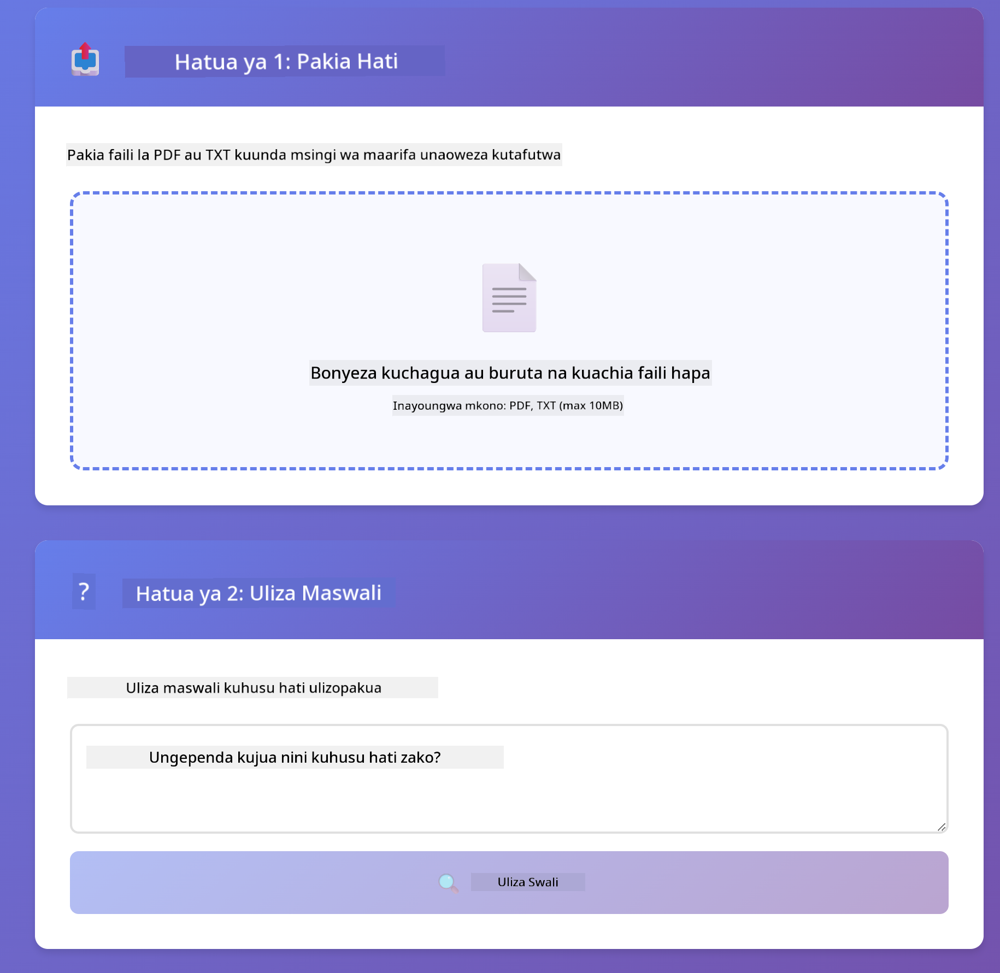

<!--
CO_OP_TRANSLATOR_METADATA:
{
  "original_hash": "81d087662fb3dd7b7124bce1a9c9ec86",
  "translation_date": "2026-01-06T00:37:31+00:00",
  "source_file": "03-rag/README.md",
  "language_code": "sw"
}
-->
# Sehemu ya 03: RAG (Uzalishaji Ulioboreshwa kwa Urejeshaji)

## Jedwali la Maudhui

- [Utajifunza Nini](../../../03-rag)
- [Masharti ya Awali](../../../03-rag)
- [Kuelewa RAG](../../../03-rag)
- [Inavyofanya Kazi](../../../03-rag)
  - [Usindikaji wa Hati](../../../03-rag)
  - [Kutengeneza Mifano](../../../03-rag)
  - [Utafutaji wa Kimaana](../../../03-rag)
  - [Uzalishaji wa Majibu](../../../03-rag)
- [Endesha Programu](../../../03-rag)
- [Kutumia Programu](../../../03-rag)
  - [Pakia Hati](../../../03-rag)
  - [Uliza Maswali](../../../03-rag)
  - [Angalia Marejeo ya Chanzo](../../../03-rag)
  - [Jaribu Maswali Tofauti](../../../03-rag)
- [Mawazo Muhimu](../../../03-rag)
  - [Mikakati ya Kugawanya Sehemu](../../../03-rag)
  - [Alama za Ulinganifu](../../../03-rag)
  - [Uhifadhi Kwenye Kumbukumbu](../../../03-rag)
  - [Usimamizi wa Dirisha la Muktadha](../../../03-rag)
- [Wakati RAG Inapokuwa Muhimu](../../../03-rag)
- [Hatua Zifuatazo](../../../03-rag)

## Utajifunza Nini

Katika sehemu zilizopita, ulijifunza jinsi ya kuzungumza na AI na kupanga maelekezo yako kwa ufanisi. Lakini kuna kikomo kikuu: mifano ya lugha hujua tu kile walichojifunza wakati wa mafunzo. Haiwezi kutoa majibu kuhusu sera za kampuni yako, nyaraka za mradi wako, au taarifa yoyote ambayo hawakufundishwa.

RAG (Uzalishaji Ulioboreshwa kwa Urejeshaji) huondoa tatizo hili. Badala ya kujaribu kufundisha mfano taarifa zako (ambayo ni ghali na si rahisi), unampa uwezo wa kutafuta ndani ya nyaraka zako. Mtu anapojiuliza swali, mfumo hupata taarifa zinazohusiana na kuzijumuisha katika maelekezo. Kisha mfano hutumia muktadha huo kurejelea jibu.

Fikiria RAG kama kumpa mfano maktaba ya rejea. Unapoanza swali, mfumo:
1. **Swali la Mtumiaji** - Unauliza swali
2. **Kuunda Mifano** - Hubadilisha swali lako kuwa vekta
3. **Utafutaji wa Vekta** - Hupata vipande vya hati vinavyofanana
4. **Kukusanya Muktadha** - Hujumuisha vipande vinavyohusiana katika maelekezo
5. **Jibu** - LLM huunda jibu kwa kutumia muktadha huo

Hii hufanya jibu la mfano liwe linalotegemea data yako halisi badala ya kutegemea maarifa ya mafunzo au kuunda majibu yasiyo ya kweli.


*Mtiririko wa kazi wa RAG - kutoka swali la mtumiaji hadi utafutaji wa kimaana na uzalishaji wa jibu kwa muktadha*

## Masharti ya Awali

- Kumaliza Sehemu ya 01 (Rasilimali za Azure OpenAI zimeshatumika)
- Faili la `.env` katika saraka kuu lenye vyeti vya Azure (limeundwa na `azd up` katika Sehemu ya 01)

> **Kumbuka:** Ikiwa hujakamilisha Sehemu ya 01, fuata maelekezo ya usambazaji hapo kwanza.

## Inavyofanya Kazi

### Usindikaji wa Hati

[DocumentService.java](../../../03-rag/src/main/java/com/example/langchain4j/rag/service/DocumentService.java)

Unapopakia hati, mfumo hugawanya kuwa vipande vidogo - vidogo vinavyofaa kwa dirisha la muktadha la mfano. Vipande hivi huwa vinatofautiana kidogo ili usipoteze muktadha katika mipaka.

```java
Document document = FileSystemDocumentLoader.loadDocument("sample-document.txt");

DocumentSplitter splitter = DocumentSplitters
    .recursive(300, 30, new OpenAiTokenizer());

List<TextSegment> segments = splitter.split(document);
```

> **🤖 Jaribu na [GitHub Copilot](https://github.com/features/copilot) Chat:** Fungua [`DocumentService.java`](../../../03-rag/src/main/java/com/example/langchain4j/rag/service/DocumentService.java) na uliza:
> - "LangChain4j hugawanya hati kuwa vipande vipi na kwa nini mgongano ni muhimu?"
> - "Urefu bora wa kipande kwa aina tofauti za hati ni upi na kwa nini?"
> - "Nashughulikia vipi hati zilizo kwenye lugha nyingi au zenye muundo maalum?"

### Kutengeneza Mifano

[LangChainRagConfig.java](../../../03-rag/src/main/java/com/example/langchain4j/rag/config/LangChainRagConfig.java)

Kipande kila kinasukumwa kuwa uwakilishi wa nambari unaoitwa mfano - alama za kihesabu zinazoonyesha maana ya maandishi. Maandishi yanayofanana huzaa mifano inayofanana.

```java
@Bean
public EmbeddingModel embeddingModel() {
    return OpenAiOfficialEmbeddingModel.builder()
        .baseUrl(azureOpenAiEndpoint)
        .apiKey(azureOpenAiKey)
        .modelName(azureEmbeddingDeploymentName)
        .build();
}

EmbeddingStore<TextSegment> embeddingStore = 
    new InMemoryEmbeddingStore<>();
```


*Hati zinazooneshwa kama vekta kwenye nafasi ya mfano - maudhui yanayofanana huungana pamoja*

### Utafutaji wa Kimaana

[RagService.java](../../../03-rag/src/main/java/com/example/langchain4j/rag/service/RagService.java)

Unapoanza swali, swali lako pia hubadilishwa kuwa mfano. Mfumo unalinganisha mfano wa swali lako na mifano ya vipande vyote vya hati. Hupata vipande vyenye maana zinazofanana zaidi - si kwa maneno tu, bali ulinganifu halisi wa maana.

```java
Embedding queryEmbedding = embeddingModel.embed(question).content();

List<EmbeddingMatch<TextSegment>> matches = 
    embeddingStore.findRelevant(queryEmbedding, 5, 0.7);

for (EmbeddingMatch<TextSegment> match : matches) {
    String relevantText = match.embedded().text();
    double score = match.score();
}
```

> **🤖 Jaribu na [GitHub Copilot](https://github.com/features/copilot) Chat:** Fungua [`RagService.java`](../../../03-rag/src/main/java/com/example/langchain4j/rag/service/RagService.java) na uliza:
> - "Utafutaji wa ulinganifu unavyofanya kazi na mifano na ni nini huamua alama?"
> - "Kiwango gani cha ulinganifu ningetumia na kinaathirije matokeo?"
> - "Nashughulikia vipi hali zinazotokea hakuna hati zinazofaa kupatikana?"

### Uzalishaji wa Majibu

[RagService.java](../../../03-rag/src/main/java/com/example/langchain4j/rag/service/RagService.java)

Vipande vinavyofaa zaidi hujumuishwa kwenye maelekezo kwa mfano. Mfano husoma vipande hivyo maalum na kujibu swali lako kwa msingi wa taarifa hiyo. Hii huzuia mawazo potofu - mfano unaweza kutoa jibu tu kutoka kile kilicho mbele yake.

## Endesha Programu

**Thibitisha usambazaji:**

Hakikisha faili `.env` ipo katika saraka kuu na vyeti vya Azure (vilivyoundwa wakati wa Sehemu ya 01):
```bash
cat ../.env  # Inapaswa kuonyesha AZURE_OPENAI_ENDPOINT, API_KEY, DEPLOYMENT
```

**Anzisha programu:**

> **Kumbuka:** Ikiwa tayari umeanzisha programu zote kutumia `./start-all.sh` kutoka Sehemu ya 01, sehemu hii tayari inaendesha kwenye bandari 8081. Unaweza kuruka amri za kuanzisha hapa chini na kwenda moja kwa moja http://localhost:8081.

**Chaguo 1: Kutumia Spring Boot Dashboard (Inapendekezwa kwa watumiaji wa VS Code)**

Kontena la kuwaendeleza limejumuisha kiongezi cha Spring Boot Dashboard, kinachotoa kiolesura cha kuona na kusimamia programu zote za Spring Boot. Unaweza kukipata kwenye Bar ya Shughuli upande wa kushoto wa VS Code (tafuta ikoni ya Spring Boot).

Kutoka Spring Boot Dashboard, unaweza:
- Kuona programu zote za Spring Boot zinazopatikana kwenye eneo la kazi
- Anzisha/zimia programu kwa bonyeza moja
- Tazama kumbukumbu za programu kwa wakati halisi
- Fuatilia hali ya programu

Bofya kitufe cha kuanzisha karibu na "rag" kuanzisha sehemu hii, au anzisha sehemu zote mara moja.


**Chaguo 2: Kutumia skripti za shell**

Anzisha programu zote za wavuti (sehemu 01-04):

**Bash:**
```bash
cd ..  # Kutoka kwenye saraka kuu
./start-all.sh
```

**PowerShell:**
```powershell
cd ..  # Kutoka kwa saraka ya mzizi
.\start-all.ps1
```

Au anzisha sehemu hii tu:

**Bash:**
```bash
cd 03-rag
./start.sh
```

**PowerShell:**
```powershell
cd 03-rag
.\start.ps1
```

Skripti zote hujipakia moja kwa moja mazingira kutoka faili `.env` ya saraka kuu na hutatua JARs kama hazipo.

> **Kumbuka:** Ikiwa unataka kujenga sehemu zote kwa mikono kabla ya kuanza:
>
> **Bash:**
> ```bash
> cd ..  # Go to root directory
> mvn clean package -DskipTests
> ```
>
> **PowerShell:**
> ```powershell
> cd ..  # Go to root directory
> mvn clean package -DskipTests
> ```

Fungua http://localhost:8081 kwenye kivinjari chako.

**Kusitisha:**

**Bash:**
```bash
./stop.sh  # Hii moduli tu
# Au
cd .. && ./stop-all.sh  # Moduli zote
```

**PowerShell:**
```powershell
.\stop.ps1  # Moduli hii tu
# Au
cd ..; .\stop-all.ps1  # Moduli zote
```

## Kutumia Programu

Programu hutoa kiolesura cha wavuti kwa ajili ya kupakia nyaraka na kuuliza maswali.

<a href="images/rag-homepage.png"></a>

*Kiolesura cha programu ya RAG - pakia nyaraka na uliza maswali*

### Pakia Hati

Anza kwa kupakia hati - faili za TXT zinafanya kazi vizuri kwa majaribio. Hati ya mfano ya `sample-document.txt` ipo katika saraka hii ambayo inaelezea kuhusu sifa za LangChain4j, utekelezaji wa RAG, na mbinu bora - nzuri kwa majaribio ya mfumo.

Mfumo husindika hati yako, hugawanya vipande, na hutengeneza mifano kwa kila kipande. Hii hufanyika moja kwa moja unapopakua.

### Uliza Maswali

Sasa uliza maswali maalum kuhusu maudhui ya hati. Jaribu kitu cha kweli kilicho wazi katika hati. Mfumo hufuatilia vipande vinavyohusiana, hujumuisha kwenye maelekezo, na hutengeneza jibu.

### Angalia Marejeo ya Chanzo

Gundua kila jibu lina marejeo ya chanzo na alama za ulinganifu. Alama hizi (0 hadi 1) zinaonyesha jinsi kipande kilivyohusiana na swali lako. Alama kubwa zinamaanisha ulinganifu mzuri. Hii inakuruhusu kuthibitisha jibu dhidi ya nyaraka za chanzo.

<a href="images/rag-query-results.png"></a>

*Matokeo ya swali yakionyesha jibu na marejeo ya chanzo pamoja na alama za ulinganifu*

### Jaribu Maswali Tofauti

Jaribu aina tofauti za maswali:
- Mambo maalum: "Moja ya mada kuu ni ipi?"
- Mlinganisho: "Tofauti kati ya X na Y ni gani?"
- Muhtasari: "Fupisha pointi muhimu kuhusu Z"

Tazama jinsi alama za ulinganifu zinavyobadilika kulingana na jinsi swali lako linavyolingana na maudhui ya hati.

## Mawazo Muhimu

### Mikakati ya Kugawanya Sehemu

Hati hugawanywa vipande vya tokeni 300 na tokeni 30 za mgongano. Mchanganyiko huu huhakikisha kila kipande kina muktadha wa kutosha kuwa na maana huku kikibaki kidogo ili nyaraka nyingi ziweze kujumuishwa kwenye maelekezo.

### Alama za Ulinganifu

Alama ziko kati ya 0 na 1:
- 0.7-1.0: Muhimu sana, sambamba kabisa
- 0.5-0.7: Muhimu, muktadha mzuri
- Chini ya 0.5: Imeondolewa, haifanani sana

Mfumo unachukua tu vipande vilivyo juu ya kizingiti cha chini ili kuhakikisha ubora.

### Uhifadhi Kwenye Kumbukumbu

Sehemu hii inatumia uhifadhi wa kiwewe kwa urahisi. Unaporudisha programu, nyaraka zilizopakiwa hupotea. Mifumo ya uzalishaji hutumia hifadhidata za vekta zinazodumu kama Qdrant au Azure AI Search.

### Usimamizi wa Dirisha la Muktadha

Kila mfano una dirisha la juu la muktadha. Huwezi kujumuisha vipande vyote vya hati kubwa. Mfumo hutafuta idadi N ya vipande vinavyohusiana zaidi (kawaida 5) ili kubaki ndani ya mipaka na kutoa muktadha wa kutosha kwa majibu sahihi.

## Wakati RAG Inapokuwa Muhimu

**Tumia RAG wakati:**
- Kujibu maswali kuhusu nyaraka za kifedha
- Taarifa hubadilika mara kwa mara (sera, bei, sifa)
- Usahihi unahitaji rejea za chanzo
- Maudhui ni makubwa mno kuingizwa kwa maelekezo moja
- Unahitaji majibu yanayothibitishwa na yanayotegemea chanzo

**Usitumi RAG wakati:**
- Maswali yanahitaji maarifa ya jumla ambayo mfano tayari ana
- Takwimu za wakati halisi zinahitajika (RAG hutegemea nyaraka zilizopakiwa)
- Maudhui ni madogo kiasi cha kuingizwa moja kwa moja kwenye maelekezo

## Hatua Zifuatazo

**Sehemu Inayofuata:** [04-tools - Mawakala wa AI na Zana](../04-tools/README.md)

---

**Uelekeo:** [← Awali: Sehemu ya 02 - Uhandisi wa Maelekezo](../02-prompt-engineering/README.md) | [Rudi Kwenye Kuu](../README.md) | [Ifuatayo: Sehemu ya 04 - Zana →](../04-tools/README.md)

---

<!-- CO-OP TRANSLATOR DISCLAIMER START -->
**Angalizo**:
Nyaraka hii imetafsiriwa kwa kutumia huduma ya tafsiri ya AI [Co-op Translator](https://github.com/Azure/co-op-translator). Ingawa tunajitahidi kuhakikisha usahihi, tafadhali fahamu kwamba tafsiri za moja kwa moja zinaweza kuwa na makosa au ukosefu wa usahihi. Nyaraka ya asili katika lugha yake halisi inapaswa kuchukuliwa kama chanzo cha mamlaka. Kwa taarifa muhimu, tafsiri ya kitaalamu ya binadamu inashauriwa. Hatubeba uwajibikaji wowote kwa kutoelewana au tafsiri potofu zinazotokana na matumizi ya tafsiri hii.
<!-- CO-OP TRANSLATOR DISCLAIMER END -->