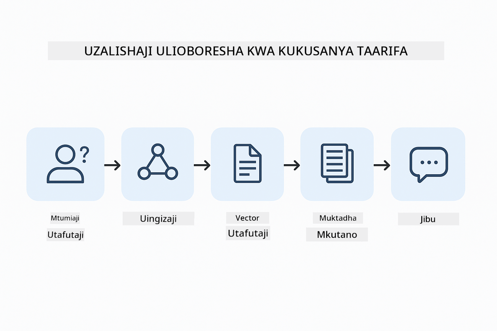
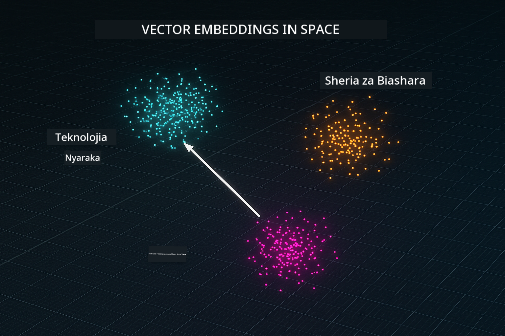
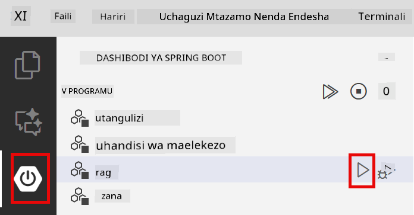
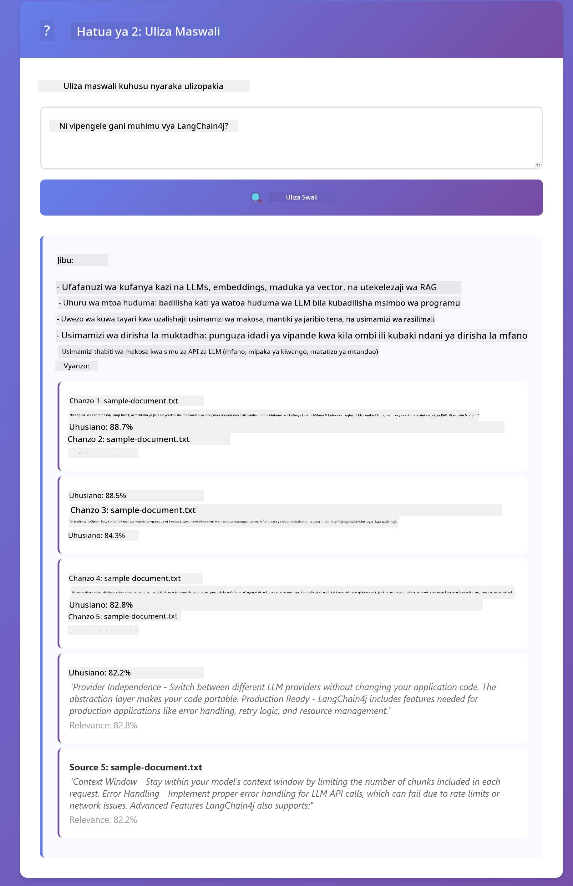

<!--
CO_OP_TRANSLATOR_METADATA:
{
  "original_hash": "f538a51cfd13147d40d84e936a0f485c",
  "translation_date": "2025-12-13T17:12:44+00:00",
  "source_file": "03-rag/README.md",
  "language_code": "sw"
}
-->
# Moduli 03: RAG (Uundaji Ulioboreshwa kwa Kupata Taarifa)

## Orodha ya Yaliyomo

- [Utajifunza Nini](../../../03-rag)
- [Mahitaji ya Awali](../../../03-rag)
- [Kuelewa RAG](../../../03-rag)
- [Inavyofanya Kazi](../../../03-rag)
  - [Usindikaji wa Hati](../../../03-rag)
  - [Kuumba Embeddings](../../../03-rag)
  - [Utafutaji wa Semantiki](../../../03-rag)
  - [Uundaji wa Majibu](../../../03-rag)
- [Endesha Programu](../../../03-rag)
- [Kutumia Programu](../../../03-rag)
  - [Pakia Hati](../../../03-rag)
  - [Uliza Maswali](../../../03-rag)
  - [Angalia Marejeleo ya Chanzo](../../../03-rag)
  - [Jaribu Maswali](../../../03-rag)
- [Mafundisho Muhimu](../../../03-rag)
  - [Mbinu ya Kugawanya Vipande](../../../03-rag)
  - [Alama za Ulinganifu](../../../03-rag)
  - [Uhifadhi wa Kumbukumbu](../../../03-rag)
  - [Usimamizi wa Dirisha la Muktadha](../../../03-rag)
- [Wakati RAG Inapohitajika](../../../03-rag)
- [Hatua Zifuatazo](../../../03-rag)

## Utajifunza Nini

Katika moduli zilizopita, ulijifunza jinsi ya kuzungumza na AI na kupanga maelekezo yako kwa ufanisi. Lakini kuna kikomo cha msingi: mifano ya lugha inajua tu kile walichojifunza wakati wa mafunzo. Haiwezi kujibu maswali kuhusu sera za kampuni yako, nyaraka za mradi wako, au taarifa yoyote ambayo hawakujifunza.

RAG (Uundaji Ulioboreshwa kwa Kupata Taarifa) hutatua tatizo hili. Badala ya kujaribu kufundisha mfano taarifa zako (ambayo ni ghali na haiwezekani), unampa uwezo wa kutafuta kupitia nyaraka zako. Wakati mtu anauliza swali, mfumo hupata taarifa zinazofaa na kuziingiza kwenye maelekezo. Kisha mfano hujibu kwa msingi wa muktadha uliopatikana.

Fikiria RAG kama kumpa mfano maktaba ya rejea. Unapouliza swali, mfumo:

1. **Swali la Mtumiaji** - Unauliza swali
2. **Embedding** - Hubadilisha swali lako kuwa vector
3. **Utafutaji wa Vector** - Hupata vipande vya hati vinavyofanana
4. **Kukusanya Muktadha** - Huongeza vipande vinavyofaa kwenye maelekezo
5. **Jibu** - LLM huunda jibu kulingana na muktadha

Hii huweka majibu ya mfano kwenye data yako halisi badala ya kutegemea maarifa ya mafunzo au kubuni majibu.



*Mtiririko wa kazi wa RAG - kutoka swali la mtumiaji hadi utafutaji wa semantiki hadi uundaji wa jibu la muktadha*

## Mahitaji ya Awali

- Kumaliza Moduli 01 (Rasilimali za Azure OpenAI zimesambazwa)
- Faili `.env` katika saraka kuu yenye vyeti vya Azure (vilivyotengenezwa na `azd up` katika Moduli 01)

> **Kumbuka:** Ikiwa hujakamilisha Moduli 01, fuata maelekezo ya usambazaji hapo kwanza.

## Inavyofanya Kazi

**Usindikaji wa Hati** - [DocumentService.java](../../../03-rag/src/main/java/com/example/langchain4j/rag/service/DocumentService.java)

Unapopakua hati, mfumo huigawanya vipande - vipande vidogo vinavyolingana vizuri na dirisha la muktadha la mfano. Vipande hivi vinaunganishwa kidogo ili usipoteze muktadha kwenye mipaka.

```java
Document document = FileSystemDocumentLoader.loadDocument("sample-document.txt");

DocumentSplitter splitter = DocumentSplitters
    .recursive(300, 30, new OpenAiTokenizer());

List<TextSegment> segments = splitter.split(document);
```

> **🤖 Jaribu na [GitHub Copilot](https://github.com/features/copilot) Chat:** Fungua [`DocumentService.java`](../../../03-rag/src/main/java/com/example/langchain4j/rag/service/DocumentService.java) na uliza:
> - "LangChain4j hugawanya hati vipande vipi na kwa nini kuunganishwa ni muhimu?"
> - "Ukubwa bora wa kipande kwa aina tofauti za hati ni upi na kwa nini?"
> - "Nashughulikiaje hati zilizo katika lugha nyingi au zenye muundo maalum?"

**Kuumba Embeddings** - [LangChainRagConfig.java](../../../03-rag/src/main/java/com/example/langchain4j/rag/config/LangChainRagConfig.java)

Kipande kila kimebadilishwa kuwa uwakilishi wa nambari unaoitwa embedding - kwa maana ni alama ya kihisabati inayoshikilia maana ya maandishi. Maandishi yanayofanana huleta embeddings zinazofanana.

```java
@Bean
public EmbeddingModel embeddingModel() {
    return OpenAiOfficialEmbeddingModel.builder()
        .baseUrl(azureOpenAiEndpoint)
        .apiKey(azureOpenAiKey)
        .modelName(azureEmbeddingDeploymentName)
        .build();
}

EmbeddingStore<TextSegment> embeddingStore = 
    new InMemoryEmbeddingStore<>();
```



*Hati zinawakilishwa kama vector katika nafasi ya embedding - maudhui yanayofanana hukusanyika pamoja*

**Utafutaji wa Semantiki** - [RagService.java](../../../03-rag/src/main/java/com/example/langchain4j/rag/service/RagService.java)

Unapouliza swali, swali lako pia hubadilishwa kuwa embedding. Mfumo unalinganisha embedding ya swali lako na embeddings za vipande vyote vya hati. Hupata vipande vyenye maana zinazofanana zaidi - si tu maneno yanayolingana, bali ulinganifu wa maana halisi.

```java
Embedding queryEmbedding = embeddingModel.embed(question).content();

List<EmbeddingMatch<TextSegment>> matches = 
    embeddingStore.findRelevant(queryEmbedding, 5, 0.7);

for (EmbeddingMatch<TextSegment> match : matches) {
    String relevantText = match.embedded().text();
    double score = match.score();
}
```

> **🤖 Jaribu na [GitHub Copilot](https://github.com/features/copilot) Chat:** Fungua [`RagService.java`](../../../03-rag/src/main/java/com/example/langchain4j/rag/service/RagService.java) na uliza:
> - "Utafutaji wa ulinganifu hufanya kazi vipi na embeddings na ni nini huamua alama?"
> - "Kiwango gani cha ulinganifu ninachopaswa kutumia na kinaathirije matokeo?"
> - "Nashughulikiaje hali ambapo hakuna hati zinazofaa kupatikana?"

**Uundaji wa Majibu** - [RagService.java](../../../03-rag/src/main/java/com/example/langchain4j/rag/service/RagService.java)

Vipande vinavyofaa zaidi huingizwa kwenye maelekezo kwa mfano. Mfano husoma vipande hivyo maalum na kujibu swali lako kulingana na taarifa hiyo. Hii huzuia uongo - mfano unaweza kujibu tu kutoka kile kilicho mbele yake.

## Endesha Programu

**Thibitisha usambazaji:**

Hakikisha faili `.env` ipo katika saraka kuu yenye vyeti vya Azure (vilivyotengenezwa wakati wa Moduli 01):
```bash
cat ../.env  # Inapaswa kuonyesha AZURE_OPENAI_ENDPOINT, API_KEY, DEPLOYMENT
```

**Anzisha programu:**

> **Kumbuka:** Ikiwa tayari umeanzisha programu zote kwa kutumia `./start-all.sh` kutoka Moduli 01, moduli hii tayari inaendeshwa kwenye bandari 8081. Unaweza kuruka amri za kuanzisha hapa chini na kwenda moja kwa moja http://localhost:8081.

**Chaguo 1: Kutumia Spring Boot Dashboard (Inapendekezwa kwa watumiaji wa VS Code)**

Kontena la maendeleo lina ugani wa Spring Boot Dashboard, unaotoa kiolesura cha kuona na kusimamia programu zote za Spring Boot. Unaweza kuipata kwenye Bar ya Shughuli upande wa kushoto wa VS Code (tazama ikoni ya Spring Boot).

Kutoka Spring Boot Dashboard, unaweza:
- Kuona programu zote za Spring Boot zinazopatikana kwenye eneo la kazi
- Anzisha/zimia programu kwa bonyeza mara moja
- Tazama kumbukumbu za programu kwa wakati halisi
- Fuata hali ya programu

Bonyeza kitufe cha kucheza kando ya "rag" kuanzisha moduli hii, au anzisha moduli zote kwa pamoja.



**Chaguo 2: Kutumia skripti za shell**

Anzisha programu zote za wavuti (moduli 01-04):

**Bash:**
```bash
cd ..  # Kutoka kwenye saraka ya mzizi
./start-all.sh
```

**PowerShell:**
```powershell
cd ..  # Kutoka kwenye saraka ya mzizi
.\start-all.ps1
```

Au anzisha moduli hii pekee:

**Bash:**
```bash
cd 03-rag
./start.sh
```

**PowerShell:**
```powershell
cd 03-rag
.\start.ps1
```

Skripti zote huchukua moja kwa moja mabadiliko ya mazingira kutoka faili `.env` ya saraka kuu na zitajenga JARs ikiwa hazipo.

> **Kumbuka:** Ikiwa unapendelea kujenga moduli zote kwa mkono kabla ya kuanzisha:
>
> **Bash:**
> ```bash
> cd ..  # Go to root directory
> mvn clean package -DskipTests
> ```
>
> **PowerShell:**
> ```powershell
> cd ..  # Go to root directory
> mvn clean package -DskipTests
> ```

Fungua http://localhost:8081 kwenye kivinjari chako.

**Kusitisha:**

**Bash:**
```bash
./stop.sh  # Hii moduli tu
# Au
cd .. && ./stop-all.sh  # Moduli zote
```

**PowerShell:**
```powershell
.\stop.ps1  # Hii moduli tu
# Au
cd ..; .\stop-all.ps1  # Moduli zote
```

## Kutumia Programu

Programu hutoa kiolesura cha wavuti kwa ajili ya kupakia hati na kuuliza maswali.

<a href="images/rag-homepage.png"></a>

*Kiolesura cha programu ya RAG - pakia hati na uliza maswali*

**Pakia Hati**

Anza kwa kupakia hati - faili za TXT zinafanya kazi vizuri kwa majaribio. Faili `sample-document.txt` ipo katika saraka hii yenye taarifa kuhusu sifa za LangChain4j, utekelezaji wa RAG, na mbinu bora - kamili kwa kujaribu mfumo.

Mfumo husindika hati yako, hugawanya vipande, na kuunda embeddings kwa kila kipande. Hii hufanyika moja kwa moja unapo pakia.

**Uliza Maswali**

Sasa uliza maswali maalum kuhusu maudhui ya hati. Jaribu kitu cha ukweli kilicho wazi katika hati. Mfumo hufanya utafutaji wa vipande vinavyofaa, huviingiza kwenye maelekezo, na huunda jibu.

**Angalia Marejeleo ya Chanzo**

Angalia kila jibu lina marejeleo ya chanzo na alama za ulinganifu. Alama hizi (0 hadi 1) zinaonyesha jinsi kipande kilivyohusiana na swali lako. Alama za juu zina maana ya mlingano bora. Hii inakuwezesha kuthibitisha jibu dhidi ya nyaraka za chanzo.

<a href="images/rag-query-results.png"></a>

*Matokeo ya swali yakionyesha jibu na marejeleo ya chanzo na alama za ulinganifu*

**Jaribu Maswali**

Jaribu aina tofauti za maswali:
- Ukweli maalum: "Mada kuu ni ipi?"
- Mlinganiko: "Tofauti kati ya X na Y ni nini?"
- Muhtasari: "Fupisha hoja kuu kuhusu Z"

Tazama jinsi alama za ulinganifu zinavyobadilika kulingana na jinsi swali lako linavyolingana na maudhui ya hati.

## Mafundisho Muhimu

**Mbinu ya Kugawanya Vipande**

Hati hugawanywa vipande vya tokeni 300 na tokeni 30 za kuunganishwa. Mchanganyiko huu huhakikisha kila kipande kina muktadha wa kutosha kuwa na maana huku kikibaki kidogo ili kuwezesha vipande vingi kuingizwa kwenye maelekezo.

**Alama za Ulinganifu**

Alama zinaanzia 0 hadi 1:
- 0.7-1.0: Zinahusiana sana, mlingano kamili
- 0.5-0.7: Zinahusiana, muktadha mzuri
- Chini ya 0.5: Zimetengwa, hazifani

Mfumo hupata tu vipande vilivyo juu ya kiwango cha chini kuhakikisha ubora.

**Uhifadhi wa Kumbukumbu**

Moduli hii inatumia uhifadhi wa kumbukumbu kwa urahisi. Unapozima na kuanzisha tena programu, nyaraka zilizopakuliwa hupotea. Mifumo ya uzalishaji hutumia hifadhidata za vector za kudumu kama Qdrant au Azure AI Search.

**Usimamizi wa Dirisha la Muktadha**

Kila mfano una dirisha la muktadha lenye ukubwa wa juu kabisa. Huwezi kujumuisha kila kipande kutoka kwa hati kubwa. Mfumo hupata vipande N vinavyohusiana zaidi (kawaida 5) ili kubaki ndani ya mipaka huku ukitoa muktadha wa kutosha kwa majibu sahihi.

## Wakati RAG Inapohitajika

**Tumia RAG wakati:**
- Kujibu maswali kuhusu nyaraka za kampuni
- Taarifa hubadilika mara kwa mara (sera, bei, vipimo)
- Usahihi unahitaji marejeleo ya chanzo
- Maudhui ni makubwa mno kuingizwa moja kwa moja kwenye maelekezo
- Unahitaji majibu yanayothibitishwa na yenye msingi

**Usitumie RAG wakati:**
- Maswali yanahitaji maarifa ya jumla ambayo mfano tayari ana
- Taarifa za wakati halisi zinahitajika (RAG hufanya kazi kwa nyaraka zilizopakuliwa)
- Maudhui ni madogo ya kutosha kuingizwa moja kwa moja kwenye maelekezo

## Hatua Zifuatazo

**Moduli Ifuatayo:** [04-tools - Wakala wa AI na Zana](../04-tools/README.md)

---

**Uelekeo:** [← Iliyopita: Moduli 02 - Uhandisi wa Maelekezo](../02-prompt-engineering/README.md) | [Rudi Kwenye Kuu](../README.md) | [Ifuatayo: Moduli 04 - Zana →](../04-tools/README.md)

---

<!-- CO-OP TRANSLATOR DISCLAIMER START -->
**Kiarifa cha Kukataa**:
Hati hii imetafsiriwa kwa kutumia huduma ya tafsiri ya AI [Co-op Translator](https://github.com/Azure/co-op-translator). Ingawa tunajitahidi kwa usahihi, tafadhali fahamu kwamba tafsiri za kiotomatiki zinaweza kuwa na makosa au upungufu wa usahihi. Hati ya asili katika lugha yake ya asili inapaswa kuchukuliwa kama chanzo cha mamlaka. Kwa taarifa muhimu, tafsiri ya kitaalamu ya binadamu inapendekezwa. Hatubebei dhamana kwa kutoelewana au tafsiri potofu zinazotokana na matumizi ya tafsiri hii.
<!-- CO-OP TRANSLATOR DISCLAIMER END -->