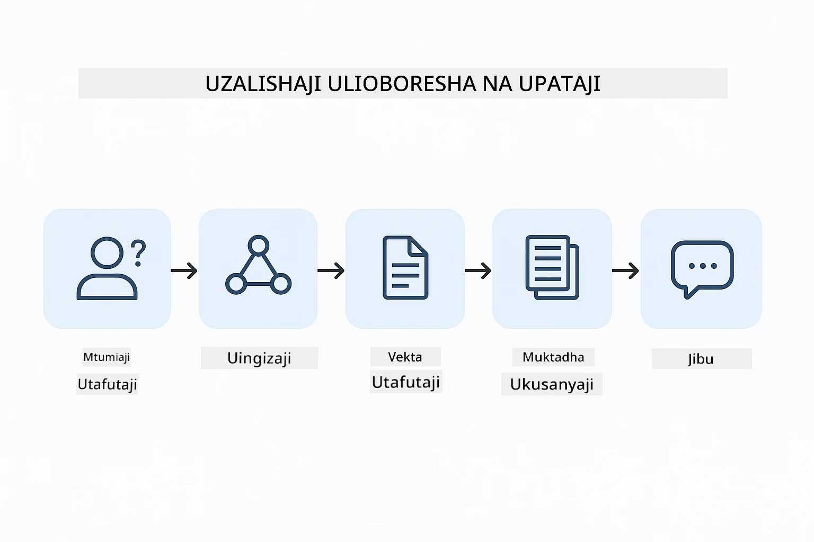
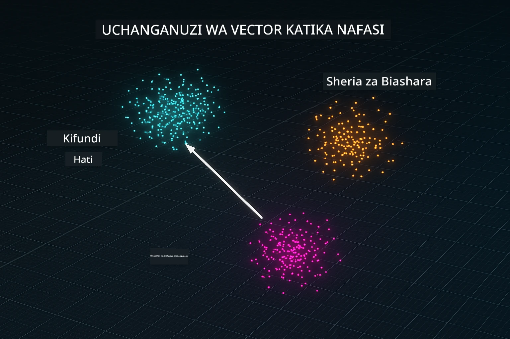
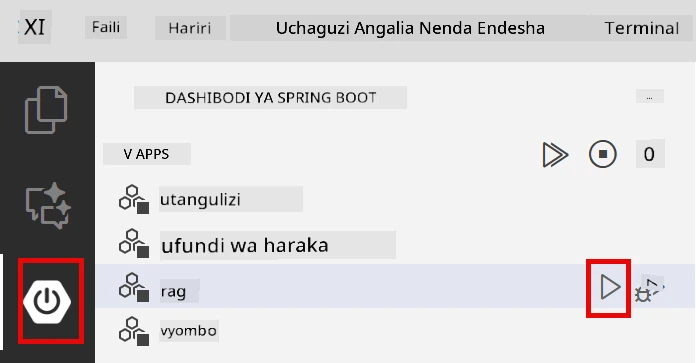
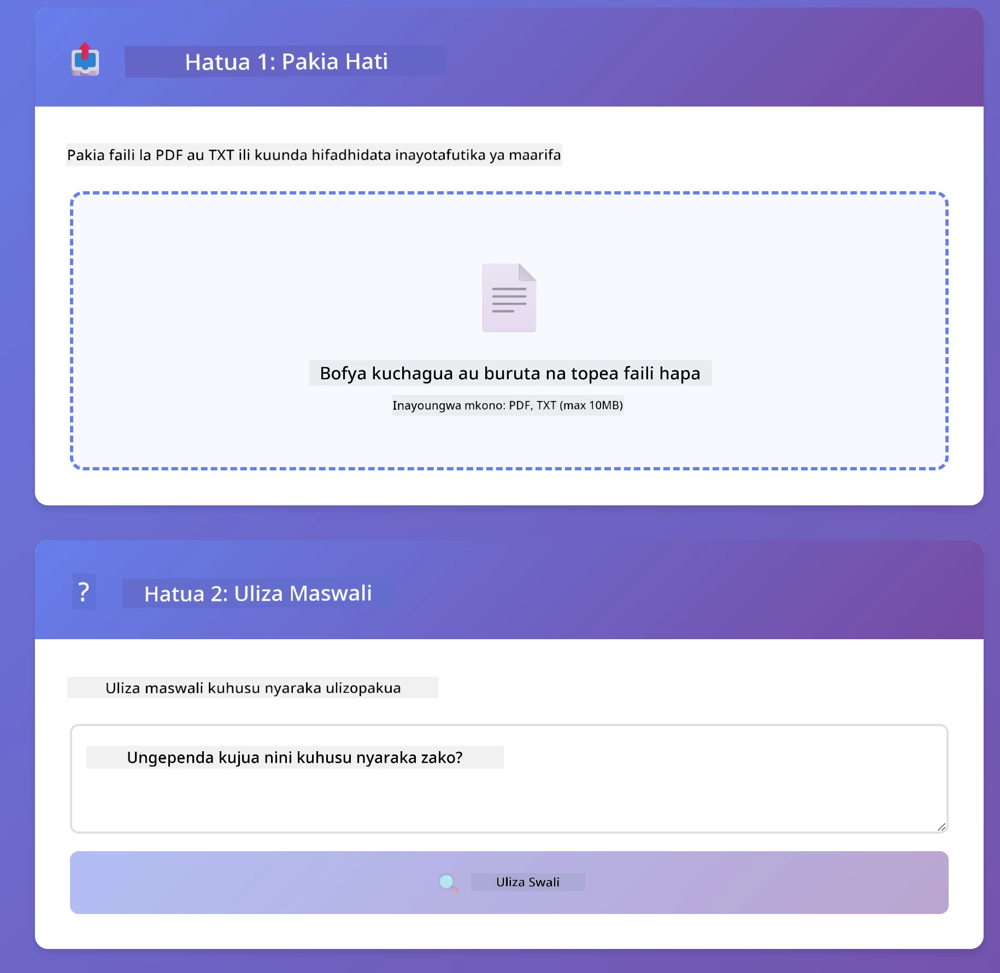

# Moduli 03: RAG (Uundaji Ulioongezwa kwa Urejeshaji)

## Jedwali la Maudhui

- [Maelezo ya Video](#maelezo-ya-video)
- [Utajifunza Nini](#utajifunza-nini)
- [Mambo ya Kuwa Nayo Kabla](#mambo-ya-kuwa-nayo-kabla)
- [Kuelewa RAG](#kuelewa-rag)
  - [Ni Mbinu Gani ya RAG Inayotumika Katika Mafunzo Haya?](#ni-mbinu-gani-ya-rag-inayotumika-katika-mafunzo-haya)
- [Jinsi Inavyofanya Kazi](#jinsi-inavyofanya-kazi)
  - [Usindikaji wa Hati](#usindikaji-wa-hati)
  - [Kuunda Embeddings](#kuunda-embeddings)
  - [Utafutaji wa Kimaana](#utafutaji-wa-kimaana)
  - [Kutengeneza Majibu](#uundaji-wa-majibu)
- [Endesha Programu](#endesha-programu)
- [Kutumia Programu](#kutumia-programu)
  - [Pakua Hati](#pakia-hati)
  - [Uliza Maswali](#uliza-maswali)
  - [Angalia Marejeleo ya Vyanzo](#angalia-marejeleo-ya-chanzo)
  - [Jaribu Maswali](#jaribu-maswali-tofauti)
- [Mafundisho Muhimu](#dhahabu-muhimu)
  - [Mbinu ya Kugawanya Vipande](#mkakati-wa-kugawanya-vigawanyo)
  - [Alama za Ulinganifu](#alama-za-ulinganifu)
  - [Uhifadhi wa Kumbukumbu Ndani ya Kumbukumbu](#uhifadhi-wa-kumbukumbu-ndani)
  - [Usimamizi wa Dirisha la Muktadha](#usimamizi-wa-dirisha-la-muktadha)
- [Wakati RAG Ina Maanisha](#wakati-rag-inafaa)
- [Hatua Zinazo Fuata](#hatua-zifuatazo)

## Maelezo ya Video

Tazama kikao hiki cha moja kwa moja kinachoeleza jinsi ya kuanza na moduli hii:

<a href="https://www.youtube.com/watch?v=_olq75ZH_eY"></a>

## Utajifunza Nini

Katika moduli zilizopita, ulijifunza jinsi ya kuzungumza na AI na kupanga maelekezo yako kwa ufanisi. Lakini kuna kikomo cha msingi: modeli za lugha zinajua tu kile walichojifunza wakati wa mafunzo. Haziwezi kujibu maswali kuhusu sera za kampuni yako, nyaraka za mradi wako, au taarifa yoyote ambayo hazikufundishwa.

RAG (Uundaji Ulioongezwa kwa Urejeshaji) hutatua tatizo hili. Badala ya kujaribu kufundisha modeli habari zako (ambayo ni ghali na haiwezekani), unaiwezesha kutafuta kupitia hati zako. Mtu anapouliza swali, mfumo hupata taarifa zinazohusiana na kuziacha kwenye maelekezo. Kisha modeli hujibu kwa msingi wa muktadha uliopatikana.

Fikiria RAG kama kumpa modeli maktaba ya rejeleo. Unapouliza swali, mfumo:

1. **Swali la Mtumiaji** - Unauliza swali  
2. **Embedding** - Hubadilisha swali lako kuwa vector  
3. **Utafutaji wa Vector** - Hupata vipande vya hati vinavyofanana  
4. **Ukusanyaji wa Muktadha** - Huongeza vipande vinavyolingana kwenye maelekezo  
5. **Jibu** - LLM hutengeneza jibu kwa msingi wa muktadha  

Hii hufanya majibu ya modeli kutegemea data yako halisi badala ya kutegemea maarifa ya mafunzo au kubuni majibu.

## Mambo ya Kuwa Nayo Kabla

- Umemaliza [Moduli 01 - Utangulizi](../01-introduction/README.md) (rasilimali za Azure OpenAI zimewekwa, pamoja na modeli ya `text-embedding-3-small`)  
- Faili la `.env` liko kwenye saraka kuu likiwa na cheti za Azure (limeundwa na `azd up` katika Moduli 01)  

> **Kumbuka:** Ikiwa bado hujamaliza Moduli 01, fuata maelekezo ya uanzishaji hapo kwanza. Amri ya `azd up` huweka modeli za mazungumzo za GPT na modeli ya embedding inayotumika katika moduli hii.

## Kuelewa RAG

Mchoro huu chini unaelezea dhana kuu: badala ya kutegemea data ya mafunzo ya modeli peke yake, RAG inaiwezesha kupata maktaba ya rejeleo ya hati zako kabla ya kutengeneza jibu kila mara.


*Mchoro huu unaonyesha tofauti kati ya LLM ya kawaida (inayokisia kutoka data ya mafunzo) na LLM iliyoimarishwa na RAG (inayekagua hati zako kwanza).*

Hapa ni jinsi sehemu zinavyounganishwa mwisho kwa mwisho. Swali la mtumiaji linapitia hatua nne — embedding, utafutaji wa vector, ukusanyaji wa muktadha, na utengenezaji wa jibu — kila moja ikijengwa juu ya ile iliyotangulia:



*Mchoro huu unaonyesha mfumo wa RAG kuanzia mwanzo hadi mwisho — swali la mtumiaji linapitia embedding, utafutaji wa vector, ukusanyaji wa muktadha, na utengenezaji wa jibu.*

Sehemu zilizobaki za moduli hii hutembea kwa kila hatua kwa undani, pamoja na msimbo unaoweza kuendesha na kuubadilisha.

### Ni Mbinu Gani ya RAG Inayotumika Katika Mafunzo Haya?

LangChain4j hutoa njia tatu za kutekeleza RAG, kila moja ikiwa na kiwango tofauti cha abstraction. Mchoro huu hapa chini unazilinganisha pembeni kwa pembeni:


*Mchoro huu unalinganisha njia tatu za RAG za LangChain4j — Rahisi, Asili, na Yaliyokithiri — ukiwaonyesha vipengele muhimu na wakati wa kutumia kila moja.*

| Njia | Kifuniko | Mabadiliko |
|---|---|---|
| **Rahisi RAG** | Huunganisha kila kitu moja kwa moja kupitia `AiServices` na `ContentRetriever`. Unatia alama kiolesura, unafunga retriever, na LangChain4j hushughulikia embedding, utafutaji, na ukusanyaji wa maelekezo nyuma ya pazia. | Msimbo mdogo, lakini huoni kinachotokea kila hatua. |
| **Asili RAG** | Unaita modeli ya embedding, kutafuta hazina, kujenga maelekezo, na kutengeneza jibu mwenyewe — hatua moja kwa moja kila wakati. | Msimbo mwingi, lakini kila hatua inaonekana na inaweza kubadilika. |
| **Yaliyokithiri RAG** | Inatumia mfumo wa `RetrievalAugmentor` wenye weka query transformers, routers, re-rankers, na wapachaji wa maudhui kwa mifumo ya ngazi ya uzalishaji. | Ubadilikaji mkubwa, lakini ugumu mkubwa. |

**Mafunzo haya yanatumia Njia ya Asili.** Kila hatua ya mfumo wa RAG — kuweka query kwenye embedding, kutafuta hazina ya vector, kukusanya muktadha, na kutengeneza jibu — imeandikwa wazi katika [`RagService.java`](../../../03-rag/src/main/java/com/example/langchain4j/rag/service/RagService.java). Hii ni kwa makusudi: kama rasilimali ya kujifunza, ni muhimu zaidi kuona na kuelewa kila hatua kuliko kupunguza msimbo. Mara ukijua jinsi vipande vinavyoungana, unaweza kusonga hadi Rahisi RAG kwa prototypes haraka au Yaliyokithiri RAG kwa mifumo halisi.

> **💡 Unataka kujua zaidi kuhusu Rahisi RAG?** LangChain4j pia hutoa njia ya *Rahisi RAG* ambapo `AiServices` na `ContentRetriever` hushughulikia embedding, utafutaji, na ukusanyaji wa maelekezo moja kwa moja. Moduli hii inafuata njia wazi zaidi — kufungua mfumo huu ili uone na kudhibiti kila hatua wewe mwenyewe.

Mchoro huu chini unaonyesha mfumo wa Rahisi RAG. Angalia jinsi `AiServices` na `EmbeddingStoreContentRetriever` vinavyoficha ugumu wote — unapakia hati, unafunga retriever, na kupokea majibu. Njia ya Asili katika moduli hii huvunja hatua zote zilizofichwa:


*Mchoro huu unaonyesha mfumo wa Rahisi RAG. Linganisha na Njia ya Asili inayotumika katika moduli hii: Rahisi RAG inaficha embedding, urejeshaji, na ukusanyaji wa maelekezo nyuma ya `AiServices` na `ContentRetriever` — unapakia hati, unaweka retriever, na kupata majibu. Njia ya Asili katika moduli hii huvunja mfumo huu kwa wito moja kwa moja wa kila hatua (embedding, kutafuta, kukusanya muktadha, kutengeneza) kwa udhibiti kamili.*

## Jinsi Inavyofanya Kazi

Mfumo wa RAG moduli hii unagawanywa katika hatua nne zinazofanyika mfululizo kila mtu anapouliza swali. Kwanza, hati iliyopakuliwa **huchambuliwa na kugawanywa** vipande vidogo vinavyoweza kudhibitiwa. Vipande hivyo hubadilishwa kuwa **embedding za vector** na kuhifadhiwa ili ziweze kulinganishwa kwa kihisabati. Mtu anapouliza, mfumo hufanya **utafutaji wa kimaana** kupata vipande vinavyofaa, na mwishowe huvifanyia kazi kama muktadha kwa LLM kwa ajili ya **kutengeneza jibu**. Sehemu zilizofuata zinaonyesha kila hatua kwa msimbo halisi na michoro. Tuchunguze hatua ya kwanza.

### Usindikaji wa Hati

[DocumentService.java](../../../03-rag/src/main/java/com/example/langchain4j/rag/service/DocumentService.java)

Unapopakua hati, mfumo huichambua (PDF au maandishi ya kawaida), huambatanisha metadata kama jina la faili, kisha hugawanya hati vipande — vipande vidogo vinavyofaa katika dirisha la muktadha la modeli. Vipande hivi vinagusana kidogo kuhakikisha huwezi kupoteza muktadha kwenye mipaka.

```java
// Tafsiri faili lililopakiwa na lifunge katika Hati ya LangChain4j
Document document = Document.from(content, metadata);

// Gawanya katika vipande vya tokeni 300 na mduara wa tokeni 30
DocumentSplitter splitter = DocumentSplitters
    .recursive(300, 30);

List<TextSegment> segments = splitter.split(document);
```
  
Mchoro huu unaonyesha jinsi inavyofanya kazi kimaono. Angalia jinsi kila kipande kinashiriki tokeni kadhaa na majirani zake — mgusano wa tokeni 30 huhakikisha hakuna muktadha muhimu unaopotea kati ya vipande:


*Mchoro huu unaonyesha hati ikigawanywa vipande vya tokeni 300 na mgusano wa tokeni 30, kudumisha muktadha kwenye mipaka ya vipande.*

> **🤖 Jaribu na [GitHub Copilot](https://github.com/features/copilot) Chat:** Fungua [`DocumentService.java`](../../../03-rag/src/main/java/com/example/langchain4j/rag/service/DocumentService.java) na uulize:  
> - "LangChain4j hugawanya hati vipande vipi na kwa nini mgusano ni muhimu?"  
> - "Ni ukubwa gani wa kipande kilichopendekezwa kwa aina tofauti za hati na kwa nini?"  
> - "Namshughulikiaje hati katika lugha nyingi au zilizo na muundo maalum?"

### Kuunda Embeddings

[LangChainRagConfig.java](../../../03-rag/src/main/java/com/example/langchain4j/rag/config/LangChainRagConfig.java)

Kipande kila kimebadilishwa kuwa uwasilishaji wa nambari unaoitwa embedding — kwa kiasi fulani mabadiliko ya maana kuwa nambari. Modeli ya embedding sio "mwerevu" kama modeli ya mazungumzo; haifuati maelekezo, haifikirii, wala haijibu maswali. Kinachoweza kufanya ni kuweka maandishi katika sehemu ya kihisabati ambapo maana zinazofanana hujipanga karibu — kama "gari" karibu na "magari," "sera ya kurejesha" karibu na "rejesha fedha." Fikiria modeli ya mazungumzo kama mtu unayezungumza naye; modeli ya embedding ni mfumo mzuri sana wa kuhifadhi taarifa.

Mchoro huu unaonyesha dhana — maandishi huingia, vector za nambari hutoka, na maana zinazofanana huleta vector karibu:


*Mchoro huu unaonyesha jinsi modeli ya embedding hubadilisha maandishi kuwa vector za nambari, kuweka maana zinazofanana — kama "gari" na "magari" — karibu katika nafasi ya vector.*

```java
@Bean
public EmbeddingModel embeddingModel() {
    return OpenAiOfficialEmbeddingModel.builder()
        .baseUrl(azureOpenAiEndpoint)
        .apiKey(azureOpenAiKey)
        .modelName(azureEmbeddingDeploymentName)
        .build();
}

EmbeddingStore<TextSegment> embeddingStore = 
    new InMemoryEmbeddingStore<>();
```
  
Mchoro wa darasa huu unaonyesha mwelekeo miwili tofauti katika mfumo wa RAG na madarasa ya LangChain4j yanayoyatekeleza. **Mwelekeo wa kuingiza** (hufanyika mara moja wakati wa upakiaji) hugawanya hati, huingiza vipande kwenye embedding, na kuhifadhi kupitia `.addAll()`. **Mwelekeo wa swali** (hufanyika kila mtumiaji anapouliza) huingiza swali kwenye embedding, kutafuta hazina kwa `.search()`, na kupitisha muktadha unaolingana kwa modeli ya mazungumzo. Mwelekeo yote hukutana kwenye kiolesura cha pamoja `EmbeddingStore<TextSegment>`:


*Mchoro huu unaonyesha mwelekeo miwili katika mfumo wa RAG — kuingiza na swali — na jinsi unavyounganishwa kupitia EmbeddingStore.*

Mara embeddings zinapohifadhiwa, maudhui yanayofanana huwa karibu kwenye nafasi ya vector. Visualize ifuatayo inaonyesha jinsi hati za mada zinazohusiana hujipanga kama pointi karibu, jambo linalofanya utafutaji wa kimaana uwezekane:



*Visualize hii inaonyesha jinsi hati zinazohusiana hujipanga pamoja katika nafasi ya vector 3D, kwa mada kama Hati za Kiufundi, Sheria za Biashara, na Maswali Yanayoulizwa Mara kwa Mara (FAQ) kuunda makundi tofauti.*

Mtumiaji anapofanya utafutaji, mfumo hufuata hatua nne: kuingiza hati mara moja, kuingiza swali kila utafutaji, kulinganisha vector ya swali dhidi ya vector zote zilizohifadhiwa kwa kutumia cosine similarity, na kurudisha vipande-K vinavyopata alama za juu. Mchoro huu unaelezea kila hatua na madarasa ya LangChain4j yanayohusika:


*Mchoro huu unaonesha mchakato wa hatua nne wa utafutaji wa embedding: kuingiza hati, kuingiza swali, kulinganisha vector kwa cosine similarity, na kurudisha matokeo ya juu-K.*

### Utafutaji wa Kimaana

[RagService.java](../../../03-rag/src/main/java/com/example/langchain4j/rag/service/RagService.java)

Unapouliza swali, swali lako pia hubadilishwa kuwa embedding. Mfumo hulilinganisha embedding ya swali lako dhidi ya embeddings za vipande vyote vya hati. Hupata vipande vinavyofanana zaidi maana — si tu maneno yanayolingana, bali ulinganifu wa maana halisi.

```java
Embedding queryEmbedding = embeddingModel.embed(question).content();

EmbeddingSearchRequest searchRequest = EmbeddingSearchRequest.builder()
    .queryEmbedding(queryEmbedding)
    .maxResults(5)
    .minScore(0.5)
    .build();

EmbeddingSearchResult<TextSegment> searchResult = embeddingStore.search(searchRequest);
List<EmbeddingMatch<TextSegment>> matches = searchResult.matches();

for (EmbeddingMatch<TextSegment> match : matches) {
    String relevantText = match.embedded().text();
    double score = match.score();
}
```
  
Mchoro huu unaonyesha tofauti ya utafutaji wa kimaana na utafutaji wa kawaida wa maneno muhimu (keywords). Utafutaji wa maneno "gari" hupoteza kipande kuhusu "magari na malori," lakini utafutaji wa kimaana unaelewa maana zao ni sawa na kurudisha kipande hicho kama jibu lenye alama za juu:


*Mchoro huu unaonyesha utafutaji wa maneno ukilinganisha na utafutaji wa kimaana, unaonesha jinsi utafutaji wa kimaana unavyorudisha maudhui yanayohusiana kifikra hata maneno halisi yakibadilika.*

Sehemu za ndani, ulinganifu unakokotolewa kwa kutumia cosine similarity — kwa kiasi fulani kuuliza "je, vipeo hivi viwili vinaelekea katika mwelekeo mmoja?" Vipande viwili vinaweza kutumia maneno kabisa tofauti, lakini kama maana ni ile ile vector zao zinaelekea njia kama moja na kupata alama karibu na 1.0:


*Michoro hii inaonyesha ulinganifu wa cosine kama pembe kati ya vekta za uingizaji — vekta zinazolingana zaidi hupata alama karibu na 1.0, zikionyesha ulinganifu mkubwa wa semantiki.*

> **🤖 Jaribu na [GitHub Copilot](https://github.com/features/copilot) Chat:** Fungua [`RagService.java`](../../../03-rag/src/main/java/com/example/langchain4j/rag/service/RagService.java) na uliza:
> - "Utafutaji wa ulinganifu hufanya kazi vipi na uingizaji na nini huamua alama?"
> - "Kiwango gani cha ulinganifu nifanye na huathirije matokeo?"
> - "Nashughulikiaje hali ambapo hakuna hati zinazofaa zilizopatikana?"

### Uundaji wa Majibu

[RagService.java](../../../03-rag/src/main/java/com/example/langchain4j/rag/service/RagService.java)

Vigawanyo muhimu zaidi huunganishwa kuwa ingizo lililo na muundo linalojumuisha maelekezo wazi, muktadha uliopatikana, na swali la mtumiaji. Mfano husoma vigawanyo hivyo maalum na kujibu kwa msingi wa taarifa hizo — unaweza tu kutumia kile kilicho mbele yake, ambacho kinazuia ubunifu usio wa kweli.

```java
String context = matches.stream()
    .map(match -> match.embedded().text())
    .collect(Collectors.joining("\n\n"));

String prompt = String.format("""
    Answer the question based on the following context.
    If the answer cannot be found in the context, say so.

    Context:
    %s

    Question: %s

    Answer:""", context, request.question());

String answer = chatModel.chat(prompt);
```

Michoro hapa chini inaonyesha mchakato huu ukiwa kazi — vigawanyo vina alama ya juu kutoka hatua ya utafutaji vinaingizwa kwenye kiolezo cha ingizo, na `OpenAiOfficialChatModel` hutengeneza jibu lililo na msingi:


*Michoro hii inaonyesha jinsi vigawanyo vya alama za juu vinavyounganishwa kuwa ingizo lenye muundo, likiruhusu mfano kutoa jibu lililo na msingi kutoka kwa data yako.*

## Endesha Programu

**Thibitisha usanifu:**

Hakikisha faili `.env` ipo kwenye saraka kuu ikiwa na leseni za Azure (zilizoanzishwa wakati wa Moduli 01). Endesha hii kutoka kwenye saraka ya moduli (`03-rag/`):

**Bash:**
```bash
cat ../.env  # Inapaswa kuonyesha AZURE_OPENAI_ENDPOINT, API_KEY, DEPLOYMENT
```

**PowerShell:**
```powershell
Get-Content ..\.env  # Inapaswa kuonyesha AZURE_OPENAI_ENDPOINT, API_KEY, DEPLOYMENT
```

**Anzisha programu:**

> **Kumbuka:** Ikiwa tayari umeanzisha programu zote kwa kutumia `./start-all.sh` kutoka saraka kuu (kama ilivyoelezwa katika Moduli 01), moduli hii tayari inafanya kazi kwa bandari 8081. Unaweza kuruka amri za kuanzisha hapa chini na kwenda moja kwa moja http://localhost:8081.

**Chaguo 1: Kutumia Spring Boot Dashboard (Inapendekezwa kwa watumiaji wa VS Code)**

Kontena la maendeleo linajumuisha ugani wa Spring Boot Dashboard, unaotoa interface ya kuona kwa kusimamia programu zote za Spring Boot. Unaweza kulikuta kwenye Barua ya Shughuli upande wa kushoto wa VS Code (tazama ikoni ya Spring Boot).

Kutoka kwenye Spring Boot Dashboard, unaweza:
- Kuona programu zote za Spring Boot zilizopo katika sehemu ya kazi
- Anza/acha programu kwa bonyeza moja
- Tazama kumbukumbu za programu kwa wakati halisi
- Fuatilia hali ya programu

Bonyeza kitufe cha kuanza kando ya "rag" kuanzisha moduli hii, au anza moduli zote mara moja.



*Picha hii inaonyesha Spring Boot Dashboard katika VS Code, ambapo unaweza kuanzisha, kuacha, na kufuatilia programu kwa njia ya kuona.*

**Chaguo 2: Kutumia mifumo ya shell**

Anzisha programu zote za wavuti (moduli 01-04):

**Bash:**
```bash
cd ..  # Kutoka kwenye saraka msingi
./start-all.sh
```

**PowerShell:**
```powershell
cd ..  # Kutoka kwa saraka ya mizizi
.\start-all.ps1
```

Au anza moduli hii tu:

**Bash:**
```bash
cd 03-rag
./start.sh
```

**PowerShell:**
```powershell
cd 03-rag
.\start.ps1
```

Skripti zote huzidisha kwa moja mabadiliko ya mazingira kutoka kwenye faili `.env` ya saraka kuu na zitaandika JAR ikiwa hazipo.

> **Kumbuka:** Ikiwa unapendelea kujenga moduli zote kwa mkono kabla ya kuanzisha:
>
> **Bash:**
> ```bash
> cd ..  # Go to root directory
> mvn clean package -DskipTests
> ```

> **PowerShell:**
> ```powershell
> cd ..  # Go to root directory
> mvn clean package -DskipTests
> ```

Fungua http://localhost:8081 katika kivinjari chako.

**Kusitisha:**

**Bash:**
```bash
./stop.sh  # Huu moduli tu
# Au
cd .. && ./stop-all.sh  # Moduli zote
```

**PowerShell:**
```powershell
.\stop.ps1  # Hii moduli tu
# Au
cd ..; .\stop-all.ps1  # Moduli zote
```

## Kutumia Programu

Programu hutoa interface ya wavuti kwa ajili ya kupakia hati na kuuliza maswali.

<a href="images/rag-homepage.png"></a>

*Picha hii inaonyesha interface ya programu ya RAG ambapo unapakia hati na kuuliza maswali.*

### Pakia Hati

Anza kwa kupakia hati - faili za TXT ndizo bora za majaribio. Faili `sample-document.txt` ipo katika saraka hii ikiwa na taarifa kuhusu vipengele vya LangChain4j, utekelezaji wa RAG, na mbinu bora - bora kwa kujaribu mfumo.

Mfumo huchakata hati yako, hugawanya kuwa vigawanyo, na hutengeneza uingizaji kwa kila kipande. Hii hufanyika moja kwa moja unapopakua.

### Uliza Maswali

Sasa uliza maswali maalum kuhusu maudhui ya hati. Jaribu kitu cha kweli ambacho kimeelezwa wazi katika hati. Mfumo unatafuta vigawanyo vinavyofaa, vina jumuishwa katika ingizo, na hutengeneza jibu.

### Angalia Marejeleo ya Chanzo

Angalia kila jibu linajumuisha marejeleo ya chanzo pamoja na alama za ulinganifu. Alama hizi (0 hadi 1) zinaonyesha jinsi kila kipande kilivyohusiana na swali lako. Alama za juu zinamaanisha mechi bora. Hii inakuwezesha kuthibitisha jibu dhidi ya nyaraka za chanzo.

<a href="images/rag-query-results.png"></a>

*Picha hii inaonyesha matokeo ya maswali pamoja na jibu lililotengenezwa, marejeleo ya chanzo, na alama za uhusiano kwa kila kipande kilichopatikana.*

### Jaribu Maswali Tofauti

Jaribu aina tofauti za maswali:
- Ukweli maalum: "Mada kuu ni nini?"
- Mlinganisho: "Je, tofauti kati ya X na Y ni ipi?"
- Muhtasari: "Fupisha mambo muhimu kuhusu Z"

Tazama jinsi alama za uhusiano zinavyobadilika kulingana na jinsi swali lako linavyolingana na maudhui ya hati.

## Dhahabu Muhimu

### Mkakati wa Kugawanya Vigawanyo

Nyaraka hugawanywa kuwa vigawanyo vya tokeni 300 na tokeni 30 za mkusanyiko. Uwiano huu huhakikisha kila kipande kina muktadha wa kutosha kuwa na maana wakati pia kikibaki kidogo vya kutosha kuweza kujumuisha vigawanyo vingi katika ingizo.

### Alama za Ulinganifu

Kila kipande kilichopatikana kina alama ya ulinganifu kati ya 0 na 1 inayoonyesha jinsi kinavyolingana na swali la mtumiaji. Michoro hapa chini inaonyesha viwango vya alama na jinsi mfumo unavyovitumia kuchuja matokeo:


*Michoro hii inaonyesha viwango vya alama kutoka 0 hadi 1, pamoja na kiwango cha chini cha 0.5 kinachochuja vigawanyo visivyo husika.*

Alama zinatoka 0 hadi 1:
- 0.7-1.0: Muhimu sana, mechi halisi
- 0.5-0.7: Muhimu, muktadha mzuri
- Chini ya 0.5: Inachujwa, haitofautiani vizuri

Mfumo unachukua tu vigawanyo vilivyo juu ya kiwango cha chini kuhakikisha ubora.

Uingizaji hufanya kazi vizuri wakati maana inajitokeza waziwazi, lakini kuna maeneo yanayopotea. Michoro hapa chini inaonyesha aina za makosa ya kawaida — vigawanyo vikubwa sana hutoa vekta zisizo wazi, vigawanyo vidogo sana vinakosa muktadha, maneno yenye double maana huashiria makundi mengi, na utafutaji wa mechi halisi (IDs, nambari za sehemu) hauendani kabisa na uingizaji:


*Michoro hii inaonyesha aina za kawaida za makosa ya uingizaji: vigawanyo vikubwa sana, vidogo sana, maneno yenye mashaka yanayohusu makundi mengi, na utafutaji wa mechi halisi kama IDs.*

### Uhifadhi wa Kumbukumbu Ndani

Moduli hii hutumia uhifadhi wa kumbukumbu ndani kwa urahisi. Unapozima programu, nyaraka zilizopakiwa hupotea. Mifumo ya uzalishaji hutumia hifadhidata za vekta zinazodumu kama Qdrant au Azure AI Search.

### Usimamizi wa Dirisha la Muktadha

Kila mfano una ukubwa wa juu wa dirisha la muktadha. Huwezi kujumuisha kila kipande kutoka kwa hati ndefu. Mfumo unachukua vigawanyo muhimu N (chaguo-msingi 5) ili kubaki ndani ya mipaka huku ukitoa muktadha wa kutosha kwa majibu sahihi.

## Wakati RAG Inafaa

RAG sio njia sahihi kila wakati. Mwongozo wa maamuzi hapa chini unakusaidia kujua wakati RAG huongeza thamani dhidi ya njia rahisi — kama kujumuisha maudhui moja kwa moja katika ingizo au kutegemea maarifa yaliyojengewa ndani ya mfano — ni za kutosha:


*Michoro hii inaonyesha mwongozo wa maamuzi wakati RAG huongeza thamani dhidi ya njia rahisi zilizotosheleza.*

## Hatua Zifuatazo

**Moduli Ifuatayo:** [04-tools - AI Agents with Tools](../04-tools/README.md)

---

**Unavyo:** [← Iliyopita: Moduli 02 - Ufundi wa Ingizo](../02-prompt-engineering/README.md) | [Rudi Kwenye Msingi](../README.md) | [Ifuatayo: Moduli 04 - Zana →](../04-tools/README.md)

---

<!-- CO-OP TRANSLATOR DISCLAIMER START -->
**Kionyozo**:
Hati hii imetafsiriwa kwa kutumia huduma ya tafsiri ya AI [Co-op Translator](https://github.com/Azure/co-op-translator). Ingawa tunajitahidi kupata usahihi, tafadhali fahamu kwamba tafsiri za kiotomatiki zinaweza kuwa na makosa au upungufu wa usahihi. Hati ya asili katika lugha yake halisi inapaswa kuchukuliwa kama chanzo cha mamlaka. Kwa taarifa muhimu, tafsiri ya kitaalamu inayofanywa na binadamu inapendekezwa. Hatutojibu kwa kuelewa vibaya au tafsiri potofu zinazotokea kutokana na matumizi ya tafsiri hii.
<!-- CO-OP TRANSLATOR DISCLAIMER END -->