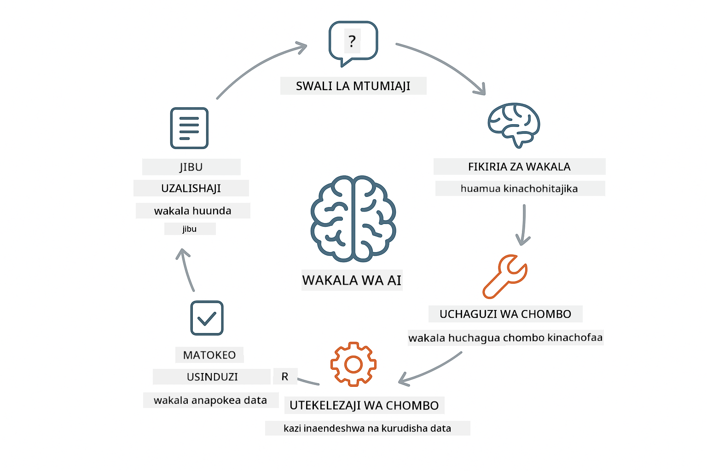
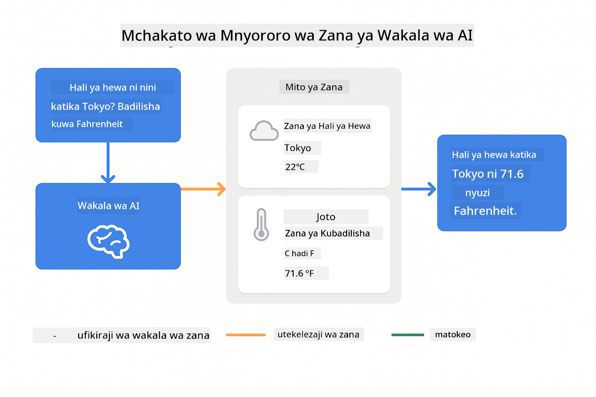
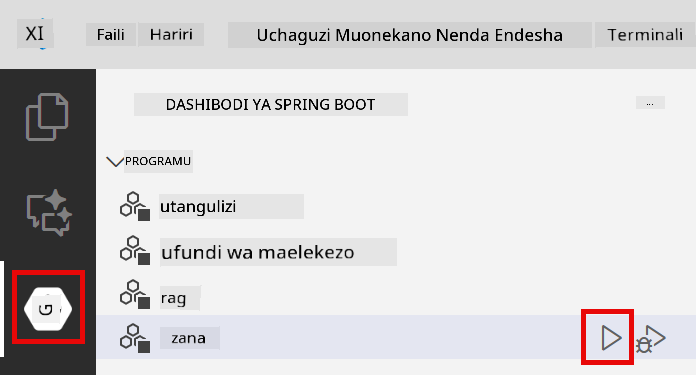
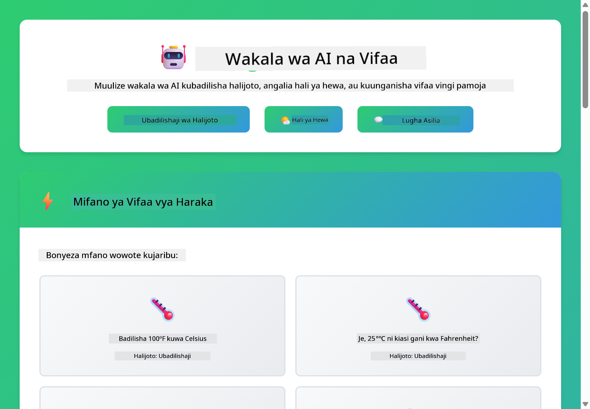

<!--
CO_OP_TRANSLATOR_METADATA:
{
  "original_hash": "aa23f106e7f53270924c9dd39c629004",
  "translation_date": "2025-12-13T19:15:01+00:00",
  "source_file": "04-tools/README.md",
  "language_code": "sw"
}
-->
# Moduli 04: Wakala wa AI Wenye Vifaa

## Jedwali la Yaliyomo

- [Utajifunza Nini](../../../04-tools)
- [Mahitaji ya Awali](../../../04-tools)
- [Kuelewa Wakala wa AI Wenye Vifaa](../../../04-tools)
- [Jinsi Kuitwa kwa Vifaa Inavyofanya Kazi](../../../04-tools)
  - [Maelezo ya Vifaa](../../../04-tools)
  - [Uamuzi](../../../04-tools)
  - [Utekelezaji](../../../04-tools)
  - [Uundaji wa Majibu](../../../04-tools)
- [Kufuata Vifaa Mfululizo](../../../04-tools)
- [Endesha Programu](../../../04-tools)
- [Kutumia Programu](../../../04-tools)
  - [Jaribu Matumizi Rahisi ya Kifaa](../../../04-tools)
  - [Jaribu Kufuata Vifaa Mfululizo](../../../04-tools)
  - [Tazama Mtiririko wa Mazungumzo](../../../04-tools)
  - [Angalia Ufafanuzi](../../../04-tools)
  - [Fanya Maajaribio na Maombi Tofauti](../../../04-tools)
- [Mafundisho Muhimu](../../../04-tools)
  - [Mfumo wa ReAct (Ufafanuzi na Kutenda)](../../../04-tools)
  - [Maelezo ya Vifaa Ni Muhimu](../../../04-tools)
  - [Usimamizi wa Kikao](../../../04-tools)
  - [Kushughulikia Makosa](../../../04-tools)
- [Vifaa Vilivyopo](../../../04-tools)
- [Wakati wa Kutumia Wakala Wenye Vifaa](../../../04-tools)
- [Hatua Zifuatazo](../../../04-tools)

## Utajifunza Nini

Hadi sasa, umejifunza jinsi ya kuzungumza na AI, kuunda maelekezo kwa ufanisi, na kuimarisha majibu yako katika nyaraka zako. Lakini bado kuna kikomo cha msingi: mifano ya lugha inaweza tu kuzalisha maandishi. Haiwezi kuangalia hali ya hewa, kufanya mahesabu, kuuliza hifadhidata, au kuingiliana na mifumo ya nje.

Vifaa hubadilisha hili. Kwa kumpa mfano ufikiaji wa kazi anazoweza kuita, unabadilisha kutoka kwa kizalishaji cha maandishi kuwa wakala anayeweza kuchukua hatua. Mfano huamua lini anahitaji kifaa, ni kifaa gani atakachotumia, na ni vigezo gani atakavyovipasa. Msimbo wako hutekeleza kazi na kurudisha matokeo. Mfano huingiza matokeo hayo katika jibu lake.

## Mahitaji ya Awali

- Kumaliza Moduli 01 (Rasilimali za Azure OpenAI zimetumika)
- Faili `.env` katika saraka kuu yenye vyeti vya Azure (iliyoanzishwa na `azd up` katika Moduli 01)

> **Kumbuka:** Ikiwa hujakamilisha Moduli 01, fuata maelekezo ya usambazaji hapo kwanza.

## Kuelewa Wakala wa AI Wenye Vifaa

Wakala wa AI mwenye vifaa hufuata mfumo wa ufafanuzi na kutenda (ReAct):

1. Mtumiaji anauliza swali
2. Wakala huamua anahitaji kujua nini
3. Wakala huamua kama anahitaji kifaa kujibu
4. Ikiwa ndiyo, wakala huita kifaa kinachofaa na vigezo sahihi
5. Kifaa hutekeleza na kurudisha data
6. Wakala huingiza matokeo na kutoa jibu la mwisho



*Mfumo wa ReAct - jinsi wakala wa AI hubadilishana kati ya ufafanuzi na kutenda kutatua matatizo*

Hii hufanyika moja kwa moja. Unafafanua vifaa na maelezo yao. Mfano hushughulikia uamuzi wa lini na jinsi ya kuvitumia.

## Jinsi Kuitwa kwa Vifaa Inavyofanya Kazi

**Maelezo ya Vifaa** - [WeatherTool.java](../../../04-tools/src/main/java/com/example/langchain4j/agents/tools/WeatherTool.java) | [TemperatureTool.java](../../../04-tools/src/main/java/com/example/langchain4j/agents/tools/TemperatureTool.java)

Unafafanua kazi zilizo na maelezo wazi na vipimo vya vigezo. Mfano unaona maelezo haya katika maelekezo ya mfumo wake na unaelewa kila kifaa kinachofanya.

```java
@Component
public class WeatherTool {
    
    @Tool("Get the current weather for a location")
    public String getCurrentWeather(@P("Location name") String location) {
        // Mantiki yako ya kutafuta hali ya hewa
        return "Weather in " + location + ": 22°C, cloudy";
    }
}

@AiService
public interface Assistant {
    String chat(@MemoryId String sessionId, @UserMessage String message);
}

// Msaidizi anaunganishwa moja kwa moja na Spring Boot na:
// - Bean ya ChatModel
// - Mbinu zote za @Tool kutoka kwa madarasa ya @Component
// - ChatMemoryProvider kwa usimamizi wa kikao
```

> **🤖 Jaribu na [GitHub Copilot](https://github.com/features/copilot) Chat:** Fungua [`WeatherTool.java`](../../../04-tools/src/main/java/com/example/langchain4j/agents/tools/WeatherTool.java) na uliza:
> - "Ningejumuishaje API halisi ya hali ya hewa kama OpenWeatherMap badala ya data ya mfano?"
> - "Nini hufanya maelezo ya kifaa kuwa mazuri yanayosaidia AI kuitumia kwa usahihi?"
> - "Ninawezaje kushughulikia makosa ya API na mipaka ya viwango katika utekelezaji wa vifaa?"

**Uamuzi**

Mtumiaji anauliza "Hali ya hewa iko vipi Seattle?", mfano unatambua anahitaji kifaa cha hali ya hewa. Hutengeneza wito wa kazi na kigezo cha eneo kikiwa "Seattle".

**Utekelezaji** - [AgentService.java](../../../04-tools/src/main/java/com/example/langchain4j/agents/service/AgentService.java)

Spring Boot huunganisha moja kwa moja kiolesura cha `@AiService` kilichoelezwa na vifaa vyote vilivyojisajili, na LangChain4j hufanya wito wa vifaa moja kwa moja.

> **🤖 Jaribu na [GitHub Copilot](https://github.com/features/copilot) Chat:** Fungua [`AgentService.java`](../../../04-tools/src/main/java/com/example/langchain4j/agents/service/AgentService.java) na uliza:
> - "Mfumo wa ReAct hufanya kazi vipi na kwa nini ni mzuri kwa wakala wa AI?"
> - "Wakala huamua vipi ni kifaa gani atakachotumia na kwa mpangilio gani?"
> - "Nini hutokea ikiwa utekelezaji wa kifaa unashindwa - ni vipi nashughulikia makosa kwa ufanisi?"

**Uundaji wa Majibu**

Mfano hupokea data ya hali ya hewa na kuibadilisha kuwa jibu la lugha ya kawaida kwa mtumiaji.

### Kwa Nini Kutumia Huduma za AI Zinazoelezwa?

Moduli hii inatumia ushirikiano wa LangChain4j na Spring Boot kwa kiolesura cha `@AiService` kinachoelezwa:

- **Spring Boot auto-wiring** - ChatModel na vifaa huingizwa moja kwa moja
- **Mfumo wa @MemoryId** - Usimamizi wa kumbukumbu wa kikao moja kwa moja
- **Kipindi kimoja** - Msaidizi huundwa mara moja na kutumika tena kwa utendaji bora
- **Utekelezaji salama kwa aina** - Mbinu za Java huitwa moja kwa moja na uongofu wa aina
- **Uendeshaji wa mizunguko mingi** - Hushughulikia kufuata vifaa mfululizo moja kwa moja
- **Hakuna boilerplate** - Hakuna wito wa mikono wa AiServices.builder() au ramani ya kumbukumbu

Njia mbadala (manual `AiServices.builder()`) zinahitaji msimbo zaidi na hazipati faida za ushirikiano wa Spring Boot.

## Kufuata Vifaa Mfululizo

**Kufuata Vifaa Mfululizo** - AI inaweza kuita vifaa vingi mfululizo. Uliza "Hali ya hewa iko vipi Seattle na je, ni lazima nibebe mwavuli?" na uone inavyofuatilia `getCurrentWeather` huku ikifikiria kuhusu vifaa vya mvua.

<a href="images/tool-chaining.png"></a>

*Wito wa vifaa mfululizo - matokeo ya kifaa kimoja huingizwa katika uamuzi unaofuata*

**Kushindwa kwa Hekima** - Uliza hali ya hewa katika mji usiopo kwenye data ya mfano. Kifaa hurudisha ujumbe wa kosa, na AI hueleza hawezi kusaidia. Vifaa hushindwa kwa usalama.

Hii hufanyika katika mzunguko mmoja wa mazungumzo. Wakala huandaa wito wa vifaa vingi kwa uhuru.

## Endesha Programu

**Thibitisha usambazaji:**

Hakikisha faili `.env` ipo katika saraka kuu yenye vyeti vya Azure (iliyoanzishwa wakati wa Moduli 01):
```bash
cat ../.env  # Inapaswa kuonyesha AZURE_OPENAI_ENDPOINT, API_KEY, DEPLOYMENT
```

**Anzisha programu:**

> **Kumbuka:** Ikiwa tayari umeanzisha programu zote kwa kutumia `./start-all.sh` kutoka Moduli 01, moduli hii tayari inaendesha kwenye bandari 8084. Unaweza kuruka amri za kuanzisha hapa chini na kwenda moja kwa moja http://localhost:8084.

**Chaguo 1: Kutumia Spring Boot Dashboard (Inapendekezwa kwa watumiaji wa VS Code)**

Kontena la maendeleo lina ugani wa Spring Boot Dashboard, unaotoa kiolesura cha kuona na kusimamia programu zote za Spring Boot. Unaweza kuipata kwenye Bar ya Shughuli upande wa kushoto wa VS Code (tazama ikoni ya Spring Boot).

Kutoka Spring Boot Dashboard, unaweza:
- Kuona programu zote za Spring Boot zilizopo katika eneo la kazi
- Anzisha/zimia programu kwa bonyeza moja
- Tazama kumbukumbu za programu kwa wakati halisi
- Fuata hali ya programu

Bonyeza kitufe cha kucheza kando ya "tools" kuanzisha moduli hii, au anzisha moduli zote kwa pamoja.



**Chaguo 2: Kutumia skripti za shell**

Anzisha programu zote za wavuti (moduli 01-04):

**Bash:**
```bash
cd ..  # Kutoka kwenye saraka ya mzizi
./start-all.sh
```

**PowerShell:**
```powershell
cd ..  # Kutoka kwenye saraka ya mzizi
.\start-all.ps1
```

Au anzisha moduli hii pekee:

**Bash:**
```bash
cd 04-tools
./start.sh
```

**PowerShell:**
```powershell
cd 04-tools
.\start.ps1
```

Skripti zote hujaza moja kwa moja vigezo vya mazingira kutoka faili `.env` ya saraka kuu na zitajenga JARs ikiwa hazipo.

> **Kumbuka:** Ikiwa unapendelea kujenga moduli zote kwa mikono kabla ya kuanzisha:
>
> **Bash:**
> ```bash
> cd ..  # Go to root directory
> mvn clean package -DskipTests
> ```
>
> **PowerShell:**
> ```powershell
> cd ..  # Go to root directory
> mvn clean package -DskipTests
> ```

Fungua http://localhost:8084 katika kivinjari chako.

**Kusitisha:**

**Bash:**
```bash
./stop.sh  # Hii moduli tu
# Au
cd .. && ./stop-all.sh  # Moduli zote
```

**PowerShell:**
```powershell
.\stop.ps1  # Hii moduli tu
# Au
cd ..; .\stop-all.ps1  # Moduli zote
```

## Kutumia Programu

Programu hutoa kiolesura cha wavuti ambapo unaweza kuingiliana na wakala wa AI mwenye ufikiaji wa vifaa vya hali ya hewa na uongofu wa joto.

<a href="images/tools-homepage.png"></a>

*Kiolesura cha Vifaa vya Wakala wa AI - mifano ya haraka na kiolesura cha mazungumzo kwa kuingiliana na vifaa*

**Jaribu Matumizi Rahisi ya Kifaa**

Anza na ombi rahisi: "Badilisha nyuzi 100 Fahrenheit kuwa Celsius". Wakala anatambua anahitaji kifaa cha uongofu wa joto, anakita wito na vigezo sahihi, na kurudisha matokeo. Angalia jinsi inavyohisi asili - hukutaja ni kifaa gani utumie au jinsi ya kukiita.

**Jaribu Kufuata Vifaa Mfululizo**

Sasa jaribu kitu kigumu zaidi: "Hali ya hewa iko vipi Seattle na ibadilishe kuwa Fahrenheit?" Tazama wakala akifanya kazi hatua kwa hatua. Kwanza hupata hali ya hewa (inayorejesha Celsius), anatambua anahitaji kubadilisha kuwa Fahrenheit, anakita wito wa kifaa cha uongofu, na kuunganisha matokeo yote kuwa jibu moja.

**Tazama Mtiririko wa Mazungumzo**

Kiolesura cha mazungumzo kinahifadhi historia ya mazungumzo, kikikuwezesha kuwa na maingiliano ya mizunguko mingi. Unaweza kuona maswali na majibu yote ya awali, kurahisisha kufuatilia mazungumzo na kuelewa jinsi wakala anavyojenga muktadha kwa mabadilishano mengi.

<a href="images/tools-conversation-demo.png"></a>

*Mazungumzo ya mizunguko mingi yanaonyesha uongofu rahisi, utafutaji wa hali ya hewa, na kufuata vifaa mfululizo*

**Fanya Maajaribio na Maombi Tofauti**

Jaribu mchanganyiko mbalimbali:
- Utafutaji wa hali ya hewa: "Hali ya hewa iko vipi Tokyo?"
- Uongofu wa joto: "25°C ni sawa na Kelvin ngapi?"
- Maswali mchanganyiko: "Angalia hali ya hewa Paris na niambie kama iko juu ya 20°C"

Angalia jinsi wakala anavyotafsiri lugha ya asili na kuibadilisha kuwa wito sahihi wa vifaa.

## Mafundisho Muhimu

**Mfumo wa ReAct (Ufafanuzi na Kutenda)**

Wakala hubadilishana kati ya ufafanuzi (kuamua cha kufanya) na kutenda (kutumia vifaa). Mfumo huu unawawezesha kutatua matatizo kwa uhuru badala ya kujibu tu maagizo.

**Maelezo ya Vifaa Ni Muhimu**

Ubora wa maelezo ya kifaa chako unaathiri moja kwa moja jinsi wakala anavyovitumia. Maelezo wazi na maalum husaidia mfano kuelewa lini na jinsi ya kuita kila kifaa.

**Usimamizi wa Kikao**

Anuani ya `@MemoryId` inaruhusu usimamizi wa kumbukumbu wa kikao moja kwa moja. Kila kitambulisho cha kikao kinapata mfano wake wa `ChatMemory` unaosimamiwa na bean ya `ChatMemoryProvider`, kuondoa haja ya kufuatilia kumbukumbu kwa mikono.

**Kushughulikia Makosa**

Vifaa vinaweza kushindwa - API zinaweza kuchelewa, vigezo vinaweza kuwa batili, huduma za nje zinaweza kushindwa. Wakala wa uzalishaji unahitaji kushughulikia makosa ili mfano aweze kueleza matatizo au kujaribu mbadala.

## Vifaa Vilivyopo

**Vifaa vya Hali ya Hewa** (data ya mfano kwa maonyesho):
- Pata hali ya hewa ya sasa kwa eneo
- Pata utabiri wa siku nyingi

**Vifaa vya Uongofu wa Joto**:
- Celsius hadi Fahrenheit
- Fahrenheit hadi Celsius
- Celsius hadi Kelvin
- Kelvin hadi Celsius
- Fahrenheit hadi Kelvin
- Kelvin hadi Fahrenheit

Hivi ni mifano rahisi, lakini mfumo huu unaweza kupanuliwa kwa kazi yoyote: kuuliza hifadhidata, wito wa API, mahesabu, uendeshaji wa faili, au amri za mfumo.

## Wakati wa Kutumia Wakala Wenye Vifaa

**Tumia vifaa wakati:**
- Kujibu kunahitaji data ya wakati halisi (hali ya hewa, bei za hisa, hesabu)
- Unahitaji kufanya mahesabu zaidi ya hisabati rahisi
- Kupata hifadhidata au API
- Kuchukua hatua (kutuma barua pepe, kuunda tiketi, kusasisha rekodi)
- Kuunganisha vyanzo vingi vya data

**Usitumie vifaa wakati:**
- Maswali yanaweza kujibiwa kwa maarifa ya jumla
- Jibu ni mazungumzo tu
- Ucheleweshaji wa kifaa ungefanya uzoefu kuwa polepole sana

## Hatua Zifuatazo

**Moduli Ifuatayo:** [05-mcp - Itifaki ya Muktadha wa Mfano (MCP)](../05-mcp/README.md)

---

**Uelekeo:** [← Iliyotangulia: Moduli 03 - RAG](../03-rag/README.md) | [Rudi Kwenye Kuu](../README.md) | [Ifuatayo: Moduli 05 - MCP →](../05-mcp/README.md)

---

<!-- CO-OP TRANSLATOR DISCLAIMER START -->
**Kiarifa cha Kukataa**:
Hati hii imetafsiriwa kwa kutumia huduma ya tafsiri ya AI [Co-op Translator](https://github.com/Azure/co-op-translator). Ingawa tunajitahidi kwa usahihi, tafadhali fahamu kuwa tafsiri za kiotomatiki zinaweza kuwa na makosa au upungufu wa usahihi. Hati ya asili katika lugha yake ya asili inapaswa kuchukuliwa kama chanzo cha mamlaka. Kwa taarifa muhimu, tafsiri ya kitaalamu ya binadamu inapendekezwa. Hatubebei dhamana kwa kutoelewana au tafsiri potofu zinazotokana na matumizi ya tafsiri hii.
<!-- CO-OP TRANSLATOR DISCLAIMER END -->