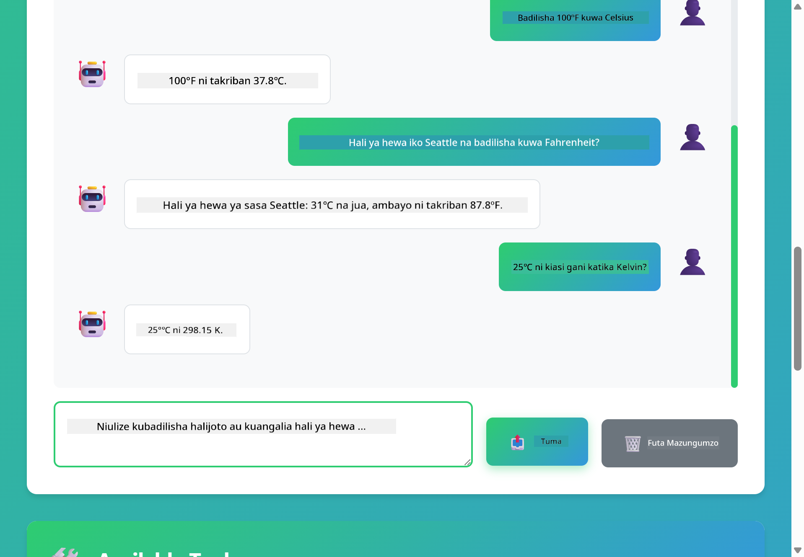

<!--
CO_OP_TRANSLATOR_METADATA:
{
  "original_hash": "13ec450c12cdd1a863baa2b778f27cd7",
  "translation_date": "2025-12-31T03:44:51+00:00",
  "source_file": "04-tools/README.md",
  "language_code": "sw"
}
-->
# Moduli 04: Wakala za AI na Zana

## Yaliyomo

- [Utajifunza Nini](../../../04-tools)
- [Mahitaji](../../../04-tools)
- [Kuelewa Wakala za AI na Zana](../../../04-tools)
- [Jinsi Kuitisha Zana Inavyofanya Kazi](../../../04-tools)
  - [Maelezo ya Zana](../../../04-tools)
  - [Uamuzi](../../../04-tools)
  - [Utekelezaji](../../../04-tools)
  - [Uundaji wa Jibu](../../../04-tools)
- [Ufungamanisho wa Zana](../../../04-tools)
- [Endesha Programu](../../../04-tools)
- [Kutumia Programu](../../../04-tools)
  - [Jaribu Matumizi Rahisi ya Zana](../../../04-tools)
  - [Jaribu Ufungamanisho wa Zana](../../../04-tools)
  - [Tazama Mtiririko wa Mazungumzo](../../../04-tools)
  - [Angalia Ufikiri wa Mfumo](../../../04-tools)
  - [Jaribu Maombi Mbalimbali](../../../04-tools)
- [Misingi Muhimu](../../../04-tools)
  - [Mfumo wa ReAct (Kufikiri na Kitendo)](../../../04-tools)
  - [Maelezo ya Zana Ni Muhimu](../../../04-tools)
  - [Usimamizi wa Kikao](../../../04-tools)
  - [Usimamizi wa Makosa](../../../04-tools)
- [Zana Zinazopatikana](../../../04-tools)
- [Ni Wakati Gani Kutumia Wakala Zenye Zana](../../../04-tools)
- [Hatua Zifuatazo](../../../04-tools)

## Utajifunza Nini

Mpaka sasa, umejifunza jinsi ya kuzungumza na AI, kupanga maagizo kwa ufanisi, na kuifanya jawaibu zisiwe tu za kawaida bali zigungumuwe kwa nyaraka zako. Lakini bado kuna kikomo cha msingi: mifumo ya lugha inaweza kutengeneza maandishi tu. Haiwezi kuangalia hali ya hewa, kufanya mahesabu, kuuliza hifadhidata, au kuingiliana na mifumo ya nje.

Zana zinarudisha hilo. Kwa kumuwezesha mfano kupata vitendo anavyoweza kuita, unamgeuza kutoka kwa kizalishaji cha maandishi hadi wakala anayeweza kuchukua hatua. Mfano huamua wakati unahitaji zana, ni zana gani itumike, na ni vigezo gani vya kupitisha. Msimbo wako unatekeleza kazi na kurudisha matokeo. Mfano huingiza matokeo hayo kwenye jibu lake.

## Mahitaji

- Umehitimisha Moduli 01 (Rasilimali za Azure OpenAI zimewekwa)
- Faili `.env` katika saraka ya mizizi yenye cheti za Azure (imeundwa na `azd up` katika Moduli 01)

> **Kumbuka:** Ikiwa hukukamilisha Moduli 01, fuata maelekezo ya utekelezaji huko kwanza.

## Kuelewa Wakala za AI na Zana

> **📝 Kumbuka:** Neno "agents" katika moduli hii linarejelea wasaidizi wa AI walioongezwa uwezo wa kuitisha zana. Hii ni tofauti na mifumo ya **Agentic AI** (wakala wa kujitegemea wenye upangaji, kumbukumbu, na fikra za hatua nyingi) tutakazofunika katika [Module 05: MCP](../05-mcp/README.md).

Wakala wa AI mwenye zana hufuata muundo wa kufikiri na kutenda (ReAct):

1. Mtumiaji anauliza swali
2. Wakala anafikiri kuhusu anachohitaji kujua
3. Wakala huamua ikiwa anahitaji zana kujibu
4. Ikiwa ndiyo, wakala anaitisha zana inayofaa na vigezo sahihi
5. Zana inatekeleza na kurudisha data
6. Wakala huingiza matokeo na kutoa jibu la mwisho


*Mfumo wa ReAct - jinsi wakala za AI zinavyobadilishana kati ya kufikiri na kutenda kutatua matatizo*

Hii hufanyika moja kwa moja. Wewe unaeleza zana na maelezo yao. Mfano unashughulikia uamuzi wa lini na jinsi ya kuzitumia.

## Jinsi Kuitisha Zana Inavyofanya Kazi

**Maelezo ya Zana** - [WeatherTool.java](../../../04-tools/src/main/java/com/example/langchain4j/agents/tools/WeatherTool.java) | [TemperatureTool.java](../../../04-tools/src/main/java/com/example/langchain4j/agents/tools/TemperatureTool.java)

Unaeleza kazi (functions) zenye maelezo wazi na uainishaji wa vigezo. Mfano unaona maelezo haya katika system prompt yake na unaelewa kila zana inafanya nini.

```java
@Component
public class WeatherTool {
    
    @Tool("Get the current weather for a location")
    public String getCurrentWeather(@P("Location name") String location) {
        // Mantiki yako ya kutafuta hali ya hewa
        return "Weather in " + location + ": 22°C, cloudy";
    }
}

@AiService
public interface Assistant {
    String chat(@MemoryId String sessionId, @UserMessage String message);
}

// Msaidizi umeunganishwa kwa kiotomatiki na Spring Boot na:
// - bean ya ChatModel
// - Mbinu zote za @Tool kutoka kwa madarasa ya @Component
// - ChatMemoryProvider kwa usimamizi wa vikao
```

> **🤖 Jaribu na [GitHub Copilot](https://github.com/features/copilot) Chat:** Fungua [`WeatherTool.java`](../../../04-tools/src/main/java/com/example/langchain4j/agents/tools/WeatherTool.java) na ulize:
> - "Ningeunganishaje API halisi ya hali ya hewa kama OpenWeatherMap badala ya data ya mfano?"
> - "Ni nini kinachofanya maelezo ya zana kuwa mazuri na kumsaidia AI kuitumia kwa usahihi?"
> - "Ninakabilianaje na makosa ya API na mipaka ya kiwango katika utekelezaji wa zana?"

**Uamuzi**

Wakati mtumiaji akiuliza "What's the weather in Seattle?", mfano unatambua kwamba unahitaji zana ya hali ya hewa. Inatengeneza mwito wa kazi na kipengele cha location kimewekwa "Seattle".

**Utekelezaji** - [AgentService.java](../../../04-tools/src/main/java/com/example/langchain4j/agents/service/AgentService.java)

Spring Boot auto-wires interface ya kideklaratif `@AiService` pamoja na zana zote zilizosajiliwa, na LangChain4j inatekeleza miito ya zana moja kwa moja.

> **🤖 Jaribu na [GitHub Copilot](https://github.com/features/copilot) Chat:** Fungua [`AgentService.java`](../../../04-tools/src/main/java/com/example/langchain4j/agents/service/AgentService.java) na ulize:
> - "Mfumo wa ReAct unafanya kazi vipi na kwa nini ni mzuri kwa wakala za AI?"
> - "Wakala anaamua vipi zana gani kutumia na kwa mpangilio upi?"
> - "Nini kinatokea ikiwa utekelezaji wa zana unashindwa - nifanyaje kushughulikia makosa kwa ufasaha?"

**Uundaji wa Jibu**

Mfano unapata data ya hali ya hewa na kuiunda katika jibu la lugha ya asili kwa mtumiaji.

### Kwa Nini Kutumia Huduma za AI Zinazoelezwa (Declarative)?

Moduli hii inatumia ushirikiano wa LangChain4j na Spring Boot kupitia interface za kideklaratif `@AiService`:

- **Spring Boot auto-wiring** - ChatModel na zana zinaingizwa moja kwa moja
- **mfano wa `@MemoryId`** - Usimamizi wa kumbukumbu unaotegemea kikao wa moja kwa moja
- **Mfano mmoja tu** - Msaidizi anaundwa mara moja na kutumika tena kwa utendaji bora
- **Utekelezaji salama kwa aina** - Mbinu za Java zinaitwa moja kwa moja zikiwa na uongofu wa aina
- **Orkestra ya mizunguko mingi** - Inashughulikia ufuatiliaji wa zana kwa njia ya moja kwa moja
- **Hakuna boilerplate** - Hakuna wito za mkono wa AiServices.builder() au HashMap za kumbukumbu

Mbinu mbadala (manual `AiServices.builder()`) zinahitaji msimbo zaidi na hupoteza faida za ushirikiano wa Spring Boot.

## Ufungamanisho wa Zana

**Ufungamanisho wa Zana** - AI inaweza kuita zana nyingi mfululizo. Uliza "What's the weather in Seattle and should I bring an umbrella?" na uone inavyounganisha `getCurrentWeather` pamoja na utofautishaji kuhusu vifaa vya mvua.

<a href="images/tool-chaining.png"></a>

*Miito ya zana mfululizo - pato la zana moja linaingiza kwenye uamuzi unaofuata*

**Makosa Yanayotendewa kwa Heshima** - Uliza hali ya hewa katika jiji ambalo halipo kwenye data ya mfano. Zana inarudisha ujumbe wa kosa, na AI inaeleza kwamba hawezi kusaidia. Zana zinashindwa kwa usalama.

Hii hufanyika ndani ya zamu moja ya mazungumzo. Wakala anaendesha miito mingi ya zana kwa uhuru.

## Endesha Programu

**Thibitisha uenezaji:**

Hakikisha faili `.env` ipo katika saraka ya mizizi ikiwa na cheti za Azure (imeundwa wakati wa Moduli 01):
```bash
cat ../.env  # Inapaswa kuonyesha AZURE_OPENAI_ENDPOINT, API_KEY, DEPLOYMENT
```

**Anzisha programu:**

> **Kumbuka:** Ikiwa tayari umeanza programu zote kwa kutumia `./start-all.sh` kutoka Moduli 01, moduli hii tayari inaendesha kwenye port 8084. Unaweza kupita maagizo ya kuanza hapo chini na kwenda moja kwa moja kwa http://localhost:8084.

**Chaguo 1: Kutumia Spring Boot Dashboard (Inapendekezwa kwa watumiaji wa VS Code)**

Dev container inaongezwa la Spring Boot Dashboard, ambalo linatoa kiolesura cha kuona na kusimamia programu zote za Spring Boot. Unaweza kulipata kwenye Activity Bar upande wa kushoto wa VS Code (tazama ikoni ya Spring Boot).

Kutoka kwenye Spring Boot Dashboard, unaweza:
- Kuona programu zote za Spring Boot zinazopatikana katika workspace
- Anzisha/zimia programu kwa bonyeza moja
- Tazama logi za programu kwa wakati halisi
- Fuatilia hali ya programu

Bofya tu kitufe cha kucheza kando ya "tools" kuanzisha moduli hii, au anzisha moduli zote kwa wakati mmoja.


**Chaguo 2: Kutumia skiripti za shell**

Anzisha programu zote za wavuti (moduli 01-04):

**Bash:**
```bash
cd ..  # Kutoka kwenye saraka ya mzizi
./start-all.sh
```

**PowerShell:**
```powershell
cd ..  # Kutoka kwenye saraka ya mizizi
.\start-all.ps1
```

Au anzisha moduli hii pekee:

**Bash:**
```bash
cd 04-tools
./start.sh
```

**PowerShell:**
```powershell
cd 04-tools
.\start.ps1
```

Skiripti zote zinaleta kwa otomatiki vigezo vya mazingira kutoka kwa faili `.env` ya mizizi na zitajenga JARs ikiwa hazipo.

> **Kumbuka:** Ikiwa unapendelea kujenga moduli zote kwa mikono kabla ya kuanza:
>
> **Bash:**
> ```bash
> cd ..  # Go to root directory
> mvn clean package -DskipTests
> ```
>
> **PowerShell:**
> ```powershell
> cd ..  # Go to root directory
> mvn clean package -DskipTests
> ```

Fungua http://localhost:8084 katika kivinjari chako.

**Kusitisha:**

**Bash:**
```bash
./stop.sh  # Moduli hii tu
# Au
cd .. && ./stop-all.sh  # Moduli zote
```

**PowerShell:**
```powershell
.\stop.ps1  # Moduli hii tu
# Au
cd ..; .\stop-all.ps1  # Moduli zote
```

## Kutumia Programu

Programu inatoa kiolesura cha wavuti ambacho unaweza kuwasiliana nacho na wakala wa AI ambaye anaweza kutumia zana za hali ya hewa na zana za kubadilisha joto.

<a href="images/tools-homepage.png"></a>

*Kiolesura cha Zana za Wakala wa AI - mifano ya haraka na kiolesura cha mazungumzo kwa kuingiliana na zana*

**Jaribu Matumizi Rahisi ya Zana**

Anzia na ombi rahisi: "Badilisha 100 degrees Fahrenheit kuwa Celsius". Wakala anatambua kuwa anahitaji zana ya kubadilisha joto, anaiita kwa vigezo sahihi, na anarudisha matokeo. Angalia jinsi inavyohisi kuwa ya asili - hukuweka ni zana gani itumike au jinsi ya kuitisha.

**Jaribu Ufungamanisho wa Zana**

Sasa jaribu jambo ngumu zaidi: "What's the weather in Seattle and convert it to Fahrenheit?" Tazama wakala akifanya kazi kwa hatua. Kwanza anakusanya hali ya hewa (ambayo inarudisha Celsius), anatambua anahitaji kubadilisha kuwa Fahrenheit, anaiita zana ya uongofu, na anachanganya matokeo yote kuwa jibu moja.

**Tazama Mtiririko wa Mazungumzo**

Kiolesura cha mazungumzo kinahifadhi historia ya mazungumzo, kukuwezesha kufanya mazungumzo ya mizunguko mingi. Unaweza kuona maswali yote na majibu yaliyotangulia, na kufanya iwe rahisi kufuatilia mazungumzo na kuelewa jinsi wakala anavyojenga muktadha juu ya mabadilishano mengi.

<a href="images/tools-conversation-demo.png"></a>

*Mazungumzo ya mizunguko mingi yanaonyesha uongofu rahisi, upatikanaji wa hali ya hewa, na ufuatiliaji wa zana*

**Jaribu Maombi Mbalimbali**

Jaribu mchanganyiko wa maombi:
- Upataji wa hali ya hewa: "What's the weather in Tokyo?"
- Uongofu wa joto: "What is 25°C in Kelvin?"
- Maombi mchanganyiko: "Check the weather in Paris and tell me if it's above 20°C"

Angalia jinsi wakala anavyotafsiri lugha ya asili na kuibadilisha kuwa miito ya zana inayofaa.

## Misingi Muhimu

**Mfumo wa ReAct (Kufikiri na Kitendo)**

Wakala hubadilishana kati ya kufikiri (kuamua cha kufanya) na kutenda (kutumia zana). Muundo huu unawawezesha kutatua matatizo kwa uhuru badala ya kujibu tu maagizo.

**Maelezo ya Zana Ni Muhimu**

Ubora wa maelezo ya zana zako unaathiri moja kwa moja jinsi wakala anazitumia. Maelezo wazi na maalum husaidia mfano kuelewa lini na jinsi ya kuita kila zana.

**Usimamizi wa Kikao**

Anuwani ya `@MemoryId` inatoa usimamizi wa kumbukumbu kwa msingi wa kikao moja kwa moja. Kila kitambulisho cha kikao kinapata kiundombinu maalum cha `ChatMemory` kinachosimamiwa na bean ya `ChatMemoryProvider`, kuondoa haja ya kufuatilia kumbukumbu kwa mkono.

**Usimamizi wa Makosa**

Zana zinaweza kushindwa - API zinaweza kuisha muda, vigezo vinaweza kuwa batili, huduma za nje zinaweza kushindwa. Wakala za uzalishaji zinahitaji usimamizi wa makosa ili mfano aweze kueleza matatizo au kujaribu mbadala.

## Zana Zinazopatikana

**Zana za Hali ya Hewa** (data ya mfano kwa onyesho):
- Pata hali ya hewa ya sasa kwa eneo
- Pata utabiri wa siku kadhaa

**Zana za Uongofu wa Joto**:
- Celsius hadi Fahrenheit
- Fahrenheit hadi Celsius
- Celsius hadi Kelvin
- Kelvin hadi Celsius
- Fahrenheit hadi Kelvin
- Kelvin hadi Fahrenheit

Hizi ni mifano rahisi, lakini muundo unaongezeka kwa aina yoyote ya kazi: maswali ya hifadhidata, miito ya API, mahesabu, uendeshaji wa faili, au amri za mfumo.

## Ni Wakati Gani Kutumia Wakala Zenye Zana

**Tumia zana wakati:**
- Kujibu kunahitaji data ya wakati halisi (hali ya hewa, bei za hisa, hesabu za hesabu)
- Unahitaji kufanya mahesabu zaidi ya hisabati rahisi
- Kufikia hifadhidata au API
- Kuchukua hatua (kutuma barua pepe, kuunda tiketi, kusasisha rekodi)
- Kuunganisha vyanzo vya data vingi

**Usitumie zana wakati:**
- Maswali yanaweza kujibiwa kwa maarifa ya jumla
- Jibu ni la mazungumzo tu
- Muda wa kuchelewa kwa zana unafanya uzoefu kuwa polepole sana

## Hatua Zifuatazo

**Moduli Ifuatayo:** [05-mcp - Model Context Protocol (MCP)](../05-mcp/README.md)

---

**Urambazaji:** [← Iliyopita: Moduli 03 - RAG](../03-rag/README.md) | [Rudi Kwenye Kuu](../README.md) | [Ifuatayo: Moduli 05 - MCP →](../05-mcp/README.md)

---

<!-- CO-OP TRANSLATOR DISCLAIMER START -->
Angalizo:
Nyaraka hii imetafsiriwa kwa kutumia huduma ya tafsiri ya AI Co-op Translator (https://github.com/Azure/co-op-translator). Ingawa tunajitahidi kufikia usahihi, tafadhali fahamu kwamba tafsiri za kiotomatiki zinaweza kuwa na makosa au kutoa taarifa zisizo sahihi. Nyaraka ya asili katika lugha yake asilia inapaswa kuchukuliwa kama chanzo chenye mamlaka. Kwa taarifa muhimu, inashauriwa kutumia tafsiri ya mtaalamu wa binadamu. Hatuwajibiki kwa kutokuelewana au tafsiri zisizo sahihi zinazotokana na matumizi ya tafsiri hii.
<!-- CO-OP TRANSLATOR DISCLAIMER END -->