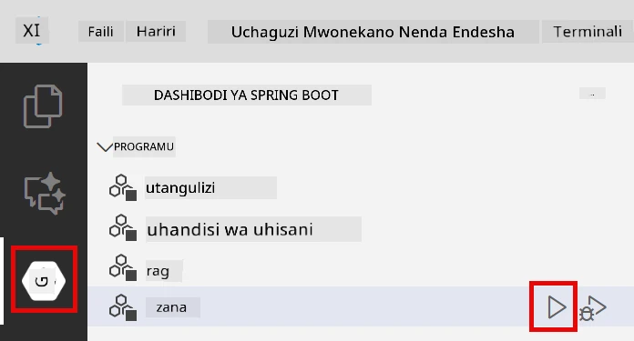
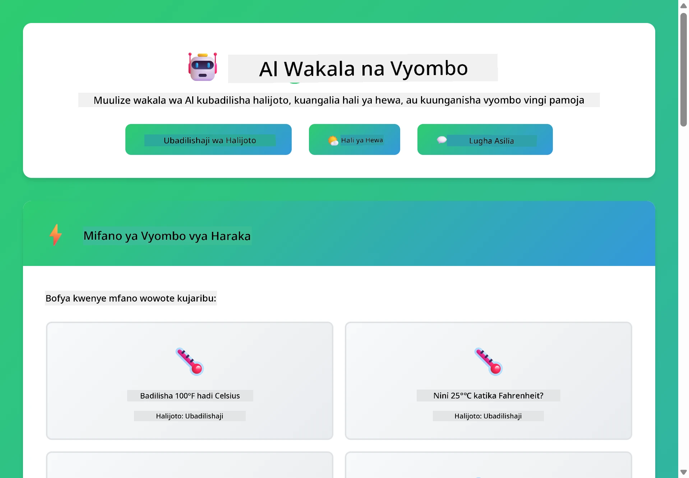
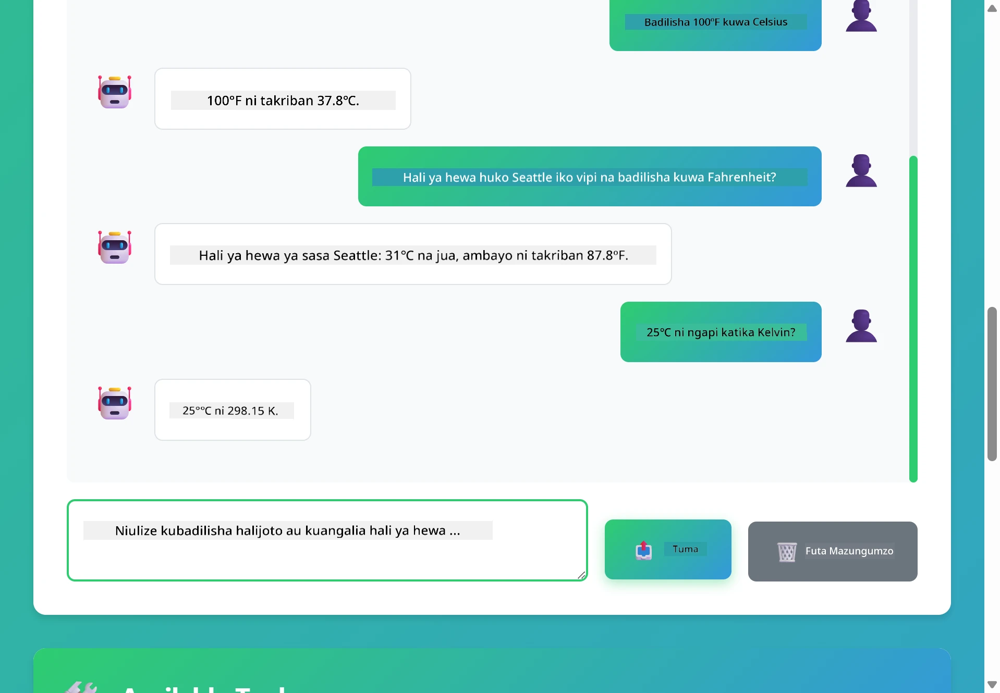

# Moduli 04: Wakala wa AI Wenye Zana

## Yaliyomo

- [Video Hatua kwa Hatua](#video-hatua-kwa-hatua)
- [Utajifunza Nini](#utajifunza-nini)
- [Mahitaji ya Awali](#mahitaji-ya-awali)
- [Kuelewa Wakala wa AI Wenye Zana](#kuelewa-wakala-wa-ai-wenye-zana)
- [Jinsi Kuitwa kwa Zana Kufanya Kazi](#jinsi-kuitwa-kwa-zana-kufanya-kazi)
  - [Maelezo ya Zana](#maelezo-ya-zana)
  - [Uamuzi](#uamuzi)
  - [Utekelezaji](#utekelezaji)
  - [Uundaji wa Majibu](#uundaji-wa-majibu)
  - [Mimari: Spring Boot Auto-Wiring](#mimari-spring-boot-auto-wiring)
- [Kufunga Zana Mfululizo](#kufunga-zana-mfululizo)
- [Endesha Programu](#endesha-programu)
- [Kutumia Programu](#kutumia-programu)
  - [Jaribu Matumizi Rahisi ya Zana](#jaribu-matumizi-rahisi-ya-zana)
  - [Jaribu Kufunga Zana Mfululizo](#jaribu-mlolongo-wa-zana)
  - [Tazama Mtiririko wa Mazungumzo](#tazama-mtiririko-wa-mazungumzo)
  - [Fanyia Maajaribio Maombi Tofauti](#jaribu-maombi-mbalimbali)
- [Dhana Muhimu](#dhana-muhimu)
  - [Mfumo wa ReAct (Kufikiri na Kutenda)](#mraba-wa-react-fikra-na-matendo)
  - [Maelezo ya Zana Ni Muhimu](#maelezo-ya-zana-ni-muhimu)
  - [Usimamizi wa Kikao](#usimamizi-wa-kikao)
  - [Kushughulikia Makosa](#kushughulikia-makosa)
- [Zana Zinazopatikana](#zana-zilizopo)
- [Wakati wa Kutumia Wakala Wenye Zana](#wakati-wa-kutumia-wakala-wa-zana)
- [Zana dhidi ya RAG](#zana-dhidi-ya-rag)
- [Hatua Zifuatazo](#hatua-zifuatayo)

## Video Hatua kwa Hatua

Tazama kipindi hiki cha moja kwa moja kinachoelezea jinsi ya kuanza na moduli hii:

<a href="https://www.youtube.com/watch?v=O_J30kZc0rw"></a>

## Utajifunza Nini

Hadi sasa, umejifunza jinsi ya kuwa na mazungumzo na AI, kuunda maelekezo kwa ufanisi, na kuimarisha majibu katika nyaraka zako. Lakini bado kuna kikomo muhimu: mifano ya lugha inaweza tu kuzalisha maandishi. Haiwezi kuangalia hali ya hewa, kufanya mahesabu, kuuliza katika hifadhidata, au kuingiliana na mifumo ya nje.

Zana hubadilisha hili. Kwa kumpa mfano ufikiaji wa kazi anazoweza kuita, unausogeza kutoka kwa kizalishaji cha maandishi hadi kuwa wakala anayeweza kuchukua hatua. Mfano unaamua ni lini unahitaji zana, ni zana gani itumike, na ni parameta gani zitapitishwa. Msimbo wako unatekeleza kazi na kurudisha matokeo. Mfano unaingiza matokeo hayo katika jibu lake.

## Mahitaji ya Awali

- Kumaliza [Moduli 01 - Utangulizi](../01-introduction/README.md) (Rasilimali za Azure OpenAI zimewekwa)
- Kupendekezwa kumaliza moduli zilizopita (moduli hii inataja [dhana za RAG kutoka Moduli 03](../03-rag/README.md) katika kulinganisha Zana dhidi ya RAG)
- Faili `.env` katika saraka kuu yenye cheti cha Azure (iliundwa na `azd up` katika Moduli 01)

> **Kumbuka:** Ikiwa hujakamilisha Moduli 01, fuata maelekezo ya usakinishaji hapo kwanza.

## Kuelewa Wakala wa AI Wenye Zana

> **📝 Kumbuka:** Neno "wakala" katika moduli hii linarejelea wasaidizi wa AI walioboreshwa na uwezo wa kuitwa kwa zana. Hii ni tofauti na mifumo ya **Agentic AI** (wakala huru wenye mipango, kumbukumbu, na fikra za hatua nyingi) ambayo tutazungumzia katika [Moduli 05: MCP](../05-mcp/README.md).

Bila zana, mfano wa lugha unaweza tu kuzalisha maandishi kutoka kwenye data yake ya mafunzo. Mwuulize hali ya hewa sasa, basi lazima anane. Mpe zana, ataita API ya hali ya hewa, kufanya mahesabu, au kuuliza hifadhidata — kisha acha atoe matokeo halisi katika jibu lake.


*Bila zana mfano unahitaji kumanane — kwa zana anaweza kuita API, kufanya mahesabu, na kurudisha data ya wakati halisi.*

Wakala wa AI mwenye zana hunafuata mfumo wa **Kufikiri na Kutenda (ReAct)**. Mfano haujibu tu — hufikiria anachohitaji, hufanya hatua kwa kuitia zana, hutazama matokeo, kisha huamua kama aendelee au kutoa jibu la mwisho:

1. **Fikiria** — Wakala anachambua swali la mtumiaji na kubaini taarifa anazohitaji
2. **Tenda** — Wakala huchagua zana sahihi, huunda parameta sahihi, na kuitia zana
3. **Tazama** — Wakala anapokea matokeo ya zana na kufanya tathmini
4. **Rudia au Jibu** — Ikiwa data zaidi inahitajika, wakala hurudia; vinginevyo, huunda jibu la lugha ya asili


*Mzunguko wa ReAct — wakala hufikiria anachotenda, hufanya kitendo kwa kuitia zana, hutazama matokeo, na hurudia hadi aweze kutoa jibu la mwisho.*

Hii hufanyika moja kwa moja. Wewe unaweka zana na maelezo yake. Mfano hushughulikia uamuzi wa lini na jinsi ya kuzitumia.

## Jinsi Kuitwa kwa Zana Kufanya Kazi

### Maelezo ya Zana

[WeatherTool.java](../../../04-tools/src/main/java/com/example/langchain4j/agents/tools/WeatherTool.java) | [TemperatureTool.java](../../../04-tools/src/main/java/com/example/langchain4j/agents/tools/TemperatureTool.java)

Unaeleza kazi kwa maelezo wazi na maelezo ya parameta. Mfano unaona maelezo haya katika maelekezo ya mfumo wake na unaelewa kila zana inafanya nini.

```java
@Component
public class WeatherTool {
    
    @Tool("Get the current weather for a location")
    public String getCurrentWeather(@P("Location name") String location) {
        // Mantiki yako ya kutafuta hali ya hewa
        return "Weather in " + location + ": 22°C, cloudy";
    }
}

@AiService
public interface Assistant {
    String chat(@MemoryId String sessionId, @UserMessage String message);
}

// Msaidizi anaunganishwa kwa moja kwa moja na Spring Boot na:
// - Kijani cha ChatModel
// - Mbinu zote za @Tool kutoka kwa madarasa ya @Component
// - ChatMemoryProvider kwa usimamizi wa kikao
```

Mchoro hapa chini unaelezea kila alama na kuonyesha jinsi kila sehemu inavyoisaidia AI kuelewa lini kuita zana na ni hoja gani kupitishwa:


*Anuwai ya maelezo ya zana — @Tool hueleza AI lini itumike, @P inaelezea kila parameta, na @AiService huunganisha kila kitu wakati wa kuanzisha.*

> **🤖 Jaribu na [GitHub Copilot](https://github.com/features/copilot) Chat:** Fungua [`WeatherTool.java`](../../../04-tools/src/main/java/com/example/langchain4j/agents/tools/WeatherTool.java) na uliza:
> - "Nitahakikisha vipi kuunganisha API halisi ya hali ya hewa kama OpenWeatherMap badala ya data feki?"
> - "Nini kinachofanya maelezo ya zana kuwa mazuri na kusaidia AI kuitumia kwa usahihi?"
> - "Nitashughulikia vipi makosa ya API na mipaka ya kutumia katika utekelezaji wa zana?"

### Uamuzi

Mwanadamu au mtumiaji auliza "Hali ya hewa iko vipi Seattle?", mfano hachagui zana nasibu. Hulinganisha nia ya mtumiaji dhidi ya maelezo ya zana zote anaweza kufikia, hupima kila moja kwa umuhimu, na hupata zana bora. Kisha hutengeneza simu ya kazi yenye muundo na parameta sahihi — katika kesi hii, kuweka `location` kuwa `"Seattle"`.

Kama hakuna zana inayokidhi ombi la mtumiaji, mfano hurudi kujibu kwa maarifa yake mwenyewe. Ikiwa zana nyingi zinakidhi, huchagua ile iliyo maalum zaidi.


*Mfano hupima kila zana inayopatikana dhidi ya nia ya mtumiaji na huchagua mechi bora — ndiyo maana kuandika maelezo ya zana wazi na maalum ni muhimu.*

### Utekelezaji

[AgentService.java](../../../04-tools/src/main/java/com/example/langchain4j/agents/service/AgentService.java)

Spring Boot huunganisha moja kwa moja interface ya `@AiService` yenye zana zote zilizosajiliwa, na LangChain4j hutoa simu za zana moja kwa moja. Nyuma ya pazia, mzunguko kamili wa kuitwa kwa zana hutoka kwenye swali la lugha ya asili la mtumiaji hadi jibu la lugha ya asili:


*Mtiririko kamili — mtumiaji auliza swali, mfano huchagua zana, LangChain4j hufanya kazi yake, na mfano huingiza matokeo katika jibu.*

Nyuma ya pazia, `AiServices` hufanya mzunguko huo sawa kwa zana yoyote — hapa umeonyeshwa na `Calculator` rahisi. Mchoro wa mfululizo hapa chini unaonyesha kinachotokea chanya:


*Mzunguko wa kuitwa kwa zana — `AiServices` hutuma ujumbe wako na muundo wa zana kwa LLM, LLM hurudisha simu ya kazi kama `add(42, 58)`, LangChain4j hufanya kazi ya `Calculator` eneo la ndani, na hurudisha matokeo kwa jibu la mwisho.*

> **🤖 Jaribu na [GitHub Copilot](https://github.com/features/copilot) Chat:** Fungua [`AgentService.java`](../../../04-tools/src/main/java/com/example/langchain4j/agents/service/AgentService.java) na uliza:
> - "Mfumo wa ReAct hufanya kazi vipi na kwa nini ni mzuri kwa wakala wa AI?"
> - "Wakala huamua vipi ni zana gani itumike na kwa mpangilio gani?"
> - "Kwa nini inatokea mkutano wa zana kushindwa - nitashughulikiaje makosa kwa usahihi?"

### Uundaji wa Majibu

Mfano unapata data ya hali ya hewa na kuiunda kuwa jibu la lugha asilia kwa mtumiaji.

### Mimari: Spring Boot Auto-Wiring

Moduli hii inatumia muunganiko wa Spring Boot wa LangChain4j na interface za `@AiService` za aina ya tamko. Wakati wa kuanzisha Spring Boot hugundua kila `@Component` iliyo na njia za `@Tool`, bean yako ya `ChatModel`, na `ChatMemoryProvider` — kisha huziunganisha zote kwenye interface moja ya `Assistant` bila mashaka ya mkono.


*Interface ya @AiService inahusisha pamoja ChatModel, vipengele vya zana, na mtoaji kumbukumbu — Spring Boot hushughulikia unganisho kiotomatiki.*

Hapa ni mzunguko wa ombi kamili kama mchoro wa mfululizo — kuanzia ombi la HTTP kupitia controller, huduma, na proksi iliyounganishwa moja kwa moja, hadi utekelezaji wa zana na kurudi tena:


*Mzunguko kamili wa ombi la Spring Boot — ombi la HTTP hupita controller na huduma hadi kwa proksi ya Msaidizi iliyo na waya, ambayo huandaa LLM na simu za zana moja kwa moja.*

Faida kuu za njia hii:

- **Auto-wiring ya Spring Boot** — ChatModel na zana zimeingizwa moja kwa moja
- **Mfumo wa @MemoryId** — Usimamizi wa kumbukumbu kwa kikao moja kwa moja
- **Kipindi kimoja** — Msaidizi huundwa mara moja na kutumika tena kwa utendaji bora
- **Utekelezaji salama kwa aina** — Njia za Java huitwa moja kwa moja na uongofu wa aina
- **Uratibu wa mipangilio mingi** — Hushughulikia kufunga zana moja kwa moja
- **Hakuna kodhi ya ziada** — Hakuna simu za mkono za `AiServices.builder()` au ramani za kumbukumbu

Njia mbadala (ya mkono na `AiServices.builder()`) huhitaji msimbo zaidi na hukosa faida za muunganisho wa Spring Boot.

## Kufunga Zana Mfululizo

**Kufunga Zana** — Nguvu halisi ya wakala mwenye zana huonekana wakati swali moja linahitaji zana nyingi. Uliza "Hali ya hewa iko Seattle kwa Fahrenheit?" na wakala huunganisha zana mbili kiotomatiki: kwanza huita `getCurrentWeather` kupata joto katika Celsius, kisha hupitisha thamani hiyo kwa `celsiusToFahrenheit` kwa uongofu — yote katika mzunguko mmoja wa mazungumzo.


*Kufunga zana inavyofanya kazi — wakala huita getCurrentWeather kwanza, kisha hupitisha matokeo ya Celsius kwa celsiusToFahrenheit, na hutuma jibu lililojumuishwa.*

**Kushindwa kwa Neema** — Uliza hali ya hewa katika jiji ambalo halipo kwenye data ya mfano. Zana hurudisha ujumbe wa kosa, na AI huelezea hawezi kusaidia badala ya kuzima programu. Zana hushindwa kwa usalama. Mchoro hapa chini unaonesha tofauti ya njia mbili — kwa usimamizi sahihi wa makosa, wakala huchukua makosa na kujibu kwa msaada, huku bila hivyo programu nzima inazama:


*Wakati zana inashindwa, wakala huchukua kosa na kujibu kwa maelezo yenye msaada badala ya kuzima programu.*

Hii hufanyika katika mzunguko mmoja wa mazungumzo. Wakala huandaa simu nyingi za zana kwa uhuru.

## Endesha Programu

**Thibitisha usanifu:**

Hakikisha faili `.env` ipo katika saraka kuu na cheti cha Azure (iliundwa wakati wa Moduli 01). Endesha hii kutoka saraka ya moduli (`04-tools/`):

**Bash:**
```bash
cat ../.env  # Inapaswa kuonyesha AZURE_OPENAI_ENDPOINT, API_KEY, DEPLOYMENT
```

**PowerShell:**
```powershell
Get-Content ..\.env  # Inapaswa kuonyesha AZURE_OPENAI_ENDPOINT, API_KEY, DEPLOYMENT
```

**Anzisha programu:**

> **Kumbuka:** Kama tayari umeanzisha programu zote kwa kutumia `./start-all.sh` kutoka saraka kuu (kama ilivyoelezwa katika Moduli 01), moduli hii inafanya kazi tayari kwenye bandari 8084. Unaweza kupita amri za kuanzisha hapa chini na kwenda moja kwa moja http://localhost:8084.

**Chaguo 1: Kutumia Spring Boot Dashboard (Inapendekezwa kwa watumiaji wa VS Code)**

Begani ya maendeleo ina kipengele cha Spring Boot Dashboard, kinachotoa kiolesura cha kuona na kudhibiti programu zote za Spring Boot. Unaweza kuiona katika Bar ya Shughuli upande wa kushoto wa VS Code (tafuta ikoni ya Spring Boot).

Kutoka Spring Boot Dashboard, unaweza:
- Kuona programu zote za Spring Boot zinazopatikana kwenye eneo la kazi
- Kuanzisha/kuzima programu kwa kitufe kimoja
- Kutazama kumbukumbu za programu kwa muda halisi
- Kufuatilia hali ya programu

Bonyeza kitufe cha kucheza kando ya "tools" kuanza moduli hii, au anzisha moduli zote kwa pamoja.

Hivi ndivyo Spring Boot Dashboard inavyoonekana katika VS Code:


*Dashibodi ya Spring Boot katika VS Code — anzisha, simamisha, na fuatilia moduli zote kutoka mahali pamoja*

**Chaguo 2: Kutumia skripti za shell**

Anzisha programu zote za wavuti (moduli 01-04):

**Bash:**
```bash
cd ..  # Kutoka katika saraka ya mzizi
./start-all.sh
```

**PowerShell:**
```powershell
cd ..  # Kutoka kwenye saraka ya mzizi
.\start-all.ps1
```

Au anzisha moduli hii peke yake:

**Bash:**
```bash
cd 04-tools
./start.sh
```

**PowerShell:**
```powershell
cd 04-tools
.\start.ps1
```

Skripti zote mbili zinaleta moja kwa moja mabadiliko ya mazingira kutoka kwenye faili la mizizi `.env` na zitajenga JARs ikiwa hazipo.

> **Kumbuka:** Ikiwa unapendelea kujenga moduli zote kwa mkono kabla ya kuanza:
>
> **Bash:**
> ```bash
> cd ..  # Go to root directory
> mvn clean package -DskipTests
> ```
>
> **PowerShell:**
> ```powershell
> cd ..  # Go to root directory
> mvn clean package -DskipTests
> ```

Fungua http://localhost:8084 kwenye kivinjari chako.

**Kusimamisha:**

**Bash:**
```bash
./stop.sh  # Sehemu hii tu
# Au
cd .. && ./stop-all.sh  # Sehemu zote
```

**PowerShell:**
```powershell
.\stop.ps1  # Moduli hii tu
# Au
cd ..; .\stop-all.ps1  # Moduli zote
```

## Kutumia Programu

Programu hutoa kiolesura cha wavuti ambapo unaweza kuingiliana na wakala wa AI ambaye ana ufikiaji wa zana za hali ya hewa na uongofu wa joto. Hivi ndivyo kiolesura kinavyoonekana — kinajumuisha mifano ya kuanza kwa haraka na jopo la mazungumzo kwa kutuma maombi:

<a href="images/tools-homepage.png"></a>

*Kiolesura cha Zana za Wakala wa AI - mifano ya haraka na kiolesura cha mazungumzo kwa kuingiliana na zana*

### Jaribu Matumizi Rahisi ya Zana

Anza na ombi rahisi: "Badilisha digrii 100 Fahrenheit kuwa Celsius". Wakala anakiri anahitaji zana ya uongofu wa joto, anaiita kwa vigezo sahihi, na kurudisha matokeo. Angalia jinsi hii inavyoonekana ya asili - hukutaja zana gani kutumia au jinsi ya kuiita.

### Jaribu Mlolongo wa Zana

Sasa jaribu jambo ngumu zaidi: "Hali ya hewa Seattle iko vipi na ibadilishe kuwa Fahrenheit?" Tazama wakala akifanya hatua kwa hatua. Anakamilisha kupata hali ya hewa (ambayo inarudisha Celsius), anakiri anahitaji kubadilisha kuwa Fahrenheit, anaita zana ya uongofu, na kuunganisha matokeo yote kuwa jibu moja.

### Tazama Mtiririko wa Mazungumzo

Kiolesura cha mazungumzo huweka historia ya mazungumzo, kukuwezesha kuwa na mwingiliano wa mizunguko mingi. Unaweza kuona maswali na majibu yote ya awali, hivyo kurahisisha kufuatilia mazungumzo na kuelewa jinsi wakala anavyojenga muktadha kupitia mabadilishano mengi.

<a href="images/tools-conversation-demo.png"></a>

*Mazungumzo ya mizunguko mingi yanaonyesha uongofu rahisi, kutafuta hali ya hewa, na mlolongo wa zana*

### Jaribu Maombi Mbalimbali

Jaribu mchanganyiko mbalimbali:
- Kutafuta hali ya hewa: "Je, hali ya hewa Tokyo iko vipi?"
- Uongofu wa joto: "25°C ni kiasi gani katika Kelvin?"
- Maswali mchanganyiko: "Angalia hali ya hewa Paris na niambie ikiwa iko juu ya 20°C"

Angalia jinsi wakala anavyotafsiri lugha ya asili na kuihusisha na miito inayofaa ya zana.

## Dhana Muhimu

### Mraba wa ReAct (Fikra na Matendo)

Wakala hubadilishana kati ya kufikiria (kuamua cha kufanya) na kutenda (kutumia zana). Mraba huu unaruhusu kutatua matatizo kwa uhuru badala ya kujibu tu maagizo.

### Maelezo ya Zana ni Muhimu

Ubora wa maelezo ya zana zako huathiri moja kwa moja jinsi wakala anavyotumia hizo zana. Maelezo wazi na maalum husaidia mfano kuelewa lini na jinsi ya kuitisha kila zana.

### Usimamizi wa Kikao

Kiambatisho `@MemoryId` huruhusu usimamizi wa kumbukumbu wa kikao kiotomatiki. Kila kitambulisho cha kikao hupata mfano wake wa `ChatMemory` unaosimamiwa na bean ya `ChatMemoryProvider`, hivyo watumiaji wengi wanaweza kuingiliana na wakala kwa wakati mmoja bila mazungumzo yao kuchanganyika. Mchoro ufuatao unaonyesha jinsi watumiaji wengi wanavyopangwa katika hifadhi za kumbukumbu tofauti kulingana na kitambulisho chao cha kikao:


*Kila kitambulisho cha kikao kina historia yake ya mazungumzo — watumiaji hawawahi kuona ujumbe wa wengine.*

### Kushughulikia Makosa

Zana zinaweza kushindwa — API zinaweza kupitwa muda, vigezo vinaweza kuwa batili, huduma za nje zinaweza kuzimika. Wakala wa uzalishaji wanahitaji kushughulikia makosa ili mfano uweze kueleza matatizo au kujaribu mbadala badala ya kuharibu programu nzima. Wakati zana inapotupa hitilafu, LangChain4j huishika na kuwasilisha ujumbe wa makosa kwa mfano, ambao basi unaweza kueleza tatizo kwa lugha ya kawaida.

## Zana Zilizopo

Mchoro ufuatao unaonyesha mfumo mpana wa zana unazoweza kujenga. Moduli hii inaonyesha zana za hali ya hewa na joto, lakini muundo ule ule wa `@Tool` hufanya kazi kwa njia yoyote ya Java — kuanzia maswali ya hifadhidata hadi usindikaji wa malipo.


*Ndiyo njia yoyote ya Java iliyo nayo alama ya @Tool inapatikana kwa AI — muundo huu unajumuisha hifadhidata, API, barua pepe, uendeshaji faili, na zaidi.*

## Wakati wa Kutumia Wakala wa Zana

Siyo kila ombi linahitaji zana. Uamuzi ni kama AI inahitaji kuingiliana na mifumo ya nje au inaweza kujibu kwa maarifa yake mwenyewe. Mwongozo ufuatao unafupisha lini zana zinaongeza thamani na lini hazihitajiki:


*Mwongozo mfupi wa maamuzi — zana ni kwa data za wakati halisi, mahesabu, na vitendo; maarifa ya jumla na kazi za ubunifu hazihitaji zana.*

## Zana dhidi ya RAG

Moduli 03 na 04 zote zinaongeza uwezo wa AI, lakini kwa njia tofauti kabisa. RAG hutoa mfano ufikiaji wa **maarifa** kwa kupata nyaraka. Zana humruhusu mfano kuchukua **vitendo** kwa kuita kazi. Mchoro ufuatao unaonyesha kulinganisha mbinu hizi mbili kando kwa kando — kutoka jinsi kila mtiririko unavyofanya kazi hadi kushindana kati ya mbadala hizo:


*RAG hupata taarifa kutoka kwa nyaraka zisizobadilika — Zana hufanya vitendo na kupata data hai ya wakati halisi. Mifumo mingi ya uzalishaji huunganisha zote mbili.*

Katika mazoezi, mifumo mingi ya uzalishaji huunganisha mbinu zote mbili: RAG kwa kuimarisha majibu katika nyaraka zako, na Zana kwa kupata data hai au kufanya shughuli.

## Hatua Zifuatayo

**Moduli Inayofuata:** [05-mcp - Protocol ya Muktadha wa Mfano (MCP)](../05-mcp/README.md)

---

**Uelekeo:** [← Iliyotangulia: Moduli 03 - RAG](../03-rag/README.md) | [Rudi Kwenye Kuu](../README.md) | [Ifuatayo: Moduli 05 - MCP →](../05-mcp/README.md)

---

<!-- CO-OP TRANSLATOR DISCLAIMER START -->
**Kionyozo**:
Hati hii imetafsiriwa kwa kutumia huduma ya tafsiri ya AI [Co-op Translator](https://github.com/Azure/co-op-translator). Ingawa tunajitahidi kupata usahihi, tafadhali fahamu kwamba tafsiri za kiotomatiki zinaweza kuwa na makosa au upungufu wa usahihi. Hati ya asili katika lugha yake halisi inapaswa kuchukuliwa kama chanzo cha mamlaka. Kwa taarifa muhimu, tafsiri ya kitaalamu inayofanywa na binadamu inapendekezwa. Hatutojibu kwa kuelewa vibaya au tafsiri potofu zinazotokea kutokana na matumizi ya tafsiri hii.
<!-- CO-OP TRANSLATOR DISCLAIMER END -->