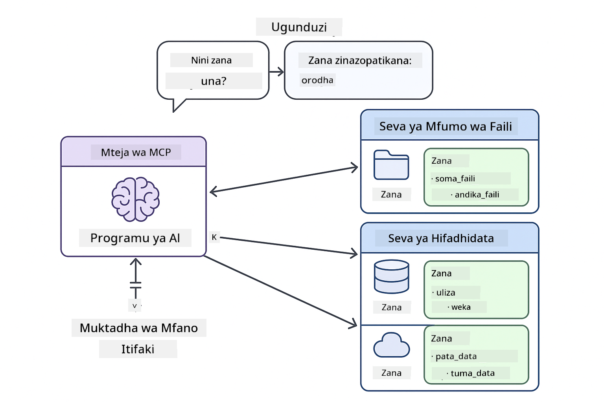
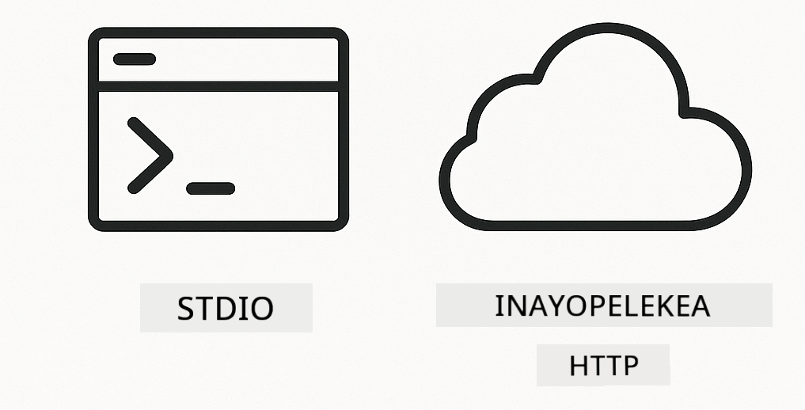
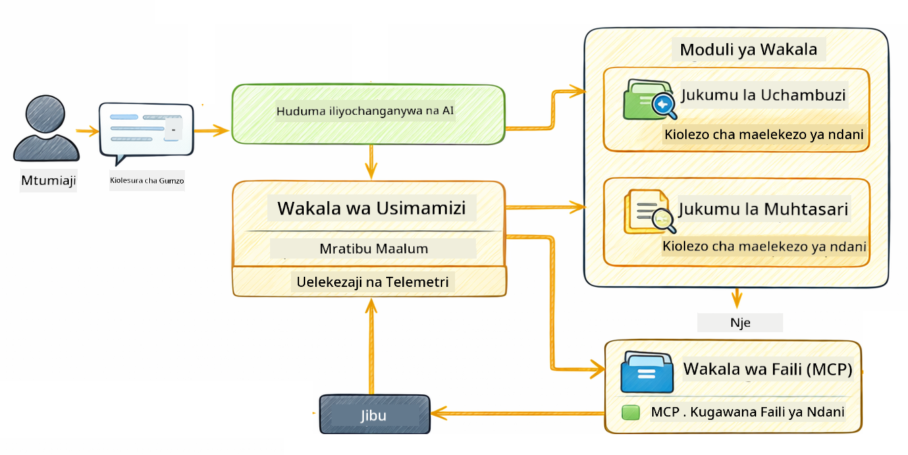

<!--
CO_OP_TRANSLATOR_METADATA:
{
  "original_hash": "f89f4c106d110e4943c055dd1a2f1dff",
  "translation_date": "2025-12-31T03:41:35+00:00",
  "source_file": "05-mcp/README.md",
  "language_code": "sw"
}
-->
# Moduli 05: Protokoli ya Muktadha wa Mfano (MCP)

## Yaliyomo

- [Utakachojifunza](../../../05-mcp)
- [MCP ni Nini?](../../../05-mcp)
- [Jinsi MCP Inavyofanya Kazi](../../../05-mcp)
- [Moduli ya Agentic](../../../05-mcp)
- [Kuendesha Mifano](../../../05-mcp)
  - [Mahitaji ya Mwanzo](../../../05-mcp)
- [Anza Haraka](../../../05-mcp)
  - [Uendeshaji wa Faili (Stdio)](../../../05-mcp)
  - [Wakala Msimamizi](../../../05-mcp)
    - [Kuelewa Matokeo](../../../05-mcp)
    - [Ufafanuzi wa Vipengele vya Moduli ya Agentic](../../../05-mcp)
- [Misingi Muhimu](../../../05-mcp)
- [Hongera!](../../../05-mcp)
  - [Nini Ifuatayo?](../../../05-mcp)

## Utakachojifunza

Umejenga AI ya mazungumzo, umeibua mbinu za kuandika maelekezo (prompts), umeweka majibu kwenye nyaraka, na umeunda mawakala wenye zana. Lakini zana zote hizo zilijengwa mahsusi kwa ajili ya programu yako maalum. Je, itakuwaje kama ungeweza kumpa AI yako ufikiaji wa mazingira ya kawaida ya zana ambazo mtu yeyote anaweza kuunda na kushiriki? Katika moduli hii, utajifunza jinsi ya kufanya hivyo kwa kutumia Protokoli ya Muktadha wa Mfano (MCP) na moduli ya agentic ya LangChain4j. Kwanza tunaonyesha msomaji wa faili wa MCP rahisi kisha tunaonyesha jinsi inavyoweza kuingizwa kwa urahisi katika mtiririko wa kazi za agentic wa hali ya juu kwa kutumia muundo wa Wakala Msimamizi.

## MCP ni Nini?

Protokoli ya Muktadha wa Mfano (MCP) inatoa hasa hilo - njia ya kawaida kwa programu za AI kugundua na kutumia zana za nje. Badala ya kuandika integrisho za kawaida kwa kila chanzo cha data au huduma, unajiunga na seva za MCP ambazo zinaonyesha uwezo wao kwa muundo thabiti. Wakala wako wa AI kisha anaweza kugundua na kutumia zana hizi moja kwa moja.


*Kabala ya MCP: Integrisho ngumu point-to-point. Baada ya MCP: Protokoli moja, uwezekano usio na kifani.*

MCP inatatua tatizo msingi katika uundaji wa AI: kila integrisho ni maalum. Unataka kufikia GitHub? Kodi maalum. Unataka kusoma faili? Kodi maalum. Unataka kuchunguza hifadhidata? Kodi maalum. Na hakuna ya integrisho hizi inafanya kazi kwa programu nyingine za AI.

MCP inafanya iwe standard. Seva ya MCP inaonyesha zana zenye maelezo wazi na schemas ya vigezo. Mteja yeyote wa MCP anaweza kuunganishwa, kugundua zana zilizopo, na kuzitumia. Jenga mara moja, tumia kila mahali.



*Miundo ya Protokoli ya Muktadha wa Mfano - ugunduo na utekelezaji wa zana uliosahihishwa*

## Jinsi MCP Inavyofanya Kazi

**Usanifu wa Seva-Mteja**

MCP inatumia modeli ya mteja-seva. Seva zinatoa zana - kusoma faili, kuchunguza hifadhidata, kupiga API. Wateja (programu yako ya AI) huungana na seva na kutumia zana zao.

Ili kutumia MCP na LangChain4j, ongeza utegemezi huu wa Maven:

```xml
<dependency>
    <groupId>dev.langchain4j</groupId>
    <artifactId>langchain4j-mcp</artifactId>
    <version>${langchain4j.version}</version>
</dependency>
```

**Ugunduzi wa Zana**

Unapomwingiza mteja wako kwa seva ya MCP, huuliza "Una zana gani?" Seva inajibu kwa orodha ya zana zinazopatikana, kila moja ikiwa na maelezo na schema za vigezo. Wakala wako wa AI kisha anaweza kuamua zana gani za kutumia kulingana na maombi ya mtumiaji.

**Mbinu za Usafirishaji**

MCP inaunga mkono mbinu tofauti za usafirishaji. Moduli hii inaonyesha usafirishaji wa Stdio kwa michakato ya eneo:



*Mbinu za usafirishaji za MCP: HTTP kwa seva za mbali, Stdio kwa michakato za eneo*

**Stdio** - [StdioTransportDemo.java](../../../05-mcp/src/main/java/com/example/langchain4j/mcp/StdioTransportDemo.java)

Kwa michakato ya eneo. Programu yako inaanzisha seva kama mchakato mdogo na kuwasiliana kupitia input/output ya kawaida. Inafaa kwa ufikiaji wa mfumo wa faili au zana za mstari wa amri.

```java
McpTransport stdioTransport = new StdioMcpTransport.Builder()
    .command(List.of(
        npmCmd, "exec",
        "@modelcontextprotocol/server-filesystem@2025.12.18",
        resourcesDir
    ))
    .logEvents(false)
    .build();
```

> **🤖 Jaribu na [GitHub Copilot](https://github.com/features/copilot) Chat:** Fungua [`StdioTransportDemo.java`](../../../05-mcp/src/main/java/com/example/langchain4j/mcp/StdioTransportDemo.java) na ulize:
> - "Stdio transport inafanya kazi vipi na ni lini nifahamu kutumia HTTP badala yake?"
> - "LangChain4j inasimamia vipi maisha ya michakato ya seva za MCP zilizoanzishwa?"
> - "Je, ni hatari gani za usalama za kumpa AI ufikiaji wa mfumo wa faili?"

## Moduli ya Agentic

Wakati MCP inatoa zana za kawaida, moduli ya **agentic** ya LangChain4j inatoa njia ya kutamka (declarative) ya kujenga mawakala wanaoandaa zana hizo. Annotation ya `@Agent` na `AgenticServices` inakuwezesha kufafanua tabia ya wakala kupitia interfaces badala ya msimbo wa amri.

Katika moduli hii, utakagua muundo wa **Wakala Msimamizi** — njia ya hali ya juu ya AI ya agentic ambapo wakala "msimamizi" huamua kwa nguvu ni wakala gani wadogo waite kwa msingi wa ombi la mtumiaji. Tutachanganya dhana zote mbili kwa kumpa moja ya mawakala wetu uwezo wa ufikiaji faili ulioendeshwa na MCP.

Ili kutumia moduli ya agentic, ongeza utegemezi huu wa Maven:

```xml
<dependency>
    <groupId>dev.langchain4j</groupId>
    <artifactId>langchain4j-agentic</artifactId>
    <version>${langchain4j.mcp.version}</version>
</dependency>
```

> **⚠️ Maajaribio:** moduli `langchain4j-agentic` ni **ya majaribio** na inaweza kubadilika. Njia thabiti ya kujenga wasaidizi wa AI inabaki `langchain4j-core` na zana maalum (Moduli 04).

## Kuendesha Mifano

### Mahitaji ya Mwanzo

- Java 21+, Maven 3.9+
- Node.js 16+ na npm (kwa seva za MCP)
- Mabadiliko ya mazingira (environment variables) yaliyowekwa katika faili `.env` (kutoka kwenye saraka kuu):
  - **Kwa StdioTransportDemo:** `GITHUB_TOKEN` (GitHub Personal Access Token)
  - **Kwa SupervisorAgentDemo:** `AZURE_OPENAI_ENDPOINT`, `AZURE_OPENAI_API_KEY`, `AZURE_OPENAI_DEPLOYMENT` (sawa na Moduli 01-04)

> **Kumbuka:** Ikiwa bado hujaunda mabadiliko yako ya mazingira, angalia [Module 00 - Quick Start](../00-quick-start/README.md) kwa maelekezo, au nakili `.env.example` kwenda `.env` katika saraka kuu na ujaze thamani zako.

## Anza Haraka

**Kutumia VS Code:** Bonyeza-kulia kwenye faili yoyote ya demo kwenye Explorer na chagua **"Run Java"**, au tumia usanidi za launch kutoka kwenye Run and Debug panel (hakikisha umeongeza token yako kwenye faili `.env` kwanza).

**Kutumia Maven:** Vinginevyo, unaweza kuendesha kutoka kwenye amri lini kwa mifano hapa chini.

### Uendeshaji wa Faili (Stdio)

Hii inaonyesha zana za msingi zinazotegemea mchakato mdogo wa eneo.

**✅ Hakuna mahitaji ya mwanzo** - seva ya MCP inaanzishwa moja kwa moja.

**Kutumia VS Code:** Bonyeza-kulia `StdioTransportDemo.java` na chagua **"Run Java"**.

**Kutumia Maven:**

**Bash:**
```bash
export GITHUB_TOKEN=your_token_here
cd 05-mcp
mvn compile exec:java -Dexec.mainClass=com.example.langchain4j.mcp.StdioTransportDemo
```

**PowerShell:**
```powershell
$env:GITHUB_TOKEN=your_token_here
cd 05-mcp
mvn --% compile exec:java -Dexec.mainClass=com.example.langchain4j.mcp.StdioTransportDemo
```

Programu inaanzisha seva ya MCP ya mfumo wa faili moja kwa moja na kusoma faili ya eneo. Angalia jinsi usimamizi wa mchakato mdogo unavyofanywa kwa niaba yako.

**Matokeo yanayotarajiwa:**
```
Assistant response: The file provides an overview of LangChain4j, an open-source Java library
for integrating Large Language Models (LLMs) into Java applications...
```

### Wakala Msimamizi




Muundo wa **Wakala Msimamizi** ni aina **inyumbulika** ya AI ya agentic. Tofauti na mtiririko wa kazi wa jinsi ilivyoelezwa (mfululizo, mizunguko, sambamba), Msimamizi hutumia LLM kuamua kwa uhuru ni wakala gani waite kulingana na ombi la mtumiaji.

**Kuchanganya Msimamizi na MCP:** Katika mfano huu, tunampa `FileAgent` ufikiaji wa zana za mfumo wa faili za MCP kupitia `toolProvider(mcpToolProvider)`. Wakati mtumiaji anaomba "soma na uchambue faili," Msimamizi huchambua ombi na kutengeneza mpango wa utekelezaji. Kisha unampeleka ombi kwa `FileAgent`, ambaye hutumia zana ya MCP `read_file` kupata yaliyomo. Msimamizi hupitisha yaliyomo kwa `AnalysisAgent` kwa tafsiri, na kwa hiari hufanya wito kwa `SummaryAgent` kuifupisha matokeo.

Hii inaonyesha jinsi zana za MCP zinavyounganishwa kwa urahisi katika mtiririko wa agentic — Msimamizi hahitaji kujua *jinsi* faili zinasomwa, ni kwamba `FileAgent` anaweza kufanya hivyo. Msimamizi hubadilika kwa nguvu kulingana na aina tofauti za maombi na hurudisha au jibu la wakala wa mwisho au muhtasari wa shughuli zote.

**Kutumia Skripti za Kuanzisha (Inayopendekezwa):**

Skripti za kuanzisha hupakia mabadiliko ya mazingira kutoka kwa faili `.env` ya saraka kuu moja kwa moja:

**Bash:**
```bash
cd 05-mcp
chmod +x start.sh
./start.sh
```

**PowerShell:**
```powershell
cd 05-mcp
.\start.ps1
```

**Kutumia VS Code:** Bonyeza-kulia `SupervisorAgentDemo.java` na chagua **"Run Java"** (hakikisha faili yako `.env` imewekwa).

**Jinsi Msimamizi Anavyofanya Kazi:**

```java
// Tambua mawakala kadhaa wenye uwezo maalum
FileAgent fileAgent = AgenticServices.agentBuilder(FileAgent.class)
        .chatModel(model)
        .toolProvider(mcpToolProvider)  // Ina zana za MCP kwa ajili ya operesheni za faili
        .build();

AnalysisAgent analysisAgent = AgenticServices.agentBuilder(AnalysisAgent.class)
        .chatModel(model)
        .build();

SummaryAgent summaryAgent = AgenticServices.agentBuilder(SummaryAgent.class)
        .chatModel(model)
        .build();

// Unda Msimamizi anayeratibu mawakala hawa
SupervisorAgent supervisor = AgenticServices.supervisorBuilder()
        .chatModel(model)  // Mfano wa "planner"
        .subAgents(fileAgent, analysisAgent, summaryAgent)
        .responseStrategy(SupervisorResponseStrategy.SUMMARY)
        .build();

// Msimamizi huamua kwa uhuru ni mawakala gani aita
// Tuma tu ombi kwa lugha ya asili - LLM inapanga utekelezaji
String response = supervisor.invoke("Read the file at /path/file.txt and analyze it");
```

Tazama [SupervisorAgentDemo.java](../../../05-mcp/src/main/java/com/example/langchain4j/mcp/SupervisorAgentDemo.java) kwa utekelezaji kamili.

> **🤖 Jaribu na [GitHub Copilot](https://github.com/features/copilot) Chat:** Fungua [`SupervisorAgentDemo.java`](../../../05-mcp/src/main/java/com/example/langchain4j/mcp/SupervisorAgentDemo.java) na ulize:
> - "Msimamizi huchagua vipi ni mawakala gani yaite?"
> - "Tofauti ya Msimamizi na mifumo ya kazi ya mfululizo ni ipi?"
> - "Ninaweza kubadilisha vipi tabia ya kupanga ya Msimamizi?"

#### Kuelewa Matokeo

Unapoendesha demo, utaona muhtasari uliopangwa wa jinsi Msimamizi anavyoandaa mawakala kadhaa. Hapa ni maana ya kila sehemu:

```
======================================================================
  SUPERVISOR AGENT DEMO
======================================================================

This demo shows how a Supervisor Agent orchestrates multiple specialized agents.
The Supervisor uses an LLM to decide which agent to call based on the task.
```

**Kichwa** kinarusha maelezo ya demo na kuelezea dhana kuu: Msimamizi anatumia LLM (si sheria zilizofungwa) kuamua mawakala ya kuita.

```
--- AVAILABLE AGENTS -------------------------------------------------
  [FILE]     FileAgent     - Reads files using MCP filesystem tools
  [ANALYZE]  AnalysisAgent - Analyzes content for structure, tone, and themes
  [SUMMARY]  SummaryAgent  - Creates concise summaries of content
```

**Mawakala Wapokeaji** yanaonyesha mawakala maalum watatu ambayo Msimamizi anaweza kuchagua. Kila wakala ana uwezo maalum:
- **FileAgent** anaweza kusoma faili kwa kutumia zana za MCP (uwezo wa nje)
- **AnalysisAgent** huchambua yaliyomo (uwezo wa LLM safi)
- **SummaryAgent** huunda muhtasari (uwezo wa LLM safi)

```
--- USER REQUEST -----------------------------------------------------
  "Read the file at .../file.txt and analyze what it's about"
```

**Ombi la Mtumiaji** linaonyesha kilichoulizwa. Msimamizi lazima alieleze na kuamua mawakala gani yaite.

```
--- SUPERVISOR ORCHESTRATION -----------------------------------------
  The Supervisor will now decide which agents to invoke and in what order...

  +-- STEP 1: Supervisor chose -> FileAgent (reading file via MCP)
  |
  |   Input: .../file.txt
  |
  |   Result: LangChain4j is an open-source Java library designed to simplify...
  +-- [OK] FileAgent (reading file via MCP) completed

  +-- STEP 2: Supervisor chose -> AnalysisAgent (analyzing content)
  |
  |   Input: LangChain4j is an open-source Java library...
  |
  |   Result: Structure: The content is organized into clear paragraphs that int...
  +-- [OK] AnalysisAgent (analyzing content) completed
```

**Utaratibu wa Msimamizi** ndiko ambapo muujiza unatokea. Angalia jinsi:
1. Msimamizi **alichagua FileAgent kwanza** kwa sababu ombi lilitaja "soma faili"
2. FileAgent alitumia zana ya MCP `read_file` kupata yaliyomo ya faili
3. Msimamizi kisha **alikagua AnalysisAgent** na kumpitisha yaliyomo ya faili
4. AnalysisAgent alichambua muundo, mtindo, na mada ziliopo

Angalia Msimamizi alifanya maamuzi haya **kwa uhuru** kulingana na ombi la mtumiaji — hakuna mtiririko uliowekwa kwa mkono!

**Jibu la Mwisho** ni jibu lililosanifiwa na Msimamizi, likijiunga na matokeo kutoka kwa mawakala yote aliowaita. Mfano unaonyesha eneo la agentic likiweka muhtasari na matokeo ya uchambuzi yaliyohifadhiwa na kila wakala.

```
--- FINAL RESPONSE ---------------------------------------------------
I read the contents of the file and analyzed its structure, tone, and key themes.
The file introduces LangChain4j as an open-source Java library for integrating
large language models...

--- AGENTIC SCOPE (Shared Memory) ------------------------------------
  Agents store their results in a shared scope for other agents to use:
  * summary: LangChain4j is an open-source Java library...
  * analysis: Structure: The content is organized into clear paragraphs that in...
```

### Ufafanuzi wa Vipengele vya Moduli ya Agentic

Mfano unaonyesha vipengele kadhaa vya hali ya juu vya moduli ya agentic. Hebu tuangalie kwa karibu Agentic Scope na Agent Listeners.

**Agentic Scope** inaonyesha kumbukumbu iliyoshirikiwa ambapo mawakala waliweka matokeo yao kwa kutumia `@Agent(outputKey="...")`. Hii inaruhusu:
- Mawakala waliokuja baadaye kufikia matokeo ya mawakala wa awali
- Msimamizi kusanisha jibu la mwisho
- Wewe kukagua kile kila wakala alichozalisha

```java
ResultWithAgenticScope<String> result = supervisor.invokeWithAgenticScope(request);
AgenticScope scope = result.agenticScope();
String story = scope.readState("story");
List<AgentInvocation> history = scope.agentInvocations("analysisAgent");
```

**Agent Listeners** zinawezesha ufuatiliaji na urekebishaji wa utekelezaji wa wakala. Matokeo ya hatua kwa hatua unayoona kwenye demo yanatokana na AgentListener inayounganika kwenye kila kuitwa kwa wakala:
- **beforeAgentInvocation** - Inaitwa wakati Msimamizi anapochagua wakala, ikikuonyesha wakala aliyechaguliwa na kwa nini
- **afterAgentInvocation** - Inaitwa wakati wakala anapo maliza, ikionyesha matokeo yake
- **inheritedBySubagents** - Wakati ni kweli, msikilizaji hufuata mawakala wote kwenye muundo wa kichwa na watoto

```java
AgentListener monitor = new AgentListener() {
    private int step = 0;
    
    @Override
    public void beforeAgentInvocation(AgentRequest request) {
        step++;
        System.out.println("  +-- STEP " + step + ": " + request.agentName());
    }
    
    @Override
    public void afterAgentInvocation(AgentResponse response) {
        System.out.println("  +-- [OK] " + response.agentName() + " completed");
    }
    
    @Override
    public boolean inheritedBySubagents() {
        return true; // Sambaza kwa mawakala wadogo wote
    }
};
```

Mbali na muundo wa Msimamizi, moduli `langchain4j-agentic` inatoa mifumo na vipengele vingi vyenye nguvu:

| Pattern | Description | Use Case |
|---------|-------------|----------|
| **Sequential** | Execute agents in order, output flows to next | Pipelines: research → analyze → report |
| **Parallel** | Run agents simultaneously | Independent tasks: weather + news + stocks |
| **Loop** | Iterate until condition met | Quality scoring: refine until score ≥ 0.8 |
| **Conditional** | Route based on conditions | Classify → route to specialist agent |
| **Human-in-the-Loop** | Add human checkpoints | Approval workflows, content review |

## Misingi Muhimu

**MCP** inafaa unapotaka kutumia mazingira ya zana zilizopo, kujenga zana ambazo programu nyingi zinaweza kushiriki, kuunganisha huduma za wahusika wengine kwa itifaki za kawaida, au kubadilisha utekelezaji wa zana bila kubadilisha msimbo.

**Moduli ya Agentic** inafanya kazi vizuri unapotaka ufafanuzi wa mawakala kupitia anotations za `@Agent`, unahitaji upangaji wa mtiririko wa kazi (mfululizo, mizunguko, sambamba), unapendelea muundo wa wakala unaotegemea interface badala ya msimbo wa amri, au unapochanganya mawakala kadhaa yanayoshiriki matokeo kupitia `outputKey`.

**Muundo wa Wakala Msimamizi** unaangaza wakati mtiririko wa kazi hauwezi kutabiriwa mapema na unataka LLM kuamua, wakati una mawakala maalum wengi yanayohitaji upangaji wa nguvu, wakati unajenga mifumo ya mazungumzo inayotuma kwa uwezo tofauti, au unapohitaji tabia ya wakala yenye kubadilika zaidi na inayobadilika.

## Hongera!

Umeisha kozi ya LangChain4j kwa Waanzilishi. Umejifunza:

- Jinsi ya kujenga AI ya mazungumzo yenye kumbukumbu (Moduli 01)
- Mbinu za uhandisi wa maelekezo kwa kazi mbalimbali (Moduli 02)
- Kuweka majibu msingi kwenye nyaraka zako kwa RAG (Moduli 03)
- Kuunda mawakala wa AI (wasaidizi) wa msingi na zana maalum (Moduli 04)
- Kuunganisha zana zilizostandadi na moduli za LangChain4j MCP na Agentic (Module 05)

### Nini Kifuatacho?

Baada ya kukamilisha moduli, chunguza the [Mwongozo wa Upimaji](../docs/TESTING.md) ili uone dhana za upimaji za LangChain4j katika vitendo.

**Rasilimali Rasmi:**
- [Nyaraka za LangChain4j](https://docs.langchain4j.dev/) - Mwongozo kamili na rejea ya API
- [GitHub ya LangChain4j](https://github.com/langchain4j/langchain4j) - Chanzo la msimbo na mifano
- [Mafunzo ya LangChain4j](https://docs.langchain4j.dev/tutorials/) - Mafunzo hatua kwa hatua kwa matumizi mbalimbali

Asante kwa kukamilisha kozi hii!

---

**Urambazaji:** [← Iliyotangulia: Moduli 04 - Zana](../04-tools/README.md) | [Rudi Kwenye Msingi](../README.md)

---

<!-- CO-OP TRANSLATOR DISCLAIMER START -->
Tamko la kutowajibika:
Nyaraka hii imetafsiriwa kwa kutumia huduma ya tafsiri ya AI Co-op Translator (https://github.com/Azure/co-op-translator). Ingawa tunajitahidi kuwa sahihi, tafadhali fahamu kwamba tafsiri za kiotomatiki zinaweza kuwa na makosa au ukosefu wa usahihi. Nyaraka ya awali katika lugha yake ya asili inapaswa kuchukuliwa kama chanzo rasmi. Kwa taarifa muhimu, tunapendekeza kutumia tafsiri ya kitaalamu iliyofanywa na mtaalamu wa kibinadamu. Hatutawajibika kwa kutoelewana au ufasiri mbaya unaotokana na matumizi ya tafsiri hii.
<!-- CO-OP TRANSLATOR DISCLAIMER END -->