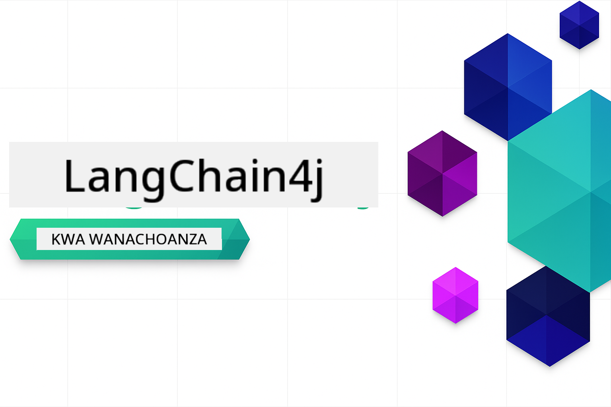

<!--
CO_OP_TRANSLATOR_METADATA:
{
  "original_hash": "d61ab6c245562094cc3dddecf08b50d3",
  "translation_date": "2025-12-31T03:38:04+00:00",
  "source_file": "README.md",
  "language_code": "sw"
}
-->


### 🌐 Msaada wa Lugha Nyingi

#### Imeungwa Mkono Kupitia GitHub Action (Imeendeshwa Kiotomatiki & Daima Imesasishwa)

<!-- CO-OP TRANSLATOR LANGUAGES TABLE START -->
[Arabic](../ar/README.md) | [Bengali](../bn/README.md) | [Bulgarian](../bg/README.md) | [Burmese (Myanmar)](../my/README.md) | [Chinese (Simplified)](../zh/README.md) | [Chinese (Traditional, Hong Kong)](../hk/README.md) | [Chinese (Traditional, Macau)](../mo/README.md) | [Chinese (Traditional, Taiwan)](../tw/README.md) | [Croatian](../hr/README.md) | [Czech](../cs/README.md) | [Danish](../da/README.md) | [Dutch](../nl/README.md) | [Estonian](../et/README.md) | [Finnish](../fi/README.md) | [French](../fr/README.md) | [German](../de/README.md) | [Greek](../el/README.md) | [Hebrew](../he/README.md) | [Hindi](../hi/README.md) | [Hungarian](../hu/README.md) | [Indonesian](../id/README.md) | [Italian](../it/README.md) | [Japanese](../ja/README.md) | [Kannada](../kn/README.md) | [Korean](../ko/README.md) | [Lithuanian](../lt/README.md) | [Malay](../ms/README.md) | [Malayalam](../ml/README.md) | [Marathi](../mr/README.md) | [Nepali](../ne/README.md) | [Nigerian Pidgin](../pcm/README.md) | [Norwegian](../no/README.md) | [Persian (Farsi)](../fa/README.md) | [Polish](../pl/README.md) | [Portuguese (Brazil)](../br/README.md) | [Portuguese (Portugal)](../pt/README.md) | [Punjabi (Gurmukhi)](../pa/README.md) | [Romanian](../ro/README.md) | [Russian](../ru/README.md) | [Serbian (Cyrillic)](../sr/README.md) | [Slovak](../sk/README.md) | [Slovenian](../sl/README.md) | [Spanish](../es/README.md) | [Swahili](./README.md) | [Swedish](../sv/README.md) | [Tagalog (Filipino)](../tl/README.md) | [Tamil](../ta/README.md) | [Telugu](../te/README.md) | [Thai](../th/README.md) | [Turkish](../tr/README.md) | [Ukrainian](../uk/README.md) | [Urdu](../ur/README.md) | [Vietnamese](../vi/README.md)
<!-- CO-OP TRANSLATOR LANGUAGES TABLE END -->

# LangChain4j kwa Waanzilishi

Kozi ya kujenga programu za AI kwa LangChain4j na Azure OpenAI GPT-5, kutoka mazungumzo ya msingi hadi maajenti wa AI.

**Mpya kwa LangChain4j?** Angalia [Kamusi](docs/GLOSSARY.md) kwa ufafanuzi wa maneno muhimu na dhana.

## Jedwali la Yaliyomo

1. [Anza Haraka](00-quick-start/README.md) - Anza na LangChain4j
2. [Utangulizi](01-introduction/README.md) - Jifunze misingi ya LangChain4j
3. [Uhandisi wa Maagizo](02-prompt-engineering/README.md) - Funda mbinu za kubuni maagizo yenye ufanisi
4. [RAG (Retrieval-Augmented Generation)](03-rag/README.md) - Jenga mifumo ya maarifa yenye akili
5. [Zana](04-tools/README.md) - Unganisha zana za nje na wasaidizi waliorahisishwa
6. [MCP (Model Context Protocol)](05-mcp/README.md) - Fanya kazi na Itifaki ya Muktadha wa Mfano (MCP) na moduli za Agentic
---

##  Njia ya Kujifunza

> **Anza Haraka**

1. Fokea hazina hii kwenye akaunti yako ya GitHub
2. Bonyeza **Code** → kichupo cha **Codespaces** → **...** → **New with options...**
3. Tumia chaguo-msingi – hii itachagua Development container iliyoundwa kwa kozi hii
4. Bonyeza **Create codespace**
5. Subiri dakika 5-10 ili mazingira yatakapokuwa tayari
6. Ruka moja kwa moja kwenye [Anza Haraka](./00-quick-start/README.md) ili kuanza!

> **Unapendelea Kufanya Clone Kwenye Kompyuta Yako?**
>
> Hazina hii inajumuisha tafsiri za lugha zaidi ya 50 ambazo zinapanua ukubwa wa kupakua kwa kiasi kikubwa. Ili kukopa bila tafsiri, tumia sparse checkout:
> ```bash
> git clone --filter=blob:none --sparse https://github.com/microsoft/LangChain4j-for-Beginners.git
> cd LangChain4j-for-Beginners
> git sparse-checkout set --no-cone '/*' '!translations' '!translated_images'
> ```
> Hii inakupa kila unachohitaji kukamilisha kozi kwa upakuaji wa kasi zaidi.

Baada ya kumaliza moduli, chunguza [Mwongozo wa Upimaji](docs/TESTING.md) ili kuona dhana za upimaji za LangChain4j zikitumika.

> **Kumbuka:** Mafunzo haya yanatumia GitHub Models na Azure OpenAI. [Anza Haraka](00-quick-start/README.md) na [MCP](05-mcp/README.md) zinatumia GitHub Models (hakuna usajili wa Azure unaohitajika), wakati moduli 1-4 zinatumia Azure OpenAI GPT-5.


## Kujifunza na GitHub Copilot

Ili kuanza kuandika msimbo haraka, fungua mradi huu katika GitHub Codespace au IDE yako ya eneo-kazi ukiwa na devcontainer uliotolewa. Devcontainer inayotumika katika kozi hii imesanifiwa awali na GitHub Copilot kwa programu ya uandishi wa msimbo kwa ushirikiano na AI.

Kila mfano wa msimbo unajumuisha maswali yaliyopendekezwa unaweza kumuuliza GitHub Copilot ili kupanua uelewa wako. Tazama vichocheo vya 💡/🤖 katika:

- **Vichwa vya faili za Java** - Maswali maalum kwa kila mfano
- **Module READMEs** - Vichocheo vya uchunguzi baada ya mifano ya msimbo

**Jinsi ya kutumia:** Fungua faili yoyote ya msimbo na muulize Copilot maswali yaliyopendekezwa. Ina muktadha kamili wa msimbo mzima na inaweza kuelezea, kupanua, na kupendekeza mbadala.

Unataka kujifunza zaidi? Angalia [Copilot for AI Paired Programming](https://aka.ms/GitHubCopilotAI).


## Rasilimali Zaidi

<!-- CO-OP TRANSLATOR OTHER COURSES START -->
### LangChain
[](https://aka.ms/langchain4j-for-beginners)
[](https://aka.ms/langchainjs-for-beginners?WT.mc_id=m365-94501-dwahlin)

---

### Azure / Edge / MCP / Maajenti
[](https://github.com/microsoft/AZD-for-beginners?WT.mc_id=academic-105485-koreyst)
[](https://github.com/microsoft/edgeai-for-beginners?WT.mc_id=academic-105485-koreyst)
[](https://github.com/microsoft/mcp-for-beginners?WT.mc_id=academic-105485-koreyst)
[](https://github.com/microsoft/ai-agents-for-beginners?WT.mc_id=academic-105485-koreyst)

---
 
### Mfululizo wa AI ya Kuzalisha
[](https://github.com/microsoft/generative-ai-for-beginners?WT.mc_id=academic-105485-koreyst)
[-9333EA?style=for-the-badge&labelColor=E5E7EB&color=9333EA)](https://github.com/microsoft/Generative-AI-for-beginners-dotnet?WT.mc_id=academic-105485-koreyst)
[-C084FC?style=for-the-badge&labelColor=E5E7EB&color=C084FC)](https://github.com/microsoft/generative-ai-for-beginners-java?WT.mc_id=academic-105485-koreyst)
[-E879F9?style=for-the-badge&labelColor=E5E7EB&color=E879F9)](https://github.com/microsoft/generative-ai-with-javascript?WT.mc_id=academic-105485-koreyst)

---
 
### Misingi ya Kujifunza
[](https://aka.ms/ml-beginners?WT.mc_id=academic-105485-koreyst)
[](https://aka.ms/datascience-beginners?WT.mc_id=academic-105485-koreyst)
[](https://aka.ms/ai-beginners?WT.mc_id=academic-105485-koreyst)
[](https://github.com/microsoft/Security-101?WT.mc_id=academic-96948-sayoung)
[](https://aka.ms/webdev-beginners?WT.mc_id=academic-105485-koreyst)
[](https://aka.ms/iot-beginners?WT.mc_id=academic-105485-koreyst)
[](https://github.com/microsoft/xr-development-for-beginners?WT.mc_id=academic-105485-koreyst)

---
 
### Mfululizo wa Copilot
[](https://aka.ms/GitHubCopilotAI?WT.mc_id=academic-105485-koreyst)
[](https://github.com/microsoft/mastering-github-copilot-for-dotnet-csharp-developers?WT.mc_id=academic-105485-koreyst)
[](https://github.com/microsoft/CopilotAdventures?WT.mc_id=academic-105485-koreyst)
<!-- CO-OP TRANSLATOR OTHER COURSES END -->

## Kupata Msaada

Iwapo utakwama au una maswali kuhusu kujenga programu za AI, jiunge na:

[](https://aka.ms/foundry/discord)

Ikiwa una maoni kuhusu bidhaa au ukikutana na makosa wakati wa kujenga, tembelea:

[](https://aka.ms/foundry/forum)

## Leseni

Leseni ya MIT - Angalia faili ya [LICENSE](../../LICENSE) kwa maelezo.

---

<!-- CO-OP TRANSLATOR DISCLAIMER START -->
**Taarifa ya kutowajibika**:
Hati hii imetafsiriwa kwa kutumia huduma ya tafsiri ya AI [Co-op Translator](https://github.com/Azure/co-op-translator). Ingawa tunajitahidi kuhakikisha usahihi, tafadhali fahamu kwamba tafsiri za kiotomatiki zinaweza kuwa na makosa au zisizo sahihi. Hati ya awali katika lugha yake ya asili inapaswa kuchukuliwa kama chanzo chenye mamlaka. Kwa taarifa muhimu, tunapendekeza tafsiri ya kitaalamu iliyofanywa na mtafsiri wa kibinadamu. Hatuwajibiki kwa uelewa mbaya au tafsiri potofu zitokanazo na matumizi ya tafsiri hii.
<!-- CO-OP TRANSLATOR DISCLAIMER END -->