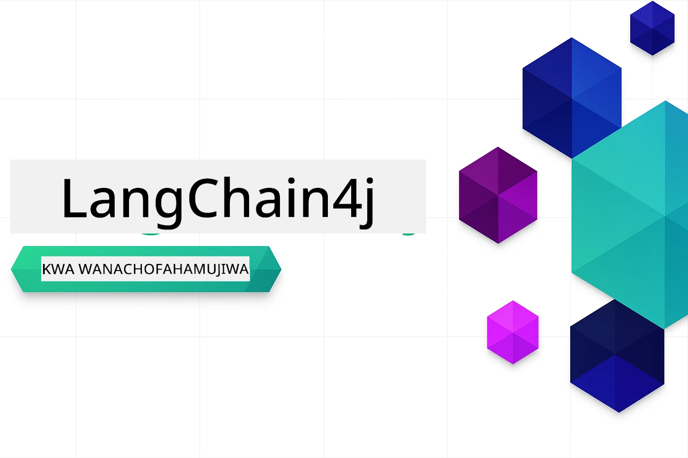

# LangChain4j kwa Waanzilishi

Kozi ya kujenga programu za AI kwa kutumia LangChain4j na Azure OpenAI GPT-5.2, kutoka mazungumzo ya msingi hadi mawakala wa AI.

### 🌐 Msaada wa Lugha Nyingi

#### Unaungwa mkono kupitia GitHub Action (Kiotomatiki & Daima Kisasa)

<!-- CO-OP TRANSLATOR LANGUAGES TABLE START -->
[Arabic](../ar/README.md) | [Bengali](../bn/README.md) | [Bulgarian](../bg/README.md) | [Burmese (Myanmar)](../my/README.md) | [Chinese (Simplified)](../zh-CN/README.md) | [Chinese (Traditional, Hong Kong)](../zh-HK/README.md) | [Chinese (Traditional, Macau)](../zh-MO/README.md) | [Chinese (Traditional, Taiwan)](../zh-TW/README.md) | [Croatian](../hr/README.md) | [Czech](../cs/README.md) | [Danish](../da/README.md) | [Dutch](../nl/README.md) | [Estonian](../et/README.md) | [Finnish](../fi/README.md) | [French](../fr/README.md) | [German](../de/README.md) | [Greek](../el/README.md) | [Hebrew](../he/README.md) | [Hindi](../hi/README.md) | [Hungarian](../hu/README.md) | [Indonesian](../id/README.md) | [Italian](../it/README.md) | [Japanese](../ja/README.md) | [Kannada](../kn/README.md) | [Khmer](../km/README.md) | [Korean](../ko/README.md) | [Lithuanian](../lt/README.md) | [Malay](../ms/README.md) | [Malayalam](../ml/README.md) | [Marathi](../mr/README.md) | [Nepali](../ne/README.md) | [Nigerian Pidgin](../pcm/README.md) | [Norwegian](../no/README.md) | [Persian (Farsi)](../fa/README.md) | [Polish](../pl/README.md) | [Portuguese (Brazil)](../pt-BR/README.md) | [Portuguese (Portugal)](../pt-PT/README.md) | [Punjabi (Gurmukhi)](../pa/README.md) | [Romanian](../ro/README.md) | [Russian](../ru/README.md) | [Serbian (Cyrillic)](../sr/README.md) | [Slovak](../sk/README.md) | [Slovenian](../sl/README.md) | [Spanish](../es/README.md) | [Swahili](./README.md) | [Swedish](../sv/README.md) | [Tagalog (Filipino)](../tl/README.md) | [Tamil](../ta/README.md) | [Telugu](../te/README.md) | [Thai](../th/README.md) | [Turkish](../tr/README.md) | [Ukrainian](../uk/README.md) | [Urdu](../ur/README.md) | [Vietnamese](../vi/README.md)

> **Unapendelea Kunakili Ndani ya Kawaida?**
>
> Hazina hii ina tafsiri za lugha zaidi ya 50 ambazo huongeza ukubwa wa pakiti ya upakuaji kwa kiasi kikubwa. Ili kunakili bila tafsiri, tumia sparse checkout:
>
> **Bash / macOS / Linux:**
> ```bash
> git clone --filter=blob:none --sparse https://github.com/microsoft/LangChain4j-for-Beginners.git
> cd LangChain4j-for-Beginners
> git sparse-checkout set --no-cone '/*' '!translations' '!translated_images'
> ```
>
> **CMD (Windows):**
> ```cmd
> git clone --filter=blob:none --sparse https://github.com/microsoft/LangChain4j-for-Beginners.git
> cd LangChain4j-for-Beginners
> git sparse-checkout set --no-cone "/*" "!translations" "!translated_images"
> ```
>
> Hii itakupa kila kitu unachohitaji kukamilisha kozi kwa upakuaji wa kasi zaidi.
<!-- CO-OP TRANSLATOR LANGUAGES TABLE END -->

## Jedwali la Maudhui

1. [Utangulizi](01-introduction/README.md) - Jifunze misingi ya LangChain4j
2. [Uhandisi wa Prompt](02-prompt-engineering/README.md) - Shanisha muundo mzuri wa prompt
3. [RAG (Uzazi ulioboreshwa kwa Utafutaji)](03-rag/README.md) - Jenga mifumo ya kielimu yenye maarifa
4. [Zana](04-tools/README.md) - Unganisha zana za nje na wasaidizi rahisi
5. [MCP (Itifaki ya Muktadha wa Mfano)](05-mcp/README.md) - Fanya kazi na Itifaki ya Muktadha wa Mfano (MCP) na moduli za Agentic

### Maelezo ya Video

Kila moduli ina kikao hai cha mwenzake ambapo tunapitia dhana na msimbo hatua kwa hatua.

| Moduli | Video |
|--------|-------|
| 01 - Utangulizi | [Kuanza na LangChain4j](https://www.youtube.com/live/nl_troDm8rQ) |
| 02 - Uhandisi wa Prompt | [Uhandisi wa Prompt kwa LangChain4j](https://www.youtube.com/live/PJ6aBaE6bog) |
| 03 - RAG | [RAG na LangChain4j](https://www.youtube.com/watch?v=_olq75ZH_eY) |
| 04 - Zana & 05 - MCP | [Mawakala wa AI pamoja na Zana na MCP](https://www.youtube.com/watch?v=O_J30kZc0rw) |

---

## Njia ya Kujifunza

**Mpya kwa LangChain4j?** Angalia [Kamusi](docs/GLOSSARY.md) kwa ufafanuzi wa maneno muhimu na dhana.

> **Anza Haraka**

1. Fanyia fork hazina hii kwenye akaunti yako ya GitHub
2. Bonyeza **Code** → kichupo cha **Codespaces** → **...** → **Mpya na chaguzi...**
3. Tumia chaguo la kawaida – hili lita chagua kontena la Maendeleo lililotengenezwa kwa ajili ya kozi hii
4. Bonyeza **Create codespace**
5. Subiri dakika 5-10 mazingira yawe tayari
6. Nenda moja kwa moja hadi [Utangulizi](./01-introduction/README.md) kuanza!

Baada ya kumaliza moduli, chunguza [Mwongozo wa Upimaji](docs/TESTING.md) kuona dhana za kupima LangChain4j katika utekelezaji.

> **Kumbuka:** Mafunzo haya yanatumia Azure OpenAI. Anza na akaunti ya bure ya [Azure](https://aka.ms/azure-free-account) ikiwa huna moja.

## Kujifunza na GitHub Copilot

Ili kuanza kuandika msimbo haraka, fungua mradi huu katika GitHub Codespace au IDE yako ya ndani ukiwa na devcontainer iliyotolewa. Devcontainer inayotumika katika kozi hii imewekwa tayari na GitHub Copilot kwa ajili ya programu ya AI iliyoambatana.

Kila mfano wa msimbo una maswali yaliyopendekezwa ambayo unaweza kumuuliza GitHub Copilot ili kuelewa zaidi. Tafuta dalili za 💡/🤖 katika:

- **Mada za faili za Java** - Maswali maalum kwa kila mfano
- **README za moduli** - Dalili za uchunguzi baada ya mifano ya msimbo

**Jinsi ya kutumia:** Fungua faili yoyote ya msimbo na muulize Copilot maswali yaliyopendekezwa. Ina muktadha mzima wa misimbo na inaweza kuelezea, kuongeza, na kupendekeza mbadala.

Unataka kujifunza zaidi? Angalia [Copilot kwa Programu ya AI iliyoambatana](https://aka.ms/GitHubCopilotAI).

## Vyanzo Vya Ziada

<!-- CO-OP TRANSLATOR OTHER COURSES START -->
### LangChain
[](https://aka.ms/langchain4j-for-beginners)
[](https://aka.ms/langchainjs-for-beginners?WT.mc_id=m365-94501-dwahlin)
[](https://github.com/microsoft/langchain-for-beginners?WT.mc_id=m365-94501-dwahlin)
---

### Azure / Edge / MCP / Mawakala
[](https://github.com/microsoft/AZD-for-beginners?WT.mc_id=academic-105485-koreyst)
[](https://github.com/microsoft/edgeai-for-beginners?WT.mc_id=academic-105485-koreyst)
[](https://github.com/microsoft/mcp-for-beginners?WT.mc_id=academic-105485-koreyst)
[](https://github.com/microsoft/ai-agents-for-beginners?WT.mc_id=academic-105485-koreyst)

---
 
### Mfululizo wa AI Inayozalisha
[](https://github.com/microsoft/generative-ai-for-beginners?WT.mc_id=academic-105485-koreyst)
[-9333EA?style=for-the-badge&labelColor=E5E7EB&color=9333EA)](https://github.com/microsoft/Generative-AI-for-beginners-dotnet?WT.mc_id=academic-105485-koreyst)
[-C084FC?style=for-the-badge&labelColor=E5E7EB&color=C084FC)](https://github.com/microsoft/generative-ai-for-beginners-java?WT.mc_id=academic-105485-koreyst)
[-E879F9?style=for-the-badge&labelColor=E5E7EB&color=E879F9)](https://github.com/microsoft/generative-ai-with-javascript?WT.mc_id=academic-105485-koreyst)

---
 
### Kujifunza Msingi
[](https://aka.ms/ml-beginners?WT.mc_id=academic-105485-koreyst)
[](https://aka.ms/datascience-beginners?WT.mc_id=academic-105485-koreyst)
[](https://aka.ms/ai-beginners?WT.mc_id=academic-105485-koreyst)
[](https://github.com/microsoft/Security-101?WT.mc_id=academic-96948-sayoung)
[](https://aka.ms/webdev-beginners?WT.mc_id=academic-105485-koreyst)
[](https://aka.ms/iot-beginners?WT.mc_id=academic-105485-koreyst)
[](https://github.com/microsoft/xr-development-for-beginners?WT.mc_id=academic-105485-koreyst)

---
 
### Mfululizo wa Copilot
[](https://aka.ms/GitHubCopilotAI?WT.mc_id=academic-105485-koreyst)
[](https://github.com/microsoft/mastering-github-copilot-for-dotnet-csharp-developers?WT.mc_id=academic-105485-koreyst)
[](https://github.com/microsoft/CopilotAdventures?WT.mc_id=academic-105485-koreyst)
<!-- CO-OP TRANSLATOR OTHER COURSES END -->

## Kupata Msaada

Kama utashindwa au una maswali kuhusu ujenzi wa programu za AI, jiunge:

[](https://aka.ms/foundry/discord)

Kama una maoni kuhusu bidhaa au makosa wakati wa ujenzi tembelea:

[](https://aka.ms/foundry/forum)

## Leseni

Leseni ya MIT - Angalia faili la [LICENSE](../../LICENSE) kwa maelezo.

---

<!-- CO-OP TRANSLATOR DISCLAIMER START -->
**Kionyozo**:
Hati hii imetafsiriwa kwa kutumia huduma ya tafsiri ya AI [Co-op Translator](https://github.com/Azure/co-op-translator). Ingawa tunajitahidi kupata usahihi, tafadhali fahamu kwamba tafsiri za kiotomatiki zinaweza kuwa na makosa au upungufu wa usahihi. Hati ya asili katika lugha yake halisi inapaswa kuchukuliwa kama chanzo cha mamlaka. Kwa taarifa muhimu, tafsiri ya kitaalamu inayofanywa na binadamu inapendekezwa. Hatutojibu kwa kuelewa vibaya au tafsiri potofu zinazotokea kutokana na matumizi ya tafsiri hii.
<!-- CO-OP TRANSLATOR DISCLAIMER END -->