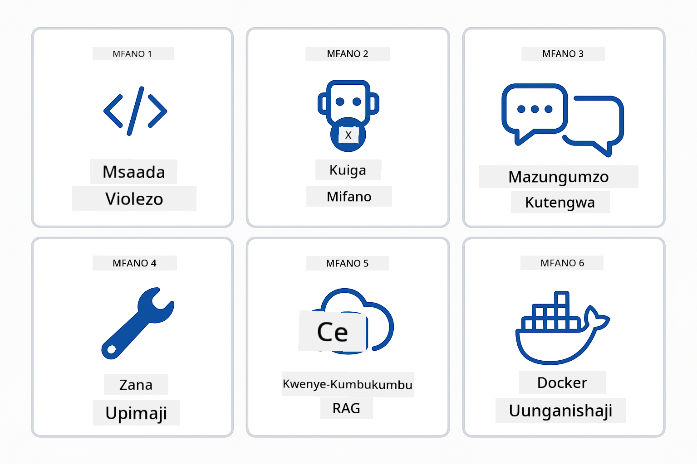
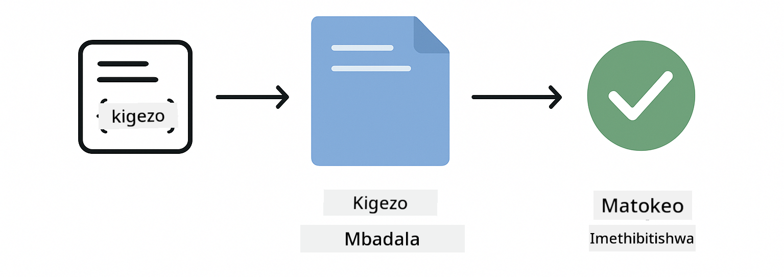
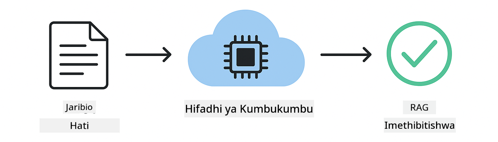

<!--
CO_OP_TRANSLATOR_METADATA:
{
  "original_hash": "b975537560c404d5f254331832811e78",
  "translation_date": "2025-12-13T21:17:45+00:00",
  "source_file": "docs/TESTING.md",
  "language_code": "sw"
}
-->
# Kupima Programu za LangChain4j

## Jedwali la Yaliyomo

- [Anza Haraka](../../../docs)
- [Mambo Yanayofunikwa na Vipimo](../../../docs)
- [Kukimbia Vipimo](../../../docs)
- [Kukimbia Vipimo katika VS Code](../../../docs)
- [Mifumo ya Kupima](../../../docs)
- [Falsafa ya Kupima](../../../docs)
- [Hatua Zifuatazo](../../../docs)

Mwongozo huu unakuongoza kupitia vipimo vinavyoonyesha jinsi ya kupima programu za AI bila kuhitaji funguo za API au huduma za nje.

## Anza Haraka

Kimbia vipimo vyote kwa amri moja:

**Bash:**
```bash
mvn test
```

**PowerShell:**
```powershell
mvn --% test
```


*Utekelezaji wa mafanikio wa vipimo unaoonyesha vipimo vyote vikipita bila kushindwa*

## Mambo Yanayofunikwa na Vipimo

Kozi hii inalenga kwenye **vipimo vya kitengo** vinavyokimbia kwa ndani. Kila kipimo kinaonyesha dhana maalum ya LangChain4j kwa upweke.


*Piramidi ya upimaji inaonyesha usawa kati ya vipimo vya kitengo (haraka, peke yake), vipimo vya muunganiko (vipengele halisi), na vipimo vya mwisho-mwisho (mfumo kamili na Docker). Mafunzo haya yanahusu upimaji wa kitengo.*

| Moduli | Vipimo | Lengo | Faili Muhimu |
|--------|--------|-------|--------------|
| **00 - Anza Haraka** | 6 | Mifano ya maelekezo na uingizaji wa vigezo | `SimpleQuickStartTest.java` |
| **01 - Utangulizi** | 8 | Kumbukumbu ya mazungumzo na mazungumzo yenye hali | `SimpleConversationTest.java` |
| **02 - Uhandisi wa Maelekezo** | 12 | Mifumo ya GPT-5, viwango vya hamu, matokeo yaliyopangwa | `SimpleGpt5PromptTest.java` |
| **03 - RAG** | 10 | Kuingiza hati, embeddings, utafutaji wa mfanano | `DocumentServiceTest.java` |
| **04 - Zana** | 12 | Kupiga simu za kazi na mnyororo wa zana | `SimpleToolsTest.java` |
| **05 - MCP** | 15 | Itifaki ya Muktadha wa Mfano na Docker | `SimpleMcpTest.java`, `McpDockerTransportTest.java` |

## Kukimbia Vipimo

**Kimbia vipimo vyote kutoka mzizi:**

**Bash:**
```bash
mvn test
```

**PowerShell:**
```powershell
mvn --% test
```

**Kimbia vipimo vya moduli maalum:**

**Bash:**
```bash
cd 01-introduction && mvn test
# Au kutoka mzizi
mvn test -pl 01-introduction
```

**PowerShell:**
```powershell
cd 01-introduction; mvn --% test
# Au kutoka mzizi
mvn --% test -pl 01-introduction
```

**Kimbia darasa moja la kipimo:**

**Bash:**
```bash
mvn test -Dtest=SimpleConversationTest
```

**PowerShell:**
```powershell
mvn --% test -Dtest=SimpleConversationTest
```

**Kimbia njia maalum ya kipimo:**

**Bash:**
```bash
mvn test -Dtest=SimpleConversationTest#inapaswaKuwekaHistoriaYaMazungumzo
```

**PowerShell:**
```powershell
mvn --% test -Dtest=SimpleConversationTest#inapaswaKuwekaHifadhiYaMazungumzo
```

## Kukimbia Vipimo katika VS Code

Ikiwa unatumia Visual Studio Code, Test Explorer hutoa kiolesura cha picha kwa ajili ya kukimbia na kufuatilia vipimo.


*Test Explorer ya VS Code inaonyesha mti wa vipimo vyote vya darasa la Java na njia za vipimo binafsi*

**Kukimbia vipimo katika VS Code:**

1. Fungua Test Explorer kwa kubofya ikoni ya beaker kwenye Ukanda wa Shughuli
2. Panua mti wa vipimo kuona moduli zote na madarasa ya vipimo
3. Bonyeza kitufe cha kucheza kando ya kipimo chochote kukimbia binafsi
4. Bonyeza "Run All Tests" kutekeleza seti nzima
5. Bonyeza kulia kipimo chochote na chagua "Debug Test" kuweka alama za kuvunja na kupita kupitia msimbo

Test Explorer inaonyesha alama za kijani kwa vipimo vinavyopita na hutoa ujumbe wa kina wa kushindwa wakati vipimo vinashindwa.

## Mifumo ya Kupima



*Mifumo sita ya kupima kwa programu za LangChain4j: mifano ya maelekezo, kuiga mifano ya lugha, upweke wa mazungumzo, upimaji wa zana, RAG ya ndani ya kumbukumbu, na muunganiko wa Docker*

### Mfano 1: Kupima Mifano ya Maelekezo

Mfano rahisi hupima mifano ya maelekezo bila kupiga simu kwa mfano wowote wa AI. Unathibitisha kuwa uingizaji wa vigezo unafanya kazi vizuri na maelekezo yamepangwa kama inavyotarajiwa.



*Kupima mifano ya maelekezo inaonyesha mtiririko wa uingizaji wa vigezo: kiolezo chenye sehemu za kujaza → thamani zimetumika → matokeo yaliyopangwa yamehakikiwa*

```java
@Test
@DisplayName("Should format prompt template with variables")
void testPromptTemplateFormatting() {
    PromptTemplate template = PromptTemplate.from(
        "Best time to visit {{destination}} for {{activity}}?"
    );
    
    Prompt prompt = template.apply(Map.of(
        "destination", "Paris",
        "activity", "sightseeing"
    ));
    
    assertThat(prompt.text()).isEqualTo("Best time to visit Paris for sightseeing?");
}
```

Kipimo hiki kiko katika `00-quick-start/src/test/java/com/example/langchain4j/quickstart/SimpleQuickStartTest.java`.

**Kimbia:**

**Bash:**
```bash
cd 00-quick-start && mvn test -Dtest=SimpleQuickStartTest#jaribioLaMuundoWaKiolezoChaOmbi
```

**PowerShell:**
```powershell
cd 00-quick-start; mvn --% test -Dtest=SimpleQuickStartTest#jaribioLaMuundoWaKiolezoChaOmbi
```

### Mfano 2: Kuiga Mifano ya Lugha

Unapopima mantiki ya mazungumzo, tumia Mockito kuunda mifano bandia inayorudisha majibu yaliyopangwa. Hii hufanya vipimo kuwa vya haraka, bure, na vinavyotarajiwa.


*Ulinganisho unaoonyesha kwa nini kuiga ni bora kwa upimaji: ni haraka, bure, vinavyotarajiwa, na havihitaji funguo za API*

```java
@ExtendWith(MockitoExtension.class)
class SimpleConversationTest {
    
    private ConversationService conversationService;
    
    @Mock
    private OpenAiOfficialChatModel mockChatModel;
    
    @BeforeEach
    void setUp() {
        ChatResponse mockResponse = ChatResponse.builder()
            .aiMessage(AiMessage.from("This is a test response"))
            .build();
        when(mockChatModel.chat(anyList())).thenReturn(mockResponse);
        
        conversationService = new ConversationService(mockChatModel);
    }
    
    @Test
    void shouldMaintainConversationHistory() {
        String conversationId = conversationService.startConversation();
        
        ChatResponse mockResponse1 = ChatResponse.builder()
            .aiMessage(AiMessage.from("Response 1"))
            .build();
        ChatResponse mockResponse2 = ChatResponse.builder()
            .aiMessage(AiMessage.from("Response 2"))
            .build();
        ChatResponse mockResponse3 = ChatResponse.builder()
            .aiMessage(AiMessage.from("Response 3"))
            .build();
        
        when(mockChatModel.chat(anyList()))
            .thenReturn(mockResponse1)
            .thenReturn(mockResponse2)
            .thenReturn(mockResponse3);

        conversationService.chat(conversationId, "First message");
        conversationService.chat(conversationId, "Second message");
        conversationService.chat(conversationId, "Third message");

        List<ChatMessage> history = conversationService.getHistory(conversationId);
        assertThat(history).hasSize(6); // Ujumbe 3 za mtumiaji + 3 za AI
    }
}
```

Mfano huu unaonekana katika `01-introduction/src/test/java/com/example/langchain4j/service/SimpleConversationTest.java`. Kuiga kunahakikisha tabia thabiti ili uweze kuthibitisha usimamizi wa kumbukumbu unafanya kazi vizuri.

### Mfano 3: Kupima Upekee wa Mazungumzo

Kumbukumbu ya mazungumzo lazima iweke watumiaji wengi tofauti. Kipimo hiki kinathibitisha kuwa mazungumzo hayaingiliani muktadha.


*Kupima upekee wa mazungumzo unaonyesha hifadhi za kumbukumbu tofauti kwa watumiaji tofauti ili kuzuia mchanganyiko wa muktadha*

```java
@Test
void shouldIsolateConversationsByid() {
    String conv1 = conversationService.startConversation();
    String conv2 = conversationService.startConversation();
    
    ChatResponse mockResponse = ChatResponse.builder()
        .aiMessage(AiMessage.from("Response"))
        .build();
    when(mockChatModel.chat(anyList())).thenReturn(mockResponse);

    conversationService.chat(conv1, "Message for conversation 1");
    conversationService.chat(conv2, "Message for conversation 2");

    List<ChatMessage> history1 = conversationService.getHistory(conv1);
    List<ChatMessage> history2 = conversationService.getHistory(conv2);
    
    assertThat(history1).hasSize(2);
    assertThat(history2).hasSize(2);
}
```

Kila mazungumzo huweka historia yake huru. Katika mifumo ya uzalishaji, upekee huu ni muhimu kwa programu za watumiaji wengi.

### Mfano 4: Kupima Zana Kwa Kujitegemea

Zana ni kazi ambazo AI inaweza kupiga simu. Zipime moja kwa moja kuhakikisha zinafanya kazi vizuri bila kujali maamuzi ya AI.


*Kupima zana kwa kujitegemea kuonyesha utekelezaji wa zana bandia bila simu za AI kuthibitisha mantiki ya biashara*

```java
@Test
void shouldConvertCelsiusToFahrenheit() {
    TemperatureTool tempTool = new TemperatureTool();
    String result = tempTool.celsiusToFahrenheit(25.0);
    assertThat(result).containsPattern("77[.,]0°F");
}

@Test
void shouldDemonstrateToolChaining() {
    WeatherTool weatherTool = new WeatherTool();
    TemperatureTool tempTool = new TemperatureTool();

    String weatherResult = weatherTool.getCurrentWeather("Seattle");
    assertThat(weatherResult).containsPattern("\\d+°C");

    String conversionResult = tempTool.celsiusToFahrenheit(22.0);
    assertThat(conversionResult).containsPattern("71[.,]6°F");
}
```

Vipimo hivi kutoka `04-tools/src/test/java/com/example/langchain4j/agents/tools/SimpleToolsTest.java` vinathibitisha mantiki ya zana bila ushiriki wa AI. Mfano wa mnyororo unaonyesha jinsi matokeo ya zana moja yanavyoingia kama pembejeo kwa nyingine.

### Mfano 5: Upimaji wa RAG Ndani ya Kumbukumbu

Mifumo ya RAG kawaida huhitaji hifadhidata za vekta na huduma za embedding. Mfano wa ndani ya kumbukumbu unakuwezesha kupima mchakato mzima bila utegemezi wa nje.



*Mtiririko wa upimaji wa RAG ndani ya kumbukumbu unaonyesha uchambuzi wa hati, uhifadhi wa embedding, na utafutaji wa mfanano bila kuhitaji hifadhidata*

```java
@Test
void testProcessTextDocument() {
    String content = "This is a test document.\nIt has multiple lines.";
    InputStream inputStream = new ByteArrayInputStream(content.getBytes(StandardCharsets.UTF_8));
    
    DocumentService.ProcessedDocument result = 
        documentService.processDocument(inputStream, "test.txt");

    assertNotNull(result);
    assertTrue(result.segments().size() > 0);
    assertEquals("test.txt", result.segments().get(0).metadata().getString("filename"));
}
```

Kipimo hiki kutoka `03-rag/src/test/java/com/example/langchain4j/rag/service/DocumentServiceTest.java` kinaunda hati ndani ya kumbukumbu na kuthibitisha kugawanya vipande na usimamizi wa metadata.

### Mfano 6: Upimaji wa Muunganiko na Docker

Baadhi ya vipengele vinahitaji miundombinu halisi. Moduli ya MCP inatumia Testcontainers kuanzisha kontena za Docker kwa vipimo vya muunganiko. Hivi vinathibitisha msimbo wako unafanya kazi na huduma halisi huku ukidumisha upekee wa vipimo.


*Upimaji wa muunganiko wa MCP na Testcontainers unaonyesha mzunguko wa maisha wa kontena: anzisha, kimbia kipimo, simamisha, na safisha*

Vipimo katika `05-mcp/src/test/java/com/example/langchain4j/mcp/McpDockerTransportTest.java` vinahitaji Docker iwe inakimbia.

**Kimbia:**

**Bash:**
```bash
cd 05-mcp && mvn test
```

**PowerShell:**
```powershell
cd 05-mcp; mvn --% test
```

## Falsafa ya Kupima

Pima msimbo wako, si AI. Vipimo vyako vinapaswa kuthibitisha msimbo unaouandika kwa kuangalia jinsi maelekezo yanavyotengenezwa, jinsi kumbukumbu inavyosimamiwa, na jinsi zana zinavyotekelezwa. Majibu ya AI hubadilika na hayapaswi kuwa sehemu ya uthibitisho wa vipimo. Jiulize kama kiolezo chako cha maelekezo kinabadilisha vigezo vizuri, si kama AI inatoa jibu sahihi.

Tumia kuiga kwa mifano ya lugha. Ni utegemezi wa nje ambao ni polepole, ghali, na usioweza kutabirika. Kuiga hufanya vipimo kuwa vya haraka kwa millisekunde badala ya sekunde, bure bila gharama za API, na vinavyotarajiwa kwa matokeo sawa kila mara.

Dumisha uhuru wa vipimo. Kila kipimo kinapaswa kuandaa data yake, kisitegemee vipimo vingine, na kusafisha baada ya kukimbia. Vipimo vinapaswa kupita bila kujali mpangilio wa utekelezaji.

Pima kesi za pembe zaidi ya njia ya furaha. Jaribu pembejeo tupu, pembejeo kubwa sana, herufi maalum, vigezo batili, na masharti ya mipaka. Hivi mara nyingi huonyesha hitilafu ambazo matumizi ya kawaida hayazionyeshi.

Tumia majina yenye maelezo. Linganisha `shouldMaintainConversationHistoryAcrossMultipleMessages()` na `test1()`. Ya kwanza inakuambia hasa kinachopimwa, na kufanya utambuzi wa makosa kuwa rahisi zaidi.

## Hatua Zifuatazo

Sasa unapoelewa mifumo ya upimaji, chunguza kwa kina kila moduli:

- **[00 - Anza Haraka](../00-quick-start/README.md)** - Anza na misingi ya mifano ya maelekezo
- **[01 - Utangulizi](../01-introduction/README.md)** - Jifunze usimamizi wa kumbukumbu ya mazungumzo
- **[02 - Uhandisi wa Maelekezo](../02-prompt-engineering/README.md)** - Jifunze mifumo ya kuamsha GPT-5
- **[03 - RAG](../03-rag/README.md)** - Jenga mifumo ya kizazi iliyoongezwa na utafutaji
- **[04 - Zana](../04-tools/README.md)** - Tekeleza kupiga simu za kazi na mnyororo wa zana
- **[05 - MCP](../05-mcp/README.md)** - Unganisha Itifaki ya Muktadha wa Mfano na Docker

README ya kila moduli hutoa maelezo ya kina ya dhana zinazopimwa hapa.

---

**Uvinjari:** [← Rudi Kwenye Kuu](../README.md)

---

<!-- CO-OP TRANSLATOR DISCLAIMER START -->
**Kiarifu cha Kutotegemea**:
Hati hii imetafsiriwa kwa kutumia huduma ya tafsiri ya AI [Co-op Translator](https://github.com/Azure/co-op-translator). Ingawa tunajitahidi kwa usahihi, tafadhali fahamu kwamba tafsiri za kiotomatiki zinaweza kuwa na makosa au upungufu wa usahihi. Hati ya asili katika lugha yake ya asili inapaswa kuchukuliwa kama chanzo cha mamlaka. Kwa taarifa muhimu, tafsiri ya kitaalamu ya binadamu inapendekezwa. Hatuna dhamana kwa kutoelewana au tafsiri potofu zinazotokana na matumizi ya tafsiri hii.
<!-- CO-OP TRANSLATOR DISCLAIMER END -->