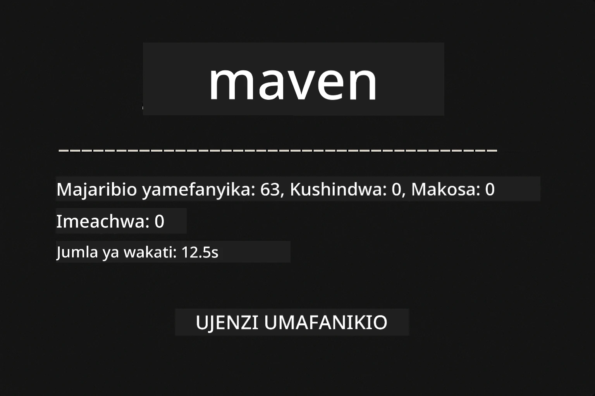
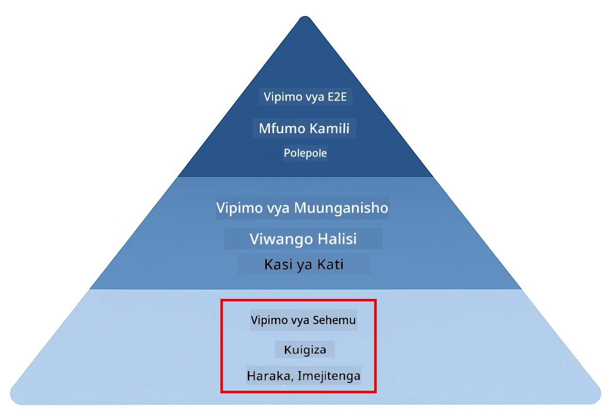
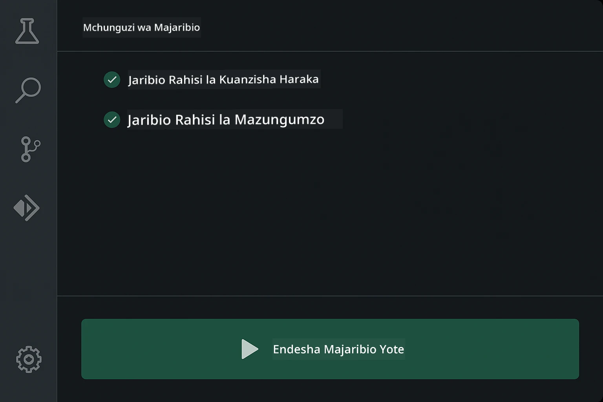
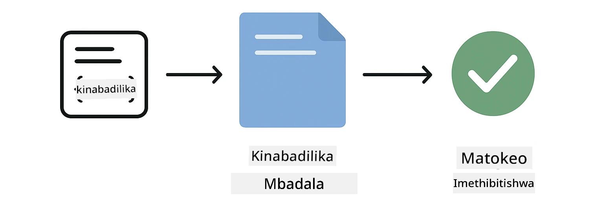
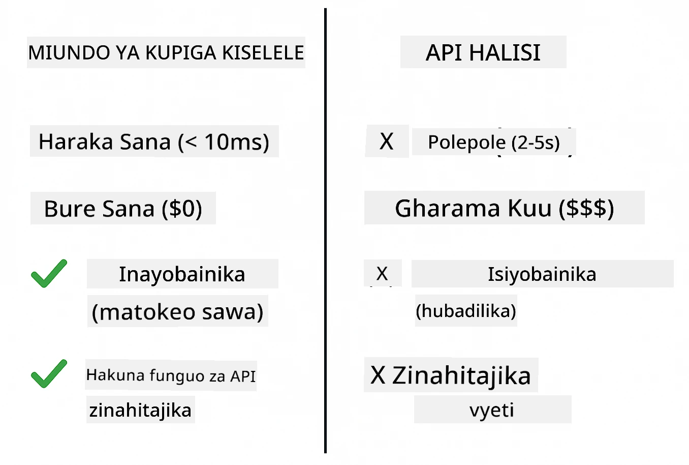
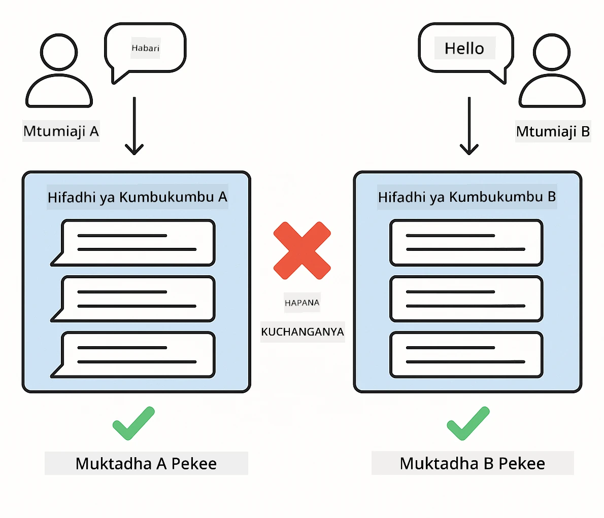
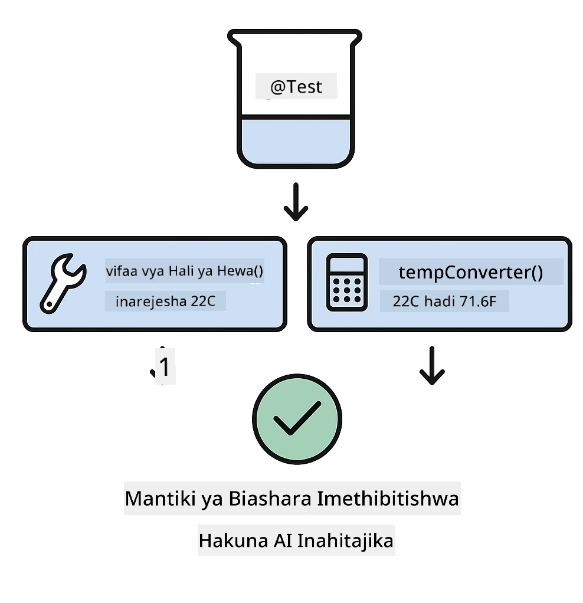

<!--
CO_OP_TRANSLATOR_METADATA:
{
  "original_hash": "ed93b3c14d58734ac10162967da958c1",
  "translation_date": "2025-12-31T03:50:46+00:00",
  "source_file": "docs/TESTING.md",
  "language_code": "sw"
}
-->
# Kupima Programu za LangChain4j

## Yaliyomo

- [Anza Haraka](../../../docs)
- [Nini Majaribio Yanayofunika](../../../docs)
- [Kuendesha Majaribio](../../../docs)
- [Kuendesha Majaribio katika VS Code](../../../docs)
- [Mifumo ya Kupima](../../../docs)
- [Falsafa ya Kupima](../../../docs)
- [Hatua Zifuatazo](../../../docs)

Mwongozo huu unakuongoza kupitia majaribio ambayo yanaonyesha jinsi ya kupima programu za AI bila kuhitaji funguo za API au huduma za nje.

## Quick Start

Endesha majaribio yote kwa amri moja:

**Bash:**
```bash
mvn test
```

**PowerShell:**
```powershell
mvn --% test
```



*Uendeshaji wa majaribio uliofanikiwa unaonyesha majaribio yote yamefaulu bila kushindwa*

## Nini Majaribio Yanayofunika

Kozi hii inalenga kwenye **majaribio ya kitengo** yanayoendesha kwa ndani. Kila jaribio linaonyesha dhana maalum ya LangChain4j kwa upweke.



*Piramidi ya kupima ikionyesha uwiano kati ya majaribio ya kitengo (haraka, yaliyo pekee), majaribio ya kuunganisha (vifaa halisi), na majaribio ya mwisho-mwisho. Mafunzo haya yanashughulikia upimaji wa kitengo.*

| Moduli | Majaribio | Lengo | Faili Muhimu |
|--------|-------|-------|-----------|
| **00 - Anza Haraka** | 6 | Mifano ya prompt na uingizaji wa vigezo | `SimpleQuickStartTest.java` |
| **01 - Utangulizi** | 8 | Kumbukumbu za mazungumzo na chat zinazohifadhi hali | `SimpleConversationTest.java` |
| **02 - Uhandisi wa Prompt** | 12 | Mifumo ya GPT-5, viwango vya utoaji, na matokeo yaliyopangwa | `SimpleGpt5PromptTest.java` |
| **03 - RAG** | 10 | Kuingiza nyaraka, embeddings, na utafutaji wa ufananisho | `DocumentServiceTest.java` |
| **04 - Zana** | 12 | Kuitwa kwa kazi na kuunganisha zana | `SimpleToolsTest.java` |
| **05 - MCP** | 8 | Itifaki ya Muktadha wa Modeli kwa usafirishaji wa Stdio | `SimpleMcpTest.java` |

## Kuendesha Majaribio

**Endesha majaribio yote kutoka mzizi:**

**Bash:**
```bash
mvn test
```

**PowerShell:**
```powershell
mvn --% test
```

**Endesha majaribio kwa moduli maalum:**

**Bash:**
```bash
cd 01-introduction && mvn test
# Au kutoka kwenye mzizi
mvn test -pl 01-introduction
```

**PowerShell:**
```powershell
cd 01-introduction; mvn --% test
# Au kutoka mzizi
mvn --% test -pl 01-introduction
```

**Endesha darasa moja la majaribio:**

**Bash:**
```bash
mvn test -Dtest=SimpleConversationTest
```

**PowerShell:**
```powershell
mvn --% test -Dtest=SimpleConversationTest
```

**Endesha njia maalum ya jaribio:**

**Bash:**
```bash
mvn test -Dtest=SimpleConversationTest#inapaswa kuhifadhi historia ya mazungumzo
```

**PowerShell:**
```powershell
mvn --% test -Dtest=SimpleConversationTest#inapaswa kudumisha historia ya mazungumzo
```

## Kuendesha Majaribio katika VS Code

Ikiwa unatumia Visual Studio Code, Test Explorer hutoa kiolesura cha picha kwa kuendesha na kutatua majaribio.



*Kichunguzi cha Majaribio cha VS Code kinachoonyesha muundo wa majaribio pamoja na madarasa yote ya majaribio ya Java na njia binafsi za majaribio*

**Ili kuendesha majaribio katika VS Code:**

1. Fungua Test Explorer kwa kubofya ikoni ya beaker kwenye Activity Bar
2. Panua muundo wa majaribio kuona moduli zote na madarasa ya majaribio
3. Bonyeza kitufe cha kucheza kando ya jaribio lolote ili kuliendesha kwa undani
4. Bonyeza "Run All Tests" kuendesha seti nzima
5. Bonyeza kulia jaribio lolote na chagua "Debug Test" kuweka breakpoints na kupita hatua kwa hatua kupitia msimbo

Test Explorer inaonyesha alama za tick za kijani kwa majaribio yaliyopita na inatoa ujumbe wa kina wa hitilafu wakati majaribio yanashindwa.

## Mifumo ya Kupima

### Mfano 1: Kupima Mifano ya Prompt

Mfano rahisi hujaribu mifano ya prompt bila kuita modeli yoyote ya AI. Unahakiki kwamba uingizaji wa vigezo unafanya kazi ipasavyo na prompts zimepangwa kama inavyotarajiwa.



*Kupima mifano ya prompt kuonyesha mchakato wa uingizaji wa vigezo: template yenye nafasi za vigezo → thamani zinawekwa → pato lililopangwa linaridhiwa*

```java
@Test
@DisplayName("Should format prompt template with variables")
void testPromptTemplateFormatting() {
    PromptTemplate template = PromptTemplate.from(
        "Best time to visit {{destination}} for {{activity}}?"
    );
    
    Prompt prompt = template.apply(Map.of(
        "destination", "Paris",
        "activity", "sightseeing"
    ));
    
    assertThat(prompt.text()).isEqualTo("Best time to visit Paris for sightseeing?");
}
```

Jaribio hili lipo katika `00-quick-start/src/test/java/com/example/langchain4j/quickstart/SimpleQuickStartTest.java`.

**Endesha:**

**Bash:**
```bash
cd 00-quick-start && mvn test -Dtest=SimpleQuickStartTest#Uwekaji wa muundo wa kiolezo cha ombi la jaribio
```

**PowerShell:**
```powershell
cd 00-quick-start; mvn --% test -Dtest=SimpleQuickStartTest#Jaribio la ufomati wa kiolezo cha ombi
```

### Mfano 2: Kumocha Modeli za Lugha

Unapotumia mantiki ya mazungumzo, tumia Mockito kuunda modeli bandia ambazo zinarudisha majibu yaliyopangwa. Hii inafanya majaribio kuwa ya haraka, ya bure, na yasiyotabirika.



*Ulinganisho unaoonyesha kwanini mocks zinapendekezwa kwa upimaji: ni haraka, haziitaji malipo, zina matokeo thabiti, na hazihitaji funguo za API*

```java
@ExtendWith(MockitoExtension.class)
class SimpleConversationTest {
    
    private ConversationService conversationService;
    
    @Mock
    private OpenAiOfficialChatModel mockChatModel;
    
    @BeforeEach
    void setUp() {
        ChatResponse mockResponse = ChatResponse.builder()
            .aiMessage(AiMessage.from("This is a test response"))
            .build();
        when(mockChatModel.chat(anyList())).thenReturn(mockResponse);
        
        conversationService = new ConversationService(mockChatModel);
    }
    
    @Test
    void shouldMaintainConversationHistory() {
        String conversationId = conversationService.startConversation();
        
        ChatResponse mockResponse1 = ChatResponse.builder()
            .aiMessage(AiMessage.from("Response 1"))
            .build();
        ChatResponse mockResponse2 = ChatResponse.builder()
            .aiMessage(AiMessage.from("Response 2"))
            .build();
        ChatResponse mockResponse3 = ChatResponse.builder()
            .aiMessage(AiMessage.from("Response 3"))
            .build();
        
        when(mockChatModel.chat(anyList()))
            .thenReturn(mockResponse1)
            .thenReturn(mockResponse2)
            .thenReturn(mockResponse3);

        conversationService.chat(conversationId, "First message");
        conversationService.chat(conversationId, "Second message");
        conversationService.chat(conversationId, "Third message");

        List<ChatMessage> history = conversationService.getHistory(conversationId);
        assertThat(history).hasSize(6); // Ujumbe 3 za mtumiaji + Ujumbe 3 za AI
    }
}
```

Mfano huu unaonekana katika `01-introduction/src/test/java/com/example/langchain4j/service/SimpleConversationTest.java`. Mock inahakikisha tabia thabiti ili uweze kuthibitisha usimamizi wa kumbukumbu unafanya kazi ipasavyo.

### Mfano 3: Kupima Utofauti wa Mazungumzo

Kumbukumbu za mazungumzo lazima ziweke watumiaji wengi kando. Jaribio hili linathibitisha kwamba mazungumzo hayachanganywi.



*Kupima kutengwa kwa mazungumzo kuonyesha maduka ya kumbukumbu tofauti kwa watumiaji tofauti ili kuzuia kuchanganyika kwa muktadha*

```java
@Test
void shouldIsolateConversationsByid() {
    String conv1 = conversationService.startConversation();
    String conv2 = conversationService.startConversation();
    
    ChatResponse mockResponse = ChatResponse.builder()
        .aiMessage(AiMessage.from("Response"))
        .build();
    when(mockChatModel.chat(anyList())).thenReturn(mockResponse);

    conversationService.chat(conv1, "Message for conversation 1");
    conversationService.chat(conv2, "Message for conversation 2");

    List<ChatMessage> history1 = conversationService.getHistory(conv1);
    List<ChatMessage> history2 = conversationService.getHistory(conv2);
    
    assertThat(history1).hasSize(2);
    assertThat(history2).hasSize(2);
}
```

Kila mazungumzo yana historia yake huru. Katika mifumo ya uzalishaji, kutengwa huku ni muhimu kwa programu zinazotumika na watumiaji wengi.

### Mfano 4: Kupima Zana Kwa Kujitegemea

Zana ni kazi ambazo AI inaweza kuita. Zipime moja kwa moja kuhakikisha zinafanya kazi kwa usahihi bila kujali maamuzi ya AI.



*Kupima zana kwa kujitegemea kuonyesha utekelezaji wa zana za mock bila miito ya AI ili kuthibitisha mantiki ya biashara*

```java
@Test
void shouldConvertCelsiusToFahrenheit() {
    TemperatureTool tempTool = new TemperatureTool();
    String result = tempTool.celsiusToFahrenheit(25.0);
    assertThat(result).containsPattern("77[.,]0°F");
}

@Test
void shouldDemonstrateToolChaining() {
    WeatherTool weatherTool = new WeatherTool();
    TemperatureTool tempTool = new TemperatureTool();

    String weatherResult = weatherTool.getCurrentWeather("Seattle");
    assertThat(weatherResult).containsPattern("\\d+°C");

    String conversionResult = tempTool.celsiusToFahrenheit(22.0);
    assertThat(conversionResult).containsPattern("71[.,]6°F");
}
```

Majaribio haya kutoka `04-tools/src/test/java/com/example/langchain4j/agents/tools/SimpleToolsTest.java` yanathibitisha mantiki ya zana bila ushiriki wa AI. Mfano wa kuunganisha unaonyesha jinsi pato la zana moja linavyoingia kama ingizo kwa nyingine.

### Mfano 5: Kupima RAG Ndani ya Kumbukumbu

Mifumo ya RAG kawaida yanahitaji hifadhidata za vekta na huduma za embedding. Mfano wa ndani ya kumbukumbu unakuwezesha kupima mchakato mzima bila utegemezi wa nje.


*Mtiririko wa kazi wa kupima RAG ndani ya kumbukumbu unaonyesha kusomwa kwa nyaraka, uhifadhi wa embeddings, na utafutaji wa ufananisho bila kuhitaji hifadhidata*

```java
@Test
void testProcessTextDocument() {
    String content = "This is a test document.\nIt has multiple lines.";
    InputStream inputStream = new ByteArrayInputStream(content.getBytes(StandardCharsets.UTF_8));
    
    DocumentService.ProcessedDocument result = 
        documentService.processDocument(inputStream, "test.txt");

    assertNotNull(result);
    assertTrue(result.segments().size() > 0);
    assertEquals("test.txt", result.segments().get(0).metadata().getString("filename"));
}
```

Jaribio hili kutoka `03-rag/src/test/java/com/example/langchain4j/rag/service/DocumentServiceTest.java` linaunda hati ndani ya kumbukumbu na kuthibitisha kugawanya sehemu na kushughulikia metadata.

### Mfano 6: Kupima Muunganiko wa MCP

Moduli ya MCP hupima muunganisho wa Itifaki ya Muktadha wa Modeli kwa kutumia usafirishaji wa stdio. Majaribio haya yanathibitisha kwamba programu yako inaweza kuzalisha na kuwasiliana na seva za MCP kama mchakato mdogo.

Majaribio katika `05-mcp/src/test/java/com/example/langchain4j/mcp/SimpleMcpTest.java` yanathibitisha tabia ya mteja wa MCP.

**Endesha:**

**Bash:**
```bash
cd 05-mcp && mvn test
```

**PowerShell:**
```powershell
cd 05-mcp; mvn --% test
```

## Falsafa ya Kupima

Pima msimbo wako, sio AI. Majaribio yako yanapaswa kuthibitisha msimbo unaouandika kwa kuangalia jinsi prompts zinavyojengwa, jinsi kumbukumbu zinavyosimamiwa, na jinsi zana zinavyotekelezwa. Majibu ya AI yanatofautiana na hayapaswi kuwa sehemu ya uthibitisho wa majaribio. Jiulize ikiwa template ya prompt inabadilisha vigezo ipasavyo, si ikiwa AI inatoa jibu sahihi.

Tumia mocks kwa modeli za lugha. Ni utegemezi wa nje unaokuwa polepole, gharama, na usiotabirika. Kumocha kunafanya majaribio kuwa ya haraka kwa milisekunde badala ya sekunde, bila gharama za API, na yenye matokeo thabiti kila wakati.

Hifadhi majaribio kuwa ya kujitegemea. Kila jaribio linapaswa kuandaa data yake, lisitegeme matokeo ya majaribio mengine, na kusafisha baada ya kukamilika. Majaribio yanapaswa kupita bila kujali mpangilio wa utekelezaji.

Jaribu kesi za mipaka zaidi ya njia ya furaha. Jaribu ingizo tupu, ingizo kubwa sana, herufi maalum, vigezo batili, na hali za mipaka. Hizi mara nyingi huonyesha hitilafu ambazo matumizi ya kawaida hayaziibui.

Tumia majina ya kuelezea. Linganisha `shouldMaintainConversationHistoryAcrossMultipleMessages()` na `test1()`. La kwanza linakuambia hasa kinachopimwa, kufanya utambuaji wa hitilafu kuwa rahisi.

## Hatua Zifuatazo

Sasa kwa kuwa umeelewa mifumo ya kupima, chimba zaidi kila moduli:

- **[00 - Anza Haraka](../00-quick-start/README.md)** - Anza na misingi ya mifano ya prompt
- **[01 - Utangulizi](../01-introduction/README.md)** - Jifunze usimamizi wa kumbukumbu za mazungumzo
- **[02 - Uhandisi wa Prompt](../02-prompt-engineering/README.md)** - Tambua mbinu za kuunda prompts za GPT-5
- **[03 - RAG](../03-rag/README.md)** - Jenga mifumo ya utengenezaji iliyoongezwa kwa urejeshaji
- **[04 - Zana](../04-tools/README.md)** - Tekeleza kuitwa kwa kazi na minyororo ya zana
- **[05 - MCP](../05-mcp/README.md)** - Unganisha Itifaki ya Muktadha wa Modeli

README ya kila moduli inatoa maelezo ya kina ya dhana zinazopimwa hapa.

---

**Uvinjari:** [← Rudi kwa Mwongozo Mkuu](../README.md)

---

<!-- CO-OP TRANSLATOR DISCLAIMER START -->
Taarifa ya kutokuwa na dhamana:
Hati hii imetafsiriwa kwa kutumia huduma ya tafsiri ya AI [Co-op Translator](https://github.com/Azure/co-op-translator). Ingawa tunajitahidi kuhakikisha usahihi, tafadhali zingatia kuwa tafsiri za kiotomatiki zinaweza kuwa na makosa au kasoro. Nyaraka ya asili katika lugha yake ya asili inapaswa kuchukuliwa kama chanzo cha mamlaka. Kwa habari muhimu, inapendekezwa kutumia tafsiri ya kitaalamu ya kibinadamu. Hatuwajibiki kwa uelewa au tafsiri potofu zinazotokana na matumizi ya tafsiri hii.
<!-- CO-OP TRANSLATOR DISCLAIMER END -->