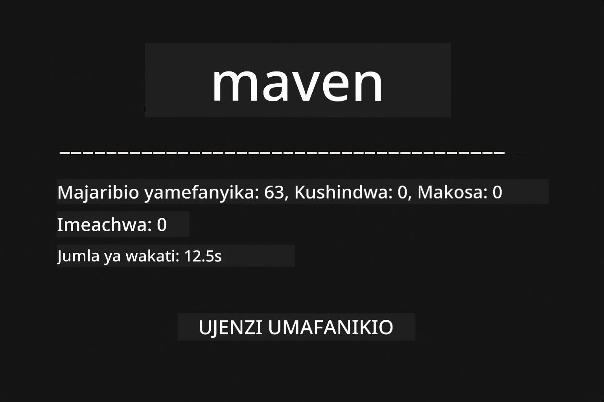
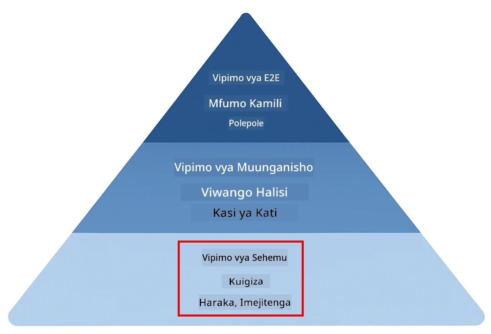
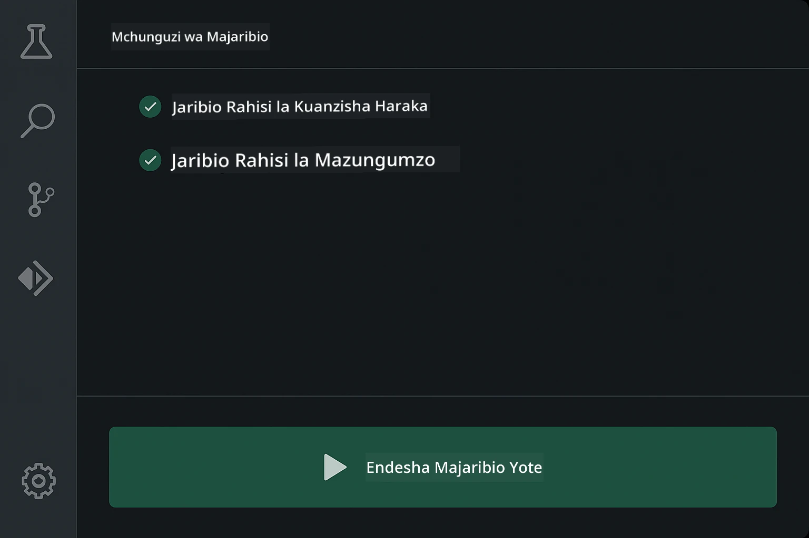
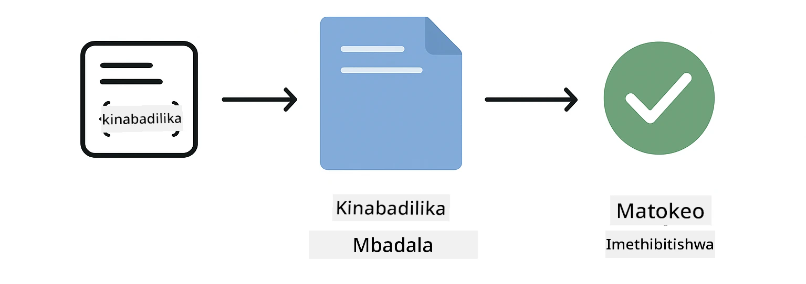
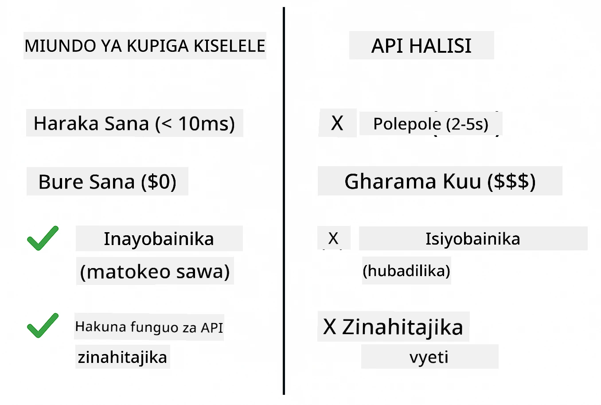
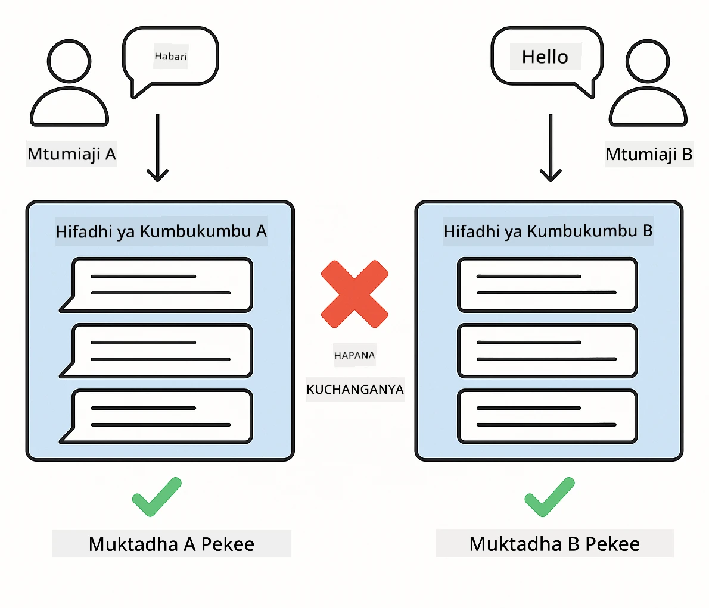
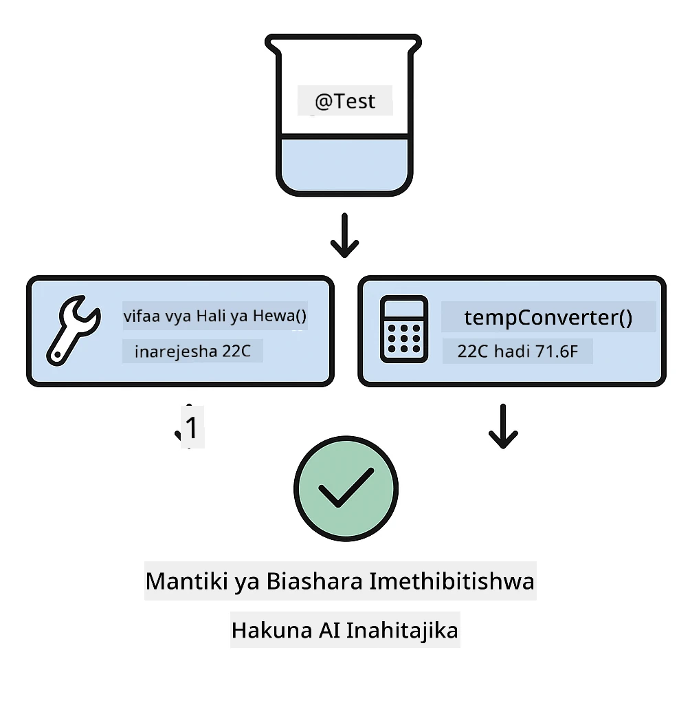
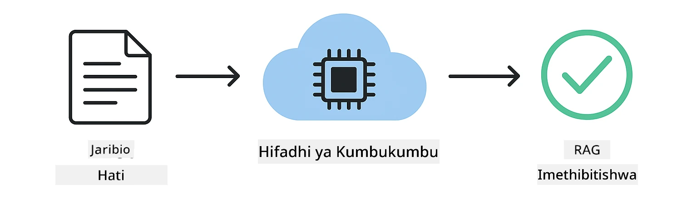

# Kupima Programu za LangChain4j

## Jedwali la Maudhui

- [Anza Haraka](#anza-haraka)
- [Mambo Yanayojumuishwa Katika Mitihani](#mambo-yanayojumuishwa-katika-mitihani)
- [Kukimbia Mitihani](#kukimbia-mitihani)
- [Kukimbia Mitihani Katika VS Code](#kukimbia-mitihani-katika-vs-code)
- [Mifumo ya Kupima](#mifumo-ya-kupima)
- [Falsafa ya Kupima](#falsafa-ya-kupima)
- [Hatua Zifuatazo](#hatua-zifuatazo)

Mwongozo huu unakupeleka kupitia mitihani inayothibitisha jinsi ya kupima programu za AI bila hitaji la funguo za API au huduma za nje.

## Anza Haraka

Kimbia mitihani yote kwa amri moja:

**Bash:**
```bash
mvn test
```

**PowerShell:**
```powershell
mvn --% test
```

Unapokamilisha mitihani yote bila makosa, utapata matokeo kama picha ya skrini hapa chini — mitihani inaendeshwa bila kushindwa.



*Utekelezaji mzuri wa mtihani unaoonyesha mitihani yote imepitwa bila kushindwa*

## Mambo Yanayojumuishwa Katika Mitihani

Kozi hii inalenga kwenye **mitihani ya vitengo** inayotekelezwa kwa sehemu za ndani. Kila mtihani unaonyesha dhana maalum ya LangChain4j kwa kujitegemea. Piramidi ya upimaji hapa chini inaonyesha wapi mitihani ya vitengo inapatikana — ni msingi wa haraka, wa kuaminika ambayo mkakati wako wa upimaji unajenga juu yake.



*Piramidi ya upimaji ikionyesha usawa kati ya mitihani ya vitengo (haraka, peke yake), mitihani ya muingiliano (vipengele halisi), na mitihani ya mwisho-mwisho. Mafunzo haya yanajumuisha upimaji wa vitengo.*

| Moduli | Mitihani | Lengo | Faili Muhimu |
|--------|----------|-------|--------------|
| **01 - Utangulizi** | 8 | Kumbukumbu ya mazungumzo na mazungumzo yaliyohifadhiwa | `SimpleConversationTest.java` |
| **02 - Uhandisi wa Amri** | 12 | Mifumo ya GPT-5.2, viwango vya hamu, matokeo yaliyopangwa | `SimpleGpt5PromptTest.java` |
| **03 - RAG** | 10 | Kuingiza hati, mbinu za kuingiza, utafutaji wa fananisho | `DocumentServiceTest.java` |
| **04 - Zana** | 12 | Kupiga simu za kazi na mlolongo wa zana | `SimpleToolsTest.java` |
| **05 - MCP** | 8 | Protokoli ya Muktadha wa Mfano kwa usafirishaji wa stdio | `SimpleMcpTest.java` |

## Kukimbia Mitihani

**Kimbia mitihani yote kutoka mzizi:**

**Bash:**
```bash
mvn test
```

**PowerShell:**
```powershell
mvn --% test
```

**Kimbia mitihani ya moduli maalum:**

**Bash:**
```bash
cd 01-introduction && mvn test
# Au kutoka mzizi
mvn test -pl 01-introduction
```

**PowerShell:**
```powershell
cd 01-introduction; mvn --% test
# Au kutoka mzizi
mvn --% test -pl 01-introduction
```

**Kimbia darasa moja la mtihani:**

**Bash:**
```bash
mvn test -Dtest=SimpleConversationTest
```

**PowerShell:**
```powershell
mvn --% test -Dtest=SimpleConversationTest
```

**Kimbia njia mahsusi ya mtihani:**

**Bash:**
```bash
mvn test -Dtest=SimpleConversationTest#inapaswaKuwekaHistoriaYaMazungumzo
```

**PowerShell:**
```powershell
mvn --% test -Dtest=SimpleConversationTest#inapaswaHifadhiHistoriaYaMazungumzo
```

## Kukimbia Mitihani Katika VS Code

Ikiwa unatumia Visual Studio Code, Mchunguzi wa Mitihani hutoa kiolesura cha picha kwa ajili ya kukimbia na kufafanua mitihani.



*Mchunguzi wa Mitihani wa VS Code unaonyesha mti wa mitihani na madarasa yote ya majaribio ya Java na njia za mtihani binafsi*

**Ili kukimbia mitihani katika VS Code:**

1. Fungua Mchunguzi wa Mitihani kwa kubofya ikoni ya beaker katika Njia ya Shughuli
2. Panua mti wa mitihani ili kuona moduli na madarasa ya mtihani yote
3. Bonyeza kitufe cha kucheza karibu na mtihani wowote kuukimbia peke yake
4. Bonyeza "Run All Tests" kukimbia seti nzima
5. Bonyeza kulia mtihani wowote na chagua "Debug Test" kuweka alama za kukomoa na kupitia msimbo hatua kwa hatua

Mchunguzi wa Mitihani unaonyesha tiki za kijani kwa mitihani iliyopita na kutoa ujumbe wa kina wakati mitihani inashindwa.

## Mifumo ya Kupima

### Mfano 1: Kupima Maumbo ya Amri

Mfano rahisi kabisa hupima maumbo ya amri bila kuita mfano wowote wa AI. Unathibitisha kuwa mbadilishaji wa vigezo unafanya kazi vizuri na maagizo yamepangwa kama inavyotarajiwa.



*Kupima maumbo ya amri kuonyesha mchakato wa mbadilishaji wa vigezo: kiolezo chenye nafasi za kubadilisha → maadili yamewekwa → pato limehakikiwa*

```java
@Test
@DisplayName("Should format prompt template with variables")
void testPromptTemplateFormatting() {
    PromptTemplate template = PromptTemplate.from(
        "Best time to visit {{destination}} for {{activity}}?"
    );
    
    Prompt prompt = template.apply(Map.of(
        "destination", "Paris",
        "activity", "sightseeing"
    ));
    
    assertThat(prompt.text()).isEqualTo("Best time to visit Paris for sightseeing?");
}
```

Mfano huu unathibitisha kuwa mbadilishaji wa vigezo unafanya kazi vizuri na maagizo yamepangwa kama inavyotarajiwa — hakuna hitaji la funguo za API au simu ya mfano.

### Mfano 2: Kuiga Mifano ya Lugha

Unapopima mantiki ya mazungumzo, tumia Mockito kuunda mifano bandia inayorejesha majibu yaliyowekwa kabla. Hii inafanya mitihani kuwa ya haraka, bure, na inayoaminika.



*Ulinganisho unaoonyesha kwa nini kuiga ni bora kwa upimaji: ni haraka, bure, inayoaminika, na haina hitaji la funguo za API*

```java
@ExtendWith(MockitoExtension.class)
class SimpleConversationTest {
    
    private ConversationService conversationService;
    
    @Mock
    private OpenAiOfficialChatModel mockChatModel;
    
    @BeforeEach
    void setUp() {
        ChatResponse mockResponse = ChatResponse.builder()
            .aiMessage(AiMessage.from("This is a test response"))
            .build();
        when(mockChatModel.chat(anyList())).thenReturn(mockResponse);
        
        conversationService = new ConversationService(mockChatModel);
    }
    
    @Test
    void shouldMaintainConversationHistory() {
        String conversationId = conversationService.startConversation();
        
        ChatResponse mockResponse1 = ChatResponse.builder()
            .aiMessage(AiMessage.from("Response 1"))
            .build();
        ChatResponse mockResponse2 = ChatResponse.builder()
            .aiMessage(AiMessage.from("Response 2"))
            .build();
        ChatResponse mockResponse3 = ChatResponse.builder()
            .aiMessage(AiMessage.from("Response 3"))
            .build();
        
        when(mockChatModel.chat(anyList()))
            .thenReturn(mockResponse1)
            .thenReturn(mockResponse2)
            .thenReturn(mockResponse3);

        conversationService.chat(conversationId, "First message");
        conversationService.chat(conversationId, "Second message");
        conversationService.chat(conversationId, "Third message");

        List<ChatMessage> history = conversationService.getHistory(conversationId);
        assertThat(history).hasSize(6); // ujumbe 3 wa mtumiaji + ujumbe 3 wa AI
    }
}
```

Mfano huu unaonekana katika `01-introduction/src/test/java/com/example/langchain4j/service/SimpleConversationTest.java`. Kuiga kunahakikisha tabia sawa ili uweze kuthibitisha usimamizi wa kumbukumbu kwa usahihi.

### Mfano 3: Kupima Ujitegemeaji wa Mazungumzo

Kumbukumbu ya mazungumzo lazima iziwe tofauti kwa watumiaji mbalimbali. Mtihani huu unathibitisha kuwa mazungumzo hayaingi muktadha wa mtu mwingine.



*Kupima ujitegemeaji wa mazungumzo kuonyesha kuhifadhi kumbukumbu tofauti kwa watumiaji tofauti ili kuzuia kuchanganya muktadha*

```java
@Test
void shouldIsolateConversationsByid() {
    String conv1 = conversationService.startConversation();
    String conv2 = conversationService.startConversation();
    
    ChatResponse mockResponse = ChatResponse.builder()
        .aiMessage(AiMessage.from("Response"))
        .build();
    when(mockChatModel.chat(anyList())).thenReturn(mockResponse);

    conversationService.chat(conv1, "Message for conversation 1");
    conversationService.chat(conv2, "Message for conversation 2");

    List<ChatMessage> history1 = conversationService.getHistory(conv1);
    List<ChatMessage> history2 = conversationService.getHistory(conv2);
    
    assertThat(history1).hasSize(2);
    assertThat(history2).hasSize(2);
}
```

Kila mazungumzo huhifadhi historia yake peke yake. Katika mifumo ya uzalishaji, ujitegemeaji huu ni muhimu kwa programu za watumiaji wengi.

### Mfano 4: Kupima Zana Peke Yake

Zana ni kazi ambazo AI inaweza kuitisha. Zipime moja kwa moja kuhakikisha zinafanya kazi vizuri bila kuathiriwa na maamuzi ya AI.



*Kupima zana peke yake kuonyesha matumizi ya zana bandia bila simu za AI kuthibitisha mantiki ya biashara*

```java
@Test
void shouldConvertCelsiusToFahrenheit() {
    TemperatureTool tempTool = new TemperatureTool();
    String result = tempTool.celsiusToFahrenheit(25.0);
    assertThat(result).containsPattern("77[.,]0°F");
}

@Test
void shouldDemonstrateToolChaining() {
    WeatherTool weatherTool = new WeatherTool();
    TemperatureTool tempTool = new TemperatureTool();

    String weatherResult = weatherTool.getCurrentWeather("Seattle");
    assertThat(weatherResult).containsPattern("\\d+°C");

    String conversionResult = tempTool.celsiusToFahrenheit(22.0);
    assertThat(conversionResult).containsPattern("71[.,]6°F");
}
```

Mitihani hii kutoka `04-tools/src/test/java/com/example/langchain4j/agents/tools/SimpleToolsTest.java` inathibitisha mantiki ya zana bila kuhusika kwa AI. Mfano wa mlolongo unaonyesha jinsi pato la zana moja linaingizwa kama ingizo la nyingine.

### Mfano 5: Kupima RAG Kama Kumbukumbu Ndani ya Kumbukumbu

Mifumo ya RAG kawaida inahitaji database za vekta na huduma za kuingiza. Mfano wa ndani ya kumbukumbu unakuwezesha kupima mchakato mzima bila utegemezi wa nje.



*Mtiririko wa upimaji wa RAG ndani ya kumbukumbu unaonyesha uchambuzi wa hati, uhifadhi wa kuingiza, na utafutaji wa fananisho bila hitaji la database*

```java
@Test
void testProcessTextDocument() {
    String content = "This is a test document.\nIt has multiple lines.";
    InputStream inputStream = new ByteArrayInputStream(content.getBytes(StandardCharsets.UTF_8));
    
    DocumentService.ProcessedDocument result = 
        documentService.processDocument(inputStream, "test.txt");

    assertNotNull(result);
    assertTrue(result.segments().size() > 0);
    assertEquals("test.txt", result.segments().get(0).metadata().getString("filename"));
}
```

Mtihani huu kutoka `03-rag/src/test/java/com/example/langchain4j/rag/service/DocumentServiceTest.java` huunda hati ndani ya kumbukumbu na kuthibitisha upangaji vipande na usimamizi wa metadata.

### Mfano 6: Upimaji wa Muunganisho wa MCP

Moduli ya MCP hupima muunganisho wa Protokoli ya Muktadha wa Mfano kwa kutumia usafirishaji wa stdio. Mitihani hii inathibitisha kuwa programu yako inaweza kuzindua na kuwasiliana na seva za MCP kama michakato ndogo.

Mitihani katika `05-mcp/src/test/java/com/example/langchain4j/mcp/SimpleMcpTest.java` inathibitisha tabia ya mteja wa MCP.

**Izikimbie:**

**Bash:**
```bash
cd 05-mcp && mvn test
```

**PowerShell:**
```powershell
cd 05-mcp; mvn --% test
```

## Falsafa ya Kupima

Pingua msimbo wako, siyo AI. Mitihani yako inapaswa kuthibitisha msimbo unaouandika kwa kuangalia jinsi maagizo yanavyojengwa, jinsi kumbukumbu inavyosimamiwa, na jinsi zana zinavyoendeshwa. Majibu ya AI hubadilika na hayapaswi kuwa sehemu ya matokeo ya mtihani. Jiulize ikiwa kiolezo chako cha amri kinabadilisha vigezo vizuri, sio kama AI inatoa jibu sahihi.

Tumia kuiga kwa mifano ya lugha. Ni utegemezi wa nje ambao ni polepole, ghali, na hauna uhakika. Kuiga kunafanya mitihani kuwa ya haraka kwa milisekunde badala ya sekunde, bure bila gharama za API, na thabiti na matokeo sawa kila wakati.

Hakikisha mitihani iwe huru. Kila mtihani unapaswa kuanzisha data yake, usitegemee mitihani mingine, na kusafisha baada ya mtihani. Mitihani inapaswa kupita bila kujali mpangilio wa utekelezaji.

Pingua kesi za kando zaidi ya njia ya kawaida. Jaribu maingizo tupu, maingizo makubwa sana, herufi maalum, parameta batili, na hali za mipaka. Hizi mara nyingi huibua hitilafu ambazo matumizi ya kawaida hayazionyeshi.

Tumia majina yaliyoeleweka. Linganisha `shouldMaintainConversationHistoryAcrossMultipleMessages()` na `test1()`. Kwanza linaeleza hasa kinachopimwa, na hivyo kurahisisha utambuzi wa makosa.

## Hatua Zifuatazo

Sasa ukiwa umeelewa mifumo ya kupima, ingia kwa undani ndani ya kila moduli:

- **[01 - Utangulizi](../01-introduction/README.md)** - Jifunze usimamizi wa kumbukumbu ya mazungumzo
- **[02 - Uhandisi wa Amri](../02/prompt-engineering/README.md)** - Jifunze mifumo ya GPT-5.2 ya kutoa amri
- **[03 - RAG](../03-rag/README.md)** - Jenga mifumo ya kizalishaji iliyoongezwa upatikanaji
- **[04 - Zana](../04-tools/README.md)** - Tekeleza kupiga simu za kazi na mlolongo wa zana
- **[05 - MCP](../05-mcp/README.md)** - Unganisha Protokoli ya Muktadha wa Mfano

Kila README ya moduli ina maelezo ya kina kuhusu dhana zinazopimwa hapa.

---

**Uelekezaji:** [← Rudi Kwenye Kuu](../README.md)

---

<!-- CO-OP TRANSLATOR DISCLAIMER START -->
**Kionyozo**:
Hati hii imetafsiriwa kwa kutumia huduma ya tafsiri ya AI [Co-op Translator](https://github.com/Azure/co-op-translator). Ingawa tunajitahidi kupata usahihi, tafadhali fahamu kwamba tafsiri za kiotomatiki zinaweza kuwa na makosa au upungufu wa usahihi. Hati ya asili katika lugha yake halisi inapaswa kuchukuliwa kama chanzo cha mamlaka. Kwa taarifa muhimu, tafsiri ya kitaalamu inayofanywa na binadamu inapendekezwa. Hatutojibu kwa kuelewa vibaya au tafsiri potofu zinazotokea kutokana na matumizi ya tafsiri hii.
<!-- CO-OP TRANSLATOR DISCLAIMER END -->