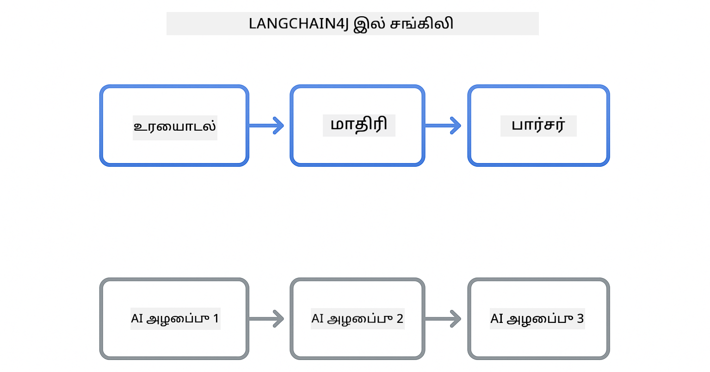
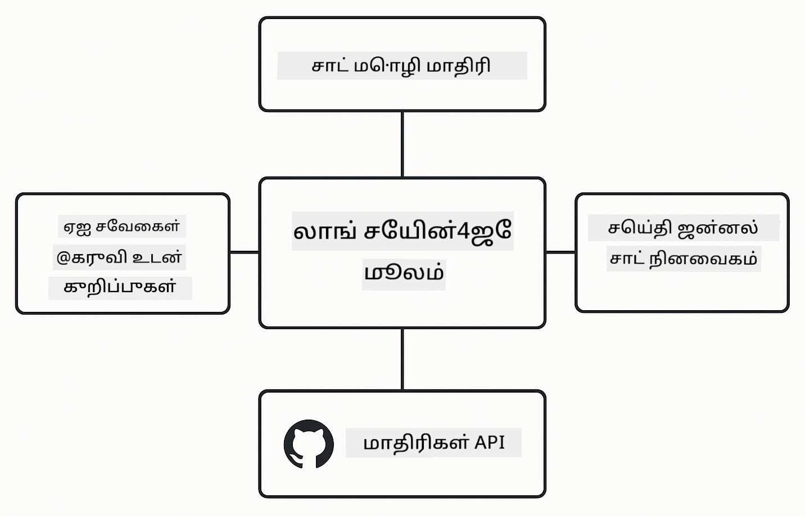

<!--
CO_OP_TRANSLATOR_METADATA:
{
  "original_hash": "22b5d7c8d7585325e38b37fd29eafe25",
  "translation_date": "2026-01-06T01:52:36+00:00",
  "source_file": "00-quick-start/README.md",
  "language_code": "ta"
}
-->
# தொகுதி 00: சீக்கிர தொடக்கம்

## உள்ளடக்க அட்டவணை

- [அறிமுகம்](../../../00-quick-start)
- [LangChain4j என்றால் என்ன?](../../../00-quick-start)
- [LangChain4j சார்புகள்](../../../00-quick-start)
- [முந்தைய தேவைகள்](../../../00-quick-start)
- [அமைப்பு](../../../00-quick-start)
  - [1. உங்கள் GitHub டோக்கனைப் பெறுங்கள்](../../../00-quick-start)
  - [2. உங்கள் டோக்கனை அமைக்கவும்](../../../00-quick-start)
- [உதாரணங்களை இயக்கவும்](../../../00-quick-start)
  - [1. அடிப்படைக் உரையாடல்](../../../00-quick-start)
  - [2. தூண்டுதல் மாதிரிகள்](../../../00-quick-start)
  - [3. செயல்பாடு அழைப்பு](../../../00-quick-start)
  - [4. ஆவண கேள்வி & பதில் (RAG)](../../../00-quick-start)
  - [5. பொறுப்பான AI](../../../00-quick-start)
- [ஒவ்வொரு உதாரணமும் என்ன காட்டுகிறது](../../../00-quick-start)
- [அடுத்த படிகள்](../../../00-quick-start)
- [பிரச்சனைகளைத் தீர்க்குதல்](../../../00-quick-start)

## அறிமுகம்

இந்த சீக்கிர தொடக்கம் LangChain4j உடன் உங்களை விரைவில் இயக்கத் தொடங்க வாஞ்சிக்கப்படுகிறது. இது LangChain4j மற்றும் GitHub மாதிரிகளை பயன்படுத்தி AI செயலிகளுக்கான அடிப்படைகளை உள்ளடக்கியது. அடுத்த தொகுதிகளில் Azure OpenAI ஐ LangChain4j உடன் பயன்படுத்தி மேம்பட்ட செயலிகளை நீங்கள் கட்டியெழுப்புவீர்கள்.

## LangChain4j என்றால் என்ன?

LangChain4j என்பது AI சக்தியுள்ள செயலிகளை கட்ட எளிவாக்கும் ஜாவா நூலகம். HTTP கிளையண்ட்கள் மற்றும் JSON பகுப்பாய்வுகளுடன் கையாள்வதைவிட, நீங்கள் சுத்தமான ஜாவா APIs கொண்டு வேலை செய்வீர்கள்.

LangChain இல் "சீன்" என்பது பல கூறுகளை சங்கிலிவடிவில் இணைப்பதை குறிக்கிறது - நீங்கள் ஒரு தூண்டுதலிலிருந்து மாதிரிக்கு, பின்னர் பார்சருக்கு சங்கிலி செய்யலாம் அல்லது பல AI அழைப்புகளை ஒன்று ஒன்று பின்வரும் உள்ளீட்டிற்கு வெளியீடு கொடுத்து சங்கிலி செய்யலாம். இந்த சீக்கிர தொடக்கம் அடிப்படைகளை கவனிக்கும் மேலதிக சங்கிலிகளை ஆராய்வதற்கு முன்.



*LangChain4j இல் கூறுகளை சங்கிலி செய்வது - கட்டுமான அங்கங்கள் சக்தி வாய்ந்த AI வேலைநிரல்களை உருவாக்க இணைக்கப்படுகிறது*

நாம் மூன்று முக்கிய கூறுகளைப் பயன்படுத்துவோம்:

**ChatLanguageModel** - AI மாதிரி தொடர்புகளுக்கான இடைமுகம். `model.chat("prompt")` அழைத்து பதிலாக ஒரு தொடர் பெறலாம். நாம் GitHub Models போன்ற OpenAI-ஐ ஒத்துக்கொள்ளும் end points உடன் வேலை செய்யும் `OpenAiOfficialChatModel` ஐப் பயன்படுத்துகிறோம்.

**AiServices** - வகை-பாதுகாப்பான AI சேவை இடைமுகங்களை உருவாக்கும். முறைகள் வரையறுக்கவும், அவற்றை `@Tool` க்கு குறிக்கவும், LangChain4j நிர்வாகத்தை கையாளும். AI தேவையான பொழுதில் உங்கள் ஜாவா முறைகளை தானாக அழைக்கும்.

**MessageWindowChatMemory** - உரையாடல் வரலாற்றை தொடர்கிறது. இதின்றி ஒவ்வொரு கோரிக்கையும் தனித்தனியாக இருக்கும். இதன் மூலம் AI முந்தைய செய்திகளை நினைவில் வைத்து பல முறை உரையாடல் இடைவெளியை நிர்வகிக்கும்.



*LangChain4j கட்டமைப்பு - முக்கிய கூறுகள் கூட்டு உங்கள் AI செயலிகளுக்கு சக்தி அளிக்க இணைந்து செயல்படுகின்றன*

## LangChain4j சார்புகள்

இந்த சீக்கிர தொடக்கம் இரண்டு Maven சார்புகளை [`pom.xml`](../../../00-quick-start/pom.xml) இல் பயன்படுத்துகிறது:

```xml
<!-- Core LangChain4j library -->
<dependency>
    <groupId>dev.langchain4j</groupId>
    <artifactId>langchain4j</artifactId> <!-- Inherited from BOM in root pom.xml -->
</dependency>

<!-- OpenAI integration (works with GitHub Models) -->
<dependency>
    <groupId>dev.langchain4j</groupId>
    <artifactId>langchain4j-open-ai-official</artifactId> <!-- Inherited from BOM in root pom.xml -->
</dependency>
```

`langchain4j-open-ai-official` தொகுதி OpenAI-ஐ ஒத்துக்கொள்ளும் APIs உடன் இணைக்க கூடிய `OpenAiOfficialChatModel` வகுப்பை வழங்குகிறது. GitHub Models இதே API வடிவத்தை பயன்படுத்துகிறது, ஆகவே வெவ்வேறு அடாப்டர் தேவையில்லை - மட்டும் அடிப்படை URL ஐ `https://models.github.ai/inference` என்பதற்கு மாற்றிக் கொள்ளுங்கள்.

## முந்தைய தேவைகள்

**Dev கட்டுமானப் பாத்திரம் பயன்படுத்துகிறீர்களா?** ஜாவா மற்றும் Maven ஏற்கனவே நிறுவப்பட்டுள்ளன. உங்களுக்கு GitHub தனிப்பட்ட அணுகல் டோக்கன் மட்டுமே தேவை.

**உள் மேம்பாடு:**
- Java 21+, Maven 3.9+
- GitHub தனிப்பட்ட அணுகல் டோக்கன் (கீழே உள்ள வழிமுறைகள்)

> **குறிப்பு:** இந்த தொகுதி GitHub Models இலிருந்து `gpt-4.1-nano` ஐப் பயன்படுத்துகிறது. குறியீட்டில் மாதிரி பெயரை மாற்ற வேண்டாம் - அது GitHub இல் கிடைக்கும் மாதிரிகளுடன் வேலை செய்யும் வகையில் அமைக்கப்பட்டுள்ளது.

## அமைப்பு

### 1. உங்கள் GitHub டோக்கனைப் பெறுங்கள்

1. [GitHub அமைப்புகள் → தனிப்பட்ட அணுகல் டோக்கன்](https://github.com/settings/personal-access-tokens) செல்லவும்
2. "Generate new token" கிளிக் செய்யவும்
3. விளக்கமான பெயரை அமைக்கவும் (எ.கா., "LangChain4j Demo")
4. காலாவதியாகும் நாள் அமைக்கவும் (7 நாட்கள் பரிந்துரைக்கப்படுகிறது)
5. "Account permissions" இல் "Models" ஐ "Read-only" ஆக அமைக்கவும்
6. "Generate token" அழுத்தவும்
7. உங்கள் டோக்கனை நகலெடுத்து சேமிக்கவும் - மீண்டும் அது தெரியாது

### 2. உங்கள் டோக்கனை அமைக்கவும்

**விருப்பம் 1: VS Code பயன்படுத்துதல் (பரிந்துரைக்கப்படுகிறது)**

VS Code பயன்படுத்தினால், உங்கள் டோக்கனை திட்ட முதலில் உள்ள `.env` கோப்பில் சேர்க்கவும்:

`.env` கோப்பு இல்லாலில், `.env.example` ஐ `.env` என நகலெடுக்கவும் அல்லது புதிய `.env` கோப்பை உருவாக்கவும்.

**உதாரண `.env` கோப்பு:**
```bash
# /workspaces/LangChain4j-for-Beginners/.env இல்
GITHUB_TOKEN=your_token_here
```

பிறகு எளிதாக எக்ஸ்ப்ளோரரில் உள்ள எந்தவொரு டெமோ கோப்பிலும் (எ.கா., `BasicChatDemo.java`) வலது கிளிக் செய்து **"Run Java"** தேர்ந்தெடுக்கலாம் அல்லது Run மற்றும் Debug போர்ட்டலில் இருந்து தொடக்க அமைப்புகளை பயன்படுத்தலாம்.

**விருப்பம் 2: டெர்மினல் பயன்படுத்துதல்**

டோக்கனை சுற்றுச்சூழல் மாறிலியாக அமைக்கவும்:

**Bash:**
```bash
export GITHUB_TOKEN=your_token_here
```

**PowerShell:**
```powershell
$env:GITHUB_TOKEN=your_token_here
```

## உதாரணங்களை இயக்கவும்

**VS Code பயன்படுத்துதல்:** எக்ஸ்ப்ளோரரில் உள்ள எந்தவொரு டெமோ கோப்பிலும் வலது கிளிக் செய்து **"Run Java"** தேர்ந்தெடுக்கவும், அல்லது Run மற்றும் Debug போர்ட்டலில் இருந்து தொடக்க அமைப்புகளைப் பயன்படுத்தவும் (முதலில் `.env` கோப்பில் உங்கள் டோக்கன் சேர்க்கப்பட்டிருக்க வேண்டும்).

**Maven பயன்படுத்துதல்:** বিকল্পமாக, கட்டளை வரிசையில் இருந்து இயக்கலாம்:

### 1. அடிப்படைக் உரையாடல்

**Bash:**
```bash
mvn compile exec:java -Dexec.mainClass=com.example.langchain4j.quickstart.BasicChatDemo
```

**PowerShell:**
```powershell
mvn --% compile exec:java -Dexec.mainClass=com.example.langchain4j.quickstart.BasicChatDemo
```

### 2. தூண்டுதல் மாதிரிகள்

**Bash:**
```bash
mvn compile exec:java -Dexec.mainClass=com.example.langchain4j.quickstart.PromptEngineeringDemo
```

**PowerShell:**
```powershell
mvn --% compile exec:java -Dexec.mainClass=com.example.langchain4j.quickstart.PromptEngineeringDemo
```

சூனிய-ஷாட், கிழக்கு-ஷாட், சிந்தனை சங்கிலி மற்றும் வேடிக்கை அடிப்படையிலான தூண்டுதலைக் காட்டுகிறது.

### 3. செயல்பாடு அழைப்பு

**Bash:**
```bash
mvn compile exec:java -Dexec.mainClass=com.example.langchain4j.quickstart.ToolIntegrationDemo
```

**PowerShell:**
```powershell
mvn --% compile exec:java -Dexec.mainClass=com.example.langchain4j.quickstart.ToolIntegrationDemo
```

AI தேவையான பொழுதில் உங்கள் ஜாவா முறைகளை தானாக அழைக்கும்.

### 4. ஆவண கேள்வி & பதில் (RAG)

**Bash:**
```bash
mvn compile exec:java -Dexec.mainClass=com.example.langchain4j.quickstart.SimpleReaderDemo
```

**PowerShell:**
```powershell
mvn --% compile exec:java -Dexec.mainClass=com.example.langchain4j.quickstart.SimpleReaderDemo
```

`document.txt` உள்ளடக்கம் தொடர்பான கேள்விகள் கேளுங்கள்.

### 5. பொறுப்பான AI

**Bash:**
```bash
mvn compile exec:java -Dexec.mainClass=com.example.langchain4j.quickstart.ResponsibleAIDemo
```

**PowerShell:**
```powershell
mvn --% compile exec:java -Dexec.mainClass=com.example.langchain4j.quickstart.ResponsibleAIDemo
```

AI பாதுகாப்பு வடிகட்டிகள் தீய உள்ளடக்கங்களை தடுக்கும் விதமாக இருக்கின்றன.

## ஒவ்வொரு உதாரணமும் என்ன காட்டுகிறது

**அடிப்படைக் உரையாடல்** - [BasicChatDemo.java](../../../00-quick-start/src/main/java/com/example/langchain4j/quickstart/BasicChatDemo.java)

LingChain4j இன் எளிமையான வடிவத்தை இங்கே தொடங்கிப் பார்க்கவும். நீங்கள் ஒரு `OpenAiOfficialChatModel` உருவாக்கி, `.chat()` உடன் தூண்டுதலை அனுப்பி பதில் பெறுவீர்கள். இது அடித்தளம்: தனிப்பயன் end point களுடன் மற்றும் API திறவுகோள்களுடன் மாதிரிகளை எவ்வாறு தொடங்குவது என்பதை விளக்குகிறது. இந்த முறை புரிந்துகொண்ட பிறகு மற்ற அனைத்தும் அதனின்படி உருவாகும்.

```java
ChatLanguageModel model = OpenAiOfficialChatModel.builder()
    .baseUrl("https://models.github.ai/inference")
    .apiKey(System.getenv("GITHUB_TOKEN"))
    .modelName("gpt-4.1-nano")
    .build();

String response = model.chat("What is LangChain4j?");
System.out.println(response);
```

> **🤖 [GitHub Copilot](https://github.com/features/copilot) உரையாடலுடன் முயற்சிக்கவும்:** [`BasicChatDemo.java`](../../../00-quick-start/src/main/java/com/example/langchain4j/quickstart/BasicChatDemo.java) திறந்து கேளுங்கள்:
> - "GitHub Models இலிருந்து Azure OpenAI க்கு இந்த குறியீட்டில் எப்படி மாறுகிறேன்?"
> - "OpenAiOfficialChatModel.builder() இல் எந்தவொரு கூடுதல் அளவுருக்களை மாற்றக்கூடும்?"
> - "முழு பதிலை காத்திருக்காமல் ஸ்ட்ரீமிங் பதில்களைச் சேர்க்க எப்படி?"

**தூண்டுதல் பொறியியல்** - [PromptEngineeringDemo.java](../../../00-quick-start/src/main/java/com/example/langchain4j/quickstart/PromptEngineeringDemo.java)

நீங்கள் மாதிரியுடன் பேசுவது எப்படி என்பதை அறிந்த பிறகு, அதற்கு என்ன சொல்ல வேண்டும் என்பதைக் காணலாம். இந்த டெமோ அதே மாதிரி அமைப்பைப் பயன்படுத்துகிறது, ஆனால் நான்கு விதமான தூண்டுதல்களை காட்டுகிறது. நேரடி நேர்முக குறிப்பு, எடுத்துக்காட்டுகளிலிருந்து கற்றுக்கொள்ளும் குறிப்பு, சிந்தனைச் சங்கிலி குறிப்பு மற்றும் சூழல் அமைக்கும் வேடிக்கை அடிப்படையிலான குறிப்பு ஆகியவைகளைக் கையாள வேண்டும். அதே மாதிரி விரிவான வேறுபாடுகளை எவ்வாறு தருகிறது என்பதைக் காணலாம்.

```java
PromptTemplate template = PromptTemplate.from(
    "What's the best time to visit {{destination}} for {{activity}}?"
);

Prompt prompt = template.apply(Map.of(
    "destination", "Paris",
    "activity", "sightseeing"
));

String response = model.chat(prompt.text());
```

> **🤖 [GitHub Copilot](https://github.com/features/copilot) உரையாடலுடன் முயற்சிக்கவும்:** [`PromptEngineeringDemo.java`](../../../00-quick-start/src/main/java/com/example/langchain4j/quickstart/PromptEngineeringDemo.java) திறந்து கேளுங்கள்:
> - "சூனிய-ஷாட் மற்றும் கிழக்கு-ஷாட்டின் வித்தியாசம் என்ன? எப்போது எது பயன்படுத்த வேண்டும்?"
> - "தூண்டுதல் வெப்பநிலை அளவுரு மாதிரியின் பதில்களை எப்படி பாதிக்கிறது?"
> - "உற்பத்தி சூழலில் தூண்டுதல் ஊடுருவல் தாக்குதலைத் தடுக்கும் சில நுட்பங்கள் என்ன?"
> - "பொதுவான மாதிரிகளுக்கு மீண்டும் பயன்படுத்தக்கூடிய PromptTemplate ஒப்ஜெக்ட்களை எப்படி உருவாக்குவது?"

**கருவி ஒருங்கிணைப்பு** - [ToolIntegrationDemo.java](../../../00-quick-start/src/main/java/com/example/langchain4j/quickstart/ToolIntegrationDemo.java)

இங்கே LangChain4j சக்திவாய்ந்ததாகிறது. `AiServices` ஐப் பயன்படுத்தி நீங்கள் உங்கள் ஜாவா முறைகளை அழைக்கும் ஒரு AI உதவியாளரை உருவாக்குவீர்கள். `@Tool("விவரம்")` என குறியீட்டுக் குறிப்பு செய்த பிறகு LangChain4j மற்ற அனைத்தையும் கையாளும் - பயனர் எதை கேட்டாலும் AI தானாக தேவையான கருவிகளைத் தேர்வு செய்யும். இது செயல்பாட்டை அழைக்கும் முக்கிய தொழில் நுட்பத்தை வெளிப்படுத்துகிறது - AI கேள்விகளுக்கு பதிலளிப்பதல்ல; நடவடிக்கைகளை எடுக்கிறது.

```java
@Tool("Performs addition of two numeric values")
public double add(double a, double b) {
    return a + b;
}

MathAssistant assistant = AiServices.create(MathAssistant.class, model);
String response = assistant.chat("What is 25 plus 17?");
```

> **🤖 [GitHub Copilot](https://github.com/features/copilot) உரையாடலுடன் முயற்சிக்கவும்:** [`ToolIntegrationDemo.java`](../../../00-quick-start/src/main/java/com/example/langchain4j/quickstart/ToolIntegrationDemo.java) திறந்து கேளுங்கள்:
> - "@Tool குறியீட்டு குறிப்பு எவ்வாறு வேலை செய்கிறது மற்றும் LangChain4j இதன் பின்னணி மேலாண்மையில் என்ன செய்கிறது?"
> - "சிக்கலான பிரச்சினைகளை தீர்க்க AI ஒருசேர பல கருவிகளை அழைக்கவுமா?"
> - "ஒரு கருவி தவறை எழுப்பினால் என்ன ஆகும் - பிழைகளை எப்படி கையாள வேண்டும்?"
> - "இந்த கணக்கீட்டுக் உதாரணத்தை மாற்றி உண்மை API ஐ எப்படி இணைப்பேன்?"

**ஆவண கேள்வி & பதில் (RAG)** - [SimpleReaderDemo.java](../../../00-quick-start/src/main/java/com/example/langchain4j/quickstart/SimpleReaderDemo.java)

இங்கு RAG (retrieval-augmented generation) அடித்தளம் காண்போம். மாதிரியின் பயிற்சி தரவிற்கு பதிலாக, நீங்கள் [`document.txt`](../../../00-quick-start/document.txt) இருந்து உள்ளடக்கத்தை ஏற்றிக் கொண்டு அதை தூண்டுதலுடன் சேர்க்கிறீர்கள். AI உங்கள் ஆவணத்தை அடிப்படையாகக் கொண்டு பதில் அளிக்கிறது, பொதுவான அறிவைப் பொறுத்ததல்ல. இது உங்கள் சொந்த தரவுடன் வேலை செய்யும் அமைப்புகளை கட்டுவதற்கான முதல் படி.

```java
Document document = FileSystemDocumentLoader.loadDocument("document.txt");
String content = document.text();

String prompt = "Based on this document: " + content + 
                "\nQuestion: What is the main topic?";
String response = model.chat(prompt);
```

> **குறிப்பு:** இந்த எளிய முறையில் முழு ஆவணத்தையும் தூண்டுதலில் ஏற்றுகிறது. பெரிய கோப்புகளுக்கான (>10KB) சந்தர்ப்பங்கள் மீறப்படலாம். தொகுதி 03 ல் துண்டாக்கல் மற்றும் வெக்டார் தேடல் பிரயோகம் செய்யப்படும்.

> **🤖 [GitHub Copilot](https://github.com/features/copilot) உரையாடலுடன் முயற்சிக்கவும்:** [`SimpleReaderDemo.java`](../../../00-quick-start/src/main/java/com/example/langchain4j/quickstart/SimpleReaderDemo.java) திறந்து கேளுங்கள்:
> - "RAG AI கற்பனைகளை மாதிரியின் பயிற்சி தரவோடு ஒப்பிடும்போது எப்படி தடுக்கும்?"
> - "இந்த எளிய முறை மற்றும் வெளியீட்டு வெக்டார்களை பயன்படுத்தி தேடலை வித்தியாசம் என்ன?"
> - "பல ஆவணங்களோ அல்லது பெரிய அறிவுக் குறியீடு தொகுப்புகளை கையாள எவ்வாறு பரிமாணிக்க முடியும்?"
> - "AI வழங்கப்பட்ட சூழலை மட்டும் பயன்படுத்தும் வகையில் தூண்டுதலை எவ்வாறு அமைத்தால் சிறந்தது?"

**பொறுப்பான AI** - [ResponsibleAIDemo.java](../../../00-quick-start/src/main/java/com/example/langchain4j/quickstart/ResponsibleAIDemo.java)

ஆழமான பாதுகாப்புடன் AI பாதுகாப்பை கட்டியெழுப்புங்கள். இந்த டெமோ இரண்டு பாதுகாப்பு அடுக்குகளை இணைக்கிறது:

**பகுதி 1: LangChain4j உள்ளீடு காப்பாளர்கடை** - தீய தூண்டுதல்களை LLM மறைந்திருப்பதற்கு முன் தடுக்கும். தடைசெய்யப்பட்ட சொல்லடைகளை அல்லது வார்ப்புருக்களை கண்டுபிடிக்கும் தனிப்பயன் காப்பாளர்களை உருவாக்குங்கள். இவை உங்கள் குறியீட்டில் இயங்குவதால் விரைவான மற்றும் இலவசமானவை.

```java
class DangerousContentGuardrail implements InputGuardrail {
    @Override
    public InputGuardrailResult validate(UserMessage userMessage) {
        String text = userMessage.singleText().toLowerCase();
        if (text.contains("explosives")) {
            return fatal("Blocked: contains prohibited keyword");
        }
        return success();
    }
}
```

**பகுதி 2: வழங்குநர் பாதுகாப்பு வடிகட்டிகள்** - GitHub Models உடன் உள்ள வடிகட்டிகள் உங்கள் காப்பாளர்கள் தவறவிட்டவற்றைக் கண்டுபிடிக்கும். கடுமையான தடைகள் (HTTP 400 பிழைகள்) மற்றும் மென்மையான நிராகரிப்புகள் (AI திட்டமிட்டு மறுப்பவை) காண்பீர்கள்.

> **🤖 [GitHub Copilot](https://github.com/features/copilot) உரையாடலுடன் முயற்சிக்கவும்:** [`ResponsibleAIDemo.java`](../../../00-quick-start/src/main/java/com/example/langchain4j/quickstart/ResponsibleAIDemo.java) திறந்து கேளுங்கள்:
> - "InputGuardrail எனЧто அது எப்படி உருவாக்குவது?"
> - "கடுமையான தடையும் மென்மையான மறுத்தலும் என்ன வித்தியாசம்?"
> - "ஏன் காப்பாளரும் வழங்குநர் வடிகட்டிகளும் இரண்டையும் ஒருங்கிணைக்க வேண்டும்?"

## அடுத்த படிகள்

**அடுத்த தொகுதி:** [01-introduction - LangChain4j மற்றும் gpt-5 உடன் Azure தொடக்குகிறது](../01-introduction/README.md)

---

**நேவிகேஷன்:** [← முதன்மை பக்கம்](../README.md) | [அடுத்தது: தொகுதி 01 - அறிமுகம் →](../01-introduction/README.md)

---

## பிரச்சனை நீக்கம்

### முதன்முறையாக Maven கட்டமைப்பு

**பிரச்சனை**: முதலாவது `mvn clean compile` அல்லது `mvn package` 10-15 நிமிடங்கள் ஆகும்

**காரணம்**: Maven முதன்முறையில் அனைத்து திட்ட சார்புகளையும் (Spring Boot, LangChain4j நூலகங்கள், Azure SDKகள், மற்றும் பிற) பதிவிறக்கம் செய்ய வேண்டும்.

**தீர்வு**: இது சாதாரண நிகழ்ச்சி. அடுத்த கட்டமைப்புகள் வலுவாக வேகமாகும் ஏனெனில் சார்புகள் உள்ளூர் காட்சியிலாவது சேமிக்கப்படும். பதிவிறக்கம் நேரம் உங்கள் நெட்வொர்க் வேகத்திற்கு அடிப்படையாக இருக்கும்.

### PowerShell Maven கட்டளை வரிசை

**பிரச்சனை**: Maven கட்டளைகள் `Unknown lifecycle phase ".mainClass=..."` என்ற பிழையுடன் தோல்வியடைகிறது

**காரணம்**: PowerShell `=` ஐ மாறிலி ஒதுக்கீட்டு இயக்கியாக கவனித்து Maven சொத்துகளின் எழுத்துமாற்ற முறையை உடைக்கும்
**தீர்வு**: Maven கட்டளைக்கு முன் `--%` என்ற நிறுத்தம்-விளக்கம் இயக்கியைப் பயன்படுத்தவும்:

**PowerShell:**
```powershell
mvn --% compile exec:java -Dexec.mainClass=com.example.langchain4j.quickstart.BasicChatDemo
```

**Bash:**
```bash
mvn compile exec:java -Dexec.mainClass=com.example.langchain4j.quickstart.BasicChatDemo
```

`--%` இயக்கி PowerShell-க்கு மீதமுள்ள அனைத்து arguments-களையும் வரையறையின்றி நேரடியாக Maven-க்கு அனுப்ப என்னும் அர்த்தம்.

### Windows PowerShell எமோஜி காட்சி

**பிரச்சனை**: PowerShell-ல் AI பதில்கள் இடத்தில் எமோஜிகள் பதிலாக குப்பை எழுத்துக்களை (எ.கா., `????` அல்லது `â??`) காட்டுகின்றன

**காரணம்**: PowerShell இயல்புநிலை குறியாக்கம் UTF-8 எமோஜிகளை ஆதரிக்காது

**தீர்வு**: Java பயன்பாடுகளை இயக்கும் முன் இந்த கட்டளை இயக்கவும்:
```cmd
chcp 65001
```

இது டெர்மினலில் UTF-8 குறியாக்கத்தை கட்டாயமாக்கும். மாற்றாக, Windows Terminal-ஐ பயன்படுத்தவும், அதில் சிறந்த யூனிகோடு ஆதரவு உள்ளது.

### API அழைப்புகளின் பிழைத்திருத்தம்

**பிரச்சனை**: அங்கீகார பிழைகள், விகித வரம்புகள் அல்லது எதிர்பாராத AI மாடல் பதில்கள்

**தீர்வு**: எடுத்துக்காட்டுகளில் `.logRequests(true)` மற்றும் `.logResponses(true)` உள்ளன, அவை API அழைப்புகளை கான்சோலில் காட்சிப்படுத்த உதவுகின்றன. இதனால் அங்கீகார பிழைகள், விகித வரம்புகள் மற்றும் எதிர்பாராத பதில்களை கண்காணிக்கலாம். உற்பத்தியில் இந்த கொடியைப் அகற்றுக, இதனால் பதிவு சத்தம் குறையும்.

---

<!-- CO-OP TRANSLATOR DISCLAIMER START -->
**வெளியுறுத்தல்**:
இந்த ஆவணம் AI மொழிபெயர்ப்பு சேவை [Co-op Translator](https://github.com/Azure/co-op-translator) பயன்படுத்தி மொழிபெயர்க்கப்பட்டுள்ளது. நாம் துல்லியத்திற்காக முயலினாலும், தானியங்கி மொழிபெயர்ப்பு தவறுகள் அல்லது பிழைகள் கொண்டிருக்க வாய்ப்பு உள்ளது என்பதை தயவு செய்து கவனमें கொள்ளவும். இயல்பான மொழியிலுள்ள அசல் ஆவணம் அதிகாரப்பூர்வ மூலமாக கருதப்பட வேண்டும். முக்கியமான தகவல்களுக்கு, தொழில்முறை மனித மொழிபெயர்ப்பு பரிந்துரைக்கப்படுகிறது. இந்த மொழிபெயர்ப்பு பயன்பாட்டால் ஏற்படும் எந்தவும் தவறான புரிதல்கள் அல்லது தவறான விளக்கங்களுக்கு நாங்கள் பொறுப்பு ஏற்கமாட்டோம்.
<!-- CO-OP TRANSLATOR DISCLAIMER END -->