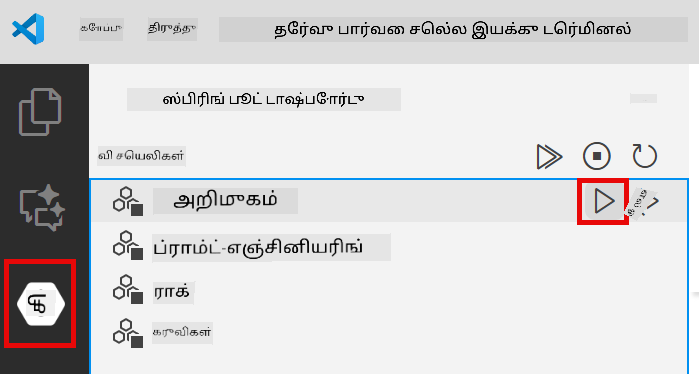
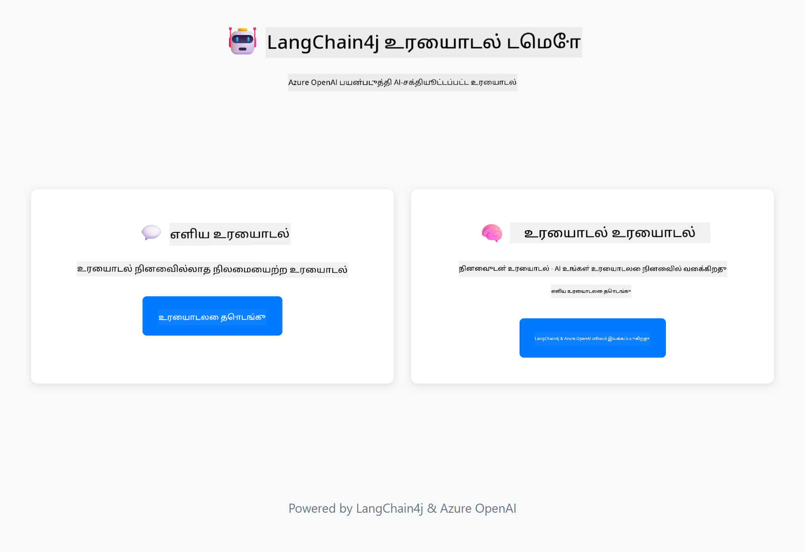

<!--
CO_OP_TRANSLATOR_METADATA:
{
  "original_hash": "c3e07ca58d0b8a3f47d3bf5728541e0a",
  "translation_date": "2025-12-13T14:16:17+00:00",
  "source_file": "01-introduction/README.md",
  "language_code": "ta"
}
-->
# Module 01: LangChain4j உடன் துவக்கம்

## உள்ளடக்க அட்டவணை

- [நீங்கள் கற்றுக்கொள்ளப்போகும் விஷயங்கள்](../../../01-introduction)
- [முன்னோட்டங்கள்](../../../01-introduction)
- [முக்கிய பிரச்சினையை புரிந்துகொள்வது](../../../01-introduction)
- [டோக்கன்களைப் புரிந்துகொள்வது](../../../01-introduction)
- [நினைவகம் எப்படி செயல்படுகிறது](../../../01-introduction)
- [இது LangChain4j ஐ எப்படி பயன்படுத்துகிறது](../../../01-introduction)
- [Azure OpenAI கட்டமைப்பை நிறுவுதல்](../../../01-introduction)
- [பயன்பாட்டை உள்ளூர் இயக்குதல்](../../../01-introduction)
- [பயன்பாட்டைப் பயன்படுத்துதல்](../../../01-introduction)
  - [நிலையற்ற உரையாடல் (இடது பக்கம்)](../../../01-introduction)
  - [நிலையான உரையாடல் (வலது பக்கம்)](../../../01-introduction)
- [அடுத்த படிகள்](../../../01-introduction)

## நீங்கள் கற்றுக்கொள்ளப்போகும் விஷயங்கள்

நீங்கள் விரைவு துவக்கத்தை முடித்திருந்தால், நீங்கள் எப்படி ப்ராம்ப்ட்களை அனுப்பி பதில்களை பெறுவது என்பதை பார்த்தீர்கள். அது அடித்தளம், ஆனால் உண்மையான பயன்பாடுகள் அதற்கு மேலாக தேவை. இந்த மொடியூல் உரையாடல் AI-ஐ உருவாக்குவது எப்படி என்பதை கற்றுக்கொடுக்கிறது, அது சூழலை நினைவில் வைக்கிறது மற்றும் நிலையை பராமரிக்கிறது - ஒருமுறை டெமோ மற்றும் தயாரிப்பு தயாரான பயன்பாட்டுக்கு இடையேயான வேறுபாடு.

இந்த வழிகாட்டியில் Azure OpenAI இன் GPT-5 ஐ முழுமையாக பயன்படுத்துவோம், ஏனெனில் அதன் மேம்பட்ட காரணமறிதல் திறன்கள் வெவ்வேறு மாதிரிகளின் நடத்தை தெளிவாக காட்டுகின்றன. நீங்கள் நினைவகத்தை சேர்க்கும் போது, வேறுபாடு தெளிவாக தெரியும். இது ஒவ்வொரு கூறும் உங்கள் பயன்பாட்டிற்கு என்ன கொடுப்பதென்பதை புரிந்துகொள்ள எளிதாக்குகிறது.

நீங்கள் இரண்டு மாதிரிகளையும் காட்டும் ஒரு பயன்பாட்டை உருவாக்குவீர்கள்:

**நிலையற்ற உரையாடல்** - ஒவ்வொரு கோரிக்கையும் தனித்துவமானது. மாடல் முந்தைய செய்திகளை நினைவில் வைக்காது. இது நீங்கள் விரைவு துவக்கத்தில் பயன்படுத்திய மாதிரி.

**நிலையான உரையாடல்** - ஒவ்வொரு கோரிக்கையும் உரையாடல் வரலாற்றை உள்ளடக்கியது. மாடல் பல முறை உரையாடல்களில் சூழலை பராமரிக்கிறது. இது தயாரிப்பு பயன்பாடுகளுக்கு தேவையானது.

## முன்னோட்டங்கள்

- Azure சந்தா மற்றும் Azure OpenAI அணுகல்
- Java 21, Maven 3.9+
- Azure CLI (https://learn.microsoft.com/en-us/cli/azure/install-azure-cli)
- Azure Developer CLI (azd) (https://learn.microsoft.com/en-us/azure/developer/azure-developer-cli/install-azd)

> **குறிப்பு:** Java, Maven, Azure CLI மற்றும் Azure Developer CLI (azd) வழங்கப்பட்ட devcontainer இல் முன்கூட்டியே நிறுவப்பட்டுள்ளன.

> **குறிப்பு:** இந்த மொடியூல் Azure OpenAI இல் GPT-5 ஐ பயன்படுத்துகிறது. `azd up` மூலம் தானாகவே கட்டமைக்கப்படுகிறது - கோடில் மாடல் பெயரை மாற்ற வேண்டாம்.

## முக்கிய பிரச்சினையை புரிந்துகொள்வது

மொழி மாதிரிகள் நிலையற்றவை. ஒவ்வொரு API அழைப்பும் தனித்துவமானது. நீங்கள் "என் பெயர் ஜான்" என்று அனுப்பி பின்னர் "என் பெயர் என்ன?" என்று கேட்டால், மாடல் நீங்கள் தானே அறிமுகப்படுத்தியதை அறியாது. அது ஒவ்வொரு கோரிக்கையையும் நீங்கள் முதன்முறையாக உரையாடுகிறீர்கள் போல கருதுகிறது.

இது எளிய கேள்வி-பதில் செயல்பாடுகளுக்கு சரி, ஆனால் உண்மையான பயன்பாடுகளுக்கு பயனற்றது. வாடிக்கையாளர் சேவை பாட்டுகள் நீங்கள் சொன்னதை நினைவில் வைக்க வேண்டும். தனிப்பட்ட உதவியாளர்கள் சூழலை தேவைப்படுத்துகின்றனர். எந்த பல முறை உரையாடலும் நினைவகத்தை தேவைப்படுத்தும்.


*நிலையற்ற (தனித்துவ அழைப்புகள்) மற்றும் நிலையான (சூழல் அறிவு) உரையாடல்களின் வேறுபாடு*

## டோக்கன்களைப் புரிந்துகொள்வது

உரையாடல்களில் மூழ்குவதற்கு முன், டோக்கன்களைப் புரிந்துகொள்வது முக்கியம் - மொழி மாதிரிகள் செயலாக்கும் அடிப்படை உரை அலகுகள்:


*உரை எப்படி டோக்கன்களாக பிரிக்கப்படுகிறது என்பதன் உதாரணம் - "I love AI!" என்பது 4 தனித்தனியான செயலாக்க அலகுகளாக மாறுகிறது*

டோக்கன்கள் AI மாதிரிகள் உரையை அளவிடவும் செயலாக்கவும் பயன்படுத்தும் வழி. சொற்கள், குறியீடுகள் மற்றும் இடைவெளிகளும் டோக்கன்கள் ஆகலாம். உங்கள் மாடல் ஒரே நேரத்தில் எத்தனை டோக்கன்களை செயலாக்க முடியும் என்பதில் வரம்பு உள்ளது (GPT-5 க்கு 400,000, அதில் 272,000 உள்ளீட்டு டோக்கன்கள் மற்றும் 128,000 வெளியீட்டு டோக்கன்கள்). டோக்கன்களை புரிந்துகொள்வது உரையாடல் நீளம் மற்றும் செலவுகளை நிர்வகிக்க உதவும்.

## நினைவகம் எப்படி செயல்படுகிறது

உரையாடல் நினைவகம் நிலையற்ற பிரச்சினையை உரையாடல் வரலாற்றை பராமரிப்பதன் மூலம் தீர்க்கிறது. உங்கள் கோரிக்கையை மாடலுக்கு அனுப்புவதற்கு முன், கட்டமைப்பு தொடர்புடைய முந்தைய செய்திகளை முன்னோக்கி சேர்க்கிறது. நீங்கள் "என் பெயர் என்ன?" என்று கேட்டால், அமைப்பு முழு உரையாடல் வரலாற்றையும் அனுப்புகிறது, இதனால் மாடல் நீங்கள் முன்பு "என் பெயர் ஜான்" என்று சொன்னதை பார்க்க முடியும்.

LangChain4j நினைவக செயலாக்கங்களை தானாக கையாளும். நீங்கள் எத்தனை செய்திகளை வைத்திருக்க வேண்டும் என்பதை தேர்வு செய்கிறீர்கள், கட்டமைப்பு சூழல் சாளரத்தை நிர்வகிக்கிறது.


*MessageWindowChatMemory சமீபத்திய செய்திகளின் ஒரு ஸ்லைடிங் சாளரத்தை பராமரிக்கிறது, பழையவற்றை தானாக நீக்குகிறது*

## இது LangChain4j ஐ எப்படி பயன்படுத்துகிறது

இந்த மொடியூல் விரைவு துவக்கத்தை விரிவுபடுத்தி Spring Boot ஐ ஒருங்கிணைத்து உரையாடல் நினைவகத்தை சேர்க்கிறது. கூறுகள் எப்படி இணைக்கப்படுகின்றன:

**இணைப்புகள்** - இரண்டு LangChain4j நூலகங்களை சேர்க்கவும்:

```xml
<dependency>
    <groupId>dev.langchain4j</groupId>
    <artifactId>langchain4j</artifactId> <!-- Inherited from BOM in root pom.xml -->
</dependency>
<dependency>
    <groupId>dev.langchain4j</groupId>
    <artifactId>langchain4j-open-ai-official</artifactId> <!-- Inherited from BOM in root pom.xml -->
</dependency>
```

**உரையாடல் மாடல்** - Azure OpenAI ஐ Spring பீனாக அமைக்கவும் ([LangChainConfig.java](../../../01-introduction/src/main/java/com/example/langchain4j/config/LangChainConfig.java)):

```java
@Bean
public OpenAiOfficialChatModel openAiOfficialChatModel() {
    return OpenAiOfficialChatModel.builder()
            .baseUrl(azureEndpoint)
            .apiKey(azureApiKey)
            .modelName(deploymentName)
            .timeout(Duration.ofMinutes(5))
            .maxRetries(3)
            .build();
}
```

பில்டர் `azd up` மூலம் அமைக்கப்பட்ட சுற்றுச்சூழல் மாறிலிகளிலிருந்து அங்கீகாரங்களை வாசிக்கிறது. `baseUrl` ஐ உங்கள் Azure முடிவுச்சுட்டிக்கு அமைத்தால் OpenAI கிளையண்ட் Azure OpenAI உடன் வேலை செய்யும்.

**உரையாடல் நினைவகம்** - MessageWindowChatMemory உடன் உரையாடல் வரலாற்றை கண்காணிக்கவும் ([ConversationService.java](../../../01-introduction/src/main/java/com/example/langchain4j/service/ConversationService.java)):

```java
ChatMemory memory = MessageWindowChatMemory.withMaxMessages(10);

memory.add(UserMessage.from("My name is John"));
memory.add(AiMessage.from("Nice to meet you, John!"));

memory.add(UserMessage.from("What's my name?"));
AiMessage aiMessage = chatModel.chat(memory.messages()).aiMessage();
memory.add(aiMessage);
```

`withMaxMessages(10)` கொண்டு நினைவகத்தை உருவாக்கி கடைசி 10 செய்திகளை வைத்திருக்கவும். பயனர் மற்றும் AI செய்திகளை `UserMessage.from(text)` மற்றும் `AiMessage.from(text)` Typed wrappers மூலம் சேர்க்கவும். வரலாற்றை `memory.messages()` மூலம் பெறவும், அதை மாடலுக்கு அனுப்பவும். சேவை உரையாடல் ஐடியின் அடிப்படையில் தனித்த நினைவகங்களை சேமிக்கிறது, இது பல பயனர்களுக்கு ஒரே நேரத்தில் உரையாட அனுமதிக்கிறது.

> **🤖 [GitHub Copilot](https://github.com/features/copilot) உரையாடலுடன் முயற்சிக்கவும்:** [`ConversationService.java`](../../../01-introduction/src/main/java/com/example/langchain4j/service/ConversationService.java) திறந்து கேளுங்கள்:
> - "MessageWindowChatMemory சாளரமுழுதானபோது எந்த செய்திகளை நீக்க முடிவு செய்கிறது?"
> - "நினைவக சேமிப்பை in-memory அல்லாமல் தரவுத்தளத்தில் தனிப்பயனாக்க முடியுமா?"
> - "பழைய உரையாடல் வரலாற்றை சுருக்க சுருக்கத்தைச் சேர்க்க எப்படி?"

நிலையற்ற உரையாடல் எண்ட்பாயிண்ட் நினைவகத்தை முற்றிலும் தவிர்க்கிறது - விரைவு துவக்கத்தில் போல `chatModel.chat(prompt)` மட்டுமே. நிலையான எண்ட்பாயிண்ட் நினைவகத்தில் செய்திகளை சேர்க்கிறது, வரலாற்றை பெறுகிறது மற்றும் அந்த சூழலை ஒவ்வொரு கோரிக்கையுடனும் சேர்க்கிறது. அதே மாடல் கட்டமைப்பு, வேறுபட்ட மாதிரிகள்.

## Azure OpenAI கட்டமைப்பை நிறுவுதல்

**Bash:**
```bash
cd 01-introduction
azd up  # சந்தா மற்றும் இடத்தை தேர்ந்தெடுக்கவும் (eastus2 பரிந்துரைக்கப்படுகிறது)
```

**PowerShell:**
```powershell
cd 01-introduction
azd up  # சந்தா மற்றும் இடத்தை தேர்ந்தெடுக்கவும் (eastus2 பரிந்துரைக்கப்படுகிறது)
```

> **குறிப்பு:** நீங்கள் நேரம் முடிவதற்கான பிழை (`RequestConflict: Cannot modify resource ... provisioning state is not terminal`) சந்தித்தால், `azd up` ஐ மீண்டும் இயக்கவும். Azure வளங்கள் பின்னணியில் இன்னும் நிறுவப்படலாம், மீண்டும் முயற்சிப்பது வளங்கள் இறுதி நிலைக்கு வந்ததும் நிறுவலை முடிக்க உதவும்.

இது:
1. GPT-5 மற்றும் text-embedding-3-small மாதிரிகளுடன் Azure OpenAI வளத்தை நிறுவும்
2. அங்கீகாரங்களுடன் `.env` கோப்பை திட்டத்தின் ரூட் கோப்புறையில் தானாக உருவாக்கும்
3. தேவையான அனைத்து சுற்றுச்சூழல் மாறிலிகளையும் அமைக்கும்

**நிறுவலில் சிக்கல்?** [Infrastructure README](infra/README.md) இல் துணை டொமைன் பெயர் மோதல்கள், கைமுறை Azure போர்டல் நிறுவல் படிகள் மற்றும் மாடல் கட்டமைப்பு வழிகாட்டுதல்கள் உள்ளன.

**நிறுவல் வெற்றிகரமாக நடந்ததா என்பதை சரிபார்க்கவும்:**

**Bash:**
```bash
cat ../.env  # AZURE_OPENAI_ENDPOINT, API_KEY, மற்றும் பிறவற்றை காட்ட வேண்டும்.
```

**PowerShell:**
```powershell
Get-Content ..\.env  # AZURE_OPENAI_ENDPOINT, API_KEY, மற்றும் பிறவற்றை காட்ட வேண்டும்.
```

> **குறிப்பு:** `azd up` கட்டளை `.env` கோப்பை தானாக உருவாக்கும். அதை பின்னர் புதுப்பிக்க வேண்டுமானால், `.env` கோப்பை கைமுறையாக திருத்தவோ அல்லது கீழ்காணும் கட்டளைகளை இயக்கி மீண்டும் உருவாக்கவோ செய்யலாம்:
>
> **Bash:**
> ```bash
> cd ..
> bash .azd-env.sh
> ```
>
> **PowerShell:**
> ```powershell
> cd ..
> .\.azd-env.ps1
> ```

## பயன்பாட்டை உள்ளூர் இயக்குதல்

**நிறுவலை சரிபார்க்கவும்:**

Azure அங்கீகாரங்களுடன் `.env` கோப்பு ரூட் கோப்புறையில் உள்ளது என்பதை உறுதி செய்யவும்:

**Bash:**
```bash
cat ../.env  # AZURE_OPENAI_ENDPOINT, API_KEY, DEPLOYMENT ஐ காட்ட வேண்டும்
```

**PowerShell:**
```powershell
Get-Content ..\.env  # AZURE_OPENAI_ENDPOINT, API_KEY, DEPLOYMENT ஐ காட்ட வேண்டும்
```

**பயன்பாடுகளை துவங்கவும்:**

**விருப்பம் 1: Spring Boot டாஷ்போர்டைப் பயன்படுத்துதல் (VS Code பயனர்களுக்கு பரிந்துரைக்கப்படுகிறது)**

devcontainer Spring Boot டாஷ்போர்டு விரிவாக்கத்தை கொண்டுள்ளது, இது அனைத்து Spring Boot பயன்பாடுகளையும் கையாள ஒரு காட்சி இடைமுகத்தை வழங்குகிறது. VS Code இல் இடது பக்க Activity Bar இல் Spring Boot ஐகானை காணலாம்.

Spring Boot டாஷ்போர்டில் நீங்கள்:
- பணியிடத்தில் உள்ள அனைத்து Spring Boot பயன்பாடுகளையும் காணலாம்
- ஒரு கிளிக்கில் பயன்பாடுகளை துவக்க/நிறுத்தலாம்
- பயன்பாட்டு பதிவுகளை நேரடியாக பார்க்கலாம்
- பயன்பாட்டு நிலையை கண்காணிக்கலாம்

இந்த மொடியூலை துவங்க "introduction" பக்கத்தில் உள்ள பிளே பொத்தானை கிளிக் செய்யவும் அல்லது அனைத்து மொடியூல்களையும் ஒரே நேரத்தில் துவங்கவும்.



**விருப்பம் 2: ஷெல் ஸ்கிரிப்ட்களை பயன்படுத்துதல்**

அனைத்து வலை பயன்பாடுகளையும் (மொடியூல்கள் 01-04) துவங்கவும்:

**Bash:**
```bash
cd ..  # ரூட் அடைவு கோப்புறையிலிருந்து
./start-all.sh
```

**PowerShell:**
```powershell
cd ..  # ரூட் அடைவு கோப்புறையிலிருந்து
.\start-all.ps1
```

அல்லது இந்த மொடியூலை மட்டும் துவங்கவும்:

**Bash:**
```bash
cd 01-introduction
./start.sh
```

**PowerShell:**
```powershell
cd 01-introduction
.\start.ps1
```

இரு ஸ்கிரிப்ட்களும் ரூட் `.env` கோப்பிலிருந்து சுற்றுச்சூழல் மாறிலிகளை தானாக ஏற்றும் மற்றும் JAR கோப்புகள் இல்லாவிட்டால் அவற்றை கட்டும்.

> **குறிப்பு:** நீங்கள் துவங்குவதற்கு முன் அனைத்து மொடியூல்களையும் கைமுறையாக கட்ட விரும்பினால்:
>
> **Bash:**
> ```bash
> cd ..  # Go to root directory
> mvn clean package -DskipTests
> ```
>
> **PowerShell:**
> ```powershell
> cd ..  # Go to root directory
> mvn clean package -DskipTests
> ```

உங்கள் உலாவியில் http://localhost:8080 ஐ திறக்கவும்.

**நிறுத்த:**

**Bash:**
```bash
./stop.sh  # இந்த தொகுதி மட்டும்
# அல்லது
cd .. && ./stop-all.sh  # அனைத்து தொகுதிகளும்
```

**PowerShell:**
```powershell
.\stop.ps1  # இந்த தொகுதி மட்டும்
# அல்லது
cd ..; .\stop-all.ps1  # அனைத்து தொகுதிகளும்
```

## பயன்பாட்டைப் பயன்படுத்துதல்

பயன்பாடு இரண்டு உரையாடல் செயலாக்கங்களுடன் இணைய முகப்பை வழங்குகிறது.



*Dashboard இல் எளிய உரையாடல் (நிலையற்ற) மற்றும் உரையாடல் உரையாடல் (நிலையான) விருப்பங்கள் இரண்டும் காணப்படுகிறது*

### நிலையற்ற உரையாடல் (இடது பக்கம்)

முதலில் இதை முயற்சிக்கவும். "என் பெயர் ஜான்" என்று கேட்டு உடனடியாக "என் பெயர் என்ன?" என்று கேளுங்கள். மாடல் நினைவில் வைக்காது ஏனெனில் ஒவ்வொரு செய்தியும் தனித்துவமானது. இது அடிப்படை மொழி மாதிரி ஒருங்கிணைப்பில் உள்ள முக்கிய பிரச்சினையை காட்டுகிறது - உரையாடல் சூழல் இல்லை.


*AI உங்கள் பெயரை முந்தைய செய்தியிலிருந்து நினைவில் வைக்காது*

### நிலையான உரையாடல் (வலது பக்கம்)

இப்போது அதே வரிசையை இங்கே முயற்சிக்கவும். "என் பெயர் ஜான்" என்று கேட்டு பின்னர் "என் பெயர் என்ன?" என்று கேளுங்கள். இப்போது அது நினைவில் வைக்கிறது. வேறுபாடு MessageWindowChatMemory - இது உரையாடல் வரலாற்றை பராமரித்து ஒவ்வொரு கோரிக்கையுடனும் சேர்க்கிறது. இது தயாரிப்பு உரையாடல் AI எப்படி செயல்படுகிறது என்பதைக் காட்டுகிறது.


*AI உரையாடலில் முன்பு சொன்ன உங்கள் பெயரை நினைவில் வைக்கிறது*

இரு பக்கங்களும் அதே GPT-5 மாடலைப் பயன்படுத்துகின்றன. ஒரே வேறுபாடு நினைவகம். இது நினைவகம் உங்கள் பயன்பாட்டிற்கு என்ன கொடுப்பதென்பதை தெளிவாக காட்டுகிறது மற்றும் உண்மையான பயன்பாடுகளுக்கு அவசியம் என்பதைக் காட்டுகிறது.

## அடுத்த படிகள்

**அடுத்த மொடியூல்:** [02-prompt-engineering - GPT-5 உடன் ப்ராம்ப்ட் பொறியியல்](../02-prompt-engineering/README.md)

---

**நெவிகேஷன்:** [← முந்தையது: Module 00 - விரைவு துவக்கம்](../00-quick-start/README.md) | [முதன்மைக்கு திரும்பவும்](../README.md) | [அடுத்தது: Module 02 - ப்ராம்ப்ட் பொறியியல் →](../02-prompt-engineering/README.md)

---

<!-- CO-OP TRANSLATOR DISCLAIMER START -->
**குறிப்பு**:  
இந்த ஆவணம் AI மொழிபெயர்ப்பு சேவை [Co-op Translator](https://github.com/Azure/co-op-translator) மூலம் மொழிபெயர்க்கப்பட்டுள்ளது. நாங்கள் துல்லியத்திற்காக முயற்சித்தாலும், தானாக செய்யப்பட்ட மொழிபெயர்ப்புகளில் பிழைகள் அல்லது தவறுகள் இருக்கக்கூடும் என்பதை தயவுசெய்து கவனிக்கவும். அசல் ஆவணம் அதன் சொந்த மொழியில் அதிகாரப்பூர்வ மூலமாக கருதப்பட வேண்டும். முக்கியமான தகவல்களுக்கு, தொழில்முறை மனித மொழிபெயர்ப்பை பரிந்துரைக்கிறோம். இந்த மொழிபெயர்ப்பின் பயன்பாட்டால் ஏற்படும் எந்தவொரு தவறான புரிதலுக்கும் அல்லது தவறான விளக்கங்களுக்கும் நாங்கள் பொறுப்பேற்கமாட்டோம்.
<!-- CO-OP TRANSLATOR DISCLAIMER END -->