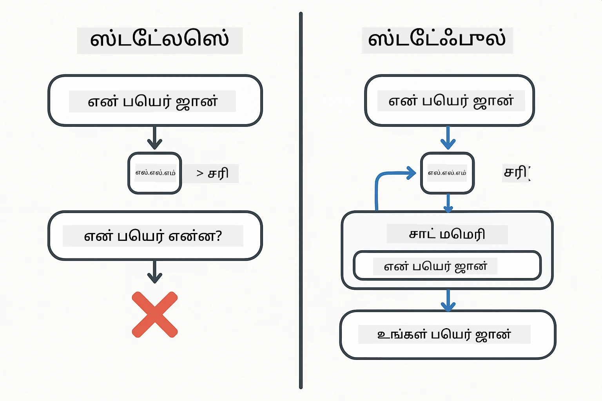
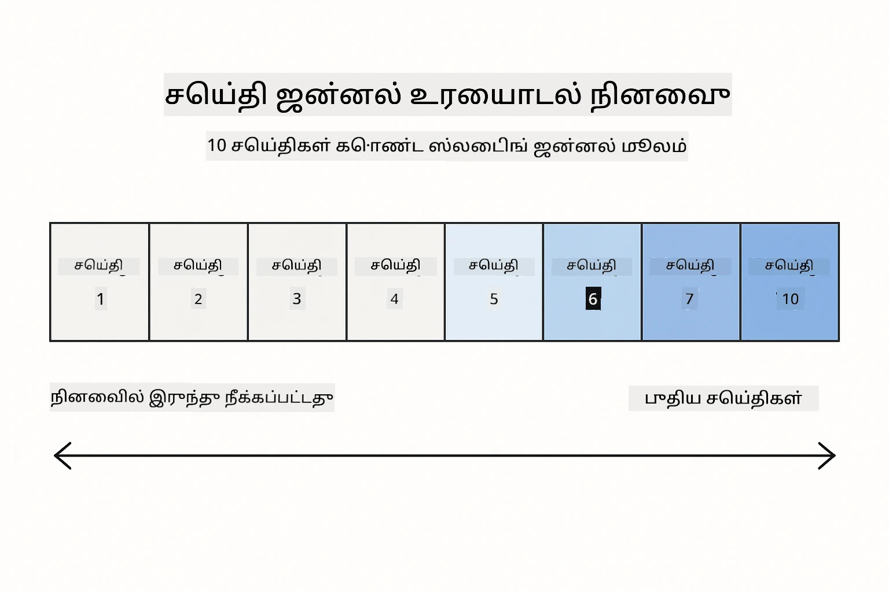
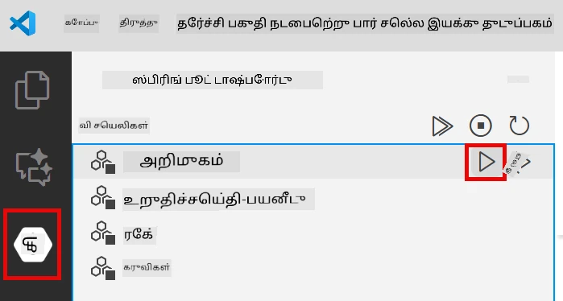
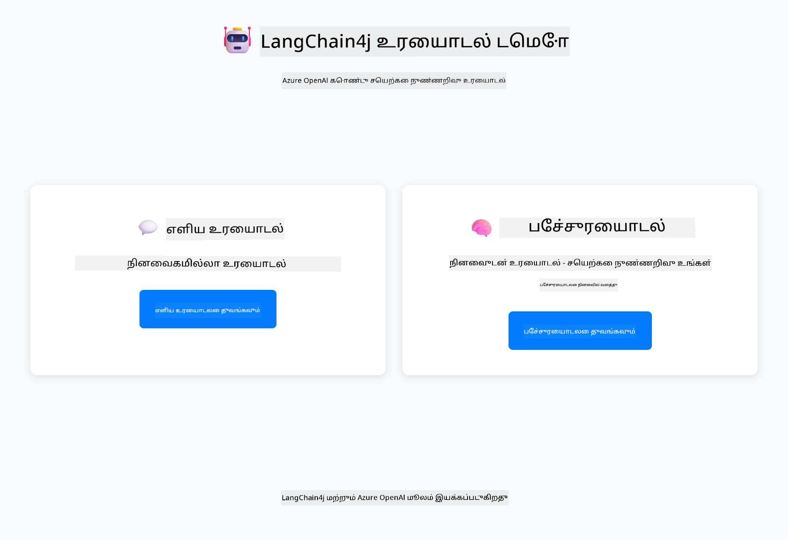
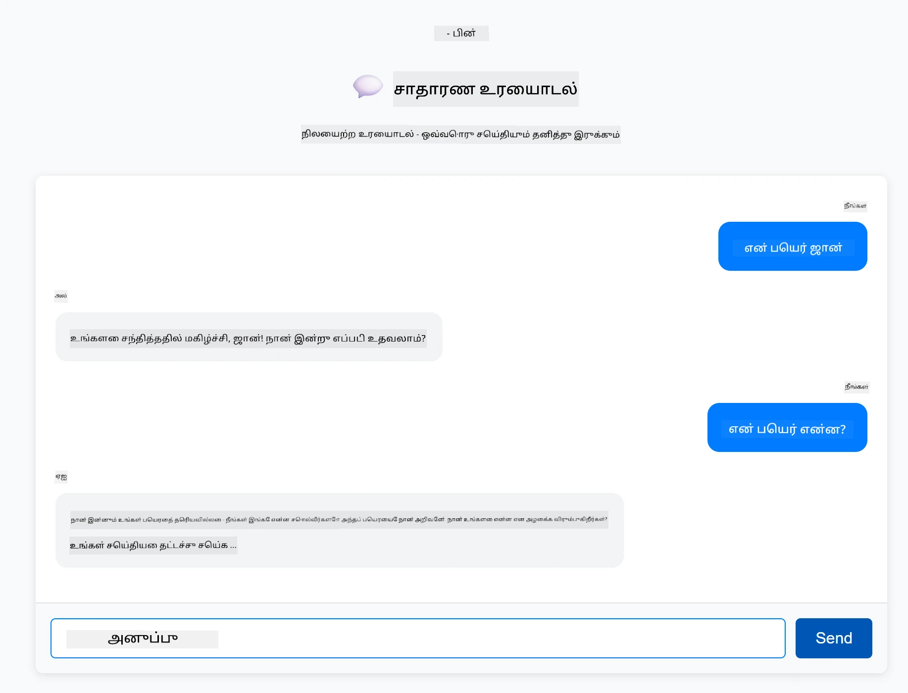
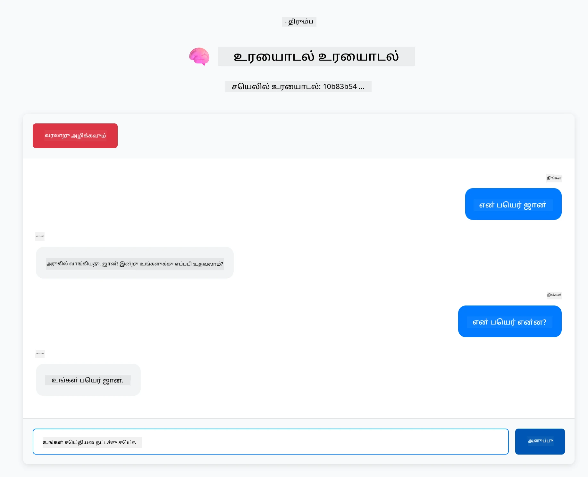

# Module 01: LangChain4j உடன் தொடக்கம்

## зміст

- [காணொளி நடைமுறை](#காணொளி-நடைமுறை)
- [நீங்கள் கற்கப்போகும் விஷயங்கள்](#நீங்கள்-கற்கப்போகும்-விஷயங்கள்)
- [முன்‌தோகுதிகள்](#முன்‌தோகுதிகள்)
- [மையப் பிரச்சினையை புரிந்துகொள்வது](#மையப்-பிரச்சினையைப்-புரிந்துகொள்வது)
- [டோக்கன்களை புரிந்துகொள்வது](#டோக்கன்களைப்-புரிந்துகொள்வது)
- [நினைவகம் எப்படி பணிபுரிகிறது](#நினைவகம்-எப்படி-பணிபுரிகிறது)
- [இது LangChain4j ஐ எவ்வாறு பயன்படுத்துகிறது](#இது-langchain4j-ஐ-எவ்வாறு-பயன்படுத்துகிறது)
- [Azure OpenAI கட்டமைப்பை பயன்படுத்தி வைக்கவும்](#azure-openai-கட்டமைப்பை-பயன்படுத்தி-வைக்கவும்)
- [பயன்பாட்டைப் புறவிடுவோம்](#பயன்பாட்டைப்-புறவிடு)
- [பயன்பாட்டைப் பயன்படுத்துவது](#பயன்பாட்டைப்-பயன்படுத்துதல்)
  - [நிலையற்ற உரையாடல் (இடது பக்கம்)](#நிலையற்ற-உரையாடல்-இடது-பக்கம்)
  - [நிலையான உரையாடல் (வலது பக்கம்)](#நிலையான-உரையாடல்-வலது-பக்கம்)
- [அடுத்த படிகள்](#அடுத்த-படிகள்)

## காணொளி நடைமுறை

இந்த முதலாண்டு கட்டத்தில் LangChain4j உடன் எப்படி தொடங்குவது என்று விளக்கும் நேரடி அமர்வை பாருங்கள்:

<a href="https://www.youtube.com/live/nl_troDm8rQ?si=6b85S8xGjWnT2fX9"></a>

## நீங்கள் கற்கப்போகும் விஷயங்கள்

இது LangChain4j மற்றும் Azure OpenAI உடன் உங்கள் தொடக்கப் புள்ளி. நாம் அடிப்படைகளைத் தொடங்குகிறோம் மற்றும் உற்பத்தி பாணி பயன்பாடுகளை கட்டமைக்கத் தொடங்குகிறோம். இந்த தொகுதி உரையாடல் AI ஆகும், அது சூழ்நிலையை நினைவில் வைத்திருக்கும் மற்றும் நிலையை பராமரிக்கும் — இது எல்லா அடுத்த தொகுதிகளின் அடிப்படையான கருத்துகள்.

இந்த வழிகாட்டியிலே முழுமையாக Azure OpenAI இன் GPT-5.2 ஐ பயன்படுத்துகிறோம், ஏனெனில் அதன் மேம்பட்ட ஆய்வுக்கூறுகள் விதிகள் நடத்தை தெளிவாக காட்டுகிறது. நீங்கள் நினைவகத்தை சேர்க்கும்போது, வேறுபாட்டை தெளிவாகப் பார்ப்பீர்கள். இது ஒவ்வொரு கூறும் உங்கள் பயன்பாட்டுக்கு என்ன சேர்க்கிறது என்பதை விளக்கமாக்கிறது.

நீங்கள் இரண்டு விதமுள்ள பயன்பாடுகளையும் உருவாக்கப்போகிறீர்கள்:

**நிலையற்ற உரையாடல்** - ஒவ்வொரு கோரலும் தனித்தனி. முன் செய்திகளுக்கு எதையும் நினைவில் வைக்காது. இது எளிய தொடக்கப் புள்ளி.

**நிலையான உரையாடல்** - ஒவ்வொரு கோரலிலும் உரையாடல் வரலாற்று சேர்க்கப்பட்டிருக்கும். பல தடவைகள் தொடுக்கும்போது சூழ்நிலை பராமரிக்கப்படும். இது உற்பத்தி பயன்பாடுகளுக்கு தேவை.

## முன்‌தோகுதிகள்

- Azure சந்தா மற்றும் Azure OpenAI அணுகல்
- Java 21, Maven 3.9+ 
- Azure CLI (https://learn.microsoft.com/en-us/cli/azure/install-azure-cli)
- Azure Developer CLI (azd) (https://learn.microsoft.com/en-us/azure/developer/azure-developer-cli/install-azd)

> **குறிப்பு:** Java, Maven, Azure CLI மற்றும் Azure Developer CLI (azd) வழங்கப்பட்ட devcontainer இல் முன்னதாக நிறுவப்பட்டுள்ளன.

> **குறிப்பு:** இந்த தொகுதி Azure OpenAI இல் GPT-5.2 ஐ பயன்படுத்துகிறது. azd up மூலம் தானாக கட்டமைக்கப்படுகிறது - குறியீட்டில் மாடல் பெயரை மாற்ற வேண்டாம்.

## மையப் பிரச்சினையைப் புரிந்துகொள்வது

மொழி மாதிரிகள் நிலையற்றவை. ஒவ்வொரு API அழைப்பும் தனி சுயமாக இருக்கும். "எனது பெயர் ஜான்" என கூறியபின் "என் பெயர் என்ன?" என கேட்டால், மாதிரி இப்பொழுது நீங்கள் அறிமுகம் செய்ததை அறியாது. அனைத்து கோரல்களையும் முதலாவது உரையாடலாகவே கருதுகிறது.

இது எளிய கேள்வி மற்றும் பதிற்ணை நன்றாக செல்லும், ஆனால் உண்மையான பயன்பாடுகளுக்கு பயனற்றது. வாடிக்கையாளர் சேவை bot கள் நீங்கள் சொன்னதை நினைவில் வைத்திருக்க வேண்டும். தனிப்பட்ட உதவியாளர்கள் சூழ்நிலையை தேவைபடுகின்றனர். பல தடவை நடந்த உரையாடல் நினைவகம் தேவை.

டயாகிராமில் இடதுபுறம் name மறந்த நிலையற்ற அழைப்பு மற்றும் வலதுபுறம் ChatMemory நோக்கிப்பார்க்கும் நிலையான அழைப்பு காட்டப்பட்டுள்ளது.



*நிலையற்ற (தனித்தனி அழைப்புகள்) மற்றும் நிலையான (சூழ்நிலை அறிவு) உரையாடல்கள் இடையேயான வேறுபாடு*

## டோக்கன்களைப் புரிந்துகொள்வது

உரையாடல்களில் சென்று முன், டோக்கன்கள் - மொழி மாதிரிகள் செயலாக்கும் அடிப்படையான எழுத்துச் சுழற்சிகள் பற்றி அறிந்து கொள்வது முக்கியம்.


*உரையை டோக்கன்களாக உடைக்கும் உதாரணம் - "I love AI!" என்பது 4 தனித்துதானிய செயலாக்க துகள்களாக மாறும்*

டோக்கன்கள் AI மாதிரிகள் உரையை அளக்கும் மற்றும் செயலாக்கும் வழி. வார்த்தைகள், எழுத்துடைச்சல் மற்றும் இடைவெளிகளும் டோக்கன்கள் ஆகும். உங்கள் மாதிரிக்கு ஒரே நேரத்தில் செயலாக்கக்கூடிய டோக்கன்களின் வரம்பு உண்டு (GPT-5.2 க்கு 400,000, 272,000 உள்ளீடு மற்றும் 128,000 வெளியீடு). டோக்கன்களை புரிந்து கொள்ளுதல் உரையாடல் நீளம் மற்றும் செலவுகளை கவனிக்க உதவும்.

## நினைவகம் எப்படி பணிபுரிகிறது

Chat memory நிலையற்ற பிரச்சனையை உரையாடல் வரலாற்றை பராமரிப்பது மூலம் தீர்க்கிறது. மாதிரிக்கு கோரல் அனுப்புவதற்கு முன்னர், கட்டமைப்பு தொடர்புடைய முன் செய்திகளை இணைக்கும். நீங்கள் "என் பெயர் என்ன?" என்றால், அமைப்பு முழு உரையாடல் வரலாற்றையும் அனுப்புகிறது என்பதால் மாதிரி "என் பெயர் ஜான்" என்று நீங்கள் முன்பு சொன்னதை பார்க்க முடியும்.

LangChain4j நினைவகம் செயல்திறன்களை தானாக கையாள்கிறார். நீங்கள் எத்தனை செய்திகள் வைத்திருக்க வேண்டும் என்பதைக் தெரிவுசெய்கிறீர்கள்; கட்டமைப்பு சூழ்நிலை சாளரத்தை பராமரிக்கும். கீழ்காணும் படத்தில் MessageWindowChatMemory சமீபத்திய செய்திகளின் ஒரு ஸ்லைடிங் சாளரத்தை பராமரிப்பதை காணலாம்.



*MessageWindowChatMemory சமீபத்திய செய்திகளின் ஸ்லைடிங் சாளரத்தை பராமரித்து பழையவைகளை தானாக விலக்கிறது*

## இது LangChain4j ஐ எவ்வாறு பயன்படுத்துகிறது

இந்த தொகுதி Spring Boot ஐ இணைத்து உரையாடல் நினைவகத்தை சேர்க்கிறது. அங்கிருக்கும் கூறுகள் இங்கே இணைக்கப்படுகின்றன:

**இணைப்பு நூலகங்கள்** - இரண்டு LangChain4j நூலகங்களை சேர்க்கவும்:

```xml
<dependency>
    <groupId>dev.langchain4j</groupId>
    <artifactId>langchain4j</artifactId> <!-- Inherited from BOM in root pom.xml -->
</dependency>
<dependency>
    <groupId>dev.langchain4j</groupId>
    <artifactId>langchain4j-open-ai-official</artifactId> <!-- Inherited from BOM in root pom.xml -->
</dependency>
```

**உரையாடல் மாதிரி** - Azure OpenAI ஐ Spring பீனாக அமைக்கவும் ([LangChainConfig.java](../../../01-introduction/src/main/java/com/example/langchain4j/config/LangChainConfig.java)):

```java
@Bean
public OpenAiOfficialChatModel openAiOfficialChatModel() {
    return OpenAiOfficialChatModel.builder()
            .baseUrl(azureEndpoint)
            .apiKey(azureApiKey)
            .modelName(deploymentName)
            .timeout(Duration.ofMinutes(5))
            .maxRetries(3)
            .build();
}
```

பில்டர் `azd up` மூலம் அமைக்கப்படும் சுற்று மாறிகள் மூலம் அங்கீகாரங்களை வாசிக்கிறது. `baseUrl` ஐ உங்கள் Azure முடிச்சு URL ஆக அமைத்தால் OpenAI கிளையன்ட் Azure OpenAI உடன் வேலை செய்யும்.

**உரையாடல் நினைவகம்** - MessageWindowChatMemory உடன் உரையாடல் வரலாற்றை பின்தொடர்க ([ConversationService.java](../../../01-introduction/src/main/java/com/example/langchain4j/service/ConversationService.java)):

```java
ChatMemory memory = MessageWindowChatMemory.withMaxMessages(10);

memory.add(UserMessage.from("My name is John"));
memory.add(AiMessage.from("Nice to meet you, John!"));

memory.add(UserMessage.from("What's my name?"));
AiMessage aiMessage = chatModel.chat(memory.messages()).aiMessage();
memory.add(aiMessage);
```

`withMaxMessages(10)` உடனான நினைவகத்தை உருவாக்கி கடைசி 10 செய்திகளை வைத்திருக்கவும். Typed wrappers கொண்டு பயனர் மற்றும் AI செய்திகளைச் சேர்க்கவும்: `UserMessage.from(text)` மற்றும் `AiMessage.from(text)`. வரலாற்றை `memory.messages()` மூலம் கொண்டு வரவும் மற்றும் மாதிரிக்கு அனுப்பவும். சேவை ஒவ்வொரு உரையாடலுக்கும் தனித்த நினைவகம் உருவாக்கி பல பயனர்கள் ஒரே நேரத்தில் பேச அனுமதிக்கிறது.

> **🤖 [GitHub Copilot](https://github.com/features/copilot) Chat கொண்டு முயற்சி செய்யவும்:** [`ConversationService.java`](../../../01-introduction/src/main/java/com/example/langchain4j/service/ConversationService.java) திறந்து கேளுங்கள்:
> - "MessageWindowChatMemory சாளரம் நிரம்பும்போது எந்த செய்திகள் நீக்கப்படுமோ எப்படி தீர்மானிக்கிறது?"
> - "நினைவக சேமிப்பை மெமரியில் அல்லாமல் தரவுத்தளத்தில் தனிப்பயன் முறையில் அமைக்க முடியுமா?"
> - "பழைய உரையாடல் வரலாற்றை சுருக்குகிறது என்கிற சுருக்கத்தை எப்படி சேர்ப்பது?"

நிலையற்ற உரையாடல் முடிவில் நினைவகம் இல்லாமல் - சுருக்கமாக `chatModel.chat(prompt)` போல் செயல்படும். நிலையான முடிவில் நினைவகத்தில் செய்திகளைச் சேர்த்து வரலாற்றைப் பெற்று, அது ஒவ்வொரு கோரலுடனும் சேர்க்கிறது. மாதிரி அமைப்பு ஒன்றே, வழிமுறைகள் வேறுபாடு.

## Azure OpenAI கட்டமைப்பை பயன்படுத்தி வைக்கவும்

**Bash:**
```bash
cd 01-introduction
azd up  # சந்தா மற்றும் இடத்தை தேர்ந்தெடுக்கவும் (கிழக்குus2 பரிந்துரைக்கப்படுகிறது)
```

**PowerShell:**
```powershell
cd 01-introduction
azd up  # சந்தா மற்றும் இடத்தை தேர்ந்தெடுக்கவும் (eastus2 பரிந்துரைக்கப்படுகிறது)
```

> **குறிப்பு:** Timeout பிழை பொருந்தினால் (`RequestConflict: Cannot modify resource ... provisioning state is not terminal`), வெறும் `azd up` கட்டளை மீண்டும் தொடங்கவும். Azure வளங்கள் பின்னணி பணிகளில் இருக்கும், மீண்டும் முயற்சிப்பதால் வளங்கள் இறுதி நிலைக்கு வந்தவுடன் நிறுவல் முடியும்.

இது செய்யும் வேலைகள்:
1. GPT-5.2 மற்றும் text-embedding-3-small மாதிரிகள் உடன் Azure OpenAI வளத்தை நிறுவுக
2. அங்கீகாரங்களுடன் `.env` கோப்பை திட்டத்தின் ரூட் என்னும் இடத்தில் தானாக உருவாக்குக
3. தேவையான அனைத்து சுற்று மாறிகள் சேர்க்கவும்

**நிறுவல் சிக்கல்கள் உள்ளதா?** [கட்டமைப்பு README](infra/README.md) படி நிலைத்தளப்பிரச்சினைகள், கைமுறை Azure போர்டல் நிறுவல் படிகள் மற்றும் மாதிரி அமைப்புக்கான வழிகாட்டுதல்கள் பார்க்கவும்.

**நிறுவல் வெற்றியா என்பதை சரிபார்க்கவும்:**

**Bash:**
```bash
cat ../.env  # AZURE_OPENAI_ENDPOINT, API_KEY மற்றும் பிறவற்றை காட்ட வேண்டும்.
```

**PowerShell:**
```powershell
Get-Content ..\.env  # AZURE_OPENAI_ENDPOINT, API_KEY போன்றவற்றை காண்பிக்க வேண்டும்.
```

> **குறிப்பு:** `azd up` கட்டளை தானாக `.env` கோப்பை உருவாக்கும். தேவைப்பட்டால், `.env` கோப்பை கைமுறையாக சீரமைக்கவும் அல்லது கீழ்காணும் கட்டளையால் மீண்டும் உருவாக்கவும்:
>
> **Bash:**
> ```bash
> cd ..
> bash .azd-env.sh
> ```
>
> **PowerShell:**
> ```powershell
> cd ..
> .\.azd-env.ps1
> ```

## பயன்பாட்டைப் புறவிடு

**நிறுவல் சரிபார்க்கவும்:**

ஆறு கணினியில் Azure அனுமதிகளுடன் `.env` கோப்பு உள்ளது என்பதை உறுதிசெய்யவும். தொகுதி அடங்கிய கோப்புறையிலிருந்து (`01-introduction/`) கீழ்காணும் கட்டளைகளை இயக்கவும்:

**Bash:**
```bash
cat ../.env  # AZURE_OPENAI_ENDPOINT, API_KEY, DEPLOYMENT காட்ட வேண்டும்
```

**PowerShell:**
```powershell
Get-Content ..\.env  # AZURE_OPENAI_ENDPOINT, API_KEY, DEPLOYMENT காட்டப்பட வேண்டும்
```

**பயன்பாடுகளை ஆரம்பிக்கவும்:**

**விருப்பம் 1: Spring Boot داش்போர்ட்டைப் பயன்படுத்துதல் (ஊக்குவிக்கப்பட்டது VS Code பயனர்களுக்கு)**

Dev container இல் Spring Boot DASHBOARD விரிவாக்கம் உள்ளடக்கம். இது அனைத்து Spring Boot பயன்பாடுகளை பார்க்க ஒரு காட்சி இடைமுகத்தை வழங்குகிறது. VS Code இல் இடது Activity பட்டியில் Spring Boot ஐ காணவும்.

Spring Boot DASHBOARD இலிருந்து நீங்கள்:
- பணிப்பலகையில் உள்ள அனைத்து Spring Boot பயன்பாடுகளையும் பார்க்கலாம்
- ஒரு கிளிக்குபடி தொடக்கம்/நிறுத்தலாம்
- பயன்பாட்டு பத்திரிகைகள் நேரடியாக பார்க்கலாம்
- பயன்பாட்டு நிலையை கண்காணிக்கலாம்

"introduction" அருகே உள்ள ஓட்டுமுறை படான் கிளிக்கவும் இந்த தொகுதியை தொடங்க. அல்லது அனைத்துத் தொகுதிகளையும் ஒரே நேரத்தில் தொடங்கலாம்.



*VS Code இல் Spring Boot DASHBOARD — அனைத்து தொகுதிகளையும் ஒரே இடத்தில் தொடங்க, நிறுத்த மற்றும் கண்காணிக்க*

**விருப்பம் 2: Shell ஸ்கிரிப்ட்களைப் பயன்படுத்துதல்**

01-04 தொகுதிகளுக்கான அனைத்து வலை பயன்பாடுகளையும் தொடங்க:

**Bash:**
```bash
cd ..  # ரூட் அடைவு கோப்புறை இருந்து
./start-all.sh
```

**PowerShell:**
```powershell
cd ..  # மூல அடைவு இருந்து
.\start-all.ps1
```

அல்லது இந்த தொகுதியை மட்டும் தொடங்க:

**Bash:**
```bash
cd 01-introduction
./start.sh
```

**PowerShell:**
```powershell
cd 01-introduction
.\start.ps1
```

இரண்டு ஸ்கிரிப்ட்களும் ரூட் `.env` கோப்பிலிருந்து சுற்று மாறிகளை தானாக ஏற்றும் மற்றும் ஜார்களை உருவாக்குகையில் இவை இல்லையெனில் உருவாக்கும்.

> **குறிப்பு:** நீங்கள் இவற்றைத் தொடங்குவதற்கு முன் அனைத்து தொகுதிகளையும் கைமுறையாக கட்டமைக்க விரும்பினால்:
>
> **Bash:**
> ```bash
> cd ..  # Go to root directory
> mvn clean package -DskipTests
> ```
>
> **PowerShell:**
> ```powershell
> cd ..  # Go to root directory
> mvn clean package -DskipTests
> ```

உங்கள் உலாவியில் http://localhost:8080 ஐ திறக்கவும்.

**நிறுத்த:**

**Bash:**
```bash
./stop.sh  # இந்த தொகுதி மட்டும்
# அல்லது
cd .. && ./stop-all.sh  # அனைத்து தொகுதிகளும்
```

**PowerShell:**
```powershell
.\stop.ps1  # இந்த முறைப்பாடே மட்டும்
# அல்லது
cd ..; .\stop-all.ps1  # அனைத்து முறைப்பாடுகளும்
```

## பயன்பாட்டைப் பயன்படுத்துதல்

இரு உரையாடல் செயல்பாடுகளை பக்கங்களில் வைத்து இணைய இடைமுகம் உள்ளது.



*Dashboard-ல் சுலபமான உரையாடல் (நிலையற்ற) மற்றும் உரையாடல் நிலையான (நிலையான) விருப்பங்கள் காணப்படும்*

### நிலையற்ற உரையாடல் (இடது பக்கம்)

முதல் முறையாக முயற்சிக்கவும். "என் பெயர் ஜான்" என்று சொல்வதாக, உடனடியாக "என் பெயர் என்ன?" என்று கேளுங்கள். மாதிரி நினைவில் வைக்காது, ஏனெனில் ஒவ்வொரு செய்தியும் தனித்தனியானவை. இது அடிப்படைக் மொழி மாதிரி ஒருங்கிணைப்புக்கு உள்ள பிரச்சினையை காட்டுகிறது - உரையாடல் சூழ்நிலையில்லை.



*AI கடந்த செய்தியில் உங்கள் பெயரை நினைவில் வைத்துக்கொள்ளாது*

### நிலையான உரையாடல் (வலது பக்கம்)

இப்போது அதே வரிசையை இங்கு முயற்சிக்கவும். "என் பெயர் ஜான்" மற்றும் பின்பு "என் பெயர் என்ன?" இந்த முறையில் நினைவில் வைக்கும். வேறுபாடு MessageWindowChatMemory - அது உரையாடல் வரலாற்றை பராமரித்து ஒவ்வொரு கோரலுடனும் சேர்க்கிறது. இது உற்பத்தி உரையாடல் AI வேலை செய்யும் விதம்.



*AI உரையாடலில் முன்பு கூறிய உங்கள் பெயரை நினைவில் வைத்திருக்கிறது*

இரு பக்கங்களும் ஒரே GPT-5.2 மாதிரியை பயன்படுத்துகின்றன. ஒரே வேறுபாடு நினைவகம். இது நினைவகம் உங்கள் பயன்பாட்டிற்கு என்ன கொடுக்கும் மற்றும் உண்மையான பயன்பாடுகளில் ஏன் அவசியம் என்பதை தெளிவாக்குகிறது.

## அடுத்த படிகள்

**அடுத்த தொகுதி:** [02-prompt-engineering - GPT-5.2 உடன் ப்ராம்ட் பொறியியல்](../02-prompt-engineering/README.md)

---

**Navigation:** [← பிரத اصلیக்கு திரும்பு](../README.md) | [அடுத்தது: தொகுதி 02 - ப்ராம்ட் பொறியியல் →](../02-prompt-engineering/README.md)

---

<!-- CO-OP TRANSLATOR DISCLAIMER START -->
**மறுப்பு**:
இந்த ஆவணம் AI மொழிபெயர்ப்பு சேவை [Co-op Translator](https://github.com/Azure/co-op-translator) பயன்படுத்தி மொழிபெயர்க்கப்பட்டுள்ளது. நாங்கள் துல்லியத்திற்காக முயற்சி செய்துள்ளோம், ஆனால் தானாக செய்யப்படும் மொழிபெயர்ப்புகளில் பிழைகள் அல்லது தவறுகள் இருக்கலாம் என்பதை கவனத்தில் கொள்ளவும். அசல் ஆவணம் அதன் தாய்மொழியில் அதிகாரப்பூர்வ ஆதாரமாக கருதப்பட வேண்டும். முக்கியமான தகவல்களுக்கு, தொழில்நுட்பமான மனித மொழிபெயர்ப்பு பரிந்துரைக்கப்படுகிறது. இந்த மொழிபெயர்ப்பைப் பயன்படுத்துவதால் ஏற்படும் எந்த தவறான புரிதல்கள் அல்லது தவறான விளக்கத்திற்கும் நாங்கள் பொறுப்பில்வில்லை.
<!-- CO-OP TRANSLATOR DISCLAIMER END -->