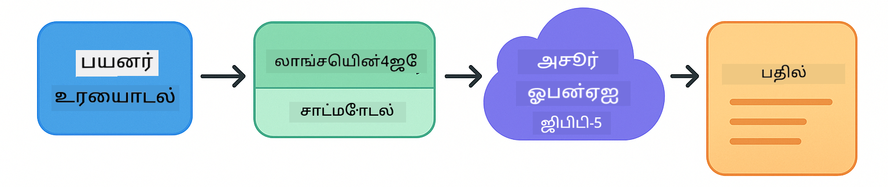
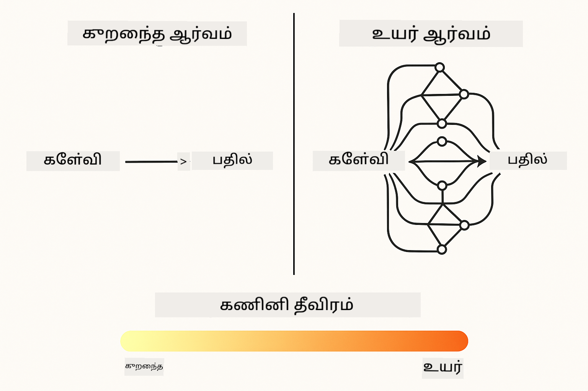
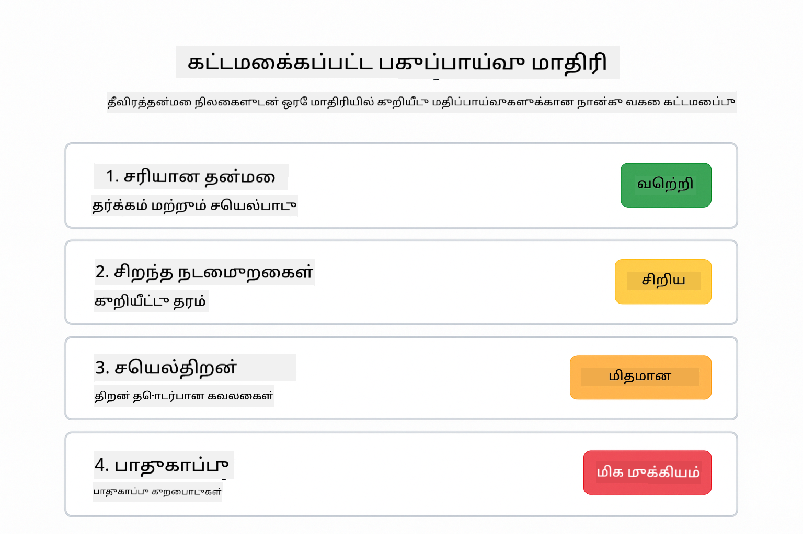
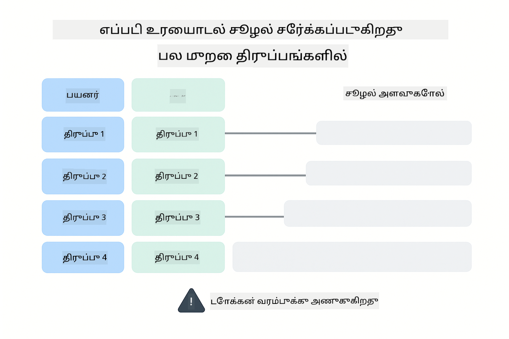
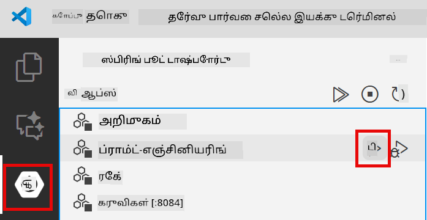
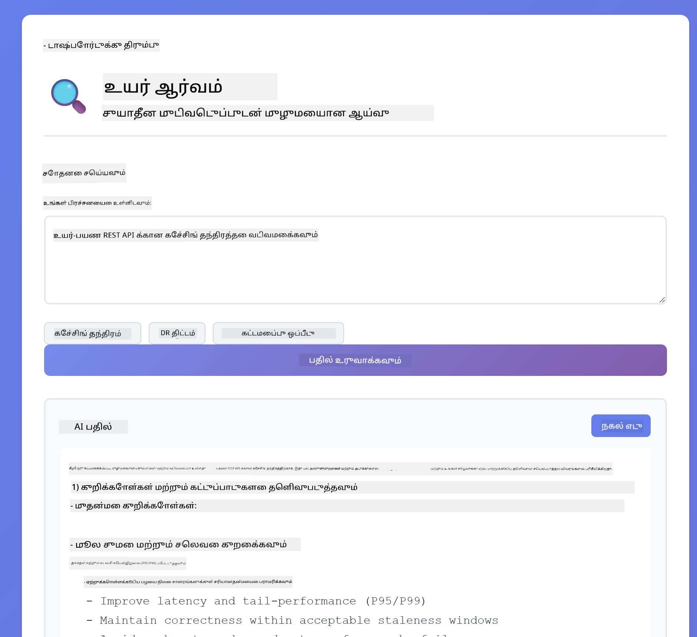
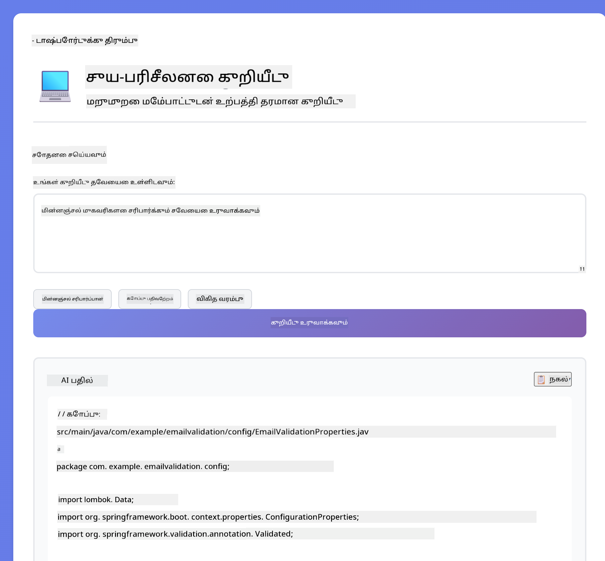
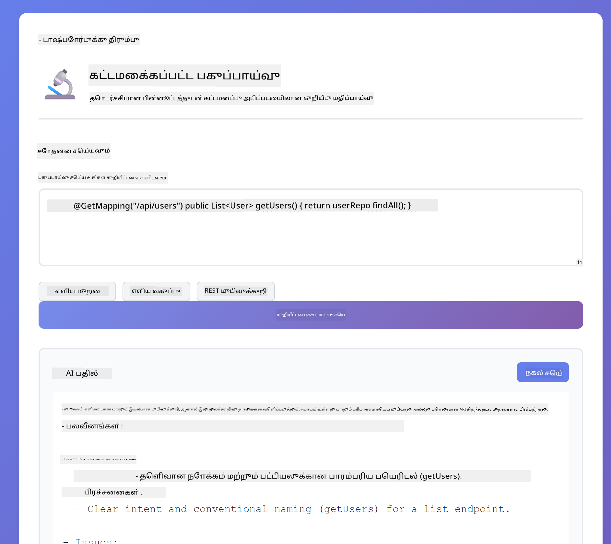

<!--
CO_OP_TRANSLATOR_METADATA:
{
  "original_hash": "8d787826cad7e92bf5cdbd116b1e6116",
  "translation_date": "2025-12-13T16:34:34+00:00",
  "source_file": "02-prompt-engineering/README.md",
  "language_code": "ta"
}
-->
# Module 02: GPT-5 உடன் Prompt Engineering

## உள்ளடக்க அட்டவணை

- [நீங்கள் கற்றுக்கொள்ளப்போகும் விஷயங்கள்](../../../02-prompt-engineering)
- [முன்னோட்டங்கள்](../../../02-prompt-engineering)
- [Prompt Engineering ஐப் புரிந்துகொள்வது](../../../02-prompt-engineering)
- [இது LangChain4j ஐ எப்படி பயன்படுத்துகிறது](../../../02-prompt-engineering)
- [முக்கிய மாதிரிகள்](../../../02-prompt-engineering)
- [உள்ள Azure வளங்களைப் பயன்படுத்துதல்](../../../02-prompt-engineering)
- [விண்ணப்ப திரைகள்](../../../02-prompt-engineering)
- [மாதிரிகளை ஆராய்தல்](../../../02-prompt-engineering)
  - [குறைந்த மற்றும் அதிக ஆர்வம்](../../../02-prompt-engineering)
  - [பணி செயலாக்கம் (கருவி முன்னுரை)](../../../02-prompt-engineering)
  - [சுய-பரிசீலனை குறியீடு](../../../02-prompt-engineering)
  - [கட்டமைக்கப்பட்ட பகுப்பாய்வு](../../../02-prompt-engineering)
  - [பல-முறை உரையாடல்](../../../02-prompt-engineering)
  - [படி படியாக காரணமறிதல்](../../../02-prompt-engineering)
  - [கட்டுப்படுத்தப்பட்ட வெளியீடு](../../../02-prompt-engineering)
- [நீங்கள் உண்மையில் கற்றுக்கொள்ளும் விஷயங்கள்](../../../02-prompt-engineering)
- [அடுத்த படிகள்](../../../02-prompt-engineering)

## நீங்கள் கற்றுக்கொள்ளப்போகும் விஷயங்கள்

முந்தைய தொகுதியில், நினைவகம் உரையாடல் AI-க்கு எப்படி உதவுகிறது என்பதைப் பார்த்தீர்கள் மற்றும் அடிப்படை தொடர்புகளுக்கு GitHub மாதிரிகளை பயன்படுத்தினீர்கள். இப்போது, நீங்கள் கேள்விகள் கேட்கும் விதம் - அதாவது prompts - எப்படி அமைக்கப்படுகின்றன என்பதை Azure OpenAI இன் GPT-5 ஐ பயன்படுத்தி கவனம் செலுத்துவோம். உங்கள் prompts அமைப்பு பெறும் பதில்களின் தரத்தை மிகுந்த அளவில் பாதிக்கிறது.

நாம் GPT-5 ஐ பயன்படுத்துவோம் ஏனெனில் இது காரணமறிதலை கட்டுப்படுத்துகிறது - பதில் அளிப்பதற்கு முன் எவ்வளவு சிந்திக்க வேண்டும் என்று மாதிரிக்கு சொல்ல முடியும். இது வெவ்வேறு prompting முறைகளை தெளிவாக காட்டுகிறது மற்றும் எப்போது எந்த அணுகுமுறையை பயன்படுத்த வேண்டும் என்பதை புரிந்துகொள்ள உதவுகிறது. GitHub மாதிரிகளுடன் ஒப்பிடுகையில் Azure இன் GPT-5 க்கு குறைந்த வீதக் கட்டுப்பாடுகள் இருப்பதால் நன்மை பெறுவோம்.

## முன்னோட்டங்கள்

- Module 01 முடித்திருக்க வேண்டும் (Azure OpenAI வளங்கள் நிறுவப்பட்டுள்ளன)
- ரூட் அடைவில் `.env` கோப்பு Azure அங்கீகாரங்களுடன் (Module 01 இல் `azd up` மூலம் உருவாக்கப்பட்டது)

> **குறிப்பு:** Module 01 முடிக்கவில்லை என்றால், முதலில் அங்கு உள்ள நிறுவல் வழிமுறைகளை பின்பற்றவும்.

## Prompt Engineering ஐப் புரிந்துகொள்வது

Prompt engineering என்பது நீங்கள் தேவையான முடிவுகளை தொடர்ந்து பெறும் வகையில் உள்ளீட்டு உரையை வடிவமைப்பதற்கான செயல். இது கேள்விகள் கேட்கும் மட்டுமல்ல - மாதிரி நீங்கள் என்ன வேண்டும் மற்றும் அதை எப்படி வழங்க வேண்டும் என்பதை சரியாக புரிந்துகொள்ளும் வகையில் கோரிக்கைகளை அமைப்பது.

இதை ஒரு சக ஊழியருக்கு வழிமுறைகள் கொடுப்பதுபோல் நினைத்துக் கொள்ளுங்கள். "பிழையை சரி செய்" என்பது தெளிவற்றது. "UserService.java கோப்பின் 45வது வரியில் உள்ள null pointer exception ஐ null சரிபார்ப்பைச் சேர்த்து சரி செய்" என்பது குறிப்பிட்டது. மொழி மாதிரிகள் இதே விதமாக செயல்படுகின்றன - குறிப்புத்தன்மை மற்றும் அமைப்பு முக்கியம்.

## இது LangChain4j ஐ எப்படி பயன்படுத்துகிறது

இந்த தொகுதி முன் தொகுதிகளில் பயன்படுத்திய LangChain4j அடிப்படையை பயன்படுத்தி மேம்பட்ட prompting மாதிரிகளை காட்டுகிறது, குறிப்பாக prompt அமைப்பு மற்றும் காரணமறிதல் கட்டுப்பாட்டில் கவனம் செலுத்துகிறது.



*LangChain4j உங்கள் prompts ஐ Azure OpenAI GPT-5 உடன் இணைக்கும் விதம்*

**இணைப்புகள்** - Module 02 இல் `pom.xml` இல் வரையறுக்கப்பட்ட பின்வரும் langchain4j இணைப்புகள் பயன்படுத்தப்படுகின்றன:
```xml
<dependency>
    <groupId>dev.langchain4j</groupId>
    <artifactId>langchain4j</artifactId> <!-- Inherited from BOM in root pom.xml -->
</dependency>
<dependency>
    <groupId>dev.langchain4j</groupId>
    <artifactId>langchain4j-open-ai-official</artifactId> <!-- Inherited from BOM in root pom.xml -->
</dependency>
```

**OpenAiOfficialChatModel கட்டமைப்பு** - [LangChainConfig.java](../../../02-prompt-engineering/src/main/java/com/example/langchain4j/prompts/config/LangChainConfig.java)

இந்த chat மாதிரி OpenAI அதிகாரப்பூர்வ கிளையண்ட் மூலம் Spring bean ஆக கைமுறையாக கட்டமைக்கப்பட்டுள்ளது, இது Azure OpenAI endpoints ஐ ஆதரிக்கிறது. Module 01 உடன் முக்கிய வேறுபாடு, `chatModel.chat()` க்கு அனுப்பப்படும் prompts எப்படி அமைக்கப்படுகின்றன என்பதில் உள்ளது, மாதிரி அமைப்பில் அல்ல.

**System மற்றும் User Messages** - [Gpt5PromptService.java](../../../02-prompt-engineering/src/main/java/com/example/langchain4j/prompts/service/Gpt5PromptService.java)

LangChain4j தெளிவுக்காக செய்தி வகைகளை பிரிக்கிறது. `SystemMessage` AI இன் நடத்தை மற்றும் சூழலை அமைக்கிறது (உதாரணமாக "நீங்கள் ஒரு குறியீடு மதிப்பாய்வாளர்"), `UserMessage` உண்மையான கோரிக்கையை கொண்டுள்ளது. இது வெவ்வேறு பயனர் கேள்விகளுக்கு ஒரே மாதிரியான AI நடத்தை பராமரிக்க உதவுகிறது.

```java
SystemMessage systemMsg = SystemMessage.from(
    "You are a helpful Java programming expert."
);

UserMessage userMsg = UserMessage.from(
    "Explain what a List is in Java"
);

String response = chatModel.chat(systemMsg, userMsg);
```


*SystemMessage நிலையான சூழலை வழங்குகிறது, UserMessages தனிப்பட்ட கோரிக்கைகளை கொண்டுள்ளது*

**MessageWindowChatMemory பல-முறை உரையாடலுக்கு** - பல-முறை உரையாடல் மாதிரிக்காக, Module 01 இல் இருந்து `MessageWindowChatMemory` மீண்டும் பயன்படுத்தப்படுகிறது. ஒவ்வொரு அமர்வுக்கும் தனித்த நினைவகம் `Map<String, ChatMemory>` இல் சேமிக்கப்படுகிறது, இது பல ஒரே நேர உரையாடல்களை கலப்பு இல்லாமல் அனுமதிக்கிறது.

**Prompt Templates** - இங்கு உண்மையான கவனம் prompt engineering இல் உள்ளது, புதிய LangChain4j API கள் அல்ல. ஒவ்வொரு மாதிரியும் (குறைந்த ஆர்வம், அதிக ஆர்வம், பணி செயலாக்கம், மற்றும் பிற) ஒரே `chatModel.chat(prompt)` முறையை பயன்படுத்துகிறது ஆனால் கவனமாக அமைக்கப்பட்ட prompt strings உடன். XML குறிச்சொற்கள், வழிமுறைகள் மற்றும் வடிவமைப்பு அனைத்தும் prompt உரையின் பகுதியாகும், LangChain4j அம்சங்கள் அல்ல.

**காரணமறிதல் கட்டுப்பாடு** - GPT-5 இன் காரணமறிதல் முயற்சி "அதிகபட்சம் 2 காரணமறிதல் படிகள்" அல்லது "முழுமையாக ஆராய்க" போன்ற prompt வழிமுறைகளால் கட்டுப்படுத்தப்படுகிறது. இவை prompt engineering தொழில்நுட்பங்கள், LangChain4j கட்டமைப்புகள் அல்ல. நூலகம் உங்கள் prompts ஐ மாதிரிக்கு வழங்குகிறது.

முக்கியமானது: LangChain4j கட்டமைப்பை (மாதிரி இணைப்பு [LangChainConfig.java](../../../02-prompt-engineering/src/main/java/com/example/langchain4j/prompts/config/LangChainConfig.java), நினைவகம், செய்தி கையாளுதல் [Gpt5PromptService.java](../../../02-prompt-engineering/src/main/java/com/example/langchain4j/prompts/service/Gpt5PromptService.java)) வழங்குகிறது, இந்த தொகுதி அந்த கட்டமைப்புக்குள் பயனுள்ள prompts உருவாக்குவது எப்படி என்பதை கற்றுக்கொடுக்கிறது.

## முக்கிய மாதிரிகள்

எல்லா பிரச்சனைகளுக்கும் ஒரே அணுகுமுறை தேவையில்லை. சில கேள்விகள் விரைவான பதில்களை தேவைப்படுத்துகின்றன, சில ஆழமான சிந்தனையை. சிலக்கு தெளிவான காரணமறிதல் தேவை, சிலக்கு வெறும் முடிவுகள் போதும். இந்த தொகுதி எட்டு prompting மாதிரிகளை உள்ளடக்கியது - ஒவ்வொன்றும் வெவ்வேறு சூழல்களுக்கு சிறந்தது. நீங்கள் அவற்றை எல்லாம் முயற்சி செய்து எப்போது எந்த அணுகுமுறை சிறந்தது என்பதை கற்றுக்கொள்ளுவீர்கள்.


*எட்டு prompt engineering மாதிரிகளின் மேற்பார்வை மற்றும் அவற்றின் பயன்பாடுகள்*



*குறைந்த ஆர்வம் (விரைவு, நேரடி) மற்றும் அதிக ஆர்வம் (ஆழமான, ஆராய்ச்சியுடன்) காரணமறிதல் அணுகுமுறைகள்*

**குறைந்த ஆர்வம் (விரைவு மற்றும் கவனமுடன்)** - எளிய கேள்விகளுக்கு விரைவான, நேரடி பதில்கள் வேண்டும் என்றால். மாதிரி குறைந்த காரணமறிதலை செய்கிறது - அதிகபட்சம் 2 படிகள். கணக்கீடுகள், தேடல்கள் அல்லது நேரடி கேள்விகளுக்கு இதைப் பயன்படுத்தவும்.

```java
String prompt = """
    <reasoning_effort>low</reasoning_effort>
    <instruction>maximum 2 reasoning steps</instruction>
    
    What is 15% of 200?
    """;

String response = chatModel.chat(prompt);
```

> 💡 **GitHub Copilot உடன் ஆராயவும்:** [`Gpt5PromptService.java`](../../../02-prompt-engineering/src/main/java/com/example/langchain4j/prompts/service/Gpt5PromptService.java) திறந்து கேளுங்கள்:
> - "குறைந்த ஆர்வம் மற்றும் அதிக ஆர்வம் prompting மாதிரிகளுக்கு என்ன வேறுபாடு?"
> - "Prompts இல் உள்ள XML குறிச்சொற்கள் AI பதிலை அமைக்க எப்படி உதவுகின்றன?"
> - "சுய-பரிசீலனை மாதிரிகள் மற்றும் நேரடி வழிமுறைகளை எப்போது பயன்படுத்த வேண்டும்?"

**அதிக ஆர்வம் (ஆழமான மற்றும் முழுமையான)** - சிக்கலான பிரச்சனைகளுக்கு விரிவான பகுப்பாய்வு வேண்டும் என்றால். மாதிரி முழுமையாக ஆராய்ந்து விரிவான காரணமறிதலை காட்டுகிறது. அமைப்பு வடிவமைப்பு, கட்டமைப்பு முடிவுகள் அல்லது சிக்கலான ஆராய்ச்சிக்கு இதைப் பயன்படுத்தவும்.

```java
String prompt = """
    <reasoning_effort>high</reasoning_effort>
    <instruction>explore thoroughly, show detailed reasoning</instruction>
    
    Design a caching strategy for a high-traffic REST API.
    """;

String response = chatModel.chat(prompt);
```

**பணி செயலாக்கம் (படி படியாக முன்னேற்றம்)** - பல படி பணிகளுக்கு. மாதிரி முன்கூட்டியே திட்டமிடுகிறது, ஒவ்வொரு படியையும் விளக்குகிறது, பின்னர் சுருக்கம் அளிக்கிறது. இடமாற்றங்கள், செயலாக்கங்கள் அல்லது எந்தவொரு பல படி செயலுக்கும் இதைப் பயன்படுத்தவும்.

```java
String prompt = """
    <task>Create a REST endpoint for user registration</task>
    <preamble>Provide an upfront plan</preamble>
    <narration>Narrate each step as you work</narration>
    <summary>Summarize what was accomplished</summary>
    """;

String response = chatModel.chat(prompt);
```

Chain-of-Thought prompting மாதிரி தனது காரணமறிதல் செயல்முறையை வெளிப்படுத்துமாறு கேட்கிறது, இது சிக்கலான பணிகளுக்கு துல்லியத்தை மேம்படுத்துகிறது. படி படியாக பிரிப்பது மனிதர்களுக்கும் AI க்கும் தர்க்கத்தை புரிந்துகொள்ள உதவுகிறது.

> **🤖 [GitHub Copilot](https://github.com/features/copilot) உரையாடலுடன் முயற்சி செய்யவும்:** இந்த மாதிரி பற்றி கேளுங்கள்:
> - "நீண்டகால செயல்பாடுகளுக்கு பணி செயலாக்க மாதிரியை எப்படி மாற்றுவேன்?"
> - "உற்பத்தி பயன்பாடுகளில் கருவி முன்னுரைகளை அமைப்பதில் சிறந்த நடைமுறைகள் என்ன?"
> - "UI இல் இடைநிலை முன்னேற்றங்களை எப்படி பிடித்து காட்டலாம்?"


*பல படி பணிகளுக்கான திட்டமிடல் → செயலாக்கம் → சுருக்கம் வேலைநடை*

**சுய-பரிசீலனை குறியீடு** - உற்பத்தி தரமான குறியீடு உருவாக்க. மாதிரி குறியீட்டை உருவாக்கி, தரநிலைகளுக்கு எதிராக சரிபார்த்து, முறையே மேம்படுத்துகிறது. புதிய அம்சங்கள் அல்லது சேவைகள் உருவாக்கும் போது இதைப் பயன்படுத்தவும்.

```java
String prompt = """
    <task>Create an email validation service</task>
    <quality_criteria>
    - Correct logic and error handling
    - Best practices (clean code, proper naming)
    - Performance optimization
    - Security considerations
    </quality_criteria>
    <instruction>Generate code, evaluate against criteria, improve iteratively</instruction>
    """;

String response = chatModel.chat(prompt);
```


*முறைமையான மேம்பாட்டு சுற்று - உருவாக்கு, மதிப்பாய்வு செய், பிரச்சனைகளை கண்டறி, மேம்படு, மீண்டும் செய்*

**கட்டமைக்கப்பட்ட பகுப்பாய்வு** - ஒரே மாதிரியான மதிப்பாய்வுக்கு. மாதிரி குறியீட்டை ஒரு நிலையான கட்டமைப்பில் (தவறுகள், நடைமுறைகள், செயல்திறன், பாதுகாப்பு) மதிப்பாய்வு செய்கிறது. குறியீடு மதிப்பாய்வுகள் அல்லது தர மதிப்பீடுகளுக்கு இதைப் பயன்படுத்தவும்.

```java
String prompt = """
    <code>
    public List getUsers() {
        return database.query("SELECT * FROM users");
    }
    </code>
    
    <framework>
    Evaluate using these categories:
    1. Correctness - Logic and functionality
    2. Best Practices - Code quality
    3. Performance - Efficiency concerns
    4. Security - Vulnerabilities
    </framework>
    """;

String response = chatModel.chat(prompt);
```

> **🤖 [GitHub Copilot](https://github.com/features/copilot) உரையாடலுடன் முயற்சி செய்யவும்:** கட்டமைக்கப்பட்ட பகுப்பாய்வு பற்றி கேளுங்கள்:
> - "வெவ்வேறு வகை குறியீடு மதிப்பாய்வுகளுக்கு பகுப்பாய்வு கட்டமைப்பை எப்படி தனிப்பயனாக்கலாம்?"
> - "கட்டமைக்கப்பட்ட வெளியீட்டை நிரலாக்க முறையில் எப்படி பகுப்பாய்வு செய்து செயல்படுத்தலாம்?"
> - "வெவ்வேறு மதிப்பாய்வு அமர்வுகளில் ஒரே மாதிரியான தீவிரத்தன்மை நிலைகளை எப்படி உறுதி செய்வது?"



*தீவிரத்தன்மை நிலைகளுடன் ஒரே மாதிரியான குறியீடு மதிப்பாய்வுக்கு நான்கு வகை கட்டமைப்பு*

**பல-முறை உரையாடல்** - சூழல் தேவைப்படும் உரையாடல்களுக்கு. மாதிரி முந்தைய செய்திகளை நினைவில் வைத்து அதில் கட்டமைக்கிறது. இடைமுக உதவி அமர்வுகள் அல்லது சிக்கலான கேள்வி-பதில் அமர்வுகளுக்கு இதைப் பயன்படுத்தவும்.

```java
ChatMemory memory = MessageWindowChatMemory.withMaxMessages(10);

memory.add(UserMessage.from("What is Spring Boot?"));
AiMessage aiMessage1 = chatModel.chat(memory.messages()).aiMessage();
memory.add(aiMessage1);

memory.add(UserMessage.from("Show me an example"));
AiMessage aiMessage2 = chatModel.chat(memory.messages()).aiMessage();
memory.add(aiMessage2);
```



*பல முறை உரையாடல்களில் உரையாடல் சூழல் எவ்வாறு சேர்க்கப்படுகிறது, டோக்கன் வரம்பு வரை*

**படி படியாக காரணமறிதல்** - தெளிவான தர்க்கம் தேவைப்படும் பிரச்சனைகளுக்கு. மாதிரி ஒவ்வொரு படிக்கும் தெளிவான காரணமறிதலை காட்டுகிறது. கணித பிரச்சனைகள், தர்க்க புதிர்கள் அல்லது சிந்தனை செயல்முறையை புரிந்துகொள்ள வேண்டிய போது இதைப் பயன்படுத்தவும்.

```java
String prompt = """
    <instruction>Show your reasoning step-by-step</instruction>
    
    If a train travels 120 km in 2 hours, then stops for 30 minutes,
    then travels another 90 km in 1.5 hours, what is the average speed
    for the entire journey including the stop?
    """;

String response = chatModel.chat(prompt);
```


*பிரச்சனைகளை தெளிவான தர்க்க படிகளாக பிரித்தல்*

**கட்டுப்படுத்தப்பட்ட வெளியீடு** - குறிப்பிட்ட வடிவமைப்பு தேவைகள் உள்ள பதில்களுக்கு. மாதிரி வடிவமைப்பு மற்றும் நீளம் விதிகளை கடுமையாக பின்பற்றுகிறது. சுருக்கங்கள் அல்லது துல்லியமான வெளியீடு அமைப்புக்கு இதைப் பயன்படுத்தவும்.

```java
String prompt = """
    <constraints>
    - Exactly 100 words
    - Bullet point format
    - Technical terms only
    </constraints>
    
    Summarize the key concepts of machine learning.
    """;

String response = chatModel.chat(prompt);
```


*குறிப்பிட்ட வடிவமைப்பு, நீளம் மற்றும் அமைப்பு தேவைகளை கடைப்பிடித்தல்*

## உள்ள Azure வளங்களைப் பயன்படுத்துதல்

**நிறுவல் சரிபார்க்கவும்:**

Module 01 இல் உருவாக்கப்பட்ட Azure அங்கீகாரங்களுடன் ரூட் அடைவில் `.env` கோப்பு இருப்பதை உறுதி செய்யவும்:
```bash
cat ../.env  # AZURE_OPENAI_ENDPOINT, API_KEY, DEPLOYMENT ஐ காட்ட வேண்டும்
```

**விண்ணப்பத்தை துவங்கவும்:**

> **குறிப்பு:** Module 01 இல் இருந்து `./start-all.sh` மூலம் அனைத்து பயன்பாடுகளையும் ஏற்கனவே துவக்கியிருந்தால், இந்த தொகுதி 8083 போர்டில் இயங்கிக் கொண்டிருக்கிறது. கீழுள்ள துவக்க கட்டளைகளை தவிர்த்து நேரடியாக http://localhost:8083 செல்லலாம்.

**விருப்பம் 1: Spring Boot Dashboard பயன்படுத்துதல் (VS Code பயனர்களுக்கு பரிந்துரைக்கப்படுகிறது)**

Dev container இல் Spring Boot Dashboard விரிவாக்கம் உள்ளது, இது அனைத்து Spring Boot பயன்பாடுகளையும் கையாள ஒரு காட்சி இடைமுகத்தை வழங்குகிறது. VS Code இன் இடது Activity Bar இல் Spring Boot ஐகானை காணலாம்.

Spring Boot Dashboard இல் இருந்து நீங்கள்:
- பணியிடத்தில் உள்ள அனைத்து Spring Boot பயன்பாடுகளையும் காணலாம்
- ஒரு கிளிக்கில் பயன்பாடுகளை துவக்க/நிறுத்தலாம்
- பயன்பாட்டு பதிவுகளை நேரடியாகப் பார்க்கலாம்
- பயன்பாட்டு நிலையை கண்காணிக்கலாம்

"prompt-engineering" அருகே உள்ள play பொத்தானை கிளிக் செய்து இந்த தொகுதியை துவங்கலாம் அல்லது அனைத்து தொகுதிகளையும் ஒரே நேரத்தில் துவங்கலாம்.



**விருப்பம் 2: shell ஸ்கிரிப்ட்கள் பயன்படுத்துதல்**

அனைத்து வலை பயன்பாடுகளையும் (modules 01-04) துவங்கவும்:

**Bash:**
```bash
cd ..  # ரூட் அடைவு கோப்புறையிலிருந்து
./start-all.sh
```

**PowerShell:**
```powershell
cd ..  # ரூட் அடைவு கோப்புறையிலிருந்து
.\start-all.ps1
```

அல்லது இந்த தொகுதியை மட்டும் துவங்கவும்:

**Bash:**
```bash
cd 02-prompt-engineering
./start.sh
```

**PowerShell:**
```powershell
cd 02-prompt-engineering
.\start.ps1
```

இரு ஸ்கிரிப்ட்களும் ரூட் `.env` கோப்பிலிருந்து சுற்றுச்சூழல் மாறிலிகளை தானாக ஏற்றும் மற்றும் JAR கோப்புகள் இல்லாவிட்டால் அவற்றை கட்டும்.

> **குறிப்பு:** துவங்குவதற்கு முன் அனைத்து தொகுதிகளையும் கைமுறையாக கட்ட விரும்பினால்:
>
> **Bash:**
> ```bash
> cd ..  # Go to root directory
> mvn clean package -DskipTests
> ```
>
> **PowerShell:**
> ```powershell
> cd ..  # Go to root directory
> mvn clean package -DskipTests
> ```

உங்கள் உலாவியில் http://localhost:8083 திறக்கவும்.

**நிறுத்த:**

**Bash:**
```bash
./stop.sh  # இந்த தொகுதி மட்டும்
# அல்லது
cd .. && ./stop-all.sh  # அனைத்து தொகுதிகளும்
```

**PowerShell:**
```powershell
.\stop.ps1  # இந்த தொகுதி மட்டும்
# அல்லது
cd ..; .\stop-all.ps1  # அனைத்து தொகுதிகளும்
```

## விண்ணப்ப திரைகள்


*எட்டு prompt engineering மாதிரிகளும் அவற்றின் பண்புகள் மற்றும் பயன்பாடுகளுடன் பிரதான டாஷ்போர்டு*

## மாதிரிகளை ஆராய்தல்

இணைய இடைமுகம் வெவ்வேறு prompting முறைகளை முயற்சி செய்ய அனுமதிக்கிறது. ஒவ்வொரு மாதிரியும் வெவ்வேறு பிரச்சனைகளை தீர்க்கிறது - எப்போது எந்த அணுகுமுறை சிறந்தது என்பதை காண முயற்சிக்கவும்.

### குறைந்த மற்றும் அதிக ஆர்வம்

"200 இன் 15% என்ன?" போன்ற எளிய கேள்வியை குறைந்த ஆர்வம் கொண்டு கேளுங்கள். உடனடி, நேரடி பதிலை பெறுவீர்கள். இப்போது "உயர் போக்குவரத்து API க்கான caching திட்டத்தை வடிவமைக்கவும்" போன்ற சிக்கலான கேள்வியை அதிக ஆர்வம் கொண்டு கேளுங்கள். மாதிரி மெதுவாக செயல்பட்டு விரிவான காரணமறிதலை வழங்கும். அதே மாதிரி, அதே கேள்வி அமைப்பு - ஆனால் prompt எவ்வளவு சிந்திக்க வேண்டும் என்று சொல்லுகிறது.


*குறைந்த காரணம்செய்தியுடன் விரைவு கணக்கீடு*



*விரிவான கேஷிங் தந்திரம் (2.8MB)*

### பணிக்கான செயலாக்கம் (கருவி முன்னுரை)

பல படி பணிகள் முன்கூட்டியே திட்டமிடல் மற்றும் முன்னேற்றக் கதை சொல்லல் மூலம் பயனடைகின்றன. மாதிரி என்ன செய்யப்போகிறது என்பதை விளக்கி, ஒவ்வொரு படியையும் விவரித்து, பின்னர் முடிவுகளை சுருக்குகிறது.


*படி படியாக கதை சொல்லலுடன் REST முடிச்சை உருவாக்குதல் (3.9MB)*

### சுய-பரிசீலனை குறியீடு

"ஒரு மின்னஞ்சல் சரிபார்ப்பு சேவையை உருவாக்கு" என்று முயற்சிக்கவும். குறியீடு உருவாக்கி நிறுத்துவதற்குப் பதிலாக, மாதிரி உருவாக்கி, தரநிலைகளுக்கு எதிராக மதிப்பாய்வு செய்து, பலவீனங்களை கண்டறிந்து, மேம்படுத்துகிறது. குறியீடு உற்பத்தி தரநிலைகளுக்கு ஏற்ப வரும்வரை அது மீண்டும் மீண்டும் முயற்சிக்கும்.



*முழுமையான மின்னஞ்சல் சரிபார்ப்பு சேவை (5.2MB)*

### கட்டமைக்கப்பட்ட பகுப்பாய்வு

குறியீடு மதிப்பாய்வுகள் ஒரே மாதிரியான மதிப்பீட்டு கட்டமைப்புகளை தேவைப்படுத்துகின்றன. மாதிரி குறியீட்டை நிலையான வகைகளில் (தவறற்ற தன்மை, நடைமுறைகள், செயல்திறன், பாதுகாப்பு) மற்றும் தீவிரத்தன்மை நிலைகளுடன் பகுப்பாய்வு செய்கிறது.



*கட்டமைப்புக்கேற்ப குறியீடு மதிப்பாய்வு*

### பல-முறை உரையாடல்

"Spring Boot என்றால் என்ன?" என்று கேட்டு, உடனடியாக "ஒரு உதாரணத்தை காட்டவும்" என்று தொடரவும். மாதிரி உங்கள் முதல் கேள்வியை நினைவில் வைத்து, குறிப்பாக Spring Boot உதாரணத்தை தருகிறது. நினைவில்லாமல், இரண்டாவது கேள்வி மிகவும் பொதுவானதாக இருக்கும்.


*கேள்விகளுக்கு இடையேயான சூழல் பாதுகாப்பு*

### படி படியாக காரணம்செய்தி

ஒரு கணிதப் பிரச்சினையை தேர்ந்தெடுத்து, படி படியாக காரணம்செய்தி மற்றும் குறைந்த ஆர்வத்துடன் முயற்சிக்கவும். குறைந்த ஆர்வம் உங்களுக்கு பதிலை விரைவாக ஆனால் மறைமுகமாக வழங்கும். படி படியாக காரணம்செய்தி ஒவ்வொரு கணக்கீடும் முடிவும் காட்டும்.


*தெளிவான படிகளுடன் கணிதப் பிரச்சினை*

### கட்டுப்படுத்தப்பட்ட வெளியீடு

குறிப்பிட்ட வடிவங்கள் அல்லது வார்த்தை எண்ணிக்கைகள் தேவைப்பட்டால், இந்த முறை கடுமையான பின்பற்றலை உறுதி செய்கிறது. 100 வார்த்தைகளைக் கொண்ட புள்ளி வடிவ சுருக்கத்தை உருவாக்க முயற்சிக்கவும்.


*வடிவ கட்டுப்பாட்டுடன் இயந்திரக் கற்றல் சுருக்கம்*

## நீங்கள் உண்மையில் கற்றுக்கொள்கிறீர்கள்

**காரணம்செய்தி முயற்சி அனைத்தையும் மாற்றுகிறது**

GPT-5 உங்கள் கேள்விகளின் மூலம் கணக்கீட்டு முயற்சியை கட்டுப்படுத்த அனுமதிக்கிறது. குறைந்த முயற்சி என்பது குறைந்த ஆராய்ச்சியுடன் விரைவான பதில்களை குறிக்கிறது. அதிக முயற்சி என்பது மாதிரி ஆழமாக சிந்திக்க நேரம் எடுத்துக்கொள்கிறது. நீங்கள் பணியின் சிக்கலுக்கு ஏற்ப முயற்சியை பொருத்த கற்றுக்கொள்கிறீர்கள் - எளிய கேள்விகளுக்கு நேரத்தை வீணாக்க வேண்டாம், ஆனால் சிக்கலான முடிவுகளை விரைவில் செய்யாதீர்கள்.

**கட்டமைப்பு நடத்தை வழிநடத்துகிறது**

கேள்விகளில் உள்ள XML குறிச்சொற்களை கவனித்தீர்களா? அவை அலங்காரமாக இல்லை. மாதிரிகள் கட்டமைக்கப்பட்ட வழிமுறைகளை சுதந்திர உரையுடன் ஒப்பிடுகையில் நம்பகமாக பின்பற்றுகின்றன. பல படி செயல்முறைகள் அல்லது சிக்கலான தர்க்கம் தேவைப்பட்டால், கட்டமைப்பு மாதிரிக்கு அது எங்கே இருக்கிறது மற்றும் அடுத்தது என்ன என்பதை கண்காணிக்க உதவுகிறது.


*தெளிவான பிரிவுகள் மற்றும் XML-பாணி அமைப்புடன் நன்கு கட்டமைக்கப்பட்ட கேள்வியின் அமைப்பு*

**தனிப்பரிசீலனையால் தரம்**

சுய-பரிசீலனை முறைகள் தரநிலைகளை தெளிவாகக் காட்டுவதன் மூலம் செயல்படுகின்றன. மாதிரி "சரி செய்கிறது" என்று நம்புவதற்குப் பதிலாக, நீங்கள் "சரி" என்பதன் பொருளை தெளிவாக கூறுகிறீர்கள்: சரியான தர்க்கம், பிழை கையாளல், செயல்திறன், பாதுகாப்பு. மாதிரி அதன் சொந்த வெளியீட்டை மதிப்பாய்வு செய்து மேம்படுத்த முடியும். இது குறியீடு உருவாக்கத்தை ஒரு லாட்டரி இருந்து ஒரு செயல்முறையாக மாற்றுகிறது.

**சூழல் வரம்பு உள்ளது**

பல-முறை உரையாடல்கள் ஒவ்வொரு கோரிக்கையுடனும் செய்தி வரலாற்றை உள்ளடக்கியது மூலம் செயல்படுகின்றன. ஆனால் ஒரு வரம்பு உள்ளது - ஒவ்வொரு மாதிரிக்கும் அதிகபட்ச டோக்கன் எண்ணிக்கை உள்ளது. உரையாடல்கள் வளரும்போது, அந்த வரம்பை தாண்டாமல் தொடர்புடைய சூழலை வைத்திருக்க உங்களுக்கு தந்திரங்கள் தேவைப்படும். இந்த தொகுதி நினைவின் செயல்பாட்டை காட்டுகிறது; பின்னர் எப்போது சுருக்கம் செய்ய வேண்டும், எப்போது மறக்க வேண்டும், எப்போது மீட்டெடுக்க வேண்டும் என்பதைக் கற்றுக்கொள்வீர்கள்.

## அடுத்த படிகள்

**அடுத்த தொகுதி:** [03-rag - RAG (Retrieval-Augmented Generation)](../03-rag/README.md)

---

**நெவிகேஷன்:** [← முந்தையது: தொகுதி 01 - அறிமுகம்](../01-introduction/README.md) | [முதன்மைக்கு திரும்பு](../README.md) | [அடுத்தது: தொகுதி 03 - RAG →](../03-rag/README.md)

---

<!-- CO-OP TRANSLATOR DISCLAIMER START -->
**குறிப்பு**:  
இந்த ஆவணம் AI மொழிபெயர்ப்பு சேவை [Co-op Translator](https://github.com/Azure/co-op-translator) மூலம் மொழிபெயர்க்கப்பட்டுள்ளது. நாங்கள் துல்லியத்திற்காக முயற்சித்தாலும், தானியங்கி மொழிபெயர்ப்புகளில் பிழைகள் அல்லது தவறுகள் இருக்கக்கூடும் என்பதை தயவுசெய்து கவனிக்கவும். அசல் ஆவணம் அதன் சொந்த மொழியில் அதிகாரப்பூர்வ மூலமாக கருதப்பட வேண்டும். முக்கியமான தகவல்களுக்கு, தொழில்முறை மனித மொழிபெயர்ப்பை பரிந்துரைக்கிறோம். இந்த மொழிபெயர்ப்பின் பயன்பாட்டால் ஏற்படும் எந்தவொரு தவறான புரிதலுக்கும் அல்லது தவறான விளக்கங்களுக்கும் நாங்கள் பொறுப்பேற்கமாட்டோம்.
<!-- CO-OP TRANSLATOR DISCLAIMER END -->