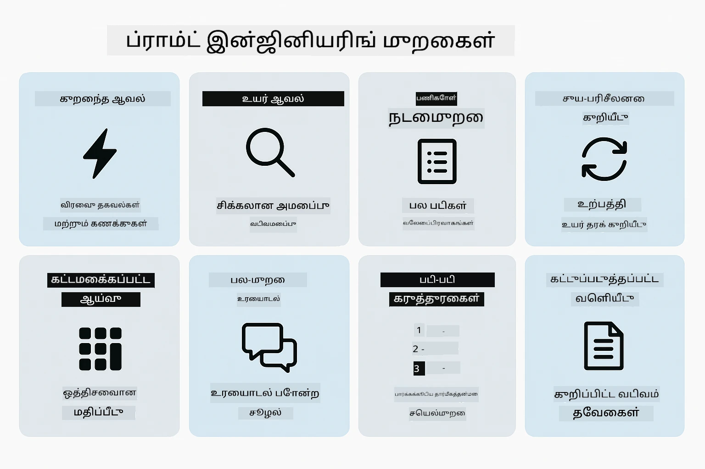
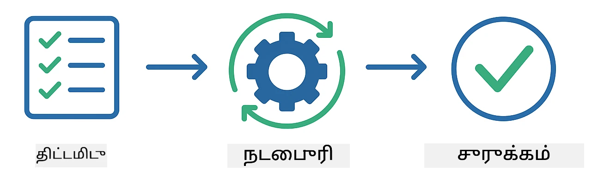
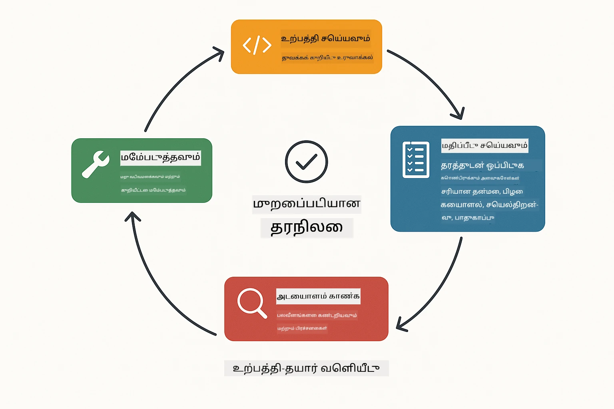
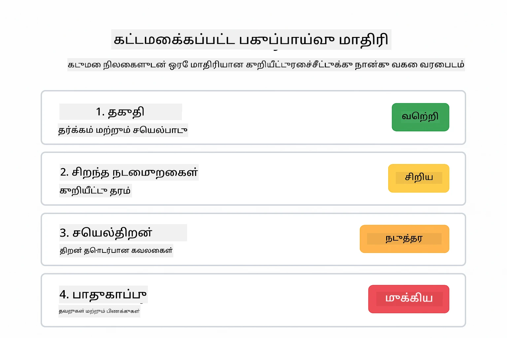
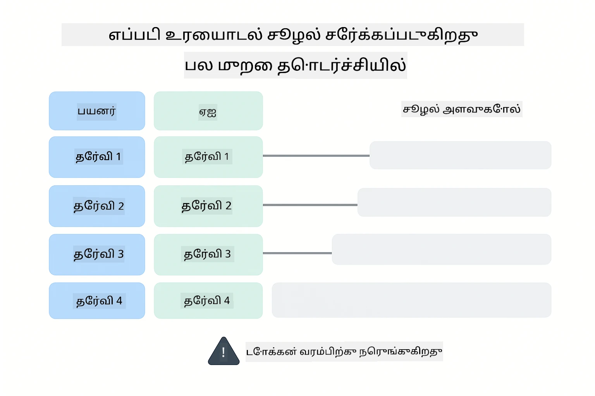
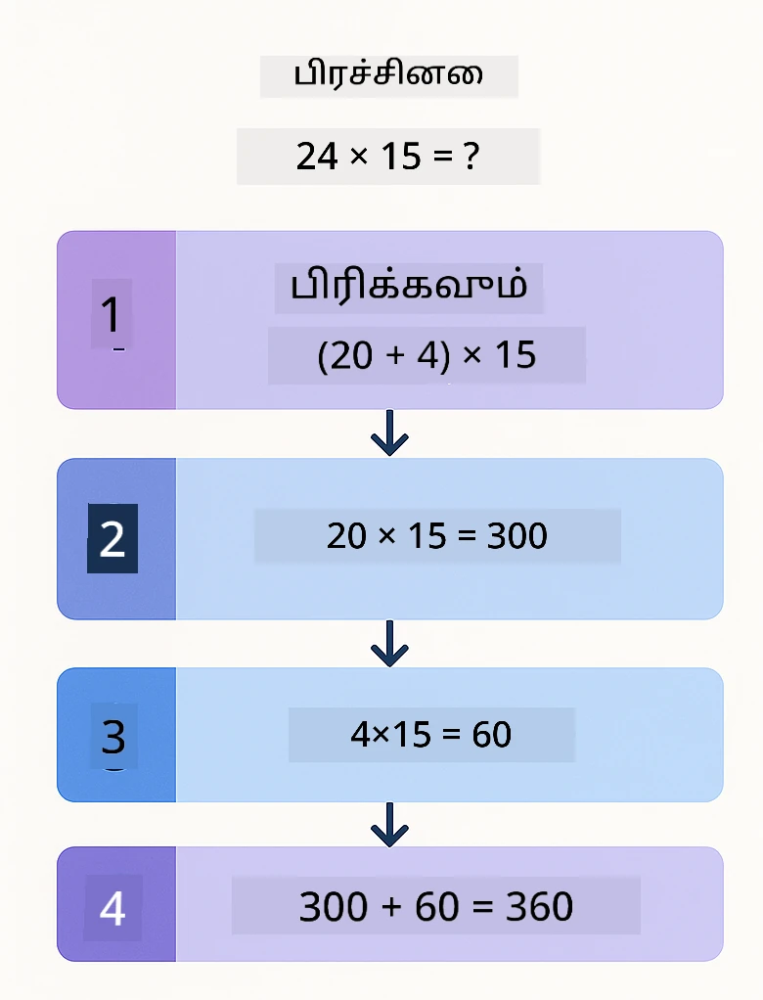
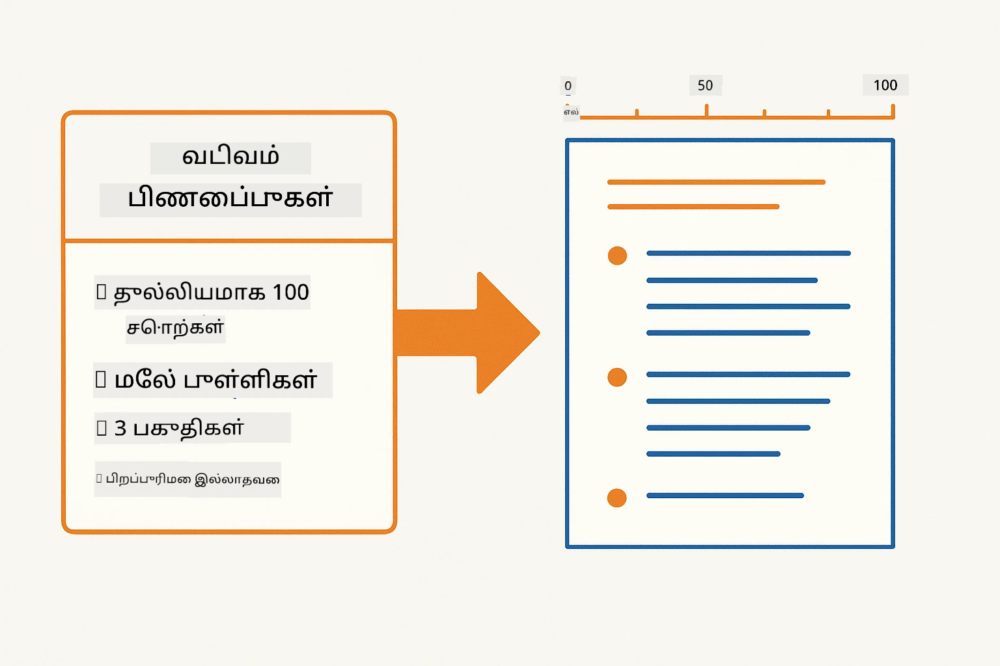
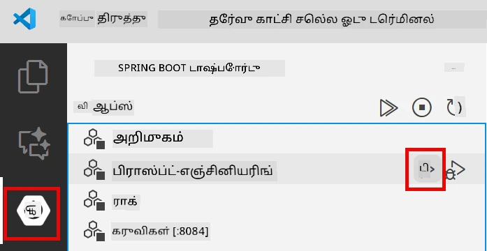
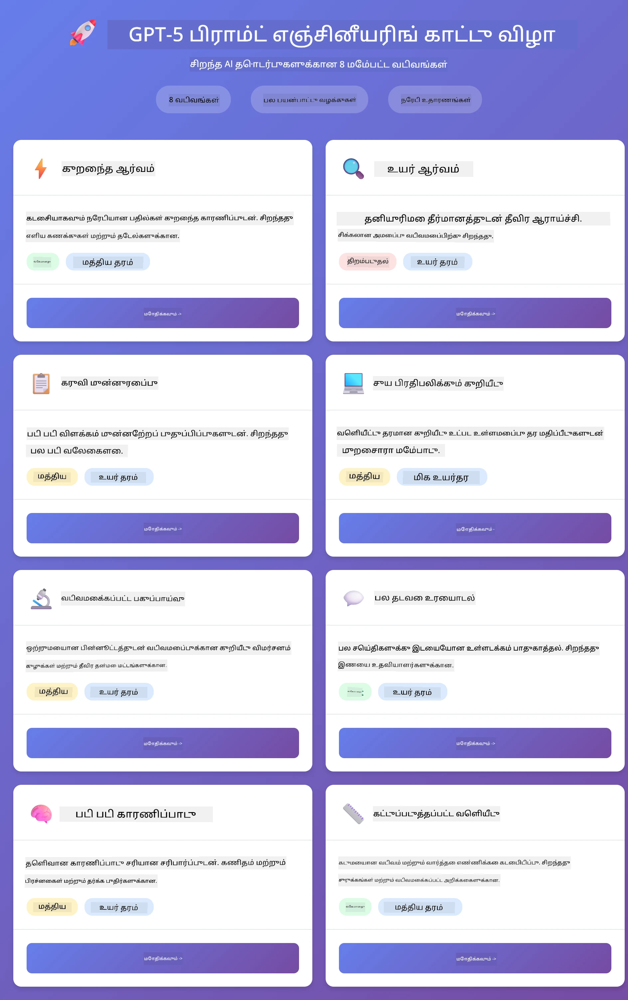
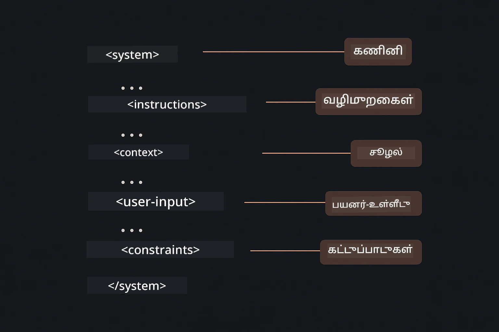

# அலகு 02: GPT-5.2 உடன் பிராம்ட் பொறியியல்

## உள்ளடக்கக் குறிப்பு

- [வீடியோ நடைமுறைப் பகிர்வு](#வீடியோ-நடைமுறைப்-பகிர்வு)
- [நீங்கள் கற்றுக்கொள்ள உள்ளீர்கள்](#நீங்கள்-கற்றுக்கொள்ள-உள்ளீர்கள்)
- [முன் நிபந்தனைகள்](#முன்-நிபந்தனைகள்)
- [பிராம்ட் பொறியியலைப் புரிதல்](#பிராம்ட்-பொறியியலைப்-புரிதல்)
- [பிராம்ட் பொறியியலின் அடிப்படைகள்](#பிராம்ட்-பொறியியலின்-அடிப்படைகள்)
  - [சீரோ-ஷாட்டு பிராம்டிங்](#சீரோ-ஷாட்டு-பிராம்டிங்)
  - [பூ-ஷாட்டு பிராம்டிங்](#few-shot-prompting)
  - [சிந்தனை தொடர்](#சிந்தனை-தொடர்)
  - [பங்கு அடிப்படையிலான பிராம்டிங்](#பங்கு-அடிப்படையிலான-பிராம்டிங்)
  - [பிராம்ட் மாதிரிகள்](#பிராம்ட்-மாதிரிகள்)
- [அதிகப்படியான வடிவமைப்புகள்](#அதிகப்படியான-வடிவமைப்புகள்)
- [பயன்பாட்டை இயக்குக](#பயன்பாட்டை-இயக்கவும்)
- [பயன்பாட்டு திரைபடங்கள்](#பயன்பாட்டு-திரைபடங்கள்)
- [வடிவமைப்புகளை ஆய்வு செய்தல்](#படைப்புத்தடங்களை-ஆராய்தல்)
  - [குறைந்த மற்றும் அதிக ஆர்வம்](#குறைந்த-எதிர்பார்ப்பு-மற்றும்-அதிக-எதிர்பார்ப்பு)
  - [தொழில் நடைமுறை (கருவி முன்னோட்டங்கள்)](#பணிகள்-செயல்படுத்தல்-கருவி-முன்புலங்கள்)
  - [சுய பிரதிபலிப்பு குறியீடு](#தன்னம்பிக்கை-கொண்ட-குறியீடு)
  - [கட்டமைக்கப்பட்ட பகுப்பாய்வு](#கட்டமைக்கப்பட்ட-பகுப்பாய்வு)
  - [பல முதல்முறை உரையாடல்](#பல-முறையான-உரையாடல்)
  - [படி படியாக நடைமுறைசெய்தல்](#படி-படி-காரணக்கலை)
  - [கட்டுப்படுத்தப்பட்ட வெளியீடு](#கட்டுப்பட்ட-வெளியீடு)
- [உங்களுக்கு உண்மையில் என்ன கற்றுக்கொள்ளப்படுகிறது](#நீங்கள்-உண்மையில்-கற்கிற-বিষয়ங்கள்)
- [அடுத்து என்ன செய்ய வேண்டும்](#அடுத்த-படிகள்)

## வீடியோ நடைமுறைப் பகிர்வு

இந்த அலகுடன் எப்படிச் தொடங்குவது என்பதை விளக்கும் நேரடி அமர்வை பாருங்கள்:

<a href="https://www.youtube.com/live/PJ6aBaE6bog?si=LDshyBrTRodP-wke"></a>

## நீங்கள் கற்றுக்கொள்ள உள்ளீர்கள்

இந்த அலகில் நீங்கள் மேம்படுத்தப்போகும் முக்கிய தலைப்புகள் மற்றும் திறன்களின் மேலோட்டம் கீழேயுள்ள படத்தில் காணலாம் — பிராம்ட் முறைகள் மேம்படுத்துதல் முதல் நீங்கள் பின்பற்றப்போகும் படி படியான தொழில்முறை வரை.


முந்தைய அலகில், நினைவகம் எப்படி Azure OpenAI உடன் உரையாடல் செயற்கை நுண்ணறிவை உருவாக்குகிறது என்பதை நீங்கள் பார்த்தீர்கள். இப்போது, நீங்கள் கேட்கும் கேள்விகள் — அதாவது பிராம்ட்கள் — எப்படி அமைக்கப்பட வேண்டும் என்று கவனம் செலுத்துவோம், Azure OpenAI கீழ் GPT-5.2 மூலம். உங்கள் பிராம்ட் அமைப்பு பெறும் பதில்களின் தரத்தை மிக அதிகமாக பாதிக்கிறது. முதலில் அடிப்படையான பிராம்டிங் நடைமுறைகளை மதிப்பாய்வு செய்து, பிறகு ஏழு முன்னேற்ற வடிவமைப்புகளுக்கு செல்லப்போகிறோம், அவை GPT-5.2 திறன்களை முழுமையாக பயன்படுத்துகின்றன.

நாம் GPT-5.2 ஐ பயன்படுத்துவோம் ஏனெனில் இது சிந்தனை கட்டுப்பாட்டை அறிமுகப்படுத்துகிறது — பதில் அளிப்பதற்கு முன் எவ்வளவு சிந்திக்க வேண்டும் என்பதை நீங்கள் சொல்லலாம். இது பல விதமான பிராம்டிங் கோல்புநிலைகளை தெளிவுபடுத்துகிறது மற்றும் எப்போது எந்த அணுகுமுறை பயன்படுத்த வேண்டும் என்று புரிய உதவுகிறது.

## முன் நிபந்தனைகள்

- அலகு 01 முடிக்கப்பட்டிருக்க வேண்டும் (Azure OpenAI வளங்கள் நிலைநிறுத்தப்பட்டவை)
- ரூட் கோப்புறை `.env` கோப்பு Azure அங்கீகாரங்களுடன் (அலகு 01இல் `azd up` மூலம் உருவாக்கப்பட்டது)

> **குறிப்பு:** அலகு 01 முடிக்கப்படாமல் இருந்தால், முதலில் அங்கு உள்ள நிலைநிறுத்தும் வழிமுறைகளை பின்பற்றவும்.

## பிராம்ட் பொறியியலைப் புரிதல்

அதன் சாரத்தில், பிராம்ட் பொறியியல் என்பது தெரியாத அல்லது முரண்பாடான வழிமுறைகளுக்கு மாறாக தெளிவான மற்றும் துல்லியமான வழிமுறைகள் தருவதாகும் என்பதை கீழே காட்டுகிறது.


பிராம்ட் பொறியியல் என்பது பூங்காற்றிலும் நிரந்தரமாக நீங்கள் தேவையான முடிவுகளை பெறுவதை உறுதி செய்யும் உள்ளீடு உரையை வடிவமைப்பது. அது கேள்விகள் கேட்குவதற்கு மட்டும் அல்ல — மாறாக, முறைப்படுத்தப்பட்ட கோரிக்கைகளை வழங்குவதற்கும், மாதிரி நீங்கள் என்ன வேண்டுமோ அந்த மாதிரிதான் புரிந்துகொண்டு எப்படி அதை வழங்குவது என்று அறிவதற்கும் ஆகும்.

உங்களைப் போன்ற ஒருவருக்கு அறிவுரைகள் அளிப்பதுபோல் நினைத்துக்கொள்ளுங்கள். "பிழையை சரி செய்" என்பது பொதுவானது. "UserService.java கோப்பின் 45-வது வரியில் உள்ள null pointer exception ஐ null சோதனை சேர்த்து சரி செய்" என்பது துல்லியமானது. மொழி மாதிரிகள் இதே விதமாக செயல்படுகின்றன — தனிப்பட்ட தன்மையும் அமைப்பும் முக்கியம்.

கீழேயுள்ள படத்தில் LangChain4j எப்படி இந்த காட்சியில் பொருத்தப்படுகிறது என்பதை காணலாம் — உங்கள் பிராம்ட் வடிவமைப்புகளை SystemMessage மற்றும் UserMessage கட்டுமானங்களை பயன்படுத்தி மாதிரிக்கு இணைக்கிறது.


LangChain4j என்பது கட்டமைப்பு — மாதிரி இணைப்புகள், நினைவகம் மற்றும் செய்தி வகைகள் — உங்கள் பிராம்ட் வடிவமைப்புகள் அக்கட்டமைப்பின் வழியாக அனுப்பப்படும் கவனமாக வடிவமைக்கப்பட்ட உரை மட்டுமே. முக்கிய கட்டுமானங்கள் `SystemMessage` (இது AI நடத்தை மற்றும் பங்கைக் கொள்கிறது) மற்றும் `UserMessage` (உங்கள் வலுவான கோரிக்கையை எடுத்துச் செல்லும்) ஆகும்.

## பிராம்ட் பொறியியலின் அடிப்படைகள்

கீழேயுள்ள ஐந்து முக்கிய தொழில்நுட்பங்கள் விளக்கப்பட்டுள்ளன, அவை பயனுள்ள பிராம்ட் பொறியியலின் அடித்தளமாகும். ஒவ்வொன்றும் மொழி மாதிரிகளுடன் நீங்கள் எப்படி தொடர்பு கொள்கிறீர்கள் என்பதில் வேறுபட்ட அம்சத்தைக் கையாள்கிறது.


இந்த அலகின் முன்னேற்ற வடிவமைப்புகளைச் சுருக்கமாக பார்க்க முன், ஐந்து அடிப்படையான பிராம்டிங் முறைகளை மீண்டும் பார்வையிடுவோம். இவை ஒவ்வொரு பிராம்ட் பொறியியலாளரும் அறிந்திருக்க வேண்டிய கட்டுமானக் கூறுகளாகும்.

### சீரோ-ஷாட்டு பிராம்டிங்

எளிய அணுகுமுறை: மாதிரிக்கு எந்த உதாரணங்களும் அளிக்காமல் நேரடி அறிவுரையை கொடுக்கவும். மாதிரி அதன் பயிற்சியை முழுமையாகப் பயன்படுத்தி பணியாற்றுகிறது. இதுவே அசல் அசாதாரண கோரிக்கைகளுக்கு சிறப்பாக வேலை செய்கிறது.


*உதாரணங்கள் இல்லாமல் நேரடி அறிவுரைகள் — மாதிரி அறிவுரையிலிருந்து பணி எடுக்கிறது*

```java
String prompt = "Classify this sentiment: 'I absolutely loved the movie!'";
String response = model.chat(prompt);
// பதில்: "நன்மை"
```
  
**எப்போது பயன்படுத்துவது:** எளிய வகைப்பாடுகள், நேரடி கேள்விகள், மொழி மாற்றங்கள் அல்லது மாதிரிக்குத் தேவையற்ற மேலதிக வழிகாட்டிகள் இல்லாத பணிகளுக்கு.

### Few-Shot Prompting

மாதிரிக்கு பின்பற்றவேண்டிய வடிவமைப்பை எடுத்துக்காட்டும் உதாரணங்களை கொடுக்கவும். மாதிரி உதாரணங்களிலிருந்து எதிர்பார்க்கப்படும் உள்ளீடு-வெளியீடு வடிவத்தை கற்றுக்கொண்டும் புதிய உள்ளீடுகளுக்கு அதனைப் பயன்படுத்துகிறது. இது கோரிக்கை வடிவம் அல்லது நடத்தைகள் தெளிவாக இல்லாத பணிகளில் ஒத்திசைவுத்தன்மையை மேம்படுத்துகிறது.


*உதாரணங்களிலிருந்து கற்றல் — மாதிரி வடிவத்தை அடையாளம் கண்டு புதிய உள்ளீடுகளுக்கு பயன்படுத்துகிறது*

```java
String prompt = """
    Classify the sentiment as positive, negative, or neutral.
    
    Examples:
    Text: "This product exceeded my expectations!" → Positive
    Text: "It's okay, nothing special." → Neutral
    Text: "Waste of money, very disappointed." → Negative
    
    Now classify this:
    Text: "Best purchase I've made all year!"
    """;
String response = model.chat(prompt);
```
  
**எப்போது பயன்படுத்துவது:** தனிப்பயன் வகைப்பாடுகள், நிலையான வடிவமைப்பு, குறிப்பிட்ட துறை பணி அல்லது சீரோ-ஷாட்டில் inconsistent முடிவுகள் கொண்ட பணிகளுக்கு.

### சிந்தனை தொடர்

மாதிரிக்கு படி படியாக அதன் சிந்தனையை காண்பிக்கும்படி கூறவும். பதில் ஒன்றுக்கு நேரடியாக செல்லாமல், மாதிரி பிரச்சினையை முறையாக உடைத்து ஒவ்வொன்றையும் வெளிப்படையாக செயல்படுத்துகிறது. இது கணிதம், விளக்கம் மற்றும் பலப்படியான சிந்தனை பணிகளுக்கு துல்லியத்தை மேம்படுத்துகிறது.


*படி படி சிந்தனை — சிக்கலான பிரச்சினைகளை தெளிவான அறிய lógica நிலைகளாக உடைக்கும்*

```java
String prompt = """
    Problem: A store has 15 apples. They sell 8 apples and then 
    receive a shipment of 12 more apples. How many apples do they have now?
    
    Let's solve this step-by-step:
    """;
String response = model.chat(prompt);
// மாதிரி காட்டுகிறது: 15 - 8 = 7, பின்னர் 7 + 12 = 19 ஆப்பிள்கள்
```
  
**எப்போது பயன்படுத்துவது:** கணிதப் பிரச்சினைகள், விளக்கம் புதிர்கள், பிழைத்திருத்தம் அல்லது எங்கே சிந்தனை செயல்முறை காட்டுதல் துல்லியத்தையும் நம்பகத்தன்மையையும் மேம்படுத்துகிறது.

### பங்கு அடிப்படையிலான பிராம்டிங்

உங்கள் கேள்விக்காக AIக்கு ஒரு நபர் அல்லது பங்கினை முன்பே அமைக்கவும். இது பதிலின் சுவை, ஆழம் மற்றும் கவனத்தை வடிவமைக்கும் உள்ளடக்கத்தை வழங்குகிறது. "சொப்ப்வேர் வடிவமைப்பாளர்" மற்றும் "ஜூனியர் டெவலப்பர்" அல்லது "பாதுகாப்பு ஆய்வாளர்" ஆகியோருக்கு வேறு சிக்கல்கள் உள்ளன.


*உள்ளடக்கம் மற்றும் பங்குகளை அமைத்தல் — அதே கேள்விக்கு விதிவிலக்கான பதில்கள் பங்கின் அடிப்படையில்*

```java
String prompt = """
    You are an experienced software architect reviewing code.
    Provide a brief code review for this function:
    
    def calculate_total(items):
        total = 0
        for item in items:
            total = total + item['price']
        return total
    """;
String response = model.chat(prompt);
```
  
**எப்போது பயன்படுத்துவது:** குறியீடு மதிப்பாய்வுகள், டியூட்டோரிங், துறைக்கு ஆன பகுப்பாய்வு அல்லது குறிப்பிட்ட திறன் நிலை/காண்புகளுக்கு ஏற்ற பதில்கள் தேவைப்படும்போது.

### பிராம்ட் மாதிரிகள்

மாறும் இடங்களை கொண்ட மீண்டும் பயன்படுத்தக்கூடிய பிராம்ட்களை உருவாக்குக. ஒவ்வொரு முறையும் புதிய பிராம்ட் எழுதாமல், ஒரு மாதிரியை ஒருமுறை வரையறுத்து வெவ்வேறு மதிப்புகளை அதில் நிரப்பவும். LangChain4j இன் `PromptTemplate` வகுப்பு இதை `{{variable}}` வடிவில் எளிதாக்குகிறது.


*மாறும் இடங்களுடன் மீண்டும் பயன்படுத்தக்கூடிய பிராம்ட்கள் — ஒரு மாதிரி, பல பயன்பாடுகள்*

```java
PromptTemplate template = PromptTemplate.from(
    "What's the best time to visit {{destination}} for {{activity}}?"
);

Prompt prompt = template.apply(Map.of(
    "destination", "Paris",
    "activity", "sightseeing"
));

String response = model.chat(prompt.text());
```
  
**எப்போது பயன்படுத்துவது:** வெவ்வேறு உள்ளீடுகளுடன் மீண்டும் மீண்டும் கேள்விகள், தொகுதி செயலாக்கம், மீண்டும் பயன்படுத்தக்கூடிய AI பணிகள் உருவாக்குவது அல்லது பிராம்ட் அமைப்பு ஒரே மாதிரியில் இருக்கும் ஆனால் தரவு மாறும் பாங்கில்.

---

இந்த ஐந்து அடிப்படைகள் பெரும்பாலான பிராம்டிங் பணிகளுக்கு பொருத்தமான கருவிகள் ஆகும். இந்த அலகின் மீதியான பகுதிகள் GPT-5.2 இன் சிந்தனை கட்டுப்பாடு, சுயமதிப்பீடு மற்றும் கட்டமைக்கப்பட்ட வெளியீடு திறன்களை பயன்படுத்தும் **எட்டு முன்னேற்ற வடிவமைப்புகளை** கொண்டவை.

## அதிகப்படியான வடிவமைப்புகள்

அடிப்படைகள் முடிந்த பிறகு, இந்த அலகை தனித்துவமாக்கும் எட்டு முன்னேற்ற வடிவமைப்புகளுக்கு செல்லப்போகிறோம். எல்லா பிரச்சினைகளும் ஒத்த அணுகுமுறையைப் பெறவேண்டும் என்பது அவசியமில்லை. சில கேள்விகள் விரைவான பதில்களை தேவைப்படுத்துகின்றன, சில சந்தோஷமான சிந்தனையை. சிலக்கான முகங்காணும் சிந்தனை தேவை, சிலக்கு வெறும் முடிவுகள். கீழேயுள்ள ஒவ்வொரு வடிவமைப்பும் வேறுவித பிரச்சினைக்குத் tuned ஆகும் — மேலும் GPT-5.2 இன் சிந்தனை கட்டுப்பாடு வேறுபாடுகளை இன்னும் தெளிவாக்குகிறது.



*எட்டு பிராம்ட் பொறியியல் வடிவமைப்புகளின் மற்றும் அவற்றின் பயன்பாடுகளின் மேலோட்டம்*

GPT-5.2 இன் புது அம்சம்: *சிந்தனை கட்டுப்பாடு*. கீழே உள்ள ஸ்லைடர் மாதிரி சிந்தனை முயற்சியை நீங்கள் விருத்தி செய்ய உதவுகிறது — விரைவு, நேரடி பதில்களிலிருந்து ஆழமான, விரிவான பகுப்பாய்வுக்கு வரை.


*GPT-5.2 இன் சிந்தனை கட்டுப்பாடு மாதிரிக்கு எவ்வளவு சிந்திக்க வேண்டும் என்பதை விரிவாகக் கூற அனுமதிக்கிறது — விரைவு நேரடி பதில்களிலிருந்து ஆழமான ஆராய்ச்சிக்குப்*

**குறைந்த ஆர்வம் (விரைவும் கவனமாகவும்)** - எளிய கேள்விகளுக்காக விரைவு நேரடி பதில்கள் வேண்டும் எனில். மாதிரி குறைந்த சிந்தனையை செய்கிறது - அதிகபட்சம் 2 படிகள். கணக்குகள், தேடல்கள் அல்லது நேரடியான கேள்விகளுக்கு இதைப் பயன்படுத்தவும்.

```java
String prompt = """
    <context_gathering>
    - Search depth: very low
    - Bias strongly towards providing a correct answer as quickly as possible
    - Usually, this means an absolute maximum of 2 reasoning steps
    - If you think you need more time, state what you know and what's uncertain
    </context_gathering>
    
    Problem: What is 15% of 200?
    
    Provide your answer:
    """;

String response = chatModel.chat(prompt);
```
  
> 💡 **GitHub Copilot உடன் ஆராய்க:** [`Gpt5PromptService.java`](../../../02-prompt-engineering/src/main/java/com/example/langchain4j/prompts/service/Gpt5PromptService.java) ஐத் திறந்து கேளுங்கள்:  
> - "குறைந்த ஆர்வம் மற்றும் அதிக ஆர்வம் பிராம்ட் வடிவமைப்புகளுக்கு என்ன வித்தியாசம்?"  
> - "பிராம்ட்களில் உள்ள XML குறிச்சொற்கள் AI பதிலை அமைக்கும் விதத்தில் எப்படி உதவுகின்றன?"  
> - "சுய பிரதிபலிப்பு வடிவமைப்புகளை நேரடி அறிவுரைகளுக்கு எப்போது பயன்படுத்துவது?"

**அதிக ஆர்வம் (ஆழமும் விரிவுமாக)** - கடினமான பிரச்சினைகளுக்கு விரிவான பகுப்பாய்வை விரும்பும் போது. மாதிரி ஆழமாக ஆராய்ந்து விரிவான சிந்தனையை காட்டுகிறது. இதை அமைப்பு வடிவமைப்பு, கட்டமைப்பு முடிவுகள் அல்லது சிக்கலான ஆராய்ச்சிக்குப் பயன்படுத்தவும்.

```java
String prompt = """
    Analyze this problem thoroughly and provide a comprehensive solution.
    Consider multiple approaches, trade-offs, and important details.
    Show your analysis and reasoning in your response.
    
    Problem: Design a caching strategy for a high-traffic REST API.
    """;

String response = chatModel.chat(prompt);
```
  
**தொழில் நடைமுறை (படி படியான முன்னேற்றம்)** - பல படிகள் உள்ள பணிகளுக்காக. மாதிரி முன்னதாக திட்டத்தை தருகிறது, ஒவ்வொரு படியையும் விளக்கி செல்கிறது, பின்னர் ஒரு சுருக்கத்தைக் கொடுக்கிறது. இடமாற்றங்கள், அமல்படுத்தல்கள் அல்லது எந்தவொரு பல படி செயலுக்கும் இதைப் பயன்படுத்தலாம்.

```java
String prompt = """
    <task_execution>
    1. First, briefly restate the user's goal in a friendly way
    
    2. Create a step-by-step plan:
       - List all steps needed
       - Identify potential challenges
       - Outline success criteria
    
    3. Execute each step:
       - Narrate what you're doing
       - Show progress clearly
       - Handle any issues that arise
    
    4. Summarize:
       - What was completed
       - Any important notes
       - Next steps if applicable
    </task_execution>
    
    <tool_preambles>
    - Always begin by rephrasing the user's goal clearly
    - Outline your plan before executing
    - Narrate each step as you go
    - Finish with a distinct summary
    </tool_preambles>
    
    Task: Create a REST endpoint for user registration
    
    Begin execution:
    """;

String response = chatModel.chat(prompt);
```
  
சிந்தனை தொடர் பிராம்டிங் மாதிரி தனது சிந்தனை செயல்முறையை வெளிப்படையாக காட்டும்படி கேட்கிறது, இது சிக்கலான பணிகளுக்கான துல்லியத்தை மேம்படுத்துகிறது. படித் படியாக உடைப்பு மனிதர்களுக்கும் AI க்கும் தர்க்கத்தை புரிந்து கொள்ள உதவுகிறது.

> **🤖 [GitHub Copilot](https://github.com/features/copilot) உரையாடலுடன் முயற்சிக்கவும்:**  
> இப்பிராம்ட் பற்றி கேளுங்கள்:  
> - "நீண்டநேர செயல்பாடுகளுக்கான தொழில் நடைமுறை வடிவத்தை எப்படி இலகுவாக்குவேன்?"  
> - "தயாரிப்பு பயன்பாடுகளில் கருவி முன்னோட்டங்களை அமைப்பதற்கான சிறந்த நடைமுறைகள் என்ன?"  
> - "UIயில் இடைநிலை முன்னேற்றங்களை எப்படி பிடித்து காட்டலாம்?"

எழுத்துக்காணல் -> செயல்படுத்தல் -> சுருக்கம் எனும் பணிச் செயல் நெறியை கீழ்காணும் படத்தில் காணலாம்.



*பல படி பணிகளுக்கான திட்டமிடல் -> செயல்படுத்தல் -> சுருக்கம் பணிச் செயல் நெறி*

**சுய பிரதிபலிக்கும் குறியீடு** - தயாரிப்பு தரமான குறியீடு உருவாக்குவதற்கானது. மாதிரி தயாரிப்பு தர ஒழுங்குகளுக்கு ஏற்ப குறியீட்டை உருவாக்குகிறது மற்றும் பிழை கையாளலைச் சேர்க்கிறது. புதிய அம்சங்கள் அல்லது சேவைகள் கட்டும்போது இதைப் பயன்படுத்தவும்.

```java
String prompt = """
    Generate Java code with production-quality standards: Create an email validation service
    Keep it simple and include basic error handling.
    """;

String response = chatModel.chat(prompt);
```
  
கீழேயுள்ள சுற்றுப்படம் இந்த மறுபரிசீலனைச் சுற்றுப்பயணம் விளக்குகிறது — உருவாக்கு, மதிப்பீடு செய், பலவீனங்களை கண்டறி, மேம்படுத்து வரை குறியீடு தயாரிப்பு தரத்திற்கு ஏற்ப உருவாகும்.



*மறுபரிசீலனைச் சுற்று - உருவாக்கு, மதிப்பீடு செய், பிரச்சினைகளை கண்டறி, மேம்படுத்து, மீண்டும் செய்*

**கட்டமைக்கப்பட்ட பகுப்பாய்வு** - நிலையான மதிப்பீட்டிற்கு. மாதிரி குறியீட்டை ஒரு நிலையான கட்டமைப்பை பின்தொடர்ந்து பரிசீலிக்கிறது (தயார்முறை, நடைமுறைகள், செயல்திறன், பாதுகாப்பு, பராமரிப்புத்தன்மை). குறியீடு மதிப்பாய்வுகள் அல்லது தரமாய்வு பணிகளுக்கு இதைப் பயன்படுத்தவும்.

```java
String prompt = """
    <analysis_framework>
    You are an expert code reviewer. Analyze the code for:
    
    1. Correctness
       - Does it work as intended?
       - Are there logical errors?
    
    2. Best Practices
       - Follows language conventions?
       - Appropriate design patterns?
    
    3. Performance
       - Any inefficiencies?
       - Scalability concerns?
    
    4. Security
       - Potential vulnerabilities?
       - Input validation?
    
    5. Maintainability
       - Code clarity?
       - Documentation?
    
    <output_format>
    Provide your analysis in this structure:
    - Summary: One-sentence overall assessment
    - Strengths: 2-3 positive points
    - Issues: List any problems found with severity (High/Medium/Low)
    - Recommendations: Specific improvements
    </output_format>
    </analysis_framework>
    
    Code to analyze:
    ```
    public List getUsers() {
        return database.query("SELECT * FROM users");
    }
    ```
    Provide your structured analysis:
    """;

String response = chatModel.chat(prompt);
```
  
> **🤖 [GitHub Copilot](https://github.com/features/copilot) உரையாடலுடன் முயற்சிக்கவும்:** கட்டமைக்கப்பட்ட பகுப்பாய்வு பற்றி கேளுங்கள்:  
> - "வேறு வகையான குறியீடு மதிப்பாய்வுகளுக்கான பகுப்பாய்வு கட்டமைப்பை எப்படி தனிப்பயன் செய்யலாம்?"  
> - "கட்டமைக்கப்பட்ட வெளியீட்டை நிரலாக்க முறையில் எப்படிப் பார்ச் செய்து செயலாற்றுவது சிறந்த வழி?"  
> - "வேறுவிதமான மதிப்பாய்வுகளுக்குமிடையே ஒரே மாதிரியாகக் கடுமை நிலைகளை எப்படி உறுதி செய்வது?"

கீழேயுள்ள படத்தில் கட்டமைக்கப்பட்ட நெறிமுறைகள் ஒரு குறியீடு மதிப்பாய்வை நிலையான வகைகளும் கடுமை நிலைகளும் கொண்டு அமைப்பது காணப்படுகிறது.



*கடுமை நிலைகள் உடன் நிலையான குறியீடு மதிப்பாய்வுக்கான கட்டமைப்பு*

**பல முதல்முறை உரையாடல்** - நிகழ்கால சூழல் தேவையான உரையாடல்களுக்கு. மாதிரி முந்தைய செய்திகளை நினைவில் வைத்துக் கொண்டு அதில் கட்டியெழுப்புகிறது. உதவி அமர்வுகள் அல்லது சிக்கலான கேள்வி-பதில்களுக்கு இதைப் பயன்படுத்து.

```java
ChatMemory memory = MessageWindowChatMemory.withMaxMessages(10);

memory.add(UserMessage.from("What is Spring Boot?"));
AiMessage aiMessage1 = chatModel.chat(memory.messages()).aiMessage();
memory.add(aiMessage1);

memory.add(UserMessage.from("Show me an example"));
AiMessage aiMessage2 = chatModel.chat(memory.messages()).aiMessage();
memory.add(aiMessage2);
```
  
கீழேயுள்ள படத்தில் உரையாடல் சூழல் எப்படி படி படியாக சேர்க்கப்படுகிறது மற்றும் மாதிரியின் டோக்கன் எல்லையை எவ்வாறு தொடர்பு கொள்ளுகிறது என்பது காட்டப்படுகின்றது.



*டோக்கன் எல்லை குழந்தையாய் உரையாடல் சூழல் எவ்வாறு சுருங்குகிறது*

**படி படியாக நடைமுறைசெய்தல்** - தெளிவான தர்க்கம் தேவைப்படும் பிரச்சினைகளுக்கு. மாதிரி ஒவ்வொரு படிக்கும் தெளிவான சிந்தனையாளர்த்து காட்டுகிறது. கணிதப் பிரச்சினைகள், விளக்கம் புதிர்கள் அல்லது சிந்தனை செயல்முறையை புரிந்துகொள்ள வேண்டிய நேரங்களில் இதைப் பயன்படுத்தவும்.

```java
String prompt = """
    <instruction>Show your reasoning step-by-step</instruction>
    
    If a train travels 120 km in 2 hours, then stops for 30 minutes,
    then travels another 90 km in 1.5 hours, what is the average speed
    for the entire journey including the stop?
    """;

String response = chatModel.chat(prompt);
```
  
கீழேயுள்ள படத்தில் மாதிரி பிரச்சினைகளை தெளிவான, எண் அடையாளம் கொண்ட தர்க்க நடவடிக்கைகளாக உடைக்கும் விதம் காணப்படுகிறது.


*பிரச்சனைகளை தெளிவான தர்க்கபூர்வ படிகளாக உடைக்கும் பயிற்சி*

**கட்டுப்பட்ட வெளியீடு** - குறிப்பிட்ட வடிவமைப்பு தேவைகள் உள்ள பதில்களுக்கு. மாதிரி வடிவமைப்பும் நீளக் கட்டுப்பாடுகளையும் கடுமையாக பின்பற்றும். சுருக்கங்களுக்கும் அல்லது துல்லியமான வெளியீடு கட்டமைப்புக்கு இதைப் பயன்படுத்தவும்.

```java
String prompt = """
    <constraints>
    - Exactly 100 words
    - Bullet point format
    - Technical terms only
    </constraints>
    
    Summarize the key concepts of machine learning.
    """;

String response = chatModel.chat(prompt);
```

பின்வரும் வரைபடம் மாதிரியை உங்கள் வடிவமைப்பு மற்றும் நீளக் கட்டுப்பாடுகளை கடுமையாக பின்பற்றும் வகையில் வெளியீட்டை உருவாக்க கட்டுப்பாடுகள் எவ்வாறு வழிகாட்டுகின்றன என்பதைக் காட்டுகிறது.



*குறிப்பிட்ட வடிவமைப்பு, நீளம், மற்றும் கட்டமைப்பு தேவைகளை காப்பது*

## பயன்பாட்டை இயக்கவும்

**பராமரிப்பை சரிபார்க்கவும்:**

root கோப்புறை (Module 01 இல் உருவாக்கப்பட்ட) Azure சான்றிதழ்களுடன் `.env` கோப்பு இருப்பதை உறுதி செய்யவும். இதனை module கோப்பகத்திலிருந்து (`02-prompt-engineering/`) இயக்கவும்:

**Bash:**
```bash
cat ../.env  # AZURE_OPENAI_ENDPOINT, API_KEY, DEPLOYMENT காட்டப்பட வேண்டும்
```

**PowerShell:**
```powershell
Get-Content ..\.env  # AZURE_OPENAI_ENDPOINT, API_KEY, DEPLOYMENT காண்பிக்க வேண்டும்
```

**பயன்பாட்டைத் தொடங்கவும்:**

> **குறிப்பு:** நீங்கள் ஏற்கனவே root கோப்புறையிலிருந்து `./start-all.sh` பயன்படுத்தி அனைத்து பயன்பாடுகளையும் துவக்கியிருந்தால் (Module 01 இல் விளக்கப்பட்டபடி), இந்த module ஏற்கனவே போர்ட் 8083 இல் இயங்கிக் கொண்டிருக்கிறது. கீழ்காணும் தொடக்க கட்டளைகளை தவிர்க்கலாம் மற்றும் நேரடியாக http://localhost:8083 சென்று தொடரலாம்.

**விருப்பம் 1: Spring Boot டாஷ்போர்டு பயன்படுத்துதல் (VS Code பயனர்களுக்கான பரிந்துரைக் கருத்து)**

dev containerல் Spring Boot Dashboard விரிவாக்கம் உள்ளது, இது அனைத்து Spring Boot பயன்பாடுகளையும் கையாள்வதற்கான காட்சி இடைமுகம் வழங்குகிறது. VS Codeஇல் இடதுபுற Activity Barஇல் Spring Boot ஐகானைக் காணலாம்.

Spring Boot Dashboardயிலிருந்து நீங்கள்:
- வேலை பகுதிகளில் உள்ள அனைத்து Spring Boot பயன்பாடுகளையும் காணலாம்
- ஒரே கிளிக்கில் பயன்பாடுகளை தொடக்க/நிறுத்தலாம்
- பயன்பாட்டு பதிவுகளை நேரடியாக பார்க்கலாம்
- பயன்பாட்டு நிலையை கண்காணிக்கலாம்

`prompt-engineering` அருகே உள்ள play பொத்தானை கிளிக் செய்து இந்த moduleஐத் தொடங்கவும், அல்லது அனைத்து modulesஐ ஒரே நேரத்தில் தொடங்கவும்.



*VS Codeஇல் Spring Boot Dashboard — அனைத்து modulesஐ ஒரே இடத்தில் தொடக்கி, நிறுத்தி, கண்காணிக்கலாம்*

**விருப்பம் 2: shell ஸ்கிரிப்டுகளை பயன்படுத்துதல்**

அனைத்து வலை பயன்பாடுகளையும் (modules 01-04) துவக்கு:

**Bash:**
```bash
cd ..  # வேர் அடைவைத் தொடங்கி
./start-all.sh
```

**PowerShell:**
```powershell
cd ..  # ரூட் அடைவு கோப்புறைஇல் இருந்து
.\start-all.ps1
```

இல்லையெனில் இந்த moduleஐ தனியாக துவக்கு:

**Bash:**
```bash
cd 02-prompt-engineering
./start.sh
```

**PowerShell:**
```powershell
cd 02-prompt-engineering
.\start.ps1
```

இரண்டுமே root `.env` கோப்பில் உள்ள சூழல் மாறிலிகளை தானாக ஏற்றும் மற்றும் JARகள் இல்லை என்றால் அவற்றை தயாரிக்கும்.

> **குறிப்பு:** தொடங்கும் முன் அனைத்து modulesஐ கையால் கட்ட நினைத்தால்:
>
> **Bash:**
> ```bash
> cd ..  # Go to root directory
> mvn clean package -DskipTests
> ```
>
> **PowerShell:**
> ```powershell
> cd ..  # Go to root directory
> mvn clean package -DskipTests
> ```

உங்கள் உலாவியில் http://localhost:8083 ஐத் திறக்கவும்.

**நிறுத்த:**

**Bash:**
```bash
./stop.sh  # இந்த தொகுதி மட்டும்
# அல்லது
cd .. && ./stop-all.sh  # அனைத்து தொகுதிகள்
```

**PowerShell:**
```powershell
.\stop.ps1  # இந்த தொகுதி மட்டும்
# அல்லது
cd ..; .\stop-all.ps1  # அனைத்து தொகுதிகளும்
```

## பயன்பாட்டு திரைபடங்கள்

இது prompt engineering moduleஇன் பிரதான இடைமுகம், இதில் நீங்கள் அனைத்து எட்டு படைப்புத்தடங்களையும் ஒன்றில் பார்த்து முயற்சி செய்யலாம்.



*அனைத்து 8 prompt engineering படைகள் மற்றும் அவற்றின் பண்புகள் மற்றும் பயன்பாட்டு சூழல்களை காட்டும் பிரதான டாஷ்போர்டு*

## படைப்புத்தடங்களை ஆராய்தல்

வலை இடைமுகம் வெவ்வேறு prompting மூலோபாயங்களை முயற்சிக்க அனுமதிக்கிறது. ஒவ்வொரு படையும்தான் வேறுபட்ட பிரச்சனைகளை தீர்க்கிறது - எப்போது ஒவ்வொரு அணுகுமுறை சிறப்பாக செயல்படுகிறது என்பதை பாருங்கள்.

> **குறிப்பு: ஸ்ட்ரீமிங் மற்றும் ஸ்ட்ரீமிங் அல்லாதவைகள்** — ஒவ்வொரு படை பக்கத்திலும் இரண்டு பொத்தான்கள் இருக்கும்: **🔴 Stream Response (Live)** மற்றும் **Non-streaming** விருப்பம். ஸ்ட்ரீமிங் Server-Sent Events (SSE) பயன்படுத்தி மாதிரியின் உருவாக்கிய டோக்கன்களை நேரடியாக காட்டுகிறது, எனவே முன்னேற்றத்தை உடனே பார்க்கலாம். ஸ்ட்ரீமிங் அல்லாத விருப்பம் முழுவெளியீட்டிற்காக காத்திருக்கிறது. ஆழமான காரணக்கலைத் தூண்டும் promptingகளுக்கு (உதா: High Eagerness, Self-Reflecting Code), ஸ்ட்ரீமிங் அல்லாத அழைப்பு மிகவும் நீண்ட நேரம் எடுத்துக்கொள்ளலாம் — சில நேரங்களில் நிமிடங்கள் — மற்றும் காணக்கிடைக்கும் பின்தொடர்பின்றி இருக்கும். **கடினமான promptingகளுடன் அனுபவிக்கும்போது ஸ்ட்ரீமிங்கை பயன்படுத்தவும்**; மாதிரி செயல்படும் என்பதைப் பார்த்து கோரிக்கையை தவறவிடாமல் இருப்பது முக்கியம்.
>
> **குறிப்பு: உலாவி தேவைகள்** — ஸ்ட்ரீமிங் அம்சம் Fetch Streams API (`response.body.getReader()`) பயன்படுத்துகிறது, இது முழு உலாவிகளை (Chrome, Edge, Firefox, Safari) தேவைப்படும். VS Code இன் கட்டப்பட்ட Simple Browser இல் இது இயங்காது, ஏனெனில் அதன் webview ReadableStream API வை ஆதரிக்காது. Simple Browser பயன்படுத்தினால் ஸ்ட்ரீமிங் அல்லாத பொத்தான்கள் வழமையாக வேலைசெய்யும் — ஸ்ட்ரீமிங் பொத்தான்கள் மட்டுமே பாதிக்கப்படும். முழு அனுபவத்திற்கு http://localhost:8083 ஐ வெளிநாட்டு உலாவியில் திறக்கவும்.

### குறைந்த எதிர்பார்ப்பு மற்றும் அதிக எதிர்பார்ப்பு

"200 இன் 15% எவ்வளவு?" என்ற எளிய கேள்வியை குறைந்த எதிர்பார்ப்புடன் கேளுங்கள். உடனடி, நேரடி பதிலை பெறுவீர்கள். இப்போது "உயர்ந்த போக்குவரத்து API க்கான caching யுக்தியைக் வடிவமைக்கவும்" என்ற குழப்பமான கேள்வி கேளுங்கள் உயர்ந்த எதிர்பார்ப்புடன். **🔴 Stream Response (Live)** இனை கிளிக் செய்து மாதிரியின் விரிவான காரணவியல் ஒவ்வொரு டோக்கனாக உருவாகும் போது காணுங்கள். அதே மாதிரி, அதே கேள்வி கட்டமைப்பு - ஆனால் prompting அதன் எண்ண நோக்கத்தை தெரிவிக்கிறது.

### பணிகள் செயல்படுத்தல் (கருவி முன்புலங்கள்)

பல படிகள் உள்ள பணிகள் முன்கூட்டியே திட்டமிடல் மற்றும் முன்னேற்றத்தை விளக்குதல் மூலம் பயனடைகின்றன. மாதிரி செய்யப்போகும் செயல்களை வரையறுத்து, ஒவ்வொரு படியையும் விளக்கி, பின்னர் முடிவுகளை சுருக்கமாக கூறுகிறது.

### தன்னம்பிக்கை கொண்ட குறியீடு

"மேலாளியின் மின்னஞ்சல் சேவையை உருவாக்குக" என்பதை முயற்சிக்கவும். மட்டும் குறியீடு உருவாக்கி நிறுத்துவதற்கு பதிலாக, மாதிரி குறியீட்டை உருவாக்கி, தரநிலைகளோடு மதிப்பாய்வு செய்து, பலவீனங்களை கண்டறிந்து, மேம்படுத்துகிறது. குறியீடு உற்பத்தி தர நிலையில் வரும்வரை அது திருத்தத்தை தொடரும்.

### கட்டமைக்கப்பட்ட பகுப்பாய்வு

குறியீடு விமர்சனம் ஒரே விதமாக மதிப்பீட்டுக்கு தேவைப்படுகின்றது. மாதிரி சீராக மதிப்பீடு செய்யத் தரப்பட்ட பிரிவுக்களை (தவறற்ற தன்மை, நடைமுறைகள், செயல்திறன், பாதுகாப்பு) உபயோகித்து மதிப்பாய்வு செய்கிறது.

### பல-முறையான உரையாடல்

"Spring Boot என்பது என்ன?" என்று கேளுங்கள். பிறகு "ஒரு உதாரணத்தை காட்டவும்" என்று உடனுக்குடன் கேளுங்கள். மாதிரி உங்கள் முதன்மையான கேள்வியை நினைவுகூறும் மற்றும் குறிப்பிட்ட Spring Boot உதாரணத்தை தரும். நினைவின்றி இரண்டாவது கேள்வி மிகவும் பொதுவாக இருக்கும்.

### படி படி காரணக்கலை

ஒரு கணிதப் பிரச்சனையை எடுத்து, Step-by-Step Reasoning மற்றும் குறைந்த எதிர்பார்ப்புடன் முயற்சி செய்யுங்கள். குறைந்த எதிர்பார்ப்பு நேரடியாக பதிலை தரும் - வேகமாக ஆனால் மறைந்துள்ளது. படி படியாக ஒவ்வொரு கணக்கையும் மற்றும் முடிவையும் காட்டுகிறது.

### கட்டுப்பட்ட வெளியீடு

குறிப்பிட்ட வடிவங்கள் அல்லது சொல்லுருக்கள் எண்ணிக்கை தேவைப்படும் போது, இந்த படை கடுமையாக பின்பற்றுகிறது. துல்லியமாக 100 சொற்கள் கொண்ட புள்ளி வடிவில் சுருக்கம் உருவாக்க முயற்சி செய்யவும்.

## நீங்கள் உண்மையில் கற்கிற বিষয়ங்கள்

**காரணக்கலை முயற்சி அனைத்தையும் மாற்றுகிறது**

GPT-5.2 prompting-ன் மூலம் உங்களின் கணினி முயற்சியை கட்டுப்படுத்த உதவுகிறது. குறைந்த முயற்சி விரைவான பதிலை குறைந்த ஆராய்ச்சியுடன் தரும். அதிக முயற்சி மாதிரி ஆழமான சிந்தனை செலுத்தும். நீங்கள் செயலை வேண்டிய சிக்கலுக்கு ஏற்ப முயற்சி பொருந்துகிறது என்பதை கற்றுக்கொள்கிறீர்கள் - எளிய கேள்விகளில் நேரம் வீணாக விடாதீர்கள், ஆனால் கடின முடிவுகளை விரைந்து எடுக்க வேண்டாம்.

**கட்டமைப்பு செயல்பாட்டை வழிநடத்துகிறது**

promptகளில் XML டேக்குகள் இருக்கின்றன என்பதை கவனிக்கவும்? அவை அலங்காரம் அல்ல. மாதிரிகள் கட்டமைக்கப்பட்ட அறிவுறுத்தல்களை சுதந்திர உரையைவிஷயம் காட்டும் பொறுமையாக பின்பற்றுகின்றன. பல படி செயலிகள் அல்லது குழப்பமான தர்க்கத்துக்கு கட்டமைப்பு மாதிரிக்கு எங்கே இருக்கிறது மற்றும் அடுத்தது என்ன என்பதைக் கண்காணிக்க உதவுகிறது. கீழ்காணும் வரைபடம் நல்ல கட்டமைப்புக் கொண்ட promptஐ உடைத்து, `<system>`, `<instructions>`, `<context>`, `<user-input>`, மற்றும் `<constraints>` போன்ற டேக்-கள் அறிவுறுத்தல்களை தெளிவான பிரிவுகளாக ஒழுங்குபடுத்துவது எப்படி என்பதை விளக்குகிறது.



*xml-உடன் தெளிவான பிரிவுகளும் கட்டமைப்புடனும் கொண்ட நல்ல prompt உருவகப்படம்*

**தன் மதிப்பீட்டின் மூலம் தரம்**

தன்னம்பிக்கை கொண்ட படைகள் தரநிலைகளைத் தெளிவுபடுத்துவதன் மூலம் செயல்படுகின்றன. மாதிரிக "இது சரியாக செய்கிறது" என்று மட்டுமே எதிர்பார்க்காமல், உங்கள் தரச்சர்ணைகள் என்ன என்பது (சரி எண்ணிக்கைகள், பிழை கையாளுதல், செயல்திறன், பாதுகாப்பு) தெளிவாக கூறுகின்றீர்கள். பிறகு மாதிரி தன் வெளியீட்டை மதிப்பாய்வு செய்து மேம்படுத்த முடியும். இதனால் குறியீடு உருவாக்கம் ஒரு அதிர்ஷ்டப்போட்டி அல்லாமல் ஒரு செயல்முறையாக மாறும்.

**சூழல் எல்லை நோக்கியது**

பல முறை உரையாடல்கள் முன்னணி செய்தி வரலாறுடன் ஒவ்வொரு கோரிக்கையிலும் வேலை செய்கின்றன. ஆனால் எல்லை உண்டு - ஒவ்வொரு மாதிரிக்கும் அதிகபட்ச டோக்கன் எண்ணிக்கை உள்ளது. உரையாடல் வளரும்போது, பொருத்தமான சூழலை அதன் வரம்பு கடக்காமல் வைத்திருத்தல் முக்கியம். இந்த module நினைவுப் பண்பினை எப்படி செயல்படுத்திறது என்பதை காண்பிக்கும்; பிறகு எப்போது சுருக்கம் செய்ய வேண்டும், எப்போது மறக்க, எப்போது மீட்டெடுக்க வேண்டும் என்பதையும் கற்றுக் கொள்வீர்கள்.

## அடுத்த படிகள்

**அடுத்த Module:** [03-rag - RAG (Retrieval-Augmented Generation)](../03-rag/README.md)

---

**நெவிகேஷன்:** [← முந்தையது: Module 01 - அறிமுகம்](../01-introduction/README.md) | [முதன்மைக்கு திரும்பவும்](../README.md) | [அடுத்தது: Module 03 - RAG →](../03-rag/README.md)

---

<!-- CO-OP TRANSLATOR DISCLAIMER START -->
**மறுப்பு**:
இந்த ஆவணம் AI மொழிபெயர்ப்பு சேவை [Co-op Translator](https://github.com/Azure/co-op-translator) பயன்படுத்தி மொழிபெயர்க்கப்பட்டுள்ளது. நாங்கள் துல்லியத்திற்காக முயற்சி செய்துள்ளோம், ஆனால் தானாக செய்யப்படும் மொழிபெயர்ப்புகளில் பிழைகள் அல்லது தவறுகள் இருக்கலாம் என்பதை கவனத்தில் கொள்ளவும். அசல் ஆவணம் அதன் தாய்மொழியில் அதிகாரப்பூர்வ ஆதாரமாக கருதப்பட வேண்டும். முக்கியமான தகவல்களுக்கு, தொழில்நுட்பமான மனித மொழிபெயர்ப்பு பரிந்துரைக்கப்படுகிறது. இந்த மொழிபெயர்ப்பைப் பயன்படுத்துவதால் ஏற்படும் எந்த தவறான புரிதல்கள் அல்லது தவறான விளக்கத்திற்கும் நாங்கள் பொறுப்பில்வில்லை.
<!-- CO-OP TRANSLATOR DISCLAIMER END -->