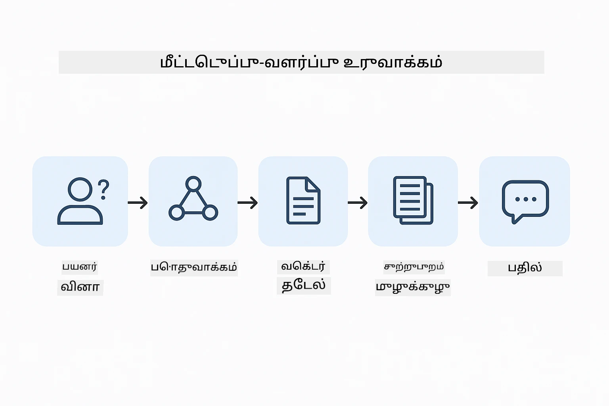
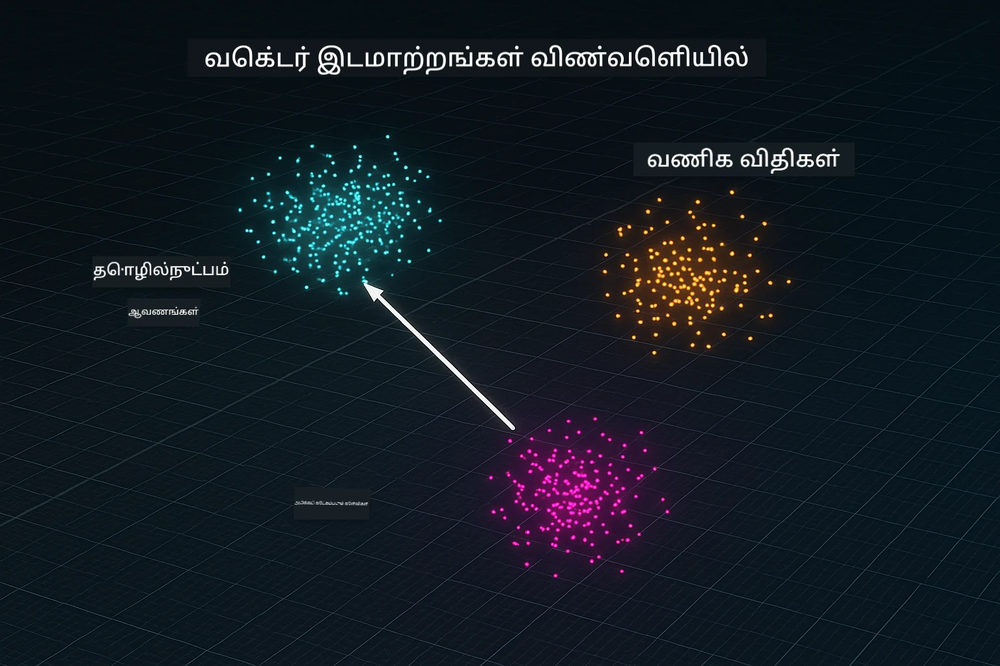
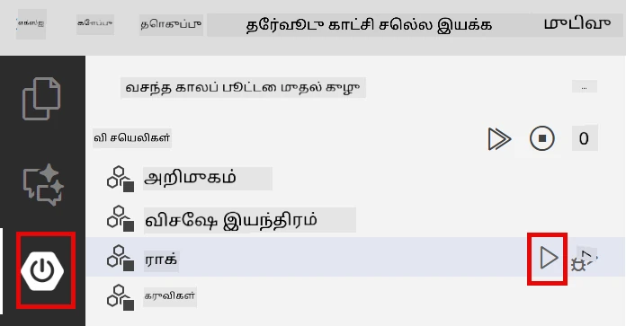
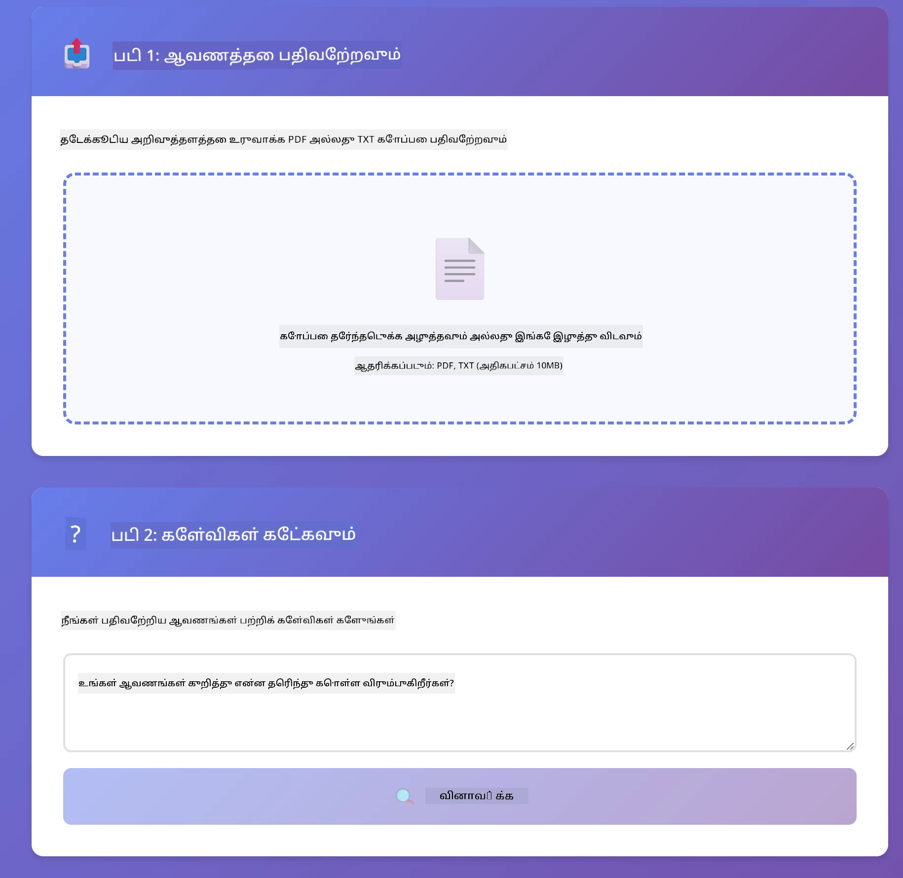
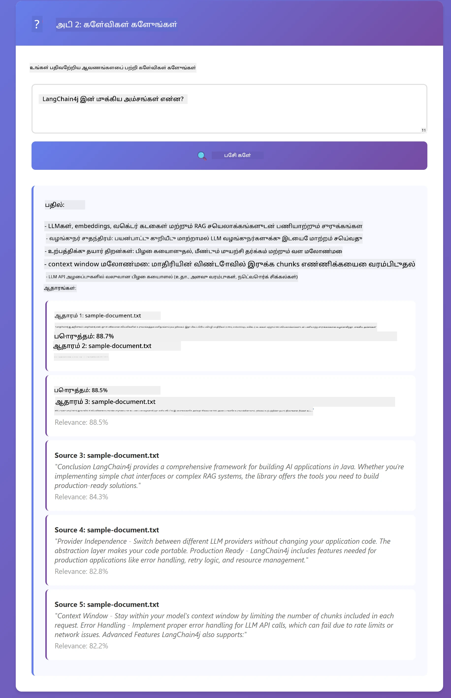

<!--
CO_OP_TRANSLATOR_METADATA:
{
  "original_hash": "81d087662fb3dd7b7124bce1a9c9ec86",
  "translation_date": "2026-01-06T01:54:01+00:00",
  "source_file": "03-rag/README.md",
  "language_code": "ta"
}
-->
# Module 03: RAG (Retrieval-Augmented Generation)

## Table of Contents

- [What You'll Learn](../../../03-rag)
- [Prerequisites](../../../03-rag)
- [Understanding RAG](../../../03-rag)
- [How It Works](../../../03-rag)
  - [Document Processing](../../../03-rag)
  - [Creating Embeddings](../../../03-rag)
  - [Semantic Search](../../../03-rag)
  - [Answer Generation](../../../03-rag)
- [Run the Application](../../../03-rag)
- [Using the Application](../../../03-rag)
  - [Upload a Document](../../../03-rag)
  - [Ask Questions](../../../03-rag)
  - [Check Source References](../../../03-rag)
  - [Experiment with Questions](../../../03-rag)
- [Key Concepts](../../../03-rag)
  - [Chunking Strategy](../../../03-rag)
  - [Similarity Scores](../../../03-rag)
  - [In-Memory Storage](../../../03-rag)
  - [Context Window Management](../../../03-rag)
- [When RAG Matters](../../../03-rag)
- [Next Steps](../../../03-rag)

## What You'll Learn

முந்தைய தொகுதிகள் முழுக்க, நீங்கள் AI உடன் உரையாடல் நடத்துவதையும், உங்கள் ப்ராம்ப்ட்களை திறன்மிகு முறையில் கட்டமைப்பதையும் கற்றுக்கொண்டீர்கள். ஆனால் ஒரு அடிப்படை வரம்பு உள்ளது: மொழி மாதிரிகள் பயிற்சி பருவத்தில் கற்றுக்கொண்டதை மட்டுமே அறிந்துகொள்கின்றன. உங்கள் நிறுவனத்தினுடைய கொள்கைகள், உங்கள் திட்ட ஆவணங்கள் அல்லது பயிற்சி பெறாத எந்த தகவலையும் அவர்கள் பதிலளிக்க முடியாது.

RAG (Retrieval-Augmented Generation) இந்த பிரச்சனையை தீர்க்கிறது. மாதிரியிடம் உங்கள் தகவலை கற்றுக்கொள்ள முயற்சிப்பதற்குப் பதிலாக (எதிர்மறையாகவும் தேவையற்றவுமானாலும்), நீங்கள் அதற்கு உங்கள் ஆவணங்களை தேடுவதற்கான திறனை அளிக்கிறீர்கள். ஒருவர் ஒரு கேள்வி கேட்டால், அந்த அமைப்பு தொடர்புடைய தகவலை கண்டுபிடித்து அதை ப்ராம்ப்டில் சேர்க்கிறது. மாதிரி பின்னர் அந்த மீட்டெடுக்கப்பட்ட சூழல் அடிப்படையில் பதிலளிக்கிறது.

RAG ஐ மாதிரிக்கு ஒரு குறிப்பு நூலகம் வழங்குவது போல எண்ணிக்கவும். நீங்கள் ஒரு கேள்வி கேட்டால், அந்த அமைப்பு:

1. **பயனர் கேள்வி** - நீங்கள் ஒரு கேள்வி கேட்டீர்கள்
2. **எம்பெட்டிங்** - உங்கள் கேள்வியை ஒரு வெக்டர் வடிவமாக மாற்றுகிறது
3. **வெக்டர் தேடல்** - ஒத்த ஆவண துண்டுகளைக் கண்டுபிடிக்கிறது
4. **சூழல் ஒன்றிணைவு** - தொடர்புடைய துண்டுகளை ப்ராம்ப்டுக்கு சேர்க்கிறது
5. **பதில்** - LLM அந்த சூழலை அடிப்படையாகக் கொண்டு பதில் உருவாக்கிறது

இதன் மூலம் மாதிரியின் பதில்கள், அதன் பயிற்சி அறிவில் அல்லது கதைகள் படைப்பதில் இருந்து அல்லாமல் உங்கள் உண்மையான தரவுகளில் அடிப்படையாக இருக்கும்.



*RAG வேலை திறன் - பயனர் கேள்வி முதல் பொருள் தேடல் மற்றும் சூழல் அடிப்படையிலான பதில் உருவாக்கம் வரை*

## Prerequisites

- Module 01 முடித்திருப்பது (Azure OpenAI வளங்கள் நிறுவப்பட்டுள்ளது)
- ரூட் அடியில் `.env` கோப்பு Azure அங்கீகாரத்துடன் சேர்க்கப்பட்டுள்ளது (Module 01 இல் `azd up` மூலம் உருவாக்கப்பட்டது)

> **குறிப்பு:** நீங்கள் Module 01 முடிக்கவில்லை என்றால், முதலில் அங்கு உள்ள நிறுவல் வழிமுறைகளை பின்பற்றவும்.

## How It Works

### Document Processing

[DocumentService.java](../../../03-rag/src/main/java/com/example/langchain4j/rag/service/DocumentService.java)

நீங்கள் ஒரு ஆவணத்தை பதிவேற்றும்போது, அமைப்பு அதை துண்டுகளாகப் பிரிக்கிறது - மாதிரியின் சூழல் ஜன்னலுக்கு ஏற்ற சிறிய துண்டுகள். இவை ஓவர்லாப்பாக இருக்கின்றன, எல்லைகளில் உள்ள சூழலை நீங்கள் இழக்காமல் இருக்க.

```java
Document document = FileSystemDocumentLoader.loadDocument("sample-document.txt");

DocumentSplitter splitter = DocumentSplitters
    .recursive(300, 30, new OpenAiTokenizer());

List<TextSegment> segments = splitter.split(document);
```

> **🤖 [GitHub Copilot](https://github.com/features/copilot) Chat உடன் முயற்சிக்கவும்:** [`DocumentService.java`](../../../03-rag/src/main/java/com/example/langchain4j/rag/service/DocumentService.java) திறந்து கேளுங்கள்:
> - "LangChain4j ஆவணங்களை எப்படி துண்டுகளாகப் பிரிக்கிறது மற்றும் ஓவர்லாப்பின் முக்கியத்துவம் என்ன?"
> - "விதவிதமான ஆவண வகைகளுக்கான சிறந்த துண்டு அளவு என்ன மற்றும் ஏன்?"
> - "பல மொழிகளில் அல்லது சிறப்பு வடிவமைப்புடன் உள்ள ஆவணங்களை எப்படி கையாள்வது?"

### Creating Embeddings

[LangChainRagConfig.java](../../../03-rag/src/main/java/com/example/langchain4j/rag/config/LangChainRagConfig.java)

ஒரு துண்டு எம்பெட்டிங் எனப்படும் கணித மொழியில் மாற்றப்படுகிறது - உரையின் அர்த்தத்தை அடையாளம் காணும் ஒரு கணிதத் தடிமன் போன்றது. ஒத்த உரைகள் ஒத்த எம்பெட்டிங்களை உருவாக்கும்.

```java
@Bean
public EmbeddingModel embeddingModel() {
    return OpenAiOfficialEmbeddingModel.builder()
        .baseUrl(azureOpenAiEndpoint)
        .apiKey(azureOpenAiKey)
        .modelName(azureEmbeddingDeploymentName)
        .build();
}

EmbeddingStore<TextSegment> embeddingStore = 
    new InMemoryEmbeddingStore<>();
```



*எம்பெட்டிங் விண்வெளியில் வெக்டர்கள் மூலம் பிரதிநிதித்துவம் அளிக்கப்படும் ஆவணங்கள் - ஒத்த உள்ளடக்கம் குழுக்களாக இணைகிறது*

### Semantic Search

[RagService.java](../../../03-rag/src/main/java/com/example/langchain4j/rag/service/RagService.java)

நீங்கள் ஒரு கேள்வி கேட்டால், உங்கள் கேள்வியும் ஒரு எம்பெட்டிங்காக மாறும். அமைப்பு உங்கள் கேள்வியின் எம்பெட்டிங்கை அனைத்து ஆவண துண்டுகளின் எம்பெட்டிங்களுடன் ஒப்பிடும். பயன்படுத்திய சொற்கள் மாதிரி இல்லாமல் உண்மை பொருள் ஒத்துப்போகும் துண்டுகளை கண்டுபிடிக்கும்.

```java
Embedding queryEmbedding = embeddingModel.embed(question).content();

List<EmbeddingMatch<TextSegment>> matches = 
    embeddingStore.findRelevant(queryEmbedding, 5, 0.7);

for (EmbeddingMatch<TextSegment> match : matches) {
    String relevantText = match.embedded().text();
    double score = match.score();
}
```

> **🤖 [GitHub Copilot](https://github.com/features/copilot) Chat உடன் முயற்சிக்கவும்:** [`RagService.java`](../../../03-rag/src/main/java/com/example/langchain4j/rag/service/RagService.java) திறந்து கேளுங்கள்:
> - "எம்பெட்டிங்களுடன் ஒத்துப்போவல் தேடல் எப்படிப் பணியாற்றுகிறது மற்றும் மதிப்பெண் என்னால் வர முடிகிறது?"
> - "எந்த ஒத்துப்போவு தரவரிசை பயன்படுத்த வேண்டும் மற்றும் அது முடிவுகளை எப்படி பாதிக்கிறது?"
> - "பொருத்தமான ஆவணங்கள் ஒருமையாக கண்டு போகாத சூழலை எப்படி கையாள்வது?"

### Answer Generation

[RagService.java](../../../03-rag/src/main/java/com/example/langchain4j/rag/service/RagService.java)

மிகவும் தொடர்புடைய துண்டுகள் மாதிரிக்கு ப்ராம்ப்டில் சேர்க்கப்படுகின்றன. மாதிரி அவற்றை படித்து, அந்த தகவலை அடிப்படையாகக் கொண்டு உங்கள் கேள்விக்கு பதிலளிக்கும். இது மோசடியை (hallucination) தடுக்கும் - மாதிரி வெறும் கண்காணிப்பின் முன் உள்ளதிலேயே பதிலளிக்க முடியும்.

## Run the Application

**இறுதி நிறுவல் சரிபார்க்கவும்:**

ரூட் அடியில் `.env` கோப்பும் Azure அங்கீகாரங்களுடன் இருப்பதை உறுதிசெய்க (Module 01 இல் உருவாக்கப்பட்டது):
```bash
cat ../.env  # AZURE_OPENAI_ENDPOINT, API_KEY, DEPLOYMENT காட்ட வேண்டும்
```

**செயலி தொடக்கம்:**

> **குறிப்பு:** நீங்கள் Module 01 இல் இருந்து `./start-all.sh` கொண்டு அனைத்து செயலிகளையும் துவக்கியிருந்தால், இந்த தொகுதி ஏற்கனவே போர்ட் 8081-ல் இயங்குகிறது. கீழுள்ள துவக்கச் கட்டளைகளை தவிர்த்து நேரடியாக http://localhost:8081 அணுகலாம்.

**விருப்பம் 1: Spring Boot Dashboard பயன்படுத்துதல் (VS Code பயன்படுத்துவோருக்கு பரிந்துரைக்கப்படுகிறது)**

டெவ் கண்டெய்னரில் Spring Boot Dashboard நீட்டிப்பு உள்ளது, இது அனைத்து Spring Boot செயலிகளையும் காட்சிப்படுத்தும். அதனை VS Code இடது Activity Bar-இல் Spring Boot ஐகானை பார்த்து காணலாம்.

Spring Boot Dashboard-இல் நீங்கள்:
- உங்கள் பணித் தளத்தில் அனைத்து Spring Boot செயலிகளையும் பார்க்கலாம்
- ஒரு கிளிக் மூலம் செயலிகளைக் தொடக்க/நிறுத்தலாம்
- செயலியின் லாக்களையும் நேரடி பார்வை காணலாம்
- செயலியின் நிலையை கண்காணிக்கலாம்

"rag" பக்கத்து பிளே பட்டனை அழுத்தி தொடங்கி அல்லது அனைத்து தொகுதிகளையும் ஒரே பாட்டில் தொடங்கலாம்.



**விருப்பம் 2: ஷெல் ஸ்கிரிப்ட்கள் பயன்படுத்துதல்**

அனைத்து வலை செயலிகளையும் (மொடியூல் 01-04) தொடங்கு:

**Bash:**
```bash
cd ..  # ரூட் அடைவை முதல்
./start-all.sh
```

**PowerShell:**
```powershell
cd ..  # ரூட் அடைவு இலிருந்து
.\start-all.ps1
```

அல்லது இந்த மொடியூலை மட்டும் தொடங்கு:

**Bash:**
```bash
cd 03-rag
./start.sh
```

**PowerShell:**
```powershell
cd 03-rag
.\start.ps1
```

இரு ஸ்கிரிப்ட்களும் ரூட் `.env` கோப்பில் உள்ள சூழல் மாறிலிகளை தானாக ஏற்றவும், JAR க்களை அவை இல்லாவிட்டால் கட்டுமானம் செய்யவும் செய்கின்றன.

> **குறிப்பு:** அனைத்து தொகுதிகளையும் கைமுறையாக கட்டியமைக்க விரும்பினால்:
>
> **Bash:**
> ```bash
> cd ..  # Go to root directory
> mvn clean package -DskipTests
> ```
>
> **PowerShell:**
> ```powershell
> cd ..  # Go to root directory
> mvn clean package -DskipTests
> ```

http://localhost:8081 - ஐ உலாவியில் திறக்கவும்.

**நிறுத்த:**

**Bash:**
```bash
./stop.sh  # இந்த மோடியூல் மட்டும்
# அல்லது
cd .. && ./stop-all.sh  # அனைத்து மோடியூல்கள்
```

**PowerShell:**
```powershell
.\stop.ps1  # இந்த மாட்யூல் மட்டும்
# அல்லது
cd ..; .\stop-all.ps1  # அனைத்து மாட்யூல்களும்
```

## Using the Application

செயலி ஆவணத்தை பதிவேற்றவும் கேள்விகளை கேட்கவும் ஒரு வலை முகப்பரைத் தருகிறது.

<a href="images/rag-homepage.png"></a>

*RAG செயலி முகப்பு - ஆவணங்களை பதிவேற்று, கேள்விகள் கேளுங்கள்*

### Upload a Document

முதலில் ஒரு ஆவணத்தை பதிவேற்றவும் - சோதனைக்க TXT கோப்புகள் சிறந்தவை. இந்த அடைவில் உள்ள `sample-document.txt` LangChain4j அம்சங்கள், RAG செயல்பாடு மற்றும் சிறந்த நடைமுறைகள் பற்றி தகவல்களை கொண்டுள்ளது - கணக்காய்வு செய்ய சிறந்தது.

செயலி உங்கள் ஆவணத்தை செயலாக்கி, துண்டுகளாகப் பிரித்து, ஒவ்வொரு துண்டிற்கும் எம்பெட்டிங்களை உருவாக்கும். இது பதிவேற்றும்போது தானாக நடக்கிறது.

### Ask Questions

இப்போது ஆவண உள்ளடக்கம் பற்றிய குறிப்பிட்ட கேள்விகள் கேளுங்கள். ஆவணத்தில் தெளிவாக குறிப்பிடப்பட்ட எதையாவது முயற்சிக்கவும். அமைப்பு தொடர்புடைய துண்டுகளைத் தேடி, அவற்றை ப்ராம்ப்டில் சேர்த்து, பதில் உருவாக்கும்.

### Check Source References

ஒவ்வொரு பதிலும் குறிப்பு சுட்டுகளுடன் வழங்கப்படும், ஒத்துப்போய் மதிப்பெண்கள் உள்ளன. இவை (0 முதல் 1 வரை) உங்கள் கேள்விக்கான சக்தியான தொடர்புடைய துண்டின் அளவை காட்டும். அதிக மதிப்பெண்கள் சிறந்த பொருத்தம் என்பதை குறிக்கிறது. இது பதிலை தளம் உள்ளடக்கத்துடன் ஒப்பிட்டு சரிபார்க்க உதவும்.

<a href="images/rag-query-results.png"></a>

*கேள்வி முடிவுகள்: பதில் மற்றும் ஆதாரம், தொடர்பு மதிப்பெண்களுடன்*

### Experiment with Questions

விதவிதமான கேள்விகளை முயற்சிக்கவும்:
- குறிப்பிட்ட உண்மைகள்: "பிரதான தலைப்பு என்ன?"
- ஒப்புமைகள்: "X மற்றும் Y மத்திய வித்தியாசம் என்ன?"
- சுருக்கங்கள்: "Z பற்றிய முக்கிய புள்ளிகளை சுருக்கவும்"

உங்கள் கேள்வி ஆவண உள்ளடக்கத்துடன் எவ்வாறு பொருந்துகிறது என்பதைப் பொறுத்து தொடர்பு மதிப்பெண்கள் எவ்வாறு மாறுகின்றன என்பதைக் கவனியுங்கள்.

## Key Concepts

### Chunking Strategy

ஆவணங்கள் 300-டோக்கன் துண்டுகளாக 30 டோக்கன் ஓவர்லாப்புடன் பிரிக்கப்படுகின்றன. இந்த சமநிலை ஒவ்வொரு துண்டும் போதுமான சூழலை கொண்டிருப்பதை உறுதி செய்யும் மற்றும் பல துண்டுக்களுடன் ப்ராம்ப்டில் சேர்க்கச் சிறியது ஆகும்.

### Similarity Scores

மதிப்பெண்கள் 0 முதல் 1 வரை:
- 0.7-1.0: மிக பொருத்தமானது, சரியான பொருத்தம்
- 0.5-0.7: பொருத்தமானது, நல்ல சூழல்
- 0.5 கீழ்: துரத்தப்பட்டவை, அதிகமாய் வேறுபட்டவை

மேல்நிலை மதிப்பெண்கள் உள்ள துண்டுகளையே அமைப்பு மீட்டெடுக்கும், தரத்தை உறுதி செய்வதற்காக.

### In-Memory Storage

இந்த தொகுதி எளிமைப்பொருட்டு மொளியிலுள்ள சேமிப்பை பயன்படுத்துகிறது. செயலியை மீண்டும் துவங்கும் போது, பதிவேற்றிய ஆவணங்கள் இழக்கப்படும். உற்பத்தி அமைப்புகள் Qdrant அல்லது Azure AI Search போன்ற நிரந்தர வெக்டர் தரவுத்தளங்களைப் பயன்படுத்துகின்றன.

### Context Window Management

ஒவ்வொரு மாதிரிக்கும் மனதிற்கு வரம்பு உள்ள சூழல் ஜன்னல் உள்ளது. பெரிய ஆவணத்திலிருந்து அனைத்து துண்டுகளையும் ஒன்று சேர்க்க முடியாது. அமைப்பு மிக பொருத்தமான N துண்டுகளை (இயல்பாக 5) மீட்டெடுத்து வரம்புக்குள் இருந்தே துல்லிய பதில்களுக்கு போதுமான சூழலை வழங்கும்.

## When RAG Matters

**RAG பயன்படுத்தும் போது:**
- சொந்த ஆவணங்களுக்கு கேள்விகள் கேட்கும் போது
- தகவல் அடிக்கடி மாற்றப்படும் போது (கொள்கைகள், விலைப்பட்டியல்கள், விவரக்குறிப்புகள்)
- துல்லியத்துக்கு ஆதாரக் குறிப்புகள் தேவையான போது
- உள்ளடக்கம் ஒரு ப்ராம்ப்டில் சேர முடியாத அளவு பெரியபோது
- பரிசோதிக்கக்கூடிய, நிலையான பதில்கள் வேண்டும்

**RAG பயன்படுத்தக்கூடாத போது:**
- கேள்விகள் மாதிரியிடம் ஏற்கனவே உள்ள பொதுவான அறிவனைக் கேட்கும்போது
- நேரடி தரவு தேவைப்படும் போது (RAG பதிவேற்றிய ஆவணங்களில் மட்டுமே இயங்கும்)
- உள்ளடக்கம் சிறியதாக இருந்தால் நேரடியாக ப்ராம்ப்டில் சேர்க்கலாம்

## Next Steps

**அடுத்த தொகுதி:** [04-tools - AI Agents with Tools](../04-tools/README.md)

---

**Navigation:** [← Previous: Module 02 - Prompt Engineering](../02-prompt-engineering/README.md) | [Back to Main](../README.md) | [Next: Module 04 - Tools →](../04-tools/README.md)

---

<!-- CO-OP TRANSLATOR DISCLAIMER START -->
**அறிவுறுத்தல்**:  
இந்த ஆவணம் AI மொழி மாற்ற சேவை [Co-op Translator](https://github.com/Azure/co-op-translator) மூலம் மொழிபெயர்க்கப்பட்டது. நாங்கள் துல்லியத்துக்கு முயற்சி செய்கிறோம் என்பதையெல்லாம் நினைவில் வையுங்கள், ஆனால் தூய்மையான மொழி மாற்றங்களில் சில தவறுகள் அல்லது பிழைகள் இருக்கலாம். அசல் ஆவணம் அப்பிராந்திய மொழியில் தான் அதிகாரப்பூர்வ வளமாக கருதப்பட வேண்டும். முக்கியமான தகவல்களுக்கு, தொழில்முறை மனித மொழிபெயர்ப்பை பயன்படுத்த ஆலோசிக்கப்படுகிறது. இந்த மொழி மாற்றத்தின் காரணமாக ஏற்படும் எந்த தவறான புரிதல்கள் அல்லது புரிதல் தவிர்ப்புகளுக்கு நாங்கள் பொறுப்பாக இருக்க மாட்டோம்.
<!-- CO-OP TRANSLATOR DISCLAIMER END -->