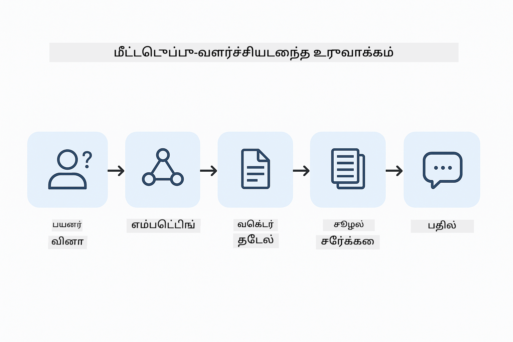
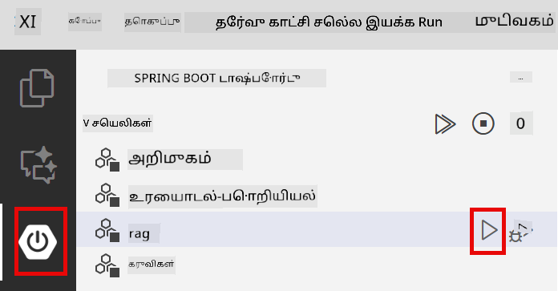
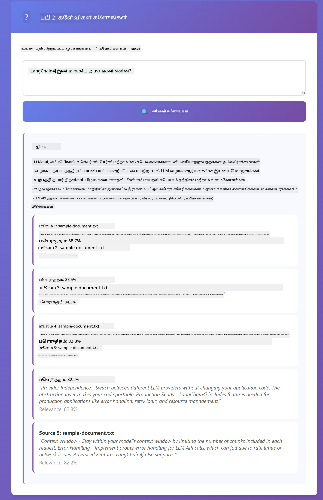

<!--
CO_OP_TRANSLATOR_METADATA:
{
  "original_hash": "f538a51cfd13147d40d84e936a0f485c",
  "translation_date": "2025-12-13T17:26:28+00:00",
  "source_file": "03-rag/README.md",
  "language_code": "ta"
}
-->
# Module 03: RAG (Retrieval-Augmented Generation)

## Table of Contents

- [What You'll Learn](../../../03-rag)
- [Prerequisites](../../../03-rag)
- [Understanding RAG](../../../03-rag)
- [How It Works](../../../03-rag)
  - [Document Processing](../../../03-rag)
  - [Creating Embeddings](../../../03-rag)
  - [Semantic Search](../../../03-rag)
  - [Answer Generation](../../../03-rag)
- [Run the Application](../../../03-rag)
- [Using the Application](../../../03-rag)
  - [Upload a Document](../../../03-rag)
  - [Ask Questions](../../../03-rag)
  - [Check Source References](../../../03-rag)
  - [Experiment with Questions](../../../03-rag)
- [Key Concepts](../../../03-rag)
  - [Chunking Strategy](../../../03-rag)
  - [Similarity Scores](../../../03-rag)
  - [In-Memory Storage](../../../03-rag)
  - [Context Window Management](../../../03-rag)
- [When RAG Matters](../../../03-rag)
- [Next Steps](../../../03-rag)

## What You'll Learn

முந்தைய மாட்யூல்களில், நீங்கள் AI உடன் உரையாடல்களை எவ்வாறு நடத்துவது மற்றும் உங்கள் ப்ராம்ப்ட்களை எவ்வாறு சிறப்பாக அமைப்பது என்பதை கற்றுக்கொண்டீர்கள். ஆனால் ஒரு அடிப்படையான வரம்பு உள்ளது: மொழி மாதிரிகள் பயிற்சியின் போது கற்றுக்கொண்டதையே மட்டுமே அறிவது. அவை உங்கள் நிறுவனத்தின் கொள்கைகள், உங்கள் திட்ட ஆவணங்கள் அல்லது பயிற்சி பெறாத எந்த தகவலையும் பதிலளிக்க முடியாது.

RAG (Retrieval-Augmented Generation) இந்த பிரச்சனையை தீர்க்கிறது. மாதிரிக்கு உங்கள் தகவலை கற்பிக்க முயற்சிப்பதற்குப் பதிலாக (அது செலவானதும் நடைமுறைபூர்வமல்லாததும்), நீங்கள் அதற்கு உங்கள் ஆவணங்களை தேடுவதற்கான திறனை வழங்குகிறீர்கள். யாராவது கேள்வி கேட்டால், அமைப்பு தொடர்புடைய தகவலை கண்டுபிடித்து ப்ராம்ப்டில் சேர்க்கிறது. பின்னர் மாதிரி அந்த மீட்டெடுக்கப்பட்ட சூழலை அடிப்படையாகக் கொண்டு பதிலளிக்கிறது.

RAG ஐ மாதிரிக்கு ஒரு குறிப்பு நூலகம் வழங்குவது போல நினைத்துக் கொள்ளுங்கள். நீங்கள் கேள்வி கேட்டால், அமைப்பு:

1. **பயனர் கேள்வி** - நீங்கள் ஒரு கேள்வி கேட்கிறீர்கள்
2. **எம்பெட்டிங்** - உங்கள் கேள்வியை ஒரு வெக்டர் ஆக மாற்றுகிறது
3. **வெக்டர் தேடல்** - ஒத்த ஆவண துண்டுகளை கண்டுபிடிக்கிறது
4. **சூழல் தொகுப்பு** - தொடர்புடைய துண்டுகளை ப்ராம்ப்டில் சேர்க்கிறது
5. **பதில்** - LLM அந்த சூழலை அடிப்படையாகக் கொண்டு பதில் உருவாக்குகிறது

இது மாதிரியின் பதில்களை அதன் பயிற்சி அறிவுக்கு பதிலாக உங்கள் உண்மையான தரவின் அடிப்படையில் நிலைநிறுத்துகிறது அல்லது பதில்களை உருவாக்குவதைக் குறைக்கிறது.



*RAG வேலைநடை - பயனர் கேள்வியிலிருந்து அர்த்தவியல் தேடல் மற்றும் சூழல் சார்ந்த பதில் உருவாக்கம் வரை*

## Prerequisites

- Module 01 முடிக்கப்பட்டது (Azure OpenAI வளங்கள் நிறுவப்பட்டுள்ளன)
- ரூட் அடைவில் `.env` கோப்பு Azure அங்கீகாரங்களுடன் உள்ளது (Module 01 இல் `azd up` மூலம் உருவாக்கப்பட்டது)

> **Note:** நீங்கள் Module 01 முடிக்கவில்லை என்றால், முதலில் அங்கு உள்ள நிறுவல் வழிமுறைகளை பின்பற்றவும்.


## How It Works

**Document Processing** - [DocumentService.java](../../../03-rag/src/main/java/com/example/langchain4j/rag/service/DocumentService.java)

நீங்கள் ஒரு ஆவணத்தை பதிவேற்றும்போது, அமைப்பு அதை துண்டுகளாகப் பிரிக்கிறது - மாதிரியின் சூழல் ஜன்னலில் சௌகரியமாக பொருந்தும் சிறிய துண்டுகள். இந்த துண்டுகள் சிறிது அளவு ஒட்டிக்கொண்டு இருக்கும், இதனால் எல்லைகளில் சூழல் இழப்பதில்லை.

```java
Document document = FileSystemDocumentLoader.loadDocument("sample-document.txt");

DocumentSplitter splitter = DocumentSplitters
    .recursive(300, 30, new OpenAiTokenizer());

List<TextSegment> segments = splitter.split(document);
```

> **🤖 Try with [GitHub Copilot](https://github.com/features/copilot) Chat:** Open [`DocumentService.java`](../../../03-rag/src/main/java/com/example/langchain4j/rag/service/DocumentService.java) and ask:
> - "How does LangChain4j split documents into chunks and why is overlap important?"
> - "What's the optimal chunk size for different document types and why?"
> - "How do I handle documents in multiple languages or with special formatting?"

**Creating Embeddings** - [LangChainRagConfig.java](../../../03-rag/src/main/java/com/example/langchain4j/rag/config/LangChainRagConfig.java)

ஒவ்வொரு துண்டும் எம்பெட்டிங் எனப்படும் எண்கணித பிரதிநிதித்துவமாக மாற்றப்படுகிறது - இது உரையின் பொருளை பிடிக்கும் கணித ரேகைச்சீட்டு. ஒத்த உரைகள் ஒத்த எம்பெட்டிங்களை உருவாக்கும்.

```java
@Bean
public EmbeddingModel embeddingModel() {
    return OpenAiOfficialEmbeddingModel.builder()
        .baseUrl(azureOpenAiEndpoint)
        .apiKey(azureOpenAiKey)
        .modelName(azureEmbeddingDeploymentName)
        .build();
}

EmbeddingStore<TextSegment> embeddingStore = 
    new InMemoryEmbeddingStore<>();
```


*எம்பெட்டிங் இடத்தில் வெக்டர்களாக பிரதிநிதித்துவம் செய்யப்பட்ட ஆவணங்கள் - ஒத்த உள்ளடக்கம் ஒன்றாக கூடி இருக்கும்*

**Semantic Search** - [RagService.java](../../../03-rag/src/main/java/com/example/langchain4j/rag/service/RagService.java)

நீங்கள் கேள்வி கேட்டால், உங்கள் கேள்வியும் ஒரு எம்பெட்டிங்காக மாறும். அமைப்பு உங்கள் கேள்வியின் எம்பெட்டிங்கை அனைத்து ஆவண துண்டுகளின் எம்பெட்டிங்களுடன் ஒப்பிடுகிறது. அது மிக ஒத்த பொருள் கொண்ட துண்டுகளை கண்டுபிடிக்கிறது - வெறும் முக்கிய வார்த்தைகள் பொருந்துவதல்ல, உண்மையான அர்த்த ஒத்திசைவு.

```java
Embedding queryEmbedding = embeddingModel.embed(question).content();

List<EmbeddingMatch<TextSegment>> matches = 
    embeddingStore.findRelevant(queryEmbedding, 5, 0.7);

for (EmbeddingMatch<TextSegment> match : matches) {
    String relevantText = match.embedded().text();
    double score = match.score();
}
```

> **🤖 Try with [GitHub Copilot](https://github.com/features/copilot) Chat:** Open [`RagService.java`](../../../03-rag/src/main/java/com/example/langchain4j/rag/service/RagService.java) and ask:
> - "How does similarity search work with embeddings and what determines the score?"
> - "What similarity threshold should I use and how does it affect results?"
> - "How do I handle cases where no relevant documents are found?"

**Answer Generation** - [RagService.java](../../../03-rag/src/main/java/com/example/langchain4j/rag/service/RagService.java)

மிகவும் தொடர்புடைய துண்டுகள் மாதிரிக்கு ப்ராம்ப்டில் சேர்க்கப்படுகின்றன. மாதிரி அந்த குறிப்பிட்ட துண்டுகளைப் படித்து, அந்த தகவலின் அடிப்படையில் உங்கள் கேள்விக்கு பதிலளிக்கிறது. இது மாயை உருவாக்குவதைத் தடுக்கும் - மாதிரி முன்னிலையில் உள்ளதையே மட்டுமே பதிலளிக்க முடியும்.

## Run the Application

**Verify deployment:**

ரூட் அடைவில் `.env` கோப்பு Azure அங்கீகாரங்களுடன் உள்ளது என்பதை உறுதிப்படுத்தவும் (Module 01 இல் உருவாக்கப்பட்டது):
```bash
cat ../.env  # AZURE_OPENAI_ENDPOINT, API_KEY, DEPLOYMENT ஐ காட்ட வேண்டும்
```

**Start the application:**

> **Note:** நீங்கள் ஏற்கனவே Module 01 இல் இருந்து `./start-all.sh` பயன்படுத்தி அனைத்து செயலிகளையும் துவக்கியிருந்தால், இந்த மாட்யூல் 8081 போர்டில் இயங்கிக் கொண்டிருக்கிறது. கீழுள்ள துவக்க கட்டளைகளை தவிர்த்து நேரடியாக http://localhost:8081 செல்லலாம்.

**Option 1: Using Spring Boot Dashboard (Recommended for VS Code users)**

டெவ் கன்டெய்னர் Spring Boot Dashboard விரிவாக்கத்துடன் வருகிறது, இது அனைத்து Spring Boot செயலிகளையும் கையாள ஒரு காட்சி இடைமுகத்தை வழங்குகிறது. இது VS Code இன் இடது பக்க Activity Bar இல் Spring Boot ஐகானைக் காணலாம்.

Spring Boot Dashboard இல் இருந்து, நீங்கள்:
- வேலைப்பகுதியில் உள்ள அனைத்து Spring Boot செயலிகளையும் காணலாம்
- ஒரு கிளிக்கில் செயலிகளை துவக்க/நிறுத்தலாம்
- செயலி பதிவுகளை நேரடியாகப் பார்க்கலாம்
- செயலி நிலையை கண்காணிக்கலாம்

"rag" பக்கத்தில் உள்ள பிளே பொத்தானை கிளிக் செய்து இந்த மாட்யூலை துவக்கலாம், அல்லது அனைத்து மாட்யூல்களையும் ஒரே நேரத்தில் துவக்கலாம்.



**Option 2: Using shell scripts**

அனைத்து வலை செயலிகளையும் துவக்கவும் (மாட்யூல்கள் 01-04):

**Bash:**
```bash
cd ..  # ரூட் அடைவு கோப்புறையிலிருந்து
./start-all.sh
```

**PowerShell:**
```powershell
cd ..  # ரூட் அடைவு கோப்புறையிலிருந்து
.\start-all.ps1
```

அல்லது இந்த மாட்யூலை மட்டும் துவக்கவும்:

**Bash:**
```bash
cd 03-rag
./start.sh
```

**PowerShell:**
```powershell
cd 03-rag
.\start.ps1
```

இரு ஸ்கிரிப்ட்களும் ரூட் `.env` கோப்பிலிருந்து சுற்றுச்சூழல் மாறிலிகளை தானாக ஏற்றும் மற்றும் JAR கோப்புகள் இல்லாவிட்டால் அவற்றை கட்டும்.

> **Note:** நீங்கள் அனைத்து மாட்யூல்களையும் கையேடு முறையில் கட்டி பிறகு துவக்க விரும்பினால்:
>
> **Bash:**
> ```bash
> cd ..  # Go to root directory
> mvn clean package -DskipTests
> ```
>
> **PowerShell:**
> ```powershell
> cd ..  # Go to root directory
> mvn clean package -DskipTests
> ```

உங்கள் உலாவியில் http://localhost:8081 ஐ திறக்கவும்.

**To stop:**

**Bash:**
```bash
./stop.sh  # இந்த தொகுதி மட்டும்
# அல்லது
cd .. && ./stop-all.sh  # அனைத்து தொகுதிகளும்
```

**PowerShell:**
```powershell
.\stop.ps1  # இந்த தொகுதி மட்டும்
# அல்லது
cd ..; .\stop-all.ps1  # அனைத்து தொகுதிகளும்
```

## Using the Application

இந்த செயலி ஆவணங்களை பதிவேற்றவும் கேள்விகள் கேட்கவும் ஒரு வலை இடைமுகத்தை வழங்குகிறது.

<a href="images/rag-homepage.png"></a>

*RAG செயலி இடைமுகம் - ஆவணங்களை பதிவேற்றவும் கேள்விகள் கேட்கவும்*

**Upload a Document**

முதலில் ஒரு ஆவணத்தை பதிவேற்றவும் - TXT கோப்புகள் சோதனைக்காக சிறந்தவை. இந்த அடைவில் `sample-document.txt` உள்ளது, இது LangChain4j அம்சங்கள், RAG செயலாக்கம் மற்றும் சிறந்த நடைமுறைகள் பற்றிய தகவலை கொண்டுள்ளது - அமைப்பை சோதிக்க சிறந்தது.

அமைப்பு உங்கள் ஆவணத்தை செயலாக்கி, துண்டுகளாகப் பிரித்து, ஒவ்வொரு துண்டுக்கும் எம்பெட்டிங்களை உருவாக்கும். இது பதிவேற்றும்போது தானாக நடக்கும்.

**Ask Questions**

இப்போது ஆவண உள்ளடக்கத்தைப் பற்றி குறிப்பிட்ட கேள்விகளை கேட்கவும். ஆவணத்தில் தெளிவாக குறிப்பிடப்பட்ட உண்மையான விஷயங்களை முயற்சிக்கவும். அமைப்பு தொடர்புடைய துண்டுகளை தேடி, அவற்றை ப்ராம்ப்டில் சேர்த்து, பதிலை உருவாக்கும்.

**Check Source References**

ஒவ்வொரு பதிலும் தொடர்புடைய மூல குறிப்புகளுடன் similarity மதிப்பெண்களையும் கொண்டிருக்கும். இந்த மதிப்பெண்கள் (0 முதல் 1 வரை) உங்கள் கேள்விக்கு ஒவ்வொரு துண்டும் எவ்வளவு தொடர்புடையது என்பதை காட்டும். அதிக மதிப்பெண்கள் சிறந்த பொருத்தத்தை குறிக்கும். இது பதிலை மூலப் பொருளுடன் ஒப்பிட உதவும்.

<a href="images/rag-query-results.png"></a>

*கேள்வி முடிவுகள் - பதில், மூல குறிப்புகள் மற்றும் தொடர்பு மதிப்பெண்களுடன்*

**Experiment with Questions**

விதவிதமான கேள்விகளை முயற்சிக்கவும்:
- குறிப்பிட்ட உண்மைகள்: "முக்கிய தலைப்பு என்ன?"
- ஒப்பீடுகள்: "X மற்றும் Y இல் என்ன வேறுபாடு?"
- சுருக்கங்கள்: "Z பற்றிய முக்கிய அம்சங்களை சுருக்கவும்"

உங்கள் கேள்வி ஆவண உள்ளடக்கத்துடன் எவ்வளவு பொருந்துகிறது என்பதன் அடிப்படையில் தொடர்பு மதிப்பெண்கள் எப்படி மாறுகின்றன என்பதை கவனிக்கவும்.

## Key Concepts

**Chunking Strategy**

ஆவணங்கள் 300-டோக்கன் துண்டுகளாக பிரிக்கப்படுகின்றன, 30 டோக்கன் ஒட்டுமொத்தம் உள்ளது. இந்த சமநிலை ஒவ்வொரு துண்டுக்கும் பொருத்தமான சூழலை வழங்குகிறது மற்றும் ப்ராம்ப்டில் பல துண்டுகளை சேர்க்க சிறியதாக வைத்திருக்கிறது.

**Similarity Scores**

மதிப்பெண்கள் 0 முதல் 1 வரை:
- 0.7-1.0: மிகவும் தொடர்புடையது, சரியான பொருத்தம்
- 0.5-0.7: தொடர்புடையது, நல்ல சூழல்
- 0.5 க்குக் கீழ்: வடிகட்டப்பட்டது, மிகவும் வேறுபட்டது

அமைப்பு குறைந்தபட்ச எல்லையை மீறிய துண்டுகளை மட்டுமே மீட்டெடுக்கிறது, இது தரத்தை உறுதிப்படுத்துகிறது.

**In-Memory Storage**

இந்த மாட்யூல் எளிமைக்காக நினைவக சேமிப்பை பயன்படுத்துகிறது. செயலியை மீண்டும் துவங்கும்போது, பதிவேற்றப்பட்ட ஆவணங்கள் இழக்கப்படும். உற்பத்தி அமைப்புகள் Qdrant அல்லது Azure AI Search போன்ற நிலையான வெக்டர் தரவுத்தளங்களைப் பயன்படுத்துகின்றன.

**Context Window Management**

ஒவ்வொரு மாதிரிக்கும் அதிகபட்ச சூழல் ஜன்னல் உள்ளது. பெரிய ஆவணத்திலிருந்து அனைத்து துண்டுகளையும் சேர்க்க முடியாது. அமைப்பு மிக தொடர்புடைய N துண்டுகளை (இயல்பாக 5) மீட்டெடுத்து, வரம்புக்குள் இருந்து சரியான பதில்களை வழங்கும் போதுமான சூழலை வழங்குகிறது.

## When RAG Matters

**RAG பயன்படுத்த வேண்டிய போது:**
- சொந்த ஆவணங்கள் பற்றிய கேள்விகளுக்கு பதிலளிக்க
- தகவல் அடிக்கடி மாறும் போது (கொள்கைகள், விலைகள், விவரக்குறிப்புகள்)
- துல்லியத்துக்கு மூல ஆதாரங்கள் தேவைப்படும் போது
- உள்ளடக்கம் ஒரு ப்ராம்ப்டில் சேர்க்க முடியாத அளவு பெரியது
- சரிபார்க்கக்கூடிய, நிலையான பதில்கள் தேவைப்படும் போது

**RAG பயன்படுத்த வேண்டாம்:**
- மாதிரிக்கு ஏற்கனவே உள்ள பொதுவான அறிவு தேவைப்படும் கேள்விகள்
- நேரடி தரவு தேவைப்படும் போது (RAG பதிவேற்றப்பட்ட ஆவணங்களில் வேலை செய்கிறது)
- உள்ளடக்கம் நேரடியாக ப்ராம்ப்டில் சேர்க்கக்கூடிய அளவு சிறியது

## Next Steps

**Next Module:** [04-tools - AI Agents with Tools](../04-tools/README.md)

---

**Navigation:** [← Previous: Module 02 - Prompt Engineering](../02-prompt-engineering/README.md) | [Back to Main](../README.md) | [Next: Module 04 - Tools →](../04-tools/README.md)

---

<!-- CO-OP TRANSLATOR DISCLAIMER START -->
**குறிப்பு**:  
இந்த ஆவணம் AI மொழிபெயர்ப்பு சேவை [Co-op Translator](https://github.com/Azure/co-op-translator) மூலம் மொழிபெயர்க்கப்பட்டுள்ளது. நாங்கள் துல்லியத்திற்காக முயற்சித்தாலும், தானியங்கி மொழிபெயர்ப்புகளில் பிழைகள் அல்லது தவறுகள் இருக்கக்கூடும் என்பதை தயவுசெய்து கவனிக்கவும். அசல் ஆவணம் அதன் சொந்த மொழியில் அதிகாரப்பூர்வ மூலமாக கருதப்பட வேண்டும். முக்கியமான தகவல்களுக்கு, தொழில்முறை மனித மொழிபெயர்ப்பு பரிந்துரைக்கப்படுகிறது. இந்த மொழிபெயர்ப்பின் பயன்பாட்டால் ஏற்படும் எந்தவொரு தவறான புரிதலுக்கும் அல்லது தவறான விளக்கங்களுக்கும் நாங்கள் பொறுப்பேற்கமாட்டோம்.
<!-- CO-OP TRANSLATOR DISCLAIMER END -->