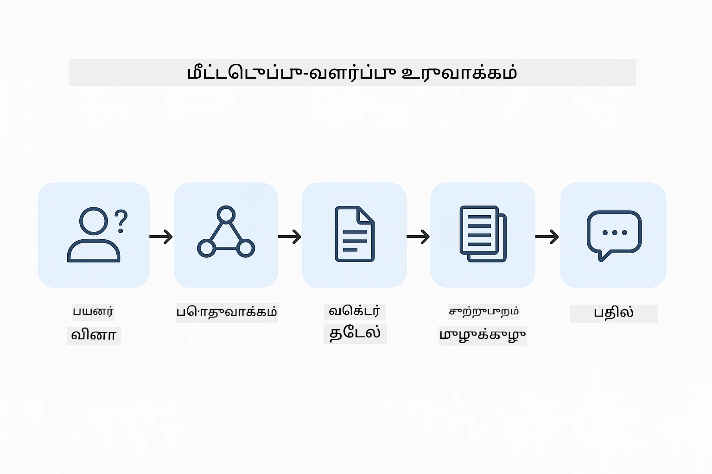
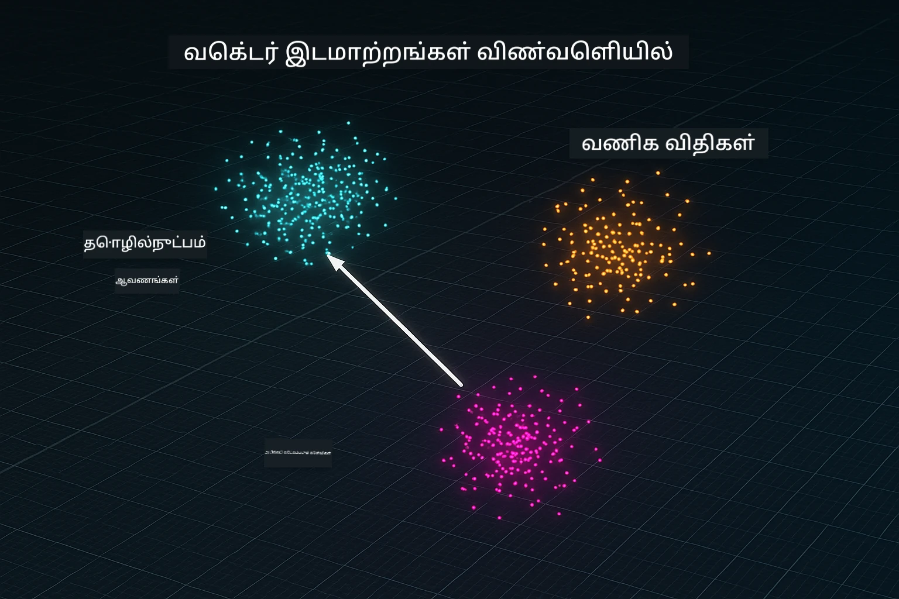
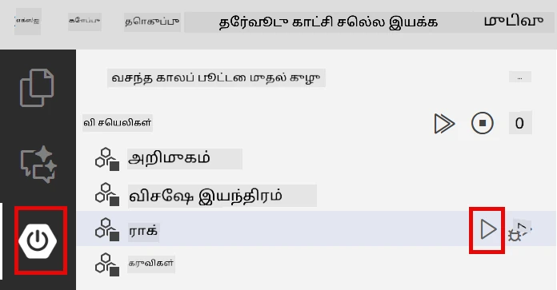
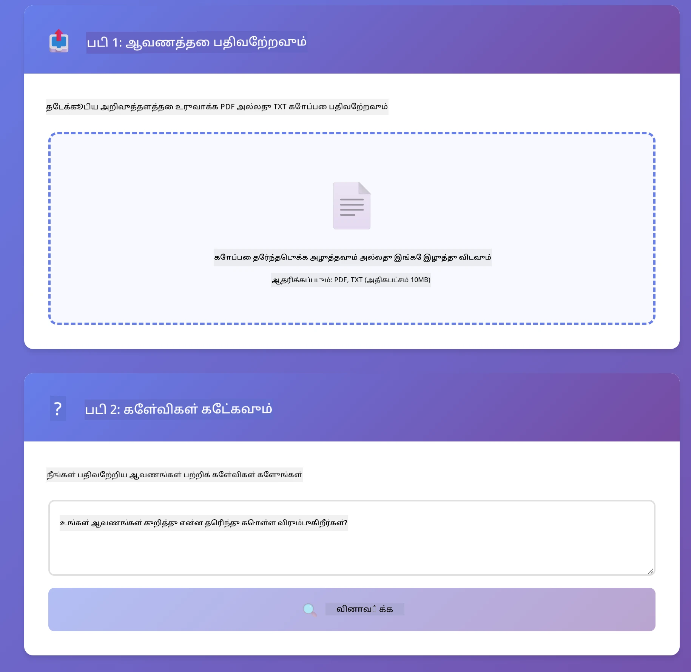
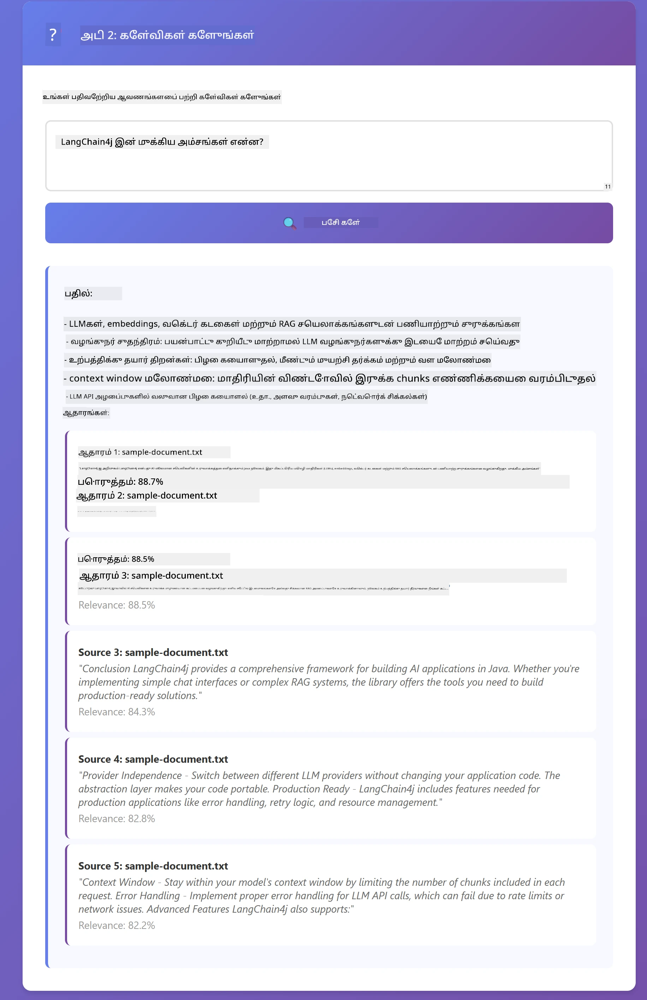

# Module 03: RAG (தேடல்-அதிகரிக்கப்பட்ட உருவாக்கம்)

## உள்ளடக்கம்

- [காணொளி நடைப்பயணம்](#காணொளி-நடைப்பயணம்)
- [நீங்கள் கற்றுக்கொள்ளவிருப்பது](#நீங்கள்-கற்கப்போவது)
- [முன்னிருப்புகள்](#முன்னிருப்புகள்)
- [RAG புரிதல்](#rag-புரிதல்)
  - [இந்த கற்கைநெறி எந்த RAG அணுகுமுறையை பயன்படுத்துகிறது?](#இந்த-கற்கைநெறி-எந்த-rag-அணுகுமுறையை-பயன்படுத்துகிறது)
- [இது எப்படி வேலை செய்கிறது](#இது-எப்படி-வேலை-செய்கிறது)
  - [ஆவணம் செயலாக்கம்](#ஆவணம்-செயலாக்கம்)
  - [எம்பெடிங்குகள் உருவாக்கல்](#எம்பெடிங்குகள்-உருவாக்கல்)
  - [அர்த்த நிறைந்த தேடல்](#அர்த்த-நிறைந்த-தேடல்)
  - [பதில் உருவாக்கல்](#பதில்-உருவாக்குதல்)
- [அனுப்புக செயலியை](#செயலியை-இயக்கவும்)
- [செயலியை பயன்படுத்துதல்](#செயலியைப்-பயன்படுத்துவது)
  - [ஆவணத்தை பதிவேற்றுக](#ஆவணத்தை-பதிவேற்றவும்)
  - [கேள்விகள் கேளுங்கள்](#கேள்விகள்-கேட்கவும்)
  - [மூல குறிப்புகளைச் சரிபார்க்கவும்](#மூல-குறிப்புகளை-சரிபார்க்கவும்)
  - [கேள்விகளுடன் சிறுகாண்க](#கேள்விகளுடன்-முன்னேறவும்)
- [முக்கிய கருத்துகள்](#முக்கியக்-கொள்கைகள்)
  - [துண்டு முறை](#துண்டாக்கல்-நெறிமுறை)
  - [இன்மையாக்க மதிப்பெண்கள்](#ஒத்துமை-மதிப்பெண்கள்)
  - [உட்புகுத்தல் நினைவகம்](#நினைவகத்தில்-சேமிப்பு)
  - [சூழல் ஜன்னல் மேலாண்மை](#சூழல்-ஜன்னல்-மேலாண்மை)
- [எப்போ பதிவு முக்கியம்](#rag-முக்கியமான-போது)
- [அடுத்த படிகள்](#அடுத்த-படிகள்)

## காணொளி நடைப்பயணம்

இந்த தொகுதியைத் தொடங்க எப்படி என விளக்கும் நேரலை அமர்வு பார்க்கவும்:

<a href="https://www.youtube.com/watch?v=_olq75ZH_eY"></a>

## நீங்கள் கற்கப்போவது

முந்தைய தொகுதிகளில், AI உடன் உரையாடல்கள் நடத்துவது மற்றும் உங்கள் கேள்வித்தாள் அமைப்பது எப்படி என்பதை கற்றுக்கொண்டீர்கள். ஆனால் ஒரு அடிப்படை குறைவு உள்ளது: மொழி மாதிரிகள் பயிற்சியின் போது கற்றுக்கொண்டதை மட்டுமே தெரிந்து கொள்வதற்கு முடியும். உங்கள் நிறுவன கொள்கைகள், உங்கள் திட்ட ஆவணங்கள் அல்லது பயிற்சி பெறாத எந்த தகவல்களையும் அவை கேள்வி பதில் அளிக்க முடியாது.

RAG (தேடல்-அதிகரிக்கப்பட்ட உருவாக்கம்) இந்த பிரச்சனைக்கு தீர்வு தருகிறது. மாதிரியை உங்கள் தகவல்களால் கற்றுத்தர முயற்சி செய்வதற்கு பதிலாக (அது விலை மிக உயர்ந்ததும் சாத்தியமற்றதும்), நீங்கள் அதற்கு உங்கள் ஆவணங்களைத் தேடுவதற்கான திறனை கொடுக்கின்றீர்கள். ஒருவரும் கேள்வி கேட்கும்போது, அமைப்பு பொருத்தமான தகவலை தேடி, அதை கேள்வித்தாளில் சேர்க்கிறது. மாதிரி பின்னர் அந்த பெற்ற சூழலில் அடிப்படையாக்கி பதில் அளிக்கிறது.

RAG ஐ மாதிரிக்கு ஒரு குறிப்ப-reference நூலகம் வழங்குவது போல் எண்ணுங்கள். நீங்கள் கேள்வி கேட்கும் போது, அமைப்பு:

1. **பயனர் கேள்வி** - நீங்கள் கேள்வி கேட்கிறீர்கள்
2. **எம்பெடிங்** - உங்கள் கேள்வியை ஒரு வெக்டர் ஆக மாற்றுகிறது
3. **வெக்டர் தேடல்** - ஒத்த ஆவண துண்டுகளை கண்டுபிடிக்கிறது
4. **சூழல் தொகுப்பு** - பொருத்தமான துண்டுகளை கேள்வித்தாளில் சேர்க்கிறது
5. **பதில்** - கட்டுரை வடிவம் (LLM) சூழலை அடிப்படையாகக் கொண்டு பதில் உருவாக்குகிறது

இதனால், மாதிரியின் பதில்கள் இதன் பயிற்சி அறிவியல் சார்ந்த பதில்களை பொருத்தமான உங்கள் தரவுகளுக்கு அடிப்படையாகக் கொண்டிருக்கும், உருவாக்கிய பதில்களை அல்ல.

## முன்னிருப்புகள்

- முடிக்கப்பட்டது [Module 01 - அறிமுகம்](../01-introduction/README.md) (Azure OpenAI வளங்கள் துவக்கப்பட்டுள்ளன, இதில் `text-embedding-3-small` எம்பெடிங் மாதிரியும் அடக்கம்)
- ரூட் கோப்பகம் `.env` கோப்புடன் Azure அங்கீகார விவரங்கள் உள்ளன (Module 01 இல் `azd up` மூலம் உருவாக்கப்பட்டது)

> **குறிப்பு:** Module 01 முடிக்கப்படாதிருந்தால், முதலில் அங்குள்ள நிறுவல் வழிமுறைகளை பின்பற்றவும். `azd up` கட்டளை இந்த தொகுதியில் பயன்படுத்தப்படும் GPT உரையாடல் மாதிரியையும் எம்பெடிங் மாதிரியையும் நிறுவுகிறது.

## RAG புரிதல்

கீழ்காணும் வரைபடம் முக்கிய கருத்தை விளக்குகிறது: மாதிரி தனது பயிற்சி தரவுக்கு மட்டுமே நம்பிக்கை வைக்காமல், RAG உங்கள் ஆவணங்களின் குறிப்பு நூலகத்தை வழங்கி, ஒவ்வொரு பதிலும் உருவாக்குவதற்கு முன் அவற்றைப் பரிசீலிக்கிறது.


*இந்த வரைபடம் வழக்கமான LLM (பயிற்சி தரவிலிருந்து ஊகிக்கிறது) மற்றும் RAG மேம்படுத்தப்பட்ட LLM (முதலில் உங்கள் ஆவணங்களை பரிசீலிக்கிறது) இடையேயான வேறுபாட்டை காட்டுகிறது.*

பயனர் கேள்வி நான்கு படிகளுள் கடந்து செல்லும் விதம் இங்கே. எம்பெடிங், வெக்டர் தேடல், சூழல் தொகுப்பு மற்றும் பதில் உருவாக்கல் போன்றவை — ஒவ்வொன்றும் முன்னடடியின் அடிப்படையில் உருவாக்கப்படுகின்றன:



*இந்த வரைபடம் RAG குழாயமைப்பை முழுமையாக காட்டுகிறது — பயனர் கேள்வி எம்பெடிங், வெக்டர் தேடல், சூழல் தொகுப்பு மற்றும் பதில் உருவாக்கல் வழியாக ஓடுகிறது.*

இந்த தொகுதியின் மீதமுள்ள பகுதி ஒவ்வொரு நிலையையும் விரிவாக செல்கிறார், நீங்கள் இயக்கு மற்றும் மாற்றக்கூடிய குறியீடு உடன்.

### இந்த கற்கைநெறி எந்த RAG அணுகுமுறையை பயன்படுத்துகிறது?

LangChain4j மூன்று விதங்களில் RAG செயல்படுத்த கூறுகிறது, ஒவ்வொன்றும் வேறுபோன்ற அடிப்படைகூறுகளுடன். கீழ்காணும் வரைபடம் அவற்றை ஒப்பிடுகிறது:


*இந்த வரைபடம் மூன்று LangChain4j RAG அணுகுமுறைகள் — எளிய, நாட்டிவ் மற்றும் மேம்பட்ட — அவற்றின் முக்கிய கூறுகளை மற்றும் எப்போது பயன்படுத்துவது என்பதையும் காட்டுகிறது.*

| அணுகுமுறை | அது என்ன செய்கிறது | வெகுஜன திருப்பம் |
|---|---|---|
| **எளிய RAG** | அனைத்தையும் தானாகவே `AiServices` மற்றும் `ContentRetriever` வழியாக இணைக்கிறது. நீங்கள் ஒரு இடைமுகத்தை குறிப்பிட்டு, ஒரு திருப்தியை இணைக்கிறீர்கள், LangChain4j பின்னணியில் எம்பெடிங், தேடல் மற்றும் கேள்வித் தொகுப்பை கையாள்கிறது. | குறைந்த குறியீடு, ஆனால் ஒவ்வொரு படியும் என்ன நடக்கிறது என்பது தெரியாது. |
| **நாட்டிவ் RAG** | நீங்கள் எம்பெடிங் மாதிரியை அழைக்கிறீர்கள், சேமிப்பகத்தில் தேடல் செய்கிறீர்கள், கேள்வியை கட்டமைக்கிறீர்கள், பதிலை உங்களால் தெளிவாக ஒரு படியாக உருவாக்குகிறீர்கள். | அதிக குறியீடு, ஆனால் ஒவ்வொரு படியும் தெளிவாக மற்றும் மாற்றக்கூடியதாக இருக்கும். |
| **மேம்பட்ட RAG** | `RetrievalAugmentor` கட்டமைப்பைப் பயன்படுத்தி, கேள்வி மாற்றிகள், வழிசெலுத்திகள், மறுஅதிகாரிகள் மற்றும் உள்ளடக்கம் ஊட்டிகள் போன்ற காணொளிகள் பயன்படுத்தி தொழிற்பயிற்சி குழாய் அமைப்புகளுக்கு. | மிக அதிக சிக்கனம் மற்றும் அளவு வழுவிலக்கு உள்ளது. |

**இந்த கற்கைநெறி நாட்டிவ் அணுகுமுறையை பயன்படுத்துகிறது.** RAG குழாய் ஒவ்வொரு நிலையும் — கேள்வி எம்பெடிங், வெக்டர் சேமிப்பகத்தில் தேடல், சூழலை சீர்செய்தல் மற்றும் பதில் உருவாக்கல் — [`RagService.java`](../../../03-rag/src/main/java/com/example/langchain4j/rag/service/RagService.java) இல் தெளிவாக எழுதப்பட்டிருக்கிறது. இது意図மாக: கற்றலில் முக்கியம் ஒவ்வொரு படியும் தெளிவாக கண்டு புரிந்து கொள்ள வேண்டும் என்பது குறைந்த குறியீடுமைக்கும் மேல். நீங்கள் இவற்றின் ஒத்துழைப்பை அறிந்த பிறகு, எளிய RAG தயாரிப்பு மாதிரிகள் அல்லது மேம்பட்ட RAG தொழிற்பயிற்சி அமைப்புகளுக்கு மாறலாம்.

> **💡 எளிய RAG பற்றி ஆர்வமா?** LangChain4j *எளிய RAG* அணுகுமுறையும் வழங்குகிறது, இங்கு `AiServices` மற்றும் `ContentRetriever` தானாகவே எம்பெடிங், தேடல் மற்றும் கேள்வி தொகுப்பு செய்கின்றன. இந்த தொகுதி அதிக தெளிவான பாதையை எடுத்துள்ளது — குழாய் திறந்து ஒழுங்குபடுத்தலுக்கு ஒவ்வொரு படியும் உங்களால் பார்க்கவும் கட்டுப்படுத்தவும்.

கீழ்காணும் வரைபடம் எளிய RAG குழாயை காட்டுகிறது. `AiServices` மற்றும் `EmbeddingStoreContentRetriever` எல்லா சிக்கல்களையும் மறைக்கின்றன — ஆவணத்தை ஏற்றவும், ஒரு திருப்தியைச் சேர்க்கவும், பதில்கள் பெறலாம். இந்த தொகுதியின் நாட்டிவ் அணுகுமுறை அந்த மறைந்த கட்டைகளை திறக்கிறது:


*இந்த வரைபடம் எளிய RAG குழாயை காட்டுகிறது. நாட்டிவ் அணுகுமுறையை ஒப்பிடுக: எளிய RAG `AiServices` மற்றும் `ContentRetriever` அடித்து எம்பெடிங், தேடல் மற்றும் கேள்வி தொகுப்பை மறைக்கிறது — நீங்கள் ஆவணத்தை ஏற்றியும், திருப்தியைச் சேர்க்கவும், பதிலை பெறலாம். நாட்டிவ் அணுகுமுறை அந்த குழாயை திறந்து ஒவ்வொரு படியையும் (எம்பெட், தேடு, சூழலை தொகுக்க, உருவாக்க) நீங்கள் அழைக்கிறீர்கள், முழு பார்வையும் கட்டுப்பாட்டையும் வழங்குகிறது.*

## இது எப்படி வேலை செய்கிறது

இந்த தொகுதியில் RAG குழாய் ஒவ்வொரு முறையும் பயனர் கேள்வி கேட்கும் போது வரிசையாக இயக்கப்படும் நான்கு படிகளாக பிரிக்கப்படுகிறது. முதலில், பதிவேற்றிய ஆவணம் **பகுதிகள்** ஆக **வெளியிடப்படுகிறது** மற்றும் சுலபமாக கையாளும் துண்டுகளாக பிரிக்கப்படுகிறது. அந்த துண்டுகள் பிறகு **வெக்டர் எம்பெடிங்குகளாக** மாற்றப்பட்டு, கணித ரீதியாக ஒப்பிடும் படி சேமிக்கப்படுகின்றன. ஒரு கேள்வி வந்தால், அமைப்பு பொருத்தமான துண்டுகளை கண்டுபிடிக்க ஒரு **அர்த்த நிறைந்த தேடல்** நடத்துகிறது மற்றும் இறுதியில் அந்த துண்டுகளை LLMக்கு **பதில் உருவாக்க** சூழலாக வழங்குகிறது. கீழே ஒவ்வொரு நிலையும் குறியீடு மற்றும் வரைபடங்களுடன் வழிநடத்தப்படுகின்றன. முதல் படிக்கு பார்ப்போம்.

### ஆவணம் செயலாக்கம்

[DocumentService.java](../../../03-rag/src/main/java/com/example/langchain4j/rag/service/DocumentService.java)

நீங்கள் ஆவணத்தை பதிவேற்றும் போது, அமைப்பு அதை (PDF அல்லது உரை) பிரிக்கிறது, கோப்பு பெயர் போன்ற மெட்டாடேட்டாவை இணைக்கிறது, பிறகு அதை துண்டுகளுக்கு உடைக்கிறது — மாதிரியின் சூழல் ஜன்னலுக்கு ஏற்ற சிறிய துண்டுகள். அவை எல்லாமே குறைந்த அளவு ஒவ்வொன்றுக்கு ஓவர்லாப் இருக்கின்றன, அதனால் எல்லா சூழலும் எல்லைகளில் கெடாது.

```java
// பதிவேற்றிய கோப்பை பார்ஸ் செய்து LangChain4j ஆவணமாக об.wrap செய்யவும்
Document document = Document.from(content, metadata);

// 30-டோக்கன் ஒட்டுமொத்தத்தை உட்பட 300-டோக்கன் துண்டுகளாக பிரிக்கவும்
DocumentSplitter splitter = DocumentSplitters
    .recursive(300, 30);

List<TextSegment> segments = splitter.split(document);
```

கீழ்காணும் வரைபடம் இதைப் பார்வையாளர்களுக்காக காட்டுகிறது. ஒவ்வொரு துண்டும் அதன் அம்பிக்கட்டத்துடன் சில டோக்கன்களை பகிர்கிறது — 30-டோக்கன் ஓவர்லாப் எந்த முக்கிய சூழலும் இடைவெளியில் இருப்பதை தவிர்க்கிறது:


*இந்த வரைபடம் ஆவணத்தை 300-டோக்கன் துண்டுக்களாக பிரித்து, 30-டோக்கன் தளர்வுடன், துண்டுகளின் எல்லைகளில் சூழலை பாதுகாக்கிறது.*

> **🤖 [GitHub Copilot](https://github.com/features/copilot) உரையாடலுடன் முயற்சிக்கவும்:** [`DocumentService.java`](../../../03-rag/src/main/java/com/example/langchain4j/rag/service/DocumentService.java) திறந்து கேளுங்கள்:
> - "LangChain4j ஆவணங்களை துண்டுகளாக்கும் முறையும் ஓவர்லாப் முக்கியத்துவமும் என்ன?"
> - "விதிவகை ஆவணங்களுக்கு சிறந்த துண்டு அளவு என்ன மற்றும் ஏன்?"
> - "பல மொழிகளிலும் சிறப்பு வடிவமைப்பும் உள்ள ஆவணங்களை எப்படி கையாள்வது?"

### எம்பெடிங்குகள் உருவாக்கல்

[LangChainRagConfig.java](../../../03-rag/src/main/java/com/example/langchain4j/rag/config/LangChainRagConfig.java)

ஒவ்வொரு துண்டும் ஒரு எண் வடிவமான பிரதிநிதித்துவமாக மாற்றப்படுகிறது, இதை எம்பெடிங் कहते हैं — மூலம் உரையின் பொருள் எண்களில் மாறும் மலிவு சிக்கலி. எம்பெடிங் மாதிரி உரையாடல் மாதிரி போல் "அறிவு வாய்ந்த" இல்லை; அது கட்டளைகள், துணையற்ற கருத்துக்கள் அல்லது கேள்விக்கு பதில் தருவதில்லை. ஆனால் அது உரையை கணித அமைப்புக்கு மாற்றுகிறது, நல்ல பொருள் சார்ந்த உரைகள் ஒன்றுக்கொன்று அருகில் இருக்கும் — "கார்" என்ற சொல்லுகோ "மோட்டார்" என்பதற்கு அருகிலிருக்கிறது, "திருப்பி கொடுக்கும் கொள்கை" என்ற சொல்லும் "பணம் திருப்பி பெறுதல்" என்பதற்கு அருகில் இருக்கும். உரையாடல் மாதிரி ஒருவரைப் போல பேசக்கூடியவர், எம்பெடிங் மாதிரி ஆம் ஒரு மிகச் சிறந்த சேமிப்பு முறை.

கீழ்காணும் வரைபடம் இந்த கருத்தை காண்பிக்கிறது — உரை உள்ளே செல்கிறது, எண்வெக்டர்கள் வெளியே வருகிறார்கள், ஒத்த பொருள்கள் அருகே இருக்கும்:


*இந்த வரைபடம் எம்பெடிங் மாதிரி உரையை எண வெக்டர்களாக்கும் படத்தை காட்டுகிறது, "கார்" மற்றும் "மோட்டார்" போன்ற ஒத்த பொருள்களை அருகில் வைக்கிறது.*

```java
@Bean
public EmbeddingModel embeddingModel() {
    return OpenAiOfficialEmbeddingModel.builder()
        .baseUrl(azureOpenAiEndpoint)
        .apiKey(azureOpenAiKey)
        .modelName(azureEmbeddingDeploymentName)
        .build();
}

EmbeddingStore<TextSegment> embeddingStore = 
    new InMemoryEmbeddingStore<>();
```

கடற்படம் கீழே ஒரு RAG குழாயில் இரு தனி வாய்ப்புகளையும் LangChain4j வகைகளை காட்டுகிறது. **உள்ளீடு பாசம்** (பதிவேற்றும் போது ஒருமுறை இயங்கும்) ஆவணத்தை பிரித்து துண்டுகளை எம்பெட் செய்து `.addAll()` மூலம் சேமிக்கிறது. **கேள்வி பாசம்** (ஒவ்வொரு முறையும் பயனர் கேள்வி கேட்கும் போது) கேள்வியை எம்பெட் செய்து `.search()` மூலம் தேடல் செய்து, பொருந்திய சூழலை உரையாடல் மாதிரிக்கு அனுப்புகிறது. இரண்டும் பொதுவான `EmbeddingStore<TextSegment>` இடைமுகத்தில் கூடியுள்ளன:


*இந்த வரைபடம் RAG குழாயின் இரண்டு வாய்ப்புகளை காண்பிக்கிறது — உள்ளீடு மற்றும் கேள்வி — அவைகள் பொதுவான EmbeddingStore வழியாக இணைக்கப்படுகின்றன.*

எம்பெடிங்குகள் சேமிக்கப்பட்ட பிறகு, சம்பந்தப்பட்ட உள்ளடக்கம் வெக்டர் இடத்தில் இயல்பாக கூட்டாகத் தொகுப்பாகிறது. கீழ்காணும் காட்சி சம்பந்தப்பட்ட ஆவணங்கள் பணிவீச்சு வட்டாரத்தில் அருகிலிருந்து இருப்பதை காட்டுகிறது:



*இந்த காட்சி 3D வெக்டர் இடத்தில் தொடர்புடைய ஆவணங்களின் கூட்டமைப்பை காண்பிக்கிறது, தொழில்நுட்ப ஆவணங்கள், வணிக விதிகள் மற்றும்FAQகள் தனித்துப் பகுதிகளாக இணைக்கப்பட்டுள்ளன.*

பயனர் தேடும் போது, அமைப்பு நான்கு படிகள்: ஆவணங்களை ஒருமுறை எம்பெட் செய்கிறது, ஒவ்வொரு தேடலுக்கும் கேள்வியை எம்பெட் செய்கிறது, கேள்வி வெக்டரை சேமிக்கப்பட்ட வெக்டர்களுடன் கோசைன் சமானத்துவம் மூலம் ஒப்பிடுகிறது, மற்றும் மிகச் சிறந்த K துண்டுகளை தருகிறது. கீழ்காணும் வரைபடம் ஒவ்வொரு படியும் மற்றும் LangChain4j வகைகளையும் காட்டுகிறது:


*இந்த வரைபடம் நான்கு படி எம்பெடிங் தேடல் செயல்முறையை காண்பிக்கிறது: ஆவணங்களை எம்பெட் செய்தல், கேள்வியை எம்பெட்டு, கோசைன் சமானத்துவத்துடன் வெக்டர்களை ஒப்பிடுதல், சிறந்த K முடிவுகளை வழங்குதல்.*

### அர்த்த நிறைந்த தேடல்

[RagService.java](../../../03-rag/src/main/java/com/example/langchain4j/rag/service/RagService.java)

நீங்கள் கேள்வி கேட்டால், உங்கள் கேள்வியும் எம்பெடிங் ஆகிறது. அமைப்பு உங்கள் கேள்வியின் எம்பெடிங்கை அனைத்து ஆவண துண்டுகளுடைய எம்பெடிங்குகளுடன் ஒப்பிடுகிறது. மிக ஒத்த பொருள் கொண்ட துண்டுகளை கண்டுபிடிக்கிறது - பொருளின் பூர்வமாக சில வார்த்தைகள் இல்லை என்றாலும்.

```java
Embedding queryEmbedding = embeddingModel.embed(question).content();

EmbeddingSearchRequest searchRequest = EmbeddingSearchRequest.builder()
    .queryEmbedding(queryEmbedding)
    .maxResults(5)
    .minScore(0.5)
    .build();

EmbeddingSearchResult<TextSegment> searchResult = embeddingStore.search(searchRequest);
List<EmbeddingMatch<TextSegment>> matches = searchResult.matches();

for (EmbeddingMatch<TextSegment> match : matches) {
    String relevantText = match.embedded().text();
    double score = match.score();
}
```

கீழ்காணும் வரைபடம் அர்த்த நிறைந்த தேடலை பாரம்பரிய முக்கிய சொல் தேடலுடன் ஒப்பிடுகிறது. "வாகனம்" என்ற முக்கியச் சொல் தேடல் "கார்கள் மற்றும் லாரிகள்" பற்றிய துண்டை தவறவிடும், ஆனால் அர்த்த நிறைந்த தேடல் அவை அதே பொருள் என்பதைக் கண்டு அதை அதிக மதிப்பெண் கொண்டு தருகிறது:


*இந்த வரைபடம் முக்கியச் சொல் தேடல் மற்றும் அர்த்த நிறைந்த தேடலை ஒப்பிட்டு காட்டுகிறது, இதனால் அர்த்த நிறைந்த தேடல் பொருளுற்ற பெயர்களுடன் கூட உள்ளடக்கத்தை மீட்டெடுக்கிறது.*

உதயத்தில், இணைமையீடு கோசைன் சமானத்துவத்தை பயன்படுத்தி அளவிடப்படுகிறது — இது "இரு அம்புகள் ஒரே திசையில் இருக்கிறதா?" என்பதை கேட்கிறது. இரண்டு துண்டுகள் வெவ்வேறு வார்த்தைகளைப் பயன்படுத்தினாலும், அவை ஒரே பொருள் கொண்டால் அவற்றின் வெக்டர்கள் ஒரே திசையில் காட்டு கருதி மதிப்பெண் 1.0க்கு அருகில் இருக்கும்:


*இந்த வரைபடம் கோசைன் ஒத்துமையை உருவாக்கும் வெக்டார்கள் இடையேயான கோணமாக விளக்குகிறது — மேலும் ஒத்துப்போகும் வெக்டார்கள் 1.0க்கு நெருக்கமான மதிப்பை பெறுகின்றன, இது அதிகமான அர்த்தம் ஒத்துமையை குறிக்கிறது.*

> **🤖 [GitHub Copilot](https://github.com/features/copilot) Chat கொண்டு முயற்சிக்கவும்:** [`RagService.java`](../../../03-rag/src/main/java/com/example/langchain4j/rag/service/RagService.java) கோப்பை திறக்கவும் மற்றும் கேளுங்கள்:
> - "எம்பெட்டிங் களை கொண்டு ஒத்துமை தேடல் எப்படி செயல்படுகிறது மற்றும் மதிப்பெண் என்னவால் நிர்ணயிக்கப்படுகிறது?"
> - "எந்த ஒத்துமை எல்லையை பயன்படுத்த வேண்டும் மற்றும் அது முடிவுகளை எவ்வாறு பாதிக்கிறது?"
> - "பொருத்தமான ஆவணங்கள் கிடைக்காத நிலைகளை எப்படி கையாள வேண்டும்?"

### பதில் உருவாக்குதல்

[RagService.java](../../../03-rag/src/main/java/com/example/langchain4j/rag/service/RagService.java)

மிக முக்கியமான துண்டுகள் உள்ளடக்கப்பட்ட, தெளிவான הוראות, மீட்டெடுத்துள்ள சூழல் மற்றும் பயனரின் கேள்வியுடன் கூடிய வரையறுக்கப்பட்ட முன்மொழிவாக ஒன்று சேர்க்கப்படுகிறது. மாடல் அந்த குறிப்பிட்ட துண்டுகளைப் படித்து அந்த தகவலின் அடிப்படையில் பதில் அளிக்கிறது — அது முன் வைக்கப்பட்டவற்றை மட்டுமே பயன்படுத்த முடியும், இதனால் தவறான கற்பனை தவிர்க்கப்படுகிறது.

```java
String context = matches.stream()
    .map(match -> match.embedded().text())
    .collect(Collectors.joining("\n\n"));

String prompt = String.format("""
    Answer the question based on the following context.
    If the answer cannot be found in the context, say so.

    Context:
    %s

    Question: %s

    Answer:""", context, request.question());

String answer = chatModel.chat(prompt);
```

கீழே உள்ள வரைபடம் இந்த ஒன்றிணைப்பை செயல்பாட்டில் காண்பிக்கின்றது — தேடல் படியிலிருந்து அதிக மதிப்பெண் பெற்ற துண்டுகள் முன்மொழிவு மாதிரியில் சேர்க்கப்படுகின்றன, மற்றும் `OpenAiOfficialChatModel` தரமான பதிலை உருவாக்குகிறது:


*இந்த வரைபடம் அதிக மதிப்பெண் பெற்ற துண்டுகள் அமைப்புக்குரிய முன்மொழிவாக எப்படி சேர்க்கப்படுகின்றன என்று காட்டுகிறது, இதனால் உங்கள் தரவுகளிலிருந்து மாடல் நிலையான பதிலை உருவாக்க முடிகிறது.*

## செயலியை இயக்கவும்

**பரிணாமம் சரிபார்க்கவும்:**

.rnv கோப்பு வேர் கோப்பகத்தில் Azure அங்கீகார தகவல்களுடன் (Module 01ல் உருவாக்கப்பட்டது) இருக்க வேண்டும். இந்த இயக்கத்தைக் கீழ்க்காணும் முறை மொழிப் பகுதியில் இருந்து (`03-rag/`) செய்க:

**Bash:**
```bash
cat ../.env  # AZURE_OPENAI_ENDPOINT, API_KEY, DEPLOYMENT ஆகியவை காணப்பட வேண்டும்
```

**PowerShell:**
```powershell
Get-Content ..\.env  # AZURE_OPENAI_ENDPOINT, API_KEY, DEPLOYMENT காண்பிக்க வேண்டும்
```

**செயலியை துவங்கவும்:**

> **குறிப்பு:** நீங்கள் ஏற்கனவே ரூட் கோப்பகத்தில் இருந்து `./start-all.sh` மூலம் அனைத்து செயலிகளையும் துவக்கியிருந்தால் (Module 01ல் விவரிக்கப்பட்டபடி), இந்த முறை 8081 துறைமுகத்தில் இயங்குகிறது. கீழுள்ள துவக்கக் கட்டளைகளை தவிர்த்து நேரடியாக http://localhost:8081 செல்லலாம்.

**விருப்பம் 1: Spring Boot Dashboard பயன்படுத்துதல் (VS Code பயனர்களுக்கு பரிந்துரை செய்யப்படுகிறது)**

உள்நுழைவுச் சூழல் Spring Boot Dashboard நீட்சியை கொண்டுள்ளது, இது அனைத்து Spring Boot செயலிகளை மேலாண்மை செய்ய視ual இடைமுகத்தை வழங்குகிறது. VS Code இடது பக்கத்தில் உள்ள Activity Bar இல் Spring Boot ஐகானை காணலாம்.

Spring Boot Dashboard-இல் நீங்கள்:
- வேலைநிலையிலுள்ள அனைத்து Spring Boot செயலிகளையும் பார்க்க முடியும்
- ஒரு கிளிக்கில் செயலிகளை துவக்க/நிறுத்த முடியும்
- செயலியின் பதிவு (logs) ஐ நேரலையில் பார்க்க முடியும்
- செயலியின் நிலையை கண்காணிக்க முடியும்

"rag"க்குப் பக்கத்தில் உள்ள play பொத்தானை கிளிக் செய்து இந்த முறைத் தொடங்கவும், அல்லது ஐக்கியமாக அனைத்து முறைங்களையும் துவங்கவும்.



*இந்த ஸ்கிரீன்ஷாட் VS Codeஇல் Spring Boot Dashboard ஐ காண்பிக்கிறது, இங்கு நீங்கள் செயலிகளை துவங்கி, நிறுத்தி, கண்காணிக்க முடியும்.*

**விருப்பம் 2: shell ஸ்கிரிப்ட்கள் பயன்படுத்துதல்**

முழு வலை செயலிகளை துவக்கம் செய்ய (முறை 01-04):

**Bash:**
```bash
cd ..  # ரூட் கோப்புறை இலிருந்து
./start-all.sh
```

**PowerShell:**
```powershell
cd ..  # ரூட் அடைவு இடத்தில் இருந்து
.\start-all.ps1
```

அல்லது இந்த மட்டுமே முறைத் துவங்கவும்:

**Bash:**
```bash
cd 03-rag
./start.sh
```

**PowerShell:**
```powershell
cd 03-rag
.\start.ps1
```

இரு ஸ்கிரிப்ட்களும் தானாகவே ரூட் `.env` கோப்பிலிருந்து சூழல் மாறிகள் ஏற்றுகிறது மற்றும் JARகளை ஏற்கனவே இல்லையெனில் உருவாக்கும்.

> **குறிப்பு:** துவக்கத்துக்கு முன் அனைத்து முறைங்களையும் கையெழுத்து செய்து உருவாக்க விரும்பினால்:
>
> **Bash:**
> ```bash
> cd ..  # Go to root directory
> mvn clean package -DskipTests
> ```
>
> **PowerShell:**
> ```powershell
> cd ..  # Go to root directory
> mvn clean package -DskipTests
> ```

உங்கள் பிரவுஸரில் http://localhost:8081 ஐத் திறக்கவும்.

**நிறுத்த:**

**Bash:**
```bash
./stop.sh  # இந்த மொடியூல் மட்டும்
# அல்லது
cd .. && ./stop-all.sh  # அனைத்து மொடியூல்கள்
```

**PowerShell:**
```powershell
.\stop.ps1  # இந்த தொகுதி மட்டும்
# அல்லது
cd ..; .\stop-all.ps1  # அனைத்து தொகுதிகள்
```

## செயலியைப் பயன்படுத்துவது

இந்த செயலி ஆவணங்களை பதிவேற்றுவதற்கும் கேள்விகள் கேட்கவும் வலை முகப்பை வழங்குகிறது.

<a href="images/rag-homepage.png"></a>

*இந்த ஸ்கிரீன்ஷாட் RAG செயலி இடைமுகத்தை காட்டுகிறது, இதில் நீங்கள் ஆவணங்களை பதிவேற்றி கேள்விகள் கேட்க முடியும்.*

### ஆவணத்தை பதிவேற்றவும்

ஆரம்பிக்க ஒரு ஆவணத்தை பதிவேற்றுதல் - சோதனைக்கான TXT கோப்புகள் சிறந்தவை. இங்கு `sample-document.txt` என்ற கோப்பு உள்ளது, இதில் LangChain4j அம்சங்கள், RAG செயல்பாடு மற்றும் சிறந்த நடைமுறைகள் பற்றிய தகவல்கள் உள்ளன - இது அமைப்பை சோதிக்க சிறந்தது.

அமைப்பு உங்கள் ஆவணத்தை செயலாக்கி, துண்டுகளாக பிரித்து ஒவ்வொரு துண்டுக்கும் படைப்புகளை உருவாக்கும். இதை நீங்கள் பதிவேற்றும்போது தானாக நடக்கும்.

### கேள்விகள் கேட்கவும்

இந்தப் பிறகு ஆவண உள்ளடக்கத்தைப் பொருத்த வகையிலான குறிப்பிட்ட கேள்விகள் கேளுங்கள். ஆவணத்தில் தெளிவாக குறிப்பிடப்பட்ட நிலைகளை மையமாகக் கொண்டு ஒரு உண்மை சார்ந்த கேள்வி முயற்சிக்கவும். அமைப்பு பொருத்தமான துண்டுகளைத் தேடி, அவற்றை முன்மொழிவில் சேர்க்கிறது மற்றும் பதிலை உருவாக்குகிறது.

### மூல குறிப்புகளை சரிபார்க்கவும்

ஒவ்வொரு பதிலிலும் ஒத்துமை மதிப்பெண்களுடன் மூல குறிப்புகள் அடங்கும் என்பதை கவனியுங்கள். இவை 0 முதல் 1 வரை மதிப்பெண்கள் உங்கள் கேள்விக்கு எவ்வளவு பொருத்தமானவையாக இருந்தன என்பதைக் காட்டுகின்றன. அதிக மதிப்பெண் என்பது சிறந்த பொருத்தம் என்பதை குறிக்கிறது. இது உங்கள் பதிலை மூலப் பொருளை தொடர்பாக சரிபார்க்க உதவுகிறது.

<a href="images/rag-query-results.png"></a>

*இந்த ஸ்கிரீன்ஷாட் கேள்வி முடிவுகளை, உருவாக்கப்பட்ட பதிலை, மூல குறிப்புகளை மற்றும் ஒவ்வொரு மீட்டெடுக்கப்பட்ட துண்டுக்கான பொருத்த மதிப்புகளை காட்டுகிறது.*

### கேள்விகளுடன் முன்னேறவும்

வேறு வகை கேள்விகளை முயற்சிக்கவும்:
- குறிப்பிட்ட தகவல்கள்: "முதன்மை பொருள் என்ன?"
- ஒப்பீடுகள்: "X மற்றும் Y இல் வேறுபாடு என்ன?"
- சுருக்கங்கள்: "Z பற்றிய முக்கிய புள்ளிகளை சுருக்கவும்"

உங்கள் கேள்வி ஆவண உள்ளடக்கத்துடன் எவ்வாறு பொருந்துதலைப் பொறுத்து பொருத்த மதிப்பெண்கள் எப்படி மாறுகின்றன என்பதை கவனியுங்கள்.

## முக்கியக் கொள்கைகள்

### துண்டாக்கல் நெறிமுறை

ஆவணங்கள் 300-டோக்கன் துண்டுகளாகப் பிரிக்கப்படுகின்றன, 30 டோக்கன் ஒட்டுமொத்தம் இடைப்பட்டுள்ளன. இது ஒவ்வொரு துண்டுக்கும் பொருத்தமான சூழலை அளிக்க உதவுகிறது, மேலும் பல துண்டுகளை ஒரே முன்மொழிவில் சேர்ப்பதற்கு அழுத்தமாக இருக்காது.

### ஒத்துமை மதிப்பெண்கள்

ஒவ்வொரு மீட்டெடுக்கப்பட்ட துண்டும் 0 முதல் 1 வரை மதிப்பெண் கொண்டுள்ளது, இது பயனரின் கேள்விக்கு எவ்வளவு நெருக்கமாக பொருந்துகிறது என்று காட்டுகிறது. கீழே உள்ள வரைபடம் மதிப்பெண் வரம்புகளை காட்டு, அமைப்பு அவற்றை எவ்வாறு முடிவுகளை வடிகட்டி பயன்படுத்துது என்பதைக் காட்டுகிறது:


*இந்த வரைபடம் 0 முதல் 1 வரை மதிப்பெண் வரம்புகளை காட்டுகிறது, 0.5 குறைந்தபட்ச எல்லையை வைத்து பொருத்தமற்ற துண்டுகளை வடிகட்டுகிறது.*

மதிப்பெண்கள் 0 முதல் 1 வரை:
- 0.7-1.0: மிகவும் பொருத்தமானது, சரியான பொருத்தம்
- 0.5-0.7: பொருத்தமானது, நல்ல சூழல்
- 0.5க்குட்பட்டு: வடிகட்டப்பட்டது, மிகவும் வேறுபட்டது

அமைப்பு தரத்துக்கு உறுதி செய்ய குறைந்தபட்ச எல்லையை மீண்டும் மேல் உள்ள துண்டுகளை மட்டுமே மீட்டெடுக்கிறது.

எம்பெட்டிங்ஸ்கள் கருத்துக்கள் தெளிவாக பொருத்தும்போது சிறப்பாக செயல்படுகின்றன, ஆனால் அவற்றுக்கு முடட்டும் இடங்கள் உள்ளன. கீழ்ப் பருகப்படும் வரைபடம் பரவலாக உள்ள பழுதுகளை காட்டுகிறது — மிகப்பெரிய துண்டுகள் கலப்பற்ற வெக்டார்கள் உருவாக்குகின்றன, மிகச்சிறிய துண்டுகள் சூழல் இல்லாமை, குழப்பமுள்ள சொற்கள் பல வட்டாரங்களுக்கு காண்பிக்கும், மற்றும் சரியான பொருத்தத் தேடல்கள் (IDs, பகுதிநிலை எண்கள்) எம்பெட்டிங்ஸுடன் வேலை செய்யாது:


*இந்த வரைபடம் பொதுவான எம்பெட்டிங் தோல்வித் தீமைகளை காட்டுகிறது: மிகப்பெரிய துண்டுகள், மிகச்சிறிய துண்டுகள், பல குழுக்களை குறிக்கும் குழப்பமுள்ள சொற்கள், மற்றும் சரியான பொருத்தத் தேடல்கள் (IDs போன்றவை).*

### நினைவகத்தில் சேமிப்பு

இந்த முறை எளிமைக்காக நினைவக சேமிப்பைப் பயன்படுத்துகிறது. நீங்கள் செயலியை மீண்டும் துவங்கும்போது, பதிவேற்றிய ஆவணங்கள் நீக்கப்படுகின்றன. தயாரிப்புத் தயாரிப்புகள் Qdrant அல்லது Azure AI Search போன்ற நிரந்தர வெக்டார் தரவுத்தளங்களைப் பயன்படுத்துகின்றன.

### சூழல் ஜன்னல் மேலாண்மை

ஒவ்வொரு மாடலுக்கும் அதிகபட்ச சூழல் ஜன்னல் உள்ளது. பெரிய ஆவணத்தில் உள்ள ஒவ்வொரு துண்டையும் சேர்க்க முடியாது. அமைப்பு அதிக படியான பொருத்தம் கொண்ட உயர்நிலை N துண்டுகளை (இயல்பானம் 5) பெறுகிறது, இது அதிக நுண்ணறிவான பதில்களை அளிக்க போதுமான சூழலை வழங்கும்.

## RAG முக்கியமான போது

RAG எப்போதும் சரியான அணுகுமுறை அல்ல. கீழே உள்ள தீர்மான வழிகாட்டி RAG எப்போது மதிப்பை கூட்டுகிறது என்பதையும் எப்போது எளிதான அணுகுமுறைகள் — நேரடியாக உள்ளடக்கத்தை முன்மொழிவில் சேர்ப்பது அல்லது மாடலின் உள்ளமைவாகக் கொண்டுள்ள அறிவைப் பயன்படுத்துவது — போதுமானவை என்பதையும் உதவுகிறது:


*இந்த வரைபடம் RAG மதிப்பையும் எளிமையான அணுகுமுறைகள் போதுமான நிலைகளையும் தீர்மானிக்க உதவும் வழிகாட்டி காட்டுகிறது.*

## அடுத்த படிகள்

**அடுத்த முறை:** [04-tools - கருவிகளுடன் AI முகவர்கள்](../04-tools/README.md)

---

**Navigation:** [← முந்தையது: Module 02 - Prompt Engineering](../02-prompt-engineering/README.md) | [முதன்மைக்கு திரும்பவும்](../README.md) | [அடுத்தது: Module 04 - கருவிகள் →](../04-tools/README.md)

---

<!-- CO-OP TRANSLATOR DISCLAIMER START -->
**மறுப்பு**:
இந்த ஆவணம் AI மொழிபெயர்ப்பு சேவை [Co-op Translator](https://github.com/Azure/co-op-translator) பயன்படுத்தி மொழிபெயர்க்கப்பட்டுள்ளது. நாங்கள் துல்லியத்திற்காக முயற்சி செய்துள்ளோம், ஆனால் தானாக செய்யப்படும் மொழிபெயர்ப்புகளில் பிழைகள் அல்லது தவறுகள் இருக்கலாம் என்பதை கவனத்தில் கொள்ளவும். அசல் ஆவணம் அதன் தாய்மொழியில் அதிகாரப்பூர்வ ஆதாரமாக கருதப்பட வேண்டும். முக்கியமான தகவல்களுக்கு, தொழில்நுட்பமான மனித மொழிபெயர்ப்பு பரிந்துரைக்கப்படுகிறது. இந்த மொழிபெயர்ப்பைப் பயன்படுத்துவதால் ஏற்படும் எந்த தவறான புரிதல்கள் அல்லது தவறான விளக்கத்திற்கும் நாங்கள் பொறுப்பில்வில்லை.
<!-- CO-OP TRANSLATOR DISCLAIMER END -->