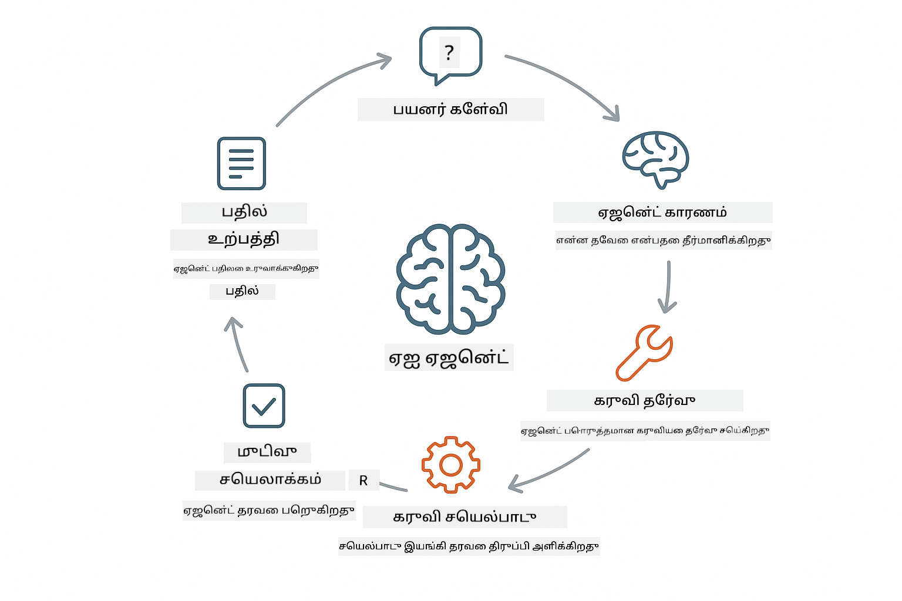
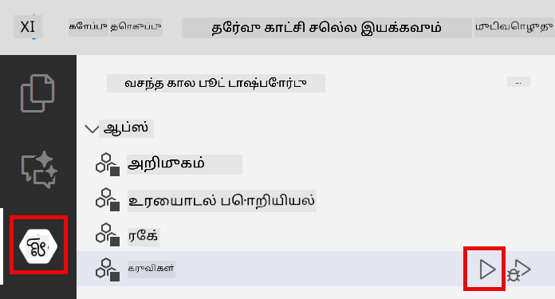
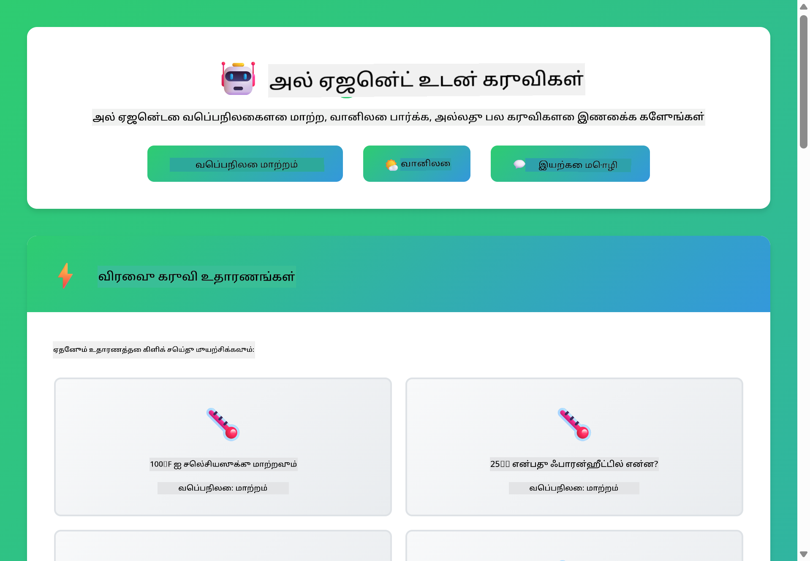
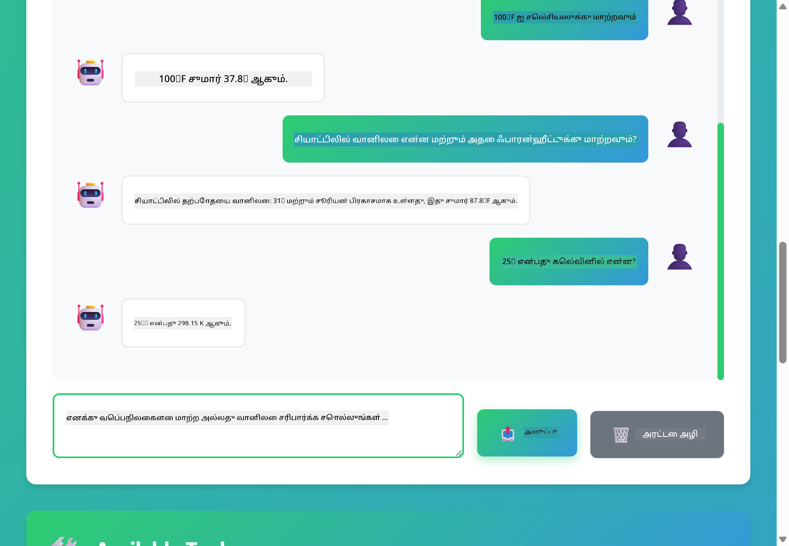

<!--
CO_OP_TRANSLATOR_METADATA:
{
  "original_hash": "13ec450c12cdd1a863baa2b778f27cd7",
  "translation_date": "2025-12-31T06:57:24+00:00",
  "source_file": "04-tools/README.md",
  "language_code": "ta"
}
-->
# Module 04: கருவிகளுடன் AI முகவர்கள்

## உள்ளடக்க அட்டவணை

- [நீங்கள் கற்றுக் கொள்ளப்போகும் விஷயங்கள்](../../../04-tools)
- [முன் நிபந்தனைகள்](../../../04-tools)
- [கருவிகளுடன் AI முகவர்களை புரிந்துகொள்ளுதல்](../../../04-tools)
- [கருவி அழைப்புகள் எப்படி இயங்குகின்றன](../../../04-tools)
  - [கருவி வரையறைகள்](../../../04-tools)
  - [முடிவு எடுக்கும் முறை](../../../04-tools)
  - [செயற்படுத்தல்](../../../04-tools)
  - [பதில் உருவாக்கம்](../../../04-tools)
- [கருவி சங்கிலி](../../../04-tools)
- [அப்ளிகேஷனை இயக்கவும்](../../../04-tools)
- [அப்ளிகேஷனை பயன்படுத்துதல்](../../../04-tools)
  - [சாதாரண கருவி பயன்பாட்டை முயற்சி செய்க](../../../04-tools)
  - [கருவி சங்கிலியை சோதிக்கவும்](../../../04-tools)
  - [உரையாடல் ஓட்டத்தை காண்க](../../../04-tools)
  - [தர்க்கத்தை கண்காணிக்கவும்](../../../04-tools)
  - [விதிவகையான கோரிக்கைகளை முயற்சி செய்க](../../../04-tools)
- [முக்கியக் கருத்துகள்](../../../04-tools)
  - [ReAct முறை (தர்க்கமும் செயலும்)](../../../04-tools)
  - [கருவி விளக்கங்கள் முக்கியம்](../../../04-tools)
  - [செஷன் மேலாண்மை](../../../04-tools)
  - [பிழை கையாளுதல்](../../../04-tools)
- [கிடைக்கக்கூடிய கருவிகள்](../../../04-tools)
- [கருவி அடிப்படையிலான முகவர்களின் பயன்பாடு எப்போது](../../../04-tools)
- [அடுத்த படிகள்](../../../04-tools)

## நீங்கள் கற்றுக் கொள்ளப்போகும் விஷயங்கள்

இன்றுவரை, நீங்கள் AI உடன் உரையாடல்களை எவ்வாறு நடத்துவது, பயன்பக்கங்களை கட்டமைப்பது, மற்றும் உங்கள் ஆவணங்களில் பதில்களை நிலைநிறுத்துவது ஆகியவற்றைப் பற்றி கற்றுக்கொண்டிருக்கிறீர்கள். ஆனால் இன்னும் ஒரு அடிப்படை வரம்பு உள்ளது: மொழி மாதிரிகள் மட்டும் உரைத்துறையை உருவாக்க முடியும். அவை வானிலை பார்க்க முடியாது, கணக்கீடுகள் செய்யமுடியாது, தரவுத்தளங்களை கேள்வி செய்யமுடியாது, அல்லது வெளி அமைப்புகளுடன் தொடர்பு கொள்ளமுடியாது.

கருவிகள் இதை மாற்றுகின்றன. மாதிரிக்கு அது அழைக்கக்கூடிய செயற்பாடுகளுக்கு அணுகலை கொடுக்கும் போது, அதை உரை உருவாக்குநரால் செயல்படும் முகவராக மாற்றுகிறீர்கள். மாதிரி எந்த போது ஒரு கருவி தேவைப்படும், எந்த கருவியை பயன்படுத்துவது, மற்றும் எந்த அளவிலான அளவுருக்களை வழங்குவது என்று தீர்மானிக்கிறது. உங்கள் குறியீடு அந்த செயல்பாட்டை இயக்கி முடிவை திரும்ப வழங்குகிறது. மாதிரி அந்த முடிவை தனது பதிலில் இணைக்கிறது.

## முன் நிபந்தனைகள்

- Module 01 முடித்திருக்க வேண்டும் (Azure OpenAI வளங்கள் நிறுவப்பட்டுள்ளன)
- ரூட் கோப்புறையில் Azure அங்கீகாரங்களுடன் `.env` கோப்பு (`azd up` மூலம் Module 01 இல் உருவாக்கப்பட்டது)

> **குறிப்பு:** நீங்கள் Module 01 ஐ இன்னும் முடிக்கவில்லை என்றால், முதலில் அங்கு உள்ள நிறுவல் directions-ஐ பின்பற்றவும்.

## கருவிகளுடன் AI முகவர்களை புரிந்துகொள்ளுதல்

> **📝 குறிப்புரை:** இந்த தொகுதியில் "முகவர்கள்" என்ற பரிச்சயம் கருவி-அழைப்பு திறன்களால் மேம்படுத்தப்பட்ட AI உதவியாளர்களைக் குறிக்கிறது. இது நாங்கள் [Module 05: MCP](../05-mcp/README.md) இல் கையாள விருக்கும் **Agentic AI** மாதிரிகளிலிருந்து (தன்னிச்சையான முகவர்கள் திட்டமிடல், நினைவகம் மற்றும் பலபடி தர்க்கம் உடையவை) வெவ்வேறாகும்.

கருவிகள் உள்ள AI முகவர் ஒரு தர்க்கம் மற்றும் செயல் முறை (ReAct) பின்பற்றுகிறது:

1. பயனர் ஒரு கேள்வி கேட்கிறார்
2. முகவர் என்ன தெரிந்து கொள்ள வேண்டும் என்பதை பற்றி தர்க்கம் செய்கிறது
3. முகவர் பதிலைத் தர கருவி தேவைப்படுமா என்று முடிவு செய்கிறது
4. தேவையானால், முகவர் சரியான அளவுருக்களுடன் பொருந்தக்கூடிய கருவியை அழைக்கிறது
5. கருவி செயல்பட்டு தரவுகளை திரும்ப வழங்குகிறது
6. முகவர் அந்த முடிவை இணைத்து இறுதி பதிலை வழங்குகிறது



*ReAct முறை - AI முகவர்கள் பிரச்சனைகளை தீர்க்கும் போது தர்க்கம் மற்றும் செயலை மாற்றி செயல்படுவது*

இது தானாகவே நடக்கும். நீங்கள் கருவிகளையும் அவற்றின் விளக்கங்களையும் நிர்ணயிக்கிறீர்கள். மாதிரி எப்போது மற்றும் எப்படி அவைகளை பயன்படுத்த வேண்டும் என்பதில் தீர்மானம் எடுக்கிறது.

## கருவி அழைப்புகள் எப்படி இயங்குகின்றன

**கருவி வரையறைகள்** - [WeatherTool.java](../../../04-tools/src/main/java/com/example/langchain4j/agents/tools/WeatherTool.java) | [TemperatureTool.java](../../../04-tools/src/main/java/com/example/langchain4j/agents/tools/TemperatureTool.java)

நீங்கள் தெளிவான விளக்கங்கள் மற்றும் அளவுரு விவரக்குறிப்புகளுடன் செயல்பாடுகளை வரையறுக்கிறீர்கள். மாதிரி இந்த விளக்கங்களை அதன் சிஸ்டம் பிராம்ப்டில் காண்கிறது மற்றும் ஒவ்வொரு கருவியும் என்ன செய்கிறது என்பதைப் புரிந்து கொள்கிறது.

```java
@Component
public class WeatherTool {
    
    @Tool("Get the current weather for a location")
    public String getCurrentWeather(@P("Location name") String location) {
        // உங்கள் வானிலை தேடல் தர்க்கம்
        return "Weather in " + location + ": 22°C, cloudy";
    }
}

@AiService
public interface Assistant {
    String chat(@MemoryId String sessionId, @UserMessage String message);
}

// உதவியாளர் Spring Boot மூலம் தானாக இணைக்கப்பட்டுள்ளது:
// - ChatModel பீன்
// - @Component வகுப்புகளில் உள்ள அனைத்து @Tool முறைகள்
// - செஷன் நிர்வகிப்பிற்காக ChatMemoryProvider
```

> **🤖 Try with [GitHub Copilot](https://github.com/features/copilot) Chat:** Open [`WeatherTool.java`](../../../04-tools/src/main/java/com/example/langchain4j/agents/tools/WeatherTool.java) and ask:
> - "How would I integrate a real weather API like OpenWeatherMap instead of mock data?"
> - "What makes a good tool description that helps the AI use it correctly?"
> - "How do I handle API errors and rate limits in tool implementations?"

**முடிவு எடுக்கும் முறை**

பயனர் "What's the weather in Seattle?" என்று கேட்டால், மாதிரி அதற்கு வானிலை கருவி தேவைப்படுவதாக உணர்கிறது. அது location அளவுரு "Seattle" ஆக அமைந்த ஒரு செயல்பாட்டு அழைப்பை உருவாக்குகிறது.

**செயற்படுத்தல்** - [AgentService.java](../../../04-tools/src/main/java/com/example/langchain4j/agents/service/AgentService.java)

Spring Boot declarative `@AiService` இடைமுகத்துடன் பதிவு செய்யப்பட்ட அனைத்து கருவிகளையும் auto-wire செய்கிறது, மற்றும் LangChain4j கருவி அழைப்புகளை தானாகவே செயல்படுத்துகிறது.

> **🤖 Try with [GitHub Copilot](https://github.com/features/copilot) Chat:** Open [`AgentService.java`](../../../04-tools/src/main/java/com/example/langchain4j/agents/service/AgentService.java) and ask:
> - "How does the ReAct pattern work and why is it effective for AI agents?"
> - "How does the agent decide which tool to use and in what order?"
> - "What happens if a tool execution fails - how should I handle errors robustly?"

**பதில் உருவாக்கம்**

மாதிரி வானிலை தரவுகளைப் பெறும், அதனை இயல்பான மொழி பதிலாக பயனருக்காக வடிவமைக்கும்.

### ஏன் Declarative AI சேவைகளை பயன்படுத்த வேண்டும்?

இந்த தொகுதி LangChain4j இன் Spring Boot ஒருங்கிணைப்பை declarative `@AiService` இடைமுகங்களுடன் பயன்படுத்துகிறது:

- **Spring Boot auto-wiring** - ChatModel மற்றும் கருவிகள் தானாக ஏற்றப்படுகின்றன
- **@MemoryId pattern** - session அடிப்படையிலான நினைவக மேலாண்மை தானாக இயங்கும்
- **Single instance** - உதவியாளர் ஒருமுறை உருவாக்கப்படும் மற்றும் சிறந்த செயல்திறனுக்காக மீண்டும் பயன்படுத்தப்படும்
- **Type-safe execution** - Java முறைகள் நேரடியாக அழைக்கபடுகின்றன மற்றும் வகை மாற்றம் நடைபெறுகிறது
- **Multi-turn orchestration** - கருவி சங்கிலியை தானாக கையாளும்
- **Zero boilerplate** - கைமுறை AiServices.builder() அழைப்புகள் அல்லது memory HashMap தேவை இல்லை

மாற்று அணுகுமுறைகள் (கைமுறை `AiServices.builder()`) அதிக குறியிடலைக் கோரும் மற்றும் Spring Boot ஒருங்கிணைப்பின் நன்மைகளை இழக்க முடியும்.

## கருவி சங்கிலி

AI ஒரே சரணில் பல கருவிகளை வரிசையாக அழைக்கலாம். "What's the weather in Seattle and should I bring an umbrella?" என்று கேட்கவும் மற்றும் அது `getCurrentWeather` ஐ மழைக்கு ஏற்ப சரிவர கருதலுடன் எவ்வாறு சங்கிலி செய்கிறது என்பதை பாருங்கள்.

<a href="images/tool-chaining.png"></a>

*வரிசையான கருவி அழைப்புகள் - ஒரு கருவியின் வெளியீடு அடுத்த முடிவுக்கு உணவு அளிக்கிறது*

**மென்மையான தோல்விகள்** - டெமோ/mock தரவில் இல்லாத ஒரு நகரத்தின் வானிலை கேட்கவும். கருவி பிழைச் செய்தியை திருப்பி அளிக்கும், மற்றும் AI அதன் மூலம் உதவ முடியாது என்று விளக்குகிறது. கருவிகள் பாதுகாப்பாக தோல்வி அடையும்.

இது ஒரு ஒற்றை உரையாடல் திருப்பத்தில் நடக்கிறது. முகவர் தன்னிச்சையாக பல கருவி அழைப்புகளை ஒருங்கிணைக்கிறது.

## அப்ளிகேஷனை இயக்கவும்

**நிறுவலை சரிபார்க்கவும்:**

ரூட் கோப்புறையில் Azure அங்கீகாரங்களுடன் `.env` கோப்பு உள்ளது என்பதை உறுதிசெய்யுங்கள் (Module 01 இல் உருவாக்கப்பட்டது):
```bash
cat ../.env  # AZURE_OPENAI_ENDPOINT, API_KEY, DEPLOYMENT காண்பிக்கப்பட வேண்டும்
```

**அப்ளிகேஷனை துவக்கவும்:**

> **குறிப்பு:** நீங்கள் Module 01 இல் இருந்து `./start-all.sh` பயன்படுத்தி ஏற்கனவே அனைத்து அப்ளிகேஷன்களையும் துவக்கியிருந்தால், இந்த தொகுதி ஏற்கனவே 8084 போர்டில் இயங்கிக் கொண்டிருக்கும். கீழேயுள்ள துவக்க உத்தரவுகளை தவிர்க்கலாம் மற்றும் நேரடியாக http://localhost:8084 செல்லலாம்.

**விருப்பம் 1: Spring Boot Dashboard பயன்படுத்துதல் (VS Code பயனர்களுக்கான பரிந்துரை)**

dev container-ல் Spring Boot Dashboard விரிவாக்கம் உள்ளடக்கப்பட்டுள்ளது, இது அனைத்து Spring Boot பயன்பாடுகளையும் மேலாண்மை செய்ய காட்சி இடைமுகத்தை வழங்குகிறது. நீங்கள் VS Code இன் இடது Activity Bar-இல் (Spring Boot ஐகான் காணுங்கள்) அதை காணலாம்.

Spring Boot Dashboard மூலம், நீங்கள்:
- வேலைப்பலகையில் உள்ள அனைத்து Spring Boot பயன்பாடுகளையும் காணலாம்
- ஒரு கிளிக்கில் பயன்பாடுகளை துவக்க/நிறுத்த முடியும்
- பயன்பாட்டு பதிவுகளை நேரடியாகப் பார்க்கலாம்
- பயன்பாட்டு நிலையை கண்காணிக்கலாம்

"tools" என்பதற்கு அடுத்துள்ள பிளே பொத்தானை கிளிக் செய்து இந்த தொகுதியை துவங்கலாம், அல்லது ஒரே நேரத்தில் அனைத்து தொகுதிகளையும் துவக்கலாம்.



**விருப்பம் 2: ஷெல் ஸ்கிரிப்ட்கள் பயன்படுத்துதல்**

அனைத்து வலை பயன்பாடுகளை துவக்கு (modules 01-04):

**Bash:**
```bash
cd ..  # ரூட் அடைவிலிருந்து
./start-all.sh
```

**PowerShell:**
```powershell
cd ..  # மூல அடைவிலிருந்து
.\start-all.ps1
```

அல்லது இந்த தொகுதியை மட்டும் துவக்கவும்:

**Bash:**
```bash
cd 04-tools
./start.sh
```

**PowerShell:**
```powershell
cd 04-tools
.\start.ps1
```

இரு ஸ்கிரிப்ட்களும் ரூட் `.env` கோப்பு இருந்து சுற்றுச்சூழல் மாறிலிகளை தானாக ஏற்றும் மற்றும் JARகள் இல்லையெனில் அவைகளை கட்டும்.

> **Note:** If you prefer to build all modules manually before starting:
>
> **Bash:**
> ```bash
> cd ..  # Go to root directory
> mvn clean package -DskipTests
> ```
>
> **PowerShell:**
> ```powershell
> cd ..  # Go to root directory
> mvn clean package -DskipTests
> ```

உங்கள் உலாவியில் http://localhost:8084 திறக்கவும்.

**நிறுத்த:**

**Bash:**
```bash
./stop.sh  # இந்த மாடியூல் மட்டுமே
# அல்லது
cd .. && ./stop-all.sh  # அனைத்து மாடியூல்கள்
```

**PowerShell:**
```powershell
.\stop.ps1  # இந்த மாட்யூல் மட்டும்
# அல்லது
cd ..; .\stop-all.ps1  # அனைத்து மாட்யூல்களும்
```

## அப்ளிகேஷனை பயன்படுத்துதல்

அப்ளிகேஷன் ஒரு வலை இடைமுகத்தை வழங்குகிறது, இதில் நீங்கள் வானிலை மற்றும் வெப்பநிலைக் மாற்ற கருவிகளில் அணுகல் கொண்ட AI முகவருடன் தொடர்பு கொள்ளலாம்.

<a href="images/tools-homepage.png"></a>

*AI முகவர் கருவிகள் இடைமுகம் - உடனடி எடுத்துக்காட்டுகள் மற்றும் கருவிகளுடன் தொடர்பு கொள்ளும் உரையாடல் இடைமுகம்*

**சாதாரண கருவி பயன்பாட்டை முயற்சி செய்க**

எளிய கோரிக்கையுடன் தொடங்குங்கள்: "100 டிகிரி Fahrenheit-ஐ Celsius-க்கு மாற்றவும்". முகவர் அது வெப்பநிலைக் மாற்ற கருவியை பயன்படுத்த வேண்டியதை அடையாளம் காணும், சரியான அளவுருக்களுடன் அதை அழைக்கும், மற்றும் முடிவைக் காட்டு பதிலாக வழங்கும். இது எவ்வாறு இயல்பாகத் தெரிகிறது என்பதை கவனிக்கவும் - நீங்கள் எந்த கருவியை பயன்படுத்த வேண்டும் அல்லது அதை எவ்வாறு அழைப்பது என்பதை தெளிவுபடுத்தவில்லை.

**கருவி சங்கிலியை சோதிக்கவும்**

இப்போது மேலும் சிக்கலான ஒன்றை முயற்சி செய்க: "What's the weather in Seattle and convert it to Fahrenheit?" என்று கேட்கவும். முகவர் இதை படிப்படியாக செயல்படுத்துவதைக் காணலாம். அது முதலில் வானிலை பெறுகிறது (செல்சியஸ் ஆக திருப்புகிறது), பின்னர் அதை Fahrenheit-க்கு மாற்ற வேண்டுமென்பதை உணர்கிறது, மாற்றுமுறை கருவியை அழைக்கிறது, மற்றும் இரு முடிவுகளையும் ஒன்றாகக் கூட்டு பதிலாக வழங்குகிறது.

**உரையாடல் ஓட்டத்தை காண்க**

சாட் இடைமுகம் உரையாடல் வரலாற்றை பராமரிக்கிறது, இது பல திருப்புகள் கொண்ட உரையாடலை உங்களுக்கு அனுமதிக்கிறது. நீங்கள் முந்தைய அனைத்து கேள்விகள் மற்றும் பதில்களைப் பார்க்கலாம், இது உரையாடலை பின்தொடர்ந்து முகவர் பல trao Exchanges இல் எப்படிบริ蹊 context-ஐ கட்டமைக்கிறது என்பதைப் புரிந்துகொள்ள உதவும்.

<a href="images/tools-conversation-demo.png"></a>

*பல கருவி அழைப்புகள் காணப்படுகின்ற பரபரப்பான உரையாடல் - எளிய மாற்றங்கள், வானிலை தேடல்கள் மற்றும் கருவி சங்கிலிகள்*

**விதிவகையான கோரிக்கைகளை முயற்சி செய்க**

விதிவகை தொடர்பான பல கோரிக்கைகளை முயற்சி செய்க:
- வானிலை தேடல்கள்: "What's the weather in Tokyo?"
- வெப்பநிலை மாற்றங்கள்: "What is 25°C in Kelvin?"
- இணைந்த கேள்விகள்: "Check the weather in Paris and tell me if it's above 20°C"

முகவர் இயல்பான மொழியை எப்படி கருத்தில் கொண்டு பொருத்தமான கருவி அழைப்புகளாக மAPPING செய்வதை கவனிக்கவும்.

## முக்கியக் கருத்துகள்

**ReAct முறை (தர்க்கமும் செயலும்)**

முகவர் தர்க்கிப்பது (என்ன செய்ய வேண்டும் என்பதை தீர்மானித்தல்) மற்றும் செயல் (கருவிகளை பயன்படுத்துதல்) ஆகியவற்றை இடைநீக்கம் செய்கிறது. இந்த முறை 단순 கட்டளைகளுக்கு பதிலளிப்பதைவிட சுயாதீன பிரச்சனை தீர்க்கும் திறனை வழங்குகிறது.

**கருவி விளக்கங்கள் முக்கியம்**

உங்கள் கருவி விளக்கங்கள் தரமானவையாக இருந்தால் முகவர் அவையை நன்றாக பயன்படுத்தும். தெளிவான, குறிப்பிட்ட விளக்கங்கள் மாதிரிக்கு எப்போது மற்றும் எப்படி ஒவ்வொரு கருவியையும் அழைக்கவேண்டும் என்பதைப் புரிந்து கொள்ள உதவும்.

**செஷன் மேலாண்மை**

`@MemoryId` அநொட்டேஷன் session அடிப்படையிலான நினைவக மேலாண்மையை தானாக இயக்கு. ஒவ்வொரு session IDக்கும் `ChatMemory` உடைய தனி நகல் இருக்கிறது, இது `ChatMemoryProvider` பீனின் மூலம் நிர்வகிக்கப்படுகிறது, கைமுறை நினைவக கண்காணிப்பை நீக்குகிறது.

**பிழை கையாளுதல்**

கருவிகள் தோல்வியடையலாம் - APIகள் நேரம் முடிவடையலாம், அளவுருக்கள் தவறாக இருக்கலாம், வெளி சேவைகள் செயலிழக்கலாம். உற்பத்தி நிலை முகவர்களுக்கு பிழை கையாளுதல் தேவை, இதனால் மாதிரி பிரச்சனைகளை விளக்கவோ அல்லது மாற்று முயற்சிகளைச் செய்யவோ முடியும்.

## கிடைக்கக்கூடிய கருவிகள்

**வானிலை கருவிகள்** (டெமோவுக்கான mock தரவு):
- இடம் ஒன்றிற்கான தற்போதைய வானிலை பெறுதல்
- பல நாள் முன்னறிவு பெறுதல்

**வெப்பநிலை மாற்ற கருவிகள்**:
- Celsius to Fahrenheit
- Fahrenheit to Celsius
- Celsius to Kelvin
- Kelvin to Celsius
- Fahrenheit to Kelvin
- Kelvin to Fahrenheit

இவை எளிய எடுத்துக்காட்டுகள் மட்டுமே, ஆனால் முறை எந்த செயலுக்கும் விரிவாக்கம் செய்யக்கூடும்: தரவுத்தள கேள்விகள், API அழைப்புகள், கணக்கீடுகள், கோப்பு செயல்பாடுகள், அல்லது சிஸ்டம் கமாண்டுகள்.

## கருவி அடிப்படையிலான முகவர்களின் பயன்பாடு எப்போது

**கருவிகளைப் பயன்படுத்துக عندما:**
- பதிலுக்கு நேரடி தரவு தேவைப்படும் (வானிலை, பங்கு விலைகள், வழங்கல் பட்டியல்)
- நீங்கள் சாதாரண கணக்கீடுகளைவிட அதிகமான கணக்கீடுகள் செய்ய வேண்டுமெனில்
- தரவுத்தளங்கள் அல்லது APIகளுக்கு அணுகல் தேவையானபோது
- செயல்கள் எடுப்பது (மின்னஞ்சல் அனுப்பு, டிக்கெட் உருவாக்குதல், பதிவுகளை புதுப்பித்தல்)
- பல தரவுசோதனைகளைக் இணைக்கும் பொழுது

**கருவிகளைப் பயன்படுத்தாதே عندما:**
- கேள்விகளை பொது அறிவில் இருந்து பதிலளிக்க முடியும்
- பதில் முழுமையாக உரையாடல் சார்ந்தது
- கருவியின் தாமதம் அனுபவத்தை மிகவும் மெதுவாக்கும்

## அடுத்த படிகள்

**அடுத்த தொகுதி:** [05-mcp - மாடல் உள்ளடக்க நடைமுறை (MCP)](../05-mcp/README.md)

---

**Navigation:** [← முந்தையது: Module 03 - RAG](../03-rag/README.md) | [முதன்மை பக்கத்திற்கு திரும்பவும்](../README.md) | [அடுத்து: Module 05 - MCP →](../05-mcp/README.md)

---

<!-- CO-OP TRANSLATOR DISCLAIMER START -->
மறுப்பு:
இந்த ஆவணம் செயற்கை நுண்ணறிவு மொழிபெயர்ப்பு சேவையான [Co-op Translator](https://github.com/Azure/co-op-translator) மூலம் மொழிபெயர்க்கப்பட்டது. நாங்கள் துல்லியத்திற்காக முயற்சித்தாலும், தானியங்கி மொழிபெயர்ப்புகளில் பிழைகள் அல்லது தவறுகள் உள்ள мөмкин என்பதைக் கவனிக்கவும். மூல ஆவணம் அதன் சொந்த மொழியில் அதிகாரப்பூர்வ ஆதாரமாக கருதப்பட வேண்டும். முக்கியமான தகவல்களுக்கு, தொழில்முறை மனித மொழிபெயர்ப்பை பரிந்துரைக்கப்படுகிறோம். இந்த மொழிபெயர்ப்பினால் ஏற்படக்கூடிய எந்தவொரு தவறான புரிதலும் அல்லது தவறான விளக்கத்தற்குமான பொறுப்பும் நாங்கள் ஏற்கவில்லை.
<!-- CO-OP TRANSLATOR DISCLAIMER END -->