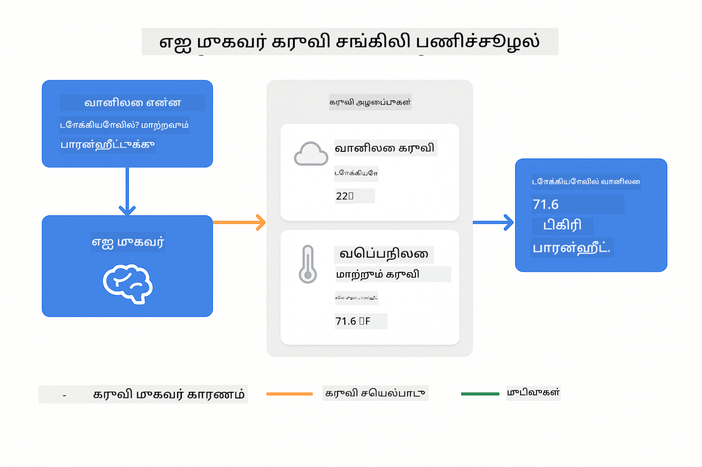

<!--
CO_OP_TRANSLATOR_METADATA:
{
  "original_hash": "aa23f106e7f53270924c9dd39c629004",
  "translation_date": "2025-12-13T19:40:07+00:00",
  "source_file": "04-tools/README.md",
  "language_code": "ta"
}
-->
# Module 04: கருவிகளுடன் கூடிய AI முகவர்கள்

## உள்ளடக்க அட்டவணை

- [நீங்கள் கற்றுக்கொள்ளப்போகும் விஷயங்கள்](../../../04-tools)
- [முன்னோட்டங்கள்](../../../04-tools)
- [கருவிகளுடன் கூடிய AI முகவர்களைப் புரிந்துகொள்வது](../../../04-tools)
- [கருவி அழைப்புகள் எப்படி செயல்படுகின்றன](../../../04-tools)
  - [கருவி வரையறைகள்](../../../04-tools)
  - [தீர்மானம் எடுக்கும் செயல்முறை](../../../04-tools)
  - [நிர்வாகம்](../../../04-tools)
  - [பதில் உருவாக்கல்](../../../04-tools)
- [கருவி சங்கிலி](../../../04-tools)
- [பயன்பாட்டை இயக்கவும்](../../../04-tools)
- [பயன்பாட்டைப் பயன்படுத்துதல்](../../../04-tools)
  - [எளிய கருவி பயன்பாட்டை முயற்சிக்கவும்](../../../04-tools)
  - [கருவி சங்கிலியை சோதிக்கவும்](../../../04-tools)
  - [உரையாடல் ஓட்டத்தைப் பார்க்கவும்](../../../04-tools)
  - [கருத்தாய்வை கவனிக்கவும்](../../../04-tools)
  - [விதவிதமான கோரிக்கைகளுடன் பரிசோதனை செய்யவும்](../../../04-tools)
- [முக்கிய கருத்துக்கள்](../../../04-tools)
  - [ReAct மாதிரி (கருத்தாய்வு மற்றும் செயல்பாடு)](../../../04-tools)
  - [கருவி விளக்கங்கள் முக்கியம்](../../../04-tools)
  - [அமர்வு மேலாண்மை](../../../04-tools)
  - [பிழை கையாளுதல்](../../../04-tools)
- [கிடைக்கும் கருவிகள்](../../../04-tools)
- [கருவி அடிப்படையிலான முகவர்களை எப்போது பயன்படுத்துவது](../../../04-tools)
- [அடுத்த படிகள்](../../../04-tools)

## நீங்கள் கற்றுக்கொள்ளப்போகும் விஷயங்கள்

இன்னும் வரை, நீங்கள் AI உடன் உரையாடல்கள் நடத்துவது, விளக்கங்களை திறம்பட அமைப்பது மற்றும் உங்கள் ஆவணங்களில் பதில்களை அடிப்படையாக்குவது எப்படி என்பதை கற்றுக்கொண்டுள்ளீர்கள். ஆனால் இன்னும் ஒரு அடிப்படையான வரம்பு உள்ளது: மொழி மாதிரிகள் வெறும் உரையை உருவாக்க மட்டுமே முடியும். அவை வானிலை சரிபார்க்க முடியாது, கணக்கீடுகள் செய்ய முடியாது, தரவுத்தளங்களை விசாரிக்க முடியாது அல்லது வெளிப்புற அமைப்புகளுடன் தொடர்பு கொள்ள முடியாது.

கருவிகள் இதை மாற்றுகின்றன. மாதிரிக்கு அழைக்கக்கூடிய செயல்பாடுகளை வழங்குவதன் மூலம், நீங்கள் அதை உரை உருவாக்கியாளராக இருந்து செயல்படக்கூடிய முகவராக மாற்றுகிறீர்கள். மாதிரி எப்போது கருவி தேவை என்பதை, எந்த கருவியை பயன்படுத்த வேண்டும் என்பதையும், எந்த அளவுருக்களை வழங்க வேண்டும் என்பதையும் தீர்மானிக்கிறது. உங்கள் குறியீடு செயல்பாட்டை இயக்கி முடிவை திருப்பி அளிக்கிறது. மாதிரி அந்த முடிவை தனது பதிலில் சேர்க்கிறது.

## முன்னோட்டங்கள்

- Module 01 முடிக்கப்பட்டது (Azure OpenAI வளங்கள் நிறுவப்பட்டுள்ளன)
- ரூட் அடைவில் `.env` கோப்பு Azure அங்கீகாரங்களுடன் (Module 01 இல் `azd up` மூலம் உருவாக்கப்பட்டது)

> **குறிப்பு:** நீங்கள் Module 01 முடிக்கவில்லை என்றால், முதலில் அங்கு உள்ள நிறுவல் வழிமுறைகளை பின்பற்றவும்.

## கருவிகளுடன் கூடிய AI முகவர்களைப் புரிந்துகொள்வது

கருவிகளுடன் கூடிய AI முகவர் ஒரு கருத்தாய்வு மற்றும் செயல்பாட்டு மாதிரியை (ReAct) பின்பற்றுகிறது:

1. பயனர் ஒரு கேள்வி கேட்கிறார்
2. முகவர் என்ன தெரிந்து கொள்ள வேண்டும் என்று கருத்தாய்வு செய்கிறது
3. பதில் அளிக்க கருவி தேவைப்படுகிறதா என்று முடிவு செய்கிறது
4. ஆம் என்றால், சரியான அளவுருக்களுடன் பொருத்தமான கருவியை அழைக்கிறது
5. கருவி செயல்பட்டு தரவை திருப்பி அளிக்கிறது
6. முகவர் முடிவை சேர்த்து இறுதி பதிலை வழங்குகிறது


*ReAct மாதிரி - AI முகவர்கள் பிரச்சனைகளை தீர்க்க கருத்தாய்வு மற்றும் செயல்பாட்டை மாற்றி செயல்படுவது*

இது தானாகவே நடக்கிறது. நீங்கள் கருவிகளையும் அவற்றின் விளக்கங்களையும் வரையறுக்கிறீர்கள். மாதிரி அவற்றை எப்போது மற்றும் எப்படி பயன்படுத்துவது என்பதில் தீர்மானம் எடுக்கிறது.

## கருவி அழைப்புகள் எப்படி செயல்படுகின்றன

**கருவி வரையறைகள்** - [WeatherTool.java](../../../04-tools/src/main/java/com/example/langchain4j/agents/tools/WeatherTool.java) | [TemperatureTool.java](../../../04-tools/src/main/java/com/example/langchain4j/agents/tools/TemperatureTool.java)

நீங்கள் தெளிவான விளக்கங்களும் அளவுரு விவரங்களும் கொண்ட செயல்பாடுகளை வரையறுக்கிறீர்கள். மாதிரி இந்த விளக்கங்களை தனது அமைப்பு விளக்கத்தில் காண்கிறது மற்றும் ஒவ்வொரு கருவியும் என்ன செய்கிறது என்பதை புரிந்துகொள்கிறது.

```java
@Component
public class WeatherTool {
    
    @Tool("Get the current weather for a location")
    public String getCurrentWeather(@P("Location name") String location) {
        // உங்கள் வானிலை தேடல் தர்க்கம்
        return "Weather in " + location + ": 22°C, cloudy";
    }
}

@AiService
public interface Assistant {
    String chat(@MemoryId String sessionId, @UserMessage String message);
}

// உதவியாளர் Spring Boot மூலம் தானாக இணைக்கப்பட்டுள்ளது:
// - ChatModel பீன்
// - @Component வகுப்புகளிலிருந்து அனைத்து @Tool முறைகள்
// - அமர்வு மேலாண்மைக்கான ChatMemoryProvider
```

> **🤖 [GitHub Copilot](https://github.com/features/copilot) உரையாடலுடன் முயற்சிக்கவும்:** [`WeatherTool.java`](../../../04-tools/src/main/java/com/example/langchain4j/agents/tools/WeatherTool.java) திறந்து கேளுங்கள்:
> - "நான் mock தரவுக்கு பதிலாக உண்மையான வானிலை API OpenWeatherMap ஐ எப்படி ஒருங்கிணைப்பேன்?"
> - "AI அதை சரியாக பயன்படுத்த உதவும் நல்ல கருவி விளக்கம் என்ன?"
> - "கருவி செயல்பாடுகளில் API பிழைகள் மற்றும் வீத வரம்புகளை எப்படி கையாள்வது?"

**தீர்மானம் எடுக்கும் செயல்முறை**

பயனர் "Seattle இல் வானிலை என்ன?" என்று கேட்டால், மாதிரி வானிலை கருவி தேவை என்பதை உணர்கிறது. அது "Seattle" என்ற இட அளவுருவுடன் செயல்பாடு அழைப்பை உருவாக்குகிறது.

**நிர்வாகம்** - [AgentService.java](../../../04-tools/src/main/java/com/example/langchain4j/agents/service/AgentService.java)

Spring Boot அனைத்து பதிவு செய்யப்பட்ட கருவிகளுடன் `@AiService` இடைமுகத்தை தானாக இணைக்கிறது, மற்றும் LangChain4j கருவி அழைப்புகளை தானாக இயக்குகிறது.

> **🤖 [GitHub Copilot](https://github.com/features/copilot) உரையாடலுடன் முயற்சிக்கவும்:** [`AgentService.java`](../../../04-tools/src/main/java/com/example/langchain4j/agents/service/AgentService.java) திறந்து கேளுங்கள்:
> - "ReAct மாதிரி எப்படி செயல்படுகிறது மற்றும் அது AI முகவர்களுக்கு ஏன் பயனுள்ளதாக உள்ளது?"
> - "முகவர் எந்த கருவியை எப்போது பயன்படுத்துவது மற்றும் எந்த வரிசையில் என்பதை எப்படி தீர்மானிக்கிறது?"
> - "ஒரு கருவி செயல்பாடு தோல்வியடைந்தால் என்ன நடக்கும் - பிழைகளை எப்படி வலுவாக கையாள வேண்டும்?"

**பதில் உருவாக்கல்**

மாதிரி வானிலை தரவை பெறுகிறது மற்றும் பயனருக்கு இயல்பான மொழி பதிலாக வடிவமைக்கிறது.

### ஏன் அறிவ declarative AI சேவைகளை பயன்படுத்த வேண்டும்?

இந்த மாட்யூல் LangChain4j இன் Spring Boot ஒருங்கிணைப்பை declarative `@AiService` இடைமுகங்களுடன் பயன்படுத்துகிறது:

- **Spring Boot தானாக இணைத்தல்** - ChatModel மற்றும் கருவிகள் தானாகச் சேர்க்கப்படுகின்றன
- **@MemoryId மாதிரி** - தானாக அமர்வு அடிப்படையிலான நினைவக மேலாண்மை
- **ஒற்றை நிகழ்ச்சி** - உதவியாளர் ஒருமுறை உருவாக்கப்பட்டு மீண்டும் பயன்படுத்தப்படுகிறது
- **வகை-பாதுகாப்பான செயல்பாடு** - Java முறைகள் நேரடியாக வகை மாற்றத்துடன் அழைக்கப்படுகின்றன
- **பல-முறை ஒழுங்கமைப்பு** - கருவி சங்கிலியை தானாக கையாள்கிறது
- **பூஜ்ய boilerplate** - கைமுறை AiServices.builder() அழைப்புகள் அல்லது நினைவக HashMap இல்லை

மாற்று அணுகுமுறைகள் (கைமுறை `AiServices.builder()`) அதிக குறியீடு தேவைப்படுத்தி Spring Boot ஒருங்கிணைப்பு நன்மைகளை இழக்கின்றன.

## கருவி சங்கிலி

**கருவி சங்கிலி** - AI ஒரே நேரத்தில் பல கருவிகளை வரிசையாக அழைக்கலாம். "Seattle இல் வானிலை என்ன மற்றும் நான் குடை கொண்டு செல்ல வேண்டுமா?" என்று கேட்டு `getCurrentWeather` ஐ மழை உபகரணங்களைப் பற்றி கருத்தாய்வு செய்து சங்கிலி செய்வதை கவனிக்கவும்.

<a href="images/tool-chaining.png"></a>

*வரிசைப்படியான கருவி அழைப்புகள் - ஒரு கருவியின் வெளியீடு அடுத்த தீர்மானத்திற்கு ஊட்டமாகிறது*

**மென்மையான தோல்விகள்** - mock தரவில் இல்லாத நகரத்தின் வானிலை கேட்கவும். கருவி பிழை செய்தியை திருப்பி அளிக்கிறது, AI உதவ முடியாது என்று விளக்குகிறது. கருவிகள் பாதுகாப்பாக தோல்வியடைகின்றன.

இது ஒரே உரையாடல் சுற்றில் நடக்கிறது. முகவர் பல கருவி அழைப்புகளை தன்னிச்சையாக ஒழுங்குபடுத்துகிறது.

## பயன்பாட்டை இயக்கவும்

**நிறுவலை சரிபார்க்கவும்:**

Module 01 இல் உருவாக்கப்பட்ட Azure அங்கீகாரங்களுடன் ரூட் அடைவில் `.env` கோப்பு இருப்பதை உறுதிப்படுத்தவும்:
```bash
cat ../.env  # AZURE_OPENAI_ENDPOINT, API_KEY, DEPLOYMENT ஐ காட்ட வேண்டும்
```

**பயன்பாட்டை துவங்கவும்:**

> **குறிப்பு:** நீங்கள் Module 01 இல் இருந்து `./start-all.sh` மூலம் அனைத்து பயன்பாடுகளையும் ஏற்கனவே துவக்கியிருந்தால், இந்த மாட்யூல் 8084 போர்டில் இயங்கிக் கொண்டிருக்கிறது. கீழுள்ள துவக்க கட்டளைகளை தவிர்த்து நேரடியாக http://localhost:8084 செல்லலாம்.

**விருப்பம் 1: Spring Boot டாஷ்போர்டைப் பயன்படுத்துதல் (VS Code பயனர்களுக்கு பரிந்துரைக்கப்படுகிறது)**

டெவ் கன்டெய்னர் Spring Boot டாஷ்போர்டு விரிவாக்கத்துடன் வருகிறது, இது அனைத்து Spring Boot பயன்பாடுகளையும் கையாள ஒரு காட்சி இடைமுகத்தை வழங்குகிறது. VS Code இன் இடது பக்க Activity Bar இல் Spring Boot ஐகானை காணலாம்.

Spring Boot டாஷ்போர்டில் நீங்கள்:
- பணியிடத்தில் உள்ள அனைத்து Spring Boot பயன்பாடுகளையும் பார்க்கலாம்
- ஒரு கிளிக்கில் பயன்பாடுகளை துவக்க/நிறுத்தலாம்
- பயன்பாட்டு பதிவுகளை நேரடியாகப் பார்க்கலாம்
- பயன்பாட்டு நிலையை கண்காணிக்கலாம்

"tools" பக்கத்தில் உள்ள பிளே பொத்தானை அழுத்தி இந்த மாட்யூலை துவங்கலாம் அல்லது அனைத்து மாட்யூல்களையும் ஒரே நேரத்தில் துவக்கலாம்.


**விருப்பம் 2: ஷெல் ஸ்கிரிப்ட்களை பயன்படுத்துதல்**

அனைத்து வலை பயன்பாடுகளை துவங்கவும் (மாட்யூல்கள் 01-04):

**Bash:**
```bash
cd ..  # ரூட் அடைவு கோப்புறையிலிருந்து
./start-all.sh
```

**PowerShell:**
```powershell
cd ..  # ரூட் அடைவு இலிருந்து
.\start-all.ps1
```

அல்லது இந்த மாட்யூலை மட்டும் துவங்கவும்:

**Bash:**
```bash
cd 04-tools
./start.sh
```

**PowerShell:**
```powershell
cd 04-tools
.\start.ps1
```

இரு ஸ்கிரிப்ட்களும் ரூட் `.env` கோப்பிலிருந்து சுற்றுச்சூழல் மாறிலிகளை தானாக ஏற்றும் மற்றும் JAR கோப்புகள் இல்லாவிட்டால் அவற்றை கட்டும்.

> **குறிப்பு:** நீங்கள் அனைத்து மாட்யூல்களையும் கைமுறையாக கட்டி பிறகு துவங்க விரும்பினால்:
>
> **Bash:**
> ```bash
> cd ..  # Go to root directory
> mvn clean package -DskipTests
> ```
>
> **PowerShell:**
> ```powershell
> cd ..  # Go to root directory
> mvn clean package -DskipTests
> ```

உங்கள் உலாவியில் http://localhost:8084 திறக்கவும்.

**நிறுத்த:**

**Bash:**
```bash
./stop.sh  # இந்த தொகுதி மட்டும்
# அல்லது
cd .. && ./stop-all.sh  # அனைத்து தொகுதிகளும்
```

**PowerShell:**
```powershell
.\stop.ps1  # இந்த தொகுதி மட்டும்
# அல்லது
cd ..; .\stop-all.ps1  # அனைத்து தொகுதிகளும்
```

## பயன்பாட்டைப் பயன்படுத்துதல்

இந்த பயன்பாடு வானிலை மற்றும் வெப்பநிலை மாற்ற கருவிகளுக்கு அணுகல் கொண்ட AI முகவருடன் தொடர்பு கொள்ள ஒரு வலை இடைமுகத்தை வழங்குகிறது.

<a href="images/tools-homepage.png"></a>

*AI முகவர் கருவிகள் இடைமுகம் - கருவிகளுடன் தொடர்பு கொள்ள விரைவான உதாரணங்கள் மற்றும் உரையாடல் இடைமுகம்*

**எளிய கருவி பயன்பாட்டை முயற்சிக்கவும்**

எளிய கோரிக்கையுடன் துவங்கவும்: "100 டிகிரி Fahrenheit ஐ Celsius ஆக மாற்றவும்". முகவர் வெப்பநிலை மாற்ற கருவி தேவை என்பதை உணர்கிறது, சரியான அளவுருக்களுடன் அதை அழைக்கிறது மற்றும் முடிவை திருப்பி அளிக்கிறது. இது இயல்பானது என்று கவனிக்கவும் - நீங்கள் எந்த கருவியை பயன்படுத்த வேண்டும் அல்லது எப்படி அழைக்க வேண்டும் என்று குறிப்பிடவில்லை.

**கருவி சங்கிலியை சோதிக்கவும்**

இப்போது சிக்கலான ஒன்றை முயற்சிக்கவும்: "Seattle இல் வானிலை என்ன மற்றும் அதை Fahrenheit ஆக மாற்றவும்?" முகவர் படிகளாக இதை செயல்படுத்துகிறது. முதலில் வானிலை பெறுகிறது (Celsius திருப்புகிறது), பிறகு Fahrenheit ஆக மாற்ற வேண்டும் என்பதை உணர்கிறது, மாற்ற கருவியை அழைக்கிறது, இரு முடிவுகளையும் ஒருங்கிணைத்து பதிலளிக்கிறது.

**உரையாடல் ஓட்டத்தைப் பார்க்கவும்**

உரையாடல் இடைமுகம் உரையாடல் வரலாற்றை பராமரிக்கிறது, பல முறை உரையாடல்களை அனுமதிக்கிறது. நீங்கள் அனைத்து முந்தைய கேள்விகளையும் பதில்களையும் பார்க்கலாம், உரையாடலை பின்தொடரவும் முகவர் பல பரிமாற்றங்களில் எப்படி சூழலை கட்டமைக்கிறது என்பதை புரிந்துகொள்ளவும் எளிதாக உள்ளது.

<a href="images/tools-conversation-demo.png"></a>

*பல முறை உரையாடல் - எளிய மாற்றங்கள், வானிலை தேடல்கள் மற்றும் கருவி சங்கிலி*

**விதவிதமான கோரிக்கைகளுடன் பரிசோதனை செய்யவும்**

விதவிதமான கலவைகளை முயற்சிக்கவும்:
- வானிலை தேடல்கள்: "Tokyo இல் வானிலை என்ன?"
- வெப்பநிலை மாற்றங்கள்: "25°C என்பது Kelvin இல் என்ன?"
- கலந்த கேள்விகள்: "Paris இல் வானிலை சரிபார்க்கவும் மற்றும் அது 20°C க்கும் மேல் இருக்கிறதா என சொல்லவும்"

முகவர் இயல்பான மொழியை எப்படி புரிந்து கொண்டு பொருத்தமான கருவி அழைப்புகளுக்கு மாற்றுகிறது என்பதை கவனிக்கவும்.

## முக்கிய கருத்துக்கள்

**ReAct மாதிரி (கருத்தாய்வு மற்றும் செயல்பாடு)**

முகவர் கருத்தாய்வு (என்ன செய்ய வேண்டும் என்று தீர்மானித்தல்) மற்றும் செயல்பாடு (கருவிகளை பயன்படுத்துதல்) இடையே மாற்றி செயல்படுகிறார். இந்த மாதிரி தன்னிச்சையான பிரச்சனை தீர்க்க உதவுகிறது, வெறும் கட்டளைகளுக்கு பதிலளிப்பதில்லை.

**கருவி விளக்கங்கள் முக்கியம்**

உங்கள் கருவி விளக்கங்களின் தரம் முகவர் அவற்றை எவ்வாறு பயன்படுத்துகிறதோ அதனை நேரடியாக பாதிக்கிறது. தெளிவான, குறிப்பிட்ட விளக்கங்கள் மாதிரிக்கு எப்போது மற்றும் எப்படி ஒவ்வொரு கருவியையும் அழைக்க வேண்டும் என்பதை புரிய உதவுகிறது.

**அமர்வு மேலாண்மை**

`@MemoryId` குறிப்பு தானாக அமர்வு அடிப்படையிலான நினைவக மேலாண்மையை இயக்கு. ஒவ்வொரு அமர்வு ஐடியும் தனித்த `ChatMemory` நிகழ்ச்சியை பெறுகிறது, இது `ChatMemoryProvider` பீனால் நிர்வகிக்கப்படுகிறது, கைமுறை நினைவக கண்காணிப்பு தேவையில்லை.

**பிழை கையாளுதல்**

கருவிகள் தோல்வியடையலாம் - APIகள் நேரம் முடிவடையலாம், அளவுருக்கள் தவறாக இருக்கலாம், வெளிப்புற சேவைகள் செயலிழக்கலாம். உற்பத்தி முகவர்கள் பிழை கையாளுதலை கொண்டிருக்க வேண்டும், அதனால் மாதிரி பிரச்சனைகளை விளக்கவோ அல்லது மாற்று முயற்சிகளை செய்யவோ முடியும்.

## கிடைக்கும் கருவிகள்

**வானிலை கருவிகள்** (காட்சிக்கான mock தரவு):
- ஒரு இடத்திற்கான தற்போதைய வானிலை பெறுதல்
- பல நாள் முன்னறிவிப்பு பெறுதல்

**வெப்பநிலை மாற்ற கருவிகள்**:
- Celsius to Fahrenheit
- Fahrenheit to Celsius
- Celsius to Kelvin
- Kelvin to Celsius
- Fahrenheit to Kelvin
- Kelvin to Fahrenheit

இவை எளிய உதாரணங்கள், ஆனால் இந்த மாதிரி எந்த செயல்பாடுக்கும் விரிவடையலாம்: தரவுத்தள விசாரணைகள், API அழைப்புகள், கணக்கீடுகள், கோப்பு செயல்பாடுகள் அல்லது அமைப்பு கட்டளைகள்.

## கருவி அடிப்படையிலான முகவர்களை எப்போது பயன்படுத்துவது

**கருவிகளை பயன்படுத்தவும்:**
- பதில் நேரடி தரவை (வானிலை, பங்கு விலை, கையிருப்பு) தேவைப்படும்போது
- எளிய கணிதத்தைத் தாண்டி கணக்கீடுகள் செய்ய வேண்டிய போது
- தரவுத்தளங்கள் அல்லது APIகளுக்கு அணுக வேண்டிய போது
- செயல்பாடுகள் செய்ய (மின்னஞ்சல் அனுப்புதல், டிக்கெட்டுகள் உருவாக்குதல், பதிவுகளை புதுப்பித்தல்)
- பல தரவு மூலங்களை ஒருங்கிணைக்கும்போது

**கருவிகளை பயன்படுத்த வேண்டாம்:**
- கேள்விகள் பொதுவான அறிவிலிருந்து பதிலளிக்கப்படக்கூடியவை என்றால்
- பதில் வெறும் உரையாடல் மட்டுமே என்றால்
- கருவி தாமதம் அனுபவத்தை மிகவும் மெதுவாக்கும் போது

## அடுத்த படிகள்

**அடுத்த மாட்யூல்:** [05-mcp - Model Context Protocol (MCP)](../05-mcp/README.md)

---

**நெவிகேஷன்:** [← முந்தையது: Module 03 - RAG](../03-rag/README.md) | [முதன்மைக்கு திரும்பவும்](../README.md) | [அடுத்தது: Module 05 - MCP →](../05-mcp/README.md)

---

<!-- CO-OP TRANSLATOR DISCLAIMER START -->
**குறிப்பு**:  
இந்த ஆவணம் AI மொழிபெயர்ப்பு சேவை [Co-op Translator](https://github.com/Azure/co-op-translator) மூலம் மொழிபெயர்க்கப்பட்டுள்ளது. நாங்கள் துல்லியத்திற்காக முயற்சித்தாலும், தானியங்கி மொழிபெயர்ப்புகளில் பிழைகள் அல்லது தவறுகள் இருக்கக்கூடும் என்பதை தயவுசெய்து கவனிக்கவும். அசல் ஆவணம் அதன் சொந்த மொழியில் அதிகாரப்பூர்வ மூலமாக கருதப்பட வேண்டும். முக்கியமான தகவல்களுக்கு, தொழில்முறை மனித மொழிபெயர்ப்பு பரிந்துரைக்கப்படுகிறது. இந்த மொழிபெயர்ப்பின் பயன்பாட்டால் ஏற்படும் எந்த தவறான புரிதல்கள் அல்லது தவறான விளக்கங்களுக்கும் நாங்கள் பொறுப்பேற்கமாட்டோம்.
<!-- CO-OP TRANSLATOR DISCLAIMER END -->