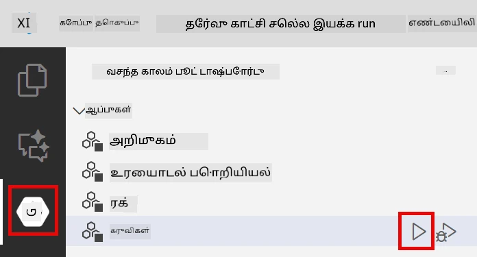
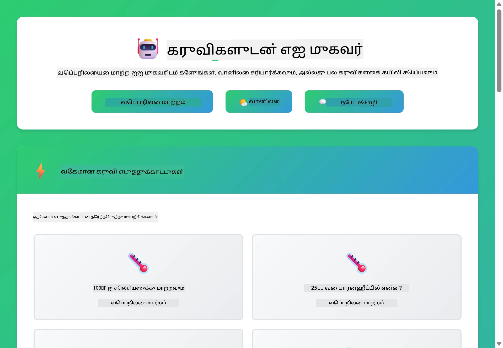
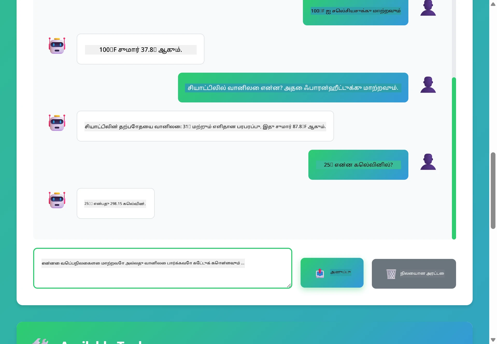

# Module 04: கருவிகளுடன் AI முகவர்கள்

## உள்ளடக்கக் குறிப்பு

- [வீடியோ நடைமுறை](#வீடியோ-நடைமுறை)
- [நீங்கள் கற்றுக்கொள்ளும் விஷயங்கள்](#நீங்கள்-கற்றுக்கொள்ளும்-விஷயங்கள்)
- [முன் தேவைகள்](#முன்-தேவைகள்)
- [கருவிகளுடன் AI முகவர்களைப் புரிந்துகொள்ளுதல்](#கருவிகளுடன்-ai-முகவர்களைப்-புரிந்துகொள்ளுதல்)
- [கருவி அழைப்பு எப்படி வேலை செய்கிறது](#கருவி-அழைப்பு-எப்படி-வேலை-செய்கிறது)
  - [கருவி வரையறைகள்](#கருவி-வரையறைகள்)
  - [ முடிவெடுக்கும் செயல்முறை](#முடிவெடுக்கும்-செயல்முறை)
  - [நிறைவு](#நிறைவு)
  - [பதில் உருவாக்கம்](#பதில்-உருவாக்கம்)
  - [வாசல் கட்டமைப்பு: ஸ்பிரிங் பூட் தானாக இணைத்தல்](#வாசல்-கட்டமைப்பு-ஸ்பிரிங்-பூட்-தானாக-இணைத்தல்)
- [கருவி சங்கிலி](#கருவி-சங்கிலி)
- [விணைத்தளம் இயக்கவும்](#விணைத்தளம்-இயக்கவும்)
- [விணைத்தளம் பயன்படுத்துதல்](#பயன்பாட்டைப்-பயன்படுத்துதல்)
  - [எளிய கருவி பயன்பாடு முயற்சிக்கவும்](#எளிய-கருவி-பயன்பாட்டை-முயற்சி-செய்க)
  - [கருவி சங்கிலியை சோதிக்கவும்](#கருவி-சங்கிலி-சோதனை-செய்யுங்கள்)
  - [உரையாடல் ஓட்டத்தை காணவும்](#உரையாடல்-ஓட்டத்தை-பார்க்கவும்)
  - [வித்தியாசமான கோரிக்கைகளுடன் முயற்சி செய்யவும்](#வேறுபட்ட-கோரிக்கைகளை-முயற்சி-செய்யுங்கள்)
- [முக்கிய கருத்துக்கள்](#முக்கியக்-கொள்கைகள்)
  - [ReAct ரூபம் (காரணம் மற்றும் செயல்)](#react-மாதிரி-கருத்து-விளக்கம்-மற்றும்-செயல்பாடு)
  - [கருவி விளக்கங்கள் முக்கியம்](#கருவி-விளக்கங்கள்-முக்கியம்)
  - [அமர்வு மேலாண்மை](#அமர்வு-மேலாண்மை)
  - [பிழை கையாளுதல்](#பிழை-கையாளுதல்)
- [கிடைக்கும் கருவிகள்](#கிடைக்கும்-கருவிகள்)
- [எப்பொழுது கருவி அடிப்படையிலான முகவர்களைப் பயன்படுத்த வேண்டும்](#கருவி-அடிப்படையிலான-முகவர்களை-எப்போது-பயன்படுத்துவது)
- [கருவிகள் vs RAG](#கருவிகள்-vs-rag)
- [அடுத்து என்ன செய்ய வேண்டும்](#அடுத்த-படிகள்)

## வீடியோ நடைமுறை

இந்த தொகுதியில் எப்படி தொடங்குவது என்று விளக்கும் நேரடி அமர்வை பாருங்கள்:

<a href="https://www.youtube.com/watch?v=O_J30kZc0rw"></a>

## நீங்கள் கற்றுக்கொள்ளும் விஷயங்கள்

இதுவரை, நீங்கள் AI உடன் உரையாடல்கள் நடத்துவது, தொடக்கங்களை சீரமைப்பது, மற்றும் உங்கள் ஆவணங்களில் பதில்களை அடிப்படையாக்கொள்ளுவது பற்றி கற்றுக்கொண்டுள்ளீர்கள். ஆனால் அங்கு ஒரு அடிப்படையான எல்லை உள்ளது: மொழி மாதிரிகள் வெறும் உரை உருவாக்கக் கூடியவை. அவை வானிலை பராமரிக்க முடியாது, கணக்கீடுகளை செய்ய முடியாது, தரவுத்தளங்களை விசாரிக்க முடியாது, அல்லது வெளிப்புற கணினி அமைப்புகளுடன் தொடர்பு கொள்வதில் இயலாது.

கருவிகள் இதைத்தவிர்க்கின்றன. மாதிரிக்கு அழைக்கக்கூடிய செயல்பாடுகளை அளிப்பதால், நீங்கள் அதை உரை உருவாக்கியவராக இருந்ததை செயல்கள் மேற்கொள்ளக்கூடிய முகவராக மாற்றுகிறீர்கள். மாதிரி எப்போது கருவி தேவை, எந்த கருவி பயன்படுத்த வேண்டும், மற்றும் எந்த அளவுருக்களை அனுப்ப வேண்டும் என்பதை பரிசீலித்து தீர்மானிக்கிறது. உங்கள் குறியீடு செயல்பாட்டை இயக்கி முடிவைத் திருப்பக்கூறும். மாதிரி அந்த முடிவை தனது பதிலில் சேர்க்கிறது.

## முன் தேவைகள்

- [Module 01 - அறிமுகம்](../01-introduction/README.md) பூர்த்தி செய்திருக்க வேண்டும் (Azure OpenAI வளங்கள் அமைக்கப்பட்டுள்ளன)
- முன் தொகுதிகள் பரிந்துரைக்கப்பட்டுள்ளன (இந்த தொகுதி [RAG கருத்துக்களை Module 03](../03-rag/README.md) இல் Tools vs RAG ஒப்பீட்டில் குறிப்பிடுகிறது)
- ரூட் கோப்புறையில் Azure அங்கீகாரங்களுடன் `.env` கோப்பு இருக்க வேண்டும் (Module 01 இல் `azd up` கோம் உருவாக்கியது)

> **குறிப்பு:** நீங்கள் Module 01 ஐ இன்னும் பூர்த்தி செய்யவில்லை என்றால், முதலில் அங்கு உள்ள நிரப்பும் வழிமுறைகளைக் கடைபிடிக்கவும்.

## கருவிகளுடன் AI முகவர்களைப் புரிந்துகொள்ளுதல்

> **📝 குறிப்பு:** இந்த தொகுதியில் "முகவர்கள்" என்றால் கருவி அழைக்கக் கூடிய திறன்களுடன் மேம்படுத்தப்பட்ட AI உதவியாளர்களை குறிக்கிறது. இது [Module 05: MCP](../05-mcp/README.md) இல் பார்க்கப்படும் **Agentic AI** வடிவமைப்புகளுக்குப் புறம்பாகும் (தன்னாட்சி முகவர்கள் திட்டமிடல், நினைவு மற்றும் பல-படிநிலைக் காரணப்பிரகடனம் உடையவர்கள்).

கருவிகள் இல்லாமல், ஒரு மொழி மாதிரி அதன் பயிற்சி தரவிலிருந்து வெறும் உரை உருவாக்க முடியும். தற்போதைய வானிலை என்ன என்று கேட்கும் போது அது ஊகிக்க முயல வேண்டும். கருவிகளை வழங்கினால், அது வானிலை API ஐ அழைக்க முடியும், கணக்கீடுகளை செய்யும், அல்லது தரவுத்தளத்தை விசாரிக்கும் — அப்பொழுது அந்த உண்மை முடிவுகளை தனது பதிலில் நெய்துவைக்கிறது.


*கருவிகள் இல்லாத போது மாதிரி ஊகிக்க வேண்டியிருக்கும் — கருவிகளுடன் அது API களை அழைக்க, கணக்கீடுகளை இயக்க, மற்றும் நேரடி தரவை திருப்ப முடியும்.*

கருவிகளுடன் AI முகவர் **காரணம் மற்றும் செயல் (ReAct)** ரூபத்தை பின்பற்றுகிறது. மாதிரி வெறும் பதில் கொடுப்பதல்ல — அது என்ன தேவை என்பதை சிந்திக்கிறது, கருவியை அழைக்கும் மூலம் செயல்படுகிறது, முடிவைப் பார்வையிடுகிறது, பின்னர் மீண்டும் செயல்பட வேண்டுமா அல்லது இறுதி பதிலை வழங்க வேண்டுமா எனத் தீர்மானிக்கிறது:

1. **காரணம்** — முகவர் பயனரின் கேள்வியை பகுப்பாய்வு செய்து தேவையான தகவலை தீர்மானிக்கிறது
2. **செயல்** — முகவர் சரியான கருவியை தேர்ந்தெடுத்து, சரியான அளவுருக்களை உருவாக்கி அதை அழைக்கிறது
3. **பார்வை** — முகவர் கருவி வெளியீட்டை பெற்றுப் பார்வையிடுகிறது
4. **மீண்டும் செய்யவும் அல்லது பதில் அளிக்கவும்** — மேலும் தரவு தேவைப்பட்டால், முகவர் மீண்டும் அதே செயலை மேற்கொள்கிறது; இல்லையென்றால் இயல்பான மொழி பதிலை உருவாக்குகிறது


*ReAct சுற்று — முகவர் என்ன செய்யவேண்டும் என்பதில் காரணம் காண்கிறது, கருவியை அழைத்து செயல் படுகிறது, முடிவைப் பார்வையிடுகிறது, மற்றும் இறுதி பதில் தொழில்முறை முறையில் வழங்கும் வரை சுற்றுகிறது.*

இதன் செயல் தானாக நடக்கிறது. நீங்கள் கருவிகள் மற்றும் அவற்றின் விளக்கங்களை வரையறுத்து விடுகிறீர்கள். மாதிரி அவற்றைக் எப்போது மற்றும் எப்படி பயன்படுத்துவது என்பதை தீர்மானிக்கிறது.

## கருவி அழைப்பு எப்படி வேலை செய்கிறது

### கருவி வரையறைகள்

[WeatherTool.java](../../../04-tools/src/main/java/com/example/langchain4j/agents/tools/WeatherTool.java) | [TemperatureTool.java](../../../04-tools/src/main/java/com/example/langchain4j/agents/tools/TemperatureTool.java)

நீங்கள் தெளிவான விளக்கங்களும் அளவுரு விவரங்களும் உடன் செயல்பாடுகளை வரையறுக்கிறீர்கள். மாதிரி இந்த விளக்கங்களை தனது அமைப்பு தொடக்கத்தில் பார்த்து ஒவ்வொரு கருவியும் என்ன செய்கிறது என்பதைப் புரிந்து கொள்கிறது.

```java
@Component
public class WeatherTool {
    
    @Tool("Get the current weather for a location")
    public String getCurrentWeather(@P("Location name") String location) {
        // உங்கள் வானிலை தேடல் தர்க்கம்
        return "Weather in " + location + ": 22°C, cloudy";
    }
}

@AiService
public interface Assistant {
    String chat(@MemoryId String sessionId, @UserMessage String message);
}

// Spring Boot மூலம் உதவியாளர் தானாக இணைக்கப்பட்டுள்ளது:
// - ChatModel பீன்
// - @Component வகுப்புகளின் அனைத்து @Tool முறைமைகள்
// - அமர்வு மேலாண்மைக்கான ChatMemoryProvider
```

பின்வரும் படத்தில் ஒவ்வொரு குறிப்பும் உட்படப்படுவது மற்றும் AI க்கு எப்போது கருவியை அழைக்கவும் எந்த அளவுருக்களை அனுப்பவும் உதவும் வழி காட்டப்படுகிறது:


*கருவி வரையறையின் அமைப்பு — @Tool AI க்கு எப்போது பயன்படுத்த வேண்டும் என்பதைக் குறிப்பிடுகிறது, @P ஒவ்வொரு அளவுருவையும் விளக்குகிறது, மற்றும் @AiService மூலம் அனைத்து பகுதியும் துவக்கத்தில் இணைக்கப்படுகிறது.*

> **🤖 [GitHub Copilot](https://github.com/features/copilot) மொழிபெயர்ப்புடன் முயற்சி செய்யவும்:** [`WeatherTool.java`](../../../04-tools/src/main/java/com/example/langchain4j/agents/tools/WeatherTool.java) கோப்பை திறந்து கேளுங்கள்:
> - "நிஜ வானிலை API(OpenWeatherMap) யை மாதிரி தரவின் பதிலாக ஒருங்கிணைக்க எப்படி செய்மாறு செய்வேன்?"
> - "AI அதைப் பயன்படுத்த தயார் செய்து உதவும் நல்ல கருவி விளக்கம் எப்படி இருக்க வேண்டும்?"
> - "API பிழைகள் மற்றும் வீதக்கட்டுப்பாடுகளை எவ்வாறு கருவி நடைமுறையில் கையாள வேண்டும்?"

### முடிவெடுக்கும் செயல்முறை

பயனர் "Seattle இல் வானிலை என்ன?" என்று கேட்டால், மாதிரி தற்செயலாக கருவியை தேர்ந்தெடுக்கவில்லை. அது பயனர் நோக்கத்தை ஒவ்வொரு கருவி விளக்கத்துடன் ஒப்பிட்டு, பொருத்தத்தின்படி மதிப்பெண்கள் அளித்து சிறந்த பொருத்தம் உள்ள கருவியை தேர்ந்தெடுக்கிறது. பின்னர் சரியான அளவுருக்களுடன் கட்டமைக்கப்பட்ட செயல்பாடு அழைப்பை உருவாக்குகிறது — இந்நிலையில் `location` ஐ `"Seattle"` ஆக அமைக்கிறது.

பயனரின் கோரிக்கைக்கு பொருத்தமான கருவி இல்லையெனில், மாதிரி தனது சொந்த அறிவிலிருந்து பதிலளிக்கத் திரும்பி செய்கிறது. பல கருவிகள் பொருந்தினால், மிகவும் தனிப்பட்டதை தேர்ந்தெடுக்கிறது.


*மாதிரி ஒவ்வொரு கிடைக்கும் கருவியையும் பயனர் நோக்கத்திற்க்கு ஒப்பிட்டு மதிப்பிடுகிறது மற்றும் சிறந்த பொருத்தத்தைக் தேர்ந்தெடுக்கிறது — அதுக்காக தெளிவான, குறிப்பிட்ட கருவி விளக்கங்கள் எழுதுவது முக்கியம்.*

### நிறைவு

[AgentService.java](../../../04-tools/src/main/java/com/example/langchain4j/agents/service/AgentService.java)

ஸ்பிரிங் பூட் `@AiService` இடைமுகத்துடன் அனைத்து பதிவு செய்யப்பட்ட கருவிகளையும் தானாக இணைக்கிறது, மற்றும் LangChain4j கருவி அழைப்புகளை தானாக இயக்குகிறது. பின்னணி நிகழ்வில், பூரண கருவி அழைப்புச் செயல்முறை ஆறு படிகளாக நடைபெறும் — பயனரின் இயல்பான மொழி கேள்வியிலிருந்து இயல்பான மொழி பதிலுக்கு:


*முழுமையான ஓட்டம் — பயனர் கேள்வி கேட்கிறது, மாதிரி கருவியை தேர்ந்தெடுக்கிறது, LangChain4j அதை இயக்குகிறது, மற்றும் மாதிரி முடிவை இயல்பான பதிலில் நெய்துவைக்கிறது.*

பின்னணியில், `AiServices` எளிமையான `Calculator` கருவிக்கு கருவி அழைப்புச் சுற்றை இயக்குகிறது. கீழேயுள்ள தொடர் வரைபடம் பின்னணியில் என்ன நடக்கிறது என்பதை தெளிவாக காட்டுகிறது:


*கருவி அழைப்புச் சுற்று — `AiServices` உங்கள் செய்தி மற்றும் கருவி விதிகளைக் LLMக்கு அனுப்புகிறது, LLM பதிலாக `add(42, 58)` போன்ற செயல்பாடு அழைப்பை அனுப்புகிறது, LangChain4j உள்ளூராக `Calculator` முறையை இயக்குகிறது, முடிவை இறுதி பதிலுக்காக மீண்டும் LLMக்கு அனுப்புகிறது.*

> **🤖 [GitHub Copilot](https://github.com/features/copilot) மொழிபெயர்ப்புடன் முயற்சி செய்யவும்:** [`AgentService.java`](../../../04-tools/src/main/java/com/example/langchain4j/agents/service/AgentService.java) கோப்பை திறந்து கேளுங்கள்:
> - "ReAct ரூபம் எப்படி வேலை செய்கிறது, அது AI முகவர்களுக்கு ஏன் விளைவாக உள்ளது?"
> - "முகவர் எந்த கருவியை எப்போது, எந்த வரிசையில் பயன்படுத்த வேண்டும் என்று எப்படி தீர்மானிக்கிறது?"
> - "ஒரு கருவி செயலாக்கம் தோல்வியடைந்தால் என்ன நடக்கும் - பிழைகளை வலுவாக எப்படி கையாள வேண்டும்?"

### பதில் உருவாக்கம்

மாதிரி வானிலை தரவை பெற்றுக் கொள்கிறது மற்றும் பயனருக்கான இயல்பான மொழி பதிலாக வடிவமைக்கிறது.

### வாசல் கட்டமைப்பு: ஸ்பிரிங் பூட் தானாக இணைத்தல்

இந்த தொகுதி LangChain4j இன் ஸ்பிரிங் பூட் ஒருங்கிணைப்பைப் பயன்படுத்து, `@AiService` அறிவிப்புடன் இடைமுகங்களை பயன்படுத்துகிறது. துவக்கத்தில் ஸ்பிரிங் பூட் ஒவ்வொரு `@Component` இல் உள்ள `@Tool` முறைகளை, உங்கள் `ChatModel` மற்றும் `ChatMemoryProvider` ஐ கண்டறிந்து, அவற்றை ஓர் ஒருங்கிணைந்த `Assistant` இடைமுகமாக இணைக்கிறது.


*`@AiService` இடைமுகம் ChatModel, கருவி கூறுகள், நினைவக வழங்குநரை இருவதை ஒருங்கிணைக்கிறது — ஸ்பிரிங் பூட் அனைத்தையும் தானாக இணைக்கிறது.*

இது அபிப்ராய வட்டடியில் முழு கோரிக்கை ஓட்டத்தை காட்டுகிறது — HTTP கோரிக்கையிலிருந்து கட்டுப்பாட்டு, சேவை மற்றும் தானாக இணைக்கப்பட்ட பிரதிநிதி வழியாக கருவி செயலாக்கம் வரையிலான தொடர்ச்சிப் படமாக:


*முழு ஸ்பிரிங் பூட் கோரிக்கை உயிர்வட்டம் — HTTP கோரிக்கை கட்டுப்பாடு மற்றும் சேவையில் இருந்து தானாக இணைக்கப்பட்ட உதவியாளர் பிரதிநிதி வரைச் செல்லும், இது LLM மற்றும் கருவி அழைப்புகளை தானாக ஒருங்கிணைக்கிறது.*

இந்த அணுகுமுறையின் முக்கிய நன்மைகள்:

- **ஸ்பிரிங் பூட் தானாக இணைத்தல்** — ChatModel மற்றும் கருவிகள் தானாக இறக்குமதி செய்யப்படுகின்றன
- **@MemoryId ரூபம்** — தானாக அமர்வு அடிப்படையிலான நினைவக மேலாண்மை
- **ஏகக காரிய சிருஷ்டி** — சிறந்த செயல்திறனுக்காக உதவியாளர் ஒருமுறை உருவாக்கப்பட்டு மீண்டும் பயன்படுத்தப்படுகிறது
- **வகை-பாதுகாப்பான நிறைவு** — ஜாவா முறைகள் நேரடியாக வகை மாற்றத்துடன் அழைக்கப்படுகின்றன
- **பல-தூர ஒழுங்குமுறை** — கருவி சங்கிலியை தானாக கையாள்கிறது
- **பூஜ்ய கைமுறை** — கையால் `AiServices.builder()` அழைப்பும் நினைவக ஹாஷ்மேப்பும் தேவை இல்லை

மரபுவழி அணுகுமுறைகள் (`AiServices.builder()` கையால்) அதிக குறியீடு தேவைப்படும் மற்றும் ஸ்பிரிங் பூட் ஒருங்கிணைப்பு நன்மைகள் இழக்கப்படும்.

## கருவி சங்கிலி

**கருவி சங்கிலி** — பல கருவிகள் தேவைப்படும் ஒரே கேள்விக்குப்பயன்மிக்க சக்தி வெளிக்காட்சியாகும். "Seattle இல் வெப்ப நிலை ஃபாரன்ஹீட்டில் என்ன?" என்று கேளுங்கள், முகவர் தானாக இரண்டு கருவிகளை சங்கிலி செய்கிறது: முதலில் `getCurrentWeather` ஐ அழைத்து செல்சியஸ் வெப்ப நிலையை பெறுகிறது, பின்னர் அந்த மதிப்பை `celsiusToFahrenheit` இற்கு அனுப்பி மாற்றம் செய்துவிடுகிறது — அனைத்தும் ஒரே உரையாடல் சுற்றில்.


*கருவி சங்கிலி செயல் — முகவர் முதலில் getCurrentWeatherஐ அழைக்கிறான், பின்னர் செல்சியஸ் முடிவை celsiusToFahrenheitக்கு அனுப்பி, கலந்த பதிலை வழங்குகிறான்.*

**மென்மையான தோல்விகள்** — மாதிரி தரவில் இல்லாத நகரத்தின் வானிலை கேட்கவும். கருவி பிழை செய்தி திருப்பும், AI அது உதவ முடியாது என்று விளக்குகிறது; முற்றிலும் செயல்பாட்டை பாதிப்பதில்லை. கீழ்க்காணும் படத்தில், முறையான பிழை கையாளுதலுடன் முகவர் பிழையை பிடித்து விளக்கமளிப்பதை, இல்லையேல் முழு பயன்பாடு கிழிக்கிறதை ஒப்பிடுகிறது:


*ஒரு கருவி தோல்வியடைந்தால், முகவர் பிழையை பிடிக்கிறது மற்றும் பயன்பாடு கிழிப்பதை தவிர்த்து உதவிகரமான விளக்கம் அளிக்கிறது.*

இது ஒரே உரையாடல் சுற்றில் நடக்கிறது. முகவர் பல கருவி அழைப்புகளை சுயமாக ஒருங்கிணைக்கிறது.

## விணைத்தளம் இயக்கவும்

**அமைப்பை உறுதிசெய்யவும்:**

Module 01 இல் உருவாக்கப்பட்ட Azure அங்கீகாரங்களுடன் ரூட் கோப்புறையில் `.env` கோப்பு இருக்க வேண்டும். இந்த தொகுதி கோப்புறையிலிருந்து (`04-tools/`) இயக்கவும்:

**Bash:**
```bash
cat ../.env  # AZURE_OPENAI_ENDPOINT, API_KEY, DEPLOYMENT காட்டு வேண்டும்
```

**PowerShell:**
```powershell
Get-Content ..\.env  # AZURE_OPENAI_ENDPOINT, API_KEY, DEPLOYMENT காட்ட வேண்டும்
```

**விணைத்தளத்தை தொடங்கவும்:**

> **குறிப்பு:** நீங்கள் ரூட் கோப்புறையிலிருந்து `./start-all.sh` மூலம் அனைத்து பயன்பாடுகளையும் ஏற்கனவே தொடங்கியிருந்தால் (Module 01 இல் விளக்கப்பட்டபடி), இந்த தொகுதி ஏற்கனவே 8084 போர்ட்-ல் இயங்கும். கீழ்க்காணும் தொடக்கம் கட்டளைகளை தவிர்க்கவும் மற்றும் நேர்முகமாக http://localhost:8084 செல்லவும்.

**விருப்பம் 1: ஸ்பிரிங் பூட் டாஷ்போர்டு பயன்படுத்துதல் (VS Code பயனர்களுக்கு பரிந்துரை செய்யப்படுகிறது)**

Dev container இல் ஸ்பிரிங் பூட் டாஷ்போர்டு விரிவீடு உள்ளடக்கம் உள்ளது, இது அனைத்து ஸ்பிரிங் பூட் பயன்பாடுகளையும் காண நேரடி இடைமுகத்தை வழங்குகிறது. VS Code இன் இடது Activity Bar இல் ஸ்பிரிங் பூட் ஐகானை காணலாம்.

ஸ்பிரிங் பூட் டாஷ்போர்டிலிருந்து நீங்கள் செய்யக்கூடியவை:
- பணியிடத்தில் உள்ள அனைத்து ஸ்பிரிங் பூட் பயன்பாடுகளையும் பார்க்கலாம்
- ஒரே கிளிக்கில் பயன்பாடுகளை துவக்க/நிறுத்தலாம்
- பயன்பாட்டு பதிவு (லக்கள்) முற்றிலும் நேரடியாகக் காணலாம்
- பயன்பாட்டு நிலையை கண்காணிக்கலாம்

இயக்க பத்தி அருகே உள்ள பிளே பொத்தானை கிளிக் செய்து இந்த தொகுதியைத் தொடங்கலாம், அல்லது அனைத்து தொகுதிகளையும் ஒரே நேரத்தில் துவங்கலாம்.

இதோ VS Code இல் ஸ்பிரிங் பூட் டாஷ்போர்டு எப்படி தெரிகிறது:


*VS Code-இல் Spring Boot டாஷ்போர்டு — எல்லா மொட்யூல்களையும் ஒரு இடத்தில் துவக்கவும், நிறுத்தவும், கண்காணிக்கவும்*

**விருப்பம் 2: ஷெல்ல் ஸ்கிரிப்ட்கள் பயன்படுத்துதல்**

எல்லா வலை பயன்பாடுகளையும் துவங்கவும் (மொட்யூல்கள் 01-04):

**Bash:**
```bash
cd ..  # ரூட் அடைவைத் தொடங்கி
./start-all.sh
```

**PowerShell:**
```powershell
cd ..  # ரூட் கோப்புறையிலிருந்து
.\start-all.ps1
```

அல்லது இந்த மொட்யூல் மட்டும் துவங்கவும்:

**Bash:**
```bash
cd 04-tools
./start.sh
```

**PowerShell:**
```powershell
cd 04-tools
.\start.ps1
```

இரு ஸ்கிரிப்ட்களும் மூலம் `.env` கோப்பிலிருந்து சுற்றுச் சூழல் மாறிலிகளை தானாக ஏற்றும் மற்றும் JARகள் இல்லாவிட்டால் அவைகளை கட்டும்.

> **குறிப்பு:** துவங்குவதற்கு முன் அனைத்து மொட்யூல்களையும் கையேடு முறையில் கட்ட விரும்பினால்:
>
> **Bash:**
> ```bash
> cd ..  # Go to root directory
> mvn clean package -DskipTests
> ```
>
> **PowerShell:**
> ```powershell
> cd ..  # Go to root directory
> mvn clean package -DskipTests
> ```

உங்கள் உலாவியில் http://localhost:8084 ஐ திறக்கவும்.

**நிறுத்த:**

**Bash:**
```bash
./stop.sh  # இந்த தொகுதி மட்டும்
# அல்லது
cd .. && ./stop-all.sh  # அனைத்து தொகுதிகளும்
```

**PowerShell:**
```powershell
.\stop.ps1  # இந்த தொகுதி மட்டும்
# அல்லது
cd ..; .\stop-all.ps1  # அனைத்து தொகுதிகள்
```

## பயன்பாட்டைப் பயன்படுத்துதல்

பயன்பாடு ஒரு வலை இடைமுகத்தை வழங்குகிறது, அங்கு நீங்களும் வானிலை மற்றும் வெப்பமதிப்பீடு கருவிகளுக்கு அணுகல் உடைய ஒரு AI முகவரியுடன் தொடர்பு கொள்ள முடியும். இடைமுகம் இதோத் தோற்றம் கொண்டுள்ளது — இதில் விரைவு துவக்க உதாரணங்களும் கோரிக்கைகளை அனுப்புவதற்கான உரையாடல் பலகையும் உள்ளது:

<a href="images/tools-homepage.png"></a>

*AI முகவர் கருவிகள் இடைமுகம் - விரைவு உதாரணங்கள் மற்றும் கருவிகளுடன் தொடர்பு கொள்ள உரையாடல் இடைமுகம்*

### எளிய கருவி பயன்பாட்டை முயற்சி செய்க

எளிய கோரிக்கையுடன் துவங்குங்கள்: "100 டிகிரி பாரன்ஹீட்-ஐ செல்சியஸுக்கு மாற்று". முகவர் வெப்பமதிப்பீடு கருவி தேவை என்று அடையாளம் காண்கிறது, சரியான பரிமாற்றங்களுடன் அதை அழைக்கிறது மற்றும் முடிவை திருப்புகிறது. இது எவ்வளவு இயல்பான அனுபவம் என்பதை கவனியுங்கள் - நீங்கள் எந்த கருவியை பயன்படுத்துவது அல்லது அதை எப்படி அழைப்பது என்று குறிப்பிடவில்லை.

### கருவி சங்கிலி சோதனை செய்யுங்கள்

இப்போது சற்று சிக்கலானதை முயற்சி செய்யுங்கள்: "சியாட்டிலை வானிலை என்ன, அதை பாரன்ஹீட்டுக்கு மாற்றவும்?". முகவர் இதை படிகளாகச் செய்கிறது. முதலில் வானிலை (செல்சியஸ் திருப்புகிறது) பெறுகிறது, பாரன்ஹீตรுக்கு மாற்ற வேண்டும் என்று கண்டுபிடிக்கிறது, மாற்று கருவியை அழைக்கிறது, மற்றும் இரு முடிவுகளையும் ஒன்றாக சேர்க்கிறது.

### உரையாடல் ஓட்டத்தை பார்க்கவும்

உரையாடல் இடைமுகம் உரையாடல் வரலாற்றை பராமரிக்கிறது, இதனால் நீங்கள் பல முறை தொடர்புகளை நிகழ்த்தலாம். முன்்பு அனைத்து கேள்விகளையும் பதில்களையும் காணலாம், உரையாடலை பின்பற்றவும் முகவர் பல முறை பரிமாற்றங்களில் சந்தர்ப்பத்தை எவ்வாறு உருவாக்குகிறதென்பதை புரிந்து கொள்ளவும் இது உதவுகிறது.

<a href="images/tools-conversation-demo.png"></a>

*எளிய மாற்றங்கள், வானிலை தேடல்கள் மற்றும் கருவி சங்கிலி ஆகியவற்றைக் காட்டும் பல முறை உரையாடல்*

### வேறுபட்ட கோரிக்கைகளை முயற்சி செய்யுங்கள்

பல்வேறு கலவைகளை முயற்சி செய்யுங்கள்:
- வானிலை தேடல்கள்: "டோக்கியோவில் வானிலை என்ன?"
- வெப்ப மாற்றங்கள்: "25°C என்பது கேல்வினில் என்ன?"
- கூட்டு கேள்விகள்: "பாரிஸில் வானிலை சரிபார்க்கவும், அது 20°Cக்கு மேல் என்றால் சொல்லவும்"

முகவர் இயற்கை மொழியை எவ்வாறு புரிந்து கொண்டு பொருத்தமான கருவி அழைப்புகளுக்கு மாற்றுகிறதோ கவனியுங்கள்.

## முக்கியக் கொள்கைகள்

### ReAct மாதிரி (கருத்து விளக்கம் மற்றும் செயல்பாடு)

முகவர் முடிவெடுக்கும் (எதை செய்ய வேண்டும்) மற்றும் செயல்படும் (கருவிகளை பயன்படுத்தும்) இடையே மாறி செயல்படுகிறார். இந்த மாதிரி தன்னாட்சி பிரச்சனை தீர்க்குதலை இயக்குகிறது, மறு உத்தரவ்களைப் பதிலளிப்பதில்லை.

### கருவி விளக்கங்கள் முக்கியம்

உங்கள் கருவி விளக்கங்களின் தரம் முகவர் அவற்றை எவ்வாறு பயன்படுத்துவதை நேரடியாக பாதிக்கிறது. தெளிவான, குறிப்பிட்ட விளக்கங்கள் மாதிரியை எப்போது, எப்படி ஒவ்வொரு கருவியையும் அழைக்க வேண்டும் என்பதைப் புரிந்து கொள்ள உதவுகிறது.

### அமர்வு மேலாண்மை

`@MemoryId` குறிப்பு தானாக அமர்வு அடிப்படையிலான நினைவக மேலாண்மையை இயக்கு சத்தியமாக உள்ளது. ஒவ்வொரு அமர்விற்கும் தனித்த `ChatMemory` உதவிக்குறிப்பு உள்ளது, இது `ChatMemoryProvider` பீனால் மேலாண்மை செய்யப்படுகிறது, எனவே பல பயனர்கள் ஒரே நேரத்தில் முகவருடன் கலந்துரையாடலாம் ஆனால் அவர்களது உரையாடல்கள் கலந்துகொள்ளாது. கீழுள்ள வரைபடம் அவற்றை காட்டுகிறது:


*ஒவ்வொரு அமர்வு ஐடியும் தனித்த உரையாடல் வரலாறுக்கு சென்றளிக்கப்படுகிறது — பயனர்கள் ஒருவருக்கொருவர் செய்திகளை எப்போதும் காண முடியாது.*

### பிழை கையாளுதல்

கருவிகள் தோல்வி அடைவதுண்டல்லவா — APIகள் நேரம் கடந்துவிடலாம், பரிமாற்றங்கள் தவறாக இருக்கலாம், வெளிப்புற சேவைகள் செயல்படாமல் போகலாம். உற்பத்தி முகவர்களுக்கு பிழை கையாளுதலும் அவசியம், இதனால் மாதிரி பிரச்சனையை விளக்க அல்லது மாற்று முயற்சிகளை செய்ய முடியும், முழு பயன்பாடு முற்றிலும் வேலைநிறுத்தப்படாமல். கருவி தவறு ஏற்பட்டால் LangChain4j அதை பிடித்து பிழை செய்தியைக் மாதிரிக்கு திருப்பிவிடுகிறது, அது இனிய மொழியில் பிரச்சனையை விளக்க முடியும்.

## கிடைக்கும் கருவிகள்

கீழேயுள்ள வரைபடம் நீங்கள் கட்டக்கூடிய கருவிகள் பரபரப்பான சூழலை காட்டுகிறது. இந்த மொட்யூல் வானிலை மற்றும் வெப்ப கருவிகளை காட்டுகிறது, ஆனால் அதே `@Tool` மாதிரி எந்த ஜாவா முறைக்கும் பொருந்தும் — தரவுத்தள வினவல்களுக்கு தொடங்கிச் செலுத்துதல் வரை.


*@Tool குறிக்கப்பட்ட எந்த ஜாவா முறை AIக்கு கிடைக்கும் — இந்த மாதிரி தரவுத்தளங்கள், APIகள், மின்னஞ்சல், கோப்பு செயல்பாடுகள் மற்றும் பலவற்றுக்கு நீடிக்கிறது.*

## கருவி அடிப்படையிலான முகவர்களை எப்போது பயன்படுத்துவது

ஒவ்வொரு கோரிக்கையும் கருவிகள் தேவையில்லை. முடிவு AI வெளிப்புற முறைமைகளுடன் தொடர்பு கொள்ள வேண்டுமா அல்லது தனது அறிவிலிருந்து பதிலளிக்க முடியுமா என்பது அடிப்படையில் உறுதிப்படுத்தப்படுகிறது. கீழுள்ள வழிகாட்டி எப்போது கருவிகள் மதிப்பைக் கூட்டுகின்றன மற்றும் எப்போது அவை தேவையற்றவையாக இருக்கின்றன என்பதை சுருக்கமாகக் காட்டுகிறது:


*விரைவு முடிவு வழிகாட்டி — கருவிகள் நேரடி தரவு, கணக்கீடுகள் மற்றும் செயல்கள், பொது அறிவும் படைப்பாற்றலும் தேவையில்லை.*

## கருவிகள் vs RAG

மொட்யூல்கள் 03 மற்றும் 04 இரண்டும் AI திறன்களை விரிவுபடுத்துகின்றன, ஆனால் அடிப்படையில் வேறுபட்ட முறைகளில். RAG மாதிரி **அறிவைப் பெற்று** ஆவணங்களை மீட்டெடுக்கும் சக்தியை அளிக்கிறது. கருவிகள் மாதிரி **செயற்பாடுகளை எடுக்கும்** திறனை வழங்கும். கீழுள்ள வரைபடம் இரு அணுகுமுறைகளையும் ஒப்பிடுகிறது — ஒவ்வொரு பணிமுறையும் எவ்வாறு இயங்குகிறது மற்றும் அவற்றிற்குள்ள முரண்பாடுகள்:


*RAG நிலையான ஆவணங்களில் இருந்து தகவலை மீட்டெடுக்கிறது — கருவிகள் நடவடிக்கைகளை செய்கிறது மற்றும் திடீர், நேரடி தரவை எடுக்கிறது. பல உற்பத்தி முறைமைகள் இரண்டையும் இணைக்கின்றன.*

வாஸ்தவத்தில், பல உற்பத்தி முறைமைகள் இரண்டையும் சேர்த்து பயன்படுத்துகின்றன: RAG உங்கள் ஆவணத்தில் பதில்களை நிலைப்படுத்த, கருவிகள் நேரடி தரவை பெற அல்லது செயல்பாடுகளைச் செய்ய.

## அடுத்த படிகள்

**அடுத்த மொட்யூல்:** [05-mcp - மாடல் உருவக்கூறு நடைமுறை (MCP)](../05-mcp/README.md)

---

**நெவிகேஷன்:** [← முந்தையது: மொட்யூல் 03 - RAG](../03-rag/README.md) | [முதல் பக்கத்திற்கு](../README.md) | [அடுத்து: மொட்யூல் 05 - MCP →](../05-mcp/README.md)

---

<!-- CO-OP TRANSLATOR DISCLAIMER START -->
**மறுப்பு**:
இந்த ஆவணம் AI மொழிபெயர்ப்பு சேவை [Co-op Translator](https://github.com/Azure/co-op-translator) பயன்படுத்தி மொழிபெயர்க்கப்பட்டுள்ளது. நாங்கள் துல்லியத்திற்காக முயற்சி செய்துள்ளோம், ஆனால் தானாக செய்யப்படும் மொழிபெயர்ப்புகளில் பிழைகள் அல்லது தவறுகள் இருக்கலாம் என்பதை கவனத்தில் கொள்ளவும். அசல் ஆவணம் அதன் தாய்மொழியில் அதிகாரப்பூர்வ ஆதாரமாக கருதப்பட வேண்டும். முக்கியமான தகவல்களுக்கு, தொழில்நுட்பமான மனித மொழிபெயர்ப்பு பரிந்துரைக்கப்படுகிறது. இந்த மொழிபெயர்ப்பைப் பயன்படுத்துவதால் ஏற்படும் எந்த தவறான புரிதல்கள் அல்லது தவறான விளக்கத்திற்கும் நாங்கள் பொறுப்பில்வில்லை.
<!-- CO-OP TRANSLATOR DISCLAIMER END -->