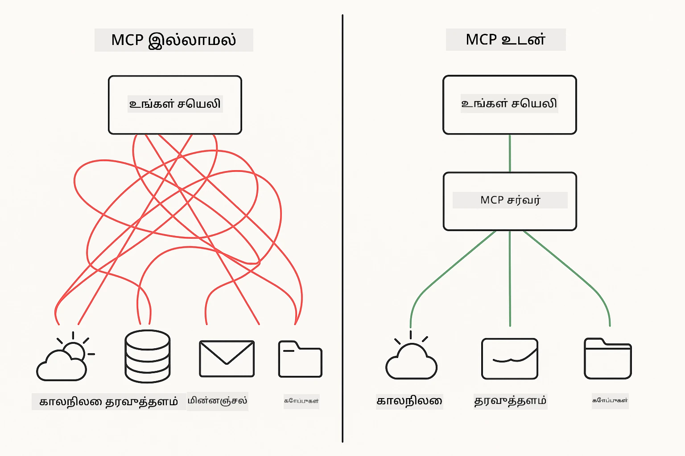
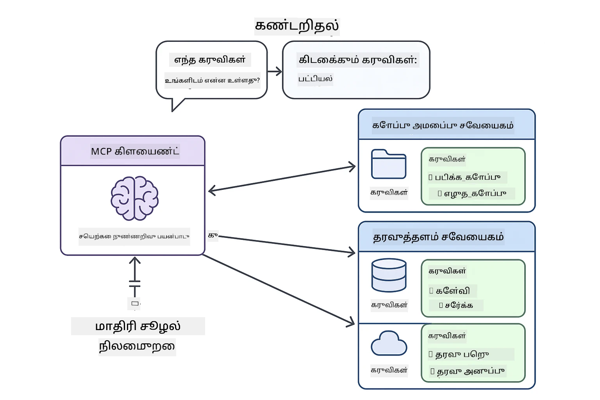
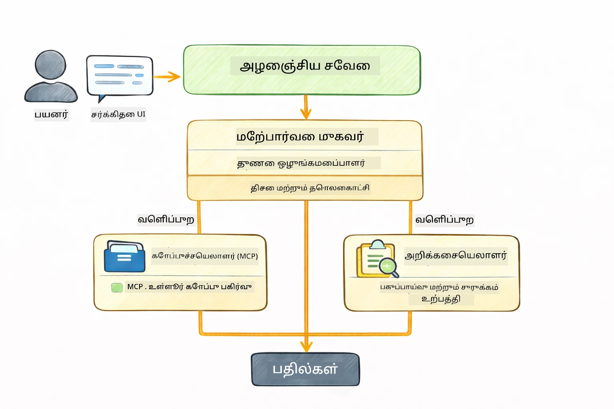

<!--
CO_OP_TRANSLATOR_METADATA:
{
  "original_hash": "6c816d130a1fa47570c11907e72d84ae",
  "translation_date": "2026-01-06T01:54:44+00:00",
  "source_file": "05-mcp/README.md",
  "language_code": "ta"
}
-->
# Module 05: மாதிரி சூழல் முறையியல் (MCP)

## உள்ளடக்க பட்டியல்

- [நீங்கள் கற்கப்போகும் விஷயங்கள்](../../../05-mcp)
- [MCP என்றால் 무엇?](../../../05-mcp)
- [MCP எப்படி செயல்படுகிறது](../../../05-mcp)
- [ஏஜென்டிக் மாட்யூல்](../../../05-mcp)
- [உதாரணங்களை இயக்குவது](../../../05-mcp)
  - [முந்தைய தேவைகள்](../../../05-mcp)
- [விரைவு துவக்கம்](../../../05-mcp)
  - [கோப்பு பணிகள் (Stdio)](../../../05-mcp)
  - [மேற்பார்வையாளர் ஏஜென்ட்](../../../05-mcp)
    - [வெளியீட்டை புரிந்துகொள்வது](../../../05-mcp)
    - [பதிலளிக்கும் முறைகள்](../../../05-mcp)
    - [ஏஜென்டிக் மாட்யூல் அம்சங்களை விளக்கம்](../../../05-mcp)
- [முக்கிய கருத்துக்கள்](../../../05-mcp)
- [வாழ்த்துக்கள்!](../../../05-mcp)
  - [அடுத்ததாக என்ன?](../../../05-mcp)

## நீங்கள் கற்கப்போகும் விஷயங்கள்

நீங்கள் உரையாடல் செயற்கை நுண்ணறிவு (AI) அமைத்துள்ளீர்கள், இயக்குறிகளை நுட்பமாக கையாள்வதில் தேர்ச்சி பெற்றுள்ளீர்கள், பதில்களை ஆவணங்களில் அடிப்படையாக்கொண்டுள்ளீர்கள் மற்றும் கருவிகளுடன் ஏஜென்ட்களை உருவாக்கியுள்ளீர்கள். ஆனால் அந்த அனைத்தும் உங்களுக்கு தனிப்பயனாக உருவாக்கப்பட்ட கருவிகள். யாரும் உருவாக்கிக் கொண்டு பகிரக்கூடிய ஒரு ஒருமுறை வடிவமைக்கப்பட்ட கருவிகளின் சூழலை உங்கள் AIக்கு அணுகலை அளிக்க முடிந்தால் எப்படி? இந்த module இல், Model Context Protocol (MCP) மற்றும் LangChain4j இன் agentic module மூலம் அதை எப்படி செய்வது என்பதை நீங்கள் கற்றுக் கொள்வீர்கள். முதலில் ஒரு எளிய MCP கோப்பு வாசிப்பாளரை காண்பித்து, பிறகு எளிதில் அது மேம்பட்ட agentic பணிசூழல்களில் எப்படி ஒருங்கிணைக்கப்படுகின்றது என்பதை Supervisor Agent வடிவத்தை பயன்படுத்தி காட்டுகிறோம்.

## MCP என்றால் 무엇?

Model Context Protocol (MCP) என்பது சரியாக இதே - AI பயன்பாடுகள் வெளிப்புற கருவிகளை கண்டுபிடித்து பயன்படுத்த ஒரு முறைமையான வழியை வழங்குகிறது. ஒவ்வொரு தரவுத் தூக்கு அல்லது சேவைக்கு தனிப்பயன் ஒருங்கிணைப்புகளை எழுதுவதை தவிர்த்து MCP சர்வர்களை இணைக்கிறீர்கள், அவை தங்களது திறன்களை ஒரே வடிவத்தில் வெளிப்படுத்துகின்றன. உங்கள் AI ஏஜென்ட் தானாகவே அந்த கருவிகளை கண்டுபிடித்து பயன்படுத்த முடியும்.



*MCPக்கு முன்பு: சிக்கலான புள்ளி-புள்ளி ஒருங்கிணைப்புக்கள். MCPக்கு பிறகு: ஒரு முறைமையே, முடிவற்ற வாய்ப்புகள்.*

MCP AI வளர்ச்சியில் அடிப்படை பிரச்சனையை தீர்க்கிறது: ஒவ்வொரு ஒருங்கிணைப்பும் தனிப்பயன். GitHub அணுக வேண்டுமா? தனிப்பயன் குறியீடு. கோப்புகளை வாசிக்க வேண்டுமா? தனிப்பயன் குறியீடு. தரவுத்தளத்தை விசாரிக்க வேண்டுமா? தனிப்பயன் குறியீடு. மேலும், இவை மற்ற AI பயன்பாடுகளுடன் பொருந்தாது.

MCP இதை ஒருமுறை வடிவமைக்கிறது. ஒரு MCP சர்வர் கருவிகளை தெளிவான விளக்கங்கள் மற்றும் வடிவமைப்புகளுடன் வெளிப்படுத்துகிறது. எந்த MCP வாடிக்கையும் இணைத்து, கிடைக்கும் கருவிகளை கண்டுபிடித்து பயன்படுத்த முடியும். ஒருமுறை உருவாக்கி, எங்கும் பயன்படுத்துங்கள்.



*Model Context Protocol கட்டமைப்பு - ஒருமுறை வடிவமைக்கப்பட்ட கருவி கண்டுபிடிப்பு மற்றும் செயல்பாடு*

## MCP எப்படி செயல்படுகிறது

**சர்வர்-வாடிக்கைமை அமைப்பு**

MCP வாடிக்கைமை மற்றும் சர்வர் மாடலை பயன்படுத்துகிறது. சர்வர்கள் கருவிகளை வழங்குகின்றன - கோப்பை வாசிக்க, தரவுத்தளங்களை விசாரிக்க, API களை அழைக்க. வாடிக்கைமை (உங்கள் AI பயன்பாடு) சர்வர்களுடன் தொடர்பு கொண்டு அவர்கள் கருவிகளை பயன்படுத்துகின்றது.

LangChain4j உடன் MCP பயன்படுத்த, இந்த Maven சாரాన్ని சேர்க்கவும்:

```xml
<dependency>
    <groupId>dev.langchain4j</groupId>
    <artifactId>langchain4j-mcp</artifactId>
    <version>${langchain4j.version}</version>
</dependency>
```

**கருவி கண்டுபிடிப்பு**

உங்கள் வாடிக்கைமை MCP சர்வருடன் இணைகையில், "உங்களிடம் எந்த கருவிகள் உள்ளன?" என்று கேட்கிறது. சர்வர் கிடைக்கும் கருவிகளின் பட்டியலை, விளக்கங்கள் மற்றும் அளவுரு வடிவங்கள் உடன் பதிலளிக்கிறது. உங்கள் AI ஏஜென்ட் பின்னர் பயனர் கோரிக்கையின் அடிப்படையில் எந்த கருவிகளைப் பயன்படுத்த வேண்டும் என்று முடிவெடுக்க முடியும்.

**போக்குவரத்து முறைகள்**

MCP பல போக்குவரத்து முறைகளை ஆதரிக்கிறது. இந்த module உள்ளூர் செயல்முறைகள் (Stdio) போக்குவரத்தை காட்டுகிறது:


*MCP போக்குவரத்து முறைகள்: தொலைதூர சர்வர்களுக்கு HTTP, உள்ளூர் செயல்முறைகளுக்கு Stdio*

**Stdio** - [StdioTransportDemo.java](../../../05-mcp/src/main/java/com/example/langchain4j/mcp/StdioTransportDemo.java)

உள்ளூர் செயல்முறைகளுக்கானது. உங்கள் பயன்பாடு சர்வரை subprocess ஆக இடது நிலையாக உருவாக்கி, நிலையான உள்ளீடு/வெளியீடு மூலம் தொடர்பு கொள்கிறது. கோப்பு முறைமை அணுகல் அல்லது கட்டளை வரிசை கருவிகளுக்கு பயனுள்ளதாகும்.

```java
McpTransport stdioTransport = new StdioMcpTransport.Builder()
    .command(List.of(
        npmCmd, "exec",
        "@modelcontextprotocol/server-filesystem@2025.12.18",
        resourcesDir
    ))
    .logEvents(false)
    .build();
```

> **🤖 GitHub Copilot மூலம் முயற்சிக்கவும்:** [`StdioTransportDemo.java`](../../../05-mcp/src/main/java/com/example/langchain4j/mcp/StdioTransportDemo.java) திறந்து கேட்டுப் பார்க்கவும்:
> - "Stdio போக்குவரத்து எப்படி செயல்படுகிறது மற்றும் HTTP விட எப்போது பயன்படுத்த வேண்டும்?"
> - "LangChain4j எப்படி MCP சர்வர் செயல்முறைகளின் உயிர்வாழ்வை கையாள்கிறது?"
> - "AIக்கு கோப்பு முறைமை அணுகலை வழங்குவதன் பாதுகாப்பு விளைவுகள் என்ன?"

## ஏஜென்டிக் மாட்யூல்

MCP ஒருமுறை வடிவமைக்கப்பட்ட கருவிகளை வழங்கினாலும், LangChain4j இன் **agentic module** அந்த கருவிகளை ஒருங்கிணைக்கும் ஏஜெண்ட்களை உருவாக்க ஒரு கூற்றின் மாதிரி வழியை வழங்குகிறது. `@Agent` குறியீட்டு குறிப்பு மற்றும் `AgenticServices` மூலம் நிரல் கட்டளைகள் பதிலாக இடைமுகங்கள் மூலம் ஏஜெண்ட் நடத்தை வரையறுக்க முடியும்.

இந்த module இல், நீங்கள் **Supervisor Agent** வடிவத்தை ஆராய்வீர்கள் - இது மேம்பட்ட agentic AI அணுகல், பயனரின் கோரிக்கையின் அடிப்படையில் எந்த ஒப்பந்த ஏஜெண்ட்களை அழைக்க வேண்டும் என்று “supervisor” ஏஜென்ட் தானாக தீர்மானிக்கிறது. நாங்கள் MCP சக்தியூட்டிய கோப்பு அணுகலை ஒரு துணை ஏஜெண்டுக்கு அளித்து இந்த இரண்டு கருத்துகளை இணைத்துக்கொள்கிறோம்.

agentic module பயன்படுத்த, இந்த Maven சாரத்தை சேர்க்கவும்:

```xml
<dependency>
    <groupId>dev.langchain4j</groupId>
    <artifactId>langchain4j-agentic</artifactId>
    <version>${langchain4j.mcp.version}</version>
</dependency>
```

> **⚠️ பரிசோதனைக் கட்டத்தில்:** `langchain4j-agentic` module **பரிசோதனை நிலையில்** உள்ளது மற்றும் மாற்றங்களுக்கு உட்பட்டது. AI உதவியாளர் உருவாக்க நிலையான வழி `langchain4j-core` மற்றும் தனிப்பயன் கருவிகள்(மாட்யூல் 04) ஆகும்.

## உதாரணங்களை இயக்குவது

### முந்தைய தேவைகள்

- Java 21+, Maven 3.9+
- Node.js 16+ மற்றும் npm (MCP சர்வர்களுக்கு)
- `.env` கோப்பில் சூழல் மாறிலிகள் սահմանிக்கப்பட்டவையாக இருக்க வேண்டும் (மூல அடைவைத் தொடங்கி):
  - `AZURE_OPENAI_ENDPOINT`, `AZURE_OPENAI_API_KEY`, `AZURE_OPENAI_DEPLOYMENT` (மாட்யூல் 01-04 ல் உள்ளவைகளே)

> **குறிப்பு:** நீங்கள் உங்கள் சூழல் மாறிலிகள் அமைக்கவில்லை என்றால், [Module 00 - Quick Start](../00-quick-start/README.md) இல் வழிமுறைகளைப் பாருங்கள், அல்லது `.env.example` ஐ `.env` ஆக மூல அடைவில் பதியவும் மற்றும் உங்கள் மதிப்புகளை செருகவும்.

## விரைவு துவக்கம்

**VS Code பயன்படுத்தும் போது:** எந்தவொரு டெமோ கோப்பிலும் Explorer இல் வலது கிளிக் செய்து **"Run Java"** தேர்ந்தெடுக்கவும் அல்லது பிட்சியுள்ள Run and Debug பலகையில் தொடக்க அமைப்புகளை பயன்படுத்தவும் (முதலில் `.env` கோப்பில் உங்கள் டோக்கன் சேர்க்கப்பட்டிருக்க வேண்டும்).

**Maven பயன்படுத்தும் போது:** கீழ்காணும் உதாரணங்களுடன் கட்டளை வரியில் இயக்கு.

### கோப்பு பணிகள் (Stdio)

இது உள்ளூர் subprocess அடிப்படையுடைய கருவிகளை காட்டுகிறது.

**✅ எந்த முந்தைய தேவையும் இல்லை** - MCP சர்வர் தானாக உருவாக்கப்படுகிறது.

**துவக்க ஸ்கிரிப்ட்கள் ( பரிந்துரைக்கப்படுகிறது):**

துவக்க ஸ்கிரிப்ட்கள் தானாக சூழல் மாறிலிகளை மூல `.env` கோப்பில் இருந்து ஏற்றுகிறது:

**Bash:**
```bash
cd 05-mcp
chmod +x start-stdio.sh
./start-stdio.sh
```

**PowerShell:**
```powershell
cd 05-mcp
.\start-stdio.ps1
```

**VS Code:** `StdioTransportDemo.java` இல் வலது கிளிக் செய்து **"Run Java"** தேர்ந்தெடுக்கவும் (`.env` கோப்பு கட்டமைக்கப்பட்டிருக்கும்).

பயன்பாடு தானாகவே கோப்பு முறைமை MCP சர்வரை உருவாக்கி உள்ளூர் கோப்பை வாசிக்கிறது. subprocess மேலாண்மை எப்படி கையாளப்படுகிறது என்பதை கவனியுங்கள்.

**எதிர்பார்க்கப்படும் வெளியீடு:**
```
Assistant response: The file provides an overview of LangChain4j, an open-source Java library
for integrating Large Language Models (LLMs) into Java applications...
```

### மேற்பார்வையாளர் ஏஜென்ட்

**Supervisor Agent வடிவு** என்பது **நீட்சிய முறைமை** கொண்ட agentic AI ஆகும். ஒரு Supervisor LLM ஐ பயன்படுத்தி பயனரின் கோரிக்கை அடிப்படையில் எந்த ஏஜெண்ட்களை அழைக்க வேண்டும் என்று தானாக முடிவெடுக்கிறது. அடுத்த உதாரணத்தில், MCP சக்தியூட்டிய கோப்பு அணுகலை LLM ஏஜெண்டுடன் இணைத்து மேற்பார்வையாளர் நிர்வகிக்கும் கோப்பு வாசிப்பு → அறிக்கை உருவாக்கல் பணிசூழலை உருவாக்குகிறோம்.

டெமோவில், `FileAgent` MCP கோப்பு முறைமை கருவிகளை பயன்படுத்தி கோப்பை வாசிக்கிறது மற்றும் `ReportAgent` ஒரு நிர்வாகச் சுருக்கம் (1 வாக்கியம்), 3 முக்கிய அம்சங்கள் மற்றும் பரிந்துரைகளுடன் கட்டமைக்கப்பட்ட அறிக்கையை உருவாக்குகிறது. மேற்பார்வையாளர் இந்த பணிசூழலை தானாக ஒருங்கிணைக்கிறது:



```
┌─────────────┐      ┌──────────────┐
│  FileAgent  │ ───▶ │ ReportAgent  │
│ (MCP tools) │      │  (pure LLM)  │
└─────────────┘      └──────────────┘
   outputKey:           outputKey:
  'fileContent'         'report'
```

ஒவ்வொரு ஏஜெண்டும் அதன் வெளியீட்டை **Agentic Scope** (பகிரப்பட்ட நினைவகம்) இல் சேமிக்கிறது, இதனால் பிற ஏஜெண்ட்கள் முந்தைய முடிவுகளை அணுகலாம். இது MCP கருவிகள் எளிதில் agentic பணிசூழல்களில் இணைகின்றது என்பதை காட்டு—மேற்பார்வையாளர் கோப்பு எப்படிச் வாசிக்கபடுகிறது என்பதை அறிய தேவையில்லை, `FileAgent` அதை செய்யக்கூடியது என்பதே போதும்.

#### டெமோ இயக்குதல்

துவக்க ஸ்கிரிப்ட்கள் தானாக சூழல் மாறிலிகளை மூல `.env` கோப்பில் இருந்து ஏற்றுகிறது:

**Bash:**
```bash
cd 05-mcp
chmod +x start-supervisor.sh
./start-supervisor.sh
```

**PowerShell:**
```powershell
cd 05-mcp
.\start-supervisor.ps1
```

**VS Code:** `SupervisorAgentDemo.java` உடன் வலது கிளிக் செய்து **"Run Java"** தேர்ந்தெடுக்கவும் (`.env` கோப்பு அமைக்கப்பட்டிருக்க வேண்டும்).

#### மேற்பார்வையாளர் எப்படி செயல்படுகிறது

```java
// படி 1: FileAgent MCP கருவிகளைப் பயன்படுத்தி கோப்புகளை படிக்கிறது
FileAgent fileAgent = AgenticServices.agentBuilder(FileAgent.class)
        .chatModel(model)
        .toolProvider(mcpToolProvider)  // கோப்பு செயல்பாடுகளுக்கான MCP கருவிகள் உள்ளன
        .build();

// படி 2: ReportAgent அமைந்துள்ள அறிக்கைகளை உருவாக்குகிறது
ReportAgent reportAgent = AgenticServices.agentBuilder(ReportAgent.class)
        .chatModel(model)
        .build();

// மேற்பார்வையாளர் கோப்பு → அறிக்கை பணிநடத்தை ஒழுங்குபடுத்துகிறார்
SupervisorAgent supervisor = AgenticServices.supervisorBuilder()
        .chatModel(model)
        .subAgents(fileAgent, reportAgent)
        .responseStrategy(SupervisorResponseStrategy.LAST)  // இறுதி அறிக்கையை திருப்பி அனுப்புக
        .build();

// கோரிக்கையின் அடிப்படையில் எந்த முகவர்களை அழைக்கவேண்டும் என்பதை மேற்பார்வையாளர் தீர்மானிக்கிறார்
String response = supervisor.invoke("Read the file at /path/file.txt and generate a report");
```

#### பதிலளிக்கும் முறைகள்

`SupervisorAgent` ஐ அமைக்கும் போது, துணை ஏஜெண்ட்கள் ஒவ்வொன்றும் பணிகளை முடித்த பிறகு பயனருக்கு இறுதி பதிலை எப்படி உருவாக்குவது என்பதைக் குறிப்பிடுகிறீர்கள். கிடைக்கும் முறைகள்:

| முறை | விளக்கம் |
|----------|-------------|
| **LAST** | மேற்பார்வையாளர் இறுதி துணை ஏஜெண்ட் அல்லது கருவியின் வெளியீட்டை திருப்பி தரும். இது கடைசி ஏஜெண்ட் முழுமையான, இறுதி பதிலை உருவாக்க வடிவமைக்கப்பட்டால் பயனுள்ளது (உதா: ஒரு ஆய்வறிக்கை "சுருக்கம்" ஏஜெண்ட்). |
| **SUMMARY** | மேற்பார்வையாளர் தனது உள்ளக மொழி மாதிரியை (LLM) பயன்படுத்தி முழு பேச்சு மற்றும் துணை ஏஜெண்ட் வெளியீடுகளின் சுருக்கத்தை உருவாக்கி அதை இறுதி பதிலாக வழங்கும். இது பயனருக்கு தெளிவான, தொகுக்கப்பட்ட பதிலை வழங்கும். |
| **SCORED** | அமைப்பு உள்ளக LLM ஐ பயன்படுத்தி LAST பதிலும் SUMMARY சுருக்கத்தையும் பயனர் கோரிக்கைக்கேற்ப மதிப்பீடு செய்து அதிக மதிப்பெண் பெற்றவையை வழங்கும். |

முழு செயலாக்கத்திற்காக [SupervisorAgentDemo.java](../../../05-mcp/src/main/java/com/example/langchain4j/mcp/SupervisorAgentDemo.java) பார்க்கவும்.

> **🤖 GitHub Copilot மூலம் முயற்சிக்கவும்:** [`SupervisorAgentDemo.java`](../../../05-mcp/src/main/java/com/example/langchain4j/mcp/SupervisorAgentDemo.java) திறந்து கேளுங்கள்:
> - "மேற்பார்வையாளர் எந்த ஏஜெண்ட்களை அழைக்க வேண்டும் என்று எப்படி முடிவு செய்கிறது?"
> - "மேற்பார்வையாளர் மற்றும் தொடர் பணிசூழல் முறைமைகளுக்கு இடையேயான வேறுபாடு என்ன?"
> - "மேற்பார்வையாளரின் திட்டமிடல் நடத்தையை எப்படி தனிப்பயனாக்கலாம்?"

#### வெளியீட்டை புரிந்துகொள்வது

டெமோ இயக்கும்போது, மேற்பார்வையாளர் பல ஏஜெண்ட்களை எப்படி ஒருங்கிணைக்கின்றன என்பதை கட்டமைக்கப்பட்ட நடைமுறையாக காண்பீர்கள். ஒவ்வொரு பகுதியில் என்ன அர்த்தம் என்பதீர்:

```
======================================================================
  FILE → REPORT WORKFLOW DEMO
======================================================================

This demo shows a clear 2-step workflow: read a file, then generate a report.
The Supervisor orchestrates the agents automatically based on the request.
```

**தலைப்பு** பணிசூழல் கொள்கையை அறிமுகப்படுத்துகிறது: கோப்பு வாசிப்பிலிருந்து அறிக்கை தயாரிப்புக்கு மையப்படுத்தப்பட்ட தடம்.

```
--- WORKFLOW ---------------------------------------------------------
  ┌─────────────┐      ┌──────────────┐
  │  FileAgent  │ ───▶ │ ReportAgent  │
  │ (MCP tools) │      │  (pure LLM)  │
  └─────────────┘      └──────────────┘
   outputKey:           outputKey:
   'fileContent'        'report'

--- AVAILABLE AGENTS -------------------------------------------------
  [FILE]   FileAgent   - Reads files via MCP → stores in 'fileContent'
  [REPORT] ReportAgent - Generates structured report → stores in 'report'
```

**பணிசூழல் வரைபடம்** ஏஜெண்ட்களின் இடையேயான தரவு ஓட்டலைப் காட்டுகிறது. ஒவ்வொரு ஏஜெண்டுக்கும் தனிப்பட்ட பங்கை உள்ளது:
- **FileAgent** MCP கருவிகளை பயன்படுத்தி கோப்புகளை வாசித்து `fileContent` இல் கச்சா உள்ளடக்கத்தை சேமிக்கிறது
- **ReportAgent** அந்த உள்ளடக்கத்தை பயன்படுத்தி `report` இல் கட்டமைக்கப்பட்ட அறிக்கையை உருவாக்குகிறது

```
--- USER REQUEST -----------------------------------------------------
  "Read the file at .../file.txt and generate a report on its contents"
```

**பயனர் கோரிக்கை** வேலைத்திட்டத்தை காட்டுகிறது. மேற்பார்வையாளர் இதனைப் பார்வையிடும்போது FileAgent → ReportAgent அழைக்க முடிவு செய்கிறது.

```
--- SUPERVISOR ORCHESTRATION -----------------------------------------
  The Supervisor decides which agents to invoke and passes data between them...

  +-- STEP 1: Supervisor chose -> FileAgent (reading file via MCP)
  |
  |   Input: .../file.txt
  |
  |   Result: LangChain4j is an open-source, provider-agnostic Java framework for building LLM...
  +-- [OK] FileAgent (reading file via MCP) completed

  +-- STEP 2: Supervisor chose -> ReportAgent (generating structured report)
  |
  |   Input: LangChain4j is an open-source, provider-agnostic Java framew...
  |
  |   Result: Executive Summary...
  +-- [OK] ReportAgent (generating structured report) completed
```

**மேற்பார்வையாளர் ஒருங்கிணைப்பு** 2 படி ஓட்டத்தை செயலில் காட்டுகிறது:
1. **FileAgent** MCP மூலம் கோப்பை வாசித்து உள்ளடக்கத்தைக் சேமிக்கிறது
2. **ReportAgent** உள்ளடக்கத்தை பெறுகிறது மற்றும் கட்டமைக்கப்பட்ட அறிக்கை உருவாக்குகிறது

மேற்பார்வையாளர் பயனர் கோரிக்கையின் அடிப்படையில் இவ்வாறு தானாக முடிவு செய்துள்ளது.

```
--- FINAL RESPONSE ---------------------------------------------------
Executive Summary
...

Key Points
...

Recommendations
...

--- AGENTIC SCOPE (Data Flow) ----------------------------------------
  Each agent stores its output for downstream agents to consume:
  * fileContent: LangChain4j is an open-source, provider-agnostic Java framework...
  * report: Executive Summary...
```

#### ஏஜென்டிக் மாட்யூல் அம்சங்களை விளக்கம்

உதாரணம் agentic module இன் பல மேம்பட்ட அம்சங்களையும் காட்டுகிறது. Agentic Scope மற்றும் Agent Listeners ஐ நன்கு பார்ப்போம்.

**Agentic Scope** `@Agent(outputKey="...")` பயன்படுத்தி ஏஜெண்ட்கள் தங்களது முடிவுகளை சேமித்த பகிரப்பட்ட நினைவகத்தை காட்டுகிறது. இதனால்:
- பின்னர் வரும் ஏஜெண்ட்கள் முந்தைய ஏஜெண்ட்களின் வெளியீடுகளை அணுக முடியும்
- மேற்பார்வையாளர் இறுதி பதிலை உருவாக்க முடியும்
- நீங்கள் ஒவ்வொரு ஏஜெண்ட் உருவாக்கியதை ஆய்வு செய்ய முடியும்

```java
ResultWithAgenticScope<String> result = supervisor.invokeWithAgenticScope(request);
AgenticScope scope = result.agenticScope();
String fileContent = scope.readState("fileContent");  // FileAgent எழுப்பிய விரைவு கோப்பு தரவு
String report = scope.readState("report");            // ReportAgent எழுப்பிய கட்டமைக்கப்பட்ட அறிக்கை
```

**Agent Listeners** ஏஜெண்ட் செயல்பாட்டை கண்காணிக்கவும் டீபக் செய்யவும் உதவுகிறது. டெமோவில் நீங்கள் காணும் படி ஒவ்வொரு ஏஜெண்ட் அழைப்பிலும் AgentListener கூரல் செய்யப்படுகிறது:
- **beforeAgentInvocation** - மேற்பார்வையாளர் ஏஜெண்டை தேர்ந்தெடுக்கும்போது அழைக்கப்படுகிறது, எந்த ஏஜெண்ட் தேர்ந்தெடுக்கப்பட்டது மற்றும் ஏன் என காண்பிக்கிறது
- **afterAgentInvocation** - ஏஜெண்ட் முடிந்தவுடன் அழைக்கப்படுகிறது, அதன் முடிவையும் காண்பிக்கிறது
- **inheritedBySubagents** - உண்மையானால், கோர்க்கம் எல்லா ஏஜெண்ட்களையும் கண்காணிக்கிறது

```java
AgentListener monitor = new AgentListener() {
    private int step = 0;
    
    @Override
    public void beforeAgentInvocation(AgentRequest request) {
        step++;
        System.out.println("  +-- STEP " + step + ": " + request.agentName());
    }
    
    @Override
    public void afterAgentInvocation(AgentResponse response) {
        System.out.println("  +-- [OK] " + response.agentName() + " completed");
    }
    
    @Override
    public boolean inheritedBySubagents() {
        return true; // அனைத்து துணை முகவர்களுக்கும் பரவச் செய்யவும்
    }
};
```

மேற்பார்வையாளர் வடிவத்தை தவிர, `langchain4j-agentic` module பல சக்திவாய்ந்த பணிசூழல் வடிவம் மற்றும் அம்சங்களை வழங்குகிறது:

| வடிவம் | விளக்கம் | பயன்பாடு |
|---------|-------------|----------|
| **Sequential** | ஏஜெண்ட்களை வரிசைப்படி இயக்குகிறது, خروج அடுத்ததுக்கு செல்கிறது | பணிகள்: ஆராய்ச்சி → பகுப்பாய்வு → அறிக்கை |
| **Parallel** | ஏஜெண்ட்களை ஒரே சமயத்தில் இயக்கு | சுதந்திர பணிகள்: வானிலை + செய்திகள் + பங்குகள் |
| **Loop** | நிபந்தனை திருப்தி வரை மீண்டும் செயல் | தரத்தின் மதிப்பீடு: மதிப்பெண் ≥ 0.8 வரையான சீர்திருத்தங்கள் |
| **Conditional** | நிபந்தனைகளின் அடிப்படையில் வழிமாற்று | வகைப்பாடு → நிபுணர் ஏஜெண்ட் திசைமாற்றல் |
| **Human-in-the-Loop** | மனித சரிபார்ப்பு கட்டங்கள் சேர்க்கவும் | அங்கீகாரம் பணிகள், உள்ளடக்கம் ஆய்வு |

## முக்கிய கருத்துக்கள்

இப்போது நீங்கள் MCP மற்றும் agentic மாட்யூலை அறிந்தபின், எப்போது எந்த அணுகலைப் பயன்படுத்துவது என்று சுருக்குவோம்.

**MCP** ஏபிப்பாட்டைப் பெறும் கருவி சூழல்களைப் பயன்படுத்த, பல பயன்பாடுகள் பகிரக்கூடிய கருவிகளை உருவாக்க, மூன்றாம் தரப்பு சேவைகளுடன் ஒருமுறை வடிவமைக்கப்பட்ட தொடுப்பை இணைக்க, அல்லது கருவி அமலாக்கங்களை மாற்ற குறியீடு மாற்றாமல் செய்ய when உகந்தது.

**Agentic Module** `@Agent` குறியீட்டு குறிப்பு கொண்ட கூற்றுப் படி ஏஜெண்ட்கள் வரையறுப்பு செலுத்த, பணிசூழல் ஒருங்கிணைப்பு (வரிசை, மீண்டும், 병렬), கட்டளைக் குறியீட்டு பதிலாக இடைமுகக் வடிவ ஏஜெண்ட் வடிவமைப்பு விரும்பும் போது அல்லது பல உப-ஏஜெண்ட்கள் `outputKey` வாயிலாக வெளியீடுகளை பகிரும் போது சிறந்தது.

**Supervisor Agent வடிவம்** முன்கூட்டியே பணிசூழல் கணிக்க முடியாத போது, LLM தீர்மானிக்க வேண்டும், பல நிபுண ஏஜெண்ட்கள் கட்டளை முறையில் ஒருங்கிணைக்க வேண்டியபோது, உரையாடல் அமைப்புகள் பல திறன்களுக்கு வழிமாற்றல் செய்யும்போது, அல்லது மிகப் பொருத்தமான, தானாக மாறும் ஏஜெண்ட் நடத்தை வேண்டும் போது சிறந்தது.
## வாழ்த்துக்கள்!

நீங்கள் LangChain4j for Beginners கோர்ஸை முடித்துள்ளீர்கள். நீங்கள் கற்றுக்கொண்டுள்ளீர்கள்:

- நினைவுடன் கூடிய உரையாடல் AI எப்படி உருவாக்குவது (மொடியூல் 01)
- வெவ்வேறு பணிகளுக்கு பொறியியல் முன்மொழிவுக்கள் (மொடியூல் 02)
- உங்கள் ஆவணங்களில் உள்ள பதில்களை RAG உடன் அடிப்படையாக நிறுத்தல் (மொடியூல் 03)
- தனிப்பயன் கருவிகளுடன் அடிப்படை AI முகவர்களை (உதவியாளர்கள்) உருவாக்குதல் (மொடியூல் 04)
- LangChain4j MCP மற்றும் Agentic மொடியூல்களுடன் தரநிலையிடப்பட்ட கருவிகளின் ஒருங்கிணைவு (மொடியூல் 05)

### அடுத்து என்ன?

மொடியூல்களை முடித்த பிறகு, LangChain4j சோதனை கோட்பாடுகளை செயல்பாட்டில் காண [Testing Guide](../docs/TESTING.md) ஐ ஆராயவும்.

**அதிகாரப்பூர்வ வளங்கள்:**
- [LangChain4j Documentation](https://docs.langchain4j.dev/) - விரிவான வழிகாட்டிகள் மற்றும் API குறிப்புகள்
- [LangChain4j GitHub](https://github.com/langchain4j/langchain4j) - மூலக் குறியீடு மற்றும் எடுத்துக்காட்டுகள்
- [LangChain4j Tutorials](https://docs.langchain4j.dev/tutorials/) - பல்வேறு பயன்பாடுகளுக்கான படிப்படியாக கற்றல்

இந்த کور்ஸை முடித்ததற்கு நன்றி!

---

**வழிசெலுத்தல்:** [← முந்தையது: மொடியூல் 04 - கருவிகள்](../04-tools/README.md) | [முதன்மைக்கு திரும்பு](../README.md)

---

<!-- CO-OP TRANSLATOR DISCLAIMER START -->
**வெள்ளியக்கம்**:  
இந்த நிகழ்ச்சி [Co-op Translator](https://github.com/Azure/co-op-translator) என்ற க مصنوعிப்பெயர்ப்பு சேவையை பயன்படுத்தி மொழிபெயர்க்கப்பட்டுள்ளது. நாங்கள் துல்லியத்திற்காக முயற்சித்தாலும், தானியங்கி மொழிபெயர்ப்புகளில் பிழைகள் அல்லது தவறுதல்கள் இருக்கக்கூடும் என்பதை தயவுசெய்து கவனிக்கவும். அசல் ஆவணம் அதன் சொந்த மொழியில் அதிகாரபூர்வ ஆதாரமாக கருதப்பட வேண்டும். முக்கியத் தகவலுக்காக, தெளிவான மனித மொழிபெயர்ப்பு பரிந்துரைக்கப்படுகிறது. இந்த மொழிபெயர்ப்பின் பயன்பாட்டால் உண்டாகும் எந்தவொரு தவறான புரிதலுக்கும் நாங்கள் பொறுப்பு உடையவரில்லை.
<!-- CO-OP TRANSLATOR DISCLAIMER END -->