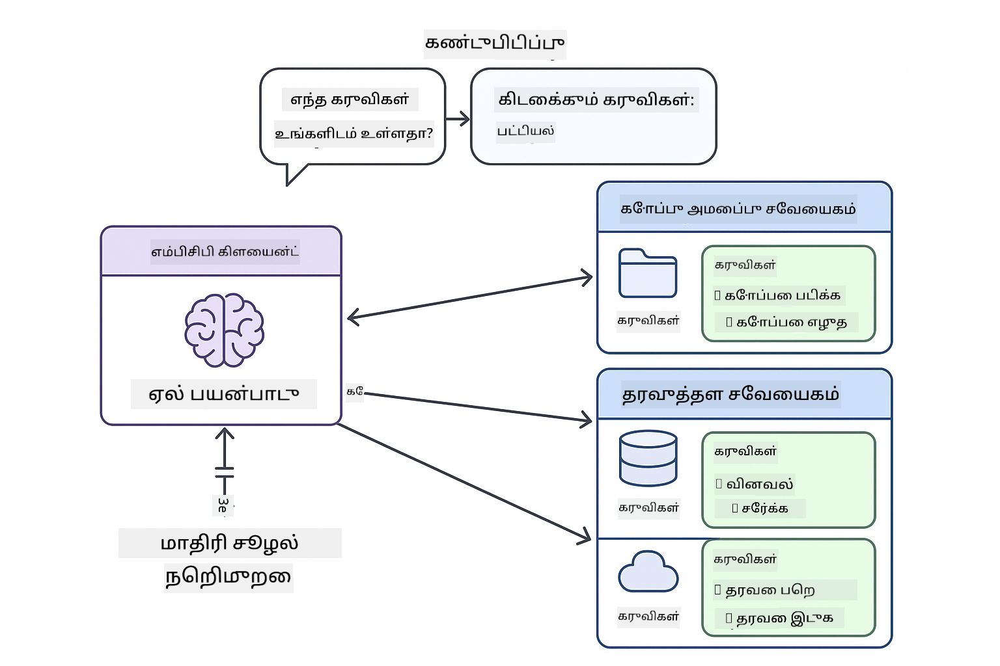
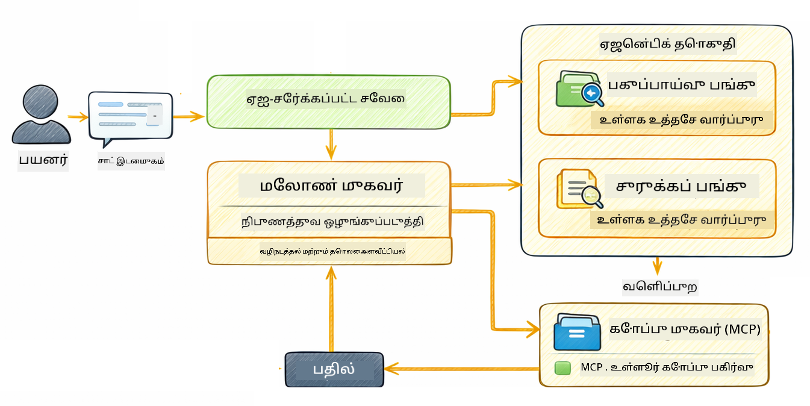

<!--
CO_OP_TRANSLATOR_METADATA:
{
  "original_hash": "f89f4c106d110e4943c055dd1a2f1dff",
  "translation_date": "2025-12-31T06:52:58+00:00",
  "source_file": "05-mcp/README.md",
  "language_code": "ta"
}
-->
# Module 05: மாதிரி சூழல் புரோட்டோக்கோல் (MCP)

## உள்ளடக்கப் பட்டியல்

- [நீங்கள் என்ன கற்றுக்கொள்வீர்கள்](../../../05-mcp)
- [MCP என்பதே என்ன?](../../../05-mcp)
- [MCP எவ்வாறு வேலை செய்கிறது](../../../05-mcp)
- [ஏஜென்டிக் மொட்யூல்](../../../05-mcp)
- [உதாரணங்களை இயக்குவது](../../../05-mcp)
  - [முன்னோக்கிய தேவைகள்](../../../05-mcp)
- [விரைவான தொடக்கம்](../../../05-mcp)
  - [கோப்பு செயல்பாடுகள் (Stdio)](../../../05-mcp)
  - [மேற்பார்வையாளர் ஏஜென்ட்](../../../05-mcp)
    - [வெளியீட்டை புரிந்துகொள்வது](../../../05-mcp)
    - [ஏஜென்டிக் மொட்யூல் அம்சங்களின் விளக்கம்](../../../05-mcp)
- [முக்கிய கருத்துக்கள்](../../../05-mcp)
- [வாழ்த்துகள்!](../../../05-mcp)
  - [அடுத்து என்ன?](../../../05-mcp)

## நீங்கள் என்ன கற்றுக்கொள்வீர்கள்

நீங்கள் உரையாடல் ஏ.ஐ. கட்டமைத்துள்ளீர்கள், ப்ராம்ப்டுகளை நன்கு கற்றுக்கொண்டுள்ளீர்கள், ஆவணங்களில் பதில்களை நிலைப்படுத்திகொண்டு, மற்றும் கருவிகளுடன் ஏஜென்டுகளை உருவாக்கிவிட்டீர்கள். ஆனால் அந்த எல்லா கருவிகளும் உங்கள் குறிப்பிட்ட பயன்பாடு varten தனிப்பயனாக உருவாக்கப்பட்டவை. உங்கள் ஏ.ஐ.-க்கு யாரும் உருவாக்கி பகிரலாம் என்ற ஒரு நிலையான கருவி சூழலை அணுக அனுமதிக்க முடியுமா? இந்த மொட்யூலில், Model Context Protocol (MCP) மற்றும் LangChain4j-இன் agentic மொட்யூலைப் பயன்படுத்தி அதன்படி செய்வது எப்படி என்று கற்றுக்கொள்வீர்கள். முதலில் ஒரு எளிய MCP கோப்பு வாசிப்பாளரை காட்டி, பின்னர் அதை Supervisor Agent மாதிரியைப் பயன்படுத்தி முன்னேறிய agentic வேலைப்பாடுகளில் எளிதாக எப்படி ஒருங்கிணைக்கலாம் என்பதைக் காண்பிப்போம்.

## MCP என்பதே என்ன?

Model Context Protocol (MCP) அதேபோலவே தருகிறது - வெளிப்புற கருவிகளை கண்டறிந்து பயன்படுத்துவதற்கான ஒரு நிலையான வழி. ஒவ்வொரு தரவுத் ஆதாரம் அல்லது சேவைக்காக தனிப்பயன் ஒருங்கிணைப்புகளை எழுதுவதற்குப் பதிலாக, திறமைகளை ஒரே தாக்கத்தில் வெளிப்படுத்தும் MCP சர்வர்களுடன் இணைகிறீர்கள். உங்கள் AI ஏஜென்ட் பின்னர் அவை கண்டறிந்து அச்சங்கங்களை தானாகப் பயன்படுத்த முடியும்.


*முன் MCP: சிக்கலான பாயிண்ட்-டூ-பாயிண்ட் ஒருங்கிணைப்புகள். பிறகு MCP: ஒரு புரோட்டோக்கோல், முடிவில்லா வாய்ப்புகள்.*

MCP AI மேம்பாட்டில் ஒரு அடிப்படை பிரச்சினையை தீர்க்கிறது: ஒவ்வொரு ஒருங்கிணைப்பும் தனிப்பயனாகும். GitHub ஐ அணுக விருமா? தனிப்பயன் குறியீடு. கோப்புகளை வாசிக்க வேண்டும்? தனிப்பயன் குறியீடு. தரவுத்தளத்தை ஆராய வேண்டும்? தனிப்பயன் குறியீடு. மற்றும் இந்த ஒருங்கிணைப்புகளின் எந்தவையும் பிற AI பயன்பாடுகளுடன் வேலை செய்ய மாட்டாது.

MCP இதை நிலைப்படுத்துகிறது. ஒரு MCP சர்வர் தெளிவான விளக்கங்கள் மற்றும் ஸ்கீமாக்களுடன் கருவிகளை வெளிப்படுத்துகிறது. எந்தவொரு MCP கிளையன்ட் என்றாலும் இணைக்கலாம், கிடைக்கும் கருவிகளை கண்டறிந்து பயன்படுத்தலாம். ஒருமுறை கட்டுங்கள், எங்கு வேண்டுமானாலும் பயன்படுத்துங்கள்.



*Model Context Protocol கட்டமைப்பு - நிலையான கருவி கண்டறிதலும் செயலாக்கமும்*

## MCP எவ்வாறு வேலை செய்கிறது

**சர்வர்-கிளையன் கட்டமைப்பு**

MCP ஒரு கிளையன்-சர்வர் மாதிரியை பயன்படுத்துகிறது. சர்வர்கள் கருவிகளை வழங்குகின்றனர் - கோப்புகள் வாசித்தல், தரவுத்தள விசாரணைகள், APIs அழைப்புகள். கிளையன்ட்கள் (உங்கள் AI பயன்பாடு) சர்வர்களுடன் இணைந்து அவற்றின் கருவிகளை பயன்படுத்துகின்றன.

LangChain4j உடன் MCP பயன்படுத்த, இந்த Maven சார்பை சேர்க்கவும்:

```xml
<dependency>
    <groupId>dev.langchain4j</groupId>
    <artifactId>langchain4j-mcp</artifactId>
    <version>${langchain4j.version}</version>
</dependency>
```

**கருவி கண்டறிதல்**

 உங்கள் கிளையன்ட் ஒரு MCP சர்வருடன் இணைக்கும்போது, அது "எந்த கருவிகள் உங்களிடம் உள்ளன?" என்று கேட்கிறது. சர்வர் கிடைக்கும் கருவிகளின் பட்டியலை விளக்கங்களும் பாராமீட்டர் ஸ்கீமாக்களோடாக பதிலளிக்கிறது. உங்கள் AI ஏஜென்ட் பின்னர் பயனர் கோரிக்கைக்கு அடிப்படையில் எந்த கருவிகளை பயன்படுத்த வேண்டும் என்று முடிவு செய்ய முடியும்.

**டிரான்ஸ்போர்ட் செயல்முறைகள்**

MCP பல்வேறு டிரான்ஸ்போர்ட் செயல்முறைகளை ஆதரிக்கிறது. இந்த மொட்யூல் உள்ளூர் செயல்முறைகளுக்கு Stdio டிரான்ஸ்போர்டை காட்டுகிறது:


*MCP டிரான்ஸ்போர்ட் சாதனைகள்: ரிமோட் சர்வர்களுக்கு HTTP, உள்ளூர் செயல்களுக்காக Stdio*

**Stdio** - [StdioTransportDemo.java](../../../05-mcp/src/main/java/com/example/langchain4j/mcp/StdioTransportDemo.java)

உள்ளூர் subprocess-களுக்காக. உங்கள் பயன்பாடு ஒரு சர்வரை subprocess ஆக.spawn செய்கிறது மற்றும் நிலையான உள்ளீடு/வெளியீட்டை வழியாக தொடர்பு கொள்ளுகிறது. கோப்பு сістம் அணுகல் அல்லது கமாண்ட்-லைன் கருவிகளுக்கு பயன்படும்.

```java
McpTransport stdioTransport = new StdioMcpTransport.Builder()
    .command(List.of(
        npmCmd, "exec",
        "@modelcontextprotocol/server-filesystem@2025.12.18",
        resourcesDir
    ))
    .logEvents(false)
    .build();
```

> **🤖 [GitHub Copilot](https://github.com/features/copilot) Chat உடன் முயற்சி செய்யுங்கள்:** Open [`StdioTransportDemo.java`](../../../05-mcp/src/main/java/com/example/langchain4j/mcp/StdioTransportDemo.java) மற்றும் கேள்க:
> - "Stdio டிரான்ஸ்போர்ட் எப்படி வேலை செய்கிறது மற்றும் HTTPக்கு பதிலாக எப்பொழுது அதை பயன்படுத்த வேண்டும்?"
> - "LangChain4j எப்படி MCP சர்வர் subprocess-க்களின் lifecycle-ஐ நிர்வகிக்கிறது?"
> - "AI-க்கு கோப்பு முறைமை அணுகலை வழங்குவதைப் பற்றி பாதுகாப்பு விளைவுகள் என்ன?"

## ஏஜென்டிக் மொட்யூல்

MCP நிலையான கருவிகளை வழங்கினாலும், LangChain4j-இன் **agentic மொட்யூல்** அவற்றை ஒருங்கிணைக்கக் கூடிய ஏஜென்ட்களை உருவாக்க ஒரு அறிவுரைக்குரிய வழியைத் தருகிறது. `@Agent` அனொடேஷன் மற்றும் `AgenticServices` உங்களுக்கு உள்ளமைவுகளைப் பிராமாணிக குறியீட்டுப் பதிலாக இடைமுகங்களின் வழியாக ஏஜென்ட் நடத்தை வரையறுக்க அனுமதிக்கின்றன.

இந்த மொட்யூலில், நீங்கள் **மேற்பார்வையாளர் ஏஜென்ட்** (Supervisor Agent) மாதிரியை ஆய்வு செய்யப்போகிறீர்கள் — இது ஒரு முன்னெச்சரிக்கை агентிக் AI அணுகுமுறை, இதில் ஒரு "மேற்பார்வையாளர்" ஏஜென்ட் பயனர் கோரிக்கைகளின் அடிப்படையில் எந்த துணை-ஏஜென்டுகளை அழைக்க வேண்டும் என்பதைக் தீர்மானிக்கிறது. நாம் இரு கான்செப்டுகளை ஒன்றாகச் சேர்ப்போம் — எங்கள் துணை-ஏஜென்டுகளில் ஒன்றுக்கு MCP-சக்தியசெய்யப்பட்ட கோப்பு அணுகல் சாத்தியமளித்தல்.

agentic மொட்யூலை பயன்படுத்த, இந்த Maven சார்பை சேர்க்கவும்:

```xml
<dependency>
    <groupId>dev.langchain4j</groupId>
    <artifactId>langchain4j-agentic</artifactId>
    <version>${langchain4j.mcp.version}</version>
</dependency>
```

> **⚠️ பரிசோதனைக் கட்டமைப்பு:** `langchain4j-agentic` மொட்யூல் **பரிசோதனையின் அடிப்படையில்** உள்ளது மற்றும் மாற்றப்படக்கூடும். AI உதவியாளர்களை கட்டமைப்பதற்கான நிலையான வழி `langchain4j-core` மற்றும் தனிப்பயன் கருவிகள் (Module 04) ஆகவே இருக்கிறது.

## உதாரணங்களை இயக்குவது

### முன்னோக்கிய தேவைகள்

- Java 21+, Maven 3.9+
- Node.js 16+ மற்றும் npm (MCP சர்வர்கள் için)
- ருட் அடைவில் உள்ள `.env` கோப்பில் கான்ஃபிகர் செய்யப்பட்ட சூழல் மாறிகள்:
  - **StdioTransportDemo-க்கு:** `GITHUB_TOKEN` (GitHub Personal Access Token)
  - **SupervisorAgentDemo-க்கு:** `AZURE_OPENAI_ENDPOINT`, `AZURE_OPENAI_API_KEY`, `AZURE_OPENAI_DEPLOYMENT` (Modules 01-04 உடன் ஒரே மாதிரி)

> **குறிப்பு:** நீங்கள் இன்னும் உங்கள் சூழல் மாறிகளை அமைக்கவில்லையென்றால், வழிமுறைகளுக்கு [Module 00 - Quick Start](../00-quick-start/README.md) ஐ பாருங்கள், அல்லது ருட் அடைவில் `.env.example` ஐ `.env` ஆக நகலெடுத்து உங்கள் மதிப்புகளை நிரப்புங்கள்.

## விரைவான தொடக்கம்

**VS Code பயன்படுத்துதல்:** Explorer இல் எந்தவொரு டெமோ கோப்பையும் வலது கிளிக் செய்து **"Run Java"** என்பதை தேர்ந்தெடுக்கவும், அல்லது Run and Debug பேனலிலிருந்து launch கட்டமைப்புகளை பயன்படுத்தவும் (முதலில் உங்கள் token-ஐ `.env` கோப்பில் சேர்த்துள்ளீர்களா என்பதை சரிபார்க்கவும்).

**Maven பயன்படுத்துதல்:** மாற்றாக, கீழ்க்காணும் உதாரணங்களுடன் கமாண்ட் லைனில் இருந்து இயக்கலாம்.

### கோப்பு செயல்பாடுகள் (Stdio)

இது உள்ளூர் subprocess அடிப்படையிலான கருவிகளை காட்டுகிறது.

**✅ எந்த தேவையும் தேவையில்லை** - MCP சர்வர் தானாகவே spawn செய்யப்படும்.

**VS Code பயன்படுத்துதல்:** `StdioTransportDemo.java` மீது வலது கிளிக் செய்து **"Run Java"** என்பதை தேர்ந்தெடுக்கவும்.

**Maven பயன்படுத்துதல்:**

**Bash:**
```bash
export GITHUB_TOKEN=your_token_here
cd 05-mcp
mvn compile exec:java -Dexec.mainClass=com.example.langchain4j.mcp.StdioTransportDemo
```

**PowerShell:**
```powershell
$env:GITHUB_TOKEN=your_token_here
cd 05-mcp
mvn --% compile exec:java -Dexec.mainClass=com.example.langchain4j.mcp.StdioTransportDemo
```

அப் பிளிகேஷன் தானாகவே ஒரு filesystem MCP சர்வரை spawn செய்து ஒரு உள்ளூர் கோப்பை வாசிக்கிறது. subprocess நிர்வாகம் எவ்வாறு நீங்கள் பார்க்கும்போது கையாளப்படுகிறது என்பதை கவனிக்கவும்.

**எதிர்பார்க்கப்படும் வெளியீடு:**
```
Assistant response: The file provides an overview of LangChain4j, an open-source Java library
for integrating Large Language Models (LLMs) into Java applications...
```

### மேற்பார்வையாளர் ஏஜென்ட்




**மேற்பார்வையாளர் ஏஜென்ட் மாதிரியை** என்பது ஒரு **மெலிந்த** agentic AI வடிவமாகும். தீர்மானிக்கப்பட்ட வேலைப்பாடுகள் (வரிசை, லூப், சமவெளி) க்கு முரண்பாடாக, ஒரு மேற்பார்வையாளர் பயனர் கோரிக்கையின் அடிப்படையில் எந்த ஏஜென்டுகளை அழைக்க வேண்டும் என்பதை சுயமாக தீர்மானிக்க LLM-ஐப் பயன்படுத்துகிறது.

**மேற்பார்வையாளரை MCP உடன் இணைத்தல்:** இந்த உதாரணத்தில், நாங்கள் `FileAgent`-ஐ `toolProvider(mcpToolProvider)` மூலம் MCP கோப்பு முறைக் கருவிகளுக்கு அணுகலை கொடுக்கிறோம். பயனர் "ஒரு கோப்பை வாசித்து ஆய்வு செய்" என்று கேட்டால், மேற்பார்வையாளர் கோரிக்கையை பகுப்பாய்வு செய்து ஒரு செயலாக்க திட்டத்தை உருவாக்கும். பின்னர் அது கோரிக்கையை `FileAgent` க்கு வழிமாற்றி, `read_file` கருவியை பயன்படுத்தி உள்ளடக்கத்தை பெறும். மேற்பார்வையாளர் அந்த உள்ளடக்கத்தை `AnalysisAgent` க்கு பரிமாறி அதன் விளக்கம் பெறும், மற்றும் விரும்பினால் `SummaryAgent`-ஐ அழைத்து முடிவுகளை சுருக்கலாம்.

இது MCP கருவிகள் agentic வேலைப்பாடுகளில் எப்படி எளிதாக ஒருங்கிணைந்து செயல்மாறுகிறதென்பதை காட்டுகிறது — மேற்பார்வையாளர் கோப்புகள் எப்படி வாசிக்கப்படுகின்றன என *அற்றுக்* கொண்டு இருக்க வேண்டியதில்லை, அது `FileAgent` அதை செய்யக்கூடும் என்பதை மட்டுமே தெரிந்துகொள்கிறது. மேற்பார்வையாளர் வெவ்வேறு வகையான கோரிக்கைகளுக்கு தகுந்தவாறு தன்னிச்சையாக அமைவதாக செயல்படுகிறது மற்றும் கடைசி ஏஜென்டின் பதிலோ அல்லது அனைத்து செயல்முறைகளின் சுருக்கமோ திருப்பி வழங்கும்.

**தொடக்க ஸ்கிரிப்ட்களைப் பயன்படுத்துவது (புரிந்துகொள்ள பரிந்துரைக்கப்படுகிறது):**

தொடக்க ஸ்கிரிப்ட்கள் ருட் `.env` கோப்பிலிருந்து சூழல் மாறிகளை தானாக ஏற்றி இயக்குகின்றன:

**Bash:**
```bash
cd 05-mcp
chmod +x start.sh
./start.sh
```

**PowerShell:**
```powershell
cd 05-mcp
.\start.ps1
```

**VS Code பயன்படுத்துதல்:** `SupervisorAgentDemo.java` மீது வலது கிளிக் செய்து **"Run Java"** (உங்கள் `.env` கோப்பு கான்ஃபிகர் செய்யப்பட்டுள்ளது என்பதை உறுதிசெய்யவும்).

**மேற்பார்வையாளர் எப்படி வேலை செய்கிறது:**

```java
// குறிப்பிட்ட திறன்களைக் கொண்ட பல முகவர்களை வரையறுக்கவும்
FileAgent fileAgent = AgenticServices.agentBuilder(FileAgent.class)
        .chatModel(model)
        .toolProvider(mcpToolProvider)  // கோப்பு செயல்பாடுகளுக்கான MCP கருவிகள் உள்ளன
        .build();

AnalysisAgent analysisAgent = AgenticServices.agentBuilder(AnalysisAgent.class)
        .chatModel(model)
        .build();

SummaryAgent summaryAgent = AgenticServices.agentBuilder(SummaryAgent.class)
        .chatModel(model)
        .build();

// இந்த முகவர்களை ஒருங்கிணைக்கும் ஒரு மேற்பார்வையாளர் உருவாக்கவும்
SupervisorAgent supervisor = AgenticServices.supervisorBuilder()
        .chatModel(model)  // "planner" மாடல்
        .subAgents(fileAgent, analysisAgent, summaryAgent)
        .responseStrategy(SupervisorResponseStrategy.SUMMARY)
        .build();

// மேற்பார்வையாளர் எந்த முகவர்களை அழைக்க வேண்டும் என்பதை தன்னிச்சையாக முடிவு செய்கிறது
// ஒரு இயற்கை மொழி கோரிக்கையை மட்டும் கொடுங்கள் - LLM செயல்பாட்டை திட்டமிடும்
String response = supervisor.invoke("Read the file at /path/file.txt and analyze it");
```

முழு செயலாக்கத்திற்கு [SupervisorAgentDemo.java](../../../05-mcp/src/main/java/com/example/langchain4j/mcp/SupervisorAgentDemo.java) ஐ பார்க்கவும்.

> **🤖 [GitHub Copilot](https://github.com/features/copilot) Chat உடன் முயற்சி செய்யுங்கள்:** Open [`SupervisorAgentDemo.java`](../../../05-mcp/src/main/java/com/example/langchain4j/mcp/SupervisorAgentDemo.java) மற்றும் கேள்க:
> - "மேற்பார்வையாளர் எந்த ஏஜென்டுகளை அழைக்க வேண்டும் என்று எவ்வாறு முடிவு செய்கிறது?"
> - "மேற்பார்வையாளர் மற்றும் தொடர்ச்சியான (Sequential) வேலைப்பாடு மாதிரிகள் என்ன வித்தியாசம்?"
> - "மேற்பார்வையாளரின் திட்டமிடல் நடத்தையை எவ்வாறு தனிப்பயனாக்கலாம்?"

#### வெளியீட்டை புரிந்துகொள்வது

டெமோவை இயக்கும்போது, மேற்பார்வையாளர் பல ஏஜென்டுகளை எவ்வாறு ஒருங்கிணைக்கிறது என்பதனின் கட்டமைக்கப்பட்ட நடைமுறையை காண்பீர்கள். ஒவ்வொரு பிரிவின் பொருள் இங்கு:

```
======================================================================
  SUPERVISOR AGENT DEMO
======================================================================

This demo shows how a Supervisor Agent orchestrates multiple specialized agents.
The Supervisor uses an LLM to decide which agent to call based on the task.
```

**தலைப்பு** டெமோவை அறிமுகம் செய்து மற்றும் கோரிக்கையை எவ்வாறு தீர்மானிக்கிறது என்பதை விளக்குகிறது: மேற்பார்வையாளர் ஒரு LLM-ஐ (கடைமையான விதிகளோடு அல்ல) பயன்படுத்தி எந்த ஏஜென்டுகளை அழைக்க வேண்டும் என்பதைக் கூறுகிறது.

```
--- AVAILABLE AGENTS -------------------------------------------------
  [FILE]     FileAgent     - Reads files using MCP filesystem tools
  [ANALYZE]  AnalysisAgent - Analyzes content for structure, tone, and themes
  [SUMMARY]  SummaryAgent  - Creates concise summaries of content
```

**கிடைக்கும் ஏஜென்டுகள்** மேற்பார்வையாளர் தேர்வு செய்யக்கூடிய மூன்று சிறப்பான ஏஜென்டுகளை காண்பிக்கின்றது. ஒவ்வொரு ஏஜென்டுக்கும் ஒரு குறிப்பிட்ட திறன் உள்ளது:
- **FileAgent** MCP கருவிகளைப் பயன்படுத்தி கோப்புகளை வாசிக்க முடியும் (வெளிப்புற திறன்)
- **AnalysisAgent** உள்ளடக்கத்தை பகுப்பாய்வு செய்கின்றது (முழுமையாக LLM திறன்)
- **SummaryAgent** சுருக்கங்களை உருவாக்குகின்றது (முழுமையாக LLM திறன்)

```
--- USER REQUEST -----------------------------------------------------
  "Read the file at .../file.txt and analyze what it's about"
```

**பயனர் கோரிக்கை** என்ன கேட்டது என்றதை காண்பிக்கிறது. மேற்பார்வையாளர் இதை பின்னர் பகு்ப்பாய்வு செய்து எந்த ஏஜென்டுகளை அழைக்க வேண்டும் என்பதை தீர்மானிக்க வேண்டும்.

```
--- SUPERVISOR ORCHESTRATION -----------------------------------------
  The Supervisor will now decide which agents to invoke and in what order...

  +-- STEP 1: Supervisor chose -> FileAgent (reading file via MCP)
  |
  |   Input: .../file.txt
  |
  |   Result: LangChain4j is an open-source Java library designed to simplify...
  +-- [OK] FileAgent (reading file via MCP) completed

  +-- STEP 2: Supervisor chose -> AnalysisAgent (analyzing content)
  |
  |   Input: LangChain4j is an open-source Java library...
  |
  |   Result: Structure: The content is organized into clear paragraphs that int...
  +-- [OK] AnalysisAgent (analyzing content) completed
```

**மேற்பார்வையாளர் ஒர்க்கஸ்ட்ரேஷன்** இங்கே அற்புதம் நிகழ்கிறது. எப்படி செயல்படுவதை கவனியுங்கள்:
1. கோரிக்கையில் "கோப்பை வாசி" என்ற குறிப்பை குறிப்பிடுவதால் மேற்பார்வையாளர் முதலில் **FileAgent-ஐ தேர்வு செய்தது**
2. FileAgent MCP-ன் `read_file` கருவியைப் பயன்படுத்தி கோப்பு உள்ளடக்கத்தை பெற்றது
3. பின்னர் மேற்பார்வையாளர் **AnalysisAgent-ஐ தேர்ந்தெடுத்து** கோப்பு உள்ளடக்கத்தை அதற்கு அனுப்பியது
4. AnalysisAgent கட்டமைப்பு, டோன் மற்றும் தீம்களைப் பகுப்பாய்வு செய்தது

பயனர் கோரிக்கை அடிப்படையில் மேற்பார்வையாளர் இத்தகைய முடிவுகளை **சுயமாக** எடுத்தது என்பதை கவனிக்கவும் — எந்தவொரு கடுமையான நடைமுறையும் கொடுக்கப்படவில்லை!

**இறுதியான பதில்** என்பது மேற்பார்வையாளர் அனைத்தும் அழைத்த ஏஜென்டுகளின் வெளியீடுகளை ஒரேசமயம் சுருக்கி கொடுத்தது. உதாரணம் ஒவ்வொரு ஏஜென்டும் சேமித்த சுருக்கம் மற்றும் பகுப்பாய்வு முடிவுகளை agentic scope-ஆக வெளியிடுகிறது.

```
--- FINAL RESPONSE ---------------------------------------------------
I read the contents of the file and analyzed its structure, tone, and key themes.
The file introduces LangChain4j as an open-source Java library for integrating
large language models...

--- AGENTIC SCOPE (Shared Memory) ------------------------------------
  Agents store their results in a shared scope for other agents to use:
  * summary: LangChain4j is an open-source Java library...
  * analysis: Structure: The content is organized into clear paragraphs that in...
```

### ஏஜென்டிக் மொட்யூல் அம்சங்களின் விளக்கம்

உதாரணம் agentic மொட்யூலின் பல முன்னேறிய அம்சங்களை காட்டுகிறது. Agentic Scope மற்றும் Agent Listeners-ஐ நெருக்கமாகப் பார்ப்போம்.

**Agentic Scope** ஏஜென்டுகள் `@Agent(outputKey="...")` பயன்படுத்தி அவர்களது முடிவுகளை எங்கு சேமித்தாங்க என்பதைப் பகிர்ந்த நினைவகத்தை காட்டுகிறது. இது உதவுகிறது:
- பின்னர் வரும் ஏஜென்டுகள் முந்தைய ஏஜென்ட்களின் வெளியீடுகளை அணுக வாழ்கின்றன
- மேற்பார்வையாளர் இறுதியான பதிலை உருவாக்க
- ஒவ்வொரு ஏஜெண்டும் என்ன உருவாக்கியது என்பதைப் பார்வையிட நீங்கள்

```java
ResultWithAgenticScope<String> result = supervisor.invokeWithAgenticScope(request);
AgenticScope scope = result.agenticScope();
String story = scope.readState("story");
List<AgentInvocation> history = scope.agentInvocations("analysisAgent");
```

**Agent Listeners** ஏஜென்ட் செயல்பாட்டை கண்காணித்தல் மற்றும் பிழைதிருத்தத்திற்கு உதவுகின்றன. டெமோவில் நீங்கள் பார்க்கும் படி படிநிலை வெளியீடு ஒரு AgentListener-இலிருந்து வருகிறது, அது ஒவ்வொரு ஏஜென்ட் அழைப்பிலும் ஹூக் ஆகிறது:
- **beforeAgentInvocation** - மேற்பார்வையாளர் ஒரு ஏஜென்டை தேர்வு செய்தபோது அழைக்கப்படுகிறது, எந்த ஏஜென்ட் தேர்வு செய்யப்பட்டது மற்றும் ஏன் என்பதை பார்க்க நமக்கு உதவுகிறது
- **afterAgentInvocation** - ஒரு ஏஜென்ட் முடிந்தபின் அழைக்கப்படுகிறது, அதன் முடிவைக் காட்டுகிறது
- **inheritedBySubagents** - உண்மையாக இருந்தால், அந்த லிஸ்டனர் எல்லா ஏஜென்டுகளையும் ஹிரார்க்கியில் கண்காணிக்கிறது

```java
AgentListener monitor = new AgentListener() {
    private int step = 0;
    
    @Override
    public void beforeAgentInvocation(AgentRequest request) {
        step++;
        System.out.println("  +-- STEP " + step + ": " + request.agentName());
    }
    
    @Override
    public void afterAgentInvocation(AgentResponse response) {
        System.out.println("  +-- [OK] " + response.agentName() + " completed");
    }
    
    @Override
    public boolean inheritedBySubagents() {
        return true; // அனைத்து துணை முகவரிகளுக்கு பரப்பவும்
    }
};
```

மேற்பார்வையாளர் மாதிரியின் பின்புலத்தைத் தாண்டி, `langchain4j-agentic` மொட்யூல் பல சக்திவாய்ந்த வேலைப்பாடு மாதிரிகள் மற்றும் அம்சங்களை வழங்குகிறது:

| Pattern | Description | Use Case |
|---------|-------------|----------|
| **Sequential** | ஏஜென்டுகளை வரிசையாக செயல்படுத்தவும், வெளியீடு அடுத்ததிக்கு ஓடும் | தொகுப்புகள்: ஆய்வு → பகுப்பாய்வு → அறிக்கை |
| **Parallel** | ஏஜென்டுகளை ஒரே நேரத்தில் செயல்படுத்தவும் | சாராத பணிகள்: வானிலை + செய்திகள் + பங்குகள் |
| **Loop** | ஒரு நிபந்தனை பூர்த்தி ஆகும் வரை திரும்பி செயல்படு | தரம் மதிப்பீடு: பதிற்சி வரை திருத்து score ≥ 0.8 |
| **Conditional** | நிபந்தனைகளின் அடிப்படையில் வழி வகை செய்யவும் | வகைப்படுத்து → நிபுணர் ஏஜெண்டுக்குக் அனுப்பு |
| **Human-in-the-Loop** | மனித சரிபார்ப்புகளைச் சேர்க்கவும் | அனுமதி வேலைபாடுகள், உள்ளடக்க மதிப்பாய்வு |

## முக்கிய கருத்துக்கள்

**MCP** ஏற்கெனவே உள்ள கருவி சூழல்களை பயன்படுத்த விரும்பும்போது, பல பயன்பாடுகள் பகிர்ந்து கொள்ளக்கூடிய கருவிகளை உருவாக்கும்போது, மூன்றாம் தரப்பு சேவைகளை நிலையான புரோட்டோக்கோல்களால் ஒருங்கிணைக்கும்போது, அல்லது கருவி செயலாக்கங்களை மாற்றும்போது குறியீட்டை மாற்றாமல் செய்ய வேண்டுமென்றால் சிறந்தது.

**ஏஜென்டிக் மொட்யூல்** `@Agent` அனொடேஷன்களுடன் அறிவுரைக் குறியீட்டுப் பரிமாணங்களை விரும்பும் பட்சத்தில் சிறப்பாக வேலைசெய்கிறது, வேலைப்பாட்டுச் சங்கிலிகள் (sequential, loop, parallel) ஒருங்கிணைப்பை தேவையெனில், இடைமுகத்தட்பRedeign-ஆகிய ஏஜெண்ட் வடிவமைப்பை கட்டுபாட்டுக் குறியீட்டிற்கு பதிலாக முன்னுரிமை கொடுக்கும் போது அல்லது பல ஏஜெண்டுகளை outputKey மூலம் பகிர்ந்து கொண்டு ஒருங்கிணைக்கும்போது உகந்தது.

**மேற்பார்வையாளர் ஏஜென்ட் மாதிரி** முன்னேற்பாடாக முன்னரே கணிக்கப்பட்டு இல்லாத வேலைப்பாடுகள் இருக்கும் போது மற்றும் LLM-ஐ முடிவெடுக்கும் முறையாக பயன்படுத்த விரும்பும் போது சிறப்பாக ஒளிர்கிறது, பல சிறப்புப் பயிற்சியுள்ள ஏஜெண்டுகளை தன்னிச்சையாக ஒருங்கிணைக்கவேண்டிய போது, அல்லது பல திறன்களுக்குத் திருப்புணர்வு செய்யும் உரையாடல் அமைப்புகளை கட்டமைக்கும் போது, அல்லது மிக இணைநிலை மற்றும் தானாக இசைவோடியான ஏஜெண்ட் நடத்தை தேவைப்படும்போது சிறந்த தேர்வு.

## வாழ்த்துகள்!

நீங்கள் LangChain4j for Beginners பாடத்திட்டத்தை முடித்துள்ளீர்கள். நீங்கள் கற்றுக்கொண்டவை:

- நினைவுடன் உரையாடல் AI ஐ எப்படி கட்டமைப்பது (Module 01)
- வெவ்வேறு பணிகளுக்கான ப்ராம்ப்ட் இன்ஜினியரிங் மாதிரிகள் (Module 02)
- RAG மூலம் உங்கள் ஆவணங்களில் பதில்களை நிலைப்படுத்துவது (Module 03)
- தனிப்பயன் கருவிகளுடன் அடிப்படை AI ஏஜெண்டுகளை உருவாக்குவது (Module 04)
- நிலைப்படுத்தப்பட்ட கருவிகளை LangChain4j MCP மற்றும் Agentic மாட்யூல்களுடன் ஒருங்கிணைத்தல் (மாட்யூல் 05)

### அடுத்தது என்ன?

மாட்யூல்களை முடித்ததும், LangChain4j பரிசோதனைக் கொள்கைகளை செயலில் காண [பரிசோதனை வழிகாட்டி](../docs/TESTING.md) ஐ ஆய்வு செய்யுங்கள்.

**அதிகாரப்பூர்வ வளங்கள்:**
- [LangChain4j ஆவணங்கள்](https://docs.langchain4j.dev/) - விரிவான வழிகாட்டிகள் மற்றும் API குறிப்புகள்
- [LangChain4j GitHub](https://github.com/langchain4j/langchain4j) - மூலக் குறியீடு மற்றும் எடுத்துக்காட்டுகள்
- [LangChain4j பயிற்சிகள்](https://docs.langchain4j.dev/tutorials/) - பல்வேறு பயன்பாட்டு சூழல்களுக்கு படி படியாக உள்ள பயிற்சிகள்

இந்த பாடநெறியை முடித்ததற்கு நன்றி!

---

**வழிசெலுத்தல்:** [← முந்தையது: மாட்யூல் 04 - கருவிகள்](../04-tools/README.md) | [முதன்மை பக்கத்திற்கு](../README.md)

---

<!-- CO-OP TRANSLATOR DISCLAIMER START -->
மறுப்பு:

இந்த ஆவணம் AI மொழிபெயர்ப்பு சேவை Co-op Translator (https://github.com/Azure/co-op-translator) மூலம் மொழிபெயர்க்கப்பட்டுள்ளது. நாங்கள் துல்லியத்திற்காக முயலினாலும், தானியங்கி மொழிபெயர்ப்புகளில் தவறுகள் அல்லது பிழைகள் இருக்கக்கூடும் என்பதை தயவுசெய்து நினைவில் கொள்ளவும். அசல் ஆவணம் அதன் மூல மொழியில் அதிகாரபூர்வ ஆதாரமாக கருதப்பட வேண்டும். முக்கியமான தகவல்களுக்கு, தொழில்முறை மனித மொழிபெயர்ப்பை பயன்படுத்த பரிந்துரைக்கப்படுகிறது. இந்த மொழிபெயர்ப்பைப் பயன்படுத்துவதால் ஏற்படும் எந்த தவறான புரிதல்களுக்கோ அல்லது தவறான விளக்கங்களுக்கோ நாங்கள் பொறுப்பேற்கமாட்டோம்.
<!-- CO-OP TRANSLATOR DISCLAIMER END -->