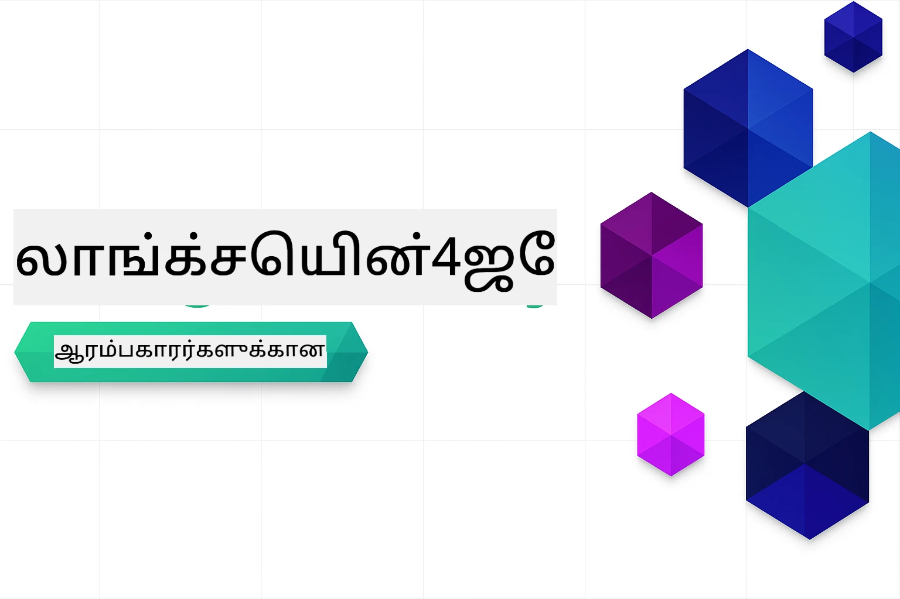

<!--
CO_OP_TRANSLATOR_METADATA:
{
  "original_hash": "6a3bd54fc243ce3dc79d18848d2b5413",
  "translation_date": "2026-01-06T01:52:03+00:00",
  "source_file": "README.md",
  "language_code": "ta"
}
-->


### 🌐 பன்மொழி ஆதரவு

#### GitHub செயல் மூலம் ஆதரிக்கப்படுகிறது (தானாகவும் எப்போதும் புதுப்பிக்கப்பட்டதும்)

<!-- CO-OP TRANSLATOR LANGUAGES TABLE START -->
[Arabic](../ar/README.md) | [Bengali](../bn/README.md) | [Bulgarian](../bg/README.md) | [Burmese (Myanmar)](../my/README.md) | [Chinese (Simplified)](../zh/README.md) | [Chinese (Traditional, Hong Kong)](../hk/README.md) | [Chinese (Traditional, Macau)](../mo/README.md) | [Chinese (Traditional, Taiwan)](../tw/README.md) | [Croatian](../hr/README.md) | [Czech](../cs/README.md) | [Danish](../da/README.md) | [Dutch](../nl/README.md) | [Estonian](../et/README.md) | [Finnish](../fi/README.md) | [French](../fr/README.md) | [German](../de/README.md) | [Greek](../el/README.md) | [Hebrew](../he/README.md) | [Hindi](../hi/README.md) | [Hungarian](../hu/README.md) | [Indonesian](../id/README.md) | [Italian](../it/README.md) | [Japanese](../ja/README.md) | [Kannada](../kn/README.md) | [Korean](../ko/README.md) | [Lithuanian](../lt/README.md) | [Malay](../ms/README.md) | [Malayalam](../ml/README.md) | [Marathi](../mr/README.md) | [Nepali](../ne/README.md) | [Nigerian Pidgin](../pcm/README.md) | [Norwegian](../no/README.md) | [Persian (Farsi)](../fa/README.md) | [Polish](../pl/README.md) | [Portuguese (Brazil)](../br/README.md) | [Portuguese (Portugal)](../pt/README.md) | [Punjabi (Gurmukhi)](../pa/README.md) | [Romanian](../ro/README.md) | [Russian](../ru/README.md) | [Serbian (Cyrillic)](../sr/README.md) | [Slovak](../sk/README.md) | [Slovenian](../sl/README.md) | [Spanish](../es/README.md) | [Swahili](../sw/README.md) | [Swedish](../sv/README.md) | [Tagalog (Filipino)](../tl/README.md) | [Tamil](./README.md) | [Telugu](../te/README.md) | [Thai](../th/README.md) | [Turkish](../tr/README.md) | [Ukrainian](../uk/README.md) | [Urdu](../ur/README.md) | [Vietnamese](../vi/README.md)

> **உள்ளூர் கிளோன் செய்ய விரும்புகிறீர்களா?**

> இந்த கையேட்டில் 50+ மொழிபெயர்ப்புகள் அடங்கியுள்ளது, இது பதிவிறக்கும் அளவை மிக அதிகரிக்கிறது. மொழிபெயர்ப்புகள் இல்லாமல் கிளோன் செய்ய sparse checkout ஐ பயன்படுத்தவும்:
> ```bash
> git clone --filter=blob:none --sparse https://github.com/microsoft/LangChain4j-for-Beginners.git
> cd LangChain4j-for-Beginners
> git sparse-checkout set --no-cone '/*' '!translations' '!translated_images'
> ```
> இது khóaார்கள் முடிக்க தேவையான அனைத்தையும் மிக விரைவான பதிவிறக்கத்துடன் வழங்குகிறது.
<!-- CO-OP TRANSLATOR LANGUAGES TABLE END -->

# LangChain4j தொடக்கக் குலங்களுக்கான தொகுப்பு

LangChain4j மற்றும் Azure OpenAI GPT-5 உடன் அடிப்படையான அரட்டை வகுப்பிலிருந்து AI முகாமிகள் வரை AI செயலிகள் உருவாக்கும் பாடம்.

**LangChain4j புதியவரா?** முக்கிய வார்த்தைகள் மற்றும் கருத்துக்களுக்கான வரையறைகளுக்கு [விளக்கக்குறிப்பை](docs/GLOSSARY.md) பாருங்கள்.

## உள்ளடக்கக் கட்டளை

1. [விரைவான துவக்கம்](00-quick-start/README.md) - LangChain4j உடன் துவங்குங்கள்
2. [அறிமுகம்](01-introduction/README.md) - LangChain4j அடிப்படைகளை கற்றுக்கொள்ளுங்கள்
3. [பிராரம்ப வடிவமைப்பு](02-prompt-engineering/README.md) - பயனுள்ள பிராரம்ப வடிவமைப்பில் நிபுணர் ஆகுங்கள்
4. [RAG (திருத்தம்-வளர்ச்சி உருவாக்கம்)](03-rag/README.md) - புத்திசாலியான அறிவுத் தரவுத்தளக்கூறுகளை உருவாக்குங்கள்
5. [கருவிகள்](04-tools/README.md) - வெளிப்புற கருவிகள் மற்றும் எளிய உதவியாளர்கள் இணைத்தல்
6. [MCP (மாதிரி சூழல் நெறிமுறை)](05-mcp/README.md) - மாதிரி சூழல் நெறிமுறை (MCP) மற்றும் முகாமி தொகுதிகளுடன் செயல்படுதல்
---

## கற்றல் வழி

> **விரைவான துவக்கம்**

1. இந்த பழைய முகாமியை உங்கள் GitHub கணக்குக்கு Fork செய்யவும்
2. **Code** → **Codespaces** உலாவி → **...** → **New with options...** கிளிக் செய்யவும்
3. இயல்புநிலைகளைக் கையாளுங்கள் – இது இந்த பாடத்திற்காக உருவாக்கப்பட்ட வழங்கல் உடைய இடத்தைத் தேர்ந்தெடுக்கிறது
4. **Create codespace** கிளிக் செய்யவும்
5. சூழல் தயார் ஆக 5-10 நிமிடங்கள் காத்திருக்கவும்
6. தொடங்க [விரைவான துவக்கம்](./00-quick-start/README.md) பக்கம் செல்லவும்!

> **உள்ளூர் கிளோன் செய்ய விரும்புகிறீர்களா?**
>
> இந்த கையேட்டில் 50+ மொழிபெயர்ப்புகள் உள்ளதால் பதிவிறக்கும் அளவு அதிகரிக்கிறது. மொழிபெயர்ப்புகள் இல்லாமல் கிளோன் செய்ய sparse checkout ஐ பயன்படுத்தவும்:
> ```bash
> git clone --filter=blob:none --sparse https://github.com/microsoft/LangChain4j-for-Beginners.git
> cd LangChain4j-for-Beginners
> git sparse-checkout set --no-cone '/*' '!translations' '!translated_images'
> ```
> இது khóaார்கள் முடிக்க தேவையான அனைத்தையும் மிக விரைவான பதிவிறக்கத்துடன் வழங்குகிறது.

தொகுதிகளை முடித்த பிறகு, [சோதனை வழிகாட்டி](docs/TESTING.md) ஐ ஆராய்ந்து LangChain4j சோதனை தொடர்பான கருத்துக்களை காண்க.

> **குறிப்பு:** இந்த பயிற்சியில் GitHub படிமங்கள் மற்றும் Azure OpenAI இரண்டும் பயன்படுத்தப்படுகின்றன. [விரைவான துவக்கம்](00-quick-start/README.md) பாடம் GitHub படிமங்களைப் பயன்படுத்தும் (Azure சந்தா வேண்டாம்), மொட்யூல்கள் 1-5 Azure OpenAI ஐப் பயன்படுத்துகின்றன.


## GitHub Copilot உடன் கற்றல்

திறம்படக் கோடை எழுத விரைவாக, இந்தத் திட்டத்தை GitHub Codespace அல்லது உங்கள் உள்ளூர் IDE இன் devcontainer உடன் திறக்கவும். இந்த பாடத்திற்கு பயன்படுத்தப்படும் devcontainer GitHub Copilot ஐ AI இணைந்த கூட்டுறைத்திறனைக்கு முன்கூட்டியே உள்ளடக்கியுள்ளது.

ஒவ்வொரு குறியீட்டு உதாரணத்திலும் GitHub Copilot ஐ கேட்டு உங்கள் புரிதலை ஆழமாக்கக் கூடிய பரிந்துரைக்கப்பட்ட கேள்விகள் உள்ளன. 💡/🤖 குறியீட்டு தேசங்களில் தேடுங்கள்:

- **ஜாவா கோப்பு தலைப்புகள்** - ஒவ்வொரு உதாரணத்திற்கான குறிப்பிட்ட கேள்விகள்
- **மொண்ட்யூல் README கள்** - குறியீட்டு உதாரணங்களுக்குப் பிறகு ஆராயும் கேள்விகள்

**எப்படி பயன்படுத்துவது:** எந்த குறியீட்டு கோப்பையும் திறந்து Copilot பரிந்துரைக்கப்பட்ட கேள்விகளை கேட்கவும். அது முழு குறியீட்டு பார்வையை உடையதாகவும், விளக்கவும், நீட்டிக்கவும், மாற்றுகளை பரிந்துரைக்கவும் முடியும்.

மேலும் அறிய விரும்புகிறீர்களா? [AI இணைந்த கூட்டுறைத்திறனைக்கான Copilot](https://aka.ms/GitHubCopilotAI) பார்க்கவும்.


## கூடுதல் வளங்கள்

<!-- CO-OP TRANSLATOR OTHER COURSES START -->
### LangChain
[](https://aka.ms/langchain4j-for-beginners)
[](https://aka.ms/langchainjs-for-beginners?WT.mc_id=m365-94501-dwahlin)

---

### Azure / Edge / MCP / முகாமிகள்
[](https://github.com/microsoft/AZD-for-beginners?WT.mc_id=academic-105485-koreyst)
[](https://github.com/microsoft/edgeai-for-beginners?WT.mc_id=academic-105485-koreyst)
[](https://github.com/microsoft/mcp-for-beginners?WT.mc_id=academic-105485-koreyst)
[](https://github.com/microsoft/ai-agents-for-beginners?WT.mc_id=academic-105485-koreyst)

---
 
### உருவாக்கும் AI தொடர்
[](https://github.com/microsoft/generative-ai-for-beginners?WT.mc_id=academic-105485-koreyst)
[-9333EA?style=for-the-badge&labelColor=E5E7EB&color=9333EA)](https://github.com/microsoft/Generative-AI-for-beginners-dotnet?WT.mc_id=academic-105485-koreyst)
[-C084FC?style=for-the-badge&labelColor=E5E7EB&color=C084FC)](https://github.com/microsoft/generative-ai-for-beginners-java?WT.mc_id=academic-105485-koreyst)
[-E879F9?style=for-the-badge&labelColor=E5E7EB&color=E879F9)](https://github.com/microsoft/generative-ai-with-javascript?WT.mc_id=academic-105485-koreyst)

---
 
### கோர் கற்றல்
[](https://aka.ms/ml-beginners?WT.mc_id=academic-105485-koreyst)
[](https://aka.ms/datascience-beginners?WT.mc_id=academic-105485-koreyst)
[](https://aka.ms/ai-beginners?WT.mc_id=academic-105485-koreyst)
[](https://github.com/microsoft/Security-101?WT.mc_id=academic-96948-sayoung)
[](https://aka.ms/webdev-beginners?WT.mc_id=academic-105485-koreyst)
[](https://aka.ms/iot-beginners?WT.mc_id=academic-105485-koreyst)
[](https://github.com/microsoft/xr-development-for-beginners?WT.mc_id=academic-105485-koreyst)

---
 
### இணை காப்பாளர் தொடர்ச்சி
[](https://aka.ms/GitHubCopilotAI?WT.mc_id=academic-105485-koreyst)
[](https://github.com/microsoft/mastering-github-copilot-for-dotnet-csharp-developers?WT.mc_id=academic-105485-koreyst)
[](https://github.com/microsoft/CopilotAdventures?WT.mc_id=academic-105485-koreyst)
<!-- CO-OP TRANSLATOR OTHER COURSES END -->

## உதவி பெறுதல்

AI செயலிகளை உருவாக்குவதில் சிக்கல் அடைந்தல் அல்லது கேள்விகள் இருந்தால், கீழ்கண்டவற்றுக்கு சேரவும்:

[](https://aka.ms/foundry/discord)

உருவாக்கத்தின் போது உள்ள கருத்துக்களோ அல்லது பிழைகளோ இருந்தால் பார்வையிட:

[](https://aka.ms/foundry/forum)

## உரிமம்

MIT உரிமம் - விரிவுகளுக்கு [LICENSE](../../LICENSE) கோப்பை பார்க்கவும்.

---

<!-- CO-OP TRANSLATOR DISCLAIMER START -->
**கருத்தரிப்பு**:  
இந்த ஆவணம் [Co-op Translator](https://github.com/Azure/co-op-translator) என்ற AI மொழிபெயர்ப்புச் சேவையை பயன்படுத்தி மொழிபெயர்க்கப்பட்டுள்ளது. நாங்கள் துல்லியத்தை நோக்கிக்கோரும் போதிலும், இயந்திர மொழிபெயர்ப்புகளில் பிழைகள் அல்லது தவறுகள் இருக்கக்கூடும் என்பதை தயவுசெய்து கவனத்தில் கொள்ளவும். மூல ஆவணம் அதன் தாய்மை மொழியில் அதிகாரபூர்வமான மூலமாக கருதப்பட வேண்டும். முக்கியத் தகவல்களுக்கு, தொழில்நுட்பமான மனித மொழிபெயர்ப்பு பரிந்துரைக்கப்படுகிறது. இந்த மொழிபெயர்ப்பின் பயன்பாட்டினால் ஏற்படும் எந்தவொரு தவறுபாடுகளுக்கும் அல்லது தவறான புரிதலுக்குமான பொறுப்பை நாங்கள் ஏற்கவில்லை.
<!-- CO-OP TRANSLATOR DISCLAIMER END -->