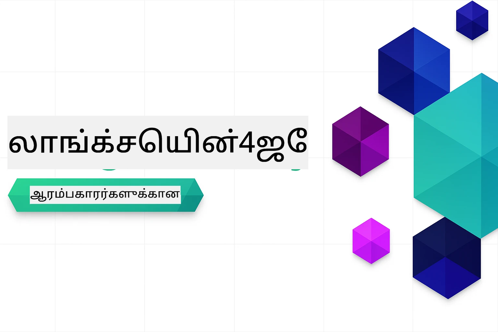

# LangChain4j துவக்கத்திற்கு

LangChain4j மற்றும் Azure OpenAI GPT-5.2 உடன் AI பயன்பாடுகளை கட்டியமைக்கும் ஒரு பாடநெறி, அடிப்படையான அரட்டை முதல் AI முகவர்கள் வரை.

### 🌐 பன்மொழி ஆதரவு

#### GitHub Action மூலம் ஆதரிக்கப்படுகிறது (தானாகவும் எப்போதும் புதுப்பிக்கப்படுவதாகவும்)

<!-- CO-OP TRANSLATOR LANGUAGES TABLE START -->
[Arabic](../ar/README.md) | [Bengali](../bn/README.md) | [Bulgarian](../bg/README.md) | [Burmese (Myanmar)](../my/README.md) | [Chinese (Simplified)](../zh-CN/README.md) | [Chinese (Traditional, Hong Kong)](../zh-HK/README.md) | [Chinese (Traditional, Macau)](../zh-MO/README.md) | [Chinese (Traditional, Taiwan)](../zh-TW/README.md) | [Croatian](../hr/README.md) | [Czech](../cs/README.md) | [Danish](../da/README.md) | [Dutch](../nl/README.md) | [Estonian](../et/README.md) | [Finnish](../fi/README.md) | [French](../fr/README.md) | [German](../de/README.md) | [Greek](../el/README.md) | [Hebrew](../he/README.md) | [Hindi](../hi/README.md) | [Hungarian](../hu/README.md) | [Indonesian](../id/README.md) | [Italian](../it/README.md) | [Japanese](../ja/README.md) | [Kannada](../kn/README.md) | [Khmer](../km/README.md) | [Korean](../ko/README.md) | [Lithuanian](../lt/README.md) | [Malay](../ms/README.md) | [Malayalam](../ml/README.md) | [Marathi](../mr/README.md) | [Nepali](../ne/README.md) | [Nigerian Pidgin](../pcm/README.md) | [Norwegian](../no/README.md) | [Persian (Farsi)](../fa/README.md) | [Polish](../pl/README.md) | [Portuguese (Brazil)](../pt-BR/README.md) | [Portuguese (Portugal)](../pt-PT/README.md) | [Punjabi (Gurmukhi)](../pa/README.md) | [Romanian](../ro/README.md) | [Russian](../ru/README.md) | [Serbian (Cyrillic)](../sr/README.md) | [Slovak](../sk/README.md) | [Slovenian](../sl/README.md) | [Spanish](../es/README.md) | [Swahili](../sw/README.md) | [Swedish](../sv/README.md) | [Tagalog (Filipino)](../tl/README.md) | [Tamil](./README.md) | [Telugu](../te/README.md) | [Thai](../th/README.md) | [Turkish](../tr/README.md) | [Ukrainian](../uk/README.md) | [Urdu](../ur/README.md) | [Vietnamese](../vi/README.md)

> **உள்ளூர் க்ளோன் செய்வதற்கு விருப்பமா?**
>
> இந்த களஞ்சியம் 50+ மொழி மொழிபெயர்ப்புகளை உள்ளடக்கியது, இது பதிவிறக்க அளவை பெரிதாக அதிகரிக்கிறது. மொழிபெயர்ப்புகள் இல்லாமல் க்ளோன் செய்ய, sparse checkout பயன்படுத்தவும்:
>
> **Bash / macOS / Linux:**
> ```bash
> git clone --filter=blob:none --sparse https://github.com/microsoft/LangChain4j-for-Beginners.git
> cd LangChain4j-for-Beginners
> git sparse-checkout set --no-cone '/*' '!translations' '!translated_images'
> ```
>
> **CMD (Windows):**
> ```cmd
> git clone --filter=blob:none --sparse https://github.com/microsoft/LangChain4j-for-Beginners.git
> cd LangChain4j-for-Beginners
> git sparse-checkout set --no-cone "/*" "!translations" "!translated_images"
> ```
>
> இது படிப்பை முடிக்க தேவையான அனைத்தையும் மிகவும் விரைவான பதிவிறக்கத்துடன் தருகிறது.
<!-- CO-OP TRANSLATOR LANGUAGES TABLE END -->

## உள்ளடக்கப் பட்டியல்

1. [அறிமுகம்](01-introduction/README.md) - LangChain4j அடிப்படைகளை கற்றுக்கொள்ளவும்
2. [அரட்டை வடிவமைப்பு](02-prompt-engineering/README.md) - பயனுள்ள அரட்டை வடிவமைப்பை கையாளவும்
3. [RAG (தகவல் மேம்படுத்தப்பட்ட உருவாக்கம்)](03-rag/README.md) - புத்திசாலித்தனமான அறிவியல் அமைப்புகளை உருவாக்கவும்
4. [கருவிகள்](04-tools/README.md) - வெளிப்புற கருவிகள் மற்றும் எளிய உதவியாளர்களை ஒருங்கிணைக்கவும்
5. [MCP (மாதிரி சூழல் நடைமுறை)](05-mcp/README.md) - மாதிரி சூழல் நடைமுறை (MCP) மற்றும் முகவர் மாட்யூல்களுடன் பணியாற்றவும்

### காணொளி பயிற்சிகள்

ஒவ்வொரு மோட்டியூலும் ஒரு இணை நேர்காணல் அமர்வைக் கொண்டுள்ளது, அங்கே நாங்கள் கோடுகள் மற்றும் யூகங்களை படி படியாக நடத்துகிறோம்.

| மோட்டியூல் | காணொளி |
|--------|-------|
| 01 - அறிமுகம் | [LangChain4j உடன் தொடங்குதல்](https://www.youtube.com/live/nl_troDm8rQ) |
| 02 - அரட்டை வடிவமைப்பு | [LangChain4j உடன் அரட்டை வடிவமைப்பு](https://www.youtube.com/live/PJ6aBaE6bog) |
| 03 - RAG | [LangChain4j உடன் RAG](https://www.youtube.com/watch?v=_olq75ZH_eY) |
| 04 - கருவிகள் & 05 - MCP | [கருவிகள் மற்றும் MCP உடன் AI முகவர்கள்](https://www.youtube.com/watch?v=O_J30kZc0rw) |

---

## கற்றல் பாதை

**LangChain4j இல் புதியவரா?** முக்கிய சொற்கள் மற்றும் யூகங்களுக்கான விவரணைகளுக்கு [அகராதி](docs/GLOSSARY.md) பாருங்கள்.

> **விரைவு தொடக்கம்**

1. இந்த களஞ்சியத்தை உங்கள் GitHub கணக்குக்கு ஒட்டவும்
2. **Code** → **Codespaces** தாவலை கிளிக் செய்யவும் → **...** → **New with options...** தேர்வு செய்யவும்
3. இயல்புகளை பயன்படுத்தவும் – இதில் இந்த பாடநெறிக்கான Development கன்டெய்னர் தேர்வு செய்யப்படும்
4. **Create codespace** கிளிக் செய்யவும்
5. சூழல் தயாராக 5-10 நிமிடங்கள் காத்திருங்கள்
6. தொடங்க [அறிமுகம்](./01-introduction/README.md) நேரடியாக சென்று கற்கவும்!

மோட்டியூல்கள் முடிந்த பின், LangChain4j சோதனை யூகங்களை செயல்படுத்த [சோதனை வழிகாட்டி](docs/TESTING.md) பாருங்கள்.

> **குறிப்பு:** இந்த பயிற்சி Azure OpenAI ஐ பயன்படுத்துகிறது. ஒரு [இலவச Azure கணக்கு](https://aka.ms/azure-free-account) இல்லையென்றால், முதலில் அதில் தொடங்கவும்.


## GitHub Copilot உடன் கற்றல்

விரைவாக கோடிங் செய்ய, இந்த திட்டத்தை GitHub Codespace இல் அல்லது உங்கள் உள்ளூர் IDE இல் devcontainer உடன் திறக்கவும். இந்த பாடநெறியில் பயன்படுத்தப்படும் devcontainer GitHub Copilot உடன் முன்கூட்டியே அமைக்கப்பட்டுள்ளது, இது AI இணை புரொகிராமிங்கிற்கு உதவும்.

ஒவ்வொரு கோடு எடுத்துக்காட்டும் GitHub Copilot சோதனைக் கேள்விகளுடன் வருகிறது. கீழே உள்ள 💡/🤖 குறியீடுகளை காணவும்:

- **Java கோப்பு தலைப்புகள்** - ஒவ்வொரு எடுத்துக்காட்டிற்கும் தொடர்புடைய கேள்விகள்
- **மோட்டியூல் READMEகள்** - கோடு எடுத்துக்காட்டுகளுக்குப்பின் ஆராய்ச்சி கேள்விகள்

**எப்படி பயன்படுத்துவது:** எந்த ஒரு கோப்பையும் திறக்கவும், Copilot க்கு பரிந்துரைக்கப்பட்ட கேள்விகளை கேள். இது முழுமையான மூலக் குறியீட்டை புரிந்து, விளக்கவும் விரிவாக்கவும் மாற்று ஆலோசனைகளை வழங்கலாம்.

மேலும் கற்றுக்கொள்ள விரும்புகிறீர்களா? [AI இணை புரொகிராமிங்குக்கான Copilot](https://aka.ms/GitHubCopilotAI) பார்க்கவும்.


## கூடுதல் வளங்கள்

<!-- CO-OP TRANSLATOR OTHER COURSES START -->
### LangChain
[](https://aka.ms/langchain4j-for-beginners)
[](https://aka.ms/langchainjs-for-beginners?WT.mc_id=m365-94501-dwahlin)
[](https://github.com/microsoft/langchain-for-beginners?WT.mc_id=m365-94501-dwahlin)
---

### Azure / Edge / MCP / Agents
[](https://github.com/microsoft/AZD-for-beginners?WT.mc_id=academic-105485-koreyst)
[](https://github.com/microsoft/edgeai-for-beginners?WT.mc_id=academic-105485-koreyst)
[](https://github.com/microsoft/mcp-for-beginners?WT.mc_id=academic-105485-koreyst)
[](https://github.com/microsoft/ai-agents-for-beginners?WT.mc_id=academic-105485-koreyst)

---
 
### Generative AI Series
[](https://github.com/microsoft/generative-ai-for-beginners?WT.mc_id=academic-105485-koreyst)
[-9333EA?style=for-the-badge&labelColor=E5E7EB&color=9333EA)](https://github.com/microsoft/Generative-AI-for-beginners-dotnet?WT.mc_id=academic-105485-koreyst)
[-C084FC?style=for-the-badge&labelColor=E5E7EB&color=C084FC)](https://github.com/microsoft/generative-ai-for-beginners-java?WT.mc_id=academic-105485-koreyst)
[-E879F9?style=for-the-badge&labelColor=E5E7EB&color=E879F9)](https://github.com/microsoft/generative-ai-with-javascript?WT.mc_id=academic-105485-koreyst)

---
 
### Core Learning
[](https://aka.ms/ml-beginners?WT.mc_id=academic-105485-koreyst)
[](https://aka.ms/datascience-beginners?WT.mc_id=academic-105485-koreyst)
[](https://aka.ms/ai-beginners?WT.mc_id=academic-105485-koreyst)
[](https://github.com/microsoft/Security-101?WT.mc_id=academic-96948-sayoung)

[](https://aka.ms/webdev-beginners?WT.mc_id=academic-105485-koreyst)
[](https://aka.ms/iot-beginners?WT.mc_id=academic-105485-koreyst)
[](https://github.com/microsoft/xr-development-for-beginners?WT.mc_id=academic-105485-koreyst)

---
 
### கோபைலட் தொடர்கள்
[](https://aka.ms/GitHubCopilotAI?WT.mc_id=academic-105485-koreyst)
[](https://github.com/microsoft/mastering-github-copilot-for-dotnet-csharp-developers?WT.mc_id=academic-105485-koreyst)
[](https://github.com/microsoft/CopilotAdventures?WT.mc_id=academic-105485-koreyst)
<!-- CO-OP TRANSLATOR OTHER COURSES END -->

## உதவி பெறுதல்

நீங்கள் அடைக்கலம் அடைந்தால் அல்லது AI செயலிகளைக் கட்டமைப்பதையொற்றி ஏதேனும் கேள்விகள் இருந்தால், சேர்ந்துகொள்ளவும்:

[](https://aka.ms/foundry/discord)

உற்பத்தியின் கருத்துகள் அல்லது பிழைகள் இருந்தால்:

[](https://aka.ms/foundry/forum)

## உரிமம்

MIT உரிமம் - விவரங்களுக்கு [LICENSE](../../LICENSE) கோப்பைச் சரிபார்க்கவும்.

---

<!-- CO-OP TRANSLATOR DISCLAIMER START -->
**மறுப்பு**:
இந்த ஆவணம் AI மொழிபெயர்ப்பு சேவை [Co-op Translator](https://github.com/Azure/co-op-translator) பயன்படுத்தி மொழிபெயர்க்கப்பட்டுள்ளது. நாங்கள் துல்லியத்திற்காக முயற்சி செய்துள்ளோம், ஆனால் தானாக செய்யப்படும் மொழிபெயர்ப்புகளில் பிழைகள் அல்லது தவறுகள் இருக்கலாம் என்பதை கவனத்தில் கொள்ளவும். அசல் ஆவணம் அதன் தாய்மொழியில் அதிகாரப்பூர்வ ஆதாரமாக கருதப்பட வேண்டும். முக்கியமான தகவல்களுக்கு, தொழில்நுட்பமான மனித மொழிபெயர்ப்பு பரிந்துரைக்கப்படுகிறது. இந்த மொழிபெயர்ப்பைப் பயன்படுத்துவதால் ஏற்படும் எந்த தவறான புரிதல்கள் அல்லது தவறான விளக்கத்திற்கும் நாங்கள் பொறுப்பில்வில்லை.
<!-- CO-OP TRANSLATOR DISCLAIMER END -->