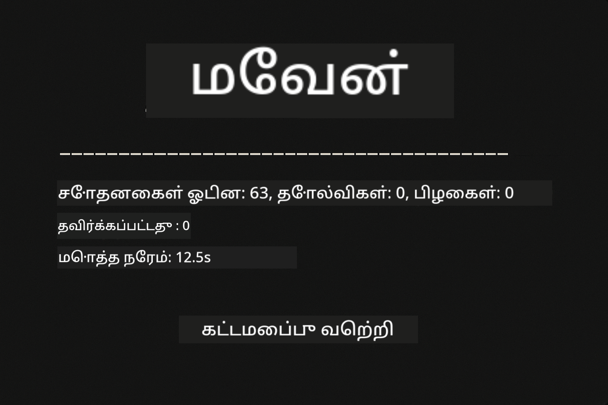
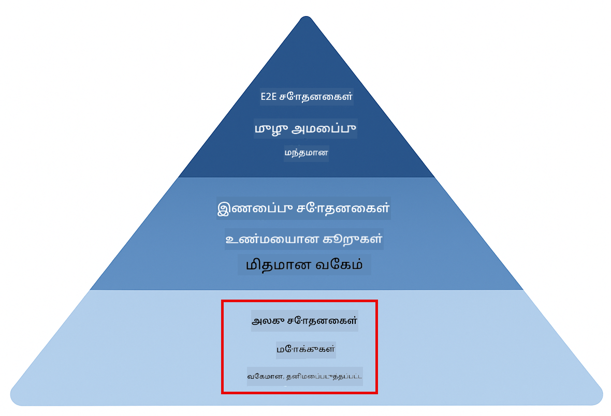
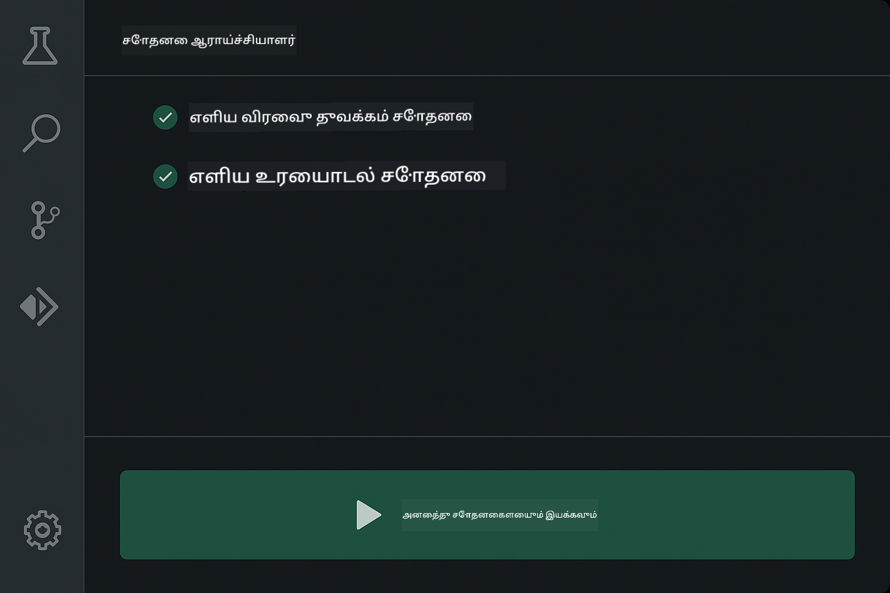
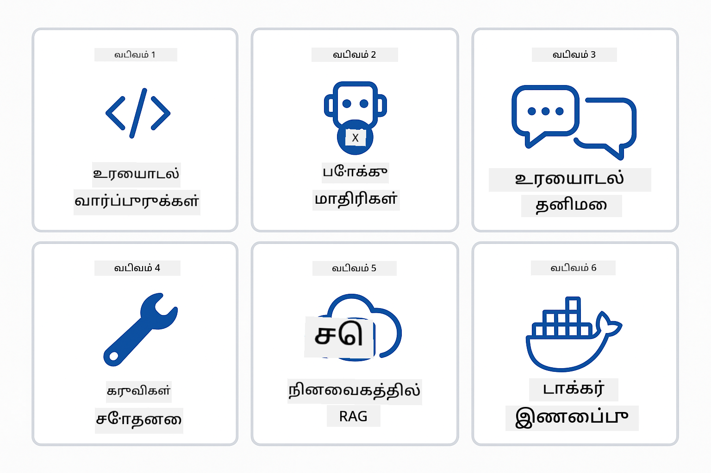
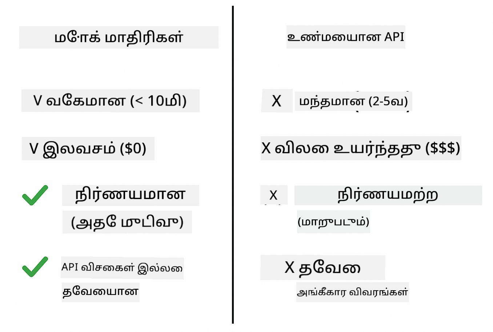
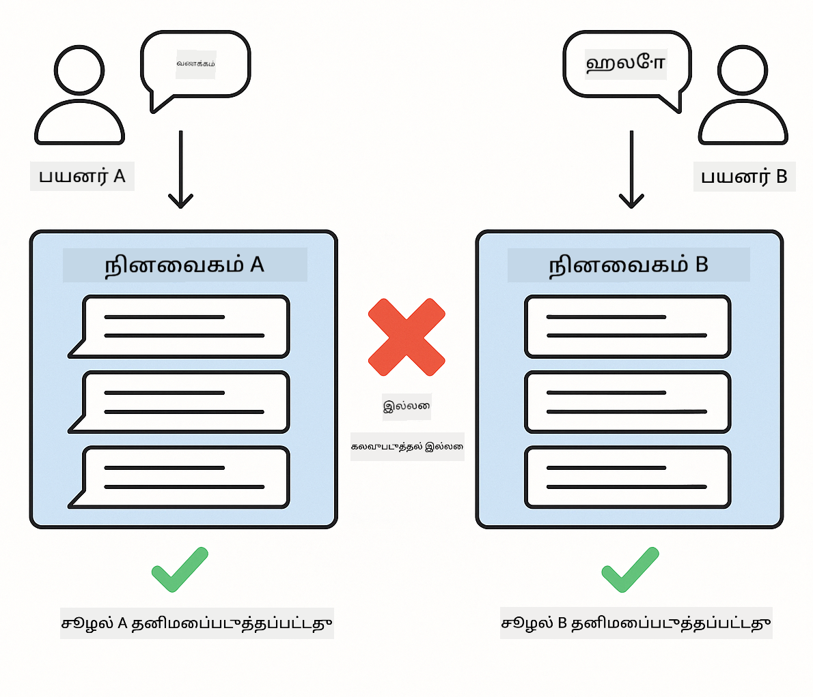
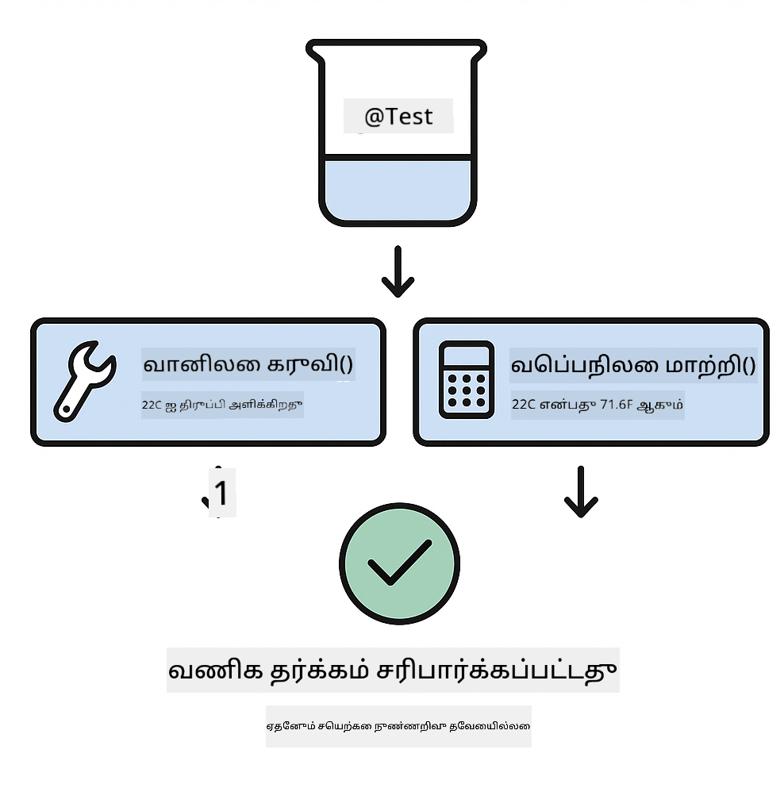

<!--
CO_OP_TRANSLATOR_METADATA:
{
  "original_hash": "b975537560c404d5f254331832811e78",
  "translation_date": "2025-12-13T21:33:34+00:00",
  "source_file": "docs/TESTING.md",
  "language_code": "ta"
}
-->
# LangChain4j பயன்பாடுகளை சோதனை செய்தல்

## உள்ளடக்க அட்டவணை

- [விரைவு தொடக்கம்](../../../docs)
- [சோதனைகள் என்னவை கவர்கின்றன](../../../docs)
- [சோதனைகளை இயக்குதல்](../../../docs)
- [VS கோடில் சோதனைகளை இயக்குதல்](../../../docs)
- [சோதனை மாதிரிகள்](../../../docs)
- [சோதனை தத்துவம்](../../../docs)
- [அடுத்த படிகள்](../../../docs)

இந்த வழிகாட்டி API விசைகள் அல்லது வெளிப்புற சேவைகள் தேவையின்றி AI பயன்பாடுகளை எப்படி சோதிக்கலாம் என்பதை காட்டும் சோதனைகளின் வழியாக உங்களை நடத்துகிறது.

## விரைவு தொடக்கம்

ஒரே கட்டளையுடன் அனைத்து சோதனைகளையும் இயக்கவும்:

**Bash:**
```bash
mvn test
```

**PowerShell:**
```powershell
mvn --% test
```



*எல்லா சோதனைகளும் தோல்வி இல்லாமல் வெற்றிகரமாக இயங்குவதை காட்டும் சோதனை முடிவுகள்*

## சோதனைகள் என்னவை கவர்கின்றன

இந்த பாடநெறி உள்ளூர் முறையில் இயங்கும் **அலகு சோதனைகள்** மீது கவனம் செலுத்துகிறது. ஒவ்வொரு சோதனையும் தனித்துவமாக ஒரு LangChain4j கருத்தை விளக்குகிறது.



*அலகு சோதனைகள் (விரைவு, தனித்துவமானவை), ஒருங்கிணைப்பு சோதனைகள் (உண்மையான கூறுகள்), மற்றும் முழு அமைப்பு சோதனைகள் (Docker உடன்) ஆகியவற்றின் சமநிலை காட்டும் சோதனை முக்கோணம். இந்த பயிற்சி அலகு சோதனையை கவர்கிறது.*

| தொகுதி | சோதனைகள் | கவனம் | முக்கிய கோப்புகள் |
|--------|-------|-------|-----------|
| **00 - விரைவு தொடக்கம்** | 6 | கேள்வி வடிவங்கள் மற்றும் மாறி மாற்றம் | `SimpleQuickStartTest.java` |
| **01 - அறிமுகம்** | 8 | உரையாடல் நினைவகம் மற்றும் நிலையான உரையாடல் | `SimpleConversationTest.java` |
| **02 - கேள்வி பொறியியல்** | 12 | GPT-5 மாதிரிகள், ஆர்வ நிலைகள், கட்டமைக்கப்பட்ட வெளியீடு | `SimpleGpt5PromptTest.java` |
| **03 - RAG** | 10 | ஆவண ஏற்றுதல், நுழைவுகள், ஒத்திசைவு தேடல் | `DocumentServiceTest.java` |
| **04 - கருவிகள்** | 12 | செயல்பாடு அழைப்பு மற்றும் கருவி சங்கிலி | `SimpleToolsTest.java` |
| **05 - MCP** | 15 | Docker உடன் மாடல் சூழல் நெறிமுறை | `SimpleMcpTest.java`, `McpDockerTransportTest.java` |

## சோதனைகளை இயக்குதல்

**மூலத்திலிருந்து அனைத்து சோதனைகளையும் இயக்கவும்:**

**Bash:**
```bash
mvn test
```

**PowerShell:**
```powershell
mvn --% test
```

**குறிப்பிட்ட தொகுதிக்கான சோதனைகளை இயக்கவும்:**

**Bash:**
```bash
cd 01-introduction && mvn test
# அல்லது ரூட் இருந்து
mvn test -pl 01-introduction
```

**PowerShell:**
```powershell
cd 01-introduction; mvn --% test
# அல்லது ரூட் இருந்து
mvn --% test -pl 01-introduction
```

**ஒரு தனி சோதனை வகுப்பை இயக்கவும்:**

**Bash:**
```bash
mvn test -Dtest=SimpleConversationTest
```

**PowerShell:**
```powershell
mvn --% test -Dtest=SimpleConversationTest
```

**குறிப்பிட்ட சோதனை முறையை இயக்கவும்:**

**Bash:**
```bash
mvn test -Dtest=SimpleConversationTest#உரையாடல் வரலாற்றை பராமரிக்க வேண்டும்
```

**PowerShell:**
```powershell
mvn --% test -Dtest=SimpleConversationTest#உரையாடல் வரலாற்றை பராமரிக்க வேண்டும்
```

## VS கோடில் சோதனைகளை இயக்குதல்

நீங்கள் Visual Studio Code பயன்படுத்தினால், Test Explorer சோதனைகளை இயக்க மற்றும் பிழைதிருத்துவதற்கான காட்சியியல் இடைமுகத்தை வழங்குகிறது.



*VS Code Test Explorer அனைத்து ஜாவா சோதனை வகுப்புகளும் தனிப்பட்ட சோதனை முறைகளும் கொண்ட சோதனை மரத்தை காட்டுகிறது*

**VS Code இல் சோதனைகளை இயக்க:**

1. செயல்பாட்டு பட்டியில் உள்ள பீக்கர் ஐகானை கிளிக் செய்து Test Explorer ஐ திறக்கவும்
2. அனைத்து தொகுதிகளும் சோதனை வகுப்புகளும் காண்பிக்க சோதனை மரத்தை விரிவாக்கவும்
3. தனிப்பட்ட சோதனையை இயக்க எந்த சோதனையின் பக்கத்தில் உள்ள பிளே பொத்தானை கிளிக் செய்யவும்
4. முழு தொகுப்பை இயக்க "Run All Tests" ஐ கிளிக் செய்யவும்
5. எந்த சோதனையையும் வலது கிளிக் செய்து "Debug Test" ஐ தேர்ந்தெடுத்து இடைநிறுத்தங்களை அமைத்து குறியீட்டின் வழியாக நகரவும்

Test Explorer பசுமை சரிபார்ப்பு குறியீடுகளை காட்டுகிறது மற்றும் சோதனை தோல்வியடைந்தால் விரிவான தோல்வி செய்திகளை வழங்குகிறது.

## சோதனை மாதிரிகள்



*LangChain4j பயன்பாடுகளுக்கான ஆறு சோதனை மாதிரிகள்: கேள்வி வடிவங்கள், மாதிரிகள் மொக்கிங், உரையாடல் தனித்துவம், கருவிகள் சோதனை, நினைவக RAG, மற்றும் Docker ஒருங்கிணைப்பு*

### மாதிரி 1: கேள்வி வடிவங்களை சோதனை செய்தல்

எளிய மாதிரி AI மாதிரியை அழைக்காமல் கேள்வி வடிவங்களை சோதனை செய்கிறது. மாறி மாற்றம் சரியாக இயங்குகிறதா மற்றும் கேள்விகள் எதிர்பார்த்தபடி வடிவமைக்கப்பட்டுள்ளதா என்பதை நீங்கள் சரிபார்க்கிறீர்கள்.


*மாறி மாற்றம் ஓட்டத்தை காட்டும் கேள்வி வடிவ சோதனை: இடமாற்றிகள் கொண்ட வடிவம் → மதிப்புகள் பொருந்தும் → வடிவமைக்கப்பட்ட வெளியீடு சரிபார்க்கப்பட்டது*

```java
@Test
@DisplayName("Should format prompt template with variables")
void testPromptTemplateFormatting() {
    PromptTemplate template = PromptTemplate.from(
        "Best time to visit {{destination}} for {{activity}}?"
    );
    
    Prompt prompt = template.apply(Map.of(
        "destination", "Paris",
        "activity", "sightseeing"
    ));
    
    assertThat(prompt.text()).isEqualTo("Best time to visit Paris for sightseeing?");
}
```

இந்த சோதனை `00-quick-start/src/test/java/com/example/langchain4j/quickstart/SimpleQuickStartTest.java` இல் உள்ளது.

**இதை இயக்கவும்:**

**Bash:**
```bash
cd 00-quick-start && mvn test -Dtest=SimpleQuickStartTest#சோதனைPromptTemplateவடிவமைப்பு
```

**PowerShell:**
```powershell
cd 00-quick-start; mvn --% test -Dtest=SimpleQuickStartTest#சோதனைPromptTemplateவடிவமைப்பு
```

### மாதிரி 2: மொழி மாதிரிகளை மொக்கிங் செய்தல்

உரையாடல் தர்க்கத்தை சோதிக்கும் போது, Mockito பயன்படுத்தி முன்கூட்டியே தீர்மானிக்கப்பட்ட பதில்களை வழங்கும் போலி மாதிரிகளை உருவாக்கவும். இது சோதனைகளை விரைவாக, இலவசமாக மற்றும் தீர்மானமானதாக மாற்றுகிறது.



*சோதனைக்கான மொக்குகள் விரும்பப்படுவதற்கான காரணங்களை காட்டும் ஒப்பீடு: அவை விரைவானவை, இலவசம், தீர்மானமானவை மற்றும் API விசைகள் தேவையில்லை*

```java
@ExtendWith(MockitoExtension.class)
class SimpleConversationTest {
    
    private ConversationService conversationService;
    
    @Mock
    private OpenAiOfficialChatModel mockChatModel;
    
    @BeforeEach
    void setUp() {
        ChatResponse mockResponse = ChatResponse.builder()
            .aiMessage(AiMessage.from("This is a test response"))
            .build();
        when(mockChatModel.chat(anyList())).thenReturn(mockResponse);
        
        conversationService = new ConversationService(mockChatModel);
    }
    
    @Test
    void shouldMaintainConversationHistory() {
        String conversationId = conversationService.startConversation();
        
        ChatResponse mockResponse1 = ChatResponse.builder()
            .aiMessage(AiMessage.from("Response 1"))
            .build();
        ChatResponse mockResponse2 = ChatResponse.builder()
            .aiMessage(AiMessage.from("Response 2"))
            .build();
        ChatResponse mockResponse3 = ChatResponse.builder()
            .aiMessage(AiMessage.from("Response 3"))
            .build();
        
        when(mockChatModel.chat(anyList()))
            .thenReturn(mockResponse1)
            .thenReturn(mockResponse2)
            .thenReturn(mockResponse3);

        conversationService.chat(conversationId, "First message");
        conversationService.chat(conversationId, "Second message");
        conversationService.chat(conversationId, "Third message");

        List<ChatMessage> history = conversationService.getHistory(conversationId);
        assertThat(history).hasSize(6); // 3 பயனர் + 3 AI செய்திகள்
    }
}
```

இந்த மாதிரி `01-introduction/src/test/java/com/example/langchain4j/service/SimpleConversationTest.java` இல் உள்ளது. மொக் நினைவக மேலாண்மை சரியாக இயங்குவதை உறுதிப்படுத்துகிறது.

### மாதிரி 3: உரையாடல் தனித்துவத்தை சோதனை செய்தல்

உரையாடல் நினைவகம் பல பயனர்களை தனித்தனியாக வைத்திருக்க வேண்டும். இந்த சோதனை உரையாடல்கள் சூழலை கலக்காமல் இருப்பதை உறுதிப்படுத்துகிறது.



*பயனர்கள் தனித்தனியான நினைவக சேமிப்புகளை வைத்திருப்பதை காட்டும் உரையாடல் தனித்துவ சோதனை*

```java
@Test
void shouldIsolateConversationsByid() {
    String conv1 = conversationService.startConversation();
    String conv2 = conversationService.startConversation();
    
    ChatResponse mockResponse = ChatResponse.builder()
        .aiMessage(AiMessage.from("Response"))
        .build();
    when(mockChatModel.chat(anyList())).thenReturn(mockResponse);

    conversationService.chat(conv1, "Message for conversation 1");
    conversationService.chat(conv2, "Message for conversation 2");

    List<ChatMessage> history1 = conversationService.getHistory(conv1);
    List<ChatMessage> history2 = conversationService.getHistory(conv2);
    
    assertThat(history1).hasSize(2);
    assertThat(history2).hasSize(2);
}
```

ஒவ்வொரு உரையாடலும் தனித்துவமான வரலாற்றை பராமரிக்கிறது. உற்பத்தி அமைப்புகளில், இந்த தனித்துவம் பல பயனர் பயன்பாடுகளுக்கு அவசியம்.

### மாதிரி 4: கருவிகளை தனித்தனியாக சோதனை செய்தல்

கருவிகள் AI அழைக்கக்கூடிய செயல்பாடுகள். AI முடிவுகளுக்கு பொருட்படாமல் அவை சரியாக இயங்குகிறதா என்பதை நேரடியாக சோதிக்கவும்.



*AI அழைப்புகள் இல்லாமல் மொக் கருவி செயல்பாட்டை காட்டும் கருவிகள் தனித்தனியாக சோதனை செய்தல்*

```java
@Test
void shouldConvertCelsiusToFahrenheit() {
    TemperatureTool tempTool = new TemperatureTool();
    String result = tempTool.celsiusToFahrenheit(25.0);
    assertThat(result).containsPattern("77[.,]0°F");
}

@Test
void shouldDemonstrateToolChaining() {
    WeatherTool weatherTool = new WeatherTool();
    TemperatureTool tempTool = new TemperatureTool();

    String weatherResult = weatherTool.getCurrentWeather("Seattle");
    assertThat(weatherResult).containsPattern("\\d+°C");

    String conversionResult = tempTool.celsiusToFahrenheit(22.0);
    assertThat(conversionResult).containsPattern("71[.,]6°F");
}
```

இந்த சோதனைகள் `04-tools/src/test/java/com/example/langchain4j/agents/tools/SimpleToolsTest.java` இல் இருந்து கருவி தர்க்கத்தை AI பங்கேற்பின்றி சரிபார்க்கின்றன. சங்கிலி எடுத்துக்காட்டு ஒரு கருவியின் வெளியீடு மற்றொன்றின் உள்ளீடாக எப்படி செல்லும் என்பதை காட்டுகிறது.

### மாதிரி 5: நினைவக RAG சோதனை

RAG அமைப்புகள் வழக்கமாக வெக்டர் தரவுத்தளங்கள் மற்றும் நுழைவுச் சேவைகளை தேவைப்படுத்துகின்றன. நினைவக மாதிரி முழு குழாயை வெளிப்புற சார்புகள் இல்லாமல் சோதிக்க அனுமதிக்கிறது.


*தரவுத்தளம் தேவையின்றி ஆவண பகுப்பாய்வு, நுழைவு சேமிப்பு மற்றும் ஒத்திசைவு தேடலை காட்டும் நினைவக RAG சோதனை பணிகள்*

```java
@Test
void testProcessTextDocument() {
    String content = "This is a test document.\nIt has multiple lines.";
    InputStream inputStream = new ByteArrayInputStream(content.getBytes(StandardCharsets.UTF_8));
    
    DocumentService.ProcessedDocument result = 
        documentService.processDocument(inputStream, "test.txt");

    assertNotNull(result);
    assertTrue(result.segments().size() > 0);
    assertEquals("test.txt", result.segments().get(0).metadata().getString("filename"));
}
```

இந்த சோதனை `03-rag/src/test/java/com/example/langchain4j/rag/service/DocumentServiceTest.java` இல் இருந்து ஆவணத்தை நினைவகத்தில் உருவாக்கி துண்டாக்கல் மற்றும் மெட்டாடேட்டா கையாளுதலை சரிபார்க்கிறது.

### மாதிரி 6: Docker உடன் ஒருங்கிணைப்பு சோதனை

சில அம்சங்களுக்கு உண்மையான கட்டமைப்பு தேவை. MCP தொகுதி Testcontainers பயன்படுத்தி Docker கன்டெய்னர்களை ஒருங்கிணைப்பு சோதனைகளுக்காக இயக்குகிறது. இவை உங்கள் குறியீடு உண்மையான சேவைகளுடன் வேலை செய்கிறது என்பதை உறுதிப்படுத்துகின்றன மற்றும் சோதனை தனித்துவத்தையும் பராமரிக்கின்றன.


*தொடக்கம், சோதனை இயக்கம், நிறுத்தல் மற்றும் சுத்தம் செய்யும் தானியங்கி கன்டெய்னர் வாழ்க்கைச்சுழற்சியை காட்டும் MCP ஒருங்கிணைப்பு சோதனை*

`05-mcp/src/test/java/com/example/langchain4j/mcp/McpDockerTransportTest.java` இல் உள்ள சோதனைகள் Docker இயங்க வேண்டும்.

**இவற்றை இயக்கவும்:**

**Bash:**
```bash
cd 05-mcp && mvn test
```

**PowerShell:**
```powershell
cd 05-mcp; mvn --% test
```

## சோதனை தத்துவம்

உங்கள் குறியீட்டை சோதியுங்கள், AI ஐ அல்ல. உங்கள் சோதனைகள் நீங்கள் எழுதும் குறியீட்டை சரிபார்க்க வேண்டும், கேள்விகள் எப்படி கட்டமைக்கப்படுகின்றன, நினைவகம் எப்படி பராமரிக்கப்படுகிறது, கருவிகள் எப்படி செயல்படுகின்றன என்பதைக் கவனிக்க வேண்டும். AI பதில்கள் மாறுபடும் மற்றும் சோதனை உறுதிப்படுத்தல்களில் சேர்க்கப்படக்கூடாது. உங்கள் கேள்வி வடிவம் மாறிகளை சரியாக மாற்றுகிறதா என்பதை கேளுங்கள், AI சரியான பதிலை தருகிறதா என்று அல்ல.

மொழி மாதிரிகளுக்கு மொக்குகளை பயன்படுத்தவும். அவை மெதுவான, செலவான மற்றும் தீர்மானமற்ற வெளிப்புற சார்புகள். மொக்கிங் சோதனைகளை வினாடிகள் அல்ல, மில்லி வினாடிகளுக்கு விரைவாக, இலவசமாக API செலவில்லாமல், மற்றும் ஒவ்வொரு முறையும் ஒரே முடிவுடன் தீர்மானமானதாக மாற்றுகிறது.

சோதனைகளை சுயாதீனமாக வைத்திருங்கள். ஒவ்வொரு சோதனையும் தன்னுடைய தரவை அமைக்க வேண்டும், மற்ற சோதனைகளுக்கு சாராமையாக இருக்க வேண்டும் மற்றும் தன்னுடைய பின் சுத்தம் செய்ய வேண்டும். சோதனைகள் இயக்க வரிசையை பொருட்படுத்தாமல் வெற்றி பெற வேண்டும்.

மகிழ்ச்சியான பாதையைத் தாண்டி எல்லை வழக்குகளை சோதியுங்கள். காலியான உள்ளீடுகள், மிகப்பெரிய உள்ளீடுகள், சிறப்பு எழுத்துக்கள், தவறான அளவுருக்கள் மற்றும் எல்லை நிலைகள் ஆகியவற்றை முயற்சிக்கவும். இவை பொதுவாக சாதாரண பயன்பாட்டில் தெரியாத பிழைகளை வெளிப்படுத்துகின்றன.

விளக்கமான பெயர்களைப் பயன்படுத்தவும். `shouldMaintainConversationHistoryAcrossMultipleMessages()` ஐ `test1()` உடன் ஒப்பிடுங்கள். முதல் பெயர் என்ன சோதிக்கப்படுகிறது என்பதை தெளிவாக கூறுகிறது, தோல்விகளை பிழைத்திருத்துவது எளிதாகிறது.

## அடுத்த படிகள்

இப்போது நீங்கள் சோதனை மாதிரிகளை புரிந்துகொண்டுள்ளீர்கள், ஒவ்வொரு தொகுதியிலும் ஆழமாக சென்று கற்றுக்கொள்ளுங்கள்:

- **[00 - விரைவு தொடக்கம்](../00-quick-start/README.md)** - கேள்வி வடிவ அடிப்படைகளுடன் தொடங்கவும்
- **[01 - அறிமுகம்](../01-introduction/README.md)** - உரையாடல் நினைவக மேலாண்மையை கற்றுக்கொள்ளவும்
- **[02 - கேள்வி பொறியியல்](../02-prompt-engineering/README.md)** - GPT-5 கேள்வி மாதிரிகளை ஆற்றல் பெறவும்
- **[03 - RAG](../03-rag/README.md)** - மீட்டெடுப்பு-வலுப்படுத்தப்பட்ட உருவாக்க அமைப்புகளை கட்டமைக்கவும்
- **[04 - கருவிகள்](../04-tools/README.md)** - செயல்பாடு அழைப்பு மற்றும் கருவி சங்கிலிகளை செயல்படுத்தவும்
- **[05 - MCP](../05-mcp/README.md)** - Docker உடன் மாடல் சூழல் நெறிமுறையை ஒருங்கிணைக்கவும்

ஒவ்வொரு தொகுதியின் README இல் இங்கு சோதிக்கப்பட்ட கருத்துக்களின் விரிவான விளக்கங்கள் உள்ளன.

---

**Navigation:** [← முதன்மைக்கு திரும்ப](../README.md)

---

<!-- CO-OP TRANSLATOR DISCLAIMER START -->
**குறிப்பு**:  
இந்த ஆவணம் AI மொழிபெயர்ப்பு சேவை [Co-op Translator](https://github.com/Azure/co-op-translator) மூலம் மொழிபெயர்க்கப்பட்டுள்ளது. நாங்கள் துல்லியத்திற்காக முயற்சித்தாலும், தானாக செய்யப்பட்ட மொழிபெயர்ப்புகளில் பிழைகள் அல்லது தவறுகள் இருக்கக்கூடும் என்பதை தயவுசெய்து கவனிக்கவும். அசல் ஆவணம் அதன் சொந்த மொழியில் அதிகாரப்பூர்வ மூலமாக கருதப்பட வேண்டும். முக்கியமான தகவல்களுக்கு, தொழில்முறை மனித மொழிபெயர்ப்பை பரிந்துரைக்கிறோம். இந்த மொழிபெயர்ப்பின் பயன்பாட்டால் ஏற்படும் எந்தவொரு தவறான புரிதலுக்கும் அல்லது தவறான விளக்கங்களுக்கும் நாங்கள் பொறுப்பேற்கமாட்டோம்.
<!-- CO-OP TRANSLATOR DISCLAIMER END -->