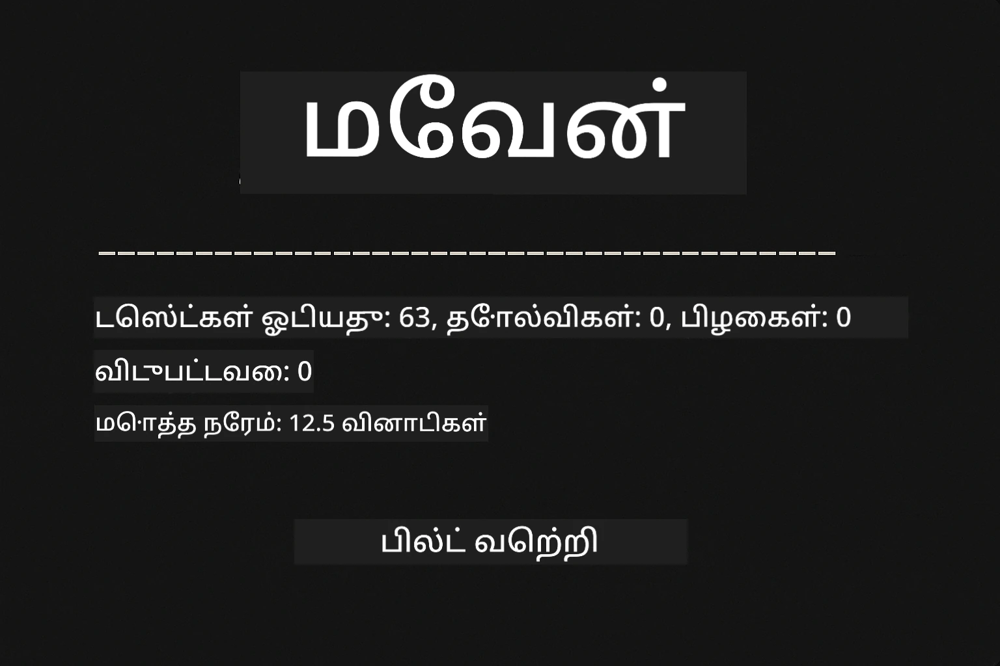
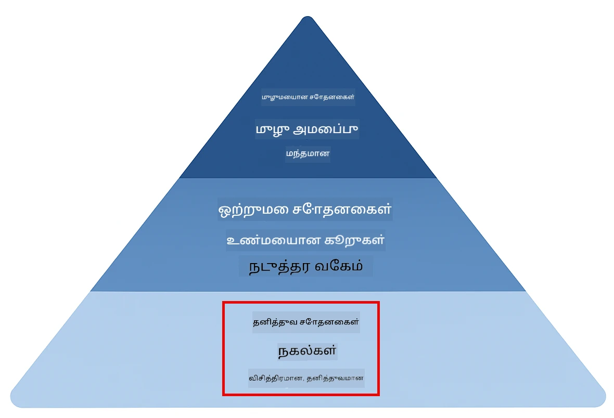
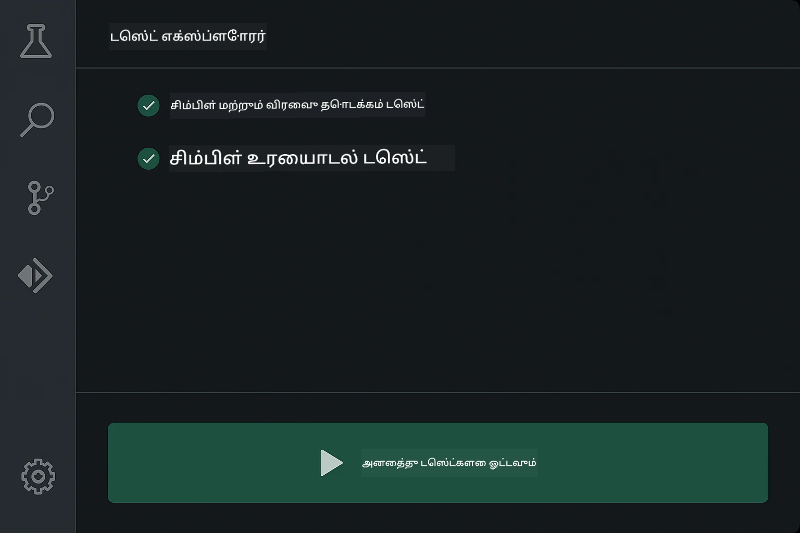
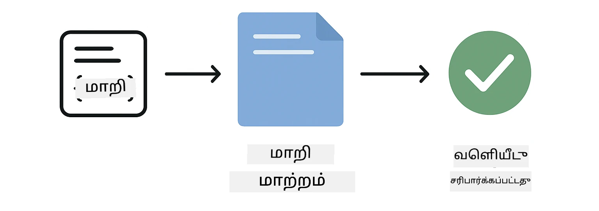
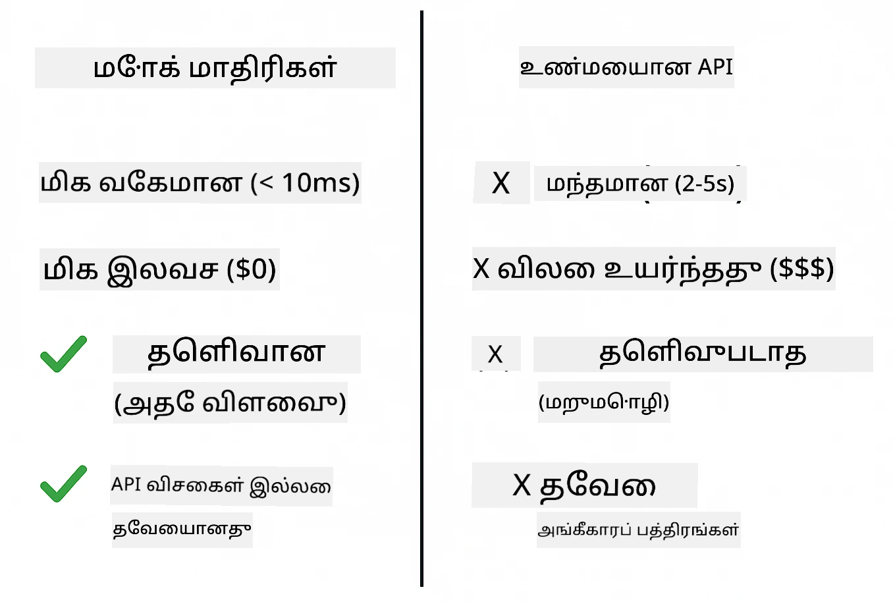
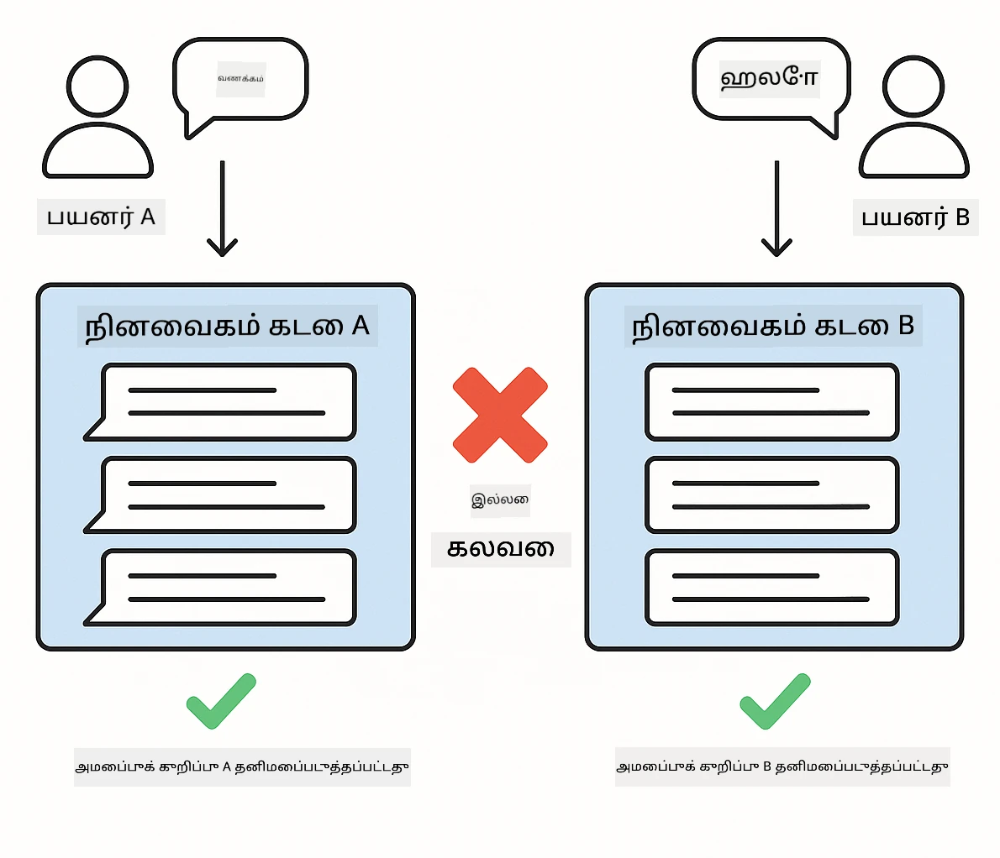
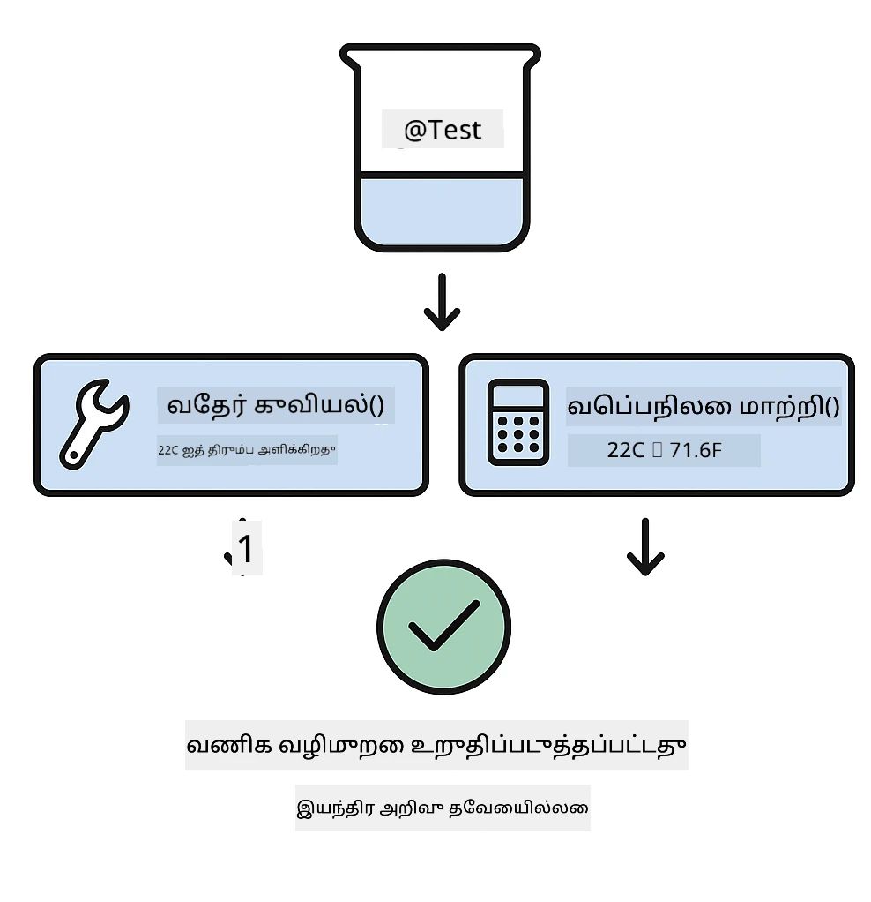
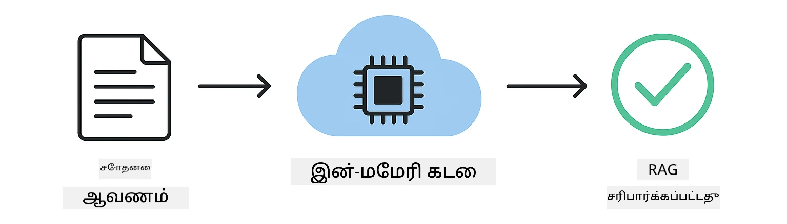

<!--
CO_OP_TRANSLATOR_METADATA:
{
  "original_hash": "ed93b3c14d58734ac10162967da958c1",
  "translation_date": "2025-12-31T07:04:08+00:00",
  "source_file": "docs/TESTING.md",
  "language_code": "ta"
}
-->
# LangChain4j பயன்பாடுகளை சோதனை செய்வது

## உள்ளடக்கக் அட்டவணை

- [விரைவு தொடக்கம்](../../../docs)
- [சோதனைகள் என்னவற்றை உள்ளடக்குகின்றன](../../../docs)
- [சோதனைகளை இயக்குதல்](../../../docs)
- [VS Code இல் சோதனைகள் இயக்குதல்](../../../docs)
- [சோதனை மாதிரிகள்](../../../docs)
- [சோதனை கொள்கை](../../../docs)
- [அடுத்த படிகள்](../../../docs)

இந்த வழிகாட்டி API விசைகள் அல்லது வெளி சேவைகள் தேவையின்றி AI பயன்பாடுகளை எப்படி சோதனை செய்வதென்பதைக் கையாளும் சோதனைகளைப் பற்றிச் சுருக்கமாக எடுத்துரைக்கிறது.

## Quick Start

ஒரே அதிரடியில் அனைத்து சோதனைகளையும் இயக்கவும்:

**Bash:**
```bash
mvn test
```

**PowerShell:**
```powershell
mvn --% test
```



*அனைத்து சோதனைகளும் தவறுகள் இல்லாமல் கடந்து சென்ற வெற்றிகரமான சோதனை இயக்கம்*

## What the Tests Cover

இந்த பாடநெறி உள்ளூரில் இயக்கப்படும் **யூனிட் சோதனைகள்** மீது கவனம் செலுத்துகிறது. ஒவ்வொரு சோதனையுமே தனித்தன்மையில் ஒரு குறிப்பிட்ட LangChain4j கருத்தை காட்டுகிறது.



*யூனிட் சோதனைகள் (வேகமானவை, தனிமைப்படுத்தப்பட்டவை), ஒருங்கிணைப்பு சோதனைகள் (உண்மையான கூறுகள்), மற்றும் End-to-End சோதனைகள் ஆகியவற்றுக்கிடையிலான சமநிலையை காண்பிக்கும் சோதனை பைரமிட். இந்த பயிற்சி யூனிட் சோதனைகளைக் கையாளுகிறது.*

| மொடியூல் | சோதனைகள் | முக்கிய அம்சம் | முக்கிய கோப்புகள் |
|--------|-------|-------|-----------|
| **00 - விரைவு தொடக்கம்** | 6 | ப்ராம்ட் வார்ப்புருக்கள் மற்றும் மாறிலி மாற்றம் | `SimpleQuickStartTest.java` |
| **01 - அறிமுகம்** | 8 | உரையாடல் நினைவகம் மற்றும் நிலைமையுடைய உரையாடல் | `SimpleConversationTest.java` |
| **02 - ப்ராம்ட் பொறியியல்** | 12 | GPT-5 மாதிரிகள், ஆர்வம் நிலைகள், வடிவமைக்கப்பட்ட வெளியீடு | `SimpleGpt5PromptTest.java` |
| **03 - RAG** | 10 | ஆவணங்கள் சேர்ப்பு, எம்பெடிங்ஸ், ஒத்திசைவு தேடல் | `DocumentServiceTest.java` |
| **04 - கருவிகள்** | 12 | முறைகள் அழைப்பு மற்றும் கருவி சங்கிலி | `SimpleToolsTest.java` |
| **05 - MCP** | 8 | Model Context Protocol (MCP) stdio பரிமாற்றத்துடன் | `SimpleMcpTest.java` |

## சோதனைகளை இயக்குதல்

**Root இலிருந்து அனைத்து சோதனைகளையும் இயக்க:**

**Bash:**
```bash
mvn test
```

**PowerShell:**
```powershell
mvn --% test
```

**ஒரு குறிப்பிட்ட மொடியூலுக்கான சோதனைகளை இயக்க:**

**Bash:**
```bash
cd 01-introduction && mvn test
# அல்லது root இலிருந்து
mvn test -pl 01-introduction
```

**PowerShell:**
```powershell
cd 01-introduction; mvn --% test
# அல்லது ரூட்-இலிருந்து
mvn --% test -pl 01-introduction
```

**ஒரு தனி சோதனை வகுப்பை இயக்க:**

**Bash:**
```bash
mvn test -Dtest=SimpleConversationTest
```

**PowerShell:**
```powershell
mvn --% test -Dtest=SimpleConversationTest
```

**குறிப்பிட்ட ஒரு சோதனை முறைமையை இயக்க:**

**Bash:**
```bash
mvn test -Dtest=SimpleConversationTest#உரையாடல் வரலாற்றை பராமரிக்க வேண்டும்
```

**PowerShell:**
```powershell
mvn --% test -Dtest=SimpleConversationTest#உரையாடல் வரலாற்றை பராமரிக்க வேண்டும்
```

## VS Code இல் சோதனைகள் இயக்குவது

நீங்கள் Visual Studio Code ஐப் பயன்படுத்தினால், Test Explorer சோதனைகளை இயக்குவதற்கும் டீப்பக் செய்வதற்கும் கிராஃபிகல் இடைமுகத்தை வழங்குகிறது.



*VS Code Test Explorer அனைத்துப் Java சோதனை வகுப்புகளையும் தனித்தனி சோதனை முறைமைகளையும் காட்டும் சோதனை மரத்தைப் பிரதிபலிக்கிறது*

**VS Code இல் சோதனைகளை இயக்குவதற்கான வழிமுறைகள்:**

1. Activity Bar இல் உள்ள பியூக்கர் ஐகானைப் கீழே கிளிக் செய்து Test Explorer ஐத் திறக்கவும்
2. அனைத்து மொடியூல்களையும் மற்றும் சோதனை வகுப்புகளையும் காண சோதனை மரத்தை விரிவாக்கிக்கொள்ளுங்கள்
3. எந்தவொரு சோதனையின் அருகிலும் உள்ள பிளே பொத்தானை கிளிக் செய்து தனியாக இயக்குங்கள்
4. அனைத்து சோதனைகளையும் இயக்க "Run All Tests" ஐ கிளிக் செய்யவும்
5. எந்தவொரு சோதனையை வலது கிளிக் செய்து "Debug Test" ஐ தேர்வு செய்து பிரேக்பாயின்டுகளை அமைத்து குறியீட்டின் வழியாக நகருங்கள்

Test Explorer கடந்து செல்லும் சோதனைகள் பாசமாகசகங்கள் காட்டும் மற்றும் சோதனைகள் தோல்வியடைந்தபோது விரிவான தவறு தகவல்களை வழங்கும்.

## சோதனை மாதிரிகள்

### மாதிரி 1: ப்ராம்ட் வார்ப்புருக்கள் சோதனை

எளிமையான மாதிரி எந்த AI மொடலையும் அழைக்காமலே ப்ராம்ட் வார்ப்புருக்களை சோதிக்கிறது. மாறிலி பதிலீடு சரியாக செயல்படுகிறதா மற்றும் ப்ராம்ட் எதிர்பார்த்த வடிவிலா அமைக்கப்பட்டிருக்கிறதா என்பதை நீங்கள் உறுதிசெய்வீர்கள்.



*ப்ராம்ட் வார்ப்புருக்கள் சோதனை: இடைப்பொருட்களைக் கொண்ட வார்ப்புரு → மதிப்புகள் பொருத்தம் செய்யப்படுதல் → வடிவமைக்கப்பட்ட வெளிப்பாடு சரிபார்க்கப்பட்டது*

```java
@Test
@DisplayName("Should format prompt template with variables")
void testPromptTemplateFormatting() {
    PromptTemplate template = PromptTemplate.from(
        "Best time to visit {{destination}} for {{activity}}?"
    );
    
    Prompt prompt = template.apply(Map.of(
        "destination", "Paris",
        "activity", "sightseeing"
    ));
    
    assertThat(prompt.text()).isEqualTo("Best time to visit Paris for sightseeing?");
}
```

இந்த சோதனை `00-quick-start/src/test/java/com/example/langchain4j/quickstart/SimpleQuickStartTest.java` இல் உள்ளது.

**இயக்கவும்:**

**Bash:**
```bash
cd 00-quick-start && mvn test -Dtest=SimpleQuickStartTest#ப்ராம்ட் மாதிரி வடிவமைப்பின் சோதனை
```

**PowerShell:**
```powershell
cd 00-quick-start; mvn --% test -Dtest=SimpleQuickStartTest#கோரிக்கை வார்ப்புரு வடிவமைப்பு சோதனை
```

### மாதிரி 2: மொழி மொடல்களை மொக் செய்தல்

உரையாடல் منطிஞ்சலை சோதிக்கும் போது, Mockito ஐப் பயன்படுத்தி முந்தையே தீர்மானிக்கப்பட்ட பதில்களை வழங்கும் போலி (mock) மொடல்களை உருவாக்குங்கள். இது சோதனைகளை வேகமாக, இலவசமாக மற்றும் தீர்மானிப்பூட்டியாக 만்கிறது.



*எதற்காக மொக்குகள் சோதனைகளில் முன்னிலை பெறுகின்றன என்பதை காட்டும் ஒப்பீடு: அவை வேகமானவை, இலவசம், தீர்மானிப்பூட்டியுள்ளன மற்றும் API விசைகளை தேவைப்படுத்தாது*

```java
@ExtendWith(MockitoExtension.class)
class SimpleConversationTest {
    
    private ConversationService conversationService;
    
    @Mock
    private OpenAiOfficialChatModel mockChatModel;
    
    @BeforeEach
    void setUp() {
        ChatResponse mockResponse = ChatResponse.builder()
            .aiMessage(AiMessage.from("This is a test response"))
            .build();
        when(mockChatModel.chat(anyList())).thenReturn(mockResponse);
        
        conversationService = new ConversationService(mockChatModel);
    }
    
    @Test
    void shouldMaintainConversationHistory() {
        String conversationId = conversationService.startConversation();
        
        ChatResponse mockResponse1 = ChatResponse.builder()
            .aiMessage(AiMessage.from("Response 1"))
            .build();
        ChatResponse mockResponse2 = ChatResponse.builder()
            .aiMessage(AiMessage.from("Response 2"))
            .build();
        ChatResponse mockResponse3 = ChatResponse.builder()
            .aiMessage(AiMessage.from("Response 3"))
            .build();
        
        when(mockChatModel.chat(anyList()))
            .thenReturn(mockResponse1)
            .thenReturn(mockResponse2)
            .thenReturn(mockResponse3);

        conversationService.chat(conversationId, "First message");
        conversationService.chat(conversationId, "Second message");
        conversationService.chat(conversationId, "Third message");

        List<ChatMessage> history = conversationService.getHistory(conversationId);
        assertThat(history).hasSize(6); // 3 பயனர் செய்திகள் + 3 ஏஐ செய்திகள்
    }
}
```

இந்த மாதிரி `01-introduction/src/test/java/com/example/langchain4j/service/SimpleConversationTest.java` இல் காணப்படுகிறது. மொக் நிலையான நடத்தையை உறுதி செய்து நினைவக மேலாண்மை சரியாக வேலை செய்வதை நீங்கள் சரிபார்க்கலாம்.

### மாதிரி 3: உரையாடல் தனிமைப்படுத்தலை சோதனை செய்தல்

உரையாடல் நினைவகம் பல பயனர்களை வெவ்வேறு வகையாக வைக்க வேண்டும். இந்த சோதனை உரையாடல்கள் ஒரே சட்டபடி கலக்கப்படாமல் இருக்கப்படுகிறதா என்பதை உறுதிசெய்கிறது.



*பல்வன் பயனர்களுக்கான தனித்த நினைவக சேமிப்புகளை காட்டி, உரையாடல் சமநிலையை கலக்கப்படாமல் தடுக்கும் வகையில் தனிமைப்படுத்தலை சோதிக்கிறது*

```java
@Test
void shouldIsolateConversationsByid() {
    String conv1 = conversationService.startConversation();
    String conv2 = conversationService.startConversation();
    
    ChatResponse mockResponse = ChatResponse.builder()
        .aiMessage(AiMessage.from("Response"))
        .build();
    when(mockChatModel.chat(anyList())).thenReturn(mockResponse);

    conversationService.chat(conv1, "Message for conversation 1");
    conversationService.chat(conv2, "Message for conversation 2");

    List<ChatMessage> history1 = conversationService.getHistory(conv1);
    List<ChatMessage> history2 = conversationService.getHistory(conv2);
    
    assertThat(history1).hasSize(2);
    assertThat(history2).hasSize(2);
}
```

ஒவ்வொரு உரையாடலும் தனித்த சுயமான வரலாற்றைக் காக்கிறது. உற்பத்தி அமைப்புகளில், இந்த தனிமைப்படுத்தல் பற்பல பயனர்கள் கொண்ட பயன்பாடுகளுக்காக மிக முக்கியமானது.

### மாதிரி 4: கருவிகளை தனித்தனியாக சோதனை செய்தல்

கருவிகள் AI அழைக்கும் செயல்பாடுகள். அவற்றை நேரடியாக சோதித்து, AI தீர்மானங்களிலிருந்து வேறுபட்ட முறையில் செயல்படுகிறதா என்று உறுதிசெய்யுங்கள்.



*AI அழைப்புகளின்றி மொக் கருவி நடத்தை கொண்டு வணிக நெறிமுறைகளை சரிபார்க்கும் கருவிகள் சோதனை*

```java
@Test
void shouldConvertCelsiusToFahrenheit() {
    TemperatureTool tempTool = new TemperatureTool();
    String result = tempTool.celsiusToFahrenheit(25.0);
    assertThat(result).containsPattern("77[.,]0°F");
}

@Test
void shouldDemonstrateToolChaining() {
    WeatherTool weatherTool = new WeatherTool();
    TemperatureTool tempTool = new TemperatureTool();

    String weatherResult = weatherTool.getCurrentWeather("Seattle");
    assertThat(weatherResult).containsPattern("\\d+°C");

    String conversionResult = tempTool.celsiusToFahrenheit(22.0);
    assertThat(conversionResult).containsPattern("71[.,]6°F");
}
```

`04-tools/src/test/java/com/example/langchain4j/agents/tools/SimpleToolsTest.java` இல் இருக்கும் இந்த சோதனைகள் AI இணையோடு கூடியது இல்லாமல் கருவி நேர்த்தியான தாராள்முறையை சரிபார்க்கின்றன. சங்கிலி உதாரணம் ஒரு கருவியின் வெளியீடு மற்றொரு கருவியின் உள்ளீடாக எப்படி செல்கிறது என்பதைக் காண்பிக்கிறது.

### மாதிரி 5: இன்-மெமரி RAG சோதனை

RAG அமைப்புகள் சாதாரணமாக வெக்டர் தரவுத்தளங்கள் மற்றும் எம்பெடிங் சேவைகளைத் தேவைப்படுத்துகின்றன. இன்-மெமரி மாதிரி முழு குழாய்துறையை வெளி சார்பில்லாமல் சோதிக்க உதவுகிறது.



*ஆவணப் பகுப்பு, எம்பெடிங் சேமிப்பு மற்றும் ஒத்திசைவு தேடலை எந்த தரவுத்தளமும் தேவையில்லாமல் காட்டும் இன்-மெமரி RAG சோதனை வேலைநிலை*

```java
@Test
void testProcessTextDocument() {
    String content = "This is a test document.\nIt has multiple lines.";
    InputStream inputStream = new ByteArrayInputStream(content.getBytes(StandardCharsets.UTF_8));
    
    DocumentService.ProcessedDocument result = 
        documentService.processDocument(inputStream, "test.txt");

    assertNotNull(result);
    assertTrue(result.segments().size() > 0);
    assertEquals("test.txt", result.segments().get(0).metadata().getString("filename"));
}
```

இது `03-rag/src/test/java/com/example/langchain4j/rag/service/DocumentServiceTest.java` இல் இருந்து ஒரு சோதனை; இது நினைவகத்தில் ஒரு ஆவணத்தை உருவாக்கி அதன் தெகுதியாக்கல் மற்றும் மெட்டாடேட்டா கையாளுதல்களை சரிபார்க்கிறது.

### மாதிரி 6: MCP ஒருங்கிணைப்பு சோதனை

MCP மொடியூல் Model Context Protocol ஒருங்கிணைப்பை stdio பரிமாற்றத்தைப் பயன்படுத்தி சோதிக்கிறது. இந்த சோதனைகள் உங்கள் பயன்பாடு subprocesses ஆக MCP சர்வர்களை துவக்கி அந்த அணிகளுடன் தொடர்பு கொள்ளக்கூடியதா என்பதை உறுதிசெய்கிறது.

`05-mcp/src/test/java/com/example/langchain4j/mcp/SimpleMcpTest.java` இல் உள்ள சோதனைகள் MCP கிளையண்ட் நடத்தை சரிபார்க்கின்றன.

**இவை எப்படியாக இயக்கப்பட வேண்டும்:**

**Bash:**
```bash
cd 05-mcp && mvn test
```

**PowerShell:**
```powershell
cd 05-mcp; mvn --% test
```

## சோதனை கொள்கை

உங்கள் குறியீட்டை சோதியுங்கள், AI யை அல்ல. உங்கள் சோதனைகள் நீங்கள் எழுதும் குறியீட்டை சரிபார்க்க வேண்டும் — ப்ராம்டுகள் எப்படி உருவாக்கப்படுகின்றன, நினைவகம் எப்படி நிர்வகிக்கப்படுகிறது, கருவிகள் எவ்வாறு செயல்படுகின்றன என்பதைக் கண்காணிக்க வேண்டும். AI பதில்கள் மாறுபடும் என்பிறகு அவற்றை சோதனை உரிமைகளில் அட்சேவாகக் கொள்வதை தவிர்க்க வேண்டும். உங்கள் ப்ராம்ட் வார்ப்புரு மாறிலிகளை சரியாக பதிலீடு செய்கிறதா என்பதையே கேளுங்கள், AI சரியான பதிலை தருகிறதா என்பதைக் கேட்க வேண்டாம்.

மொழி மொடல்களுக்கு மொக்குகளை பயன்படுத்துங்கள். அவை வெளியே உள்ள சார்புகள் ஆகும், மெல்லியது, செலவு மிக்கது மற்றும் தீர்மானக்கூறில்லாதவை. மொக்கிங் சோதனைகளை மில்லீ செகன்ட்களில் வேகமாக, செலவில்லாமல், மற்றும் ஒரே முடிவுடன் இயக்க உதவுகிறது.

சோதனைகளை சுயமாக வைத்துக்கொள்ளுங்கள். ஒவ்வொரு சோதனையிலும் தனது தரவுகளை அமைக்க வேண்டும், மற்ற சோதனைகளின் மீது निर्भरிக்கக் கூடாது, மற்றும் தன் பின்னர் சுத்தம் செய்ய வேண்டும். சோதனைகள் செயல்பாட்டு வரிசையுடன் தொடர்பில்லை என்பதுதான் அவற்றை எல்லா ஒழுங்கிலும் வெற்றி பெறச் செய்கிறது.

மகிழ்ச்சிதடவை அப்படியே இல்லாத எல்லைப் பரிமாணங்களையும் சோதிக்கவும். வெற்று உள்ளீடுகள், மிகப் பெரிய உள்ளீடுகள், சிறப்பு எழுத்துகள், தவறான அளவுருக்கள் மற்றும் எல்லைப் பரிமாணங்கள் ஆகியவற்றை முயற்சிக்கவும். இவை சாதாரண பயன்பாட்டில் தெரியாத பிழைகளை உதாட்டி காட்டும்.

விளக்கமான பெயர்களைப் பயன்படுத்துங்கள். `shouldMaintainConversationHistoryAcrossMultipleMessages()` ஐ `test1()` உடன் ஒப்பிடுங்கள். முதல் பெயர் எதைக் சோதிக்கிறதென்பதை தெளிவாகச் சொல்லும், இது தோல்விகளை டீபக் செய்யும் போது மிக எளிதாக இருக்க உதவும்.

## அடுத்த படிகள்

இப்போது நீங்கள் சோதனை மாதிரிகளை புரிந்துக்கொண்டுள்ளீர்கள்; ஒவ்வொரு மொடியூலையும் மேலும் ஆழமாக காண படையுங்கள்:

- **[00 - விரைவு தொடக்கம்](../00-quick-start/README.md)** - ப்ராம்ட் வார்ப்புரு அடிப்படைகளில் இருந்து தொடங்கவும்
- **[01 - அறிமுகம்](../01-introduction/README.md)** - உரையாடல் நினைவக மேலாண்மையை கற்றுக்கொள்ளவும்
- **[02 - ப்ராம்ட் பொறியியல்](../02-prompt-engineering/README.md)** - GPT-5 ப்ராம்டிங் மாதிரிகளில் வல்லுநராவுங்கள்
- **[03 - RAG](../03-rag/README.md)** - retrieval-augmented generation அமைப்புகளை கட்டுங்கள்
- **[04 - கருவிகள்](../04-tools/README.md)** - செயல்பாடு அழைப்புகள் மற்றும் கருவி சங்கிலிகள் செயல்படுத்தவும்
- **[05 - MCP](../05-mcp/README.md)** - Model Context Protocol ஐ ஒருங்கிணைக்கவும்

ஒவ்வொரு மொடியூலின் README இலும் இங்கு சோதிக்கப்பட்ட கருத்துகளின் விரிவான விளக்கங்கள் கொடுக்கப்பட்டுள்ளன.

---

**Navigation:** [← முதன்மை பக்கத்திற்கு திரும்பவும்](../README.md)

---

<!-- CO-OP TRANSLATOR DISCLAIMER START -->
மறுப்பு:
இந்த ஆவணம் AI மொழிபெயர்ப்பு சேவை [Co-op Translator](https://github.com/Azure/co-op-translator) மூலம் மொழியாக்கங்களால் உருவாக்கப்பட்டுள்ளது. நாங்கள் துல்லியத்திற்காக முயற்சித்தாலும், தானியங்கி மொழிபெயர்ப்புகளில் தவறுகள் அல்லது துல்லியமின்மைகள் இருக்கலாம் என்பதை தயவுசெய்து கவனத்தில் கொள்ளுங்கள். அதன் சொந்த மொழியில் உள்ள மூல ஆவணத்தையே அதிகாரப்பூர்வ ஆதாரமாக கருத வேண்டும். முக்கியமான தகவல்களுக்கு தொழில்முறை மனித மொழிபெயர்ப்பு பரிந்துரைக்கப்படுகிறது. இந்த மொழிபெயர்ப்பைப் பயன்படுத்துவதால் ஏற்படும் எந்த தவறான புரிதலும் அல்லது தவறான பொருள் விளக்கத்திற்கும் நாங்கள் பொறுப்பு ஏற்க மாட்டோம்.
<!-- CO-OP TRANSLATOR DISCLAIMER END -->