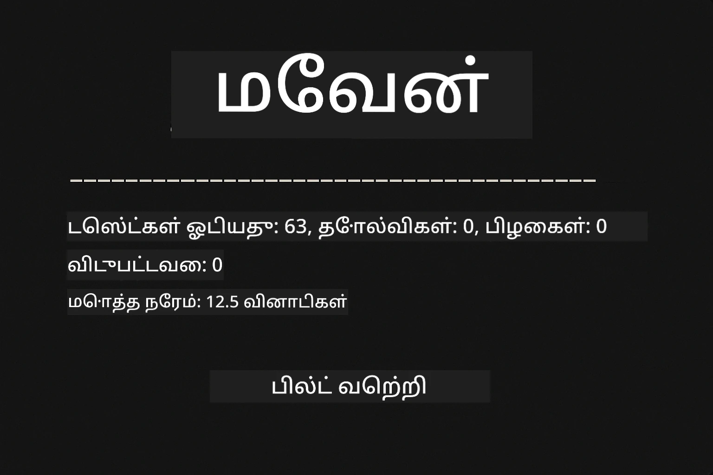
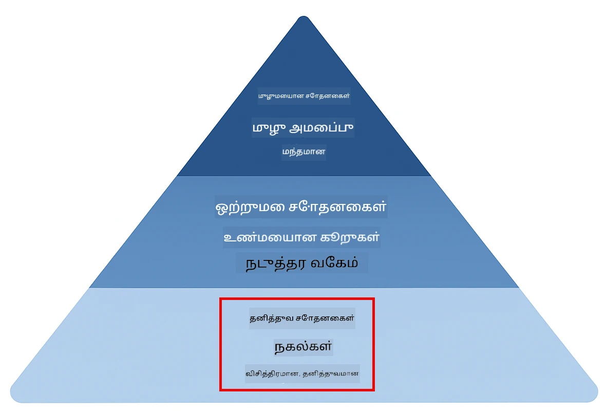
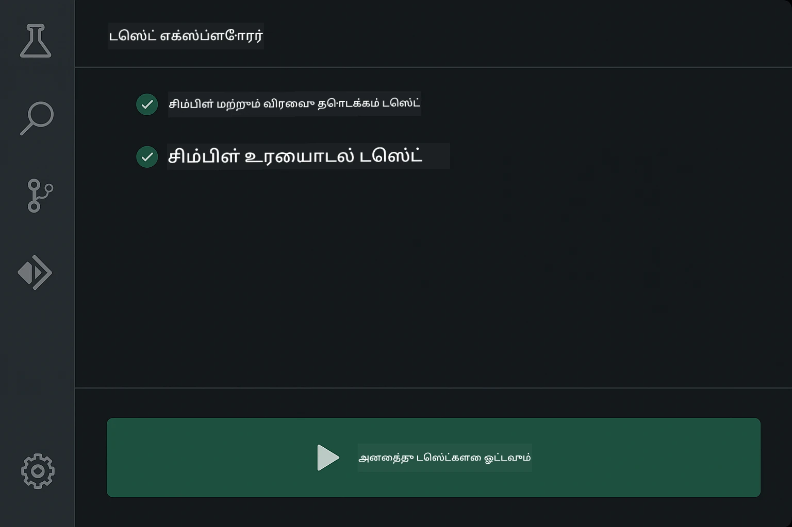
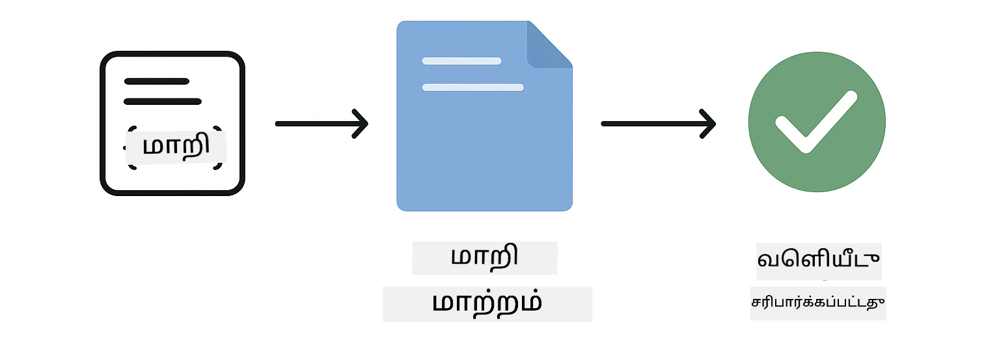
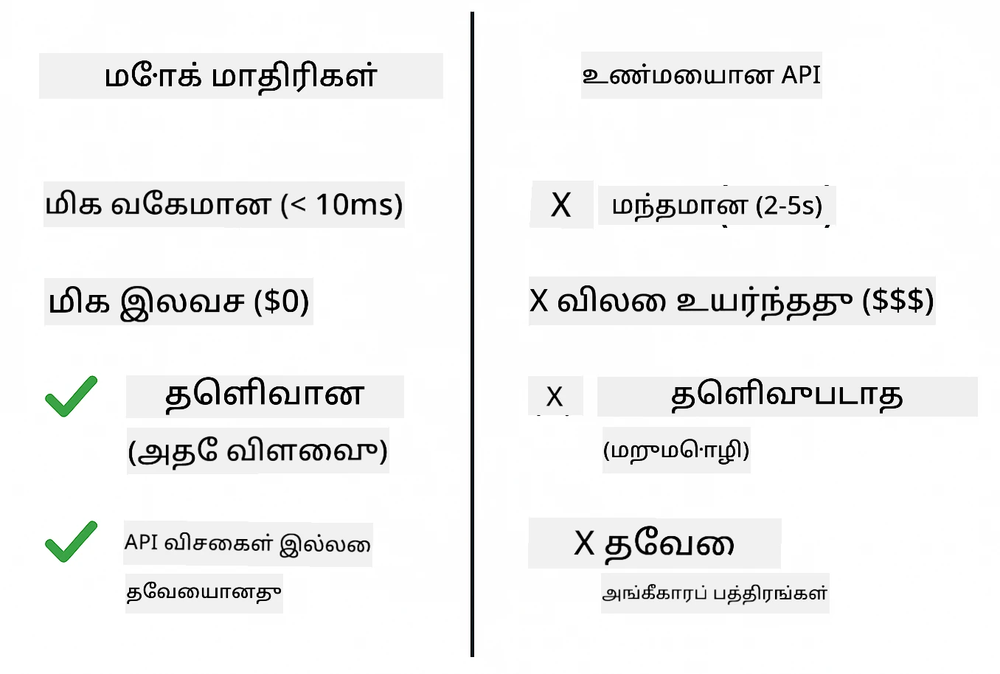
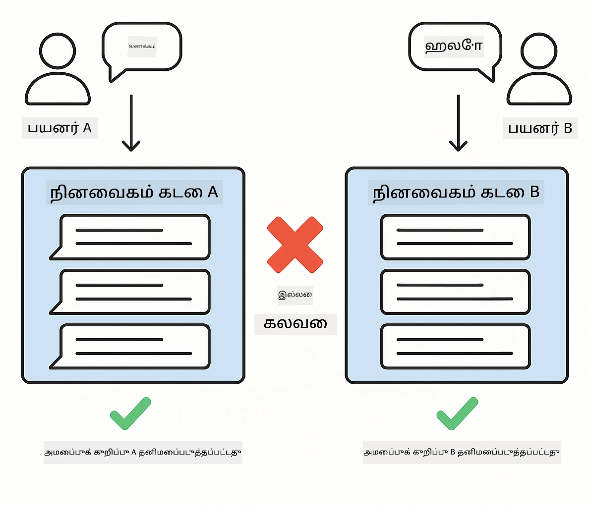
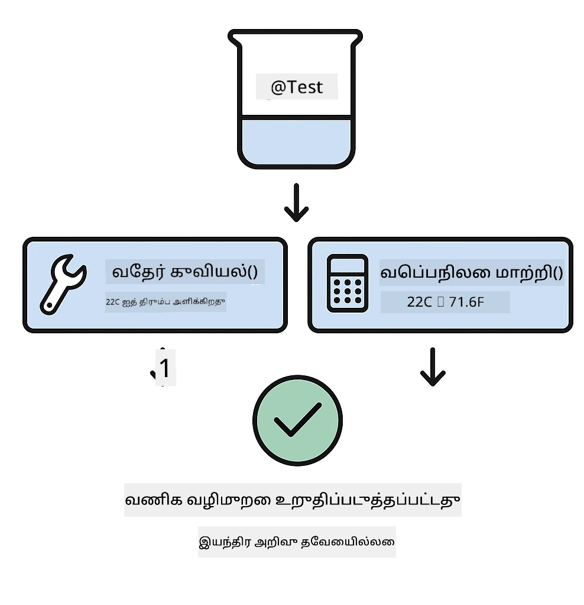
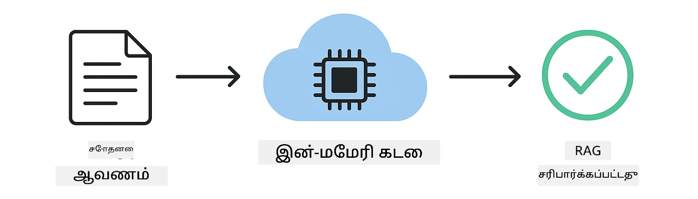

# LangChain4j பயன்பாடுகளை சோதனை செய்தல்

## зміст

- [விரைவு தொடக்கம்](#விரைவு-தொடக்கம்)
- [சோதனைகள் என்ன ஒன்றை உள்ளடக்கியது](#சோதனைகள்-என்ன-ஒன்றை-உள்ளடக்கியது)
- [சோதனைகளை இயக்குதல்](#சோதனைகளை-இயக்குதல்)
- [VS Code இல் சோதனைகள் இயக்குதல்](#vs-code-இல்-சோதனைகள்-இயக்குதல்)
- [சோதனை வடிவங்கள்](#சோதனை-வடிவங்கள்)
- [சோதனை தத்துவம்](#சோதனை-தத்துவம்)
- [அடுத்த படிகள்](#அடுத்த-படிகள்)

இந்த வழிகாட்டி API விசைகள் அல்லது வெளி சேவைகள் தேவையின்றி AI பயன்பாடுகளை எப்படி சோதனை செய்வது என்பதை விளக்குகிறது.

## விரைவு தொடக்கம்

ஒரே கட்டளையுடன் அனைத்து சோதனைகளையும் இயக்கவும்:

**Bash:**
```bash
mvn test
```

**PowerShell:**
```powershell
mvn --% test
```

அனைத்து சோதனைகளும் வெற்றி பெற்றவுடன், கீழே உள்ள திரைப் படத்தைப் போல உங்களுக்கு வெளியீடு காணப்படும் — சோதனைகள் எந்த தவறுமற்றும் இயங்கும்.



*எல்லா சோதனைகளும் தவறில்லாமல் இயங்குவதை காண்பிக்கும் வெற்றிகரமான சோதனை செயல்பாடு*

## சோதனைகள் என்ன ஒன்றை உள்ளடக்கியது

இந்த பாடம் உள்ளூரில் இயங்கும் **அலகு சோதனைகள்** மீது கவனம் செலுத்துகிறது. ஒவ்வொரு சோதனையும் தனித்துவமான LangChain4j கருத்தை ஆராய்கிறது. கீழுள்ள சோதனை piramid அங்கு அலகு சோதனைகள் எவ்வளவு முக்கியமானவை என்பதைக் காண்பிக்கிறது — அவை உங்கள் சோதனைத் திட்டத்தின் வேகமான, நம்பக்கூடிய அடித்தளமாக செயல்படுகின்றன.



*அலகு சோதனைகள் (வேகமான, தனித்துவமான), ஒருங்கிணைப்பு சோதனைகள் (உண்மையான கூறுகள்), மற்றும் இறுதி-வரை சோதனைகள் ஆகியவற்றின் சமனாக சோதனை பாமிட். இந்த பயிற்சி அலகு சோதனைகளை உள்ளடக்கியது.*

| தொகுதி | சோதனைகள் | கவனம் | முக்கிய கோப்புகள் |
|--------|-------|-------|-----------|
| **01 - அறிமுகம்** | 8 | உரையாடல் நினைவகம் மற்றும் நிலையான அரட்டை | `SimpleConversationTest.java` |
| **02 - கூடியார் வடிவமைப்பு** | 12 | GPT-5.2 வடிவங்கள், ஆர்வ நிலைகள், அமைந்த வினையமைப்பு | `SimpleGpt5PromptTest.java` |
| **03 - RAG** | 10 | ஆவண ஏற்றுதல், உட்பிரவேசங்கள், ஒத்திசைவு தேடல் | `DocumentServiceTest.java` |
| **04 - கருவிகள்** | 12 | செயல்பாடு அழைப்பு மற்றும் கருவி சங்கிலி | `SimpleToolsTest.java` |
| **05 - MCP** | 8 | மாடல் காட்சி நெறிமுறை StdIO போக்குவரத்துடன் | `SimpleMcpTest.java` |

## சோதனைகளை இயக்குதல்

**கூற்றுமருதியில் அனைத்து சோதனைகளையும் இயக்க:**

**Bash:**
```bash
mvn test
```

**PowerShell:**
```powershell
mvn --% test
```

**குறிப்பிட்ட தொகுதிக்கான சோதனைகள் இயக்க:**

**Bash:**
```bash
cd 01-introduction && mvn test
# அல்லது ரூட் இலிருந்து
mvn test -pl 01-introduction
```

**PowerShell:**
```powershell
cd 01-introduction; mvn --% test
# அல்லது மூலத்தில் இருந்து
mvn --% test -pl 01-introduction
```

**ஒரு சோதனை வகுப்பை இயக்க:**

**Bash:**
```bash
mvn test -Dtest=SimpleConversationTest
```

**PowerShell:**
```powershell
mvn --% test -Dtest=SimpleConversationTest
```

**ஒரு குறிப்பிட்ட சோதனை முறையை இயக்க:**

**Bash:**
```bash
mvn test -Dtest=SimpleConversationTest#உரையாடல் வரலாற்றை பராமரி்க வேண்டும்
```

**PowerShell:**
```powershell
mvn --% test -Dtest=SimpleConversationTest#உரையாடல் வரலாற்றை பராமரிக்க வேண்டும்
```

## VS Code இல் சோதனைகள் இயக்குதல்

Visual Studio Code பயன்படுத்தினால், Test Explorer சோதனைகளை இயக்க மற்றும் பிழைத்திருத்த சிறப்பு இடைமுகத்தை அளிக்கிறது.



*VS Code Test Explorer அனைத்து ஜாவா சோதனை வகுப்புகள் மற்றும் தனிப்பட்ட சோதனை முறைகளை காட்டுகிறது*

**VS Code இல் சோதனைகள் இயக்க:**

1. செயல்பாட்டு பட்டியில் பீக்கர் ஐகானை கிளிக் செய்து Test Explorer திறக்கவும்
2. அனைத்து தொகுதிகள் மற்றும் சோதனை வகுப்புகளை காண சோதனை மரத்தை விரிவாக்கவும்
3. தனித்தனியான சோதனையை இயக்க விரும்பினால் அதன் பக்கம் உள்ள play பொத்தானை கிளிக் செய்யவும்
4. முழு தொகுதிக்கான சோதனை செயற்குழுவை இயக்க "Run All Tests" கிளிக் செய்யவும்
5. எந்த சோதனையை தனியாக பிழைத்திருத்த விரும்பினால் அதை வலது கிளிக் செய்து "Debug Test" தேர்வு செய்யவும்

Test Explorer பாசிக்கான சோதனைகளுக்கு பச்சை சரிபார்ப்பு சின்னங்களைக் காட்டுகிறது மற்றும் தோல்விகள் ஏற்பட்டால் விரிவான பிழை செய்திகளை வழங்குகிறது.

## சோதனை வடிவங்கள்

### வடிவம் 1: கூடியார் டெம்ப்ளேட்களை சோதனை செய்தல்

எளிய வடிவம், எந்த AI மாடலையும் அழைக்காமல் கூடியார் டெம்ப்ளேட்டுகளை சோதிக்கிறது. மாற்றங்கள் சரியாக செயல்படுகிறதா மற்றும் கூடியார்கள் எதிர்பார்த்தபடி வடிவமைக்கப்படுகிறதா என்பதை உறுதிசெய்கிறது.



*மாறிகள் நிரப்புதல் வழியைக் காட்டும் கூடியார் டெம்ப்ளேட் சோதனை: பதிப்புருக்கள் → மதிப்புகள் பொருத்தப்பட்டன → வடிவமைந்த வெளியீடு சரிபார்க்கப்பட்டது*

```java
@Test
@DisplayName("Should format prompt template with variables")
void testPromptTemplateFormatting() {
    PromptTemplate template = PromptTemplate.from(
        "Best time to visit {{destination}} for {{activity}}?"
    );
    
    Prompt prompt = template.apply(Map.of(
        "destination", "Paris",
        "activity", "sightseeing"
    ));
    
    assertThat(prompt.text()).isEqualTo("Best time to visit Paris for sightseeing?");
}
```

இந்த வடிவம் மாறிகள் சரியாக பொருந்தும் மற்றும் கூடியார்கள் எதிர்பார்த்தவாறு வடிவமைக்கப்பட்டிருப்பதை உறுதிசெய்கிறது — API விசை அல்லது மாடல் அழைப்புப் தேவையில்லை.

### வடிவம் 2: மொழி மாடல்களை மோக்கிங் செய்தல்

உரையாடல் தர்க்கத்தை சோதிக்கும் போது, Mockito பயன்படுத்தி முற்போக்கு பதில்களை வழங்கும் கட்டமைக்கப்பட்ட மாடல்களை உருவாக்குங்கள். இது சோதனைகளை வேகமாகவும் இலவசமாகவும் மற்றும் தீர்மானமானதாகவும் மாற்றுகிறது.



*சோதனைக்காக மோக்குகள் ஏன் முக்கியம் என்பதை காட்டும் ஒப்பீடு: அவை வேகமானவை, இலவசம், தீர்மானமானவை, மற்றும் API விசைகள் தேவையில்லை*

```java
@ExtendWith(MockitoExtension.class)
class SimpleConversationTest {
    
    private ConversationService conversationService;
    
    @Mock
    private OpenAiOfficialChatModel mockChatModel;
    
    @BeforeEach
    void setUp() {
        ChatResponse mockResponse = ChatResponse.builder()
            .aiMessage(AiMessage.from("This is a test response"))
            .build();
        when(mockChatModel.chat(anyList())).thenReturn(mockResponse);
        
        conversationService = new ConversationService(mockChatModel);
    }
    
    @Test
    void shouldMaintainConversationHistory() {
        String conversationId = conversationService.startConversation();
        
        ChatResponse mockResponse1 = ChatResponse.builder()
            .aiMessage(AiMessage.from("Response 1"))
            .build();
        ChatResponse mockResponse2 = ChatResponse.builder()
            .aiMessage(AiMessage.from("Response 2"))
            .build();
        ChatResponse mockResponse3 = ChatResponse.builder()
            .aiMessage(AiMessage.from("Response 3"))
            .build();
        
        when(mockChatModel.chat(anyList()))
            .thenReturn(mockResponse1)
            .thenReturn(mockResponse2)
            .thenReturn(mockResponse3);

        conversationService.chat(conversationId, "First message");
        conversationService.chat(conversationId, "Second message");
        conversationService.chat(conversationId, "Third message");

        List<ChatMessage> history = conversationService.getHistory(conversationId);
        assertThat(history).hasSize(6); // 3 பயனர் + 3 செயற்கை நுண்ணறிவு செய்திகள்
    }
}
```

இந்த வடிவம் `01-introduction/src/test/java/com/example/langchain4j/service/SimpleConversationTest.java` இல் உள்ளது. மோக் ஒப்பனை நிலையான நடத்தை வழங்குகிறது, எனவே நினைவக நிர்வாகம் சரியாக நடைபெறுவதை நீங்கள் உறுதிபடுத்த முடியும்.

### வடிவம் 3: உரையாடல் தனித்துவத்தை சோதனை செய்தல்

உரையாடல் நினைவகம் பல பயனர்களை தனித்தனியாக வைத்திருக்க வேண்டும். இந்த சோதனை உரையாடல்கள் சூழலை கலக்காமல் இருக்கிறதா என்பதை உறுதிப்படுத்துகிறது.



*பல்வேறு பயனர்களுக்கான தனித்தனி நினைவகக் கடைகளைக் காட்டி உரையாடல் தனித்துவத்தை சோதனை செய்தல்*

```java
@Test
void shouldIsolateConversationsByid() {
    String conv1 = conversationService.startConversation();
    String conv2 = conversationService.startConversation();
    
    ChatResponse mockResponse = ChatResponse.builder()
        .aiMessage(AiMessage.from("Response"))
        .build();
    when(mockChatModel.chat(anyList())).thenReturn(mockResponse);

    conversationService.chat(conv1, "Message for conversation 1");
    conversationService.chat(conv2, "Message for conversation 2");

    List<ChatMessage> history1 = conversationService.getHistory(conv1);
    List<ChatMessage> history2 = conversationService.getHistory(conv2);
    
    assertThat(history1).hasSize(2);
    assertThat(history2).hasSize(2);
}
```

ஒவ்வொரு உரையாடலும் அதன் சொந்த சுயாதீன வரலாற்றை பாதுகாக்கிறது. செயற்பாட்டு அமைப்புகளில், இந்த தனித்துவம் பல பயனர் பயன்பாடுகளுக்குத் தேவையானது.

### வடிவம் 4: கருவிகளை தனித்தனியாக சோதனை செய்தல்

கருவிகள் என்பது AI அழைக்கக்கூடிய செயல்பாடுகள். AI முடிவுகளைக் கருத்தில் கொள்ளாமல் அவற்றை நேரடியாக சோதிக்கவும் அவை சரியாக வேலை செய்கின்றனவா என்பதையும் உறுதிப்படுத்தவும்.



*AI அழைப்புகள் இல்லாமல் தொழில்துறை தர்க்கத்தை சரிபார்க்கும் மோக் கருவி நிறைவேற்றலை காட்டு தானே கருவிகளை சோதனை செய்தல்*

```java
@Test
void shouldConvertCelsiusToFahrenheit() {
    TemperatureTool tempTool = new TemperatureTool();
    String result = tempTool.celsiusToFahrenheit(25.0);
    assertThat(result).containsPattern("77[.,]0°F");
}

@Test
void shouldDemonstrateToolChaining() {
    WeatherTool weatherTool = new WeatherTool();
    TemperatureTool tempTool = new TemperatureTool();

    String weatherResult = weatherTool.getCurrentWeather("Seattle");
    assertThat(weatherResult).containsPattern("\\d+°C");

    String conversionResult = tempTool.celsiusToFahrenheit(22.0);
    assertThat(conversionResult).containsPattern("71[.,]6°F");
}
```

இந்த சோதனைகள் `04-tools/src/test/java/com/example/langchain4j/agents/tools/SimpleToolsTest.java` இலிருந்து, AI தொடர்பில்லாமல் கருவி தர்க்கத்தை சரிபார்க்கின்றன. சங்கிலி எடுத்துக்காட்டு ஒரு கருவியின் வெளியீடு எப்படி மற்றொன்றின் உள்ளீட்டாக அனுப்பப்படுகிறது என்பதைக் காட்டுகிறது.

### வடிவம் 5: நினைவக RAG சோதனை

RAG அமைப்புகள் சாதாரணமாக வெக்டர் தரவுத்தளங்கள் மற்றும் உட்பிரவேச சேவைகள் தேவைபடும். நினைவக வடிவம் வெளி சார்பானவற்றைத் தவிர்த்து முழு குழாயை சோதிக்க அனுமதிக்கிறது.



*ஆவண பரிமாற்றம், உட்பிரவேச சேமிப்பு மற்றும் ஒத்திசைவு தேடலை தரவுத்தளமின்றி காட்டு நினைவக RAG சோதனை வேலைவகுப்பு*

```java
@Test
void testProcessTextDocument() {
    String content = "This is a test document.\nIt has multiple lines.";
    InputStream inputStream = new ByteArrayInputStream(content.getBytes(StandardCharsets.UTF_8));
    
    DocumentService.ProcessedDocument result = 
        documentService.processDocument(inputStream, "test.txt");

    assertNotNull(result);
    assertTrue(result.segments().size() > 0);
    assertEquals("test.txt", result.segments().get(0).metadata().getString("filename"));
}
```

இந்த சோதனை `03-rag/src/test/java/com/example/langchain4j/rag/service/DocumentServiceTest.java` இலிருந்து, ஆவணத்தை நினைவகத்திலேயே உருவாக்கி துண்டிக்கும் மற்றும் மீட்டமைப்பு கையாளுதலை உறுதிப்படுத்துகிறது.

### வடிவம் 6: MCP ஒருங்கிணைவு சோதனை

MCP தொகுதி stdio போக்குவரத்துடன் மாடல் காட்சி நெறிமுறை ஒருங்கிணைப்பை சோதனை செய்யும். இந்த சோதனைகள் உங்கள் பயன்பாடு subprocess ஆக MCP சர்வர்களை எப்படி உருவாக்கி தொடர்பு கொள்கிறது என்பதைக் சோதிக்கின்றன.

`05-mcp/src/test/java/com/example/langchain4j/mcp/SimpleMcpTest.java` இல் உள்ள சோதனைகள் MCP கிளையண்ட் நடத்தை சரிபார்க்கின்றன.

**இவற்றை இயக்கவும்:**

**Bash:**
```bash
cd 05-mcp && mvn test
```

**PowerShell:**
```powershell
cd 05-mcp; mvn --% test
```

## சோதனை தத்துவம்

AI-ஐ அல்லாமல் உங்கள் குறியீட்டை சோதியுங்கள். உங்கள் சோதனைகள் நீங்கள் எழுதிய குறியீட்டை சரிபார்க்க வேண்டும்; கூடியார்கள் எவ்வாறு கட்டமைக்கப்பட்டுள்ளன, நினைவகம் எப்படி நிர்வகிக்கப்படுகிறது, கருவிகள் எப்படி செயல்படுகின்றன என்பதைக் கண்டறிந்து. AI பதில்கள் மாறுபடும், அதனால் அவை சோதனை விசாரணைகளின் பகுதியாக இருக்கக் கூடாது. உங்கள் கூடியார் டெம்ப்ளேட் மாறிகளையே சரியாக பொருத்துகிறதா என்பதில் கவனம் செலுத்துங்கள், AI சரியான பதிலை வழங்குகிறதா என்பதில் அல்ல.

மொழி மாடல்களுக்கு மோக்குகளை பயன்படுத்துங்கள். இவை மெதுவான, செலவான, மற்றும் தீர்மானமற்ற வெளிப்புற சார்புகள். மோக்கிங் சோதனைகளை சில விநாடிகளுக்கு பதிலாக மெலிந்த(milliseconds) வேகமாகவும், API செலவில்லாமல் இலவசமாகவும், மற்றும் ஒவ்வொரு முறையும் ஒரே முடிவுடன் தீர்மானமானதாகவும் மாற்றுகிறது.

சோதனைகளை சுயாதீனமாக வைத்திருங்கள். ஒவ்வொரு சோதனையும் தற்காலிக தரவை அமைத்து, மற்ற சோதனைகளைக் சாராது மற்றும் தானாகத் தூய்மைப்படுத்தவும் வேண்டும். சோதனைகள் இயக்க வரிசையால் பாதிக்கப்படக்கூடாது.

மகிழ்ச்சியான பாதை மிக்க வழிமுறைக்கு கூடுவதைத் தவிர வெளியே இருக்கக்கூடிய எல்லைகளையும் சோதியுங்கள். காலியாக உள்ளீடு, மிகப்பெரிய உள்ளீடு, விசேஷ எழுத்துக்கள், தவறான அளவுருக்கள் மற்றும் எல்லை நிலைகள் போன்றவற்றை முயற்சியுங்கள். இவை உள்ளாட்சி பயன்பாட்டால் தெரியாத பிழைகளை அடையாளம் காண்கிறன.

விளக்கமான பெயர்களைப் பயன்படுத்துங்கள். `shouldMaintainConversationHistoryAcrossMultipleMessages()` மற்றும் `test1()` ஐ ஒப்பிடுங்கள். முதல் பெயர் என்ன சோதிக்கப்படுகிறது என்பதைக் தெளிவாக காட்டுவதால் தோல்விகளை பிழையுணர்வை எளிதாக்குகிறது.

## அடுத்த படிகள்

சோதனை வடிவங்களைப் புரிந்து கொண்டுள்ளதால், ஒவ்வொரு தொகுதியிலும் ஆழமாக செல்லுங்கள்:

- **[01 - அறிமுகம்](../01-introduction/README.md)** - உரையாடல் நினைவகம் நிர்வாகம் கற்க
- **[02 - கூடியார் வடிவமைப்பு](../02-prompt-engineering/README.md)** - GPT-5.2 கூடியார் வடிவங்களை நிபுணத்துவம் பெற
- **[03 - RAG](../03-rag/README.md)** - பெறுகை-பெருக்கப்பட்ட உருவாக்க அமைப்புகளை கட்டமை
- **[04 - கருவிகள்](../04-tools/README.md)** - செயல்பாடு அழைப்பும் கருவி சங்கிலி செயல்பாடும் நடைமுறைப்படுத்து
- **[05 - MCP](../05-mcp/README.md)** - மாடல் காட்சி நெறிமுறை ஒருங்கிணைப்பு செய்

ஒவ்வொரு தொகுதியின் README இல் இங்கு சோதிக்கப்பட்ட கருத்துக்களின் விரிவான விளக்கங்கள் உள்ளன.

---

**வழிசெல்வது:** [← பிரதான பக்கம்](../README.md)

---

<!-- CO-OP TRANSLATOR DISCLAIMER START -->
**மறுப்பு**:
இந்த ஆவணம் AI மொழிபெயர்ப்பு சேவை [Co-op Translator](https://github.com/Azure/co-op-translator) பயன்படுத்தி மொழிபெயர்க்கப்பட்டுள்ளது. நாங்கள் துல்லியத்திற்காக முயற்சி செய்துள்ளோம், ஆனால் தானாக செய்யப்படும் மொழிபெயர்ப்புகளில் பிழைகள் அல்லது தவறுகள் இருக்கலாம் என்பதை கவனத்தில் கொள்ளவும். அசல் ஆவணம் அதன் தாய்மொழியில் அதிகாரப்பூர்வ ஆதாரமாக கருதப்பட வேண்டும். முக்கியமான தகவல்களுக்கு, தொழில்நுட்பமான மனித மொழிபெயர்ப்பு பரிந்துரைக்கப்படுகிறது. இந்த மொழிபெயர்ப்பைப் பயன்படுத்துவதால் ஏற்படும் எந்த தவறான புரிதல்கள் அல்லது தவறான விளக்கத்திற்கும் நாங்கள் பொறுப்பில்வில்லை.
<!-- CO-OP TRANSLATOR DISCLAIMER END -->