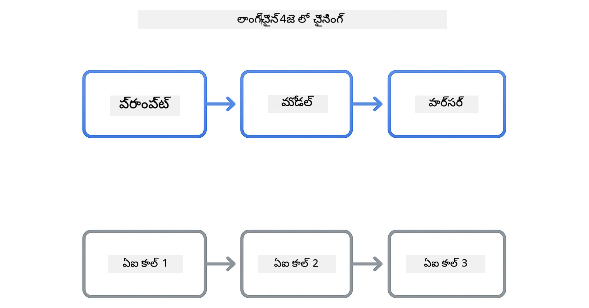

<!--
CO_OP_TRANSLATOR_METADATA:
{
  "original_hash": "377b3e3e6f8d02965bf0fbbc9ccb45c5",
  "translation_date": "2025-12-13T15:32:10+00:00",
  "source_file": "00-quick-start/README.md",
  "language_code": "te"
}
-->
# Module 00: త్వరిత ప్రారంభం

## విషయ సూచిక

- [పరిచయం](../../../00-quick-start)
- [LangChain4j అంటే ఏమిటి?](../../../00-quick-start)
- [LangChain4j ఆధారాలు](../../../00-quick-start)
- [ముందస్తు అవసరాలు](../../../00-quick-start)
- [సెట్టప్](../../../00-quick-start)
  - [1. మీ GitHub టోకెన్ పొందండి](../../../00-quick-start)
  - [2. మీ టోకెన్ సెట్ చేయండి](../../../00-quick-start)
- [ఉదాహరణలను నడపండి](../../../00-quick-start)
  - [1. ప్రాథమిక చాట్](../../../00-quick-start)
  - [2. ప్రాంప్ట్ నమూనాలు](../../../00-quick-start)
  - [3. ఫంక్షన్ కాలింగ్](../../../00-quick-start)
  - [4. డాక్యుమెంట్ ప్రశ్న & సమాధానం (RAG)](../../../00-quick-start)
- [ప్రతి ఉదాహరణ ఏమి చూపిస్తుంది](../../../00-quick-start)
- [తరువాతి దశలు](../../../00-quick-start)
- [సమస్య పరిష్కారం](../../../00-quick-start)

## పరిచయం

ఈ త్వరితప్రారంభం LangChain4j తో మీరు వీలైనంత త్వరగా ప్రారంభించడానికి ఉద్దేశించబడింది. ఇది LangChain4j మరియు GitHub మోడల్స్ తో AI అప్లికేషన్లు నిర్మించడంలో అత్యంత ప్రాథమిక అంశాలను కవర్ చేస్తుంది. తదుపరి మాడ్యూల్స్ లో మీరు Azure OpenAI ని LangChain4j తో ఉపయోగించి మరింత అభివృద్ధి చెందిన అప్లికేషన్లు నిర్మిస్తారు.

## LangChain4j అంటే ఏమిటి?

LangChain4j అనేది AI-శక్తివంతమైన అప్లికేషన్లు సులభంగా నిర్మించడానికి ఉపయోగించే జావా లైబ్రరీ. HTTP క్లయింట్లు మరియు JSON పార్సింగ్ తో వ్యవహరించాల్సిన అవసరం లేకుండా, మీరు శుభ్రమైన జావా API లతో పని చేస్తారు.

LangChain లో "చైన్" అనగా అనేక భాగాలను ఒకదానితో ఒకటి చేర్చడం - మీరు ఒక ప్రాంప్ట్ ను మోడల్ కు, ఆ మోడల్ ను పార్సర్ కు చేర్చవచ్చు, లేదా అనేక AI కాల్స్ ను ఒకదాని అవుట్పుట్ ను తదుపరి ఇన్పుట్ గా ఉపయోగించి చేర్చవచ్చు. ఈ త్వరితప్రారంభం ప్రాథమిక అంశాలపై దృష్టి సారిస్తుంది, మరింత క్లిష్టమైన చైన్లను అన్వేషించే ముందు.



*LangChain4j లో భాగాలను చేర్చడం - శక్తివంతమైన AI వర్క్‌ఫ్లోలను సృష్టించడానికి బ్లాక్స్ కలిసిపోవడం*

మేము మూడు ప్రధాన భాగాలను ఉపయోగిస్తాము:

**ChatLanguageModel** - AI మోడల్ ఇంటరాక్షన్లకు ఇంటర్‌ఫేస్. `model.chat("prompt")` ను కాల్ చేసి స్పందన స్ట్రింగ్ పొందండి. మేము `OpenAiOfficialChatModel` ను ఉపయోగిస్తాము, ఇది GitHub మోడల్స్ వంటి OpenAI-అనుకూల ఎండ్‌పాయింట్లతో పనిచేస్తుంది.

**AiServices** - టైప్-సేఫ్ AI సర్వీస్ ఇంటర్‌ఫేస్‌లను సృష్టిస్తుంది. పద్ధతులను నిర్వచించి, వాటిని `@Tool` తో గుర్తించి, LangChain4j ఆర్కెస్ట్రేషన్ నిర్వహిస్తుంది. అవసరమైతే AI మీ జావా పద్ధతులను ఆటోమేటిక్‌గా కాల్ చేస్తుంది.

**MessageWindowChatMemory** - సంభాషణ చరిత్రను నిర్వహిస్తుంది. దీని లేకుండా ప్రతి అభ్యర్థన స్వతంత్రంగా ఉంటుంది. దీని తో AI గత సందేశాలను గుర్తుంచుకుంటుంది మరియు అనేక టర్న్లలో సందర్భాన్ని నిర్వహిస్తుంది.


*LangChain4j నిర్మాణం - మీ AI అప్లికేషన్లకు శక్తిని అందించడానికి ప్రధాన భాగాలు కలిసి పనిచేస్తున్నాయి*

## LangChain4j ఆధారాలు

ఈ త్వరితప్రారంభం [`pom.xml`](../../../00-quick-start/pom.xml) లో రెండు Maven ఆధారాలను ఉపయోగిస్తుంది:

```xml
<!-- Core LangChain4j library -->
<dependency>
    <groupId>dev.langchain4j</groupId>
    <artifactId>langchain4j</artifactId> <!-- Inherited from BOM in root pom.xml -->
</dependency>

<!-- OpenAI integration (works with GitHub Models) -->
<dependency>
    <groupId>dev.langchain4j</groupId>
    <artifactId>langchain4j-open-ai-official</artifactId> <!-- Inherited from BOM in root pom.xml -->
</dependency>
```

`langchain4j-open-ai-official` మాడ్యూల్ `OpenAiOfficialChatModel` క్లాస్ ను అందిస్తుంది, ఇది OpenAI-అనుకూల API లకు కనెక్ట్ అవుతుంది. GitHub మోడల్స్ అదే API ఫార్మాట్ ఉపయోగిస్తాయి, కాబట్టి ప్రత్యేక అడాప్టర్ అవసరం లేదు - కేవలం బేస్ URL ను `https://models.github.ai/inference` గా సూచించండి.

## ముందస్తు అవసరాలు

**Dev Container ఉపయోగిస్తున్నారా?** Java మరియు Maven ఇప్పటికే ఇన్‌స్టాల్ చేయబడ్డాయి. మీకు కేవలం GitHub Personal Access Token అవసరం.

**లోకల్ డెవలప్‌మెంట్:**
- Java 21+, Maven 3.9+
- GitHub Personal Access Token (కింద సూచనలు)

> **గమనిక:** ఈ మాడ్యూల్ GitHub మోడల్స్ నుండి `gpt-4.1-nano` ను ఉపయోగిస్తుంది. కోడ్ లో మోడల్ పేరును మార్చవద్దు - ఇది GitHub అందుబాటులో ఉన్న మోడల్స్ తో పనిచేయడానికి కాన్ఫిగర్ చేయబడింది.

## సెట్టప్

### 1. మీ GitHub టోకెన్ పొందండి

1. [GitHub సెట్టింగ్స్ → Personal Access Tokens](https://github.com/settings/personal-access-tokens) కి వెళ్లండి
2. "Generate new token" క్లిక్ చేయండి
3. వివరణాత్మక పేరు పెట్టండి (ఉదా: "LangChain4j Demo")
4. గడువు సెట్ చేయండి (7 రోజులు సిఫార్సు)
5. "Account permissions" లో "Models" ను "Read-only" గా సెట్ చేయండి
6. "Generate token" క్లిక్ చేయండి
7. మీ టోకెన్ ను కాపీ చేసి భద్రపరచండి - మళ్లీ చూడలేరు

### 2. మీ టోకెన్ సెట్ చేయండి

**ఎంపిక 1: VS Code ఉపయోగించడం (సిఫార్సు)**

మీరు VS Code ఉపయోగిస్తుంటే, ప్రాజెక్ట్ రూట్ లో `.env` ఫైల్ లో మీ టోకెన్ ను జోడించండి:

`.env` ఫైల్ లేకపోతే, `.env.example` ను `.env` గా కాపీ చేయండి లేదా కొత్త `.env` ఫైల్ సృష్టించండి.

**ఉదాహరణ `.env` ఫైల్:**
```bash
# /workspaces/LangChain4j-for-Beginners/.env లో
GITHUB_TOKEN=your_token_here
```

తర్వాత మీరు ఎక్స్‌ప్లోరర్ లో ఏదైనా డెమో ఫైల్ (ఉదా: `BasicChatDemo.java`) పై రైట్-క్లిక్ చేసి **"Run Java"** ఎంచుకోవచ్చు లేదా రన్ & డీబగ్ ప్యానెల్ నుండి లాంచ్ కాన్ఫిగరేషన్లను ఉపయోగించండి.

**ఎంపిక 2: టెర్మినల్ ఉపయోగించడం**

టోకెన్ ను ఎన్విరాన్‌మెంట్ వేరియబుల్ గా సెట్ చేయండి:

**Bash:**
```bash
export GITHUB_TOKEN=your_token_here
```

**PowerShell:**
```powershell
$env:GITHUB_TOKEN=your_token_here
```

## ఉదాహరణలను నడపండి

**VS Code ఉపయోగించడం:** ఎక్స్‌ప్లోరర్ లో ఏ డెమో ఫైల్ పై రైట్-క్లిక్ చేసి **"Run Java"** ఎంచుకోండి, లేదా రన్ & డీబగ్ ప్యానెల్ నుండి లాంచ్ కాన్ఫిగరేషన్లను ఉపయోగించండి (ముందుగా `.env` ఫైల్ లో టోకెన్ జోడించారని నిర్ధారించుకోండి).

**Maven ఉపయోగించడం:** ప్రత్యామ్నాయంగా, కమాండ్ లైన్ నుండి నడపవచ్చు:

### 1. ప్రాథమిక చాట్

**Bash:**
```bash
mvn compile exec:java -Dexec.mainClass=com.example.langchain4j.quickstart.BasicChatDemo
```

**PowerShell:**
```powershell
mvn --% compile exec:java -Dexec.mainClass=com.example.langchain4j.quickstart.BasicChatDemo
```

### 2. ప్రాంప్ట్ నమూనాలు

**Bash:**
```bash
mvn compile exec:java -Dexec.mainClass=com.example.langchain4j.quickstart.PromptEngineeringDemo
```

**PowerShell:**
```powershell
mvn --% compile exec:java -Dexec.mainClass=com.example.langchain4j.quickstart.PromptEngineeringDemo
```

జీరో-షాట్, ఫ్యూ-షాట్, చైన్-ఆఫ్-థాట్, మరియు రోల్-బేస్డ్ ప్రాంప్టింగ్ చూపిస్తుంది.

### 3. ఫంక్షన్ కాలింగ్

**Bash:**
```bash
mvn compile exec:java -Dexec.mainClass=com.example.langchain4j.quickstart.ToolIntegrationDemo
```

**PowerShell:**
```powershell
mvn --% compile exec:java -Dexec.mainClass=com.example.langchain4j.quickstart.ToolIntegrationDemo
```

AI అవసరమైతే ఆటోమేటిక్‌గా మీ జావా పద్ధతులను కాల్ చేస్తుంది.

### 4. డాక్యుమెంట్ ప్రశ్న & సమాధానం (RAG)

**Bash:**
```bash
mvn compile exec:java -Dexec.mainClass=com.example.langchain4j.quickstart.SimpleReaderDemo
```

**PowerShell:**
```powershell
mvn --% compile exec:java -Dexec.mainClass=com.example.langchain4j.quickstart.SimpleReaderDemo
```

`document.txt` లోని కంటెంట్ గురించి ప్రశ్నలు అడగండి.

## ప్రతి ఉదాహరణ ఏమి చూపిస్తుంది

**ప్రాథమిక చాట్** - [BasicChatDemo.java](../../../00-quick-start/src/main/java/com/example/langchain4j/quickstart/BasicChatDemo.java)

ఇక్కడ LangChain4j యొక్క అత్యంత సులభ రూపాన్ని చూడండి. మీరు `OpenAiOfficialChatModel` సృష్టించి, `.chat()` తో ప్రాంప్ట్ పంపించి, స్పందన పొందుతారు. ఇది మోడల్స్ ను కస్టమ్ ఎండ్‌పాయింట్లు మరియు API కీలు తో ఎలా ప్రారంభించాలో చూపిస్తుంది. ఈ నమూనాను అర్థం చేసుకున్న తర్వాత, మిగతా అన్ని దానిపై ఆధారపడి ఉంటుంది.

```java
ChatLanguageModel model = OpenAiOfficialChatModel.builder()
    .baseUrl("https://models.github.ai/inference")
    .apiKey(System.getenv("GITHUB_TOKEN"))
    .modelName("gpt-4.1-nano")
    .build();

String response = model.chat("What is LangChain4j?");
System.out.println(response);
```

> **🤖 [GitHub Copilot](https://github.com/features/copilot) చాట్ తో ప్రయత్నించండి:** [`BasicChatDemo.java`](../../../00-quick-start/src/main/java/com/example/langchain4j/quickstart/BasicChatDemo.java) తెరవండి మరియు అడగండి:
> - "ఈ కోడ్ లో GitHub మోడల్స్ నుండి Azure OpenAI కి ఎలా మారాలి?"
> - "OpenAiOfficialChatModel.builder() లో మరే ఇతర పారామీటర్లు సెట్ చేయవచ్చు?"
> - "పూర్తి స్పందన కోసం వేచి ఉండకుండా స్ట్రీమింగ్ స్పందనలను ఎలా జోడించాలి?"

**ప్రాంప్ట్ ఇంజనీరింగ్** - [PromptEngineeringDemo.java](../../../00-quick-start/src/main/java/com/example/langchain4j/quickstart/PromptEngineeringDemo.java)

ఇప్పుడు మీరు మోడల్ తో ఎలా మాట్లాడాలో తెలుసుకున్న తర్వాత, మీరు దానికి ఏమి చెప్పాలో అన్వేషిద్దాం. ఈ డెమో అదే మోడల్ సెటప్ ఉపయోగించి నాలుగు వేర్వేరు ప్రాంప్ట్ నమూనాలను చూపిస్తుంది. నేరుగా సూచనల కోసం జీరో-షాట్ ప్రాంప్ట్‌లు, ఉదాహరణల నుండి నేర్చుకునే ఫ్యూ-షాట్ ప్రాంప్ట్‌లు, తర్కం దశలను వెల్లడించే చైన్-ఆఫ్-థాట్ ప్రాంప్ట్‌లు, మరియు సందర్భాన్ని సెట్ చేసే రోల్-బేస్డ్ ప్రాంప్ట్‌లు ప్రయత్నించండి. మీరు ఎలా ఒకే మోడల్ వేర్వేరు ఫలితాలు ఇస్తుందో చూడగలుగుతారు.

```java
PromptTemplate template = PromptTemplate.from(
    "What's the best time to visit {{destination}} for {{activity}}?"
);

Prompt prompt = template.apply(Map.of(
    "destination", "Paris",
    "activity", "sightseeing"
));

String response = model.chat(prompt.text());
```

> **🤖 [GitHub Copilot](https://github.com/features/copilot) చాట్ తో ప్రయత్నించండి:** [`PromptEngineeringDemo.java`](../../../00-quick-start/src/main/java/com/example/langchain4j/quickstart/PromptEngineeringDemo.java) తెరవండి మరియు అడగండి:
> - "జీరో-షాట్ మరియు ఫ్యూ-షాట్ ప్రాంప్టింగ్ మధ్య తేడా ఏమిటి, మరియు ఎప్పుడు ఏది ఉపయోగించాలి?"
> - "తాపన (temperature) పారామీటర్ మోడల్ స్పందనలను ఎలా ప్రభావితం చేస్తుంది?"
> - "ప్రొడక్షన్ లో ప్రాంప్ట్ ఇంజెక్షన్ దాడులను నివారించడానికి కొన్ని సాంకేతికతలు ఏమిటి?"
> - "సాధారణ నమూనాల కోసం పునర్వినియోగించదగిన PromptTemplate ఆబ్జెక్టులను ఎలా సృష్టించాలి?"

**టూల్ ఇంటిగ్రేషన్** - [ToolIntegrationDemo.java](../../../00-quick-start/src/main/java/com/example/langchain4j/quickstart/ToolIntegrationDemo.java)

ఇక్కడ LangChain4j శక్తివంతంగా మారుతుంది. మీరు `AiServices` ఉపయోగించి మీ జావా పద్ధతులను కాల్ చేయగల AI అసిస్టెంట్ ను సృష్టిస్తారు. పద్ధతులను `@Tool("వివరణ")` తో గుర్తించి, LangChain4j మిగతా పనిని నిర్వహిస్తుంది - యూజర్ అడిగిన దాని ఆధారంగా AI ఏ టూల్ ఉపయోగించాలో ఆటోమేటిక్ గా నిర్ణయిస్తుంది. ఇది ఫంక్షన్ కాలింగ్ ను చూపిస్తుంది, ఇది AI కి చర్యలు తీసుకునే సామర్థ్యాన్ని ఇస్తుంది, కేవలం ప్రశ్నలకు సమాధానం ఇవ్వడం కాకుండా.

```java
@Tool("Performs addition of two numeric values")
public double add(double a, double b) {
    return a + b;
}

MathAssistant assistant = AiServices.create(MathAssistant.class, model);
String response = assistant.chat("What is 25 plus 17?");
```

> **🤖 [GitHub Copilot](https://github.com/features/copilot) చాట్ తో ప్రయత్నించండి:** [`ToolIntegrationDemo.java`](../../../00-quick-start/src/main/java/com/example/langchain4j/quickstart/ToolIntegrationDemo.java) తెరవండి మరియు అడగండి:
> - "@Tool అనోటేషన్ ఎలా పనిచేస్తుంది మరియు LangChain4j దాని వెనుక ఏమి చేస్తుంది?"
> - "AI కఠిన సమస్యలను పరిష్కరించడానికి అనేక టూల్స్ ను వరుసగా కాల్ చేయగలదా?"
> - "ఒక టూల్ ఎక్సెప్షన్ వేస్తే ఏమవుతుంది - తప్పిదాలను ఎలా నిర్వహించాలి?"
> - "ఈ కాలిక్యులేటర్ ఉదాహరణ కాకుండా నిజమైన API ని ఎలా ఇంటిగ్రేట్ చేయాలి?"

**డాక్యుమెంట్ ప్రశ్న & సమాధానం (RAG)** - [SimpleReaderDemo.java](../../../00-quick-start/src/main/java/com/example/langchain4j/quickstart/SimpleReaderDemo.java)

ఇక్కడ మీరు RAG (రిట్రీవల్-ఆగ్మెంటెడ్ జనరేషన్) యొక్క ప్రాథమికాన్ని చూడగలుగుతారు. మోడల్ శిక్షణ డేటా మీద ఆధారపడకుండా, మీరు [`document.txt`](../../../00-quick-start/document.txt) నుండి కంటెంట్ లోడ్ చేసి ప్రాంప్ట్ లో చేర్చుతారు. AI మీ డాక్యుమెంట్ ఆధారంగా సమాధానాలు ఇస్తుంది, సాధారణ జ్ఞానం ఆధారంగా కాదు. ఇది మీ స్వంత డేటాతో పనిచేసే సిస్టమ్స్ నిర్మించడానికి మొదటి దశ.

```java
Document document = FileSystemDocumentLoader.loadDocument("document.txt");
String content = document.text();

String prompt = "Based on this document: " + content + 
                "\nQuestion: What is the main topic?";
String response = model.chat(prompt);
```

> **గమనిక:** ఈ సింపుల్ విధానం మొత్తం డాక్యుమెంట్ ను ప్రాంప్ట్ లో లోడ్ చేస్తుంది. పెద్ద ఫైళ్ల (>10KB) కోసం, మీరు కాంటెక్స్ట్ పరిమితులను దాటిపోతారు. మాడ్యూల్ 03 లో ప్రొడక్షన్ RAG సిస్టమ్స్ కోసం చంకింగ్ మరియు వెక్టర్ సెర్చ్ గురించి ఉంటుంది.

> **🤖 [GitHub Copilot](https://github.com/features/copilot) చాట్ తో ప్రయత్నించండి:** [`SimpleReaderDemo.java`](../../../00-quick-start/src/main/java/com/example/langchain4j/quickstart/SimpleReaderDemo.java) తెరవండి మరియు అడగండి:
> - "RAG AI హల్యూసినేషన్లను ఎలా నివారిస్తుంది, మోడల్ శిక్షణ డేటా ఉపయోగించడంతో పోల్చితే?"
> - "ఈ సింపుల్ విధానం మరియు వెక్టర్ ఎంబెడ్డింగ్స్ ఉపయోగించి రిట్రీవల్ మధ్య తేడా ఏమిటి?"
> - "ఇది అనేక డాక్యుమెంట్లు లేదా పెద్ద జ్ఞాన బేస్‌లను ఎలా స్కేల్ చేయాలి?"
> - "AI కేవలం అందించిన సందర్భాన్ని మాత్రమే ఉపయోగించేందుకు ప్రాంప్ట్ నిర్మాణానికి ఉత్తమ పద్ధతులు ఏమిటి?"

## డీబగ్గింగ్

ఉదాహరణలు `.logRequests(true)` మరియు `.logResponses(true)` ఉపయోగించి API కాల్స్ ను కన్సోల్ లో చూపిస్తాయి. ఇది ఆథెంటికేషన్ లోపాలు, రేట్ లిమిట్స్ లేదా అనూహ్య స్పందనలను పరిష్కరించడంలో సహాయపడుతుంది. ప్రొడక్షన్ లో ఈ ఫ్లాగ్‌లను తీసివేయండి, లాగ్ శబ్దాన్ని తగ్గించడానికి.

## తర్వాతి దశలు

**తరువాతి మాడ్యూల్:** [01-introduction - LangChain4j మరియు gpt-5 తో Azure లో ప్రారంభం](../01-introduction/README.md)

---

**నావిగేషన్:** [← ప్రధానానికి తిరిగి](../README.md) | [తరువాత: Module 01 - పరిచయం →](../01-introduction/README.md)

---

## సమస్య పరిష్కారం

### మొదటి సారి Maven బిల్డ్

**సమస్య:** మొదటి `mvn clean compile` లేదా `mvn package` చాలా సమయం తీసుకుంటుంది (10-15 నిమిషాలు)

**కారణం:** Maven మొదటి బిల్డ్ లో ప్రాజెక్ట్ ఆధారాలను (Spring Boot, LangChain4j లైబ్రరీలు, Azure SDKలు మొదలైనవి) డౌన్లోడ్ చేయాలి.

**పరిష్కారం:** ఇది సాధారణ ప్రవర్తన. తర్వాతి బిల్డ్‌లు చాలా వేగంగా ఉంటాయి ఎందుకంటే ఆధారాలు లోకల్‌లో క్యాష్ అవుతాయి. డౌన్లోడ్ సమయం మీ నెట్‌వర్క్ వేగంపై ఆధారపడి ఉంటుంది.

### PowerShell Maven కమాండ్ సింటాక్స్

**సమస్య:** Maven కమాండ్లు `Unknown lifecycle phase ".mainClass=..."` అనే లోపంతో విఫలమవుతాయి

**కారణం:** PowerShell లో `=` ను వేరియబుల్ అసైన్‌మెంట్ ఆపరేటర్ గా భావించి Maven ప్రాపర్టీ సింటాక్స్‌ను బ్రేక్ చేస్తుంది

**పరిష్కారం:** Maven కమాండ్ ముందు స్టాప్-పార్సింగ్ ఆపరేటర్ `--%` ఉపయోగించండి:

**PowerShell:**
```powershell
mvn --% compile exec:java -Dexec.mainClass=com.example.langchain4j.quickstart.BasicChatDemo
```

**Bash:**
```bash
mvn compile exec:java -Dexec.mainClass=com.example.langchain4j.quickstart.BasicChatDemo
```

`--%` ఆపరేటర్ PowerShell కు మిగతా ఆర్గ్యుమెంట్లను Maven కు లిటరల్‌గా పంపమని సూచిస్తుంది, అనువాదం లేకుండా.

### Windows PowerShell లో ఎమోజీ ప్రదర్శన

**సమస్య:** PowerShell లో AI స్పందనలు ఎమోజీల స్థానంలో చెత్త అక్షరాలు (ఉదా: `????` లేదా `â??`) చూపిస్తాయి

**కారణం:** PowerShell డిఫాల్ట్ ఎన్‌కోడింగ్ UTF-8 ఎమోజీలను మద్దతు ఇవ్వదు

**పరిష్కారం:** జావా అప్లికేషన్లు నడపడానికి ముందు ఈ కమాండ్ నడపండి:
```cmd
chcp 65001
```

ఇది టెర్మినల్ లో UTF-8 ఎన్‌కోడింగ్ ను బలవంతం చేస్తుంది. ప్రత్యామ్నాయంగా, మెరుగైన యూనికోడ్ మద్దతు ఉన్న Windows Terminal ఉపయోగించండి.

---

<!-- CO-OP TRANSLATOR DISCLAIMER START -->
**అస్పష్టత**:  
ఈ పత్రాన్ని AI అనువాద సేవ [Co-op Translator](https://github.com/Azure/co-op-translator) ఉపయోగించి అనువదించబడింది. మేము ఖచ్చితత్వానికి ప్రయత్నించినప్పటికీ, ఆటోమేటెడ్ అనువాదాల్లో పొరపాట్లు లేదా తప్పిదాలు ఉండవచ్చు. అసలు పత్రం దాని స్వదేశీ భాషలోనే అధికారిక మూలంగా పరిగణించాలి. ముఖ్యమైన సమాచారానికి, ప్రొఫెషనల్ మానవ అనువాదం సిఫార్సు చేయబడుతుంది. ఈ అనువాదం వాడకంలో ఏర్పడిన ఏవైనా అపార్థాలు లేదా తప్పుదారుల కోసం మేము బాధ్యత వహించము.
<!-- CO-OP TRANSLATOR DISCLAIMER END -->