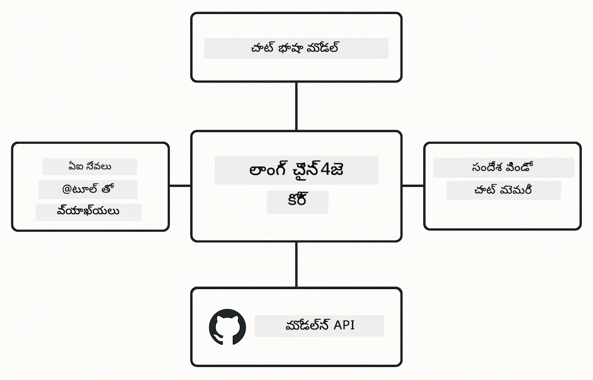

<!--
CO_OP_TRANSLATOR_METADATA:
{
  "original_hash": "22b5d7c8d7585325e38b37fd29eafe25",
  "translation_date": "2026-01-06T02:11:03+00:00",
  "source_file": "00-quick-start/README.md",
  "language_code": "te"
}
-->
# Module 00: త్వరిత ప్రారంభం

## విషయ సూచిక

- [పరిచయం](../../../00-quick-start)
- [LangChain4j అనేది ఏమిటి?](../../../00-quick-start)
- [LangChain4j ఆధారాలు](../../../00-quick-start)
- [ముందస్తు అవసరాలు](../../../00-quick-start)
- [సెట్టప్](../../../00-quick-start)
  - [1. మీ GitHub టోకెన్ పొందండి](../../../00-quick-start)
  - [2. మీ టోకెన్ సెట్ చేయండి](../../../00-quick-start)
- [ఉదాహరణలను నడపండి](../../../00-quick-start)
  - [1. ప్రాథమిక చాట్](../../../00-quick-start)
  - [2. ప్రాంప్ట్ నమూనాలు](../../../00-quick-start)
  - [3. ఫంక్షన్ కాలింగ్](../../../00-quick-start)
  - [4. డాక్యుమెంట్ Q&A (RAG)](../../../00-quick-start)
  - [5. బాధ్యతాయుత AI](../../../00-quick-start)
- [ ప్రతి ఉదాహరణ ఏమి చూపిస్తుంది](../../../00-quick-start)
- [తరువాతి దశలు](../../../00-quick-start)
- [సమస్య పరిష్కారం](../../../00-quick-start)

## పరిచయం

ఈ త్వరితప్రారంభం LangChain4j తో మీరెవ్వరు త్వరగా ప్రారంభించడానికి ఉద్దేశించబడింది. ఇది LangChain4j మరియు GitHub Models తో AI అనువర్తనాలు నిర్మించడం యొక్క ప్రాథమిక అంశాలను కవర్ చేస్తుంది. తరువాతి మాడ్యూల్స్‌లో మీరు LangChain4j తో Azure OpenAI ఉపయోగించి మరింత అభివృద్ధి చేసిన అనువర్తనాలను నిర్మిస్తారు.

## LangChain4j అనేది ఏమిటి?

LangChain4j అనేది AI ఆధారిత అనువర్తనాలను సులభంగా రూపొందించడానికి ఉపయోగించే జావా లైబ్రరీ. HTTP క్లయింట్లు మరియు JSON పార్సింగ్‌తో వ్యవహరించడం కాకుండా, మీరు శుభ్రమైన జావా APIలతో పని చేస్తారు.

LangChainలో "chain" అనేది ఒకదానితో మరోదాన్ని జతచేసే ప్రక్రియను సూచిస్తుంది - మీరు ఒక ప్రాంప్ట్‌ను మోడల్‌కు, లేదా పలువురు AI కాల్స్‌ను ఒకదానికి తరువాతి ఇన్‌పుట్‌గా ఆతర్వాతి కాల్‌కు చేర్పించవచ్చు. ఈ త్వరితప్రారంభం సాంక్లిష్టమైన చైన్లను అన్వేషించక ముందు ప్రాథమిక అంశాలపై దృష్టి పెడుతుంది.


*LangChain4jలో కంకణాల సంకల్పన - బిల్డింగ్ బ్లాక్స్ శక్తివంతమైన AI వర్క్‌ఫ్లోలను సృష్టించడానికి కలుస్తాయి*

మేము మూడు కోర్ భాగాలను ఉపయోగిస్తాము:

**ChatLanguageModel** - AI మోడల్ ఇన్‌టరాక్షన్‌లకు ఇంటర్ఫేస్. `model.chat("prompt")`ని కాల్ చేసి ప్రత్యుత్తర స్ట్రింగ్ పొందండి. మేము `OpenAiOfficialChatModel` ఉపయోగిస్తాము, ఇది GitHub Models వంటి OpenAI-అనుకూల ఎంటిపాయింట్లతో పనిచేస్తుంది.

**AiServices** - టైపు-సురక్షిత AI సేవ ఇంటర్ఫేస్‌లను సృష్టిస్తుంది. మీథడ్స్‌ను నిర్వచించి వాటిని `@Tool` తో గుర్తించి, LangChain4j ఆర్కెస్ట్రేషన్‌ను నిర్వహిస్తుంది. అవసరమైనప్పుడు AI ఆటోమేటై తన జావా మీథడ్స్‌ను కాల్ చేస్తుంది.

**MessageWindowChatMemory** - సంభాషణ చరిత్రను నిర్వహిస్తుంది. దీనివల్ల ప్రతి రిక్వెస్ట్ స్వతంత్రం కాకుండా, AI గత సందేశాలను గుర్తుంచుకుంటూ సాంకేతిక సమాచారాన్ని నిలుపుకుంటుంది.



*LangChain4j నిర్మాణం - ప్రధాన భాగాలు కలిసి మీ AI అనువర్తనాలకు శక్తిని నింపుతాయి*

## LangChain4j ఆధారాలు

ఈ త్వరితప్రారంభం [`pom.xml`](../../../00-quick-start/pom.xml)లో ఈ రెండు Maven ఆధారాలను ఉపయోగిస్తుంది:

```xml
<!-- Core LangChain4j library -->
<dependency>
    <groupId>dev.langchain4j</groupId>
    <artifactId>langchain4j</artifactId> <!-- Inherited from BOM in root pom.xml -->
</dependency>

<!-- OpenAI integration (works with GitHub Models) -->
<dependency>
    <groupId>dev.langchain4j</groupId>
    <artifactId>langchain4j-open-ai-official</artifactId> <!-- Inherited from BOM in root pom.xml -->
</dependency>
```

`langchain4j-open-ai-official` మాడ్యూల్ `OpenAiOfficialChatModel` క్లాస్ను అందిస్తుంది, ఇది OpenAI అనుకూల APIలకు కనెక్ట్ అవుతుంది. GitHub Models కూడా అదే API ఫార్మాట్‌ను ఉపయోగిస్తాయి, కనుక ప్రత్యేక అడాప్టర్ అవసరం లేదు - కేవలం బేస్ URLను `https://models.github.ai/inference`కి పాయింట్ చేయండి.

## ముందస్తు అవసరాలు

**డెవ్ కంటైనర్ ఉపయోగిస్తున్నారా?** జావా మరియు మేవెన్ ఇప్పటికే ఇన్స్టాల్ అయి ఉన్నాయి. మీరు కేవలం GitHub Personal Access Token అవసరం.

**లోకల్ డెవలప్మెంట్:**
- జావా 21+, మేవెన్ 3.9+
- GitHub Personal Access Token (దిశానిర్దేశాలు క్రింద ఉన్నాయి)

> **గమనిక:** ఈ మాడ్యూల్ GitHub Models నుండి `gpt-4.1-nano` ఉపయోగిస్తుంది. కోడ్‌లో మోడెల్ పేరును మార్చకండి - ఇది GitHub అందుబాటులో ఉన్న మోడల్స్‌కు అనుగుణంగా కాంఫిగర్ చేయబడింది.

## సెట్ అప్

### 1. మీ GitHub టోకెన్ పొందండి

1. [GitHub సెట్టింగ్స్ → Personal Access Tokens](https://github.com/settings/personal-access-tokens) కి వెళ్లండి
2. "Generate new token" క్లిక్ చేయండి
3. ఒక వివరణాత్మక పేరుని ఎంచుకోండి (ఉదా. "LangChain4j డెమో")
4. గడువు తీర్మానించండి (7 రోజులు సూచించబడింది)
5. "Account permissions" క్రింద "Models" కు "Read-only" సెట్ చేయండి
6. "Generate token" క్లిక్ చేయండి
7. మీ టోకెన్‌ని కాపీ చేసి సురక్షితంగా ఉంచండి - ఇది మళ్లీ కనిపించదు

### 2. మీ టోకెన్ సెట్ చేయండి

**ఎంపిక 1: VS కోడ్ ఉపయోగించడం (సిఫారసు)**

మీరు VS కోడ్ ఉపయోగిస్తుంటే, ప్రాజెక్ట్ రూట్‌లో `.env` ఫైల్‌లో మీ టోకెన్‌ను జోడించండి:

`.env` ఫైల్ లేకుంటే, `.env.example`ని `.env`గా కాపీ చేయండి లేదా ప్రాజెక్ట్ రూట్‌లో కొత్త `.env` ఫైల్ సృష్టించండి.

**ఉదాహరణ `.env` ఫైల్:**
```bash
# /workspaces/LangChain4j-for-Beginners/.env లోని
GITHUB_TOKEN=your_token_here
```

తర్వాత మీరు ఎక్స్‌ప్లోరర్‌లో ఏదైనా డెమో ఫైల్ (ఉదా: `BasicChatDemo.java`) పై రైట్ క్లిక్ చేసి **"Run Java"** ఎంచుకోగలరు లేదా రన్ అండ్ డీబగ్ ప్యానెల్ నుండి లాంచ్ కాన్ఫిగరేషన్లను ఉపయోగించవచ్చు.

**ఎంపిక 2: టెర్మినల్ ఉపయోగించడం**

టోకెన్‌ను ఎన్విరాన్‌మెంట్ వేరియబుల్‌గా సెట్ చేయండి:

**Bash:**
```bash
export GITHUB_TOKEN=your_token_here
```

**PowerShell:**
```powershell
$env:GITHUB_TOKEN=your_token_here
```

## ఉదాహరణలను నడపండి

**VS కోడ్ ఉపయోగించడం:** ఎక్స్‌ప్లోరర్‌లో ఏ డెమో ఫైల్ పై రైట్ క్లిక్ చేసి **"Run Java"** ఎంచుకోండి లేదా రన్ అండ్ డీబగ్ ప్యానెల్ నుండి లాంచ్ కాన్ఫిగరేషన్లను ఉపయోగించండి (ముందుగా `.env` ఫైల్‌లో మీ టోకెన్ జోడించినట్టు నిర్ధారించుకోండి).

**Maven ఉపయోగించడం:** ప్రత్యామ్నాయంగా కమాండ్ లైన్ నుండి నడపచ్చు:

### 1. ప్రాథమిక చాట్

**Bash:**
```bash
mvn compile exec:java -Dexec.mainClass=com.example.langchain4j.quickstart.BasicChatDemo
```

**PowerShell:**
```powershell
mvn --% compile exec:java -Dexec.mainClass=com.example.langchain4j.quickstart.BasicChatDemo
```

### 2. ప్రాంప్ట్ నమూనాలు

**Bash:**
```bash
mvn compile exec:java -Dexec.mainClass=com.example.langchain4j.quickstart.PromptEngineeringDemo
```

**PowerShell:**
```powershell
mvn --% compile exec:java -Dexec.mainClass=com.example.langchain4j.quickstart.PromptEngineeringDemo
```

జీరో-షాట్, ఫ్యూ-షాట్, చైన్-ఆఫ్-తొట్, మరియు రోల్-బేస్డ్ ప్రాంప్టింగ్ చూపిస్తుంది.

### 3. ఫంక్షన్ కాలింగ్

**Bash:**
```bash
mvn compile exec:java -Dexec.mainClass=com.example.langchain4j.quickstart.ToolIntegrationDemo
```

**PowerShell:**
```powershell
mvn --% compile exec:java -Dexec.mainClass=com.example.langchain4j.quickstart.ToolIntegrationDemo
```

AI అవసరమైనప్పుడు ఆటోమేటిగానే మీ జావా మీథడ్స్‌ను కాల్ చేస్తుంది.

### 4. డాక్యుమెంట్ Q&A (RAG)

**Bash:**
```bash
mvn compile exec:java -Dexec.mainClass=com.example.langchain4j.quickstart.SimpleReaderDemo
```

**PowerShell:**
```powershell
mvn --% compile exec:java -Dexec.mainClass=com.example.langchain4j.quickstart.SimpleReaderDemo
```

`document.txt`లోని కంటెంట్ గురించి ప్రశ్నలు అడగండి.

### 5. బాధ్యతాయుత AI

**Bash:**
```bash
mvn compile exec:java -Dexec.mainClass=com.example.langchain4j.quickstart.ResponsibleAIDemo
```

**PowerShell:**
```powershell
mvn --% compile exec:java -Dexec.mainClass=com.example.langchain4j.quickstart.ResponsibleAIDemo
```

AI సేఫ్టీ ఫిల్టర్స్ ఎలా హానికర కంటెంట్‌ని అరికట్టాలో చూడండి.

## ప్రతి ఉదాహరణ ఏమి చూపిస్తుంది

**ప్రాథమిక చాట్** - [BasicChatDemo.java](../../../00-quick-start/src/main/java/com/example/langchain4j/quickstart/BasicChatDemo.java)

ఇక్కడ నుండి LangChain4j యొక్క సరళతను ప్రారంభించండి. మీరు ఒక `OpenAiOfficialChatModel` సృష్టించి `.chat()` తో ప్రాంప్ట్ పంపి ప్రతిస్పందన పొందుతారు. ఇది బేసిక్ ప్రస్థావనను చూపిస్తుంది: కస్టమ్ ఎంటిపాయింట్లు మరియు API కీలు ఉపయోగించి మోడల్స్‌ను ఎలా ప్రారంభించాలో. మీరు ఈ నమూనాను అర్థం చేసుకున్న తర్వాత, మిగతా భాగాలు దీాని మీద నిర్మించబడతాయి.

```java
ChatLanguageModel model = OpenAiOfficialChatModel.builder()
    .baseUrl("https://models.github.ai/inference")
    .apiKey(System.getenv("GITHUB_TOKEN"))
    .modelName("gpt-4.1-nano")
    .build();

String response = model.chat("What is LangChain4j?");
System.out.println(response);
```

> **🤖 [GitHub Copilot](https://github.com/features/copilot) చాట్ తో ప్రయత్నించండి:** [`BasicChatDemo.java`](../../../00-quick-start/src/main/java/com/example/langchain4j/quickstart/BasicChatDemo.java)ని తెరవండి మరియు అడగండి:
> - "ఈ కోడ్‌లో GitHub Models నుండి Azure OpenAIకి ఎలా మార్చగలను?"
> - "OpenAiOfficialChatModel.builder()లో ఇంకేమి పారామీటర్లు సర్దుబాటు చేయవచ్చు?"
> - "సంపూర్ణ ప్రతిస్పందన కోసం వేచి ఉండకుండా స్ట్రీమింగ్ రిస్తున్నాను ఎలా జోడించాలి?"

**ప్రాంప్ట్ ఇంజనీరింగ్** - [PromptEngineeringDemo.java](../../../00-quick-start/src/main/java/com/example/langchain4j/quickstart/PromptEngineeringDemo.java)

ఇప్పుడు మీరు మోడల్ తో ఎలా మాట్లాడాలో తెలుసుకున్న తర్వాత, మీరు మోడల్‌కు ఏమి చెబతారో పరిశీలిద్దాం. ఈ డెమో అదే మోడల్ సెటప్‌ని ఉపయోగించి నాలుగు వేరు వేరు ప్రాంప్ట్ నమూనాలు చూపిస్తుంది. నేరుగా ఆదేశాల కోసం జీరో-షాట్ ప్రాంప్ట్స్, ఉదాహరణల నుండి నేర్చుకునే ఫ్యూ-షాట్ ప్రాంప్ట్స్, తర్క దశలను వెలికితీయడానికి చైన్-ఆఫ్-తొట్ ప్రాంప్ట్స్, మరియు కాన్టెక్స్ట్ సెటింగ్ కోసం రోల్-బేస్డ్ ప్రాంప్ట్స్ పరీక్షించండి. మీరు ఎలా అడగారో ఆధారంగా అదే మోడల్ ఎలా వేర్వేరు ఫలితాలు ఇస్తుందో చూస్తారు.

```java
PromptTemplate template = PromptTemplate.from(
    "What's the best time to visit {{destination}} for {{activity}}?"
);

Prompt prompt = template.apply(Map.of(
    "destination", "Paris",
    "activity", "sightseeing"
));

String response = model.chat(prompt.text());
```

> **🤖 [GitHub Copilot](https://github.com/features/copilot) చాట్ తో ప్రయత్నించండి:** [`PromptEngineeringDemo.java`](../../../00-quick-start/src/main/java/com/example/langchain4j/quickstart/PromptEngineeringDemo.java)ని తెరవండి మరియు అడగండి:
> - "జీరో-షాట్ మరియు ఫ్యూ-షాట్ ప్రాంప్టింగ్ మధ్య తేడా ఏమిటి, వాటిని ఎప్పుడు ఉపయోగించాలి?"
> - "తప్తి (temperature) పారామీటర్ మోడల్ ప్రతిస్పందనలను ఎలా ప్రభావితం చేస్తుంది?"
> - "ప్రొడక్షన్‌లో ప్రాంప్ట్ ఇంజక్షన్ దాడులను నివారించడానికి కొన్ని సాంకేతికాలు ఏవి?"
> - "సాధారణ నమూనాల కోసం పునర్వినియోగ ద్వారా PromptTemplate ఆబ్జెక్ట్స్‌ని ఎలా తయారుచేసుకోవచ్చు?"

**టూల్ ఇంటిగ్రేషన్** - [ToolIntegrationDemo.java](../../../00-quick-start/src/main/java/com/example/langchain4j/quickstart/ToolIntegrationDemo.java)

ఇక్కడే LangChain4j బలంగా మారుతుంది. మీరు `AiServices` ఉపయోగించి మీ జావా మీథడ్స్‌ని కాల్ చేయగల AI అసిస్టెంట్ సృష్టిస్తారు. మీథడ్స్‌ను `@Tool("వివరణ")` తో గుర్తించి ఉంచండి, మిగతా పనిని LangChain4j నిర్వహిస్తుంది - యూజర్ అడిగిన దాని ఆధారంగా AI ఈ టూల్స్‌ను ఆటోమేటిగానే ఉపయోగిస్తుంది. ఇది ఫంక్షన్ కాలింగ్ అనే కీలక సాంకేతికతను సూచిస్తుంది, ఇది AIలకు కేవలం ప్రశ్నలకు మాత్రమే కాకుండా చర్యలు తీసుకునేందుకు ఉపయోగపడుతుంది.

```java
@Tool("Performs addition of two numeric values")
public double add(double a, double b) {
    return a + b;
}

MathAssistant assistant = AiServices.create(MathAssistant.class, model);
String response = assistant.chat("What is 25 plus 17?");
```

> **🤖 [GitHub Copilot](https://github.com/features/copilot) చాట్ తో ప్రయత్నించండి:** [`ToolIntegrationDemo.java`](../../../00-quick-start/src/main/java/com/example/langchain4j/quickstart/ToolIntegrationDemo.java)ని తెరవండి మరియు అడగండి:
> - "@Tool గుర్తింపుతనం ఎలా పనిచేస్తుంది మరియు LangChain4j దానితో బ్యాక్‌ఎండ్‌లో ఏం చేస్తుంది?"
> - "బహుళ టూల్స్‌ను వరుసగా కాల్ చేసి సంక్లిష్ట సమస్యలను AI ఎలా పరిష్కరించగలదు?"
> - "టూల్ ఎక్సెప్షన్ వదులితే ఏమవుతుంది - తప్పులను ఎలా నిర్వహించాలి?"
> - "ఈ కాలిక్యులేటర్ ఉదాహరణకి బదులు వాస్తవ APIని ఎలా ఇంటిగ్రేట్ చేస్తాను?"

**డాక్యుమెంట్ Q&A (RAG)** - [SimpleReaderDemo.java](../../../00-quick-start/src/main/java/com/example/langchain4j/quickstart/SimpleReaderDemo.java)

ఇక్కడ మీరు RAG (retrieval-augmented generation) యొక్క ప్రాథమిక సూత్రాలను చూడగలరు. మోడల్ యొక్క ట్రైనింగ్ డేటా మీద ఆధారపడి ఉండకపోతే, మీరు [`document.txt`](../../../00-quick-start/document.txt) నుండి కంటెంట్‌ను లోడ్ చేసి ప్రాంప్ట్‌లో చేర్చుతారు. AI మీ డాక్యుమెంట్ ఆధారంగా జవాబిస్తోంది, సాధారణ జ్ఞానం మీద కాదు. ఇది మీ స్వంత డేటాతో పని చేసే సిస్టమ్స్ నిర్మించే మొదటి దశ.

```java
Document document = FileSystemDocumentLoader.loadDocument("document.txt");
String content = document.text();

String prompt = "Based on this document: " + content + 
                "\nQuestion: What is the main topic?";
String response = model.chat(prompt);
```

> **గమనిక:** ఈ సాదారణ పద్ధతి మొత్తం డాక్యుమెంట్‌ను ప్రాంప్ట్‌లో లోడ్ చేస్తుంది. పెద్ద ఫైళ్లు (>10KB) అయితే కాంటెక్స్ట్ పరిమితులను దాటి పోతాయి. మాడ్యూల్ 03 ఉత్పత్తి RAG సిస్టమ్స్ కోసం చంకింగ్ మరియు వెక్టర్ శోధనపై కవర్ చేస్తుంది.

> **🤖 [GitHub Copilot](https://github.com/features/copilot) చాట్ తో ప్రయత్నించండి:** [`SimpleReaderDemo.java`](../../../00-quick-start/src/main/java/com/example/langchain4j/quickstart/SimpleReaderDemo.java)ని తెరవండి మరియు అడగండి:
> - "RAG AI హెలుసినేషన్లను ఎలా నివారిస్తుంది మోడల్ ట్రైనింగ్ డేటా ఉపయోగించే దానికి తులనగా?"
> - "ఈ సింపుల్ పద్ధతి మరియు వెక్టర్ ఎంబెడ్డింగ్స్ ఉపయోగించిన రిట్రీవల్ మధ్య తేడా ఏమిటి?"
> - "పలు డాక్యుమెంట్లు లేదా పెద్ద జ్ఞాన భాండాగారం నిర్వహించడానికి ఎలా విస్తరించగలను?"
> - "AI కేవలం అందించిన కాంటెక్స్ట్ మాత్రమే ఉపయోగించేందుకు ప్రాంప్ట్ ను ఎలా నిర్మించాలి?"

**బాధ్యతాయుత AI** - [ResponsibleAIDemo.java](../../../00-quick-start/src/main/java/com/example/langchain4j/quickstart/ResponsibleAIDemo.java)

డిఫెన్స్ ఇన్ డెప్త్‌తో AI సేఫ్టీ ని నిర్మించండి. ఈ డెమో రెండు రక్షణ అంతస్తులను చూపిస్తుంది:

**భాగం 1: LangChain4j ఇన్‌పుట్ గార్డ్‌రెయిల్స్** - LLM కి చేరడానికి ముందే ప్రమాదకర ప్రాంప్ట్స్‌ను బ్లాక్ చేయండి. నిషేధిత కీవర్డ్స్ లేదా నమూనాల కోసం కస్టమ్ గార్డ్‌రెయిల్స్‌ని సృష్టించండి. ఇవి మీ కోడ్‌లో నడుస్తాయి, అందుకే వేగవంతంగా మరియు ఉచితం.

```java
class DangerousContentGuardrail implements InputGuardrail {
    @Override
    public InputGuardrailResult validate(UserMessage userMessage) {
        String text = userMessage.singleText().toLowerCase();
        if (text.contains("explosives")) {
            return fatal("Blocked: contains prohibited keyword");
        }
        return success();
    }
}
```

**భాగం 2: ప్రొవైడర్ సేఫ్టీ ఫిల్టర్స్** - GitHub Models లో బిల్ట్-ఇన్ ఫిల్టర్స్ ఉన్నాయి, ఇవి మీ గార్డ్‌రెయిల్స్ మిస్ అయ్యే విషయాలను పట్టుకోగలవు. తీవ్రమైన ఉల్లంఘనలకు హార్డ్ బ్లాక్లు (HTTP 400 లోపాలు) మరియు AI మృదువుగా నిరాకరించే సాఫ్ట్ రిఫ్యూజల్‌లు చూపిస్తాయి.

> **🤖 [GitHub Copilot](https://github.com/features/copilot) చాట్ తో ప్రయత్నించండి:** [`ResponsibleAIDemo.java`](../../../00-quick-start/src/main/java/com/example/langchain4j/quickstart/ResponsibleAIDemo.java)ని తెరవండి మరియు అడగండి:
> - "InputGuardrail అనేది ఏమిటి మరియు నేను నా ఇష్టమైనది ఎలా సృష్టిస్తాను?"
> - "హార్డ్ బ్లాక్ మరియు సాఫ్ట్ రిఫ్యూజల్ మధ్య తేడా ఏమిటి?"
> - "ఎందుకు గార్డ్‌రెయిల్స్ మరియు ప్రొవైడర్ ఫిల్టర్స్ రెండింటినీ కలిసి ఉపయోగిస్తారు?"

## తర్వాతి దశలు

**తరువాతి మాడ్యూల్:** [01-పరిచయం - LangChain4j మరియు gpt-5 తో Azure పై ప్రారంభం](../01-introduction/README.md)

---

**నావిగేషన్:** [← ప్రధానానికి తిరిగి](../README.md) | [తరవాత: Module 01 - పరిచయం →](../01-introduction/README.md)

---

## సమస్య పరిష్కారం

### తొలి సారి Maven బిల్డ్

**సమस्या**: మొదటి సారి `mvn clean compile` లేదా `mvn package` ఎక్కువసేపు (10-15 నిమిషాలు) పడుతుంది

**కారణం**: Maven మొదటి బిల్డ్‌లో అన్ని ప్రాజెక్ట్ ఆధారాలను (Spring Boot, LangChain4j లైబ్రరీలు, Azure SDKల వంటి) డౌన్‌లోడ్ చేయాలి.

**పరిష్కారం**: ఇది సాదారణమైన చర్య. తరువాతి బిల్డులు స్థానికంగా క్యాష్ అయ్యేందున చాలా వేగంగా ఉంటాయి. డౌన్‌లోడ్ సమయంలో మీ నెట్‌వర్క్ వేగం ఆధారపడి ఉంటుంది.

### PowerShell Maven కమాండ్ సింటాక్స్

**సమస్య**: Maven ఆజ్ఞలు `Unknown lifecycle phase ".mainClass=..."` లోపంతో విఫలమవుతాయి

**కారణం**: PowerShell `=`ను వేరియబుల్ అసైన్‌మెంట్ ఆపరేటర్‌గా భావించి Maven ప్రాపర్టీ సింటాక్స్‌ను చెడగొడుతుంది
**పరిష్కారం**: Maven ఆదేశం ముందు `--%` స్టాప్-పార్సింగ్ ఆపరేటర్కు ఉపయోగించండి:

**PowerShell:**
```powershell
mvn --% compile exec:java -Dexec.mainClass=com.example.langchain4j.quickstart.BasicChatDemo
```

**Bash:**
```bash
mvn compile exec:java -Dexec.mainClass=com.example.langchain4j.quickstart.BasicChatDemo
```

`--%` ఆపరేటర్ PowerShellకి మిగిలిన ఆర్జుమెంట్లను వివరించకుండానే నేరుగా Mavenకు పంపాలని సూచిస్తుంది.

### Windows PowerShell ఎమోజీ ప్రదర్శన

**సమస్య**: AI స్పందనలు PowerShell లో ఎమోజీ స్థానంలో చెత్త అక్షరాలు (ఉదా. `????` లేదా `â??`) చూపిస్తాయి

**హేడు**: PowerShell యొక్క డిఫాల్ట్ ఎంకోడింగ్ UTF-8 ఎమోజీలకు మద్దతు ఇవ్వదు

**పరిష్కారం**: Java అప్లికేషన్లు నడపడానికి ముందు ఈ ఆదేశాన్ని అమలు చేయండి:
```cmd
chcp 65001
```

ఇది టెర్మినల్‌లో UTF-8 ఎంకోడింగ్ ని బలవంతం చేస్తుంది. లేదా మెరుగైన యూనికోడ్ మద్దతు ఉన్న Windows Terminalను ఉపయోగించవచ్చు.

### API కాల్స్ డీబగ్గింగ్

**సమస్య**: ఆథెంటికేషన్ లోపాలు, రేటు పరిమితులు, లేదా AI మోడల్ నుండి అనుకోని స్పందనలు

**పరిష్కారం**: ఉదాహరణల్లో `.logRequests(true)` మరియు `.logResponses(true)` ఉన్నాయి, ఇవి API కాల్స్‌ను కన్సోల్‌లో చూపిస్తాయి. ఇది ఆథెంటికేషన్ లోపాలు, రేటు పరిమితులు, లేదా అనుకోని స్పందనలను పరిష్కరించడానికి సహాయపడుతుంది. ఉత్పత్తిలో ఈ ఫ్లాగులను తీసివేయండి తద్వారా లాగ్ శబ్ధం తగ్గుతుంది.

---

<!-- CO-OP TRANSLATOR DISCLAIMER START -->
**డిస్లైమర్**:
ఈ పత్రం AI అనువాద సేవ [Co-op Translator](https://github.com/Azure/co-op-translator) ఉపయోగించి అనువదించబడింది. మరింత ఖచ్చితత్వం కోసం ప్రయత్నించినప్పటికీ, స్వయంచాలక అనువాదాలలో తప్పులు లేదా అప్రమత్తతలు ఉండవచ్చు. ము౦దట్టి భాషలో ఉన్న ఒరిజినల్ పత్రాన్ని అధికారిక మూలం గా పరిగణించాలి. కీలక సమాచారం కోసం, ప్రొఫెషనల్ మానవ అనువాదం చేయించుకోవడం సలహా ఇవ్వబడుతుంది. ఈ అనువాదం వలన వచ్చే ఏదైనా తప్పుదోవలు లేదా తప్పుదిద్దులను మేము బాధ్యత వహించము.
<!-- CO-OP TRANSLATOR DISCLAIMER END -->