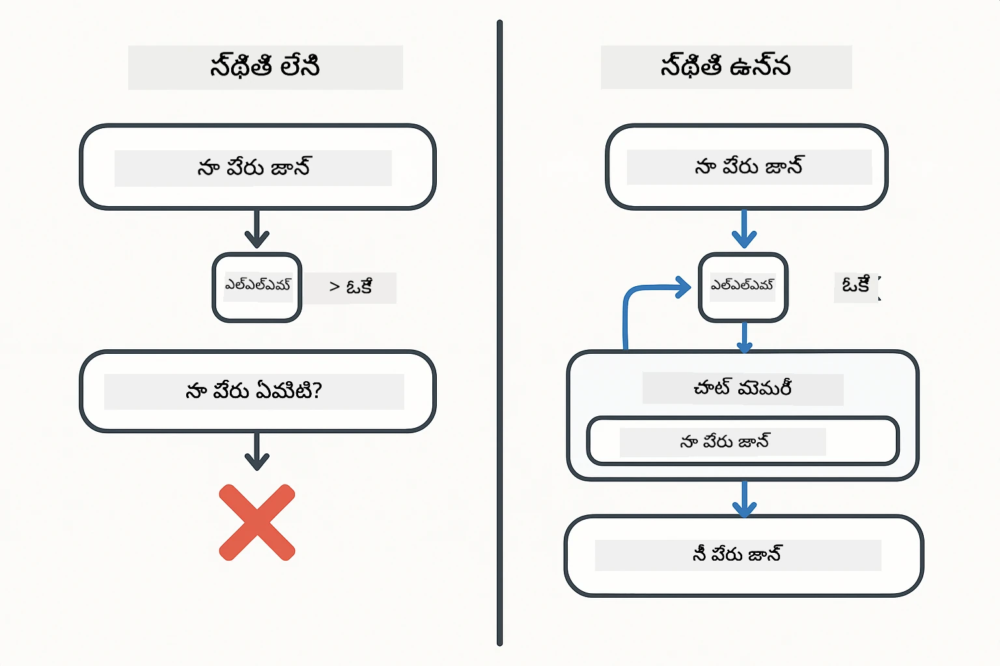
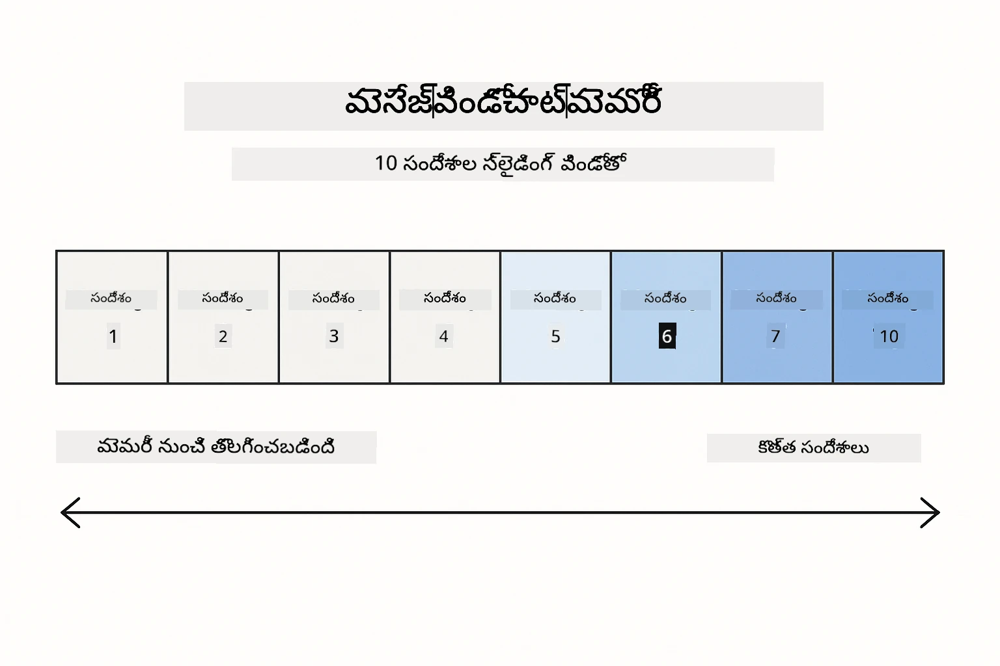
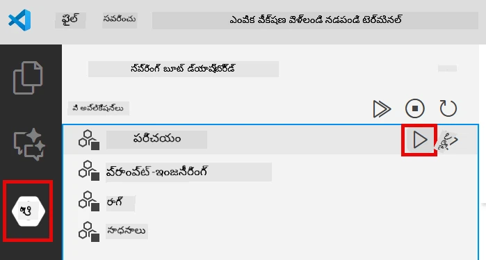
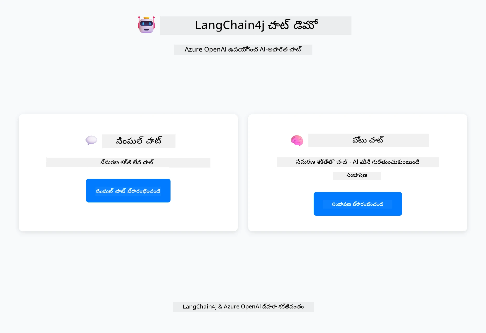
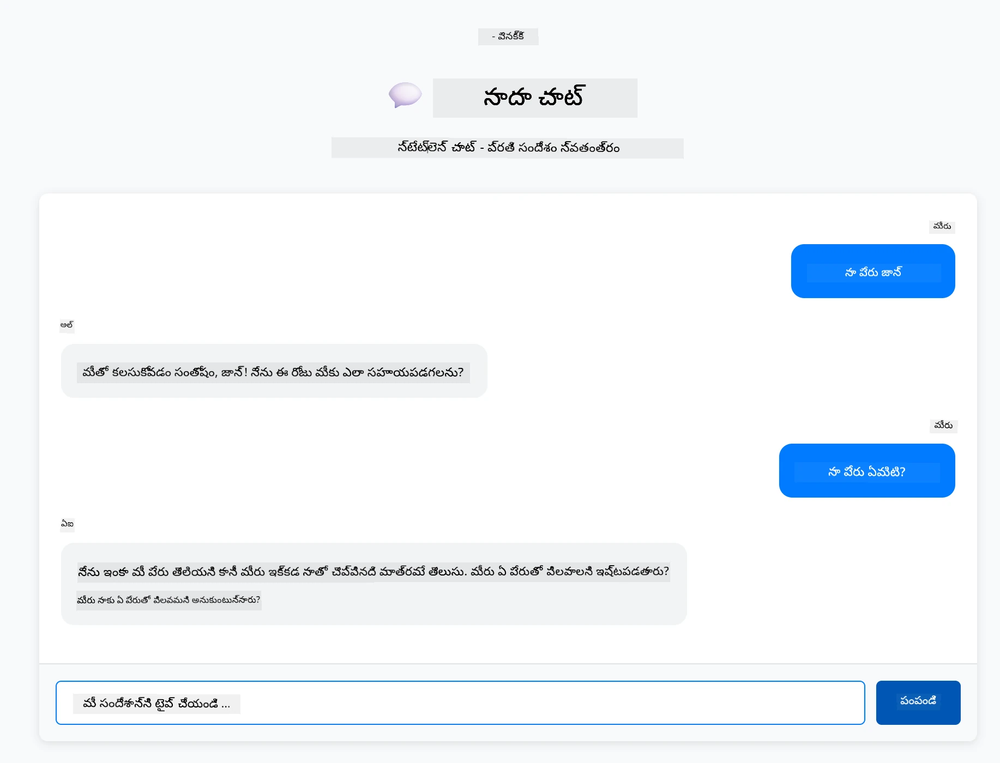
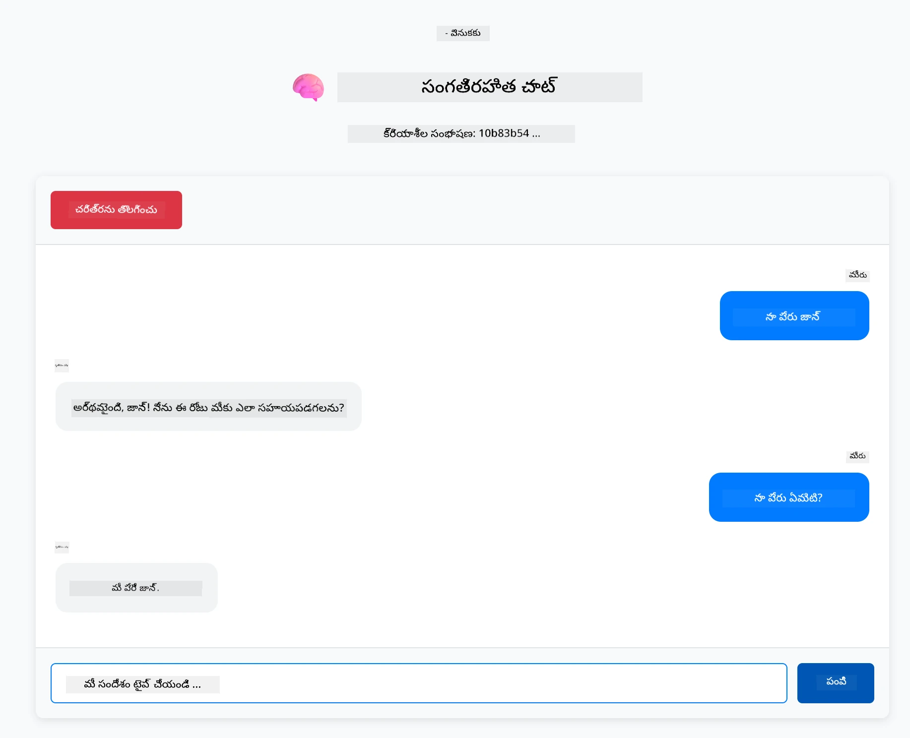

# మాడ్యూల్ 01: LangChain4j తో ప్రాతమిక పరిచయం

## విషయ సూచీ

- [వీడియో వాకథ్రూ](#వీడియో-వాకథ్రూ)
- [మీరు నేర్చుకునేది ఏమిటి](#మీరు-నేర్చుకునేది-ఏమిటి)
- [అవసరమైన పరిజ్ఞానం](#అవసరమైన-పరిజ్ఞానం)
- [ప్రధాన సమస్యను అర్థం చేసుకోవడం](#ప్రధాన-సమస్యను-అర్థం-చేసుకోవడం)
- [టోకెన్లను అర్థం చేసుకోవడం](#టోకెన్లను-అర్థం-చేసుకోవడం)
- [మెమరీ ఎలా పనిచేస్తుంది](#మెమరీ-ఎలా-పని-చేస్తుంది)
- [ఇది LangChain4j ను ఎలా ఉపయోగిస్తుంది](#ఇది-langchain4j-ను-ఎలా-ఉపయోగిస్తుంది)
- [Azure OpenAI ఇన్‌ఫ్రాస్ట్రక్చర్‌ను మిళితం చేయడం](#azure-openai-ఇన్‌ఫ్రాస్ట్రక్చర్‌ను-మిళితం-చేయడం)
- [యాప్‌ను స్థానికంగా నడపడం](#యాప్‌ను-స్థానికంగా-నడపడం)
- [యాప్‌ను ఉపయోగించడం](#యాప్-ఉపయోగించడం)
  - [స్టేట్‌లెస్ చాట్ (ఎడమ ప్యానెల్)](#స్టేట్‌లెస్-చాట్-ఎడమ-ప్యానెల్)
  - [స్టేట్‌ఫుల్ చాట్ (కుడి ప్యానెల్)](#స్టేట్‌ఫుల్-చాట్-కుడి-ప్యానెల్)
- [తరువాతి దశలు](#తర్వాతి-దశలు)

## వీడియో వాకథ్రూ

ఈ మాడ్యూల్‌తో ఎలా ప్రారంభించాలో వివరించే లైవ్ సెషన్‌ను వీక్షించండి:

<a href="https://www.youtube.com/live/nl_troDm8rQ?si=6b85S8xGjWnT2fX9"></a>

## మీరు నేర్చుకునేది ఏమిటి

ఇది LangChain4j మరియు Azure OpenAI తో మీ ప్రారంభ ప్రదేశం. మనం ప్రాథమికాలు మొదలుపెట్టి ప్రొడక్షన్ మాదిరి యాప్లికేషన్లు నిర్మించడం ప్రారంభిస్తాము. ఈ మాడ్యూల్ చరిత్రను గుర్తుంచుకుంటూ సందర్భాన్ని నిలిపి ఉంచే సంభాషణాత్మక AI పై కేంద్రీకృతమౌందిఅంటే, ప్రతి తర్వాతి మాడ్యూల్ పై ఈ ముఖ్యమైన భావనలు ఆధారపడి ఉంటాయి.

మేము ఈ గైడ్‌లో Azure OpenAI యొక్క GPT-5.2 ని ఉపయోగిస్తాము ఎందుకంటే దాని అభివృద్ధి చెందిన తర్కశక్తి వలన వివిధ నమూనాల ప్రవర్తన బాగా స్పష్టంగా ఉంటుంది. మీరు మెమరీ చేర్చినప్పుడు, తేడా స్పష్టంగా కనిపిస్తుంది. దీని వలన ప్రతి భాగం మీ యాప్లికేషన్‌కు ఏమి తెస్తుందో అర్థం చేసుకోవడం సులభమవుతుంది.

మీరు నిర్మించబోయేది ఒకే యాప్లికేషన్, ఇది రెండు నమూనాలను చూపిస్తుంది:

**స్టేట్‌లెస్ చాట్** - ప్రతి అభ్యర్థన స్వతంత్రంగా ఉంటుంది. మోడల్ గత సందేశాలను గుర్తించదు. ఇది సులభమైన ప్రారంభ పాయింట్.

**స్టేట్‌ఫుల్ సంభాషణ** - ప్రతి అభ్యర్థనలో సంభాషణ చరిత్రను కలుపుతుంది. మోడల్ పలు రౌండ్లలో సందర్భం నిలుపుకుంటుంది. ప్రొడక్షన్ అప్లికేషన్లకు ఇది అవసరం.

## అవసరమైన పరిజ్ఞానం

- Azure సబ్‌స్క్రిప్షన్, Azure OpenAI యాక్సెస్ తో
- Java 21, Maven 3.9+ 
- Azure CLI (https://learn.microsoft.com/en-us/cli/azure/install-azure-cli)
- Azure Developer CLI (azd) (https://learn.microsoft.com/en-us/azure/developer/azure-developer-cli/install-azd)

> **గమనిక:** Java, Maven, Azure CLI మరియు Azure Developer CLI (azd) ప్రాధాన్యం గల devcontainer లో ముందే ఇన్స్టాల్ చేయబడ్డాయి.

> **గమనిక:** ఈ మాడ్యూల్ Azure OpenAI పై GPT-5.2 ను ఉపయోగిస్తుంది. `azd up` ద్వారా డిప్లాయ్‌మెంట్ ఆటోమేటిగానే సജ్జమవుతుంది - కోడ్‌లో మోడల్ పేరును మార్చొద్దు.

## ప్రధాన సమస్యను అర్థం చేసుకోవడం

భాషా నమూనాలు స్టేట్‌లెస్ ఉంటాయి. ప్రతి API కాల్ స్వతంత్రంగా ఉంటుంది. మీరు "నా పేరు జాన్" అని పంపించాక "నా పేరు ఏమిటి?" అని అడిగితే, మోడల్ మీరు పేరు చెప్పానని తెలియదు. ఇది ప్రతి అభ్యర్థనను మీరు చేపట్టిన మొదటి సంభాషణగా పరిగణిస్తుంది.

సాధారణ ప్రశ్నోత్తరాలకు ఇది సరైనది అయినా వాస్తవ యాప్లికేషన్లలో ఇది ఉపయోగకరము కాదు. కస్టమర్ సర్వీస్ బాట్లు మీకన్నా మీరు చెప్పిన దానిని గుర్తుంచుకోవాలి. వ్యక్తిగత సహాయకులు సందర్భాన్ని అందుకోవాలి. ఏదైనా పలు రౌండ్ల సంభాషణ మేమరీ అవసరం.

కింద ఉన్న చిత్రంలో రెండు విధానాల తేడా చూపబడింది — ఎడమ వైపున, మీ పేరు మరచిపోయే స్టేట్‌లెస్ కాల్; కుడి వైపున, ChatMemory ఆధారిత స్టేట్‌ఫుల్ కాల్, ఇది మీ పేరును గుర్తుంచుతుంది.



*స్టేట్‌లెస్ (స్వతంత్ర కాల్స్) మరియు స్టేట్‌ఫుల్ (సందర్భాన్ని అర్థం చేసుకునే) సంభాషణల మధ్య తేడా*

## టోకెన్లను అర్థం చేసుకోవడం

సంభాషణల్లోకి ప్రవేశించే ముందే టోకెన్లను అర్థం చేసుకోవడం ముఖ్యం - భాషా నమూనాలు ప్రాసెస్ చేసే పాఠ్య యూనిట్లు:


*పాఠ్యం ఎలా టోకెన్లుగా విభజించబడుతుంది ఉదాహరణ — "I love AI!" 4 వేర్వేరు ప్రాసెసింగ్ యూనిట్లు అవుతుంది*

టోకెన్లు AI నమూనాలు పాఠ్యాన్ని కొలిచే మరియు ప్రాసెస్ చేసే విధానం. పదాలు, विरామਚిహ్నాలు, ఎడమవెలుపలు కూడా టోకెన్లు కావచ్చు. మీ మోడల్ ఒకేసారి ఎంత టోకెన్లు ప్రాసెస్ చేయగలదో పరిమితి ఉంది (GPT-5.2కి 400,000 టోకెన్లు, అందులో 272,000 ఇన్‌పుట్ టోకెన్లు మరియు 128,000 అవుట్‌పుట్ టోకెన్లు). టోకెన్ల అర్థం పొందడం సంభాషణ పరిమాణం మరియు ఖర్చులను నియంత్రించడంలో సహాయకరం.

## మెమరీ ఎలా పని చేస్తుంది

చాట్ మెమరీ స్టేట్‌లెస్ సమస్యను సంభాషణ చరిత్రను నిలిపి ఉంచడం ద్వారా పరిష్కరిస్తుంది. మీ అభ్యర్థనను మోడల్‌కు పంపించే ముందు, సంబంధిత గత సందేశాలను ఫ్రేమ్‌వర్క్ జత చేస్తుంది. మీరు "నా పేరు ఏమిటి?" అని అడిగితే, సిస్టమ్ మొత్తం సంభాషణ చరిత్రను పంపించి, మోడల్ మీరు "నా పేరు జాన్" అని ముందుగా చెప్పారు అని తెలుసుకుంటుంది.

LangChain4j ఆటోమేటిగానే హ్యాండిల్ చేసే మెమరీ ఇంప్లిమెంటేషన్‌లను అందిస్తుంది. మీరు ఎన్ని సందేశాలు నిలుపుకోవాలో ఎంచుకోవచ్చు, ఫ్రేమ్‌వర్క్ సందర్భం విండోను నిర్వహిస్తుంది. క్రింద దృశ్యం MessageWindowChatMemory ఇటీవల సందేశాల స్లయిడింగ్ విండోని ఎలా నిర్వహిస్తుందో చూపిస్తుంది.



*MessageWindowChatMemory ఇటీవల సందేశాల స్లయిడింగ్ విండోని నిర్వహించి పాత సందేశాలను ఆటోమేటిగానే తొలగిస్తోంది*

## ఇది LangChain4j ను ఎలా ఉపయోగిస్తుంది

ఈ మాడ్యూల్ Spring Boot ను ఇంటిగ్రేట్ చేసి సంభాషణ మెమరీ జోడించింది. భాగాలు ఇలా సరిపోయాయి:

**డిపెండెన్సీలు** - రెండు LangChain4j లైబ్రరీలను జోడించండి:

```xml
<dependency>
    <groupId>dev.langchain4j</groupId>
    <artifactId>langchain4j</artifactId> <!-- Inherited from BOM in root pom.xml -->
</dependency>
<dependency>
    <groupId>dev.langchain4j</groupId>
    <artifactId>langchain4j-open-ai-official</artifactId> <!-- Inherited from BOM in root pom.xml -->
</dependency>
```

**చాట్ మోడల్** - Azure OpenAIని Spring beanగా కాన్ఫిగర్ చేయండి ([LangChainConfig.java](../../../01-introduction/src/main/java/com/example/langchain4j/config/LangChainConfig.java)):

```java
@Bean
public OpenAiOfficialChatModel openAiOfficialChatModel() {
    return OpenAiOfficialChatModel.builder()
            .baseUrl(azureEndpoint)
            .apiKey(azureApiKey)
            .modelName(deploymentName)
            .timeout(Duration.ofMinutes(5))
            .maxRetries(3)
            .build();
}
```

బిల్డర్ `azd up` ద్వారా సెట్ చేసిన ఎన్‌విరాన్‌మెంట్ వేరియబుల్స్ నుండి క్రెడెన్షియల్స్ చదువుకుంటుంది. `baseUrl` ను మీ Azure ఎండ్పాయింట్‌గా సెట్ చేయడం OpenAI క్లయింట్ Azure OpenAIతో పని చేసేందుకు కారణం.

**సంభాషణ మెమరీ** - MessageWindowChatMemory తో చాట్ చరిత్ర ట్రాక్ చేయండి ([ConversationService.java](../../../01-introduction/src/main/java/com/example/langchain4j/service/ConversationService.java)):

```java
ChatMemory memory = MessageWindowChatMemory.withMaxMessages(10);

memory.add(UserMessage.from("My name is John"));
memory.add(AiMessage.from("Nice to meet you, John!"));

memory.add(UserMessage.from("What's my name?"));
AiMessage aiMessage = chatModel.chat(memory.messages()).aiMessage();
memory.add(aiMessage);
```

`withMaxMessages(10)` తో మెమరీ తయారుచేయండి, దీని వలన గడిచిన 10 సందేశాలు నిల్వ ఉంటాయి. Typed wrappers ఉపయోగించి యూజర్ మరియు AI సందేశాలను జోడించండి: `UserMessage.from(text)` మరియు `AiMessage.from(text)`. చరిత్రను `memory.messages()` తో తీసుకుని మోడల్‌కు పంపండి. సర్వీస్ ప్రతి సంభాషణ ID కు ప్రత్యేక మెమరీ ఉదాహరణలను నిలిపి, అనేక యూజర్లు ఒకేసారి చాట్ చేయగలరు.

> **🤖 [GitHub Copilot](https://github.com/features/copilot) చాట్ తో ప్రయత్నించండి:** [`ConversationService.java`](../../../01-introduction/src/main/java/com/example/langchain4j/service/ConversationService.java) తెరిచి అడగండి:
> - "MessageWindowChatMemory విండో నిండినప్పుడు ఏ సందేశాలను తొలగించాలో ఎలా నిర్ణయిస్తుంది?"
> - "ఇన్-మెమరీ కాకుండా డేటాబేస్ ఉపయోగించి కస్టమ్ మెమరీ స్టోరేజ్ ఎలా అమలు చేయగలను?"
> - "పాత సంభాషణ చరిత్రా సంక్షిప్తీకరణకు సమ్మరీ జోడించడం ఎలా చేయాలి?"

స్టేట్‌లెస్ చాట్ ఎండ్‌పాయింట్ మెమరీని పూర్తిగా వదిలిపెడుతుంది - కేవలం `chatModel.chat(prompt)` మాత్రమే, వేగవంతమైన ప్రారంభం కోసం. స్టేట్‌ఫుల్ ఎండ్‌పాయింట్ మెమరీలో సందేశాలు జతచేసి చరిత్రను తీసుకుని, ఆ సందర్భాన్ని ప్రతీ అభ్యర్థనలో చేర్చుతుంది. అదే మోడల్ కాన్ఫిగరేషన్, భిన్న నమూనాలు.

## Azure OpenAI ఇన్‌ఫ్రాస్ట్రక్చర్‌ను మిళితం చేయడం

**Bash:**
```bash
cd 01-introduction
azd up  # సబ్‌స్క్రిప్షన్ మరియు స్థలాన్ని ఎంచుకోండి (ఇస్టయుఎస్2 సూచించబడింది)
```

**PowerShell:**
```powershell
cd 01-introduction
azd up  # సబ్స్క్రిప్షన్ మరియు స్థానం ఎంచుకోండి (ఈస్ట్ us2 సిఫార్సు చేస్తారు)
```

> **గమనిక:** టైమౌట్ లోపం వస్తే (`RequestConflict: Cannot modify resource ... provisioning state is not terminal`), కేవలం మళ్ళీ `azd up` నడపండి. Azure వనరులు ఇంకా బ్యాక్‌గ్రౌండ్ లో సెట్ అవుతున్నా ఉండచ్చు, మళ్ళీ ప్రయత్నించడం వలన వనరులు పూర్తిగా సిద్ధమైన తర్వాత డిప్లాయ్‌మెంట్ పూర్తవుతుంది.

ఇదివల్ల:
1. GPT-5.2 మరియు text-embedding-3-small మోడల్స్‌తో Azure OpenAI వనరు మిళితం అవుతుంది
2. ప్రాజెక్ట్ రూట్‌లో క్రెడెన్షియల్స్ ఉన్న `.env` ఫైల్ ఆటోమేటిగానే సృష్టించబడుతుంది
3. అవసరమైన అన్ని ఎన్విరాన్‌మెంట్ వేరియబుల్స్ సెట్ చేయబడతాయి

**డిప్లాయ్‌మెంట్ సమస్యలు ఉన్నారా?** సబ్‌డొమైన్ పేరు ఘర్షణలు, Azure పోర్టల్ మాన్యువల్ డిప్లాయ్‌మెంట్ దశలు, మోడల్ కాన్ఫిగరేషన్ మార్గదర్శకత్వం కోసం [Infrastructure README](infra/README.md) చూడండి.

**డిప్లాయ్‌మెంట్ విజయవంతమైందని ధృవీకరించండి:**

**Bash:**
```bash
cat ../.env  # AZURE_OPENAI_ENDPOINT, API_KEY, మొదలైనవి చూపించాలి.
```

**PowerShell:**
```powershell
Get-Content ..\.env  # AZURE_OPENAI_ENDPOINT, API_KEY, మొదలైనవి చూపించాలి.
```

> **గమనిక:** `azd up` ఆదేశం ఆటోమేటిగానే `.env` ఫైల్ సృష్టిస్తుంది. తరువాత దీనిని నవీకరించాలి అంటే మీరు `.env` ఫైల్‌ను మాన్యువల్‌గా ఎడిట్ చేయొచ్చు లేదా దీన్ని తిరిగి సృష్టించేందుకు:
>
> **Bash:**
> ```bash
> cd ..
> bash .azd-env.sh
> ```
>
> **PowerShell:**
> ```powershell
> cd ..
> .\.azd-env.ps1
> ```


## యాప్‌ను స్థానికంగా నడపడం

**డిప్లాయ్‌మెంట్ ధృవీకరణ:**

Azure క్రెడెన్షియల్స్ ఉన్న `.env` ఫైల్ రూట్ డైరెక్టరీలో ఉన్నదని ధృవీకరించండి. ఈ మాడ్యూల్ ఫోల్డర్ (`01-introduction/`) నుంచి ఇది నడపండి:

**Bash:**
```bash
cat ../.env  # AZURE_OPENAI_ENDPOINT, API_KEY, DEPLOYMENT చూపించాలి
```

**PowerShell:**
```powershell
Get-Content ..\.env  # AZURE_OPENAI_ENDPOINT, API_KEY, DEPLOYMENT చూపించాలి
```

**యాప్లికేషన్లను ప్రారంభించండి:**

**ఎంపిక 1: Spring Boot డాష్‌బోర్డ్ ఉపయోగించి (VS Code వినియోగదారులకు సిఫార్సు)**

Devcontainer లో Spring Boot డాష్‌బోర్డ్ ఎక్స్‌టెన్షన్ ఉంది, ఇది మీకు అన్ని Spring Boot యాప్లికేషన్లను విజువల్ ఇంటర్‌ఫేస్ ద్వారా నిర్వహించేందుకు వీలు కల్పిస్తుంది. మీరు దీన్ని VS Code ఎడమ వైపు Activity Barలో (Spring Boot చిహ్నం కోసం చూడండి) కనుగొనవచ్చు.

Spring Boot డాష్‌బోర్డ్ నుండి మీరు:
- వర్క్‌స్పేస్‌లో ఉన్న అన్ని Spring Boot యాప్లికేషన్లు చూడవచ్చు
- ఒక క్లిక్‌తో యాప్లికేషన్లు ఆన్/ఆఫ్ చేయవచ్చు
- యాప్లికేషన్ లాగ్స్ రియల్-టైమ్‌లో చూడవచ్చు
- యాప్లికేషన్ స్థితిని పర్యవేక్షించవచ్చు

"introduction" పక్కన ఉన్న ప్లే బటన్ నొక్కి ఈ మాడ్యూల్ ప్రారంభించండి లేదా అన్ని మాడ్యూల్స్‌ను ఒకేసారి ప్రారంభించండి.



*VS Code లో Spring Boot డాష్‌బోర్డ్ — ఒకే చోట అన్ని మాడ్యూల్స్‌ను మొదలు పెట్టండి, ఆపు చేయండి మరియు పర్యవేక్షించండి*

**ఎంపిక 2: షెల్ స్క్రిప్ట్‌లను ఉపయోగించి**

అన్ని వెబ్ యాప్లికేషన్లు (మాడ్యూల్స్ 01-04) ప్రారంభించండి:

**Bash:**
```bash
cd ..  # మూల డైరెక్టరీ నుండి
./start-all.sh
```

**PowerShell:**
```powershell
cd ..  # రూట్ డైరెక్టరీ నుండి
.\start-all.ps1
```

లేదా కేవలం ఈ మాడ్యూల్‌ను ప్రారంభించండి:

**Bash:**
```bash
cd 01-introduction
./start.sh
```

**PowerShell:**
```powershell
cd 01-introduction
.\start.ps1
```

రూట్ `.env` ఫైల్ నుండి ఎన్విరాన్‌మెంట్ వేరియబుల్స్‌ను స్క్రిప్ట్‌లు ఆటోమేటిగానే లోడ్ చేస్తాయి మరియు JARలు లేవంటే అవి నిర్మిస్తాయి.

> **గమనిక:** మీరు ప్రారంభించే ముందు అన్ని మాడ్యూల్స్ మాన్యువల్‌గా నిర్మించాలనుకుంటే:
>
> **Bash:**
> ```bash
> cd ..  # Go to root directory
> mvn clean package -DskipTests
> ```
>
> **PowerShell:**
> ```powershell
> cd ..  # Go to root directory
> mvn clean package -DskipTests
> ```


http://localhost:8080 ని మీ బ్రౌజర్‌లో తెరవండి.

**ఆపడానికి:**

**Bash:**
```bash
./stop.sh  # ఈ మాడ్యూల్ మాత్రమే
# లేదా
cd .. && ./stop-all.sh  # అన్ని మాడ్యూల్స్
```

**PowerShell:**
```powershell
.\stop.ps1  # ఈ మాడ్యూల్ మాత్రమే
# లేదా
cd ..; .\stop-all.ps1  # అన్ని మాడ్యూల్లు
```


## యాప్ ఉపయోగించడం

యాప్ రెండు చాట్ అమలు విధానాలతో వెబ్ ఇంటర్‌ఫేస్ను అందిస్తుంది.



*డాష్‌బోర్డ్ రెండు ఎంపికలను చూపిస్తోంది - సింపుల్ చాట్ (స్టేట్‌లెస్) మరియు సంభాషణాత్మక చాట్ (స్టేట్‌ఫుల్)*

### స్టేట్‌లెస్ చాట్ (ఎడమ ప్యానెల్)

ముందుగా దీన్ని ప్రయత్నించండి. "నా పేరు జాన్" అని అడిగి వెంటనే "నా పేరు ఏమిటి?" అని అడగండి. మోడల్ గుర్తుంచుకోదు ఎందుకంటే ప్రతి సందేశం స్వతంత్రం. ఇది ప్రాథమిక భాషా నమూనా ఇంటిగ్రేషన్ లో ప్రధాన సమస్యను సూచిస్తుంది - సంభాషణ సందర్భం లేమి.



*AI మీ పేరును గత సందేశం నుండి గుర్తించదు*

### స్టేట్‌ఫుల్ చాట్ (కుడి ప్యానెల్)

ఇప్పుడు ఇదే శ్రేణిని ఇక్కడ ప్రయత్నించండి. "నా పేరు జాన్" అని అడిగి తర్వాత "నా పేరు ఏమిటి?" అని అడిగితే గుర్తుంచుకుంటుంది. తేడా MessageWindowChatMemory గలిది - ఇది సంభాషణ చరిత్రను నిలుపుతుంది మరియు అది ప్రతీ అభ్యర్థనతో పాటు పంపబడుతుంది. ఇదే ప్రొడక్షన్ conversational AI పని చేసే విధానం.



*AI సంభాషణలో మునుపటి మీ పేరును గుర్తుంచుకుంటుంది*

రెండు ప్యానెల్స్ ఒకే GPT-5.2 మోడల్‌ను ఉపయోగిస్తాయి. పలు మెమరీ తేడానే ఉంది. దీని వలన మెమరీ యాప్‌కు ఏం తెస్తుంది మరియు అది నిజమైన ఉపయోగాల కోసం ఎందుకు అవసరం అనేది స్పష్టమవుతుంది.

## తర్వాతి దశలు

**తరువాతి మాడ్యూల్:** [02-prompt-engineering - GPT-5.2 తో ప్రాంప్ట్ ఇంజనీరింగ్](../02-prompt-engineering/README.md)

---

**నావిగేషన్:** [← ప్రధానానికి తిరుగు](../README.md) | [తరువాత: మాడ్యూల్ 02 - ప్రాంప్ట్ ఇంజనీరింగ్ →](../02-prompt-engineering/README.md)

---

<!-- CO-OP TRANSLATOR DISCLAIMER START -->
**అస్వీకరణ**:
ఈ పత్రం AI అనువాద సేవ [Co-op Translator](https://github.com/Azure/co-op-translator) ఉపయోగించి అనువదించబడింది. మేము ఖచ్చితత్వానికి ప్రయత్నిస్తున్నప్పటికీ, ఆటోమేటెడ్ అనువాదాలు తప్పులు లేదా అసమగ్రతలను కలిగి ఉండవచ్చు. దాని స్వదేశ భాషలో ఉన్న అసలు పత్రాన్ని అధికారం కలిగిన మూలంగా పరిగణించాలి. కీలకమైన సమాచారం కోసం, ప్రొఫెషనల్ మానవ అనువాదాన్ని సిఫారసు చేస్తాము. ఈ అనువాదం ఉపయోగం వల్ల కలిగే ఏవైనా అపార్థాలు లేదా తప్పుదారులు కోసం మేము బాధ్యత వహించము.
<!-- CO-OP TRANSLATOR DISCLAIMER END -->