<!--
CO_OP_TRANSLATOR_METADATA:
{
  "original_hash": "8d787826cad7e92bf5cdbd116b1e6116",
  "translation_date": "2025-12-13T16:37:18+00:00",
  "source_file": "02-prompt-engineering/README.md",
  "language_code": "te"
}
-->
# మాడ్యూల్ 02: GPT-5 తో ప్రాంప్ట్ ఇంజనీరింగ్

## విషయ సూచిక

- [మీరు నేర్చుకునేది](../../../02-prompt-engineering)
- [ముందస్తు అవసరాలు](../../../02-prompt-engineering)
- [ప్రాంప్ట్ ఇంజనీరింగ్ అర్థం చేసుకోవడం](../../../02-prompt-engineering)
- [ఇది LangChain4j ను ఎలా ఉపయోగిస్తుంది](../../../02-prompt-engineering)
- [ప్రధాన నమూనాలు](../../../02-prompt-engineering)
- [ఉన్న Azure వనరులను ఉపయోగించడం](../../../02-prompt-engineering)
- [అప్లికేషన్ స్క్రీన్‌షాట్లు](../../../02-prompt-engineering)
- [నమూనాలను అన్వేషించడం](../../../02-prompt-engineering)
  - [తక్కువ vs ఎక్కువ ఉత్సాహం](../../../02-prompt-engineering)
  - [టాస్క్ ఎగ్జిక్యూషన్ (టూల్ ప్రీాంబుల్స్)](../../../02-prompt-engineering)
  - [స్వీయ-పరిశీలన కోడ్](../../../02-prompt-engineering)
  - [సంఘటిత విశ్లేషణ](../../../02-prompt-engineering)
  - [బహుళ-తిరుగుడు చాట్](../../../02-prompt-engineering)
  - [దశలవారీగా తర్కం](../../../02-prompt-engineering)
  - [పరిమిత అవుట్పుట్](../../../02-prompt-engineering)
- [మీరు నిజంగా నేర్చుకుంటున్నది](../../../02-prompt-engineering)
- [తరువాతి దశలు](../../../02-prompt-engineering)

## మీరు నేర్చుకునేది

మునుపటి మాడ్యూల్‌లో, మీరు మెమరీ ఎలా సంభాషణాత్మక AI కి సహాయపడుతుందో చూశారు మరియు GitHub మోడల్స్‌ను ప్రాథమిక పరస్పర చర్యల కోసం ఉపయోగించారు. ఇప్పుడు మనం మీరు ఎలా ప్రశ్నలు అడుగుతారో - ప్రాంప్ట్‌లు - Azure OpenAI యొక్క GPT-5 ఉపయోగించి దానిపై దృష్టి పెడతాము. మీరు మీ ప్రాంప్ట్‌లను ఎలా నిర్మిస్తారో మీకు వచ్చే ప్రతిస్పందనల నాణ్యతపై గణనీయమైన ప్రభావం ఉంటుంది.

మనం GPT-5 ను ఉపయోగిస్తాము ఎందుకంటే ఇది తర్క నియంత్రణను పరిచయం చేస్తుంది - మీరు మోడల్ ఎంత ఆలోచించాలో చెప్పవచ్చు. ఇది వివిధ ప్రాంప్టింగ్ వ్యూహాలను స్పష్టంగా చేస్తుంది మరియు మీరు ఏ దృష్టికోణాన్ని ఎప్పుడు ఉపయోగించాలో అర్థం చేసుకోవడంలో సహాయపడుతుంది. GitHub మోడల్స్‌తో పోలిస్తే Azure యొక్క GPT-5 కి తక్కువ రేట్ పరిమితులు ఉండటం కూడా లాభదాయకం.

## ముందస్తు అవసరాలు

- మాడ్యూల్ 01 పూర్తి చేసుకున్నది (Azure OpenAI వనరులు అమర్చబడ్డాయి)
- రూట్ డైరెక్టరీలో `.env` ఫైల్ Azure క్రెడెన్షియల్స్‌తో (మాడ్యూల్ 01 లో `azd up` ద్వారా సృష్టించబడింది)

> **గమనిక:** మీరు మాడ్యూల్ 01 పూర్తి చేయకపోతే, ముందుగా అక్కడ ఉన్న అమరిక సూచనలను అనుసరించండి.

## ప్రాంప్ట్ ఇంజనీరింగ్ అర్థం చేసుకోవడం

ప్రాంప్ట్ ఇంజనీరింగ్ అనేది మీరు అవసరమైన ఫలితాలను నిరంతరం పొందేలా ఇన్‌పుట్ టెక్స్ట్‌ను డిజైన్ చేయడం. ఇది కేవలం ప్రశ్నలు అడగడం మాత్రమే కాదు - మోడల్ మీరు ఏమి కోరుతున్నారో మరియు దానిని ఎలా అందించాలో సరిగ్గా అర్థం చేసుకునేలా అభ్యర్థనలను నిర్మించడం.

దాన్ని ఒక సహోద్యోగికి సూచనలు ఇవ్వడం లాగా భావించండి. "బగ్ సరిచేయండి" అనేది అస్పష్టంగా ఉంటుంది. "UserService.java లైన్ 45 లో నల్ పాయింటర్ ఎక్సెప్షన్‌ను నల్ చెక్ జోడించి సరిచేయండి" అనేది స్పష్టంగా ఉంటుంది. భాషా మోడల్స్ కూడా ఇదే విధంగా పనిచేస్తాయి - స్పష్టత మరియు నిర్మాణం ముఖ్యం.

## ఇది LangChain4j ను ఎలా ఉపయోగిస్తుంది

ఈ మాడ్యూల్ గత మాడ్యూల్స్ నుండి అదే LangChain4j ఆధారాన్ని ఉపయోగించి అధునాతన ప్రాంప్టింగ్ నమూనాలను ప్రదర్శిస్తుంది, ప్రాంప్ట్ నిర్మాణం మరియు తర్క నియంత్రణపై దృష్టి పెట్టి.

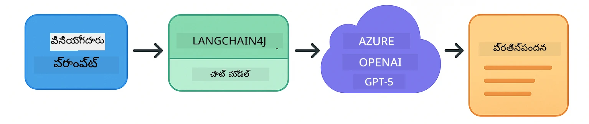

*LangChain4j మీ ప్రాంప్ట్‌లను Azure OpenAI GPT-5 కి ఎలా కనెక్ట్ చేస్తుంది*

**ఆధారాలు** - మాడ్యూల్ 02 లో `pom.xml` లో నిర్వచించబడిన langchain4j ఆధారాలు ఉపయోగించబడతాయి:
```xml
<dependency>
    <groupId>dev.langchain4j</groupId>
    <artifactId>langchain4j</artifactId> <!-- Inherited from BOM in root pom.xml -->
</dependency>
<dependency>
    <groupId>dev.langchain4j</groupId>
    <artifactId>langchain4j-open-ai-official</artifactId> <!-- Inherited from BOM in root pom.xml -->
</dependency>
```

**OpenAiOfficialChatModel కాన్ఫిగరేషన్** - [LangChainConfig.java](../../../02-prompt-engineering/src/main/java/com/example/langchain4j/prompts/config/LangChainConfig.java)

చాట్ మోడల్‌ను OpenAI అధికారిక క్లయింట్ ఉపయోగించి స్ప్రింగ్ బీన్‌గా మాన్యువల్‌గా కాన్ఫిగర్ చేస్తారు, ఇది Azure OpenAI ఎండ్‌పాయింట్లను మద్దతు ఇస్తుంది. మాడ్యూల్ 01 నుండి ప్రధాన తేడా మోడల్ సెటప్ కాదు, `chatModel.chat()` కు పంపే ప్రాంప్ట్‌ల నిర్మాణం.

**సిస్టమ్ మరియు యూజర్ సందేశాలు** - [Gpt5PromptService.java](../../../02-prompt-engineering/src/main/java/com/example/langchain4j/prompts/service/Gpt5PromptService.java)

స్పష్టత కోసం LangChain4j సందేశ రకాల్ని వేరుచేస్తుంది. `SystemMessage` AI ప్రవర్తన మరియు సందర్భాన్ని సెట్ చేస్తుంది (ఉదా: "మీరు కోడ్ సమీక్షకుడు"), `UserMessage` వాస్తవ అభ్యర్థనను కలిగి ఉంటుంది. ఈ వేరుపడటం వలన వేర్వేరు యూజర్ ప్రశ్నలపై AI ప్రవర్తనను స్థిరంగా ఉంచవచ్చు.

```java
SystemMessage systemMsg = SystemMessage.from(
    "You are a helpful Java programming expert."
);

UserMessage userMsg = UserMessage.from(
    "Explain what a List is in Java"
);

String response = chatModel.chat(systemMsg, userMsg);
```

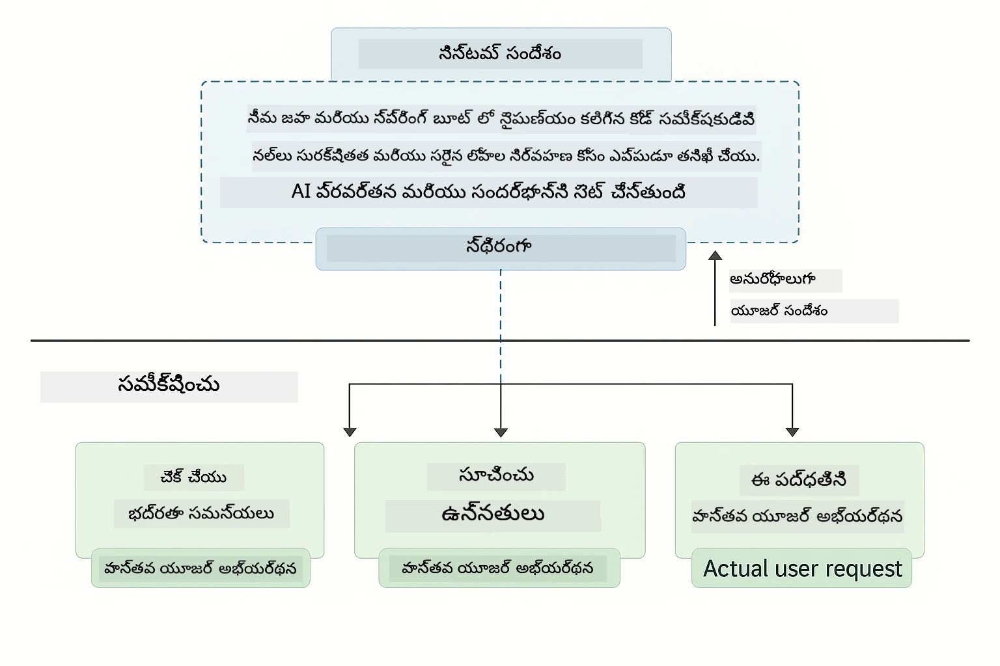

*SystemMessage స్థిరమైన సందర్భాన్ని అందిస్తుంది, UserMessages వ్యక్తిగత అభ్యర్థనలను కలిగి ఉంటాయి*

**Multi-Turn కోసం MessageWindowChatMemory** - బహుళ-తిరుగుడు సంభాషణ నమూనా కోసం, మేము మాడ్యూల్ 01 నుండి `MessageWindowChatMemory` ను పునఃఉపయోగిస్తాము. ప్రతి సెషన్‌కు `Map<String, ChatMemory>` లో నిల్వ చేయబడిన స్వంత మెమరీ ఉంటుంది, ఇది అనేక సమకాలీన సంభాషణలను సందర్భం కలపకుండా నిర్వహిస్తుంది.

**ప్రాంప్ట్ టెంప్లేట్లు** - ఇక్కడ అసలు దృష్టి ప్రాంప్ట్ ఇంజనీరింగ్ పైనే, కొత్త LangChain4j API లు కాదు. ప్రతి నమూనా (తక్కువ ఉత్సాహం, ఎక్కువ ఉత్సాహం, టాస్క్ ఎగ్జిక్యూషన్ మొదలైనవి) అదే `chatModel.chat(prompt)` పద్ధతిని ఉపయోగిస్తుంది కానీ జాగ్రత్తగా నిర్మించిన ప్రాంప్ట్ స్ట్రింగ్స్‌తో. XML ట్యాగ్లు, సూచనలు, ఫార్మాటింగ్ అన్నీ ప్రాంప్ట్ టెక్స్ట్ భాగాలు, LangChain4j ఫీచర్లు కాదు.

**తర్క నియంత్రణ** - GPT-5 తర్క ప్రయత్నం "గరిష్టం 2 తర్క దశలు" లేదా "విస్తృతంగా అన్వేషించు" వంటి ప్రాంప్ట్ సూచనల ద్వారా నియంత్రించబడుతుంది. ఇవి ప్రాంప్ట్ ఇంజనీరింగ్ సాంకేతికతలు, LangChain4j కాన్ఫిగరేషన్లు కాదు. లైబ్రరీ మీ ప్రాంప్ట్‌లను మోడల్‌కు అందిస్తుంది.

ముఖ్యమైన విషయం: LangChain4j మౌలిక సదుపాయాలను అందిస్తుంది ([LangChainConfig.java](../../../02-prompt-engineering/src/main/java/com/example/langchain4j/prompts/config/LangChainConfig.java) ద్వారా మోడల్ కనెక్షన్, మెమరీ, సందేశ నిర్వహణ [Gpt5PromptService.java](../../../02-prompt-engineering/src/main/java/com/example/langchain4j/prompts/service/Gpt5PromptService.java) ద్వారా), ఈ మాడ్యూల్ ఆ మౌలిక సదుపాయాల్లో సమర్థవంతమైన ప్రాంప్ట్‌లను ఎలా రూపొందించాలో నేర్పుతుంది.

## ప్రధాన నమూనాలు

అన్ని సమస్యలకు ఒకే విధమైన దృష్టికోణం అవసరం కాదు. కొన్ని ప్రశ్నలకు త్వరితమైన సమాధానాలు కావాలి, మరికొన్ని లోతైన ఆలోచన అవసరం. కొన్ని స్పష్టమైన తర్కం కావాలి, మరికొన్ని కేవలం ఫలితాలు కావాలి. ఈ మాడ్యూల్ ఎనిమిది ప్రాంప్టింగ్ నమూనాలను కవర్ చేస్తుంది - ప్రతి ఒక్కటి వేర్వేరు పరిస్థితులకు అనుకూలంగా ఉంటుంది. మీరు వాటన్నింటినీ ప్రయోగించి ఏ దృష్టికోణం ఎప్పుడు ఉత్తమం అవుతుందో నేర్చుకుంటారు.

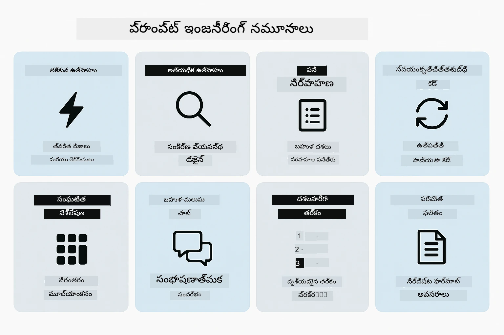

*ఎనిమిది ప్రాంప్ట్ ఇంజనీరింగ్ నమూనాల అవలోకనం మరియు వాటి ఉపయోగ సందర్భాలు*

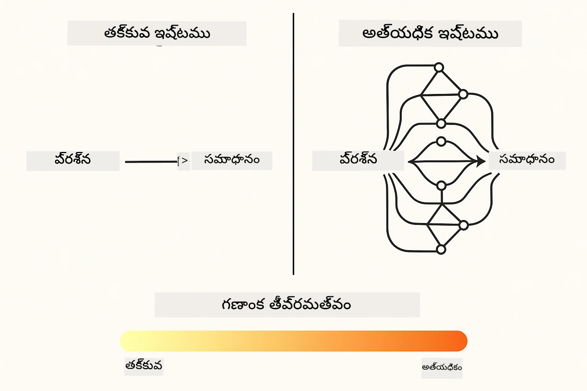

*తక్కువ ఉత్సాహం (వేగంగా, నేరుగా) vs ఎక్కువ ఉత్సాహం (విస్తృతంగా, అన్వేషణాత్మకంగా) తర్క దృష్టికోణాలు*

**తక్కువ ఉత్సాహం (త్వరిత & కేంద్రీకృత)** - మీరు వేగంగా, నేరుగా సమాధానాలు కావాలనుకునే సులభమైన ప్రశ్నల కోసం. మోడల్ తక్కువగా తర్కిస్తుంది - గరిష్టం 2 దశలు. లెక్కలు, లుకప్‌లు లేదా సూటిగా ప్రశ్నలకు ఇది ఉపయోగించండి.

```java
String prompt = """
    <reasoning_effort>low</reasoning_effort>
    <instruction>maximum 2 reasoning steps</instruction>
    
    What is 15% of 200?
    """;

String response = chatModel.chat(prompt);
```

> 💡 **GitHub Copilot తో అన్వేషించండి:** [`Gpt5PromptService.java`](../../../02-prompt-engineering/src/main/java/com/example/langchain4j/prompts/service/Gpt5PromptService.java) తెరవండి మరియు అడగండి:
> - "తక్కువ ఉత్సాహం మరియు ఎక్కువ ఉత్సాహం ప్రాంప్టింగ్ నమూనాల మధ్య తేడా ఏమిటి?"
> - "ప్రాంప్ట్‌లలో XML ట్యాగ్లు AI ప్రతిస్పందన నిర్మాణానికి ఎలా సహాయపడతాయి?"
> - "స్వీయ-పరిశీలన నమూనాలు మరియు నేరుగా సూచనలు ఎప్పుడు ఉపయోగించాలి?"

**ఎక్కువ ఉత్సాహం (లోతైన & విస్తృత)** - మీరు సమగ్ర విశ్లేషణ కావాలనుకునే క్లిష్ట సమస్యల కోసం. మోడల్ విస్తృతంగా అన్వేషించి వివరమైన తర్కాన్ని చూపిస్తుంది. సిస్టమ్ డిజైన్, ఆర్కిటెక్చర్ నిర్ణయాలు లేదా క్లిష్ట పరిశోధనలకు ఇది ఉపయోగించండి.

```java
String prompt = """
    <reasoning_effort>high</reasoning_effort>
    <instruction>explore thoroughly, show detailed reasoning</instruction>
    
    Design a caching strategy for a high-traffic REST API.
    """;

String response = chatModel.chat(prompt);
```

**టాస్క్ ఎగ్జిక్యూషన్ (దశలవారీగా పురోగతి)** - బహుళ దశల వర్క్‌ఫ్లోల కోసం. మోడల్ ముందుగా ప్రణాళికను అందిస్తుంది, ప్రతి దశను వివరిస్తూ పని చేస్తుంది, తరువాత సారాంశం ఇస్తుంది. మైగ్రేషన్లు, అమలు లేదా ఏదైనా బహుళ దశల ప్రక్రియకు ఇది ఉపయోగించండి.

```java
String prompt = """
    <task>Create a REST endpoint for user registration</task>
    <preamble>Provide an upfront plan</preamble>
    <narration>Narrate each step as you work</narration>
    <summary>Summarize what was accomplished</summary>
    """;

String response = chatModel.chat(prompt);
```

చైన్-ఆఫ్-థాట్ ప్రాంప్టింగ్ మోడల్ తర్క ప్రక్రియను స్పష్టంగా చూపించమని అడుగుతుంది, క్లిష్ట పనుల కోసం ఖచ్చితత్వాన్ని మెరుగుపరుస్తుంది. దశలవారీగా విభజన మానవులు మరియు AI రెండింటికీ తర్కాన్ని అర్థం చేసుకోవడంలో సహాయపడుతుంది.

> **🤖 [GitHub Copilot](https://github.com/features/copilot) చాట్‌తో ప్రయత్నించండి:** ఈ నమూనా గురించి అడగండి:
> - "దీర్ఘకాలిక ఆపరేషన్ల కోసం టాస్క్ ఎగ్జిక్యూషన్ నమూనాను ఎలా అనుకూలపరచగలను?"
> - "ఉత్పత్తి అప్లికేషన్లలో టూల్ ప్రీాంబుల్స్ నిర్మాణానికి ఉత్తమ పద్ధతులు ఏమిటి?"
> - "UI లో మధ్యంతర పురోగతి నవీకరణలను ఎలా క్యాప్చర్ చేసి ప్రదర్శించగలను?"

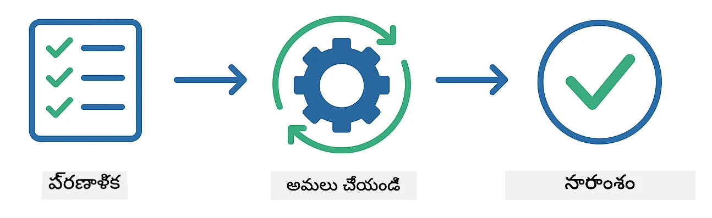

*బహుళ దశల పనుల కోసం ప్రణాళిక → అమలు → సారాంశం వర్క్‌ఫ్లో*

**స్వీయ-పరిశీలన కోడ్** - ఉత్పత్తి-నాణ్యత కోడ్ సృష్టించడానికి. మోడల్ కోడ్‌ను ఉత్పత్తి చేస్తుంది, నాణ్యత ప్రమాణాలతో తనిఖీ చేస్తుంది, మరియు పునరావృతంగా మెరుగుపరుస్తుంది. కొత్త ఫీచర్లు లేదా సేవలు నిర్మించేటప్పుడు ఉపయోగించండి.

```java
String prompt = """
    <task>Create an email validation service</task>
    <quality_criteria>
    - Correct logic and error handling
    - Best practices (clean code, proper naming)
    - Performance optimization
    - Security considerations
    </quality_criteria>
    <instruction>Generate code, evaluate against criteria, improve iteratively</instruction>
    """;

String response = chatModel.chat(prompt);
```

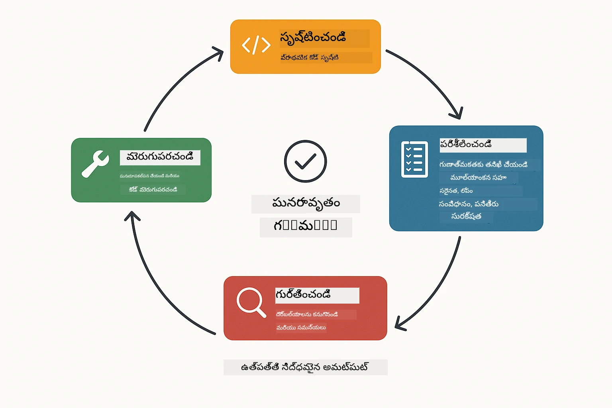

*పునరావృత మెరుగుదల చక్రం - ఉత్పత్తి, మూల్యాంకనం, సమస్యల గుర్తింపు, మెరుగుదల, పునరావృతం*

**సంఘటిత విశ్లేషణ** - స్థిరమైన మూల్యాంకనానికి. మోడల్ కోడ్‌ను ఒక స్థిరమైన ఫ్రేమ్‌వర్క్ (సరైనదా, ఆచారాలు, పనితీరు, భద్రత) ఉపయోగించి సమీక్షిస్తుంది. కోడ్ సమీక్షలు లేదా నాణ్యత అంచనాలకు ఇది ఉపయోగించండి.

```java
String prompt = """
    <code>
    public List getUsers() {
        return database.query("SELECT * FROM users");
    }
    </code>
    
    <framework>
    Evaluate using these categories:
    1. Correctness - Logic and functionality
    2. Best Practices - Code quality
    3. Performance - Efficiency concerns
    4. Security - Vulnerabilities
    </framework>
    """;

String response = chatModel.chat(prompt);
```

> **🤖 [GitHub Copilot](https://github.com/features/copilot) చాట్‌తో ప్రయత్నించండి:** సంఘటిత విశ్లేషణ గురించి అడగండి:
> - "వేర్వేరు రకాల కోడ్ సమీక్షల కోసం విశ్లేషణ ఫ్రేమ్‌వర్క్‌ను ఎలా అనుకూలపరచగలను?"
> - "సంఘటిత అవుట్పుట్‌ను ప్రోగ్రామాటిక్గా పార్స్ చేసి చర్యలు తీసుకోవడానికి ఉత్తమ మార్గం ఏమిటి?"
> - "వేర్వేరు సమీక్ష సెషన్లలో స్థిరమైన తీవ్రత స్థాయిలను ఎలా నిర్ధారించగలను?"

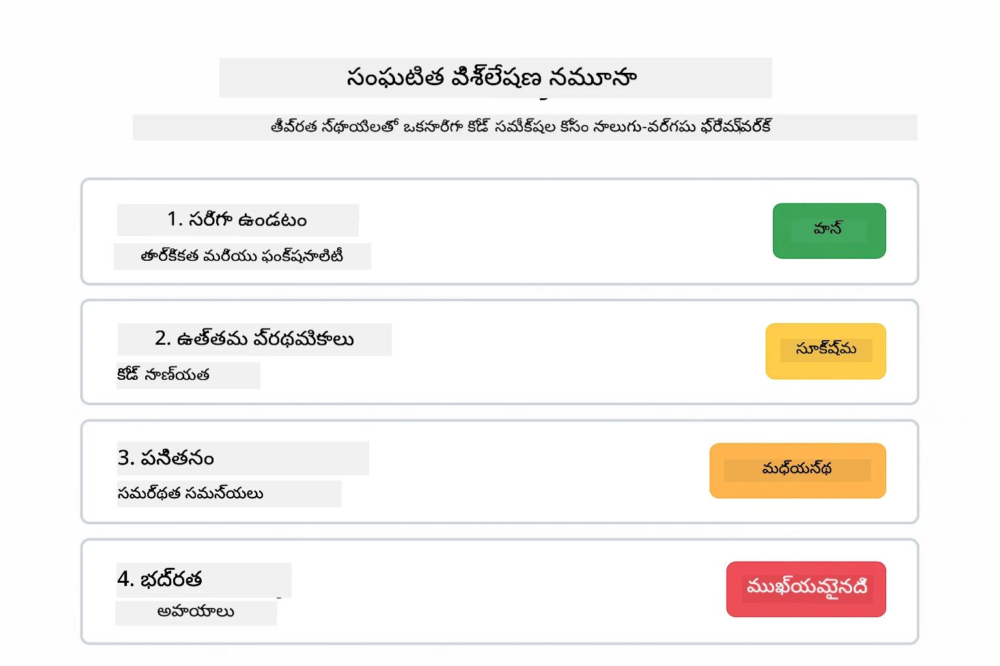

*తీవ్రత స్థాయిలతో స్థిరమైన కోడ్ సమీక్షల కోసం నాలుగు-వర్గాల ఫ్రేమ్‌వర్క్*

**బహుళ-తిరుగుడు చాట్** - సందర్భం అవసరమైన సంభాషణల కోసం. మోడల్ గత సందేశాలను గుర్తుంచుకుని వాటిపై నిర్మిస్తుంది. ఇంటరాక్టివ్ సహాయం సెషన్లు లేదా క్లిష్ట Q&A కోసం ఉపయోగించండి.

```java
ChatMemory memory = MessageWindowChatMemory.withMaxMessages(10);

memory.add(UserMessage.from("What is Spring Boot?"));
AiMessage aiMessage1 = chatModel.chat(memory.messages()).aiMessage();
memory.add(aiMessage1);

memory.add(UserMessage.from("Show me an example"));
AiMessage aiMessage2 = chatModel.chat(memory.messages()).aiMessage();
memory.add(aiMessage2);
```

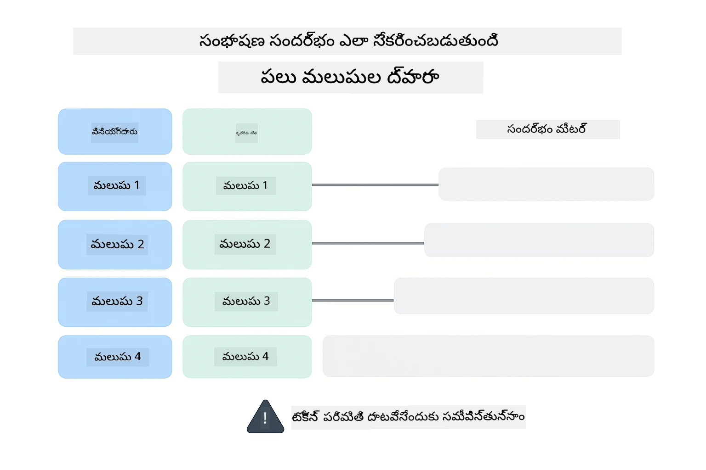

*చర్చ సందర్భం బహుళ తిరుగులుగా సేకరించి టోకెన్ పరిమితి వరకు చేరుతుంది*

**దశలవారీగా తర్కం** - స్పష్టమైన తర్కం అవసరమైన సమస్యల కోసం. మోడల్ ప్రతి దశకు స్పష్టమైన తర్కాన్ని చూపిస్తుంది. గణిత సమస్యలు, తర్క పజిల్స్ లేదా ఆలోచనా ప్రక్రియ అర్థం చేసుకోవాలనుకునే సందర్భాల్లో ఉపయోగించండి.

```java
String prompt = """
    <instruction>Show your reasoning step-by-step</instruction>
    
    If a train travels 120 km in 2 hours, then stops for 30 minutes,
    then travels another 90 km in 1.5 hours, what is the average speed
    for the entire journey including the stop?
    """;

String response = chatModel.chat(prompt);
```

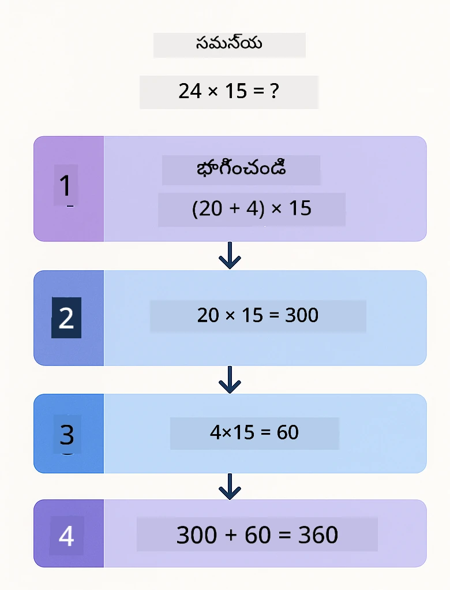

*సమస్యలను స్పష్టమైన తర్క దశలుగా విభజించడం*

**పరిమిత అవుట్పుట్** - నిర్దిష్ట ఫార్మాట్ అవసరాలున్న ప్రతిస్పందనలకు. మోడల్ ఫార్మాట్ మరియు పొడవు నియమాలను కఠినంగా అనుసరిస్తుంది. సారాంశాలు లేదా ఖచ్చితమైన అవుట్పుట్ నిర్మాణం కావాలనుకునే సందర్భాల్లో ఉపయోగించండి.

```java
String prompt = """
    <constraints>
    - Exactly 100 words
    - Bullet point format
    - Technical terms only
    </constraints>
    
    Summarize the key concepts of machine learning.
    """;

String response = chatModel.chat(prompt);
```

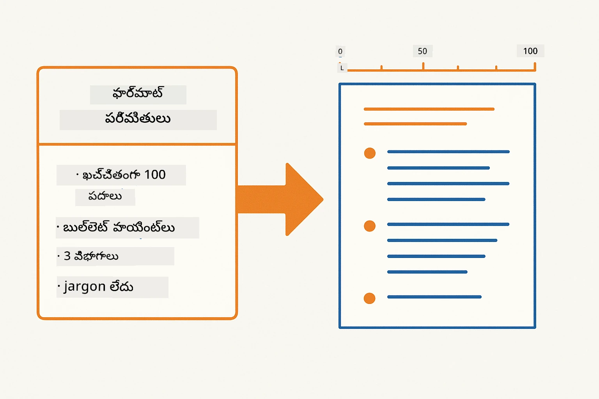

*నిర్దిష్ట ఫార్మాట్, పొడవు, నిర్మాణ అవసరాలను అమలు చేయడం*

## ఉన్న Azure వనరులను ఉపయోగించడం

**అమరికను ధృవీకరించండి:**

రూట్ డైరెక్టరీలో `.env` ఫైల్ Azure క్రెడెన్షియల్స్‌తో ఉందని నిర్ధారించండి (మాడ్యూల్ 01 సమయంలో సృష్టించబడింది):
```bash
cat ../.env  # AZURE_OPENAI_ENDPOINT, API_KEY, DEPLOYMENT చూపించాలి
```

**అప్లికేషన్ ప్రారంభించండి:**

> **గమనిక:** మీరు ఇప్పటికే మాడ్యూల్ 01 నుండి `./start-all.sh` ఉపయోగించి అన్ని అప్లికేషన్లను ప్రారంభించుంటే, ఈ మాడ్యూల్ ఇప్పటికే పోర్ట్ 8083 పై నడుస్తోంది. మీరు క్రింది ప్రారంభ ఆదేశాలను దాటవేయవచ్చు మరియు నేరుగా http://localhost:8083 కి వెళ్లవచ్చు.

**ఎంపిక 1: స్ప్రింగ్ బూట్ డాష్‌బోర్డ్ ఉపయోగించడం (VS కోడ్ వినియోగదారులకు సిఫార్సు)**

డెవ్ కంటైనర్ స్ప్రింగ్ బూట్ డాష్‌బోర్డ్ ఎక్స్‌టెన్షన్‌ను కలిగి ఉంది, ఇది అన్ని స్ప్రింగ్ బూట్ అప్లికేషన్లను నిర్వహించడానికి విజువల్ ఇంటర్‌ఫేస్ అందిస్తుంది. మీరు దీన్ని VS కోడ్ ఎడిటర్ ఎడమవైపు ఉన్న Activity Bar లో (స్ప్రింగ్ బూట్ చిహ్నం కోసం చూడండి) కనుగొనవచ్చు.

స్ప్రింగ్ బూట్ డాష్‌బోర్డ్ నుండి మీరు:
- వర్క్‌స్పేస్‌లో అందుబాటులో ఉన్న అన్ని స్ప్రింగ్ బూట్ అప్లికేషన్లను చూడవచ్చు
- ఒక క్లిక్‌తో అప్లికేషన్లను ప్రారంభించండి/ఆపండి
- అప్లికేషన్ లాగ్‌లను రియల్-టైమ్‌లో వీక్షించండి
- అప్లికేషన్ స్థితిని పర్యవేక్షించండి

"prompt-engineering" పక్కన ఉన్న ప్లే బటన్‌ను క్లిక్ చేసి ఈ మాడ్యూల్‌ను ప్రారంభించండి, లేదా అన్ని మాడ్యూల్స్‌ను ఒకేసారి ప్రారంభించండి.

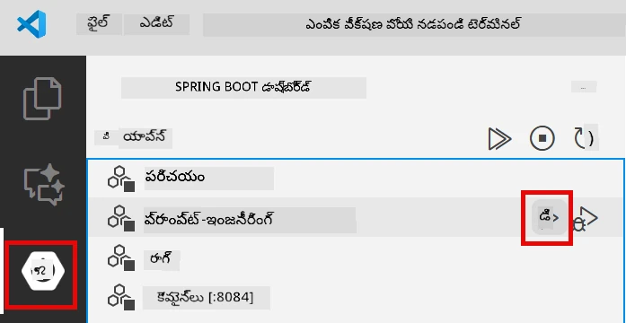

**ఎంపిక 2: షెల్ స్క్రిప్ట్‌లు ఉపయోగించడం**

అన్ని వెబ్ అప్లికేషన్లను (మాడ్యూల్స్ 01-04) ప్రారంభించండి:

**Bash:**
```bash
cd ..  # రూట్ డైరెక్టరీ నుండి
./start-all.sh
```

**PowerShell:**
```powershell
cd ..  # రూట్ డైరెక్టరీ నుండి
.\start-all.ps1
```

లేదా కేవలం ఈ మాడ్యూల్‌ను ప్రారంభించండి:

**Bash:**
```bash
cd 02-prompt-engineering
./start.sh
```

**PowerShell:**
```powershell
cd 02-prompt-engineering
.\start.ps1
```

రెండు స్క్రిప్ట్‌లు స్వయంచాలకంగా రూట్ `.env` ఫైల్ నుండి ఎన్విరాన్‌మెంట్ వేరియబుల్స్‌ను లోడ్ చేస్తాయి మరియు JARలు లేవంటే అవి నిర్మిస్తాయి.

> **గమనిక:** మీరు ప్రారంభించే ముందు అన్ని మాడ్యూల్స్‌ను మాన్యువల్‌గా నిర్మించాలనుకుంటే:
>
> **Bash:**
> ```bash
> cd ..  # Go to root directory
> mvn clean package -DskipTests
> ```
>
> **PowerShell:**
> ```powershell
> cd ..  # Go to root directory
> mvn clean package -DskipTests
> ```

మీ బ్రౌజర్‌లో http://localhost:8083 తెరవండి.

**ఆపడానికి:**

**Bash:**
```bash
./stop.sh  # ఈ మాడ్యూల్ మాత్రమే
# లేదా
cd .. && ./stop-all.sh  # అన్ని మాడ్యూల్స్
```

**PowerShell:**
```powershell
.\stop.ps1  # ఈ మాడ్యూల్ మాత్రమే
# లేదా
cd ..; .\stop-all.ps1  # అన్ని మాడ్యూల్స్
```

## అప్లికేషన్ స్క్రీన్‌షాట్లు

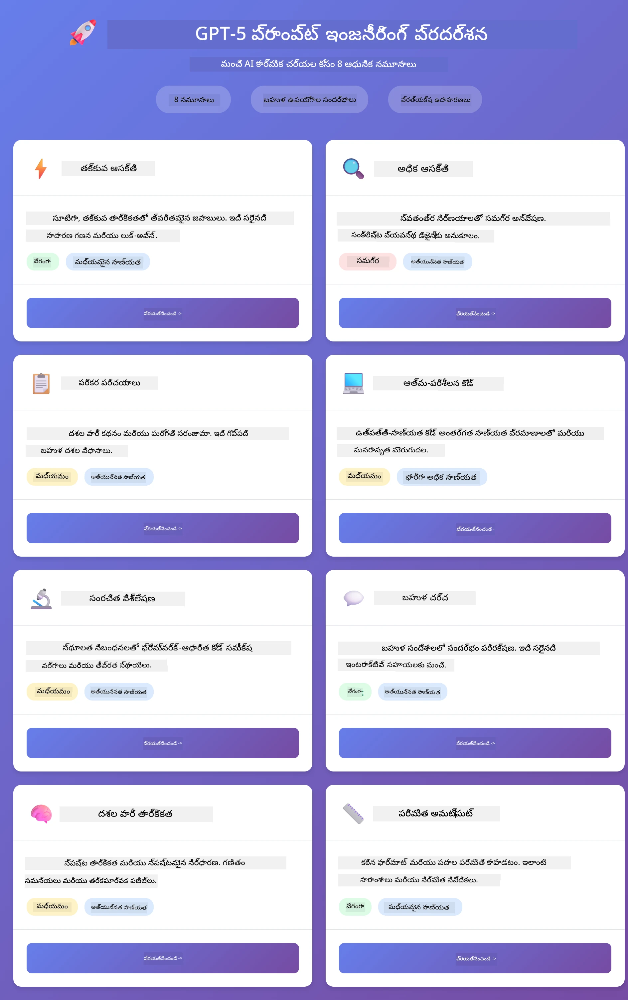

*అన్ని 8 ప్రాంప్ట్ ఇంజనీరింగ్ నమూనాలు వాటి లక్షణాలు మరియు ఉపయోగ సందర్భాలతో ప్రధాన డాష్‌బోర్డ్‌లో చూపబడుతున్నాయి*

## నమూనాలను అన్వేషించడం

వెబ్ ఇంటర్‌ఫేస్ వివిధ ప్రాంప్టింగ్ వ్యూహాలతో ప్రయోగించడానికి అనుమతిస్తుంది. ప్రతి నమూనా వేర్వేరు సమస్యలను పరిష్కరిస్తుంది - వాటిని ప్రయత్నించి ఏ దృష్టికోణం ఎప్పుడు మెరుగ్గా పనిచేస్తుందో చూడండి.

### తక్కువ vs ఎక్కువ ఉత్సాహం

"200 యొక్క 15% ఎంత?" వంటి సులభమైన ప్రశ్నను తక్కువ ఉత్సాహంతో అడగండి. మీరు తక్షణం, నేరుగా సమాధానం పొందుతారు. ఇప్పుడు "హై-ట్రాఫిక్ API కోసం క్యాషింగ్ వ్యూహాన్ని డిజైన్ చేయండి" వంటి క్లిష్టమైన ప్రశ్నను ఎక్కువ ఉత్సాహంతో అడగండి. మోడల్ ఎలా మెల్లగా ఆలోచించి వివరమైన తర్కాన్ని అందిస్తుందో గమనించండి. అదే మోడల్, అదే ప్రశ్న నిర్మాణం - కానీ ప్రాంప్ట్ మోడల్ ఎంత ఆలోచించాలో చెబుతుంది.

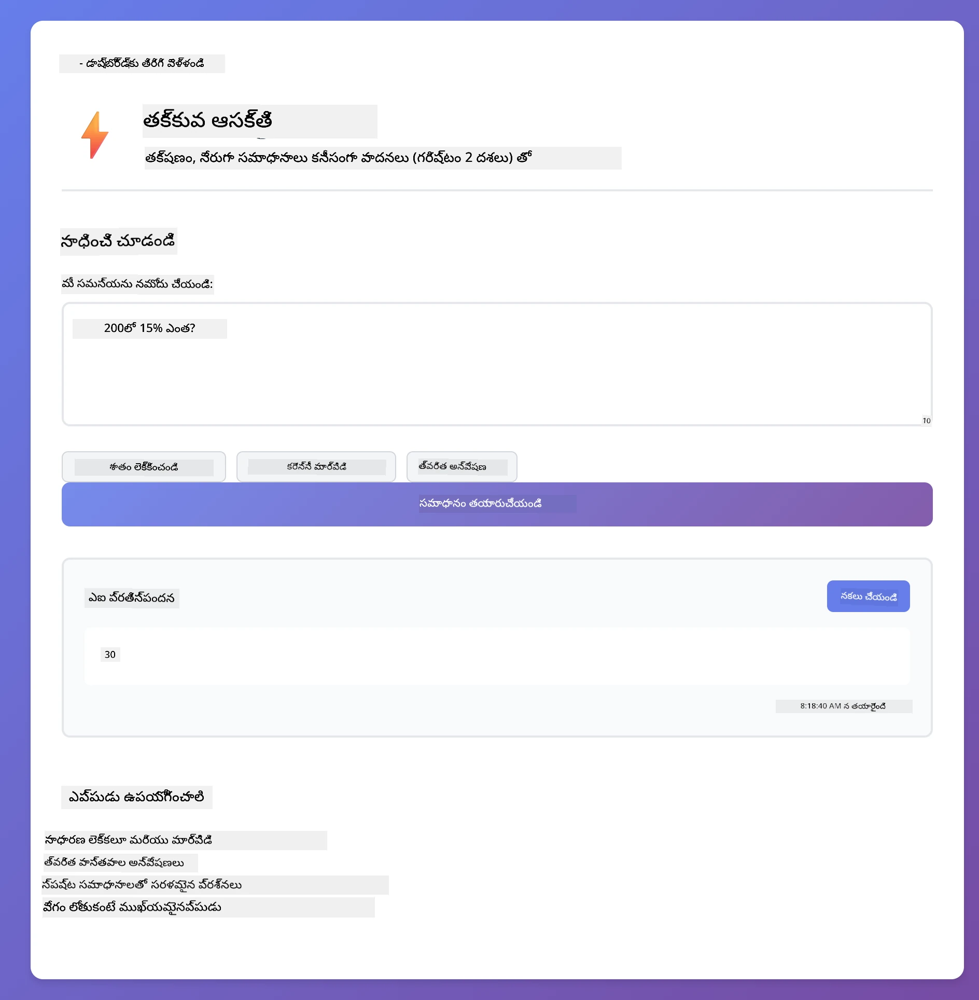
*కనిష్టమైన తర్కంతో త్వరిత గణన*

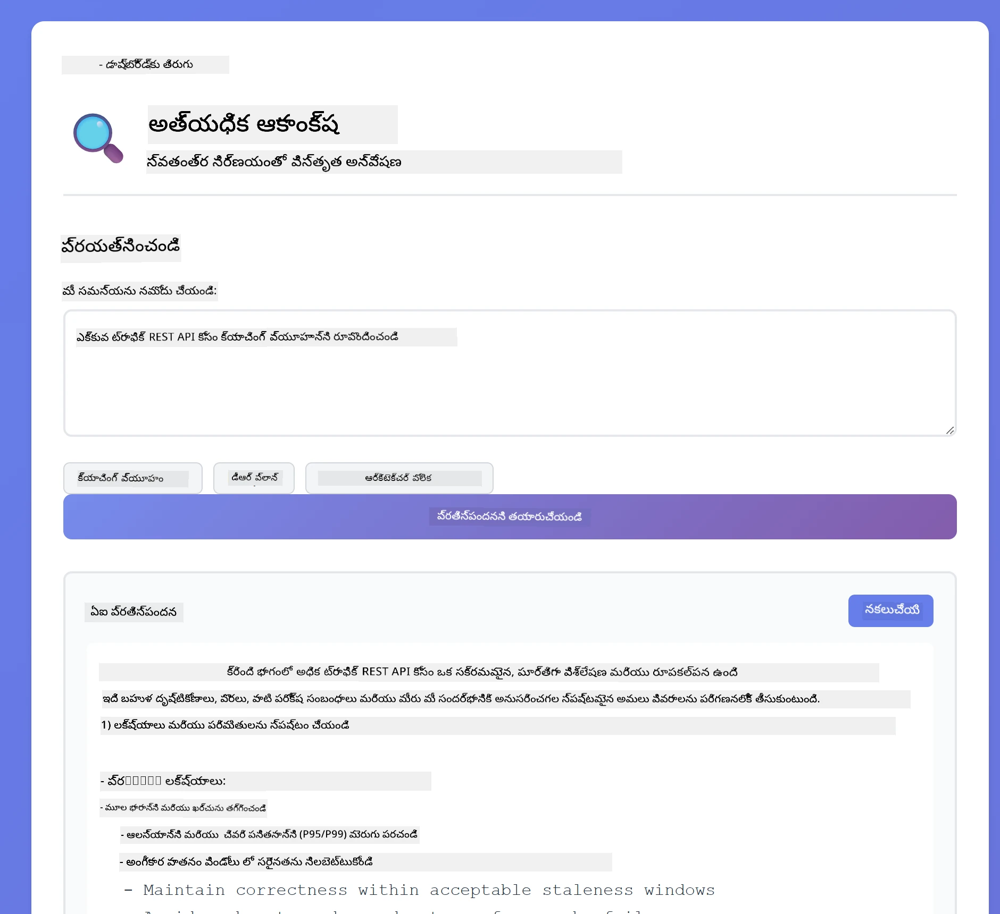

*సమగ్ర క్యాచింగ్ వ్యూహం (2.8MB)*

### టాస్క్ ఎగ్జిక్యూషన్ (టూల్ ప్రీాంబుల్స్)

బహుళ-దశ వర్క్‌ఫ్లోలు ముందస్తు ప్రణాళిక మరియు పురోగతి వివరణతో లాభపడతాయి. మోడల్ ఏమి చేయబోతుందో వివరించి, ప్రతి దశను వివరిస్తుంది, తరువాత ఫలితాలను సారాంశం చేస్తుంది.

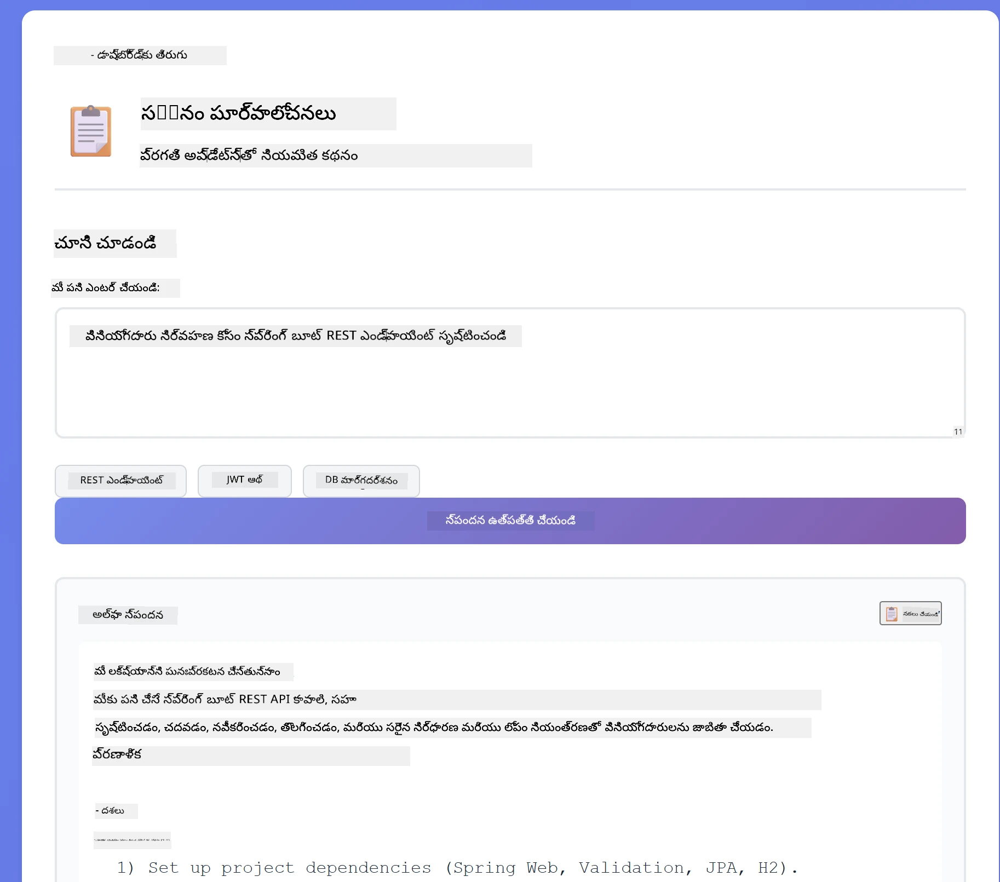

*దశల వారీ వివరణతో REST ఎండ్‌పాయింట్ సృష్టించడం (3.9MB)*

### స్వీయ-పరిశీలన కోడ్

"ఇమెయిల్ ధృవీకరణ సేవ సృష్టించండి" అని ప్రయత్నించండి. కేవలం కోడ్ ఉత్పత్తి చేసి ఆపకుండా, మోడల్ ఉత్పత్తి చేసి, నాణ్యత ప్రమాణాలతో మూల్యాంకనం చేసి, బలహీనతలను గుర్తించి, మెరుగుపరుస్తుంది. మీరు కోడ్ ఉత్పత్తి ప్రామాణికాలకు చేరేవరకు దాన్ని పునరావృతం చేస్తుంది.

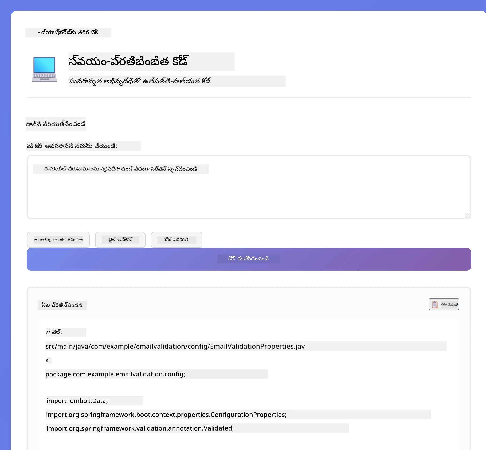

*పూర్తి ఇమెయిల్ ధృవీకరణ సేవ (5.2MB)*

### నిర్మిత విశ్లేషణ

కోడ్ సమీక్షలకు స్థిరమైన మూల్యాంకన ఫ్రేమ్‌వర్క్‌లు అవసరం. మోడల్ కోడ్‌ను స్థిరమైన వర్గాల (సరైనదైనదా, ఆచారాలు, పనితీరు, భద్రత) ఆధారంగా తీవ్రత స్థాయిలతో విశ్లేషిస్తుంది.

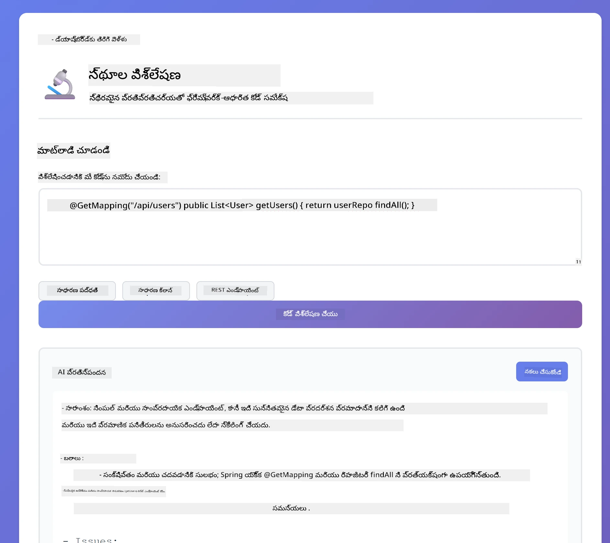

*ఫ్రేమ్‌వర్క్ ఆధారిత కోడ్ సమీక్ష*

### బహుళ-తిరుగుడు చాట్

"స్ప్రింగ్ బూట్ అంటే ఏమిటి?" అని అడిగి, వెంటనే "నాకు ఒక ఉదాహరణ చూపించు" అని అడగండి. మోడల్ మీ మొదటి ప్రశ్నను గుర్తుంచుకుని, స్ప్రింగ్ బూట్ ఉదాహరణను ప్రత్యేకంగా ఇస్తుంది. జ్ఞాపకం లేకపోతే, రెండవ ప్రశ్న చాలా అస్పష్టంగా ఉంటుంది.

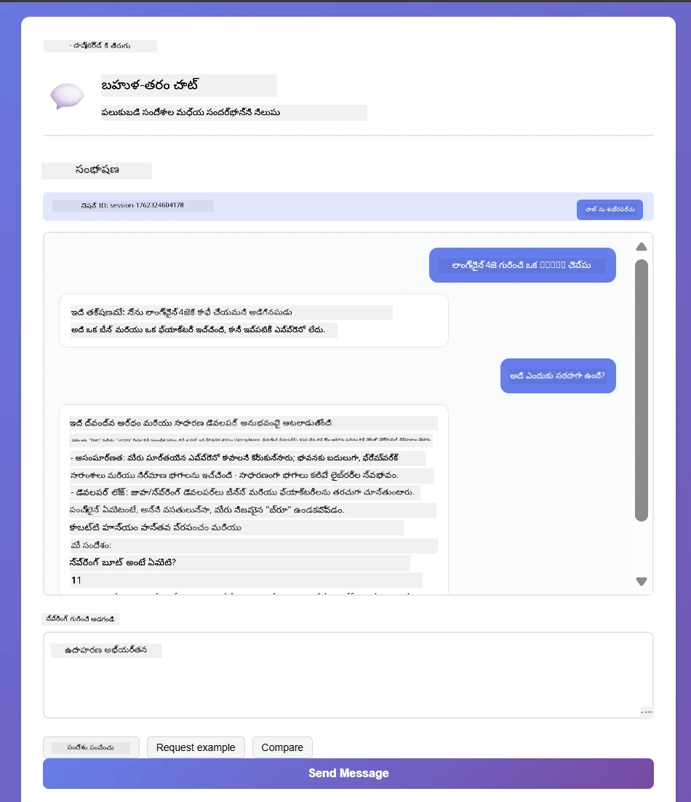

*ప్రశ్నల మధ్య సందర్భం నిలుపుదల*

### దశల వారీ తర్కం

గణిత సమస్యను ఎంచుకుని దాన్ని దశల వారీ తర్కంతో మరియు తక్కువ ఉత్సాహంతో ప్రయత్నించండి. తక్కువ ఉత్సాహం కేవలం సమాధానాన్ని ఇస్తుంది - వేగంగా కానీ అర్థం కాకుండా. దశల వారీ తర్కం ప్రతి గణన మరియు నిర్ణయాన్ని చూపిస్తుంది.

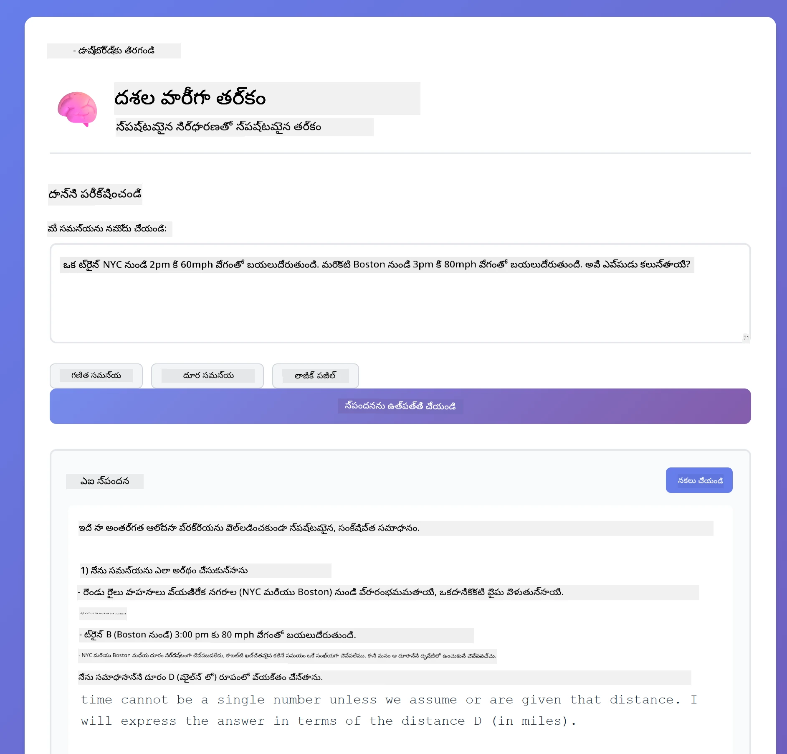

*స్పష్టమైన దశలతో గణిత సమస్య*

### పరిమిత అవుట్‌పుట్

మీకు నిర్దిష్ట ఫార్మాట్లు లేదా పదాల సంఖ్య అవసరమైనప్పుడు, ఈ నమూనా కఠినంగా పాటించడాన్ని నిర్ధారిస్తుంది. ఖచ్చితంగా 100 పదాల బుల్లెట్ పాయింట్ ఫార్మాట్‌లో సారాంశం ఉత్పత్తి చేయండి.


*ఫార్మాట్ నియంత్రణతో మెషీన్ లెర్నింగ్ సారాంశం*

## మీరు నిజంగా నేర్చుకుంటున్నది

**తర్క ప్రయత్నం ప్రతిదీ మార్చేస్తుంది**

GPT-5 మీ ప్రాంప్ట్‌ల ద్వారా గణనాత్మక ప్రయత్నాన్ని నియంత్రించడానికి అనుమతిస్తుంది. తక్కువ ప్రయత్నం అంటే తక్కువ అన్వేషణతో వేగవంతమైన ప్రతిస్పందనలు. ఎక్కువ ప్రయత్నం అంటే మోడల్ లోతుగా ఆలోచించడానికి సమయం తీసుకుంటుంది. మీరు పనుల సంక్లిష్టతకు అనుగుణంగా ప్రయత్నాన్ని సరిపోల్చడం నేర్చుకుంటున్నారు - సులభమైన ప్రశ్నలపై సమయం వృథా చేయకండి, కానీ సంక్లిష్ట నిర్ణయాలను కూడా తొందరపెట్టకండి.

**నిర్మాణం ప్రవర్తనను మార్గనిర్దేశం చేస్తుంది**

ప్రాంప్ట్‌లలో XML ట్యాగ్‌లు గమనించారా? అవి అలంకరణ కాదు. మోడల్స్ నిర్మిత సూచనలను స్వేచ్ఛాత్మక టెక్స్ట్ కంటే విశ్వసనీయంగా అనుసరిస్తాయి. మీరు బహుళ-దశ ప్రక్రియలు లేదా సంక్లిష్ట తర్కం అవసరమైనప్పుడు, నిర్మాణం మోడల్ ఎక్కడ ఉందో, తదుపరి ఏమి చేయాలో ట్రాక్ చేయడంలో సహాయపడుతుంది.

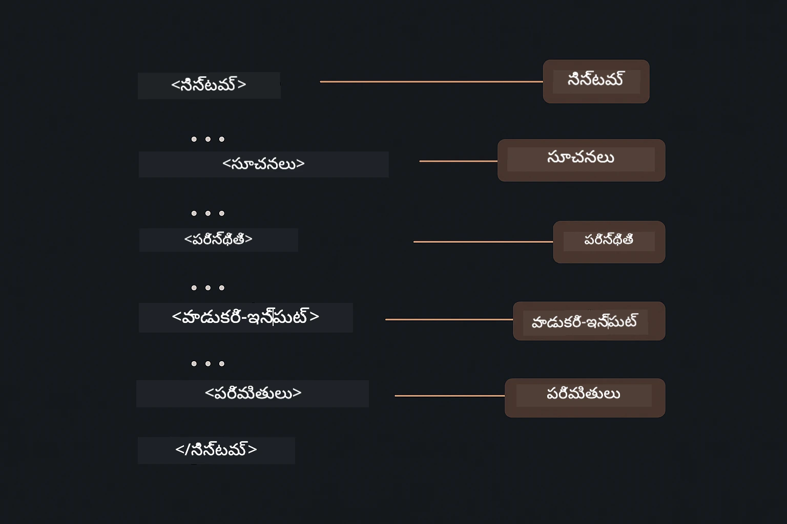

*స్పష్ట విభాగాలు మరియు XML-శైలి సంస్థతో బాగా నిర్మిత ప్రాంప్ట్ యొక్క నిర్మాణం*

**స్వీయ-మూల్యాంకనం ద్వారా నాణ్యత**

స్వీయ-పరిశీలన నమూనాలు నాణ్యత ప్రమాణాలను స్పష్టంగా చేయడం ద్వారా పనిచేస్తాయి. మోడల్ "సరైనదిగా చేస్తుంది" అని ఆశించకుండా, మీరు "సరైనది" అంటే ఏమిటో స్పష్టంగా చెబుతారు: సరైన తర్కం, లోపాల నిర్వహణ, పనితీరు, భద్రత. మోడల్ తన స్వంత అవుట్‌పుట్‌ను మూల్యాంకనం చేసి మెరుగుపరచగలదు. ఇది కోడ్ ఉత్పత్తిని లాటరీ నుండి ఒక ప్రక్రియగా మార్చుతుంది.

**సందర్భం పరిమితమైనది**

బహుళ-తిరుగుడు సంభాషణలు ప్రతి అభ్యర్థనతో సందేశ చరిత్రను చేర్చడం ద్వారా పనిచేస్తాయి. కానీ పరిమితి ఉంది - ప్రతి మోడల్‌కు గరిష్ట టోకెన్ సంఖ్య ఉంటుంది. సంభాషణలు పెరిగేకొద్దీ, మీరు సంబంధిత సందర్భాన్ని నిలుపుకోవడానికి వ్యూహాలు అవసరం అవుతాయి, ఆ గరిష్టాన్ని తాకకుండా. ఈ మాడ్యూల్ జ్ఞాపకం ఎలా పనిచేస్తుందో చూపిస్తుంది; తరువాత మీరు ఎప్పుడు సారాంశం చేయాలో, ఎప్పుడు మరచిపోవాలో, ఎప్పుడు తిరిగి తీసుకోవాలో నేర్చుకుంటారు.

## తదుపరి దశలు

**తదుపరి మాడ్యూల్:** [03-rag - RAG (Retrieval-Augmented Generation)](../03-rag/README.md)

---

**నావిగేషన్:** [← మునుపటి: మాడ్యూల్ 01 - పరిచయం](../01-introduction/README.md) | [ప్రధానానికి తిరిగి](../README.md) | [తదుపరి: మాడ్యూల్ 03 - RAG →](../03-rag/README.md)

---

<!-- CO-OP TRANSLATOR DISCLAIMER START -->
**అస్పష్టత**:  
ఈ పత్రాన్ని AI అనువాద సేవ [Co-op Translator](https://github.com/Azure/co-op-translator) ఉపయోగించి అనువదించబడింది. మేము ఖచ్చితత్వానికి ప్రయత్నించినప్పటికీ, ఆటోమేటెడ్ అనువాదాల్లో పొరపాట్లు లేదా తప్పిదాలు ఉండవచ్చు. మూల పత్రం దాని స్వదేశీ భాషలో అధికారిక మూలంగా పరిగణించాలి. ముఖ్యమైన సమాచారానికి, ప్రొఫెషనల్ మానవ అనువాదం సిఫార్సు చేయబడుతుంది. ఈ అనువాదం వాడకం వల్ల కలిగే ఏవైనా అపార్థాలు లేదా తప్పుదారుల బాధ్యత మేము తీసుకోము.
<!-- CO-OP TRANSLATOR DISCLAIMER END -->