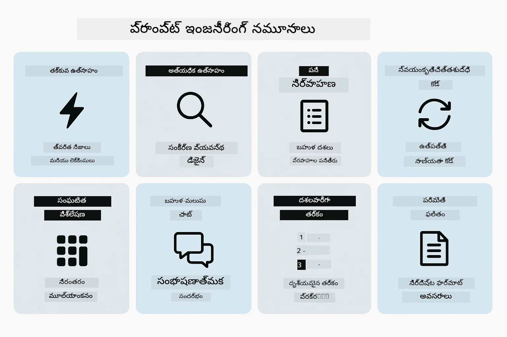
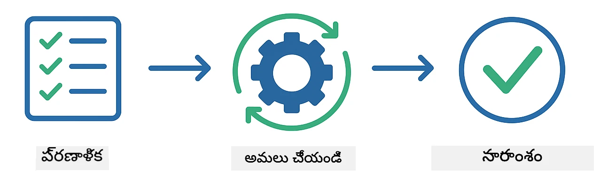
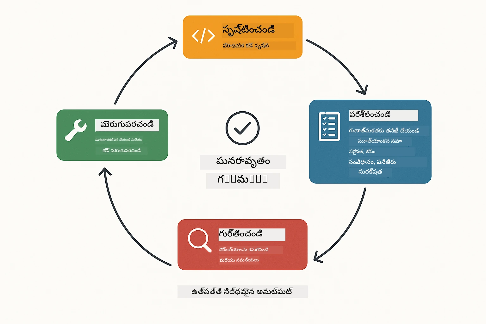
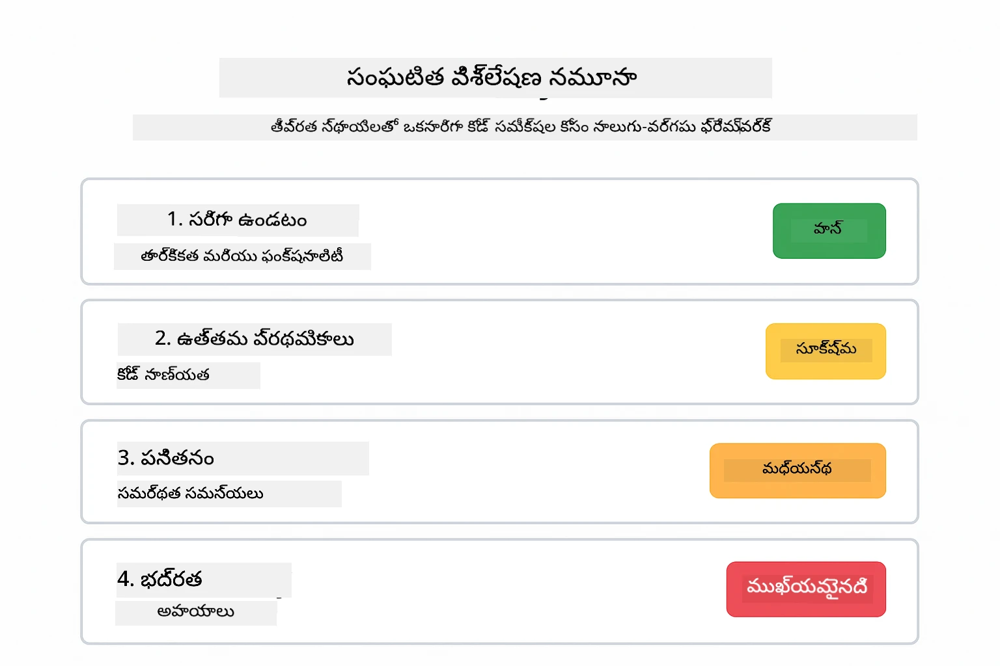
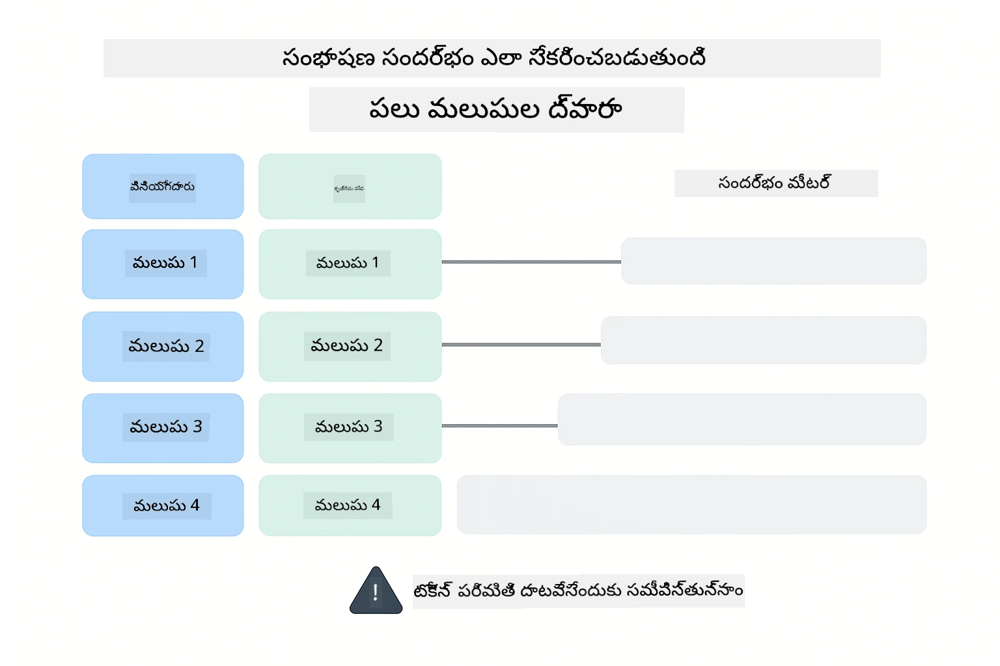
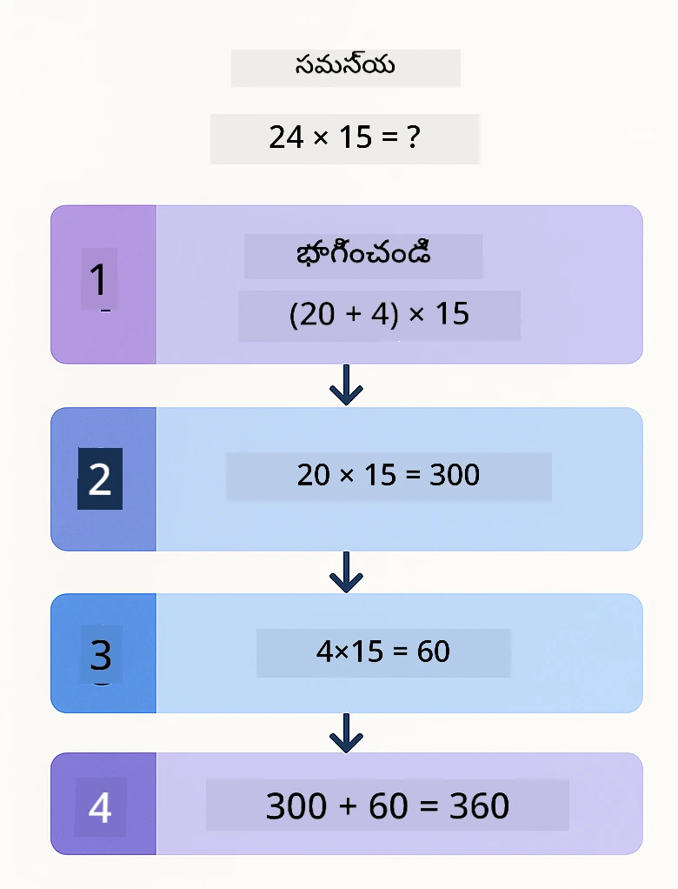
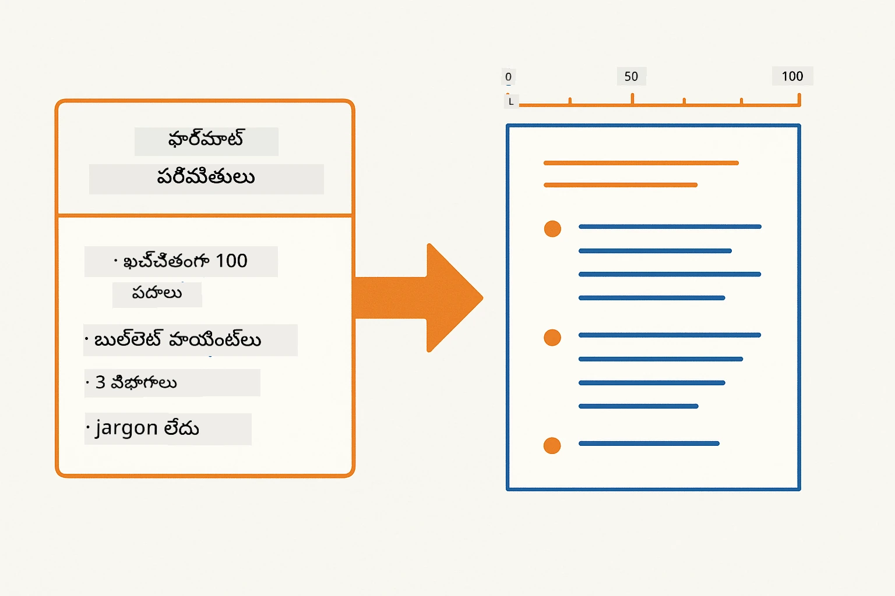
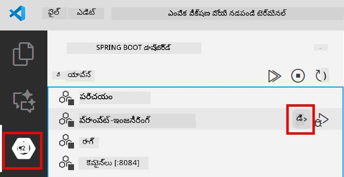
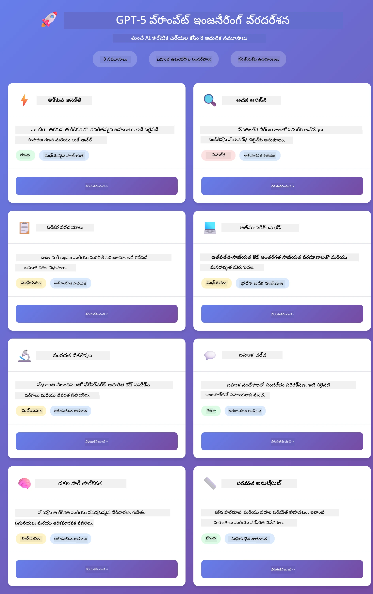
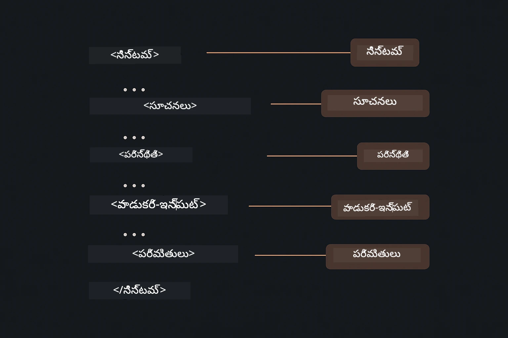

# Module 02: GPT-5.2తో ప్రాంప్ట్ ఇంజనీరింగ్

## Table of Contents

- [వీడియో వాక్తర్లూ](#video-walkthrough)
- [మీరు నేర్చుకునే అంశాలు](#what-youll-learn)
- [ముందస్తు పరిజ్ఞానం](#prerequisites)
- [ప్రాంప్ట్ ఇంజనీరింగ్ అర్థం చేసుకోవడం](#understanding-prompt-engineering)
- [ప్రాంప్ట్ ఇంజనీరింగ్ మూలాలు](#prompt-engineering-fundamentals)
  - [జీరో-షాట్ ప్రాంప్టింగ్](#zero-shot-prompting)
  - [ఫ్యూ-షాట్ ప్రాంప్టింగ్](#few-shot-prompting)
  - [చైన్ ఆఫ్ థాట్](#chain-of-thought)
  - [రోల్-బేస్డ్ ప్రాంప్టింగ్](#role-based-prompting)
  - [ప్రాంప్ట్ టేమ్ప్లేట్లు](#prompt-templates)
- [అభివృద్ధి చెందిన నమూనాలు](#advanced-patterns)
- [యాప్లికేషన్ నడిపించండి](#అప్లికేషన్‌ను-అమలు-చేయండి)
- [యాప్లికేషన్ స్క్రీన్‌షాట్లు](#అప్లికేషన్-స్క్రీన్‌షాట్లు)
- [నమూనాలు అన్వేషణ](#నమూనాలను-అన్వేషించడం)
  - [తక్కువ vs ఎక్కువ ఉత్సాహం](#తక్కువ-మరియు-ఎక్కువ-ఈగర్నెస్)
  - [టాస్క్ ఎక్జిక్యూషన్ (టూల్ ప్రీాంబుల్స్)](#టాస్క్-ఎగ్జిక్యూషన్-టూల్-ప్రీమేబుల్స్)
  - [స్వయం-పరిశీలన కోడ్](#స్వయం-ప్రతిబింబించే-కోడ్)
  - [సంఘటిత విశ్లేషణ](#నిర్మిత-విశ్లేషణ)
  - [బహుళ-తురన్ చాట్](#బహుళ-తిరుగు-చాట్)
  - [దశ-దశ వ్యాసంగం](#దశలు-వారీ-తార్కికత)
  - [పరిమిత అవుట్పుట్](#పరిమిత-అవుట్‌పుట్)
- [మీరు నిజంగా ఏమి నేర్చుకుంటున్నారు](#మీరు-నిజంగా-ఏమి-నేర్చుకుంటున్నారు)
- [తర్వాతి దశలు](#తదుపరి-అడుగులు)

## Video Walkthrough

ఈ మాడ్యూల్‌ను ఎలా ప్రారంభించాలో వివరిస్తున్న ప్రత్యక్ష సెషన్‌ను చూసుకోండి:

<a href="https://www.youtube.com/live/PJ6aBaE6bog?si=LDshyBrTRodP-wke"></a>

## What You'll Learn

ఈ క్రింది చిత్రంలో మీరు ఈ మాడ్యూల్లో అభివృద్ధి చేసుకునే ముఖ్యమైన అంశాలు మరియు నైపుణ్యాల సమీక్ష ఉంది — ప్రాంప్ట్ మెరుగుదల సాంకేతికతలతో పాటు మీరు అనుసరించే దశల వారీ వర్క్‌ఫ్లో.


మునుపటి మాడ్యూల్లో మీరు మెమరీ ఎలా Azure OpenAI తో సంభాషణ కృత్రిమ మేధస్సు కోసం ఉపయోగపడుతుందో చూశారు. ఇప్పుడు మనం ప్రశ్నలు ఎలా అడుగుతామో — ఆ ప్రాంప్ట్‌లు ఇక్కడి ముఖ్యాంశం — Azure OpenAI యొక్క GPT-5.2 ని ఉపయోగించి. మీరు మీ ప్రాంప్ట్‌లను ఎలా నిర్మిస్తారో, అందులో మీకు వచ్చే సమాధానాల నాణ్యతపై ద్రుష్టిగా ప్రభావం చూపుతుంది. మొదట మూల ప్రాంప్టింగ్ సూత్రాలు సమీక్షించి, తర్వాత GPT-5.2 సామర్థ్యాలను పూర్తిగా ఉపయోగించే ఎనిమిది అభివృద్ధి చెందిన నమూనాలతో ముందుకు పోతాము.

మనం GPT-5.2 ను ఎందుకు ఉపయోగిస్తున్నాము అంటే ఇది విమర్శాత్మక నియంత్రణని పరిచయం చేస్తుంది - మోడల్ ఎన్ని ఆలోచనలు చేయాలో మీరు చెప్పగలుగుతారు. ఇది వివిధ ప్రాంప్టింగ్ వ్యూహాలను స్పష్టంగా చేస్తుంది మరియు ఏ దృష్టికోణాన్ని ఎప్పుడు ఉపయోగించాలో అర్థం పొందటంలో సహాయపడుతుంది.

## Prerequisites

- Module 01 పూర్తి (Azure OpenAI వనరులు అమలు చేయబడినవి)
- రూట్ డైరెక్టరీలో `.env` ఫైల్ అందులో Azure సర్టిఫికెట్లు (Module 01లో `azd up` ద్వారా సృష్టించబడింది)

> **గమనిక:** మీరు Module 01 పూర్తి చేయకపోతే, ముందుగా ఆ సెట్ అప్ సూచనలను అనుసరించండి.

## Understanding Prompt Engineering

మూలంగా, ప్రాంప్ట్ ఇంజనీరింగ్ అనేది సాందర్భిక మరియు ఖచ్చితమైన సూచనల మధ్య తేడా, క్రింద చూపిన పోలిక దీన్ని స్పష్టం చేస్తుంది.


ప్రాంప్ట్ ఇంజనీరింగ్ అనేది మీరు కోరుకున్న ఫలితాలు నిరంతరం అందిచే విధంగా ఇన్‌పుట్ టెక్స్ట్‌ను డిజైన్ చేయటం. ఇది కేవలం ప్రశ్నలు అడగటం మాత్రమే కాదు - మోడల్ మీరు ఏమి కోరుతున్నారో మరియు ఎలా అందించాలో ఖచ్చితంగా అర్థం చేసుకునే విధంగా అభ్యర్థనలను నిర్మించడం గురించే.

ఇందువల్ల మీరు ఒక సహోద్యోగి కి సూచనలు ఇస్తున్నట్లు ఆలోచించండి. "బగ్ సరి చేసు" అనేది అస్పష్టమైనది. "UserService.java లో 45వ లైన్ లో ఉన్న మాాస్యం చూపు తప్పు ని null చెక్ ను జోడించి సరి చూసి" అనడం స్పష్టమైనది. భాషా మోడళ్లు కూడా ఇదే విధంగా పనిచేస్తాయి - ఖచ్చితత్వం మరియు నిర్మాణం ముఖ్యం.

క్రింద ఉన్న చిత్రం LangChain4j ఈ చిత్రంలో ఎక్కడ సరిపోతుందో చూపిస్తుంది —మీ ప్రాంప్ట్ నమూనాలను SystemMessage మరియు UserMessage నిర్మాణ بلاక్ల ద్వారా మోడల్‌కు అనుసంధానించడం.


LangChain4j మౌలిక సదుపాయాలు అందిస్తుంది — మోడల్ కనెక్షన్లు, మెమరీ, మరియు సందేశ రకాలతో — కాగా ప్రాంప్ట్ నమూనాలు ఆ సదుపాయాల ద్వారా మీరు పంపించే జాగ్రత్తగా నిర్మించిన టెక్స్ట్ మాత్రమే. ప్రధాన నిర్మాణ బ్లాకులు `SystemMessage` (AI యొక్క ప్రవర్తన మరియు పాత్రను సెట్ చేస్తుంది) మరియు `UserMessage` (మీ అసలు అభ్యర్థనను తరలిస్తుంది).

## Prompt Engineering Fundamentals

క్రింద చూపిన ఐదు ప్రధాన సాంకేతికతలు సమర్థవంతమైన ప్రాంప్ట్ ఇంజనీరింగ్ యొక్క పునాది. ఒక్కొక్కటి భాషా మోడళ్లతో మీరు ఎలా కమ్యూనికేట్ చేస్తారో విడిగా చర్చిస్తుంది.


ఈ మాడ్యూల్లోని అభివృద్ధి చెందిన నమూనాలు ప్రవేశానికి ముందు, ఐదు మూల ప్రాంప్టింగ్ సాంకేతికతలను సమీక్షిద్దాం. ఇవి ప్రతి ప్రాంప్ట్ ఇంజనీర్ కు తెలుసుకోవలసిన నిర్మాణ బ్లాకులు.

### Zero-Shot Prompting

మొత్తానికి సులభమైన పద్ధతి: ఉదాహరణలు లేకుండా మోడల్ కు నేరుగా ఆదేశం ఇవ్వడం. మోడల్ పూర్తిగా తన శిక్షణతీ మీద ఆధారపడి పని చేస్తుంది. ఇది స్పష్టమైన ప్రవర్తనా మొత్తాలతో సరళమైన అభ్యర్థనలకు బాగా పనిచేస్తుంది.


*ఉదాహరణలు లేకుండా నేరుగా ఆదేశం — మోడల్ ఆదేశం నుండి పనిచేసింది భావిస్తుంది*

```java
String prompt = "Classify this sentiment: 'I absolutely loved the movie!'";
String response = model.chat(prompt);
// ప్రతిస్పందన: "ధనాత్మక"
```

**ఎప్పుడు ఉపయోగించాలి:** సులభ వర్గీకరణలు, నేరుగా అడిగే ప్రశ్నలు, అనువాదాలు లేదా అదనపు మార్గనిర్దేశం అవసరం లేని పనులు.

### Few-Shot Prompting

మోడల్ అనుసరించాలనుకున్న నమూనా చూపించే ఉదాహరణలు ఇవ్వండి. మోడల్ మీ ఇచ్చిన ఉదాహరణల నుండి కోరుకున్న ఇన్‌పుట్-ఆউట్పుట్ ఫార్మాట్ నేర్చుకొని, కొత్త ఇన్‌పుట్స్ లోకి దాన్ని వర్తింపజేస్తుంది. ఇది కోరుకున్న ఫార్మాట్ లేదా ప్రవర్తన స్పష్టంగా కనిపించని పనులలో సంయతత్వాన్ని గణనీయంగా మెరుగుపరుస్తుంది.


*ఉదాహరణల నుంచి నేర్చుకోవడం — మోడల్ నమూనా గుర్తించి కొత్త ఇన్‌పుట్లకు వర్తింపచేస్తుంది*

```java
String prompt = """
    Classify the sentiment as positive, negative, or neutral.
    
    Examples:
    Text: "This product exceeded my expectations!" → Positive
    Text: "It's okay, nothing special." → Neutral
    Text: "Waste of money, very disappointed." → Negative
    
    Now classify this:
    Text: "Best purchase I've made all year!"
    """;
String response = model.chat(prompt);
```

**ఎప్పుడు ఉపయోగించాలి:** కస్టమ్ వర్గీకరణలు, స్థిరమైన ఆకృతీకరణ, డొమైన్ ప్రత్యేక పనులు లేదా జీరో-షాట్ ఫలితాలు అసంశ్లేష్యమైనప్పుడు.

### Chain of Thought

మోడల్ స్టెప్ బై స్టెప్ తన వివరణ చూపించమని అడుగు. సమాధానానికి సూటిగా దూకినప్పుడే కాకుండా, సమస్యని విడదీసి ప్రతి భాగాన్ని స్పష్టంగా పని చేస్తుంది. ఇది గణితం, తార్కికత, మరియు బహుళ దశల నిర్ణయ పథకాలలో ఖచ్చితత్వం మెరుగుపరుస్తుంది.


*దశల వారీ వివరణ — క్లిష్టమైన సమస్యలను స్పష్టమైన తార్కిక దశలుగా విభజించడం*

```java
String prompt = """
    Problem: A store has 15 apples. They sell 8 apples and then 
    receive a shipment of 12 more apples. How many apples do they have now?
    
    Let's solve this step-by-step:
    """;
String response = model.chat(prompt);
// నమూనా చూపిస్తుంది: 15 - 8 = 7, ఆపాహ్మ్మగా 7 + 12 = 19 సేపుళ్ళు
```

**ఎప్పుడు ఉపయోగించాలి:** గణిత సమస్యలు, తార్కిక పజిల్స్, డీబగ్గింగ్ లేదా క్లుప్తంగా వివరణ అవసరమవుతున్న ఇతర పనులు.

### Role-Based Prompting

మీ ప్రశ్న అడగేముందు AI కి ఒక పాత్ర లేదా వ్యక్తిత్వం సెట్ చేయండి. ఇది సమాధానం యొక్క శైలి, లోతు, మరియు ఫోకస్ మార్చుతుంది. "సాఫ్ట్వేర్ ఆర్కిటెక్ట్" "జూనియర్ డెవలపర్" లేదా "సెక్యూరిటీ ఆడిటర్"కి ఇస్తున్న సలహాలతో వేరుగా ఉంటుంది.


*సందర్భం మరియు వ్యక్తిత్వం సెట్ చేయడం — ఒకే ప్రశ్న పాత్ర ఆధారంగా వేర్వేరు సమాధానాలు వస్తాయి*

```java
String prompt = """
    You are an experienced software architect reviewing code.
    Provide a brief code review for this function:
    
    def calculate_total(items):
        total = 0
        for item in items:
            total = total + item['price']
        return total
    """;
String response = model.chat(prompt);
```

**ఎప్పుడు ఉపయోగించాలి:** కోడ్ రివ్యూలు, ట్యూటరింగ్, డొమైన్-ప్రత్యేక విశ్లేషణ, లేదా నిర్దిష్ట నైపుణ్య స్థాయికి లేదా దృష్టికోణానికి అనుగుణంగా సమాధానాలు కావలసినప్పుడు.

### Prompt Templates

వేరియబుల్ ప్లేస్‌హోల్డర్లతో మళ్లీ ఉపయోగించదగిన ప్రాంప్ట్‌లను సృష్టించండి. ప్రతిసారీ కొత్త ప్రాంప్ట్ రాయడం కాకుండా, ఒక సారి టేమ్ప్లేట్ ని నిర్వచించి వివిధ విలువలు నింపండి. LangChain4j `PromptTemplate` క్లాస్ `{{variable}}` సింట్యాక్స్ తో ఇది సులభం చేస్తుంది.


*వేరియబుల్ ప్లేస్‌హోల్డర్లతో మళ్లి ఉపయోగించే ప్రాంప్ట్‌లు — ఒక టేమ్ప్లేట్, అనేక ఉపయోగాలు*

```java
PromptTemplate template = PromptTemplate.from(
    "What's the best time to visit {{destination}} for {{activity}}?"
);

Prompt prompt = template.apply(Map.of(
    "destination", "Paris",
    "activity", "sightseeing"
));

String response = model.chat(prompt.text());
```

**ఎప్పుడు ఉపయోగించాలి:** విభిన్న ఇన్‌పుట్‌లతో పునరావృత ప్రశ్నలు, బ్యాచ్ ప్రాసెసింగ్, తిరిగి ఉపయోగించే AI వర్క్‌ఫ్లోలు, లేదా ప్రాంప్ట్ నిర్మాణం స్థిరంగా ఉండి డేటా మాత్రమే మారే పరిస్థితులు.

---

ఈ ఐదు మూలాలు ఎక్కువ ప్రాంప్టింగ్ పనులకు ఒక బలమైన ప్యాకేజీ ఇస్తాయి. ఈ మాడ్యూల్ వారి పైన ఆధారపడి ఉంది **ఎనిమిది అభివృద్ధి చెందిన నమూనాలు** GPT-5.2 యొక్క విమర్శాత్మక నియంత్రణ, స్వయం-మూల్యాంకన, మరియు నిర్మిత అవుట్పుట్ సామర్థ్యాలను ఉపయోగిస్తాయి.

## Advanced Patterns

మూలాలు పూర్తయిన తరువాత, ఈ మాడ్యూల్ ప్రత్యేకతను ఇచ్చే ఎనిమిది అభివృద్ధి చెందిన నమూనాలకు చేరుకుందాం. అన్ని సమస్యలు ఒకే విధముగా ఉండవు. కొన్ని ప్రశ్నలకు తక్షణ సమాధానం అవసరం, మరికొన్ని లోతైన ఆలోచనకు. కొన్ని స్పష్టమైన విమర్శన అవసరం, మరికొన్ని ఫలితాలకే. కింది ప్రతి నమూనా వేర్వేరు సందర్భాలకు అనువైనదిగా ఆప్టిమైజ్ చేయబడింది — మరియు GPT-5.2 యొక్క విమర్శాత్మక నియంత్రణ ఈ భేదాలను మరింత స్పష్టంగా చేస్తుంది.



* ఎనిమిది ప్రాంప్ట్ ఇంజనీరింగ్ నమూనాల సమీక్ష మరియు వాటి వినియోగ సందర్భాలు *

GPT-5.2 ఈ నమూనాలకు మరో మలుపు ఇస్తుంది: *విమర్శా నియంత్రణ*. క్రింద స్లైడర్ మోడల్ ఎంత ఆలోచించాలో మీరు సర్దుబాటు చేయగలుగుతారు — తక్షణ, నేరుగా సమాధానాల నుంచి లోతైన, సమగ్ర విశ్లేషణ వరకు.


*GPT-5.2 విమర్శా నియంత్రణ ద్వారా మీరు మోడల్ ఎంత ఆలోచించాలో నిర్ణయించవచ్చు — వేగవంతమైన నేరుగా సమాధానాలు నుంచి లోతైన విశ్లేషణ వరకు*

**తక్కువ ఉత్సాహం (తక్షణ & దృష్టిసారించబడిన)** - సులభ ప్రశ్నలకు వేగవంతమైన, నేరుగా సమాధానాలు కావాలంటే. మోడల్ తక్కువ విమర్శ చేస్తుంది - గరిష్టం 2 దశలు. గణనాలు, లుకప్స్ లేదా సరళమైన ప్రశ్నల కోసం ఉపయోగించండి.

```java
String prompt = """
    <context_gathering>
    - Search depth: very low
    - Bias strongly towards providing a correct answer as quickly as possible
    - Usually, this means an absolute maximum of 2 reasoning steps
    - If you think you need more time, state what you know and what's uncertain
    </context_gathering>
    
    Problem: What is 15% of 200?
    
    Provide your answer:
    """;

String response = chatModel.chat(prompt);
```

> 💡 **GitHub Copilot తో ఎక్స్‌ప్లోర్ చేయండి:** [`Gpt5PromptService.java`](../../../02-prompt-engineering/src/main/java/com/example/langchain4j/prompts/service/Gpt5PromptService.java) తెరవండి మరియు అడగండి:
> - "తక్కువ ఉత్సాహం మరియు ఎక్కువ ఉత్సాహం ప్రాంప్టింగ్ నమూనాల మధ్య తేడా ఏమిటి?"
> - "ప్రమ్ప్ట్‌లలో XML ట్యాగ్లు AI ప్రతిస్పందన నిర్మాణానికి ఎలా సహాయపడతాయి?"
> - "ఎప్పుడు స్వీయ-పరిశీలన నమూనాలు ఉపయోగించాలి, ఎప్పుడు నేరుగా ఆదేశించాలి?"

**అధిక ఉత్సాహం (లోతైన & సమగ్ర)** - క్లిష్టమైన సమస్యలకు సమగ్ర విశ్లేషణ కావాలి. మోడల్ సమగ్రంగా పరిశీలించి వివరాలైన విమర్శను చూపిస్తుంది. సిస్టమ్ డిజైన్, ఆర్కిటెక్చర్ నిర్ణయాలు, లేదా క్లిష్ట పరిశోధనలకు ఉపయోగించండి.

```java
String prompt = """
    Analyze this problem thoroughly and provide a comprehensive solution.
    Consider multiple approaches, trade-offs, and important details.
    Show your analysis and reasoning in your response.
    
    Problem: Design a caching strategy for a high-traffic REST API.
    """;

String response = chatModel.chat(prompt);
```

**టాస్క్ ఎక్జిక్యూషన్ (దశల వారీ ప్రగతి)** - బహుళ దశల వర్క్‌ఫ్లోలకు. మోడల్ ముందుగా ఒక ప్రణాళిక ఇస్తుంది, పని చేసే ప్రతీ దశను వివరించి వ్యాఖ్యానిస్తుంది, చివరలో సారాంశం ఇస్తుంది. మైగ్రేషన్లు, అమలులు, లేదా ఏదైనా బహుళ దశల ప్రక్రియకు ఉపయోగించండి.

```java
String prompt = """
    <task_execution>
    1. First, briefly restate the user's goal in a friendly way
    
    2. Create a step-by-step plan:
       - List all steps needed
       - Identify potential challenges
       - Outline success criteria
    
    3. Execute each step:
       - Narrate what you're doing
       - Show progress clearly
       - Handle any issues that arise
    
    4. Summarize:
       - What was completed
       - Any important notes
       - Next steps if applicable
    </task_execution>
    
    <tool_preambles>
    - Always begin by rephrasing the user's goal clearly
    - Outline your plan before executing
    - Narrate each step as you go
    - Finish with a distinct summary
    </tool_preambles>
    
    Task: Create a REST endpoint for user registration
    
    Begin execution:
    """;

String response = chatModel.chat(prompt);
```

చైన్-ఆఫ్-థాట్ ప్రాంప్టింగ్ స్పష్టంగా మోడల్ తన విమర్శా ప్రక్రియను చూపించమని అడుగుతుంది, క్లిష్ట పనులలో ఖచ్చితత్వాన్నిస్తుంది మెరుగుపరుస్తుంది. దశల వారీ బ్రేక్‌డౌన్ మనుషులు మరియు AI కి తార్కికత అర్థం చేసుకోవడానికి సహాయపడుతుంది.

> **🤖 GitHub Copilot చాట్‌తో ప్రయత్నించండి:** ఈ నమూనా గురించి అడగండి:
> - "నా పొడిగి గడిచే ఆపరేషన్ల కోసం టాస్క్ ఎక్జిక్యూషన్ నమూనాను ఎలా మార్చగలను?"
> - "నిర్మాణ యాప్లికేషన్లలో టూల్ ప్రాంబుల్స్ నిర్మాణానికి ఉత్తమ పద్ధతులు ఏమిటి?"
> - "UI లో మధ్యంతర ప్రగతి అప్‌డేట్లను ఎలా క్యాచ్చి ప్రదర్శించగలను?"

క్రింద చిత్రం ఈ ప్రణాళిక → అమలు → సారాంశం వర్క్‌ఫ్లోని చూపిస్తుంది.



* బహుళ దశల పనుల కోసం ప్రణాళిక → అమలు → సారాంశం వర్క్‌ఫ్లో *

**స్వయం-పరిశీలన కోడ్** - ప్రొడక్షన్-నాణ్యత కోడ్ సృష్టికి. మోడల్ ప్రొడక్షన్ ప్రమాణాలను అనుసరించి తప్పిద నిర్వహణతో కోడ్ సృష్టిస్తుంది. కొత్త ఫీచర్లు లేదా సర్వీసులు నిర్మించేటప్పుడు ఉపయోగించండి.

```java
String prompt = """
    Generate Java code with production-quality standards: Create an email validation service
    Keep it simple and include basic error handling.
    """;

String response = chatModel.chat(prompt);
```

క్రింద చిత్రంలో ఈ పునరావృత మెరుగుదల లూప్ చూపించినది — సృష్టించు, అంచనా వేయి, లోపాలను గుర్తించు, మెరుగుపరుచు, మళ్లీ పునరావృతం చేయు.



*పునరావృత మెరుగుదల లూప్ - సృష్టించు, అంచనా వేసి, లోపాలు గుర్తించి, మెరుగుపరుచు, పునరావృతి*

**సంఘటిత విశ్లేషణ** - స్థిర విశ్లేషణ కోసం. మోడల్ కోడ్ ని స్థిరమైన ఫ్రేమ్‌వర్క్ (ఖచ్చితత్వం, ఆచారాలు, పనితీరు, భద్రత, నిర్వహణ) ఉపయోగించి సమీక్షిస్తుంది. కోడ్ రివ్యూలు లేదా నాణ్యత మూల్యాంకనాలకు ఉపయోగించండి.

```java
String prompt = """
    <analysis_framework>
    You are an expert code reviewer. Analyze the code for:
    
    1. Correctness
       - Does it work as intended?
       - Are there logical errors?
    
    2. Best Practices
       - Follows language conventions?
       - Appropriate design patterns?
    
    3. Performance
       - Any inefficiencies?
       - Scalability concerns?
    
    4. Security
       - Potential vulnerabilities?
       - Input validation?
    
    5. Maintainability
       - Code clarity?
       - Documentation?
    
    <output_format>
    Provide your analysis in this structure:
    - Summary: One-sentence overall assessment
    - Strengths: 2-3 positive points
    - Issues: List any problems found with severity (High/Medium/Low)
    - Recommendations: Specific improvements
    </output_format>
    </analysis_framework>
    
    Code to analyze:
    ```
    public List getUsers() {
        return database.query("SELECT * FROM users");
    }
    ```
    Provide your structured analysis:
    """;

String response = chatModel.chat(prompt);
```

> **🤖 GitHub Copilot చాట్‌తో ప్రయత్నించండి:** సంఘటిత విశ్లేషణ గురించి అడగండి:
> - "విభిన్న రకాల కోడ్ రివ్యూలకు విశ్లేషణ ఫ్రేమ్‌వర్క్‌ను ఎలా అనుకూలీకరించగలను?"
> - "సంఘటిత అవుట్పుట్‌ను ప్రోగ్రామేటిక్‌గా పార్స్ చేసి ఎలా వ్యవహరించాలి?"
> - "వివిధ రివ్యూ సెషన్లలో సమాన తీవ్రత స్థాయిలను ఎలా నిర్ధారించాలి?"

క్రింద ఉన్న చిత్రం ఈ నిర్మిత ఫ్రేమ్‌వర్క్ కోడ్ సమీక్షను స్థిరమైన వర్గాలు మరియు తీవ్రత స్థాయిలతో ఎలా ఆర్గనైజ్ చేస్తుందో చూపిస్తుంది.



*స్థిరమైన కోడ్ రివ్యూల కోసం తీవ్రత స్థాయిలతో ఫ్రేమ్‌వర్క్*

**బహుళ-తురన్ చాట్** - పరిస్థు అవసరమైన సంభాషణలకు. మోడల్ గత సందేశాలను గుర్తుంచుకొని వాటిపై నిర్మించుకుంటుంది. ఇంటరాక్టివ్ సహాయక సెషన్లు లేదా క్లిష్ట క్వెరీలు కోసం ఉపయోగించండి.

```java
ChatMemory memory = MessageWindowChatMemory.withMaxMessages(10);

memory.add(UserMessage.from("What is Spring Boot?"));
AiMessage aiMessage1 = chatModel.chat(memory.messages()).aiMessage();
memory.add(aiMessage1);

memory.add(UserMessage.from("Show me an example"));
AiMessage aiMessage2 = chatModel.chat(memory.messages()).aiMessage();
memory.add(aiMessage2);
```

క్రింద చిత్రం సంభాషణ సందర్భం ఎలా బహుళ దశలలో చేరిపోతోందో మరియు అది మోడల్ టోకెన్ పరిమితికి ఎలా తగిలిందో చూపిస్తుంది.



*బహుళ దశల్లో సంభాషణ సందర్భం ఎలా చేరుకుంటుందో టోకెన్ పరిమితి చేరుకునే వరకూ*

**దశ-దశ వ్యాసంగం** - దృశ్యమైన తార్కికత అవసరమైన సమస్యలకు. మోడల్ ప్రతి దశకు స్పష్టమైన తార్కికత చూపిస్తుంది. గణిత సమస్యలు, తార్కిక పజిల్స్, లేదా ఆలోచన ప్రಕ್ರియను అర్థం చేసుకోవలసిన సందర్భాల్లో ఉపయోగించండి.

```java
String prompt = """
    <instruction>Show your reasoning step-by-step</instruction>
    
    If a train travels 120 km in 2 hours, then stops for 30 minutes,
    then travels another 90 km in 1.5 hours, what is the average speed
    for the entire journey including the stop?
    """;

String response = chatModel.chat(prompt);
```

క్రింద చిత్రం మోడల్ సమస్యలను స్పష్టమైన సంఖ్య ఉన్న తార్కిక దశలుగా ఎలా విభజిస్తుందో చూపిస్తుంది.


*సమస్యలను స్పష్టమైన తార్కిక దశలుగా విభజించడం*

**పరిమిత అవుట్‌పుట్** - నిర్దిష్ట ఫార్మాట్ అవసరాలతో ఉన్న ప్రతిపాదనలకు. మోడల్ కఠినంగా ఫార్మాట్ మరియు పొడవు నియమాలను అనుసరిస్తుంది. ఇది సారాంశాల కోసం లేదా మీరు ఖచ్చితమైన అవుట్పుట్ నిర్మాణం కావాలనుకుంటే ఉపయోగించండి.

```java
String prompt = """
    <constraints>
    - Exactly 100 words
    - Bullet point format
    - Technical terms only
    </constraints>
    
    Summarize the key concepts of machine learning.
    """;

String response = chatModel.chat(prompt);
```

ఈ క్రింది డయాగ్రామ్ పరిమితులు మీ ఫార్మాట్ మరియు పొడవు అవసరాలను కఠినంగా అనుసరించే అవుట్‌పుట్‌ను ఉత్పత్తి చేయడానికి మోడల్‌ను ఎలా మార్గనిర్దేశం చేస్తాయో చూపిస్తుంది.



*నిర్దిష్ట ఫార్మాట్, పొడవు మరియు నిర్మాణ అవసరాలను అమలు చేయడం*

## అప్లికేషన్‌ను అమలు చేయండి

**నియామకాన్ని ధృవీకరించండి:**

రూట్ డైరెక్టరీలో `.env` ఫైల్ Azure క్రెడెన్షియల్స్‌తో (మాడ్యూల్ 01 సమయంలో సృష్టించబడింది) ఉన్నదని నిర్ధారించుకోండి. ఇది మాడ్యూల్ డైరెక్టరీ నుండి నడపండి (`02-prompt-engineering/`):

**Bash:**
```bash
cat ../.env  # AZURE_OPENAI_ENDPOINT, API_KEY, DEPLOYMENT చూపించాలి
```

**PowerShell:**
```powershell
Get-Content ..\.env  # AZURE_OPENAI_ENDPOINT, API_KEY, DEPLOYMENT చూపించాలి
```

**అప్లికేషన్ ప్రారంభించండి:**

> **గమనిక:** మీరు ఇప్పటికే రూట్ డైరెక్టరీ నుండి `./start-all.sh` ఉపయోగించి అన్ని అప్లికేషన్‌లను ప్రారంభించి ఉంటే (మాడ్యూల్ 01లో వివరించబడింది), ఈ మాడ్యూల్ ఇప్పటికే 8083 పోర్ట్‌లో నడుస్తోంది. కింద ఉన్న మొదలివ్వు ఆదేశాలను వదలిపెట్టండి మరియు నేరుగా http://localhost:8083 కి వెళ్లండి.

**ఒప్షన్ 1: Spring Boot డాష్‌బోర్డ్ ఉపయోగించడం (VS Code వినియోగదారులకు సిఫార్సు చేయబడింది)**

డెవ్ కంటైనర్ Spring Boot డాష్‌బోర్డ్ విస్తరణను కలిగి ఉంటుంది, ఇది అన్ని Spring Boot అప్లికేషన్‌లను నిర్వహించడానికి విజువల్ ఇంటర్‌ఫేస్‌ను అందిస్తుంది. మీరు దీన్ని VS Code యొక్క ఎడమ వైపు ఉన్న Activity Barలో సులభంగా చూడవచ్చు (Spring Boot చిహ్నం కోసం చూడండి).

Spring Boot డాష్‌బోర్డ్ను ఉపయోగించి మీరు చేయగలవు:
- వర్క్‌స్పేస్‌లో అందుబాటులో ఉన్న అన్ని Spring Boot అప్లికేషన్‌లను చూడండి
- ఒక క్లిక్‌తో అప్లికేషన్‌లను ప్రారంభించండి/ఆపండి
- రియల్ టైంలో అప్లికేషన్ లాగ్‌లను వీక్షించండి
- అప్లికేషన్ స్థితిని పర్యవేక్షించండి

"prompt-engineering" పక్కన ఉన్న ప్లే బటన్‌ను క్లిక్ చేయడం ద్వారా ఈ మాడ్యూల్‌ను ప్రారంభించండి లేదా అన్ని మాడ్యూల్‌లను ఒకేసారి ప్రారంభించండి.



*VS Code లో Spring Boot డాష్‌బోర్డ్ — అన్ని మాడ్యూల్‌లను ఒకే చోటుంచి ప్రారంభించండి, ఆపండి మరియు పర్యవేక్షించండి*

**ఒప్షన్ 2: షెల్ స్క్రిప్ట్‌లను ఉపయోగించడం**

అన్ని వెబ్ అప్లికేషన్లు (మాడ్యూల్‌లు 01-04)ను ప్రారంభించండి:

**Bash:**
```bash
cd ..  # మూల డైరెక్టరీ నుండి
./start-all.sh
```

**PowerShell:**
```powershell
cd ..  # రూట్ డైరెక్టరీ నుండి
.\start-all.ps1
```

లేదా కేవలం ఈ మాడ్యూల్‌ను ప్రారంభించండి:

**Bash:**
```bash
cd 02-prompt-engineering
./start.sh
```

**PowerShell:**
```powershell
cd 02-prompt-engineering
.\start.ps1
```

రూట్ `.env` ఫైల్ నుండి రెండు స్క్రిప్ట్‌లు ఆటోమేటిక్‌గా ఎన్విరాన్‌మెంట్ వేరియబుల్‌లను లోడ్ చేస్తాయి మరియు అవసరమైతే JARలను నిర్మిస్తాయి.

> **గమనిక:** మీరు ప్రారంభించే ముందు అన్ని మాడ్యూల్‌లను చేతితో నిర్మించాలని ఇష్టపడితే:
>
> **Bash:**
> ```bash
> cd ..  # Go to root directory
> mvn clean package -DskipTests
> ```
>
> **PowerShell:**
> ```powershell
> cd ..  # Go to root directory
> mvn clean package -DskipTests
> ```

మీ బ్రౌజర్‌లో http://localhost:8083 ఓపెన్ చేయండి.

**ఆపడానికి:**

**Bash:**
```bash
./stop.sh  # ఈ మాడ్యూల్ మాత్రమే
# లేదా
cd .. && ./stop-all.sh  # అన్ని మాడ్యూల్స్
```

**PowerShell:**
```powershell
.\stop.ps1  # ఈ మాడ్యూల్ మాత్రమే
# లేదా
cd ..; .\stop-all.ps1  # అన్ని మాడ్యూల్‌లు
```

## అప్లికేషన్ స్క్రీన్‌షాట్లు

ఇది ప్రాంప్ట్ ఇంజినీరింగ్ మాడ్యూల్ యొక్క ప్రధాన ఇంటర్‌ఫేస్, మీరు ఇక్కడ అన్ని ఎరు నమూనాలు పక్క naast పరీక్షించవచ్చు.



*ప్రధాన డాష్‌బోర్డ్ అన్ని 8 ప్రాంప్ట్ ఇంజినీరింగ్ నమూనాలను వాటి లక్షణాలు మరియు వినియోగ సందర్భాలుతో చూపిస్తుంది*

## నమూనాలను అన్వేషించడం

వెబ్ ఇంటర్‌ఫేస్ వేర్వేరు ప్రాంప్టింగ్ వ్యూహాలతో ప్రయోగించడం అనుమతిస్తుంది. ప్రతి నమూనా వివిధ సమస్యలను పరిష్కరిస్తుంది - అవి ఎప్పుడైతే మెరుగ్గా పనిచేస్తాయో చూడండి.

> **గమనిక: స్ట్రీమింగ్ మరియు నాన్-స్ట్రీమింగ్** — ప్రతి నమూనా పేజీలో రెండు బటన్లు ఉంటాయి: **🔴 స్ట్రీమ్ రెస్పాన్స్ (లైవ్)** మరియు **నాన్-స్ట్రీమింగ్** ఎంపిక. స్ట్రీమింగ్ Server-Sent Events (SSE) ఉపయోగించి మోడల్ ఉత్పత్తి చేసే టోకెన్లను నిజకాలంలో ప్రదర్శిస్తుంది, కాబట్టి మీరు ప్రగతిని తక్షణమే చూడగలరు. నాన్-స్ట్రీమింగ్ ఎంపిక పూర్తి ప్రతిస్పందన కోసం వేచి ఉంటుంది. లోతైన తర్కాన్ని ట్రిగ్గर చేసే ప్రాంప్ట్‌ల (ఉదా: హై ఈగర్నెస్, Self-Reflecting కోడ్) కోసం, నాన్-స్ట్రీమింగ్ కాల్ చాలా కాలం పట్టవచ్చు — కొన్ని సార్లు నిమిషాలు — దృశ్యమైన ఫీడ్‌బ్యాక్ లేకుండా. **సంక్లిష్టమైన ప్రాంప్ట్‌లతో ప్రయోగించేటప్పుడు స్ట్రీమింగ్ ఉపయోగించండి** తద్వారా మీరు మోడల్ పనిచేస్తున్నట్టు చూడవచ్చు మరియు అభ్యర్థన టైమ్ అవుట్ అయినట్టు అనిపించకుండా ఉంటుంది.
>
> **గమనిక: బ్రౌజర్ అవసరం** — స్ట్రీమింగ్ ఫీచర్ Fetch Streams API (`response.body.getReader()`) ఉపయోగిస్తుంది, ఇది పూర్తి బ్రౌజర్‌ల (Chrome, Edge, Firefox, Safari) కోసం అవసరం. ఇది VS Code లో బిల్ట్-ఇన్ Simple Browser లో పని చేయదు, ఎందుకంటే ఆ వెబ్‌వ్యూ ReadableStream API ని మద్దతు ఇవ్వదు. మీరు Simple Browser ఉపయోగిస్తే, నాన్-స్ట్రీమింగ్ బటన్లు సర్వసాధారణంగా పనిచేస్తాయని గమనించండి — కేవలం స్ట్రీమింగ్ బటన్లు మాత్రమే ఆటంకపృతాయంగా ఉంటాయి. పూర్తి అనుభవం కోసం `http://localhost:8083` ను బాహ్య బ్రౌజర్‌లో ఓపెన్ చేయండి.

### తక్కువ మరియు ఎక్కువ ఈగర్నెస్

"200 లో 15% ఏమిటి?" అనే సాదాసీదా ప్రశ్నను తక్కువ ఈగర్నెస్‌తో అడగండి. మీరు త్వరగా, ప్రత్యక్షమైన సమాధానాన్ని పొందుతారు. ఇప్పుడు "హై ట్రాఫిక్ API కోసం caching వ్యూహం రూపకల్పన చేయండి" అనే సంక్లిష్ట ప్రశ్నను ఎక్కువ ఈగర్నెస్‌తో అడగండి. **🔴 స్ట్రీమ్ రెస్పాన్స్ (లైవ్)** క్లిక్ చేసి మోడల్ విస్తృత ఆలోచనల్ని టోకెన్-బట్టి వీక్షించండి. అదే మోడల్, అదే ప్రశ్న నిర్మాణం - కానీ ప్రాంప్ట్ ఎవరికి ఎంత ఆలోచన చేయాలో చెప్పుతుంది.

### టాస్క్ ఎగ్జిక్యూషన్ (టూల్ ప్రీమేబుల్స్)

బహుళ దశల వర్క్‌ఫ్లోలు ముందస్తు ప్రణాళిక మరియు పురోగతిని వివరించే విధానంతో లాభపడతాయి. మోడల్ ఏమి చేయబోతుందో వివరించి, ప్రతి దశను వివరిస్తూ, ఫలితాన్ని సారాంశం చేస్తుంది.

### స్వయం-ప్రతిబింబించే కోడ్

"ఈమెయిల్ నిర్ధారణ సేవను సృష్టించండి" అని ప్రయత్నించండి. కేవలం కోడ్ రూపొందించి ఆపకుండా, మోడల్ రూపొందించి, నాణ్యత ప్రమాణాలపై విలువలిచ్చి, లోపాలను గుర్తించి మెరుగుపరుస్తుంది. కోడ్ ఉత్పత్తి ప్రమాణాలకు సరిపోయే వరకు ఇది పునరావృతం చేయబడుతుంది.

### నిర్మిత విశ్లేషణ

కోడ్ సమీక్షలకు సुसంపన్నమైన మూల్యాంకన ఫ్రేమ్‌వర్క్‌లు అవసరం. మోడల్ స్థిరమైన వర్గాల (కరెక్ట్‌నెస్, ప్రాక్టీసెస్, పనితీరు, భద్రత)తో severity లెవల్స్‌తో కోడ్‌ని విశ్లేషిస్తుంది.

### బహుళ-తిరుగు చాట్

"Spring Boot ఏమిటి?" అని అడిగి వెంటనే "ఉదాహరణ చూపించు" అడగండి. మోడల్ మీ మొదటి ప్రశ్నను గుర్తుంచుకుని ప్రత్యేకంగా Spring Boot ఉదాహరణ ఇస్తుంది. మెమోరీ లేకపోతే, రెండవ ప్రశ్న చాలా అస్పష్టంగా ఉంటుంది.

### దశలు-వారీ తార్కికత

ఒక గణిత సమస్య ఎంచుకుని దశలు-వారీ తార్కికత మరియు తక్కువ ఈగర్నెస్‌తో ప్రయత్నించండి. తక్కువ ఈగర్నెస్ కేవలం సమాధానాన్ని త్వరగా ఇస్తుంది కానీ పరదాగా ఉంటుంది. దశలు-వారీ విధానం ప్రతి లెక్కింపు మరియు నిర్ణయాన్ని చూపిస్తుంది.

### పరిమిత అవుట్‌పుట్

మీకు నిర్దిష్ట ఫార్మాట్ లేదా పద గణన అవసరం ఉన్నప్పుడు, ఈ నమూనా కఠినంగా పాటించటానికి ఉద్దేశించబడింది. సరిగ్గా 100 పదాల సారాంశాన్ని బుల్లెట్ పాయింట్ ఫార్మాట్‌లో ఉత్పత్తి చేయడం ప్రయత్నించండి.

## మీరు నిజంగా ఏమి నేర్చుకుంటున్నారు

**తార్కిక శ్రమలో మార్పులు**

GPT-5.2లో మీరు మీ ప్రాంప్ట్‌ల ద్వారా గణన శ్రమను నియంత్రించవచ్చు. తక్కువ శ్రమ అంటే తక్షణ స్పందనలు, తక్కువ అన్వేషణతో ఉంటాయి. ఎక్కువ శ్రమ అంటే మోడల్ లోతైన ఆలోచన కోసం సమయం తీసుకుంటుంది. మీరు శ్రమను పని జట్టు యొక్క సంకీర్ణతకు తగినట్టు సరిపెట్టడాన్ని నేర్చుకుంటున్నారు - సులభమైన ప్రశ్నలకు సమయాన్ని వృథా చేయవద్దు, కానీ సంక్లిష్ట నిర్ణయాలను కూడా త్వ‌రగా చేయకండి.

**నిర్మాణం ప్రవర్తనను మార్గనిర్దేశం చేస్తుంది**

ప్రాంప్ట్‌లలో XML ట్యాగ్‌లు బట్టి గమనించారా? అవి అలంకారంగా కాదు. మోడల్స్ నిర్మిత సూచనలను స్వతంత్ర వచన కంటే ఎక్కువ విశ్వసనీయంగా అనుసరిస్తాయి. మీరు బహుళ దశల ప్రక్రియలు లేదా సంక్లిష్ట తార్కికత అవసరమైతే, నిర్మాణం మోడల్ ఏ దశలో ఉందో, తర్వాత ఏమి చేయాలో పర్యవేక్షిస్తుంది. క్రింద డయాగ్రామ్ ఒక బాగా నిర్మిత ప్రాంప్ట్‌ను విభజిస్తుంది, `<system>`, `<instructions>`, `<context>`, `<user-input>`, మరియు `<constraints>` వంటి ట్యాగ్‌లు మీ సూచనలను స్పష్టమైన విభాగాలుగా అమర్చడాన్ని చూపిస్తుంది.



*స్పష్ట విభాగాలు మరియు XML శైలి వ్యవస్థతో బాగా నిర్మిత ప్రాంప్ట్ శరీరం*

**నాణ్యత స్వీయ-మూల్యాంకన ద్వారా**

స్వయం-ప్రతిబింబించే నమూనాలు నాణ్యత ప్రమాణాలను స్పష్టంగా చేస్తాయి. మోడల్ "సరైనదే చేస్తుంది" అని ఆశించకుండా, మీరు "సరైనది" అంటే ఏమిటో: సరైన తార్కికత, లోపాల నిర్వహణ, పనితీరు, భద్రత అని ఖచ్చితంగా చెప్పగలరు. అప్పుడు మోడల్ తానే తన అవుట్‌పుట్‌ను మూల్యాంకనం చేసి మెరుగుపరచగలదు. ఇది కోడ్ జనరేషన్‌ను లాటరీ నుండి ఒక ప్రక్రియగా మార్చుతుంది.

**సందర్భం పరిమితమైనది**

బహుళ-తిరుగు సంభాషణలు ప్రతి అభ్యర్థనతో సందేశ చరిత్రను కలుస్తాయి. కానీ పరిమితి ఉంటుంది - ప్రతి మోడల్‌కు గరిష్ట టోకెన్ సంఖ్య. సంభాషణ పెరిగితే, సంబంధిత సందర్భాన్ని గరిష్టాన్ని దాటకుండా ఉంచడానికి వ్యూహాలు అవసరం. ఈ మాడ్యూల్ మీరు మెమొరీ ఎలా పనిచేస్తుందో చూపిస్తుంది; తర్వాత మీరు సారాంశం ఎప్పుడు చేయాలో, మర్చిపోవాలి ఎప్పుడు, మరియు పునఃప్రాప్తి ఎప్పుడు చేయాలో నేర్చుకుంటారు.

## తదుపరి అడుగులు

**తదుపరి మాడ్యూల్:** [03-rag - RAG (Retrieval-Augmented Generation)](../03-rag/README.md)

---

**నావిగేషన్:** [← మునుపటి: మాడ్యూల్ 01 - పరిచయం](../01-introduction/README.md) | [ప్రధానానికి తిరుగు](../README.md) | [తదుపరి: మాడ్యూల్ 03 - RAG →](../03-rag/README.md)

---

<!-- CO-OP TRANSLATOR DISCLAIMER START -->
**అస్వీకరణ**:
ఈ పత్రం AI అనువాద సేవ [Co-op Translator](https://github.com/Azure/co-op-translator) ఉపయోగించి అనువదించబడింది. మేము ఖచ్చితత్వానికి ప్రయత్నిస్తున్నప్పటికీ, ఆటోమేటెడ్ అనువాదాలు తప్పులు లేదా అసమగ్రతలను కలిగి ఉండవచ్చు. దాని స్వదేశ భాషలో ఉన్న అసలు పత్రాన్ని అధికారం కలిగిన మూలంగా పరిగణించాలి. కీలకమైన సమాచారం కోసం, ప్రొఫెషనల్ మానవ అనువాదాన్ని సిఫారసు చేస్తాము. ఈ అనువాదం ఉపయోగం వల్ల కలిగే ఏవైనా అపార్థాలు లేదా తప్పుదారులు కోసం మేము బాధ్యత వహించము.
<!-- CO-OP TRANSLATOR DISCLAIMER END -->