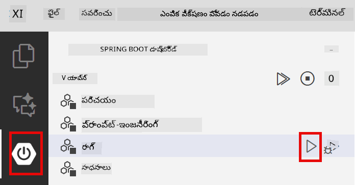
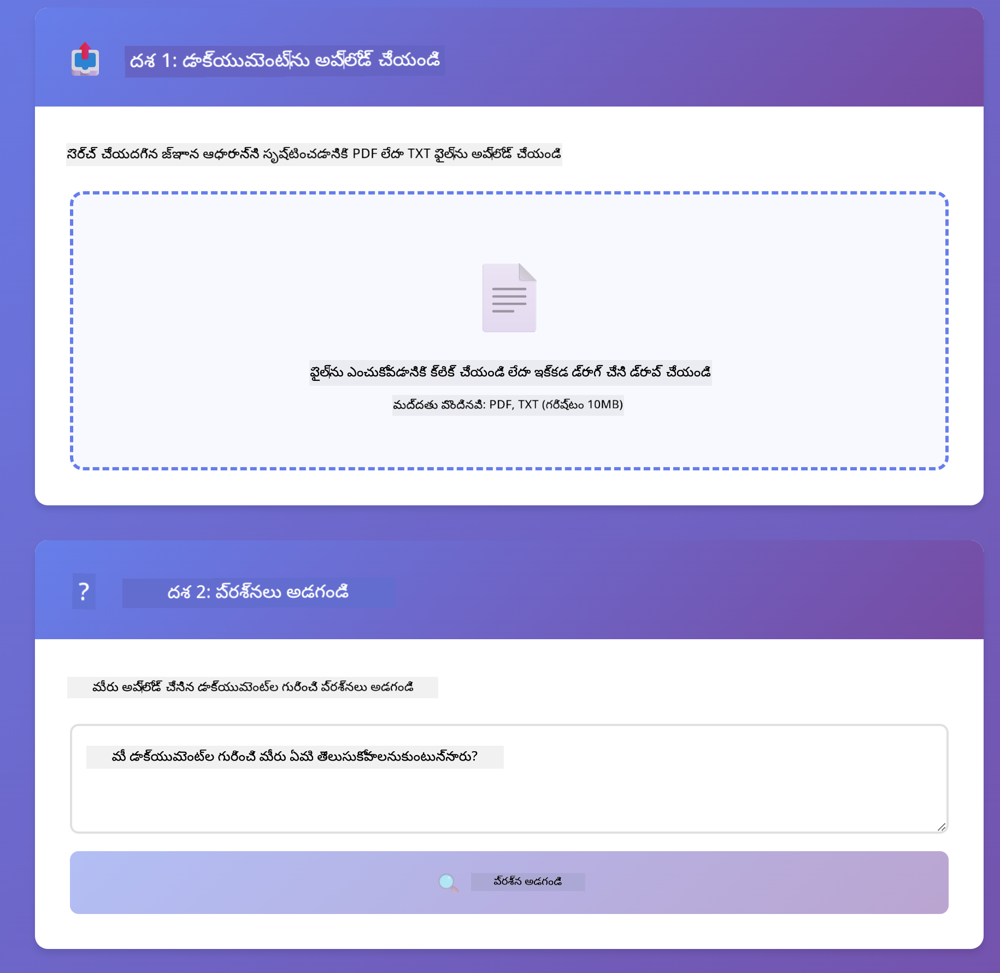
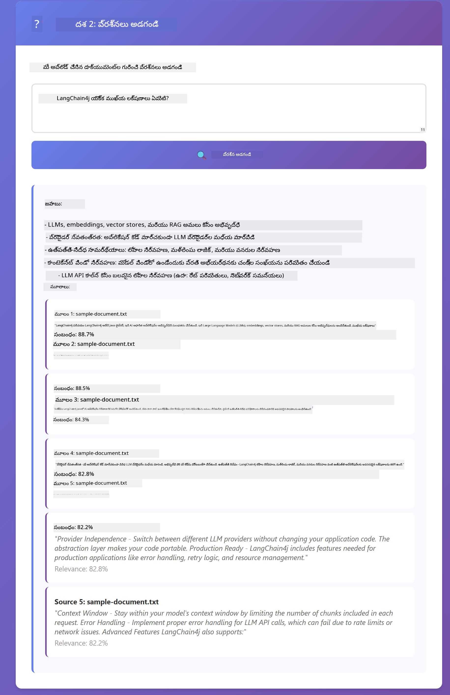

<!--
CO_OP_TRANSLATOR_METADATA:
{
  "original_hash": "f538a51cfd13147d40d84e936a0f485c",
  "translation_date": "2025-12-13T17:30:31+00:00",
  "source_file": "03-rag/README.md",
  "language_code": "te"
}
-->
# మాడ్యూల్ 03: RAG (రిట్రీవల్-ఆగ్మెంటెడ్ జనరేషన్)

## విషయ సూచిక

- [మీరు నేర్చుకునేది](../../../03-rag)
- [ముందస్తు అవసరాలు](../../../03-rag)
- [RAG అర్థం చేసుకోవడం](../../../03-rag)
- [ఇది ఎలా పనిచేస్తుంది](../../../03-rag)
  - [డాక్యుమెంట్ ప్రాసెసింగ్](../../../03-rag)
  - [ఎంబెడ్డింగ్స్ సృష్టించడం](../../../03-rag)
  - [సెమాంటిక్ సెర్చ్](../../../03-rag)
  - [జవాబు ఉత్పత్తి](../../../03-rag)
- [అప్లికేషన్ నడపడం](../../../03-rag)
- [అప్లికేషన్ ఉపయోగించడం](../../../03-rag)
  - [డాక్యుమెంట్ అప్‌లోడ్ చేయండి](../../../03-rag)
  - [ప్రశ్నలు అడగండి](../../../03-rag)
  - [మూల సూచనలను తనిఖీ చేయండి](../../../03-rag)
  - [ప్రశ్నలతో ప్రయోగం చేయండి](../../../03-rag)
- [ప్రధాన భావనలు](../../../03-rag)
  - [చంకింగ్ వ్యూహం](../../../03-rag)
  - [సామ్య స్కోర్లు](../../../03-rag)
  - [ఇన్-మెమరీ నిల్వ](../../../03-rag)
  - [కాంటెక్స్ట్ విండో నిర్వహణ](../../../03-rag)
- [ఎప్పుడు RAG ముఖ్యం అవుతుంది](../../../03-rag)
- [తరువాతి దశలు](../../../03-rag)

## మీరు నేర్చుకునేది

మునుపటి మాడ్యూల్స్‌లో, మీరు AIతో సంభాషణలు ఎలా చేయాలో మరియు మీ ప్రాంప్ట్‌లను సమర్థవంతంగా ఎలా నిర్మించాలో నేర్చుకున్నారు. కానీ ఒక ప్రాథమిక పరిమితి ఉంది: భాషా మోడల్స్ శిక్షణ సమయంలో నేర్చుకున్నదే మాత్రమే తెలుసుకుంటాయి. అవి మీ కంపెనీ విధానాలు, మీ ప్రాజెక్ట్ డాక్యుమెంటేషన్ లేదా శిక్షణ పొందని ఏ సమాచారంపై ప్రశ్నలకు జవాబు ఇవ్వలేవు.

RAG (రిట్రీవల్-ఆగ్మెంటెడ్ జనరేషన్) ఈ సమస్యను పరిష్కరిస్తుంది. మోడల్‌కు మీ సమాచారాన్ని నేర్పించడానికి ప్రయత్నించకుండా (అది ఖరీదైనది మరియు అనుకూలం కాదు), మీరు దానికి మీ డాక్యుమెంట్లలో శోధించగల సామర్థ్యాన్ని ఇస్తారు. ఎవరో ప్రశ్న అడిగితే, సిస్టమ్ సంబంధిత సమాచారాన్ని కనుగొని ప్రాంప్ట్‌లో చేర్చుతుంది. ఆ తర్వాత మోడల్ ఆ పొందిన కాంటెక్స్ట్ ఆధారంగా జవాబు ఇస్తుంది.

RAGని మోడల్‌కు ఒక సూచన గ్రంథాలయం ఇచ్చినట్లు భావించండి. మీరు ప్రశ్న అడిగితే, సిస్టమ్:

1. **వినియోగదారు ప్రశ్న** - మీరు ప్రశ్న అడుగుతారు  
2. **ఎంబెడ్డింగ్** - మీ ప్రశ్నను వెక్టర్‌గా మార్చుతుంది  
3. **వెక్టర్ సెర్చ్** - సమానమైన డాక్యుమెంట్ చంక్‌లను కనుగొంటుంది  
4. **కాంటెక్స్ట్ అసెంబ్లీ** - సంబంధిత చంక్‌లను ప్రాంప్ట్‌లో చేర్చుతుంది  
5. **ప్రతిస్పందన** - LLM ఆ కాంటెక్స్ట్ ఆధారంగా జవాబు ఉత్పత్తి చేస్తుంది  

ఇది మోడల్ యొక్క జవాబులను శిక్షణ జ్ఞానంపై ఆధారపడకుండా, మీ వాస్తవ డేటాలోనే స్థిరపరుస్తుంది.


*RAG వర్క్‌ఫ్లో - వినియోగదారు ప్రశ్న నుండి సెమాంటిక్ సెర్చ్ వరకు, కాంటెక్స్చువల్ జవాబు ఉత్పత్తి*

## ముందస్తు అవసరాలు

- మాడ్యూల్ 01 పూర్తి చేసుకున్నది (Azure OpenAI వనరులు అమర్చబడ్డాయి)  
- రూట్ డైరెక్టరీలో `.env` ఫైల్ Azure క్రెడెన్షియల్స్‌తో (మాడ్యూల్ 01లో `azd up` ద్వారా సృష్టించబడింది)  

> **గమనిక:** మీరు మాడ్యూల్ 01 పూర్తి చేయకపోతే, ముందుగా అక్కడ ఉన్న అమరిక సూచనలను అనుసరించండి.

## ఇది ఎలా పనిచేస్తుంది

**డాక్యుమెంట్ ప్రాసెసింగ్** - [DocumentService.java](../../../03-rag/src/main/java/com/example/langchain4j/rag/service/DocumentService.java)

మీరు డాక్యుమెంట్ అప్‌లోడ్ చేసినప్పుడు, సిస్టమ్ దాన్ని చంక్‌లుగా విభజిస్తుంది - మోడల్ యొక్క కాంటెక్స్ట్ విండోలో సులభంగా సరిపోయే చిన్న భాగాలు. ఈ చంక్‌లు కొంత Overlap కలిగి ఉంటాయి, అందువల్ల సరిహద్దుల్లో కాంటెక్స్ట్ కోల్పోరు.

```java
Document document = FileSystemDocumentLoader.loadDocument("sample-document.txt");

DocumentSplitter splitter = DocumentSplitters
    .recursive(300, 30, new OpenAiTokenizer());

List<TextSegment> segments = splitter.split(document);
```
  
> **🤖 [GitHub Copilot](https://github.com/features/copilot) చాట్‌తో ప్రయత్నించండి:** [`DocumentService.java`](../../../03-rag/src/main/java/com/example/langchain4j/rag/service/DocumentService.java) తెరవండి మరియు అడగండి:  
> - "LangChain4j డాక్యుమెంట్లను చంక్‌లుగా ఎలా విభజిస్తుంది మరియు Overlap ఎందుకు ముఖ్యం?"  
> - "వివిధ డాక్యుమెంట్ రకాల కోసం ఉత్తమ చంక్ పరిమాణం ఎంత మరియు ఎందుకు?"  
> - "బహుభాషా డాక్యుమెంట్లు లేదా ప్రత్యేక ఫార్మాటింగ్ ఉన్న డాక్యుమెంట్లను ఎలా నిర్వహించాలి?"

**ఎంబెడ్డింగ్స్ సృష్టించడం** - [LangChainRagConfig.java](../../../03-rag/src/main/java/com/example/langchain4j/rag/config/LangChainRagConfig.java)

ప్రతి చంక్‌ను ఎంబెడ్డింగ్ అనే సంఖ్యాత్మక ప్రాతినిధ్యంగా మార్చుతారు - ఇది వచనం యొక్క అర్థాన్ని పట్టుకునే గణితీయ ఫింగర్ప్రింట్. సమానమైన వచనం సమాన ఎంబెడ్డింగ్స్ ఉత్పత్తి చేస్తుంది.

```java
@Bean
public EmbeddingModel embeddingModel() {
    return OpenAiOfficialEmbeddingModel.builder()
        .baseUrl(azureOpenAiEndpoint)
        .apiKey(azureOpenAiKey)
        .modelName(azureEmbeddingDeploymentName)
        .build();
}

EmbeddingStore<TextSegment> embeddingStore = 
    new InMemoryEmbeddingStore<>();
```
  


*ఎంబెడ్డింగ్ స్థలంలో వెక్టర్లుగా ప్రాతినిధ్యం వహిస్తున్న డాక్యుమెంట్లు - సమాన కంటెంట్ సమూహాలు కలిసి ఉంటాయి*

**సెమాంటిక్ సెర్చ్** - [RagService.java](../../../03-rag/src/main/java/com/example/langchain4j/rag/service/RagService.java)

మీరు ప్రశ్న అడిగితే, ఆ ప్రశ్న కూడా ఎంబెడ్డింగ్‌గా మారుతుంది. సిస్టమ్ మీ ప్రశ్న ఎంబెడ్డింగ్‌ను అన్ని డాక్యుమెంట్ చంక్‌ల ఎంబెడ్డింగ్‌లతో పోల్చుతుంది. ఇది కీవర్డ్స్ సరిపోలిక కాకుండా, అసలు సెమాంటిక్ సమానత కలిగిన చంక్‌లను కనుగొంటుంది.

```java
Embedding queryEmbedding = embeddingModel.embed(question).content();

List<EmbeddingMatch<TextSegment>> matches = 
    embeddingStore.findRelevant(queryEmbedding, 5, 0.7);

for (EmbeddingMatch<TextSegment> match : matches) {
    String relevantText = match.embedded().text();
    double score = match.score();
}
```
  
> **🤖 [GitHub Copilot](https://github.com/features/copilot) చాట్‌తో ప్రయత్నించండి:** [`RagService.java`](../../../03-rag/src/main/java/com/example/langchain4j/rag/service/RagService.java) తెరవండి మరియు అడగండి:  
> - "ఎంబెడ్డింగ్స్‌తో సామ్య సెర్చ్ ఎలా పనిచేస్తుంది మరియు స్కోర్‌ను ఏమి నిర్ణయిస్తుంది?"  
> - "ఏ సామ్య పరిమితిని ఉపయోగించాలి మరియు అది ఫలితాలపై ఎలా ప్రభావం చూపుతుంది?"  
> - "సంబంధిత డాక్యుమెంట్లు కనుగొనబడని సందర్భాలను ఎలా నిర్వహించాలి?"

**జవాబు ఉత్పత్తి** - [RagService.java](../../../03-rag/src/main/java/com/example/langchain4j/rag/service/RagService.java)

అత్యంత సంబంధిత చంక్‌లు మోడల్‌కు ప్రాంప్ట్‌లో చేర్చబడతాయి. మోడల్ ఆ ప్రత్యేక చంక్‌లను చదివి, ఆ సమాచారంపై ఆధారపడి మీ ప్రశ్నకు జవాబు ఇస్తుంది. ఇది హల్యూసినేషన్‌ను నివారిస్తుంది - మోడల్ ముందు ఉన్నదే ఆధారంగా మాత్రమే జవాబు ఇస్తుంది.

## అప్లికేషన్ నడపడం

**అమరికను ధృవీకరించండి:**

రూట్ డైరెక్టరీలో `.env` ఫైల్ Azure క్రెడెన్షియల్స్‌తో ఉందని నిర్ధారించుకోండి (మాడ్యూల్ 01లో సృష్టించబడింది):  
```bash
cat ../.env  # AZURE_OPENAI_ENDPOINT, API_KEY, DEPLOYMENT చూపించాలి
```
  
**అప్లికేషన్ ప్రారంభించండి:**

> **గమనిక:** మీరు ఇప్పటికే మాడ్యూల్ 01 నుండి `./start-all.sh` ఉపయోగించి అన్ని అప్లికేషన్లు ప్రారంభించారంటే, ఈ మాడ్యూల్ ఇప్పటికే పోర్ట్ 8081పై నడుస్తోంది. కాబట్టి క్రింది స్టార్ట్ కమాండ్లను వదిలేసి నేరుగా http://localhost:8081 కి వెళ్లవచ్చు.

**ఎంపిక 1: స్ప్రింగ్ బూట్ డాష్‌బోర్డ్ ఉపయోగించడం (VS కోడ్ వినియోగదారులకు సిఫార్సు)**

డెవ్ కంటైనర్‌లో స్ప్రింగ్ బూట్ డాష్‌బోర్డ్ ఎక్స్‌టెన్షన్ ఉంటుంది, ఇది అన్ని స్ప్రింగ్ బూట్ అప్లికేషన్లను నిర్వహించడానికి విజువల్ ఇంటర్‌ఫేస్ అందిస్తుంది. మీరు దీన్ని VS కోడ్‌లో ఎడమవైపు యాక్టివిటీ బార్‌లో (స్ప్రింగ్ బూట్ చిహ్నం కోసం చూడండి) కనుగొనవచ్చు.

స్ప్రింగ్ బూట్ డాష్‌బోర్డ్ నుండి మీరు:  
- వర్క్‌స్పేస్‌లో అందుబాటులో ఉన్న అన్ని స్ప్రింగ్ బూట్ అప్లికేషన్లను చూడవచ్చు  
- ఒక క్లిక్‌తో అప్లికేషన్లను ప్రారంభించండి/ఆపండి  
- అప్లికేషన్ లాగ్‌లను రియల్-టైమ్‌లో వీక్షించండి  
- అప్లికేషన్ స్థితిని పర్యవేక్షించండి  

"rag" పక్కన ఉన్న ప్లే బటన్‌ను క్లిక్ చేసి ఈ మాడ్యూల్‌ను ప్రారంభించండి, లేదా అన్ని మాడ్యూల్స్‌ను ఒకేసారి ప్రారంభించండి.



**ఎంపిక 2: షెల్ స్క్రిప్ట్‌లు ఉపయోగించడం**

అన్ని వెబ్ అప్లికేషన్లను (మాడ్యూల్స్ 01-04) ప్రారంభించండి:

**Bash:**  
```bash
cd ..  # రూట్ డైరెక్టరీ నుండి
./start-all.sh
```
  
**PowerShell:**  
```powershell
cd ..  # రూట్ డైరెక్టరీ నుండి
.\start-all.ps1
```
  
లేదా కేవలం ఈ మాడ్యూల్‌ను ప్రారంభించండి:

**Bash:**  
```bash
cd 03-rag
./start.sh
```
  
**PowerShell:**  
```powershell
cd 03-rag
.\start.ps1
```
  
రూట్ `.env` ఫైల్ నుండి వాతావరణ చరాలు స్వయంచాలకంగా లోడ్ అవుతాయి మరియు JARలు లేనప్పుడు అవి నిర్మించబడతాయి.

> **గమనిక:** మీరు ప్రారంభించే ముందు అన్ని మాడ్యూల్స్‌ను మాన్యువల్‌గా నిర్మించాలనుకుంటే:  
>  
> **Bash:**  
> ```bash
> cd ..  # Go to root directory
> mvn clean package -DskipTests
> ```
  
> **PowerShell:**  
> ```powershell
> cd ..  # Go to root directory
> mvn clean package -DskipTests
> ```
  
మీ బ్రౌజర్‌లో http://localhost:8081 తెరవండి.

**ఆపడానికి:**

**Bash:**  
```bash
./stop.sh  # ఈ మాడ్యూల్ మాత్రమే
# లేదా
cd .. && ./stop-all.sh  # అన్ని మాడ్యూల్స్
```
  
**PowerShell:**  
```powershell
.\stop.ps1  # ఈ మాడ్యూల్ మాత్రమే
# లేదా
cd ..; .\stop-all.ps1  # అన్ని మాడ్యూల్స్
```


## అప్లికేషన్ ఉపయోగించడం

అప్లికేషన్ డాక్యుమెంట్ అప్‌లోడ్ మరియు ప్రశ్నల కోసం వెబ్ ఇంటర్‌ఫేస్ అందిస్తుంది.

<a href="images/rag-homepage.png"></a>

*RAG అప్లికేషన్ ఇంటర్‌ఫేస్ - డాక్యుమెంట్లు అప్‌లోడ్ చేసి ప్రశ్నలు అడగండి*

**డాక్యుమెంట్ అప్‌లోడ్ చేయండి**

మొదట డాక్యుమెంట్ అప్‌లోడ్ చేయండి - పరీక్ష కోసం TXT ఫైళ్లు ఉత్తమం. ఈ డైరెక్టరీలో `sample-document.txt` అందుబాటులో ఉంది, ఇది LangChain4j ఫీచర్లు, RAG అమలు, మరియు ఉత్తమ పద్ధతుల గురించి సమాచారం కలిగి ఉంది - సిస్టమ్‌ను పరీక్షించడానికి సరైనది.

సిస్టమ్ మీ డాక్యుమెంట్‌ను ప్రాసెస్ చేసి, చంక్‌లుగా విభజించి, ప్రతి చంక్‌కు ఎంబెడ్డింగ్స్ సృష్టిస్తుంది. ఇది మీరు అప్‌లోడ్ చేసిన వెంటనే ఆటోమేటిక్‌గా జరుగుతుంది.

**ప్రశ్నలు అడగండి**

ఇప్పుడు డాక్యుమెంట్ కంటెంట్ గురించి నిర్దిష్ట ప్రశ్నలు అడగండి. డాక్యుమెంట్‌లో స్పష్టంగా పేర్కొన్న వాస్తవాలను ప్రయత్నించండి. సిస్టమ్ సంబంధిత చంక్‌లను శోధించి, వాటిని ప్రాంప్ట్‌లో చేర్చి, జవాబు ఉత్పత్తి చేస్తుంది.

**మూల సూచనలను తనిఖీ చేయండి**

ప్రతి జవాబులో మూల సూచనలు మరియు సామ్య స్కోర్లు ఉంటాయి. ఈ స్కోర్లు (0 నుండి 1 వరకు) మీ ప్రశ్నకు ప్రతి చంక్ ఎంత సంబంధితమో చూపిస్తాయి. ఎక్కువ స్కోర్లు మంచి సరిపోలికలను సూచిస్తాయి. ఇది మీరు జవాబును మూల పదార్థంతో సరిపోల్చుకోవడానికి సహాయపడుతుంది.

<a href="images/rag-query-results.png"></a>

*ప్రశ్న ఫలితాలు - మూల సూచనలు మరియు సంబంధిత స్కోర్లతో జవాబు చూపించడం*

**ప్రశ్నలతో ప్రయోగం చేయండి**

వివిధ రకాల ప్రశ్నలు ప్రయత్నించండి:  
- నిర్దిష్ట వాస్తవాలు: "ప్రధాన విషయం ఏమిటి?"  
- పోలికలు: "X మరియు Y మధ్య తేడా ఏమిటి?"  
- సారాంశాలు: "Z గురించి ముఖ్యాంశాలను సారాంశం చేయండి"  

మీ ప్రశ్న డాక్యుమెంట్ కంటెంట్‌తో ఎంత బాగా సరిపోతుందో ఆధారంగా సంబంధిత స్కోర్లు ఎలా మారుతాయో గమనించండి.

## ప్రధాన భావనలు

**చంకింగ్ వ్యూహం**

డాక్యుమెంట్లు 300-టోకెన్ చంక్‌లుగా విభజించబడతాయి, 30 టోకెన్ల Overlapతో. ఈ సమతుల్యత ప్రతి చంక్‌కు అర్థవంతమైన కాంటెక్స్ట్ ఉండేలా చేస్తుంది, అలాగే ప్రాంప్ట్‌లో బహుళ చంక్‌లను చేర్చడానికి చిన్నదిగా ఉంచుతుంది.

**సామ్య స్కోర్లు**

స్కోర్లు 0 నుండి 1 వరకు ఉంటాయి:  
- 0.7-1.0: అత్యంత సంబంధిత, ఖచ్చిత సరిపోలిక  
- 0.5-0.7: సంబంధిత, మంచి కాంటెక్స్ట్  
- 0.5 కంటే తక్కువ: ఫిల్టర్ అవుతాయి, చాలా భిన్నమైనవి  

సిస్టమ్ నాణ్యత కోసం కనిష్ట పరిమితి పై చంక్‌లను మాత్రమే రిట్రీవ్ చేస్తుంది.

**ఇన్-మెమరీ నిల్వ**

ఈ మాడ్యూల్ సాదాసీదాగా ఇన్-మెమరీ నిల్వను ఉపయోగిస్తుంది. మీరు అప్లికేషన్‌ను రీస్టార్ట్ చేస్తే, అప్‌లోడ్ చేసిన డాక్యుమెంట్లు పోతాయి. ప్రొడక్షన్ సిస్టమ్‌లు Qdrant లేదా Azure AI Search వంటి స్థిరమైన వెక్టర్ డేటాబేస్‌లను ఉపయోగిస్తాయి.

**కాంటెక్స్ట్ విండో నిర్వహణ**

ప్రతి మోడల్‌కు గరిష్ట కాంటెక్స్ట్ విండో ఉంటుంది. పెద్ద డాక్యుమెంట్ నుండి ప్రతి చంక్‌ను చేర్చలేరు. సిస్టమ్ టాప్ N అత్యంత సంబంధిత చంక్‌లను (డిఫాల్ట్ 5) రిట్రీవ్ చేస్తుంది, పరిమితులలో ఉండి సరైన జవాబులకు తగినంత కాంటెక్స్ట్ అందించడానికి.

## ఎప్పుడు RAG ముఖ్యం అవుతుంది

**RAG ఉపయోగించండి:**
- స్వంత డాక్యుమెంట్లపై ప్రశ్నలకు జవాబు ఇవ్వడానికి  
- సమాచారం తరచుగా మారినప్పుడు (నియమాలు, ధరలు, స్పెసిఫికేషన్లు)  
- ఖచ్చితత్వానికి మూల సూచన అవసరం ఉన్నప్పుడు  
- కంటెంట్ ఒకే ప్రాంప్ట్‌లో సరిపోకపోతే  
- మీరు నిర్ధారించదగిన, స్థిరమైన జవాబులు కావాలంటే  

**RAG ఉపయోగించకండి:**
- మోడల్ ఇప్పటికే ఉన్న సాధారణ జ్ఞానం అవసరమైన ప్రశ్నలకు  
- రియల్-టైమ్ డేటా అవసరమైనప్పుడు (RAG అప్‌లోడ్ చేసిన డాక్యుమెంట్లపై పనిచేస్తుంది)  
- కంటెంట్ చిన్నదిగా ఉండి నేరుగా ప్రాంప్ట్‌లో చేర్చగలిగితే  

## తర్వాతి దశలు

**తరువాతి మాడ్యూల్:** [04-tools - టూల్స్‌తో AI ఏజెంట్లు](../04-tools/README.md)

---

**నావిగేషన్:** [← మునుపటి: మాడ్యూల్ 02 - ప్రాంప్ట్ ఇంజనీరింగ్](../02-prompt-engineering/README.md) | [ప్రధానానికి తిరిగి](../README.md) | [తరువాత: మాడ్యూల్ 04 - టూల్స్ →](../04-tools/README.md)

---

<!-- CO-OP TRANSLATOR DISCLAIMER START -->
**అస్పష్టత**:  
ఈ పత్రాన్ని AI అనువాద సేవ [Co-op Translator](https://github.com/Azure/co-op-translator) ఉపయోగించి అనువదించబడింది. మేము ఖచ్చితత్వానికి ప్రయత్నించినప్పటికీ, ఆటోమేటెడ్ అనువాదాల్లో పొరపాట్లు లేదా తప్పిదాలు ఉండవచ్చు. మూల పత్రం దాని స్వదేశీ భాషలో అధికారిక మూలంగా పరిగణించాలి. ముఖ్యమైన సమాచారానికి, ప్రొఫెషనల్ మానవ అనువాదం సిఫార్సు చేయబడుతుంది. ఈ అనువాదం వాడకం వల్ల కలిగే ఏవైనా అపార్థాలు లేదా తప్పుదారితీసే అర్థాలు కోసం మేము బాధ్యత వహించము.
<!-- CO-OP TRANSLATOR DISCLAIMER END -->