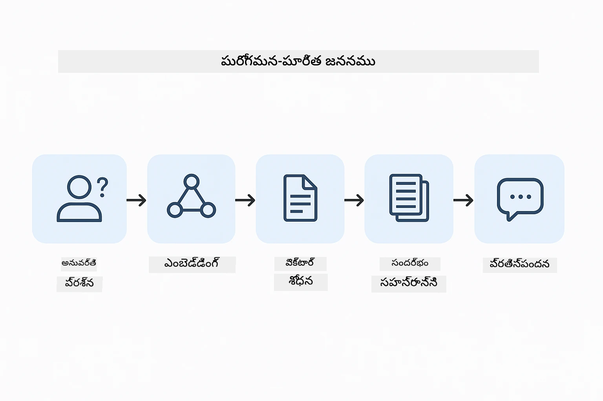
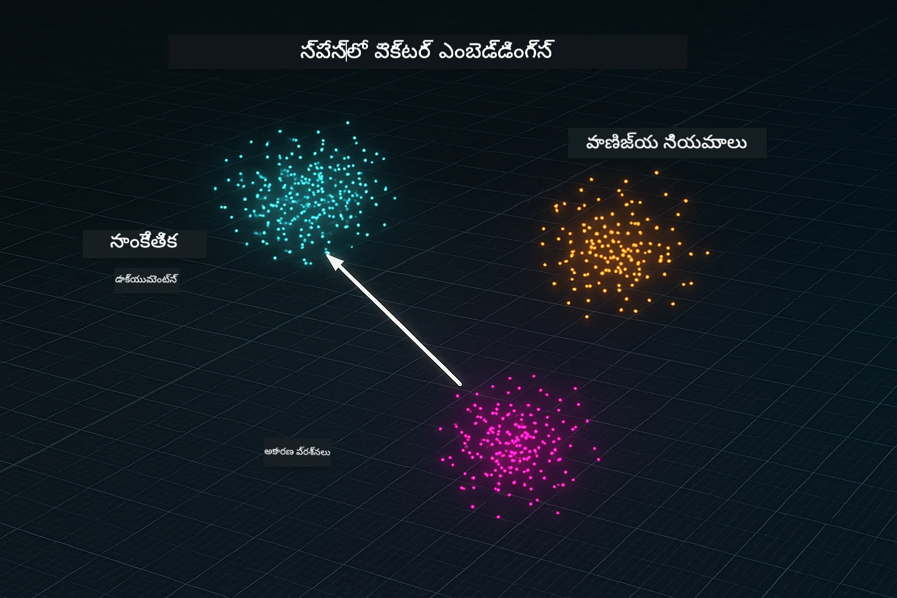
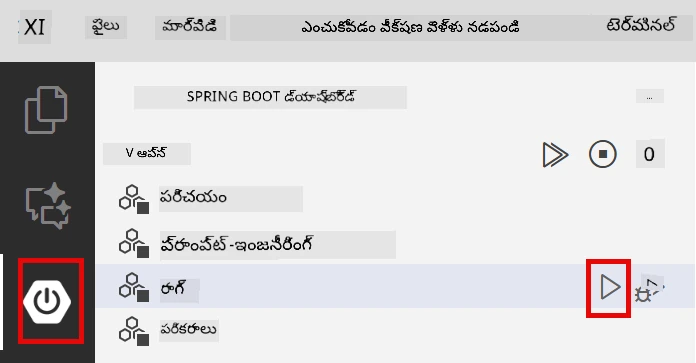
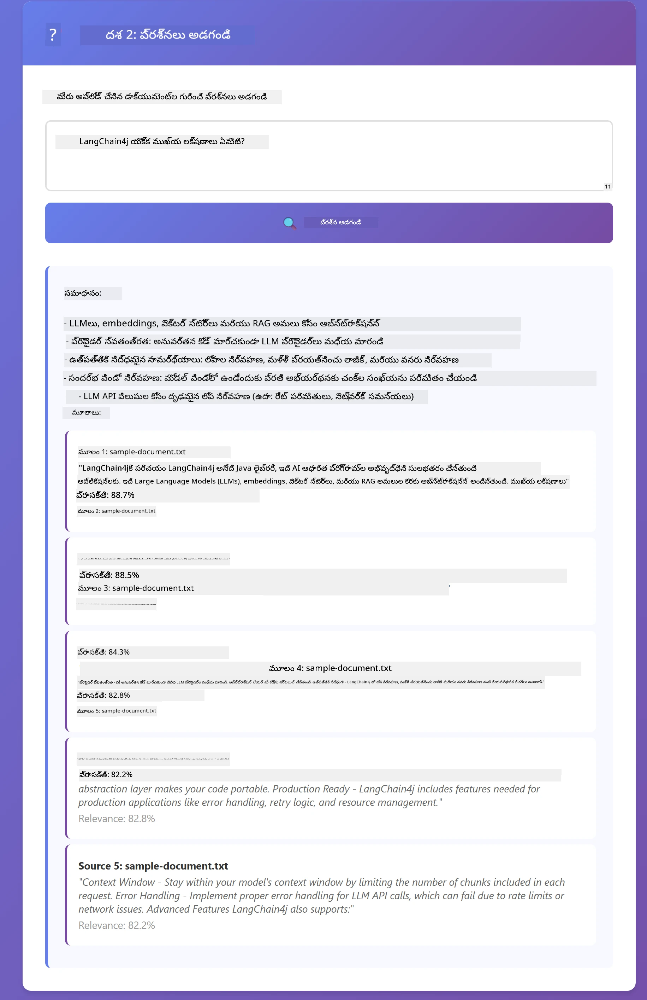

# మాడ్యూల్ 03: RAG (రిట్రీవల్-ఆగ్మెంటెడ్ జనరేషన్)

## విషయం పట్టిక

- [మీరు నేర్చుకోవాల్సింది](../../../03-rag)
- [ముందస్తు అవసరాలు](../../../03-rag)
- [RAG ని అవగాహన చేసుకోండి](../../../03-rag)
- [ఇది ఎలా పనిచేస్తుంది](../../../03-rag)
  - [సంరచనా ప్రాసెసింగ్](../../../03-rag)
  - [ఎంబెడ్డింగ్స్ సృష్టించడం](../../../03-rag)
  - [సెమాంటిక్ సెర్చ్](../../../03-rag)
  - [జవాబు ఉత్పత్తి](../../../03-rag)
- [అప్లికేషన్ నడపండి](../../../03-rag)
- [అప్లికేషన్ వాడకం](../../../03-rag)
  - [డాక్యుమెంట్ అప్‌లోడ్ చేయండి](../../../03-rag)
  - [ప్రశ్నలు అడగండి](../../../03-rag)
  - [మూల ఉల్లేఖనాలు తనిఖీ చేయండి](../../../03-rag)
  - [ప్రశ్నలతో ప్రయోగం చేయండి](../../../03-rag)
- [ముఖ్యమైన కాన్సెప్ట్‌లు](../../../03-rag)
  - [చంకింగ్ వ్యూహం](../../../03-rag)
  - [సమానతా స్కోర్లు](../../../03-rag)
  - [ఇన్-మెమరీ స్టోరేజ్](../../../03-rag)
  - [కాంటెక్స్ట్ విండో నిర్వహణ](../../../03-rag)
- [ఎప్పుడు RAG కీలకం](../../../03-rag)
- [తరువాతి దశలు](../../../03-rag)

## మీరు నేర్చుకునే దేన్ని

గత మాడ్యూల్స్ లో, మీరు AI తో సంభాషణలు జరిపేందుకు మరియు మీ ప్రాంప్ట్స్ ను సమర్థవంతంగా నిర్మించడం నేర్చుకున్నారు. కానీ ఒక మూలభూత పరిమితి ఉంది: భాషా మోడల్స్ ట్రైనింగ్ సమయంలో మాత్రమే నేర్చుకున్న దేన్ని తెలుసుకుంటాయి. అవి మీ కంపెనీ విధానాల గురించి, మీ ప్రాజెక్ట్ డాక్యుమెంటేషన్ గురించి లేదా శిక్షణ పొందనప్పటి అభినందనల గురించి ప్రశ్నలకు జవాబు ఇవ్వలేవు.

RAG (రిట్రీవల్-ఆగ్మెంటెడ్ జనరేషన్) ఈ సమస్యను పరిష్కరిస్తుంది. మోడల్ కు మీ సమాచారాన్ని నేర్పించే ప్రయత్నం చేయడం బదులు (ఇది ఖరీదైనది మరియు అవ్యవహారికం), మీరు దానికి మీ డాక్యుమెంట్లలో శోధించడానికి సామర్థ్యాన్ని ఇస్తారు. ఎవరు ప్రశ్న అడుగుతారో, సిస్టమ్ సంబంధిత సమాచారాన్ని కనుగొని ప్రాంప్ట్ లో చేర్చుతుంది. ఆ తర్వాత మోడల్ ఆ పొందిన సందర్భం ఆధారంగా జవాబు ఇస్తుంది.

RAG ని మోడల్ కు ఓ సూచిక గ్రంథాలయాన్ని ఇచ్చేలా ఆలోచించండి. మీరు ఒక ప్రశ్న అడుగుతే, సిస్టమ్:

1. **వినియోగదారుడి ప్రశ్న** - మీరు ప్రశ్న అడుగుతారు  
2. **ఎంబెడ్డింగ్** - మీ ప్రశ్నను వెక్టర్ గాను మార్చడం  
3. **వెక్క్టర్ శోధన** - సామాన్య డాక్యుమెంట్ చంక్స్ కనుగొనటం  
4. **సందర్భం సంయోజన** - ప్రాంప్ట్ కు సంబంధించిన చంక్లను జోడించడం  
5. **ప్రతిస్పందన** - LLM ఆ సందర్భాన్ని ఆధారంగా జవాబు ఇస్తుంది  

ఇది మోడల్ జవాబులను మీరు ఇచ్చిన వాస్తవ డేటా మీద ఆధారపడి ఉంటుంది, అభ్యాస జ్ఞానం లేదా ఊహించిన జవాబులపై ఆధారపడదు.



*RAG వర్క్‌ఫ్లో - వినియోగదారుడి ప్రశ్న నుండి సెమాంటిక్ సెర్చ్ వరకు, సందర్భ ఆధారిత జవాబు ఉత్పత్తి వరకు*

## ముందస్తు అవసరాలు

- మాడ్యూల్ 01 పూర్తి అయిరుండాలి (Azure OpenAI వనరులు డిప్లాయిడ్)
- రూట్ డైరెక్టరీలో `.env` ఫైల్ ఉండాలి, Azure క్రెడెన్షియల్స్ తో (మాడ్యూల్ 01 లో `azd up` ద్వారా సృష్టించబడింది)

> **గమనిక:** మీరు మాడ్యూల్ 01 పూర్తి చేయకపోయినట్లయితే, ముందుగా అక్కడ డిప్లాయ్ విధానాలను అనుసరించండి.


## ఇది ఎలా పనిచేస్తుంది

### సంరచనా ప్రాసెసింగ్

[DocumentService.java](../../../03-rag/src/main/java/com/example/langchain4j/rag/service/DocumentService.java)

మీరు ఒక డాక్యుమెంట్ అప్‌లోడ్ చేసినప్పుడు, సిస్టమ్ దాన్ని చంక్స్‌గా విభజిస్తుంది - మోడల్ కాంటెక్స్ట్ విండోకు సౌకర్యంగా సరిపోయే చిన్న భాగాలు. ఈ చంక్స్ కొంచెం అడ్డుకుడి ఉంటాయి, అందువల్ల మీకు సరిహద్దుల్లో సందర్భం కోల్పోకుండా ఉంటుంది.

```java
Document document = FileSystemDocumentLoader.loadDocument("sample-document.txt");

DocumentSplitter splitter = DocumentSplitters
    .recursive(300, 30, new OpenAiTokenizer());

List<TextSegment> segments = splitter.split(document);
```

> **🤖 [GitHub Copilot](https://github.com/features/copilot) చాట్‌తో ప్రయత్నించండి:** తెరవండి [`DocumentService.java`](../../../03-rag/src/main/java/com/example/langchain4j/rag/service/DocumentService.java) మరియు అడగండి:  
> - "LangChain4j డాక్యుమెంట్లను ఎలా చంక్స్‌గా విభజిస్తుంది మరియు అడ్డుకుడి ఎందుకు ముఖ్యం?"  
> - "విభిన్న డాక్యుమెంట్ రకాల కోసం ఉత్తమ చంక్ పరిమాణం ఎంత మరియు ఎందుకు?"  
> - "బహుళ భాషల డాక్యూమెంట్లు లేదా ప్రత్యేక ఫార్మాటింగ్ ఉన్న డాక్యూమెంట్లను ఎలా నిర్వహించాలి?"

### ఎంబెడ్డింగ్స్ సృష్టించడం

[LangChainRagConfig.java](../../../03-rag/src/main/java/com/example/langchain4j/rag/config/LangChainRagConfig.java)

ప్రతి చంక్‌ను ఒక సంఖ్యాత్మక ప్రతినిధిత్వంగా మార్చబడుతుంది, దీనిని ఎంబెడ్డింగ్ అంటారు - ఇది వచనం యొక్క అర్థాన్ని పట్టుకునే గణితాత్మక వేలితో గుర్తింపు. సమానమైన వచనం ఒకటేలా ఎంబెడ్డింగ్స్ ఉత్పత్తి చేస్తుంది.

```java
@Bean
public EmbeddingModel embeddingModel() {
    return OpenAiOfficialEmbeddingModel.builder()
        .baseUrl(azureOpenAiEndpoint)
        .apiKey(azureOpenAiKey)
        .modelName(azureEmbeddingDeploymentName)
        .build();
}

EmbeddingStore<TextSegment> embeddingStore = 
    new InMemoryEmbeddingStore<>();
```



*ఎంబెడ్డింగ్ స్థలంలో వెక్టర్లుగా ప్రదర్శించబడిన డాక్యుమెంట్లు - సమాన కంటెంట్ సమూహాలు*

### సెమాంటిక్ సెర్చ్

[RagService.java](../../../03-rag/src/main/java/com/example/langchain4j/rag/service/RagService.java)

మీరు ప్రశ్న అడిగితే, మీ ప్రశ్న కూడా ఒక ఎంబెడ్డింగ్ అవుతుంది. సిస్టమ్ మీ ప్రశ్న యొక్క ఎంబెడ్డింగ్ ను అన్ని డాక్యుమెంట్ చంక్ ఎంబెడ్డింగ్స్ తో సరిపోల్చుతుంది. ఇది కీవర్డ్స్ సరిపోలిక మాత్రమే కాకుండా, అసలు సెమాంటిక్ సరిపోయే చంక్స్ ను కనుగొంటుంది.

```java
Embedding queryEmbedding = embeddingModel.embed(question).content();

List<EmbeddingMatch<TextSegment>> matches = 
    embeddingStore.findRelevant(queryEmbedding, 5, 0.7);

for (EmbeddingMatch<TextSegment> match : matches) {
    String relevantText = match.embedded().text();
    double score = match.score();
}
```

> **🤖 [GitHub Copilot](https://github.com/features/copilot) చాట్‌తో ప్రయత్నించండి:** [`RagService.java`](../../../03-rag/src/main/java/com/example/langchain4j/rag/service/RagService.java) తెరవండి మరియు అడగండి:  
> - "ఎంబెడ్డింగ్స్ తో సామాన్యతా శోధన ఎలా పనిచేస్తుంది మరియు స్కోర్‌ను ఏమి నిర్ణయిస్తుంది?"  
> - "ఎంతో సామాన్యతా పరిమితిని ఎప్పుడు ఉపయోగించాలి మరియు ఫలితాలపై దాని ప్రభావం ఏమిటి?"  
> - "సంబంధిత డాక్యుమెంట్లు కనబడకపోవడం అనే సందర్భాలను ఎలా నిర్వహించాలి?"

### జవాబు ఉత్పత్తి

[RagService.java](../../../03-rag/src/main/java/com/example/langchain4j/rag/service/RagService.java)

అత్యంత సంబంధిత చంక్స్ ను మోడల్ కు ప్రాంప్ట్ లో చేర్చబడతాయి. మోడల్ ఆ ప్రత్యేక చంక్స్ ని చదివి, ఆ సమాచారంపై ఆధారపడుకొని మీ ప్రశ్నకు జవాబు ఇస్తుంది. ఇది హెల్యుసినేషన్ నివారిస్తుంది - మోడల్ ముందు ఉన్నదే కాకుండా జవాబు ఇవ్వలేవు.

## అప్లికేషన్ నడపండి

**డిప్లాయ్‌మెంట్ నిర్ధారించుకోండి:**

రూట్ డైరెక్టరీలో `.env` ఫైల్ Azure క్రెడెన్షియల్స్ తో ఉన్నట్లు నిర్ధారించుకోండి (మాడ్యూల్ 01 లో సృష్టించబడింది):
```bash
cat ../.env  # AZURE_OPENAI_ENDPOINT, API_KEY, DEPLOYMENT చూపించాలి
```

**అప్లికేషన్ ప్రారంభించండి:**

> **గమనిక:** మీరు మాడ్యూల్ 01 నుండి `./start-all.sh` ఉపయోగించి అన్ని అప్లికేషన్లను ఇప్పటికే ప్రారంభించారా అంటే, ఈ మాడ్యూల్ ఇప్పటికే 8081 పోర్ట్ లో నడుస్తోంది. మీరు క్రింది స్టార్ట్ ఆజ్ఞలను వదిలేసి http://localhost:8081 కి వెళ్ళొచ్చు.

**వికల్పం 1: స్ప్రింగ్ బూట్ డ్యాష్‌బోర్డ్ ఉపయోగించడం (VS Code వినియోగదారులకు సూచించబడింది)**

డెవ్ కంటైనర్ స్ప్రింగ్ బూట్ డ్యాష్‌బోర్డ్ ఎక్స్‌టెన్షన్ తో వస్తుంది, ఇది అన్ని స్ప్రింగ్ బూట్ అప్లికేషన్లను నిర్వహించే దృశ్య ఇంటర్ఫేస్ అందిస్తుంది. మీరు దీన్ని VS Code ఎడమవైపు యాక్టివిటీ బార్‌లోంచి (స్ప్రింగ్ బూట్ చిహ్నం కోసం చూడండి) గుర్తించవచ్చు.

స్ప్రింగ్ బూట్ డ్యాష్‌బోర్డ్ నుండి, మీరు:  
- వర్క్‌స్పేస్ లో అందుబాటులో ఉన్న అన్ని స్ప్రింగ్ బూట్ అప్లికేషన్లు చూడవచ్చు  
- ఒక క్లిక్ తో అప్లికేషన్లను ప్రారంభించడం/ఆపడం చేయవచ్చు  
- అప్లికేషన్ లాగ్‌లు రియల్-టైమ్ లో చూడవచ్చు  
- అప్లికేషన్ స్థితి పర్యవేక్షించవచ్చు  

“rag” పక్కన ఉన్న ప్లే బటన్ ని క్లిక్ చేసి ఈ మాడ్యూల్ ను ప్రారంభించండి, లేక ఒకేసారి అన్ని మాడ్యూల్స్ ప్రారంభించండి.



**వికల్పం 2: షెల్ స్క్రిప్ట్స్ ఉపయోగించడం**

అన్ని వెబ్ అప్లికేషన్లు (మాడ్యూల్స్ 01-04) ప్రారంభించండి:

**Bash:**
```bash
cd ..  # రూట్ డైరక్టరీ నుండి
./start-all.sh
```

**PowerShell:**
```powershell
cd ..  # రూట్ డైరెక్టరీ నుండి
.\start-all.ps1
```

లేదా కేవలం ఈ మాడ్యూల్ ప్రారంభించండి:

**Bash:**
```bash
cd 03-rag
./start.sh
```

**PowerShell:**
```powershell
cd 03-rag
.\start.ps1
```

రూట్ `.env` ఫైల్ నుండి పర్యావరణ చరాలు ఈ రెండింటి స్క్రిప్ట్‌లు ఆటోమేటిక్ లోడ్ చేస్తాయి మరియు JARలు లేవనప్పుడు డ bouwen చేస్తాయి.

> **గమనిక:** మీరు ప్రారంభించే ముందు అన్ని మాడ్యూల్స్ ను మాన్యువల్ గా బిల్డ్ చేయాలనుకుంటే:
>
> **Bash:**
> ```bash
> cd ..  # Go to root directory
> mvn clean package -DskipTests
> ```

> **PowerShell:**
> ```powershell
> cd ..  # Go to root directory
> mvn clean package -DskipTests
> ```

మీ బ్రౌజర్లో http://localhost:8081 ఓపెన్ చేయండి.

**ఆపు కీ:**

**Bash:**
```bash
./stop.sh  # ఈ మాడ్యూల్ మాత్రమే
# లేదా
cd .. && ./stop-all.sh  # అన్ని మాడ్యూల్స్
```

**PowerShell:**
```powershell
.\stop.ps1  # ఈ మాడ్యూల్ మాత్రమే
# లేదా
cd ..; .\stop-all.ps1  # అన్ని మాడ్యూల్స్
```

## అప్లికేషన్ వాడకం

అప్లికేషన్ డాక్యుమెంట్ అప్‌లోడ్ మరియు ప్రశ్న అడగడానికి వెబ్ ఇంటర్ఫేస్ అందిస్తుంది.

<a href="images/rag-homepage.png"></a>

*RAG అప్లికేషన్ ఇంటర్‌ఫేస్ - డాక్యుమెంట్లు అప్‌లోడ్ చేసి ప్రశ్నలు అడగండి*

### డాక్యుమెంట్ అప్‌లోడ్ చేయండి

TXTs వర్గం పరీక్షకు మంచిది. ఈ డైరెక్టరీలో `sample-document.txt` అందుబాటులో ఉంది, ఇది LangChain4j లక్షణాలు, RAG అమలీకరణ, మరియు ఉత్తమ పద్ధతులు గురించి సమాచారం కలిగి ఉంది - సిస్టమ్ ను పరీక్షించేందుకు అనుకూలమైనది.

సిస్టమ్ మీ డాక్యుమెంట్ ని ప్రాసెస్ చేసి, దాన్ని చంక్స్ గా విభజించి, ప్రతి చంక్ కి ఎంబెడ్డింగ్స్ సృష్టిస్తుంది. ఇది మీరు అప్‌లోడ్ చేసినప్పుడు ఆటోమేటిగ్గా జరుగుతుంది.

### ప్రశ్నలు అడగండి

ఇప్పుడు డాక్యుమెంట్ విషయంపై ప్రత్యేకమైన ప్రశ్నలు అడగండి. డాక్యుమెంట్ లో స్పష్టంగా వ్రాయబడిన వాస్తవాలను అడగండి. సిస్టమ్ సంబంధిత చంక్స్‌ను శోధించి, వాటిని ప్రాంప్ట్ లో చేర్పించి జవాబు ఇస్తుంది.

### మూల ఉల్లేఖనాలు తనిఖీ చేయండి

ప్రతి జవాబులో మూల ఉల్లేఖనాలు స్కోర్లతో ఉన్నాయి. ఈ స్కోర్లు (0 నుండి 1 వరకు) మీ ప్రశ్నకు ప్రతి చంక్ ఎంత సంబంధించిందో చూపిస్తాయి. ఎక్కువ స్కోర్లు అంటే మెరుగైన సరిపోలికలు. ఇది మీరు జవాబును మూల పదార్థంతో పూర్వానుమానం చేయడానికి సహాయపడుతుంది.

<a href="images/rag-query-results.png"></a>

*ప్రశ్న ఫలితాలు - మూల ఉల్లేఖనలు మరియు సంబంధిత స్కోర్లు తో కూడిన జవాబు ఉంది*

### ప్రశ్నలతో ప్రయోగం చేయండి

వివిధ రకాల ప్రశ్నలు ప్రయత్నించండి:  
- ప్రత్యేక వాస్తవాలు: "ప్రధాన విషయం ఏమిటి?"  
- పోలికలు: "X మరియు Y మధ్య తేడా ఏమిటి?"  
- సారాంశాలు: "Z గురించి ముఖ్యమైన పాయింట్ల సారాంశం చెప్పండి"

మీ ప్రశ్న డాక్యుమెంట్ కంటెంట్ తో ఎంత మంచిగా సరిపోతుందో ఆధారంగా సంబంధిత స్కోర్లు ఎలా మారుతాయో గమనించండి.

## ముఖ్యమైన కాన్సెప్ట్‌లు

### చంకింగ్ వ్యూహం

డాక్యుమెంట్లు 300-టోకెన్ చంక్స్ గా విభజించబడతాయి, 30 టోకెన్ల అడ్డుకూడి ఉంటుంది. ఈ సమతుల్యతతో ప్రతి చంక్ ఒక ఉన్నతమైన సందర్భం కలిగి ఉండి, ఒక ప్రాంప్ట్ లో అనేక చంక్స్ చేర్చడం వీలవుతుంది.

### సామాన్యతా స్కోర్లు

స్కోర్లు 0 నుండి 1 వరకూ ఉంటాయి:  
- 0.7-1.0: చాలా సంబంధితము, ఖచ్చితమైన సరిపోలిక  
- 0.5-0.7: సంబంధితము, మంచిది సందర్భం  
- 0.5 కంటే తక్కువ: ఫిల్టర్ అయిపోయింది, చాలా భిన్నం

పరిమితుల కంటే తక్కువ ఉన్న చంక్స్ మాత్రమే తీసుకోబడతాయి, దీని వల్ల నాణ్యత ఉంటాయి.

### ఇన్-మెమరీ స్టోరేజ్

ఈ మాడ్యూల్ సౌలభ్యంకోసం ఇన్-మెమరీ స్టోరేజ్ ఉపయోగిస్తుంది. మీరు అప్లికేషన్ రీస్టార్ట్ చేసేటప్పుడు, అప్‌లోడ్ చేసిన డాక్యుమెంట్లు కోల్పోతాయి. ప్రొడక్షన్ సిస్టమ్స్ Qdrant లేదా Azure AI Search లాంటి స్థిర వెక్టర్ డేటాబేస్ లను ఉపయోగిస్తాయి.

### కాంటెక్స్ట్ విండో నిర్వహణ

ప్రతి మోడల్ కు గరిష్ఠ కాంటెక్స్ట్ విండో పరిమితి ఉంటుంది. పెద్ద డాక్యుమెంట్ నుండి ప్రతిచంక్ జోడించడం సాధ్యం కాదు. సిస్టమ్ అత్యంత సంబంధిత టాప్ N చంక్స్ (డిఫాల్ట్ 5) తీసుకుని పరిమితులలో ఉంటూ సముచిత సందర్భాన్ని అందిస్తుంది.

## ఎప్పుడు RAG కీలకం

**RAG ఉపయోగించాలి:**
- మలికదస్త్రాల గురించి ప్రశ్నలకు జవాబు ఇవ్వేటప్పుడు  
- సమాచారం తరచూ మారుతుంటే (విధానాలు, ధరలు, నిర్దేశాలు)  
- ఖచ్చితత్వం మూల ఉల్లేఖనంతో కావాలి  
- కంటెంట్ ఒకే ఒక ప్రాంప్ట్ లోకి సరిపోవడంలో చిన్నది కాదు  
- మీరు నిర్ధారించదగిన, స్థిరమైన జవాబులు కావాలి  

**RAG ఉపయోగించకూడదు:**
- ప్రశ్నలు మోడల్ ఇప్పటికే తెలియని సాధారణ జ్ఞానం కోసం కావాలి అంటే  
- రియల్-టైమ్ డేటా అవసరం అయితే (RAG అప్‌లోడ్ చేసిన డాక్యుమెంట్లకు పని చేస్తుంది)  
- కంటెంట్ చాలా చిన్నది, దీన్ని డైరెక్ట్ గా ప్రాంప్ట్ లో చేర్చొచ్చు

## తర్వాతి దశలు

**తర్వాతి మాడ్యూల్:** [04-tools - ఏఐ ఏజెంట్స్ విత్ టూల్స్](../04-tools/README.md)

---

**నావిగేషన్:** [← ముందు: మాడ్యూల్ 02 - ప్రాంప్ట్ ఇంజనీరింగ్](../02-prompt-engineering/README.md) | [ప్రధానానికి తిరిగి](../README.md) | [తర్వాత: మాడ్యూల్ 04 - టూల్స్ →](../04-tools/README.md)

---

<!-- CO-OP TRANSLATOR DISCLAIMER START -->
**సహా నిజ కేసరి**:  
ఈ డాక్యుమెంట్ [Co-op Translator](https://github.com/Azure/co-op-translator) అనే AI అనువాద సేవను ఉపయోగించి అనువదించబడినది. మేము ఖచ్చితత్వానికి ప్రయత్నిస్తూనే ఉన్నప్పటికీ, ఆటోమేటెడ్ అనువాదాలలో తప్పులు లేదా అస్పష్టతలు ఉండొచ్చు. మౌలిక భాషలో ఉన్న అసలు డాక్యుమెంట్ ఆధ్యాత్మిక వనరుగా భావించాలి. ముఖ్యమైన సమాచారం కోసం, నిపుణ హ్యూమన్ అనువాదం చేయించుకోవడం ఉత్తమం. ఈ అనువాదం వలన కలిగే ఏవైనా గందరగోళాలు లేదా తప్పుదృష్టులకు మేము బాధ్యత వహించము.
<!-- CO-OP TRANSLATOR DISCLAIMER END -->